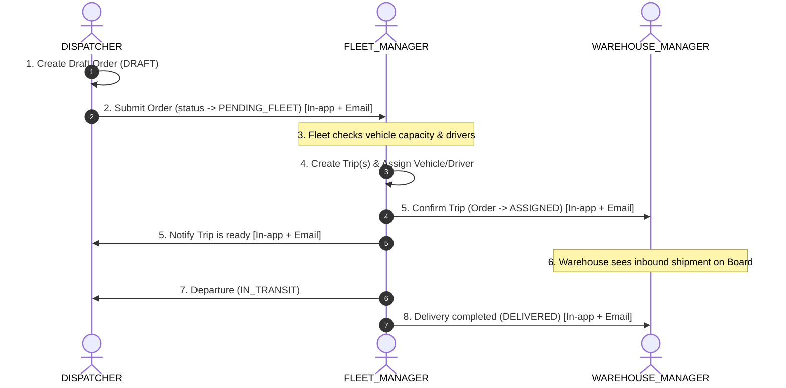

# TMS Domain Lead — Logistics TMS Business Architecture

> **Role**: Team Lead for all Transportation Management System (TMS) business logic, operational workflows, and dispatch governance.
> All decisions regarding **who does what, lifecycle transitions, authorization boundaries, and notification triggers** MUST reference this skill first.
> This skill defines **WHAT & WHY** (Business), while [`nestjs-best-practices`](../nestjs-best-practices/SKILL.md) and [`nextjs-best-practices`](../nextjs-best-practices/SKILL.md) define **HOW** (Technical Implementation).

---

## 📚 Business Sources of Truth

Before implementing features or modifying workflows, agents MUST reference:

| Document | Key Scope | File Path |
|---|---|---|
| **Notification Matrix** | Event triggers, channels, email templates, external vehicle rules | [`notifications.md`](notifications.md) |
| **Workflow Plan** | Dispatch planning, product decisions, split shipment architecture | [`docs/order-dispatch-workflow-plan.md`](../../../docs/order-dispatch-workflow-plan.md) |
| **Split Shipment Guide** | 1 Order across multiple Trips & Vehicle capacity allocation | [`docs/SPLIT_SHIPMENT_BUSINESS_INTERVIEW_GUIDE.md`](../../../docs/SPLIT_SHIPMENT_BUSINESS_INTERVIEW_GUIDE.md) |
| **User Manual** | Operational user guide and workflow step-by-step | [`docs/user-guide/USER_MANUAL_HUONG_DAN_SU_DUNG.md`](../../../docs/user-guide/USER_MANUAL_HUONG_DAN_SU_DUNG.md) |
| **RBAC Matrix** | 3-Layer permission enforcement (Sidebar, Route Guard, API Guard) | [`.agents/rules/rbac-matrix.md`](../../rules/rbac-matrix.md) |

---

## 👥 Role Responsibilities & Operational Matrix

| Role | Enum | Business Scope & Responsibilities |
|---|---|---|
| **DISPATCHER** | `RoleEnum.DISPATCHER` | Creates draft orders (`DRAFT`), inputs cargo payload (weight, volume), origin/destination hubs, routes. Submits orders to Fleet queue (`PENDING_FLEET`). Handles external vehicle requests when internal fleet is overloaded. Cancels draft orders. |
| **FLEET_MANAGER** | `RoleEnum.FLEET_MANAGER` | Receives `PENDING_FLEET` orders. Evaluates vehicle capacity and driver availability. Assigns vehicles (internal or 3PL partner) and drivers to form `Trips`. Reports vehicle shortage (`NO_VEHICLE`). Confirms finalized trips (`CONFIRMED`). |
| **WAREHOUSE_MANAGER** | `RoleEnum.WAREHOUSE_MANAGER` | Monitors Inbound Hub Schedule Board. Supervises cargo arrival, verifies shipments, and confirms inbound/outbound receiving against confirmed trips. |
| **SUPER_ADMIN** | `RoleEnum.SUPER_ADMIN` | Full administrative control: user management, branch hubs (CRUD & soft-delete), system configurations, audit oversight, and global notification monitoring. |

---

## 📦 Cargo & Order Data Specification (STRICT BUSINESS RULE)

> [!IMPORTANT]
> **NO SKU / Product Item Management Rule:**
> - Nghiệp vụ TMS hiện tại **KHÔNG QUẢN LÝ MÃ SKU / MÃ SẢN PHẨM CHI TIẾT** (No item-level/SKU inventory management).
> - Quản lý hàng hóa hoàn toàn theo thông số kiện vận tải (Consignment/Freight Level):
>   1. **Tên hàng**: Mô tả mặt hàng tổng quan (VD: Vải cuộn, Hạt nhựa...).
>   2. **Số thùng / Số kiện**: Đơn vị đóng gói vận chuyển.
>   3. **Số kg**: Tổng khối lượng (Gross Weight).
>   4. **Số khối ($m^3$ / CBM)**: Tổng thể tích hàng hóa.
> - Tuyệt đối **KHÔNG** tự ý thiết kế sub-entity SKU, bảng `items/skus`, hay các trường input SKU vào DTO/Entity/UI trừ khi có yêu cầu chỉ định rõ ràng từ người dùng.

> [!IMPORTANT]
> **NO WAREHOUSE LOCATION / BIN / RACK MANAGEMENT RULE (KHÔNG QUẢN LÝ VỊ TRÍ KHO):**
> - Hệ thống kho vận TMS **KHÔNG QUẢN LÝ VỊ TRÍ KHO CHI TIẾT** (No bin/rack/shelf/aisle location tracking, ví dụ: Khu A-02, Kệ B-01...).
> - Hàng hóa trong kho chỉ quản lý ở cấp độ: **Kho lưu trữ hiện tại (Hub / Warehouse scope)** và **Trạng thái lưu kho (Inventory Status: `LƯU KHO`, `DRAFT`)** cùng các chỉ số vật lý (Số kiện, Kg, $m^3$).
> - **Tiêu chí tìm kiếm / tra cứu hàng xuất kho (Outbound Search Criteria)** gói gọn đúng 2 tiêu chí:
>   1. **Freetext**: Tìm kiếm tự do theo Mã đơn hàng (`orderCode`) hoặc Tên hàng hóa (`cargoDescription`).
>   2. **Trạng thái**: Lọc theo trạng thái đơn hàng trong kho (`Tất cả`, `LƯU KHO`, `DRAFT`).
> - Tuyệt đối **KHÔNG** thêm cột "Vị trí kho" / "Vị trí lưu" hay các trường `binLocation`, `rackNumber`, `zoneId`, `shelfId` vào Database Entity, TypeORM migrations, DTOs, API contracts, Table columns hay Form UI.

> [!IMPORTANT]
> **DYNAMIC COUNTER & METRIC INTEGRITY GOVERNANCE (QUY TẮC TOÀN VẸN CHỈ SỐ & COUNTER):**
> - **Zero Arbitrary Numbers**: Các con số hiển thị trong giao diện (KPI Stat Cards, số lượng trong Tab filter, Badges, Table summary row, tổng khối lượng $Kg$, thể tích $m^3$, số kiện) **KHÔNG PHẢI LÀ SỐ NGẪU NHIÊN HAY PLACEHOLDER TĨNH**. Mỗi con số đều phản ánh một chỉ số nghiệp vụ có thật (Business Metric) gắn liền với vòng đời đơn hàng / chuyến xe.
> - **End-to-End Dynamic Handling**: Mọi counter và metric bắt buộc phải có logic tính toán dynamic xuyên suốt 3 tầng: Backend SQL/Aggregation Query (chuẩn hóa Hub scoping & status condition) ➔ API Contract / DTO ➔ Reactive State trên Frontend (TanStack Query / Zustand / Component State).
> - **Nullish Coalescing Rule**: Tuyệt đối **KHÔNG** dùng falsy fallback `||` (ví dụ: `kpiStats.waitingInbound || 52`) vì khi dữ liệu thực tế bằng `0` (falsy) sẽ bị ghi đè thành số cứng `52`. Bắt buộc dùng Nullish Coalescing `?? 0` (`kpiStats.waitingInbound ?? 0`).
> - **Filter & Counter Parity (1:1 Parity)**: Số lượng ghi trên Tab (ví dụ: `Chờ nhập kho (N)`) bắt buộc phải khớp 100% với số lượng bản ghi trả về và render trong bảng danh sách khi bấm vào Tab đó.
> - **Ambiguity Protocol (Hỏi ngay khi không rõ)**: Nếu bất kỳ công thức tính toán, trạng thái mapping, hoặc logic đếm counter nào trong thiết kế / yêu cầu chưa rõ ràng, **BẮT BUỘC PHẢI DỪNG LẠI, KIỂM TRA VÀ HỎI LẠI USER NGAY**, tuyệt đối không tự ý giả định, tự sinh số mẫu hay hardcode số ngẫu nhiên vào code/UI.

> [!IMPORTANT]
> **TWO-TIER HUB HIERARCHY & DELIVERY DESTINATION MODES (QUY TẮC PHÂN TẦNG MẠNG LƯỚI HUB & HÌNH THỨC GIAO HÀNG):**
> Mạng lưới kho vận TMS quản lý theo cấu trúc phân cấp 2 tầng (`hub.level`):
> 1. **Hub Cấp 1 (`level = 1`)**: Trung tâm trung chuyển khu vực chính (Regional Linehaul Hubs: *Polaris Hub - Hưng Yên*, *Magellan Hub - Đà Nẵng*, *Andromeda Hub - HCM*). Phục vụ luân chuyển xe tải lớn/container liên vùng và lưu kho trung tâm.
> 2. **Hub Cấp 2 / Trạm Xe Bo (`level = 2`)**: Điểm giao nhận / tuyến xe bo vệ tinh (Last-Mile / Urban Feeder Stations: ví dụ *XB-KH-02 · gom hàng tuyến nội thành*, *Xe bo Tuyến Hà Nội*, *Xe bo Tuyến HCM*...). Phục vụ xe bo gom hàng và trả hàng chặng cuối theo tuyến tỉnh thành.
>
> **3 Hình thức giao nhận trong Lưới bảng kho (`deliveryMode`)**:
> - **`DIRECT_CUSTOMER` (Khách tự nhận / Giao thẳng)**: Nhập địa chỉ giao hàng tận nơi cho khách (Textarea).
> - **`HUB_L1` (Hub cấp 1 - Node uGTVE)**: Chọn đích đến từ danh sách **Hub Cấp 1** (`level = 1`) để điều chuyển trung tâm.
> - **`XE_BO` (Xe bo - Node SzHh3)**: Chọn tuyến/trạm xe bo từ danh sách **Hub Cấp 2** (`level = 2`) để gom/phân phối tuyến nội thành.

---

## 🧾 Order Code Generation (STRICT PRECONDITION)

> [!IMPORTANT]
> No canonical Order creation flow may be implemented or modified until this rule is satisfied end-to-end. The server, never the client, owns Order code generation.

Canonical format: `{HUB_PREFIX}-{OPERATOR_INITIALS}-{YYMM}-{SEQUENCE}`.

Example: `HCM-LTV-2609-011` means:

- `HCM`: the unique `HubEntity.orderCodePrefix` of the authenticated operator's assigned `hubId`. This is separate from the existing Hub identity `code` such as `HUB-HAN-01`.
- `LTV`: initials from every word in the operator's persisted full name. Normalize Vietnamese diacritics (`Đ → D`), remove punctuation, and uppercase; `Lê Thâm Vương → LTV`.
- `2609`: creation period in `YYMM` order, calculated in the `Asia/Ho_Chi_Minh` business timezone.
- `011`: the monthly counter, starting at `001`, scoped by `(hubOrderCodePrefix, operatorInitials, YYMM)`. Counters shared by operators with identical initials prevent collisions; values above 999 continue with four or more digits.

Mandatory invariants:

1. The authenticated creator MUST have a valid `hubId`; that Hub MUST be active and have a non-empty, unique `orderCodePrefix`. User provisioning MUST support Hub assignment for every role already authorized to create Orders. This metadata requirement does not broaden endpoint permissions. Missing prerequisites block creation with a localized business error.
2. The operator MUST have a usable persisted full name. The server derives initials; clients cannot submit a prefix, initials, period, sequence, or final `orderCode`.
3. Allocate the counter atomically in the same database transaction as Order creation. Use a dedicated counter row/table with a composite unique constraint; `SELECT MAX(...) + 1`, client-side generation, and non-reserving preview endpoints are forbidden.
4. `order.orderCode` retains its global database unique constraint, is immutable after creation, remains reserved after soft deletion/cancellation, and is never recycled.
5. Batch creation allocates one distinct code per Order row atomically. Hub-to-hub receiving reuses the existing Order code and never generates a replacement.
6. A customer bill/reference, when needed, is stored separately (for example `customerReferenceCode`) and never replaces the internal canonical Order code.
7. This rule does not grant a role permission to create Orders. Order creation authorization still follows the RBAC matrix; enabling Warehouse Manager Order creation requires a separately approved three-layer RBAC change.

---

## 🔄 Order Lifecycle & State Machine

```
[Initialization]
    │
    ▼
  DRAFT ─────────────(Dispatcher cancels)─────────────► CANCELLED / Soft-deleted
    │
    │ (Dispatcher submits)
    ▼
PENDING_FLEET ◄────────(Dispatcher resubmits with 3PL flag)──────┐
    │                                                            │
    ├────────────────► NO_VEHICLE ───────────────────────────────┘
    │                   (Fleet reports no capacity)
    │ (Fleet assigns vehicles & confirms all Trips)
    ▼
 ASSIGNED ─────(All associated Trips CONFIRMED)
    │
    │ (Vehicle begins transit)
    ▼
IN_TRANSIT
    │
    │ (All Trips delivered at destination hub)
    ▼
DELIVERED

* Note: Any active state can transition to CANCELLED upon administrative or official cancellation.
```

---

## 🚚 Standard Operational Flow (Happy Path)



---

## 🔀 Core Business Exceptions

### 1. Draft Order Cancellation
- Dispatchers may cancel or soft-delete orders while in `DRAFT` state.
- **Rule**: Do NOT trigger notifications to Fleet or Warehouse since the order was never submitted to the operational dispatch queue.

### 2. Fleet Vehicle Shortage (`NO_VEHICLE`)
- When an order is `PENDING_FLEET` and internal capacity is exhausted, Fleet Manager sets status to `NO_VEHICLE` with an explicit reason.
- System sends an immediate alert to **DISPATCHER** and **SUPER_ADMIN**.
- Dispatcher enables external 3PL vehicle flag (`isExternalVehicleNeeded = true`, `externalNote = 'Partner details...'`) and resubmits to `PENDING_FLEET`.
- Fleet Manager assigns external partner vehicle.

### 3. Split Shipment (Multi-Trip Allocation)
- When cargo exceeds a single vehicle's payload capacity ($Kg$ / $m^3$), Fleet Manager creates **multiple Trips** for the same Order.
- The Order status only advances to `ASSIGNED` when **all** associated trips are `CONFIRMED`.
- Notifications to **WAREHOUSE_MANAGER** are dispatched only after the final trip configuration is locked.

---

## 🔔 Notification Governance

For event triggers, recipient matrices, WebSocket vs. Email Handlebars templates, and external 3PL alert formatting:

See [Notification Matrix in `notifications.md`](notifications.md)

---

## ✅ Pre-Implementation Business Checklist

Before writing or modifying any backend endpoint, frontend page, or data model, verify:

1. **Valid State Transition**: Does the new status conform to the Order/Trip State Machine?
2. **Authorization Enforcement**: Is the executing role permitted per the [RBAC Matrix](../../rules/rbac-matrix.md)?
3. **Notification Matrix Reference**: Checked [`notifications.md`](notifications.md) for recipients (In-app + Email)?
4. **SUPER_ADMIN Audit**: Is SUPER_ADMIN included in administrative event audit channels?
5. **Non-blocking Notifications**: Wrapped all email/socket emissions in `try/catch` to prevent business transaction aborts?
6. **External 3PL Handling**: For `isExternalVehicleNeeded = true`, are email subjects and UI badges prefixed with `🚨 [XE THUÊ NGOÀI]` / `[EXTERNAL VEHICLE]`?
7. **Listing & Pagination Confirmation**: Asked and confirmed with the User regarding Pagination vs. Flat List mechanisms for listing APIs? Never assume without confirmation.
8. **Order Code Prerequisite**: Is the code generated server-side from the authenticated creator's Hub prefix, persisted full-name initials, `YYMM`, and an atomic monthly counter, with global uniqueness and no reuse?
9. **Dynamic Counter & Metric Integrity**: Verified all UI numbers, KPI badges, and tab counters are dynamically computed via backend SQL/endpoints with 100% filter parity? Never assume or hardcode mock numbers; clarify with the User if any counter logic or lifecycle formula is ambiguous.

---

## 🗂️ Skill Responsibility Breakdown

```text
  leader (WHAT & WHY)
  ├── notifications.md ──► Notification matrices, templates, 3PL alert rules
  ├── nestjs-best-practices ──► Backend Services, TypeORM, Controllers, BullMQ
  ├── nextjs-best-practices ──► Frontend App Router, UI Components, React 19
  ├── jwt-rbac-auth ──► Authentication guards, tokens, role authorization
  ├── ui-ux-flow-designer ──► User experience design, wireframes, dashboard
  └── git-commit-reviewer ──► Pre-commit safety auditing
```
