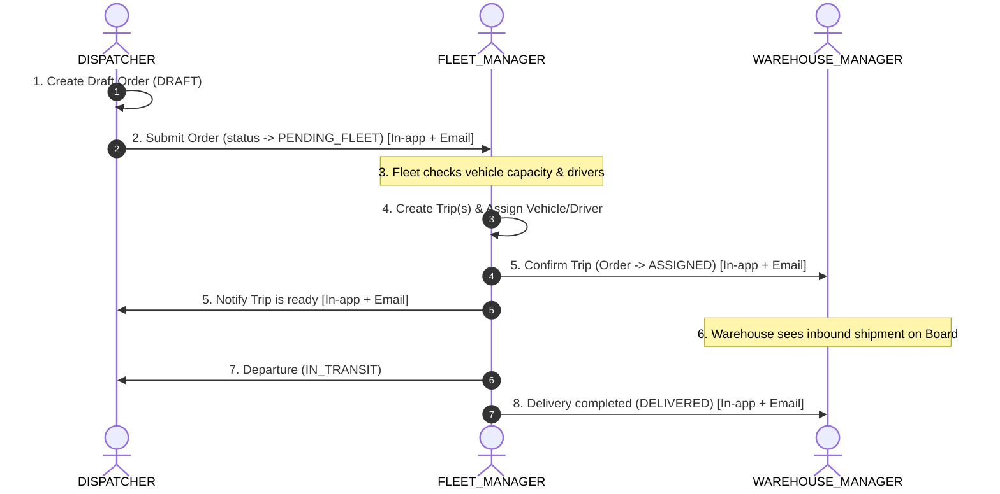

# TMS Domain Lead — Logistics TMS Business Architecture

> **Role**: Team Lead for all Transportation Management System (TMS) business logic, operational workflows, and dispatch governance.
> All decisions regarding **who does what, lifecycle transitions, authorization boundaries, and notification triggers** MUST reference this skill first.
> This skill defines **WHAT & WHY** (Business), while [`nestjs-best-practices`](../nestjs-best-practices/SKILL.md) and [`nextjs-best-practices`](../nextjs-best-practices/SKILL.md) define **HOW** (Technical Implementation).

---

## 📚 Business Sources of Truth

Before implementing features or modifying workflows, agents MUST reference:

| Document | Key Scope | File Path |
|---|---|---|
| **Notification Matrix** | Event triggers, channels, email templates, external vehicle rules | [`notifications.md`](notifications.md) |
| **Workflow Plan** | Dispatch planning, product decisions, split shipment architecture | [`docs/order-dispatch-workflow-plan.md`](../../../docs/order-dispatch-workflow-plan.md) |
| **Split Shipment Guide** | 1 Order across multiple Trips & Vehicle capacity allocation | [`docs/SPLIT_SHIPMENT_BUSINESS_INTERVIEW_GUIDE.md`](../../../docs/SPLIT_SHIPMENT_BUSINESS_INTERVIEW_GUIDE.md) |
| **User Manual** | Operational user guide and workflow step-by-step | [`docs/user-guide/USER_MANUAL_HUONG_DAN_SU_DUNG.md`](../../../docs/user-guide/USER_MANUAL_HUONG_DAN_SU_DUNG.md) |
| **RBAC Matrix** | 3-Layer permission enforcement (Sidebar, Route Guard, API Guard) | [`.agents/rules/rbac-matrix.md`](../../rules/rbac-matrix.md) |

---

## 👥 Role Responsibilities & Operational Matrix

| Role | Enum | Business Scope & Responsibilities |
|---|---|---|
| **DISPATCHER** | `RoleEnum.DISPATCHER` | Creates draft orders (`DRAFT`), inputs cargo payload (weight, volume), origin/destination hubs, routes. Submits orders to Fleet queue (`PENDING_FLEET`). Handles external vehicle requests when internal fleet is overloaded. Cancels draft orders. |
| **FLEET_MANAGER** | `RoleEnum.FLEET_MANAGER` | Receives `PENDING_FLEET` orders. Evaluates vehicle capacity and driver availability. Assigns vehicles (internal or 3PL partner) and drivers to form `Trips`. Reports vehicle shortage (`NO_VEHICLE`). Confirms finalized trips (`CONFIRMED`). |
| **WAREHOUSE_MANAGER** | `RoleEnum.WAREHOUSE_MANAGER` | Monitors Inbound Hub Schedule Board. Supervises cargo arrival, verifies shipments, and confirms inbound/outbound receiving against confirmed trips. |
| **SUPER_ADMIN** | `RoleEnum.SUPER_ADMIN` | Full administrative control: user management, branch hubs (CRUD & soft-delete), system configurations, audit oversight, and global notification monitoring. |

---

## 🔄 Order Lifecycle & State Machine

```
[Initialization]
    │
    ▼
  DRAFT ─────────────(Dispatcher cancels)─────────────► CANCELLED / Soft-deleted
    │
    │ (Dispatcher submits)
    ▼
PENDING_FLEET ◄────────(Dispatcher resubmits with 3PL flag)──────┐
    │                                                            │
    ├────────────────► NO_VEHICLE ───────────────────────────────┘
    │                   (Fleet reports no capacity)
    │ (Fleet assigns vehicles & confirms all Trips)
    ▼
 ASSIGNED ─────(All associated Trips CONFIRMED)
    │
    │ (Vehicle begins transit)
    ▼
IN_TRANSIT
    │
    │ (All Trips delivered at destination hub)
    ▼
DELIVERED

* Note: Any active state can transition to CANCELLED upon administrative or official cancellation.
```

---

## 🚚 Standard Operational Flow (Happy Path)



---

## 🔀 Core Business Exceptions

### 1. Draft Order Cancellation
- Dispatchers may cancel or soft-delete orders while in `DRAFT` state.
- **Rule**: Do NOT trigger notifications to Fleet or Warehouse since the order was never submitted to the operational dispatch queue.

### 2. Fleet Vehicle Shortage (`NO_VEHICLE`)
- When an order is `PENDING_FLEET` and internal capacity is exhausted, Fleet Manager sets status to `NO_VEHICLE` with an explicit reason.
- System sends an immediate alert to **DISPATCHER** and **SUPER_ADMIN**.
- Dispatcher enables external 3PL vehicle flag (`isExternalVehicleNeeded = true`, `externalNote = 'Partner details...'`) and resubmits to `PENDING_FLEET`.
- Fleet Manager assigns external partner vehicle.

### 3. Split Shipment (Multi-Trip Allocation)
- When cargo exceeds a single vehicle's payload capacity ($Kg$ / $m^3$), Fleet Manager creates **multiple Trips** for the same Order.
- The Order status only advances to `ASSIGNED` when **all** associated trips are `CONFIRMED`.
- Notifications to **WAREHOUSE_MANAGER** are dispatched only after the final trip configuration is locked.

---

## 🔔 Notification Governance

For event triggers, recipient matrices, WebSocket vs. Email Handlebars templates, and external 3PL alert formatting:

See [Notification Matrix in `notifications.md`](notifications.md)

---

## ✅ Pre-Implementation Business Checklist

Before writing or modifying any backend endpoint, frontend page, or data model, verify:

1. **Valid State Transition**: Does the new status conform to the Order/Trip State Machine?
2. **Authorization Enforcement**: Is the executing role permitted per the [RBAC Matrix](../../rules/rbac-matrix.md)?
3. **Notification Matrix Reference**: Checked [`notifications.md`](notifications.md) for recipients (In-app + Email)?
4. **SUPER_ADMIN Audit**: Is SUPER_ADMIN included in administrative event audit channels?
5. **Non-blocking Notifications**: Wrapped all email/socket emissions in `try/catch` to prevent business transaction aborts?
6. **External 3PL Handling**: For `isExternalVehicleNeeded = true`, are email subjects and UI badges prefixed with `🚨 [XE THUÊ NGOÀI]` / `[EXTERNAL VEHICLE]`?
7. **Listing & Pagination Confirmation**: Asked and confirmed with the User regarding Pagination vs. Flat List mechanisms for listing APIs? Never assume without confirmation.

---

## 🗂️ Skill Responsibility Breakdown

```text
  leader (WHAT & WHY)
  ├── notifications.md ──► Notification matrices, templates, 3PL alert rules
  ├── nestjs-best-practices ──► Backend Services, TypeORM, Controllers, BullMQ
  ├── nextjs-best-practices ──► Frontend App Router, UI Components, React 19
  ├── jwt-rbac-auth ──► Authentication guards, tokens, role authorization
  ├── ui-ux-flow-designer ──► User experience design, wireframes, dashboard
  └── git-commit-reviewer ──► Pre-commit safety auditing
```
