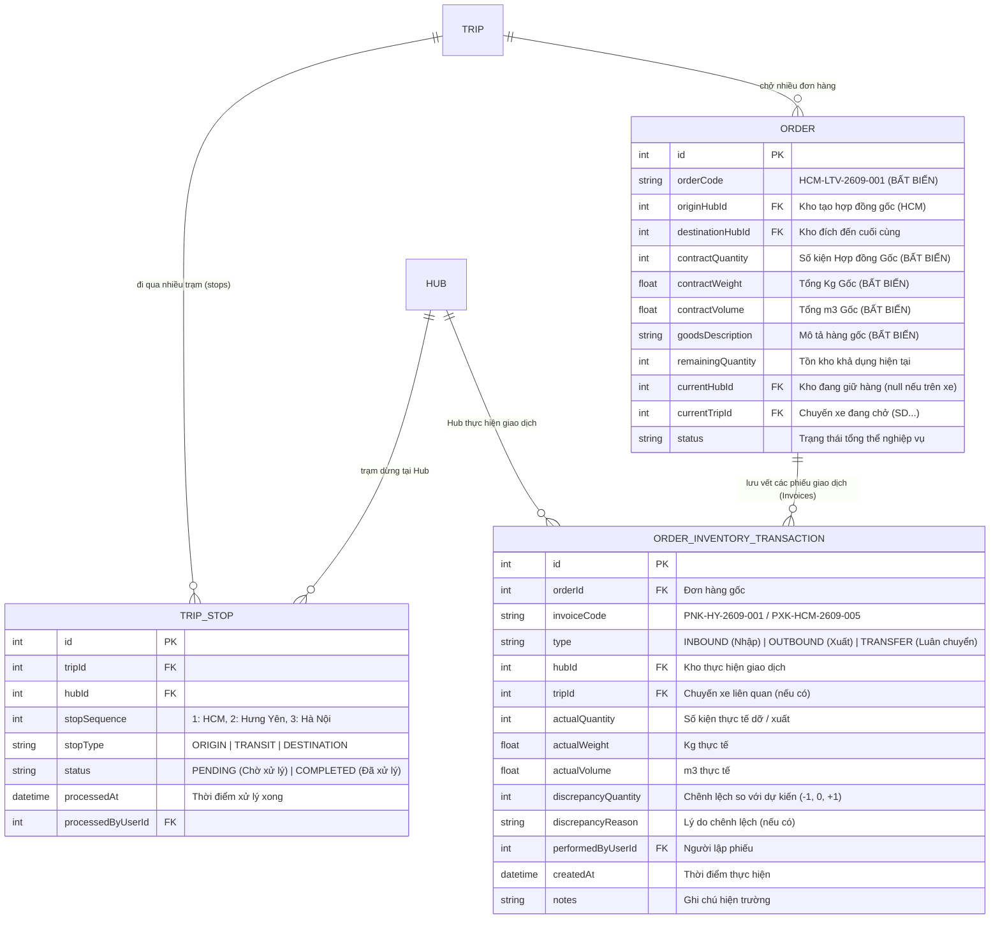
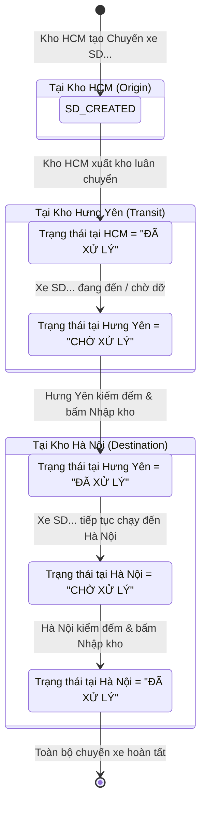

# ĐẶC TẢ THIẾT KẾ VÀ CHUẨN HÓA LOGIC TRẠNG THÁI ĐƠN HÀNG (ORDER) VÀ CHUYẾN XE (TRIP)
> **Phiên bản**: v2.1.0 (Bổ sung Nguyên tắc Hợp đồng Gốc Bất biến - Master Contract & Phiếu Giao dịch Vận hành - Operational Invoices)  
> **Áp dụng cho**: Logistics TMS (Spider Express TMS Fullstack)  
> **Tài liệu tham chiếu**: [AGENTS.md](file:///d:/Projects/logistics-website/AGENTS.md), [leader skill](file:///d:/Projects/logistics-website/.agents/skills/leader/SKILL.md), [ui-compact-density.md](file:///d:/Projects/logistics-website/.agents/rules/ui-compact-density.md)

---

## 🎯 TỔNG QUAN Ý TƯỞNG & NGUYÊN TẮC NGHIỆP VỤ

### 1. Ý tưởng cốt lõi từ Vận hành Thực tế
Trong hoạt động vận tải liên tỉnh và trung chuyển giữa các Hub (Linehaul & Cross-Docking):

1. **Đơn hàng (Order) mang trạng thái theo góc nhìn từng Kho (Context-Aware / Hub-Scoped Status)**:
   - Cùng một đơn hàng luân chuyển từ **Kho A (HCM)** đến **Kho B (Hưng Yên)**:
     - **Quản lý Kho HCM** cần thấy trạng thái: **`Đã xuất kho`** (vì hàng đã rời khỏi kho HCM).
     - **Quản lý Kho Hưng Yên** khi xe đang trên đường hoặc chưa xác nhận dỡ hàng cần thấy: **`Đơn nháp` / `Chờ nhập kho`**.
     - **Quản lý Kho Hưng Yên** sau khi xe đến, kiểm đếm xong và bấm xác nhận nhập kho sẽ thấy: **`Đã nhập kho` (Lưu kho)**.

2. **Chuyến xe (Trip) tối giản thành 2 trạng thái vận hành theo từng Kho**:
   - Chuyến xe chỉ cần 2 trạng thái vận hành trực quan: **`Chờ xử lý`** và **`Đã xử lý`**.
   - Bỏ trạng thái "Đơn nháp" của TRIP, thay bằng **`Chờ xử lý`**.
   - Trạng thái Chuyến xe **thay đổi theo kho của người quản lý đang xem**:
     - Khi Kho HCM gom hàng tạo chuyến và xuất bến ➔ Màn hình Kho HCM thấy TRIP là **`Đã xử lý`**.
     - Khi chuyến xe đó chở hàng ghé qua Kho Hưng Yên và Kho Hà Nội ➔ Màn hình Kho Hưng Yên và Hà Nội thấy TRIP là **`Chờ xử lý`**.
     - Kho Hưng Yên dỡ hàng và xác nhận nhập kho xong ➔ TRIP tại Kho Hưng Yên chuyển thành **`Đã xử lý`**.
     - Lúc này, Kho Hà Nội vẫn thấy TRIP là **`Chờ xử lý`** cho tới khi Kho Hà Nội dỡ hàng và xác nhận xong ➔ TRIP tại Kho Hà Nội mới chuyển thành **`Đã xử lý`**.

3. **Định dạng mã Chuyến xe ngắn gọn, trực quan**:
   - Thay đổi định dạng mã Trip dài (`TRIP-2609-001`) thành định dạng số thứ tự đơn giản: **`SD1, SD2, ..., SD100, SD101...`** (Spider Delivery).
   - Mã `SD...` sinh tự động tuần tự, duy nhất toàn hệ thống (Global Sequence).

4. **Cơ chế Kiểm đếm & Bóc tách dòng hàng trên xe nhiều điểm đến (Multi-Stop Trip & Selective Tally)**:
   - Một chuyến xe xuất phát từ HCM chở 10 dòng hàng:
     - **5 dòng** giao đến Kho Hưng Yên.
     - **2 dòng** giao đến Kho Hà Nội.
     - **3 dòng** giao cho khách lẻ hoặc địa chỉ khác trên tuyến.
   - Khi Quản lý Kho Hưng Yên mở chi tiết Chuyến xe:
     - Mặc định vẫn xem được **toàn bộ 10 dòng hàng** trên xe (giúp bao quát được toàn bộ thùng xe).
     - Hệ thống tự động phân nhóm / nhận diện 5 dòng hàng trả tại Hưng Yên để thủ kho xác nhận nhập.
     - Cho phép thủ kho **ẩn / loại bỏ các dòng không thuộc Hưng Yên** khỏi phiếu nhập để màn hình gọn gàng, giảm tải số lượng dòng.
     - **NGUYÊN TẮC AN TOÀN DỮ LIỆU TUYỆT ĐỐI**: Thao tác "loại bỏ dòng" ở Kho Hưng Yên chỉ là **bỏ qua không nhập đợt này tại Hưng Yên** (hàng vẫn còn trên xe để chở tiếp ra Hà Nội). Tuyệt đối **KHÔNG ĐƯỢC XÓA BẢN GHI ĐƠN HÀNG** trong Database làm mất hàng của Kho Hà Nội!
     - Cho phép **nhập tạm / nhập bất thường**: Nếu thực tế hàng của Hà Nội bị dỡ xuống Hưng Yên vì lý do bất khả kháng, thủ kho vẫn có thể tích chọn nhập vào kho Hưng Yên.

5. **Tính Bất Biến của Hợp Đồng Gốc (Master Consignment Contract) & Bản chất "Phiếu Vận Hành" (Operational Invoices)**:
   - **Hợp Đồng Ký Gửi Gốc (Master Contract)**: Khi Quản lý Kho HCM (hoặc Dispatcher) tạo đơn ban đầu, số lượng hàng hóa (`totalQuantity`, `totalWeight`, `totalVolume`), mô tả mặt hàng, nơi gửi và nơi nhận tạo thành một **Contract gốc pháp lý** ràng buộc với khách hàng.
   - **Nguyên tắc Bất Biến Tuyệt Đối (Immutability Protection)**: Sau khi đơn hàng rời khỏi trạng thái nháp ban đầu, **KHÔNG MỘT AI CÓ THỂ SỬA ĐỔI HOẶC GHI ĐÈ** các thông số hợp đồng gốc này (bao gồm Quản lý kho HCM, Hưng Yên, Hà Nội, Dispatcher, Fleet Manager), **NGOẠI TRỪ DUY NHẤT `SUPER_ADMIN`** trong các trường hợp xử lý sự cố đặc biệt có lưu log giải trình.
   - **Bản chất Phiếu Vận Hành (Operational Invoices / Sub-Transactions)**: Mọi thao tác nhập, xuất, dỡ hàng của các kho khác (như Hưng Yên, Hà Nội) thực chất chỉ là **các bản Hóa Đơn / Phiếu Giao Dịch Vận Hành liên quan (Inbound Receipt / Outbound Dispatch / Transfer Notes)** phát sinh theo chặng.
   - **Mục đích Lưu Vết (Audit Trail & Order Timeline)**: Các phiếu này ghi nhận thực tế dỡ hàng tại kho đó mà **hoàn toàn không được thay đổi các trường số liệu của Contract gốc**. Toàn bộ biến động được xâu chuỗi vào **Nhật ký Lịch sử Đơn Hàng (Order History / Timeline Ledger)** để minh bạch 100% dấu vết: ai nhập, ai xuất, lúc nào, trên xe nào, số lượng thực tế bao nhiêu, thừa/thiếu ra sao.

---

## 🔍 ĐÁNH GIÁ HIỆN TRẠNG CODEBASE HIỆN TẠI

| Thành phần | Hiện trạng trong Codebase hiện tại | Khoảng cách so với Ý tưởng & Yêu cầu |
|---|---|---|
| **Mô hình Hợp đồng Gốc (Contract)** | `OrderEntity` cho phép gọi `updateOrder` ghi đè trực tiếp `totalQuantity`, `totalWeight`, `totalVolume` qua `Object.assign`. | Chưa có cơ chế khóa bất biến (Immutability Guard) bảo vệ Contract gốc sau khi đơn rời khỏi Draft. Chưa phân quyền chỉ duy nhất `SUPER_ADMIN` mới được sửa thông tin gốc. |
| **Bản chất Giao dịch (Invoices)** | `order_inventory_transaction` đã có các trường `quantity`, `weight`, `volume`, `type` nhưng chưa gắn chặt chẽ mã phiếu chứng từ (`invoiceCode`), mã Hub thực hiện (`hubId`) và mã chuyến xe (`tripId`). | Thao tác nhập kho của Kho Hưng Yên trong `WarehouseTripDetailModal` có nguy cơ ghi đè ngược lại thực thể `order` thay vì sinh độc lập một bản Inbound Invoice liên kết. |
| **Mô hình Trip - Order** | `TripEntity` có `@Column() orderId: number` (quan hệ 1-1 đơn lẻ hoặc nhân bản N bản ghi Trip trùng `tripCode`). | Chưa có quan hệ 1 Trip chứa nhiều Orders thực thụ (1-N). Khi 1 chuyến xe chở 10 đơn hàng, DB hiện tạo 10 dòng `trip` trùng mã `tripCode`. |
| **Mã Chuyến xe (Trip Code)** | Đang sinh mã dạng `TRIP-YYMM-NNN` (ví dụ: `TRIP-2609-001` trong `generateTripCode()`) hoặc `TRIP-{id}`. | Chưa hỗ trợ mã ngắn gọn `SD1, SD2, ..., SD100, SD101...` có sequence counter nguyên tử. |
| **Trạng thái Chuyến xe (Trip Status)** | Cột `trip.status` lưu giá trị tĩnh toàn cục: `'PENDING' \| 'CONFIRMED' \| 'IN_TRANSIT' \| 'COMPLETED' \| 'CANCELLED'`. | **Xung đột góc nhìn**: Khi 1 kho đổi status thành `COMPLETED`, tất cả các kho đều thấy `COMPLETED`. Chưa có bảng quản lý điểm dừng/trạng thái chuyến xe theo từng Hub (`trip_stops` hoặc `trip_hub_status`). |
| **Trạng thái Đơn hàng (Order Status)** | Cột `order.status` lưu giá trị tĩnh toàn cục (`DRAFT`, `INBOUND`, `COMPLETED_INBOUND`, `IN_TRANSIT`...). | Khi Kho HCM xuất kho luân chuyển (`confirmOutbound`), hệ thống set `order.status = 'COMPLETED_INBOUND'` (Đã xuất kho). Khi Kho Hưng Yên xem, đơn hàng này cũng hiện "Đã xuất kho", chứ không hiện "Chờ nhập kho / Đơn nháp" tại Hưng Yên. |
| **Lịch sử Đơn hàng (History Timeline)** | Màn hình `orders/[id]/page.tsx` chỉ hiển thị 4 bước workflow cứng và danh sách trips, chưa hiển thị bảng lịch sử hóa đơn/phiếu giao dịch (Transaction Invoices Ledger). | Người dùng chưa xem được dòng thời gian kiểm toán chi tiết: Hub nào đã dỡ hàng, Hub nào đã xuất tiếp theo thời gian thực. |

---

## 🏗️ THIẾT KẾ KIẾN TRÚC MỤC TIÊU (TARGET ARCHITECTURE)

### 1. Kiến trúc Dữ liệu: Master Contract & Operational Invoices Ledger

---

### 2. Chi Tiết Nguyên Tắc Bất Biến Hợp Đồng Gốc (Master Contract Immutability)

#### A. Quy định Phân Quyền Sửa Đổi Dữ Liệu (Authorization Boundary)
1. **Dispatcher & Quản lý Kho Tạo Đơn (Kho HCM)**:
   - Được phép khai báo và điều chỉnh thông tin đơn hàng khi ở trạng thái **`DRAFT`** (Đơn nháp).
   - Ngay khi đơn hàng được gửi đi (**`PENDING_FLEET`**, xuất kho, hoặc gán chuyến): **Toàn bộ thông số gốc bị KHÓA CỨNG (LOCKED)**.
   - Không thể sửa đổi: `orderCode`, `contractQuantity`, `contractWeight`, `contractVolume`, `originHubId`, `destinationHubId`, `goodsDescription`.
2. **Quản lý Kho Nhận / Trung Chuyển (Kho Hưng Yên, Hà Nội)**:
   - Tuyệt đối **KHÔNG CÓ QUYỀN** chỉnh sửa hoặc ghi đè thông số của Hợp đồng Gốc.
   - Chỉ có quyền tạo **Phiếu Tiếp Nhận (Inbound Receipt Invoice)** ghi nhận số lượng thực tế dỡ hàng tại kho mình.
3. **Đặc Quyền Duy Nhất: `SUPER_ADMIN` (Admin Override)**:
   - Chỉ `SUPER_ADMIN` mới có quyền can thiệp sửa đổi các trường của Contract gốc (ví dụ xử lý nhầm lẫn nghiêm trọng trong việc nhập liệu hợp đồng).
   - Mọi thao tác override của SUPER_ADMIN bắt buộc:
     - Gửi qua endpoint bảo mật riêng: `PATCH /api/v1/orders/:id/admin-override`.
     - Bắt buộc nhập `auditReason` (Lý do điều chỉnh hợp đồng gốc).
     - Hệ thống tự động ghi một bản ghi kiểm toán đặc biệt `ADJUSTMENT` vào `order_inventory_transaction` với đầy đủ thông tin: *Admin nào sửa, sửa từ giá trị cũ bao nhiêu thành bao nhiêu, vào thời điểm nào*.

#### B. Xử Lý Tình Huống Chênh Lệch / Hao Hụt Thực Tế (Variance & Discrepancy)
- **Tình huống**: Hợp đồng gốc ghi nhận **10 kiện**. Dự kiến giao Hưng Yên 5 kiện, Hà Nội 5 kiện.
- Khi xe đến Hưng Yên, thủ kho kiểm đếm thực tế chỉ thấy **4 kiện** (thiếu 1 kiện so với dự kiến):
  - **TUYỆT ĐỐI KHÔNG**: Sửa Contract gốc thành 9 kiện! (Làm mất căn cứ tính cước và trách nhiệm bồi thường hợp đồng với khách hàng).
  - **CƠ CHẾ ĐÚNG**:
    - Contract gốc vẫn là: **`10 kiện`**.
    - Phiếu Nhập kho tại Hưng Yên (`Inbound Invoice`) ghi nhận:
      - `actualQuantity = 4` (Thực nhận: 4 kiện).
      - `discrepancyQuantity = -1` (Thiếu 1 kiện).
      - `notes = "Rách kiện bao bì, thiếu 1 kiện khi dỡ từ xe SD12"`.
    - Số tồn khả dụng tại kho Hưng Yên ghi nhận tăng: **`+4 kiện`**.
    - Lịch sử đơn hàng ghi nhận vết: Kho Hưng Yên dỡ thiếu 1 kiện. Điều phối viên và Admin lập tức thấy cảnh báo chênh lệch trên màn hình kiểm toán.

---

### 3. Bản Chất Các Phiếu Vận Hành (Operational Invoices) & Nhật Ký Lịch Sử (Audit Ledger)

Mỗi lần phát sinh hành động tại bất kỳ Hub nào, hệ thống tạo một bản ghi **Hóa Đơn / Phiếu Giao Dịch Vận Hành**:

| Loại Phiếu Vận Hành | Hub Thực Hiện | Mã Phiếu (Gợi ý) | Tác động lên Tồn kho | Tác động lên Contract Gốc |
|---|---|---|---|---|
| **Phiếu Tạo Đơn Ban Đầu** | Kho HCM (hoặc Dispatcher) | `HD-HCM-2609-001` | Tạo Hợp đồng gốc | Thiết lập giá trị gốc ban đầu |
| **Phiếu Xuất Luân Chuyển Chặng 1** | Kho HCM | `PXK-HCM-2609-012` | Kho HCM: Giảm tồn bằng số xuất | **Không đổi** thông số gốc |
| **Phiếu Tiếp Nhận Chặng 2** | Kho Hưng Yên | `PNK-HY-2609-034` | Kho Hưng Yên: Tăng tồn theo thực nhận | **Không đổi** thông số gốc |
| **Phiếu Xuất Luân Chuyển Chặng 2** | Kho Hưng Yên | `PXK-HY-2609-008` | Kho Hưng Yên: Giảm tồn theo số xuất tiếp | **Không đổi** thông số gốc |
| **Phiếu Tiếp Nhận Chặng Cuối** | Kho Hà Nội | `PNK-HN-2609-019` | Kho Hà Nội: Tăng tồn theo thực nhận | **Không đổi** thông số gốc |
| **Phiếu Xuất Giao Khách / Hoàn Tất** | Kho Hà Nội / Trạm Bo | `PGH-HN-2609-005` | Kho Hà Nội: Xuất hết hàng giao khách | **Không đổi** thông số gốc |

#### Hiển thị Dòng Thời Gian Lịch Sử Đơn Hàng (Order Timeline Ledger):
Khi mở màn hình Chi tiết đơn hàng (`/dashboard/orders/[id]`):
- **Khối Header & Thông tin Chung**:
  - Mã đơn: `HCM-LTV-2609-001`
  - Badge nổi bật: **`[HỢP ĐỒNG GỐC - BẤT BIẾN]`**
  - Số kiện hợp đồng: `10 kiện` | Khối lượng: `500 kg` | Thể tích: `2.5 m³`
  - Nơi gửi: `Kho HCM` ➔ Nơi nhận: `Kho Hà Nội`
  - Trạng thái các trường này: **Read-only hoàn toàn** đối với tất cả người dùng (không có nút Edit cho Dispatcher/Kho khi đã rời Draft).
- **Khối Dòng Thời Gian & Sổ Cái Giao Dịch (Invoices & History Ledger)**:
  - 🟢 **04/10 08:30**: *[Khởi tạo Hợp đồng]* Quản lý kho Lê Thâm Vương tạo đơn tại Kho HCM (10 kiện, 500 kg).
  - 🔵 **04/10 10:15**: *[Phiếu Xuất PXK-HCM-01]* Xuất 10 kiện lên chuyến xe **`SD12`** (Tài xế Nguyễn Văn A, Xe 29C-12345).
  - 🟡 **04/10 16:45**: *[Phiếu Nhập PNK-HY-05]* Kho Hưng Yên tiếp nhận từ chuyến xe **`SD12`**: Thực dỡ **5 kiện** (Lưu kho Hưng Yên). 5 kiện còn lại tiếp tục hành trình trên xe `SD12`.
  - 🟡 **05/10 09:20**: *[Phiếu Nhập PNK-HN-02]* Kho Hà Nội tiếp nhận từ chuyến xe **`SD12`**: Thực dỡ **5 kiện** (Lưu kho Hà Nội). Chuyến xe `SD12` hoàn tất dỡ hàng.
  - 🟣 **05/10 14:00**: *[Phiếu Giao PGH-HN-01]* Kho Hà Nội xuất 5 kiện giao tận nơi cho khách hàng.

---

### 4. Kiến trúc Chuyến xe Đa Kho (Multi-Stop Trip) & Trạng thái Trip theo Hub

#### Quy tắc Điểm dừng Chuyến xe (`trip_stops` / `TripStopEntity`):
1. **Tạo chuyến xe**: Tự động sinh mã tuần tự **`SD1, SD2...`** qua sequence `trip_code_sd_seq`.
2. **Khởi tạo trạm dừng**: Chuyến xe chở hàng từ HCM qua Hưng Yên đến Hà Nội tự động có 3 `trip_stops`:
   - Trạm 1 (HCM): `stopSequence = 1`, `status = 'COMPLETED'` (**`Đã xử lý`** - vì đã xuất bến xong).
   - Trạm 2 (Hưng Yên): `stopSequence = 2`, `status = 'PENDING'` (**`Chờ xử lý`**).
   - Trạm 3 (Hà Nội): `stopSequence = 3`, `status = 'PENDING'` (**`Chờ xử lý`**).
3. **Hiển thị độc lập**:
   - Khi Quản lý Kho HCM xem chuyến xe ➔ Thấy **`Đã xử lý`**.
   - Khi Quản lý Kho Hưng Yên xem chuyến xe ➔ Thấy **`Chờ xử lý`**.
   - Khi Quản lý Kho Hà Nội xem chuyến xe ➔ Thấy **`Chờ xử lý`**.
   - Khi Hưng Yên dỡ hàng xong và xác nhận ➔ `trip_stops[Hưng Yên].status = 'COMPLETED'` (**`Đã xử lý`**); lúc này Hà Nội vẫn giữ nguyên **`Chờ xử lý`**.

---

### 5. Quy trình Kiểm đếm & Bóc tách Dòng hàng tại Kho (Selective Inbound Tally)

Trong `WarehouseTripDetailModal`:
1. **Hiển thị toàn bộ thùng xe**: Mở chi tiết xe `SD12` thấy đủ 10 dòng hàng để thủ kho bao quát được toàn bộ xe.
2. **Phân loại thông minh**:
   - 5 dòng có `destinationHubId = Hưng Yên`: Tự động đánh dấu **`[✓] Tiếp nhận tại kho này`**.
   - 5 dòng đi Hà Nội / Khách khác: Tự động đánh dấu **`[Giữ trên xe đi tiếp]`** (Checkbox bỏ trống).
3. **Tinh gọn màn hình**: Nút gạt **`[Ẩn các dòng không thuộc kho này]`** giúp ẩn nhanh các dòng đi Hà Nội, chỉ tập trung kiểm đếm hàng của Hưng Yên.
4. **Bảo toàn dữ liệu**: Thao tác "loại bỏ dòng" chỉ là bỏ chọn khỏi đợt dỡ hàng tại Hưng Yên. **Tuyệt đối không xóa bản ghi đơn hàng của Hà Nội**.
5. **Xác nhận Nhập kho**:
   - Chỉ lưu phiếu nhập và cập nhật tồn kho cho các dòng được tích chọn tiếp nhận tại Hưng Yên.
   - Chuyển `trip_stops` của Hưng Yên thành **`Đã xử lý`**.
   - Các dòng của Hà Nội tiếp tục cùng xe `SD12` di chuyển đến Kho Hà Nội.

---

## 📋 MA TRẬN PHÂN QUYỀN & THẨM QUYỀN SỬA ĐỔI DỮ LIỆU (DATA GOVERNANCE RBAC)

| Trường thông tin | DISPATCHER | WAREHOUSE_MANAGER (Kho tạo) | WAREHOUSE_MANAGER (Kho nhận/trung chuyển) | FLEET_MANAGER | SUPER_ADMIN |
|---|---|---|---|---|---|
| **Thông tin Hợp đồng Gốc** (`contractQuantity`, `totalWeight`, `totalVolume`, `originHubId`, `destinationHubId`, `goodsDescription`) | Được sửa khi đơn còn ở `DRAFT`. Khóa khi đã submit. | Được sửa khi đơn còn ở `DRAFT`. Khóa khi đã submit/xuất kho. | **KHÔNG ĐƯỢC PHÉP SỬA** (Chỉ đọc) | **KHÔNG ĐƯỢC PHÉP SỬA** (Chỉ đọc) | **ĐƯỢC PHÉP OVERRIDE** (Có log lý do giải trình) |
| **Phiếu Tiếp Nhận Thực Tế** (`actualQuantity`, `actualWeight`, biên bản dỡ hàng) | Không áp dụng | Lập phiếu nhập ban đầu | **TOÀN QUYỀN** lập phiếu thực nhận tại kho mình | Không áp dụng | Toàn quyền kiểm tra / giám sát |
| **Phiếu Xuất Luân Chuyển** (Số lượng xuất, gán chuyến xe xuất đi) | Không áp dụng | Toàn quyền xuất từ kho mình | Toàn quyền xuất từ kho mình | Giám sát điều xe | Toàn quyền kiểm tra / giám sát |
| **Trạng thái Chuyến xe** | Theo dõi | Xác nhận xuất bến (`Đã xử lý`) | Xác nhận dỡ hàng (`Đã xử lý`) | Quản lý điều vận | Toàn quyền quản trị |

---

## 🚀 KẾ HOẠCH TRIỂN KHAI KỸ THUẬT (IMPLEMENTATION PHASES)

### Phase 1: Database Migration & Entity Protection (Backend)
1. Thêm Sequence `trip_code_sd_seq` sinh mã `SD1, SD2...`.
2. Tạo Entity `TripStopEntity` (`trip_stops`) quản lý điểm dừng và trạng thái xử lý từng trạm.
3. Cập nhật `OrderEntity`: Đổi tên/ánh xạ rõ ràng trường Hợp đồng Gốc (`contractQuantity`, `contractWeight`, `contractVolume`) và thêm `currentTripId`, `currentHubId`.
4. Cập nhật `OrderInventoryTransactionEntity`: Bổ sung `invoiceCode`, `hubId`, `tripId`, `actualQuantity`, `discrepancyQuantity`, `discrepancyReason`.
5. Tạo Guard bảo vệ bất biến trong `OrdersService.update`: Chặn tất cả các vai trò khác `SUPER_ADMIN` sửa đổi các trường Contract gốc nếu đơn hàng đã rời `DRAFT`. Tạo endpoint riêng `PATCH /orders/:id/admin-override` cho Super Admin.

### Phase 2: Logic Nghiệp vụ & API Endpoints (Backend)
1. **`TripsService`**:
   - Cấp phát mã `SD...` tự động khi tạo chuyến.
   - Tự động sinh các bản ghi `trip_stops` tương ứng với các Hub trên hành trình.
   - API lấy trạng thái Trip theo Hub người xem: `GET /api/v1/trips?hubContext=true`.
2. **`WarehouseService`**:
   - Khi xác nhận dỡ hàng (`confirmInbound`): Chỉ sinh bản ghi `Inbound Receipt` cho các dòng thực nhận, ghi nhận chênh lệch vào transaction nếu có, cập nhật `trip_stops` tại Hub đó thành `COMPLETED`. Tuyệt đối không ghi đè số lượng gốc của `order`.
   - API trả về danh sách đơn hàng có tính toán trạng thái theo ngữ cảnh Hub người xem (`resolveOrderStatusForHub`).

### Phase 3: Giao diện Người dùng & Trải nghiệm Vận hành (Frontend)
1. **Trang Chi tiết Đơn hàng (`/dashboard/orders/[id]`)**:
   - Thêm nhãn bảo vệ: **`[HỢP ĐỒNG GỐC - BẤT BIẾN]`**.
   - Ẩn nút Edit đối với mọi vai trò khi đơn không còn là DRAFT (chỉ Super Admin có nút Sửa Hợp Đồng Đặc Biệt).
   - Xây dựng Component **`OrderTimelineLedger`**: Hiển thị dòng thời gian trực quan gồm tất cả các Phiếu Nhập, Xuất, Luân chuyển được lưu vết từ `order_inventory_transaction`.
2. **Modal Chi tiết Chuyến xe (`WarehouseTripDetailModal`)**:
   - Hiển thị đầy đủ danh sách hàng trên xe.
   - Thêm nút gạt: `Ẩn các dòng không thuộc kho này`.
   - Checkbox thông minh: Mặc định chọn dòng của Hub mình; giữ nguyên dòng của Hub khác trên xe.
   - Ghi nhận số lượng thực nhận vào Phiếu Tiếp Nhận (Inbound Receipt).
3. **Bảng Điều Khiển Nhập/Xuất Kho**:
   - Tối giản trạng thái Chuyến xe thành 2 nhãn: **`Chờ xử lý`** và **`Đã xử lý`**.
   - Hiển thị mã chuyến xe dạng **`SD1, SD2...`**.

### Phase 4: Kiểm thử E2E & Nghiệm thu Toàn diện (Verification)
1. Kiểm thử kịch bản Hợp đồng Bất biến:
   - Thử dùng tài khoản Dispatcher / Quản lý kho Hưng Yên gọi API cập nhật số lượng gốc của đơn hàng ➔ Xác nhận API trả về `403 Forbidden` / `422 Unprocessable`.
   - Thử dùng tài khoản `SUPER_ADMIN` gọi `admin-override` ➔ Xác nhận cập nhật thành công và có log giải trình trong lịch sử.
2. Kiểm thử kịch bản Vận tải Liên Hub 3 trạm (HCM ➔ Hưng Yên ➔ Hà Nội):
   - HCM tạo đơn 10 kiện, xuất chuyến `SD...`.
   - Hưng Yên dỡ 5 kiện, lưu vết Phiếu Nhập Hưng Yên. Contract gốc vẫn giữ 10 kiện. Trip tại Hưng Yên thành `Đã xử lý`.
   - Hà Nội dỡ 5 kiện còn lại, lưu vết Phiếu Nhập Hà Nội. Toàn bộ chuyến xe hoàn tất.
   - Kiểm tra trang chi tiết đơn hàng: Thấy trọn vẹn 2 phiếu nhập và lịch sử di chuyển minh bạch.

---

> [!NOTE]
> Tài liệu này là **Nguồn Chân Lý Duy Nhất (Single Source of Truth)** cho toàn bộ quy trình tái cấu trúc trạng thái Đơn hàng, Chuyến xe và Quản trị Hợp đồng Gốc của dự án. Mọi thay đổi code tiếp theo bắt buộc phải bám sát tuyệt đối các đặc tả trên.
