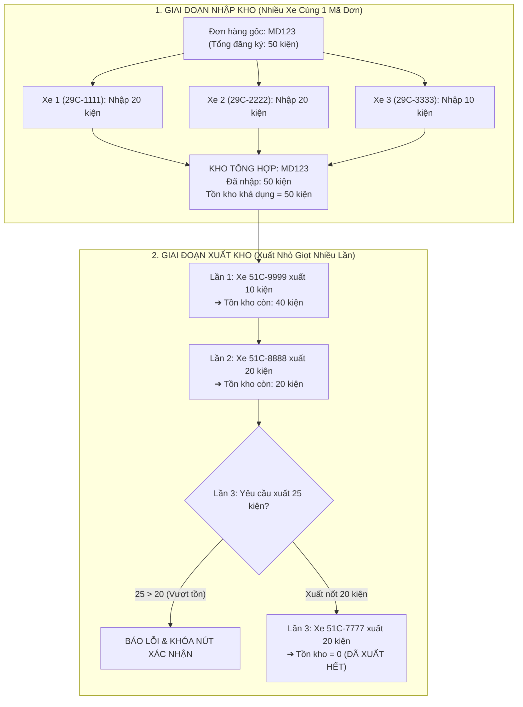

# TODO: Kế Hoạch Triển Khai & Cải Tiến Phân Hệ Kho (Feedback 17/8)

> **Căn cứ nghiệp vụ**: Thư mục `feedback_17_8`  
> - File chi tiết trong thư mục: [`feedback_17_8/TODO.md`](./feedback_17_8/TODO.md)  
> - Tài liệu yêu cầu: [`feedback_17_8/menu chỉ hiển thị 3 items.md`](./feedback_17_8/menu%20ch%E1%BB%89%20hi%E1%BB%83n%20th%E1%BB%8B%203%20items.md)  
> - Bản phác thảo Group xe: [`feedback_17_8/group_theo_xe.png`](./feedback_17_8/group_theo_xe.png)  
> - Mẫu tem nhận diện thực tế: [`feedback_17_8/tem_nhan_dien.png`](./feedback_17_8/tem_nhan_dien.png)  
> - **Chỉ đạo nghiệp vụ bổ sung (18/09/2026)**:  
>   + *Khách nhập vào kho 50 kiện, không nhập trên 1 chuyến xe mà chia ra 2-3 xe chuyên chở vào.*  
>   + *Khi xuất kho, không thể xuất full 1 lần mà xuất nhỏ giọt (10 kiện, 20 kiện,...) trừ dần tồn kho.*  
> - Trạng thái: **SẴN SÀNG TRIỂN KHAI**

---

## 📌 Bảng Đối Chiếu Thay Đổi Cốt Lõi (Core Specifications)

| # | Hạng mục | Quy cách Hiện Tại | Quy cách Mới Cần Đạt (Feedback 17/8) |
|---|---|---|---|
| 1 | **Menu Sidebar Kho** | Hiển thị full (Overview, Vận hành 6 mục, Quản trị, Kanban, Chat) | **Chỉ hiển thị đúng 3 mục duy nhất**: `Nhập kho` \| `Xuất kho` \| `Đơn hàng kho` |
| 2 | **Card thống kê KPI** | Hiện 4 Stat Cards ở đầu trang Nhập kho và Xuất kho | **Bỏ toàn bộ các Card thống kê** ra khỏi giao diện để tiết kiệm không gian màn hình |
| 3 | **Địa chỉ giao khi Nhập kho** | Dropdown phân tầng 3 chế độ (`HUB_L1`, `XE_BO`, `DIRECT_CUSTOMER`) | **Chuyển thành ô Free Text** (nhập tự do hoặc paste từ văn bản) |
| 4 | **Paste dữ liệu từ Excel** | Dùng `split(/\r?\n/)` khiến ô có dấu xuống dòng bị tách thành nhiều dòng | **Parser thông minh (RFC 4180)**: Giữ nguyên ô multiline trong dấu ngoặc kép thuộc cùng 1 dòng |
| 5 | **Kiểm tra trùng Mã vận đơn** | Chặn trùng mã trong DB (`unique: true`), backend chặn và frontend báo lỗi đỏ | **BỎ CHECK TRÙNG MÃ VẬN ĐƠN**: Cho phép 1 mã đơn đi trên nhiều xe, nhập nhiều lần; thống kê sẽ cộng dồn |
| 6 | **Tài xế / Người nhận hàng** | Viền đỏ `*` bắt buộc nhập họ tên tài xế/người nhận | **Không bắt buộc** (bỏ `*` đỏ và bỏ validate chặn lưu khi để trống) |
| 7 | **Quyền Xóa đơn hàng** | Chặn thủ kho, chỉ Super Admin / Dispatcher được xóa | **Đơn DRAFT (nháp) cho phép thủ kho xóa**. Các đơn trạng thái khác phải có quyền Admin |
| 8 | **In phiếu Nhập / Xuất kho** | Chưa có mẫu in phiếu nhập/xuất kho tại chỗ | • Thao tác In phiếu nhập kho khi trạng thái là `LƯU KHO`<br>• Thao tác In phiếu xuất kho khi trạng thái là `ĐÃ XUẤT KHO` |
| 9 | **Bảng Xuất kho (Outbound)** | Bảng phẳng từng đơn lẻ; có 2 nút "Xuất khách" & "Xuất luân chuyển" | • **Bỏ nút xuất luân chuyển, chỉ giữ 1 nút Xuất kho**<br>• **Group bảng theo Biển số xe** (Cột xe, Cột danh sách mã đơn, Cột thông số gom)<br>• Click vào xe mở giao diện chi tiết như nhập mới<br>• Tìm kiếm theo mã đơn & biển số xe |
| 10 | **Nhập kho nhiều xe (Multi-truck Inbound)** | Nhập 1 lần là xong 1 đơn nguyên vẹn | **Hỗ trợ 1 mã đơn được chở vào bằng nhiều xe (2-3 xe)**: Ghi nhận từng chuyến xe, số lượng kiện từng đợt, cộng dồn vào tổng nhập |
| 11 | **Xuất kho nhỏ giọt (Partial Outbound)** | Chỉ cho phép xuất nguyên đơn (100%) | **Cho phép xuất từng phần (10, 20 kiện...)**: Trừ dần vào tồn kho khả dụng; **chặn tuyệt đối xuất vượt quá tồn kho** |
| 12 | **Theo dõi Tồn kho & Timeline** | Chỉ lưu 1 số lượng `totalQuantity` tĩnh | **Quản lý động: Tổng nhập - Đã xuất = Tồn kho**; Timeline hiển thị danh sách các xe chở vào và các xe chở ra |
| 13 | **Tem nhận diện hàng hóa A4** | Có dòng "Người nhập", chưa có QR code, ô số lượng tự điền | • **Bỏ thông tin người nhập**<br>• **Thêm mã QR ở góc trên - bên trái**<br>• **Để trống các ô khoanh đỏ** (`... / [tổng số]`, `PALET SỐ`, `TỔNG SỐ PALET`) để ghi tay |
| 14 | **Mật độ bảng (Density)** | Dòng bảng cao, tốn chỗ | **Dòng trong bảng thu nhỏ lại (Compact Table)** để màn hình hiển thị được nhiều dòng hơn |

---

## 🎯 Mô Hình Nghiệp Vụ Nhập - Xuất - Tồn Từng Phần (Partial Inventory Lifecycle)



---

## 📋 Danh Sách Task Cụ Thể (Actionable Checklist)

### 🧱 Phase 1: Cơ Sở Dữ Liệu & Backend API (Database & Inventory Logic)

- [x] **TASK-BE-01: Gỡ bỏ ràng buộc Unique Constraint trên `orderCode`**
  - **Mục tiêu**: Cho phép 1 mã vận đơn được chở trên nhiều xe hoặc nhập nhiều lần.
  - **Files**:
    - `backend/src/orders/infrastructure/persistence/relational/entities/order.entity.ts`: Gỡ `unique: true` trên cột `orderCode`.
    - Tạo migration TypeORM mới: `1788960000000-DropOrderCodeUniqueAndAddInventoryFields.ts`.
  - **Tiêu chí hoàn thành**: Chạy migration thành công, insert nhiều bản ghi có cùng `orderCode` không bị lỗi DB.

- [x] **TASK-BE-02: Bổ sung trường Quản lý Tồn kho & Đợt xuất nhập (Partial Inventory Fields)**
  - **Mục tiêu**: Hỗ trợ quản lý số lượng nhập lũy kế, số lượng đã xuất lũy kế và số lượng tồn khả dụng.
  - **Files**:
    - `backend/src/orders/infrastructure/persistence/relational/entities/order.entity.ts`:
      + `inboundQuantity`: Số kiện thực tế đã nhập kho (mặc định bằng `totalQuantity` khi nhập).
      + `outboundQuantity`: Số kiện đã xuất kho lũy kế (mặc định = 0).
      + `remainingQuantity`: Số kiện còn tồn trong kho (`= inboundQuantity - outboundQuantity`).
    - Gộp trong migration TypeORM: `1788960000000-DropOrderCodeUniqueAndAddInventoryFields.ts`.
  - **Tiêu chí hoàn thành**: Database lưu vết chính xác số lượng tồn kho của từng bản ghi đơn/mã đơn.

- [x] **TASK-BE-03: Gỡ bỏ kiểm tra trùng mã đơn trong Service**
  - **Mục tiêu**: Không chặn lưu khi mã vận đơn đã tồn tại trong hệ thống.
  - **Files**:
    - `backend/src/orders/warehouse.service.ts`: Xóa bỏ đoạn check `where: { orderCode: finalOrderCode }` ném ConflictException trong `quickCreateInboundOrder()`.
    - `backend/src/orders/orders.service.ts`: Xóa check trùng tương tự trong `create()` và `checkOrderCodeExists()`.
  - **Tiêu chí hoàn thành**: API tạo đơn trả về 201/200 thành công ngay cả khi mã đơn đã tồn tại.

- [x] **TASK-BE-04: API Xuất kho nhỏ giọt & Validate chặn vượt tồn kho (Partial Outbound Logic)**
  - **Mục tiêu**: Cho phép xuất từng phần và bảo vệ tuyệt đối không xuất âm kho.
  - **Files**:
    - `backend/src/orders/warehouse.controller.ts`, `backend/src/orders/warehouse.service.ts`.
    - Body nhận danh sách đơn xuất kèm số lượng xuất của đợt này:
      ```json
      {
        "licensePlate": "51C-999.99",
        "items": [
          { "orderId": 12, "quantityToExport": 10, "weightToExport": 50, "volumeToExport": 0.5 }
        ]
      }
      ```
    - **Logic kiểm tra**:
      + Nếu `quantityToExport > remainingQuantity` → Ném `UnprocessableEntityException('Mã đơn [code]: Số lượng xuất ([Y]) vượt quá tồn kho khả dụng ([Z]).')`.
      + Nếu hợp lệ: `order.outboundQuantity += quantityToExport`, `order.remainingQuantity -= quantityToExport`.
      + Cập nhật trạng thái: Nếu `remainingQuantity === 0` → `COMPLETED_INBOUND` (Đã xuất hết); nếu `remainingQuantity > 0` → `PARTIALLY_OUTBOUND` / `INBOUND` (Đang xuất nhỏ giọt / Còn tồn).
      + Tạo bản ghi chuyến xe xuất (`TripEntity`) ghi nhận biển số xe và số kiện xuất đợt này.
  - **Tiêu chí hoàn thành**: Xuất 10/50 kiện → tồn còn 40 kiện; thử xuất tiếp 45 kiện → nhận lỗi 422 chặn lại.

- [x] **TASK-BE-05: Phân quyền Xóa đơn nháp (`DRAFT`) cho `WAREHOUSE_MANAGER`**
  - **Mục tiêu**: Cho phép thủ kho tự xóa các đơn nháp do mình tạo, các trạng thái khác chỉ Super Admin mới được can thiệp.
  - **Files**:
    - `backend/src/orders/orders.controller.ts`: Bổ sung `@Roles(RoleEnum.SUPER_ADMIN, RoleEnum.DISPATCHER, RoleEnum.WAREHOUSE_MANAGER)` cho endpoint `DELETE /v1/orders/:id`.
    - `backend/src/orders/orders.service.ts`: Kiểm tra logic: Nếu role là `WAREHOUSE_MANAGER` và `order.status !== 'DRAFT'` → ném `ForbiddenException('Chỉ quản trị viên (Admin) mới có quyền xóa đơn hàng đã qua xử lý.')`.
  - **Tiêu chí hoàn thành**: Thủ kho xóa đơn `DRAFT` thành công; thử xóa đơn `INBOUND` nhận lỗi 403.

- [x] **TASK-BE-06: API Xuất kho gom nhóm theo Biển số xe (Outbound Grouped API)**
  - **Mục tiêu**: Phục vụ hiển thị bảng xuất kho group theo xe như bản thiết kế `group_theo_xe.png`.
  - **Files**:
    - `backend/src/orders/warehouse.controller.ts`: Thêm query param `groupBy=vehicle` hoặc endpoint `/v1/warehouse/outbound/vehicles`.
    - `backend/src/orders/warehouse.service.ts`: Truy vấn gom nhóm theo `licensePlate`, tổng hợp danh sách các mã đơn trên xe và tổng thông số (kiện, kg, m³).
  - **Tiêu chí hoàn thành**: Endpoint trả về danh sách xe kèm danh sách mã đơn và tổng thông số chính xác.

---

### 🧭 Phase 2: Điều Hướng & Mật Độ Bảng (Navigation & Global Table UX)

- [x] **TASK-FE-01: Tinh gọn Sidebar Menu còn đúng 3 mục cho Kho**
  - **Mục tiêu**: Giao diện thủ kho chỉ tập trung 3 tác vụ chính.
  - **Files**:
    - `frontend/src/config/nav-config.ts`
    - `frontend/src/components/layout/app-sidebar.tsx`
  - **Quy tắc**: Khi tài khoản đăng nhập có role `WAREHOUSE_MANAGER`:
    - Ẩn nhóm `Overview` (Dashboard), `Không gian làm việc` (Kanban, Chat, AI Chat), `Quản trị hệ thống`.
    - Nhóm `Vận hành TMS` chỉ hiển thị đúng 3 mục:
      1. **Nhập kho** (`/dashboard/warehouse/inbound`)
      2. **Xuất kho** (`/dashboard/warehouse/outbound`)
      3. **Đơn hàng kho** (`/dashboard/warehouse/orders`)
  - **Tiêu chí hoàn thành**: Đăng nhập tài khoản thủ kho, menu sidebar chỉ thấy 3 mục trên.

- [x] **TASK-FE-02: Nén gọn dòng bảng dữ liệu (Compact Table Rows)**
  - **Mục tiêu**: Giảm chiều cao dòng (`py-1` / `py-1.5`, font `text-[11px]`/`text-xs`) để hiển thị được nhiều dòng trên màn hình mà không cần cuộn nhiều.
  - **Files**:
    - `frontend/src/app/dashboard/warehouse/inbound/page.tsx`
    - `frontend/src/app/dashboard/warehouse/outbound/page.tsx`
    - `frontend/src/app/dashboard/warehouse/orders/page.tsx`
    - `frontend/src/features/warehouse/components/warehouse-editable-grid.tsx`
  - **Tiêu chí hoàn thành**: Màn hình 1080p hiển thị tối thiểu 12-15 dòng mà không bị che khuất.

- [x] **TASK-FE-03: Hiển thị cột Chuyến xe (TRIP) trên các bảng kho**
  - **Mục tiêu**: Hiển thị rõ mã chuyến xe (`TRIP-xxx`), số chuyến đi kèm, biển số xe và tài xế trên các bảng Nhập kho, Xuất kho, và Đơn hàng kho.
  - **Files**:
    - `frontend/src/app/dashboard/warehouse/inbound/page.tsx`
    - `frontend/src/app/dashboard/warehouse/outbound/page.tsx`
    - `frontend/src/app/dashboard/warehouse/orders/page.tsx`
  - **Tiêu chí hoàn thành**: Bảng có cột `CHUYẾN XE / TRIP`, hiển thị rõ mã chuyến và xe/tài xế nếu có, hiển thị gạch ngang `—` nếu chưa gắn chuyến.

---

### 📥 Phase 3: Phân Hệ Nhập Kho (Inbound Warehouse & Multi-Truck Inbound)

- [x] **TASK-IN-01: Bỏ toàn bộ 4 Card Thống Kê ở đầu trang Nhập kho**
  - **Mục tiêu**: Xóa bỏ khối KPI cards để màn hình gọn gàng.
  - **File**: `frontend/src/app/dashboard/warehouse/inbound/page.tsx`.
  - **Tiêu chí hoàn thành**: Không còn 4 khối "Chờ nhập kho", "Khách gửi", "Luân chuyển", "Đã nhập kho"; bảng danh sách được đưa lên đầu trang.

- [x] **TASK-IN-02: Hỗ trợ Nhập kho 1 mã đơn trên nhiều xe (Multi-truck Inbound Flow)**
  - **Mục tiêu**: Khách có 50 kiện chia ra 2-3 xe chở vào, mỗi xe vào tạo 1 phiếu tiếp nhận gắn biển số xe và số kiện thực nhận của xe đó.
  - **Files**:
    - `frontend/src/app/dashboard/warehouse/inbound/page.tsx`
    - `frontend/src/features/warehouse/components/warehouse-editable-grid.tsx`
  - **Giao diện**: Nhập Biển số xe tiếp nhận tại cửa kho + Mã đơn + Số lượng kiện của xe này mang vào. Cho phép nhập tiếp chuyến xe thứ 2, thứ 3 với cùng mã đơn đó mà không bị chặn.
  - **Tiêu chí hoàn thành**: Nhập xe 1 (20 kiện), xe 2 (20 kiện), xe 3 (10 kiện) cùng mã đơn thành công; tổng nhập kho được ghi nhận đủ 50 kiện.

- [x] **TASK-IN-03: Địa chỉ giao hàng chuyển thành Free Text trong Form Nhập kho**
  - **Mục tiêu**: Thủ kho nhập thẳng địa chỉ khách cần giao mà không bị bắt chọn Hub/Xe bo.
  - **Files**:
    - `frontend/src/features/warehouse/components/warehouse-editable-grid.tsx`: Khi `isOutboundMode === false`, cột `deliveryAddress` hiển thị ô input/textarea tự do.
  - **Tiêu chí hoàn thành**: Có thể gõ bất kỳ chuỗi địa chỉ nào mà không phát sinh lỗi validation.

- [x] **TASK-IN-04: Sửa lỗi Paste Excel bị nhảy dòng (Multiline TSV Parser)**
  - **Mục tiêu**: Xử lý ô Excel chứa xuống dòng (có ngoặc kép `"..."`) không bị tách thành dòng dữ liệu mới.
  - **Ví dụ test**:
    ```text
    "BreadTalk Aeon Long Biên
    Cổng số 5 Aeon Mall Long Biên - 27 Cổ Linh - Phường Long Biên TP HN
    liên hệ: Chị Hiền 039 9950872 - 024 32012279"
    ```
  - **Files**:
    - `frontend/src/features/warehouse/components/warehouse-editable-grid.tsx` (`handlePaste`, `handleManualPaste`)
    - `frontend/src/features/warehouse/components/warehouse-excel-import-modal.tsx`
  - **Tiêu chí hoàn thành**: Copy ô địa chỉ Aeon Long Biên từ Excel dán vào bảng, toàn bộ địa chỉ nằm trọn trong 1 dòng hàng duy nhất.

- [x] **TASK-IN-05: Bỏ bắt buộc nhập Họ tên tài xế / người nhận**
  - **Mục tiêu**: Trường `Họ tên người nhận / tài xế` trở thành tùy chọn (optional).
  - **File**: `frontend/src/app/dashboard/warehouse/inbound/page.tsx`.
  - **Tiêu chí hoàn thành**: Bỏ dấu `*` đỏ; bỏ kiểm tra `if (!driverName.trim())` chặn submit.

- [x] **TASK-IN-06: Gỡ bỏ kiểm tra trùng mã đơn trên bảng kê Nhập kho**
  - **Mục tiêu**: Cho phép nhập trùng mã đơn tự do.
  - **File**: `frontend/src/features/warehouse/components/warehouse-editable-grid.tsx`.
  - **Tiêu chí hoàn thành**: Không còn viền đỏ, không còn chữ "Trùng!" và không bị chặn khi ấn "Xác nhận tiếp nhận" hoặc "Lưu nháp".

- [x] **TASK-IN-07: Thêm nút "In phiếu nhập kho" tại cột Thao tác khi trạng thái Lưu kho**
  - **Mục tiêu**: Thủ kho có thể in phiếu nhập kho đối soát ngay tại danh sách.
  - **File**: `frontend/src/app/dashboard/warehouse/inbound/page.tsx`, tạo component `warehouse-inbound-receipt-modal.tsx`.
  - **Tiêu chí hoàn thành**: Nếu đơn có trạng thái `INBOUND` / `STORED`, hiển thị nút **In phiếu nhập kho**; ấn vào bật modal in phiếu khổ A4/A5 rõ ràng.

---

### 📤 Phase 4: Phân Hệ Xuất Kho (Outbound & Partial Dispatch)

- [x] **TASK-OUT-01: Bỏ Card Thống Kê & Bỏ nút "Xuất luân chuyển nội bộ"**
  - **Mục tiêu**: Header trang xuất kho tinh gọn.
  - **File**: `frontend/src/app/dashboard/warehouse/outbound/page.tsx`.
  - **Chi tiết**: Bỏ 4 card thống kê; góc trên bên phải chỉ giữ **1 nút duy nhất là `[Xuất kho]`**.

- [x] **TASK-OUT-02: Bảng danh sách Xuất kho Group theo Biển số xe (Chuẩn `group_theo_xe.png`)**
  - **Mục tiêu**: Gom các đơn hàng xuất theo từng xe để tài xế và thủ kho dễ bàn giao.
  - **File**: `frontend/src/app/dashboard/warehouse/outbound/page.tsx`.
  - **Cấu trúc bảng**:
    - Cột 1: **Biển số xe** (Ví dụ: `51C-123.44`)
    - Cột 2: **Mã đơn hàng** (Hiển thị danh sách các mã đơn trên xe: `Mã đơn 1`, `Mã đơn 2`,...)
    - Cột 3: **Thông số đơn hàng** (Ví dụ: `5 kiện, 10 kg, 3 m³`)
    - Cột 4: **Trạng thái**
    - Cột 5: **Thao tác** (Nút in phiếu xuất kho nếu trạng thái là `Đã xuất kho`)
  - **Thanh tìm kiếm**: Hỗ trợ tìm kiếm theo cả **Mã đơn hàng** và **Biển số xe**.
  - **Tiêu chí hoàn thành**: Khớp hoàn toàn cấu trúc hình ảnh `feedback_17_8/group_theo_xe.png`.

- [x] **TASK-OUT-03: Click vào Xe mở lại giao diện chỉnh sửa / lập phiếu chi tiết**
  - **Mục tiêu**: Nhấp chuột vào dòng xe sẽ mở ra giao diện lập phiếu xuất chứa đầy đủ các đơn hàng trên xe như nhập mới hoàn toàn.
  - **File**: `frontend/src/app/dashboard/warehouse/outbound/page.tsx`.
  - **Tiêu chí hoàn thành**: Click vào xe hiển thị form lập phiếu với đầy đủ danh sách đơn đã phân cho xe đó.

- [x] **TASK-OUT-04: Giao diện Xuất kho nhỏ giọt (Partial Quantity Input & Stock Comparison)**
  - **Mục tiêu**: Cho phép thủ kho chỉ định số kiện xuất đợt này (10, 20 kiện...), không bắt buộc xuất full 100%.
  - **Files**:
    - `frontend/src/app/dashboard/warehouse/outbound/page.tsx`
    - `frontend/src/features/warehouse/components/warehouse-editable-grid.tsx`
  - **Giao diện**:
    - Cột "Số kiện xuất": Mặc định điền tồn kho khả dụng, nhưng cho phép sửa nhỏ hơn.
    - Hiển thị thông tin tồn: `Tồn kho: [X] kiện`.
    - Live Validation: Nếu nhập số xuất > tồn kho → Báo đỏ: `Vượt quá tồn kho khả dụng (tồn [X] kiện)`, tự động vô hiệu hóa nút Xác nhận xuất.
  - **Tiêu chí hoàn thành**: Chọn đơn có tồn 50 kiện, sửa số xuất thành 10 kiện → xuất thành công; tồn kho cập nhật còn lại 40 kiện.

- [x] **TASK-OUT-05: Flow Xuất kho: Xuất thẳng vs Trung chuyển & Lưu nháp**
  - **Mục tiêu**: Trong luồng xuất kho, hỗ trợ 2 chế độ địa chỉ giao hàng:
    - *Xuất thẳng*: Tự động lấy địa chỉ giao hàng từ lúc nhập kho đưa vào.
    - *Trung chuyển*: Chọn Hub cấp 1 + Tuyến xe bo.
    - Có đầy đủ 2 nút hành động: **[Lưu nháp]** và **[Xác nhận xuất kho]**.
  - **File**: `frontend/src/app/dashboard/warehouse/outbound/page.tsx`.

- [x] **TASK-OUT-06: Thêm nút "In phiếu xuất kho" khi trạng thái là Đã xuất kho**
  - **Mục tiêu**: In biên nhận / phiếu xuất kho cho tài xế mang theo xe.
  - **File**: `frontend/src/app/dashboard/warehouse/outbound/page.tsx`, tạo component `warehouse-outbound-receipt-modal.tsx`.
  - **Tiêu chí hoàn thành**: Khi trạng thái là `COMPLETED_INBOUND` / `OUTBOUND`, cột thao tác có nút **In phiếu xuất kho**.

---

### 🏷️ Phase 5: Tem Nhận Diện Hàng Hóa A4 (Pallet Label A4)

- [x] **TASK-LBL-01: Cập nhật mẫu in Tem nhận diện A4 theo chuẩn `tem_nhan_dien.png`**
  - **Mục tiêu**: Khớp 100% hình ảnh thực tế của sàn kho.
  - **File**: `frontend/src/features/warehouse/components/pallet-label-a4-modal.tsx`.
  - **Các chỉnh sửa chi tiết**:
    1. **Thêm mã QR**: Đặt ở góc trên - bên trái (chứa mã vận đơn để quét nhanh bằng điện thoại/máy quét).
    2. **Bỏ thông tin người nhập**: Xóa hẳn hàng `NGƯỜI NHẬP :` khỏi khung bảng tem.
    3. **Để trống các ô khoanh đỏ để thủ kho ghi tay bằng bút lông**:
       - Hàng `SỐ LƯỢNG :`: Hiển thị định dạng `... / [Tổng số]` (ví dụ `... / 8` với số `8` là tổng số kiện, chừa khoảng trống phía trước để thủ kho ghi số kiện của pallet).
       - Hàng `PALET SỐ :`: Ô giá trị để trống `...`.
       - Hàng `TỔNG SỐ PALET :`: Ô giá trị để trống `...`.
       - Hàng `GIAO ĐẾN :`: Giữ khung trống lớn phía dưới.
  - **Tiêu chí hoàn thành**: Bản xem trước và bản in qua máy in A4 ngang khớp chính xác mẫu trong file ảnh `feedback_17_8/tem_nhan_dien.png`.

---

### 📦 Phase 6: Đơn Hàng Kho & Timeline Vận Chuyển 3 Chặng (Warehouse Orders & Multi-Leg Timeline)

- [x] **TASK-ORD-01: Click xem chi tiết đơn tồn kho**
  - **Mục tiêu**: Trong trang `/dashboard/warehouse/orders`, click vào dòng đơn hàng hoặc mã vận đơn sẽ mở Popup xem chi tiết.
  - **File**: `frontend/src/app/dashboard/warehouse/orders/page.tsx`.
  - **Thông tin bắt buộc hiển thị**:
    - Địa chỉ lấy hàng
    - Địa chỉ giao hàng
    - **Bảng Thống Kê Nhập - Xuất - Tồn Chi Tiết**:
      + `Tổng số kiện đã nhập`: [50] kiện
      + `Tổng số kiện đã xuất`: [30] kiện
      + `Số kiện tồn khả dụng`: [20] kiện (Highlighed màu xanh/cam)

- [x] **TASK-ORD-02: Thiết kế khối TIMELINE 3 chặng xe chi tiết (Theo sát tiến trình từng xe)**
  - **Mục tiêu**: Theo dõi minh bạch toàn bộ các xe đã tham gia chở vào và chở ra của đơn hàng.
  - **File**: `frontend/src/features/warehouse/components/warehouse-waybill-detail-modal.tsx`.
  - **Cấu trúc TIMELINE hiển thị**:
    - 🚚 **1. Xe lấy hàng / Nhập kho (First-mile Inbound)**:
      + Liệt kê danh sách tất cả các xe chở vào: `XE1 (29C-1111: 20 kiện)`, `XE2 (29C-2222: 20 kiện)`, `XE3 (29C-3333: 10 kiện)`...
      + Tổng nhập: 50 kiện.
    - 🚛 **2. Xe trung chuyển (Middle-mile / Liên Hub - nếu có)**:
      + Biển số xe, tuyến Hub, số lượng kiện vận chuyển.
    - 🚐 **3. Xe giao hàng / Xuất kho (Last-mile Outbound)**:
      + Liệt kê danh sách tất cả các đợt xe đã xuất: `XE A (51C-9999: xuất 10 kiện)`, `XE B (51C-8888: xuất 20 kiện)`...
      + Tổng xuất: 30 kiện ➔ Còn tồn lại trong kho: 20 kiện.
  - **Tiêu chí hoàn thành**: Mở chi tiết đơn hàng thấy rõ lộ trình các xe và số lượng kiện tương ứng trên từng chặng một cách trực quan.

- [x] **TASK-ORD-03: Thao tác Xóa đơn nháp và Phân quyền xóa**
  - **Mục tiêu**: Thủ kho được xóa đơn DRAFT; đơn khác DRAFT ẩn nút xóa hoặc báo cần Admin can thiệp.
  - **Files**:
    - `frontend/src/app/dashboard/warehouse/orders/page.tsx`
    - `frontend/src/app/dashboard/warehouse/inbound/page.tsx`
  - **Tiêu chí hoàn thành**: Đơn `DRAFT` hiển thị nút Xóa (thùng rác đỏ) kèm popup xác nhận; đơn đã lưu kho/đã xuất kho không cho phép xóa tự do.

---

### 🧪 Phase 7: Kiểm Thử & Nghiệm Thu Toàn Trình (Verification & Quality Assurance)

- [x] **TASK-QA-01: Test Nhập kho chia 2-3 chuyến xe cùng 1 mã đơn (50 kiện chia 20 + 20 + 10)**
- [x] **TASK-QA-02: Test Xuất kho nhỏ giọt (Xuất 10 kiện ➔ còn tồn 40; xuất 20 kiện ➔ còn tồn 20)**
- [x] **TASK-QA-03: Test Chặn tuyệt đối xuất vượt quá tồn kho (Thử xuất 25 kiện khi tồn 20)**
- [x] **TASK-QA-04: Test Copy-Paste Excel có xuống dòng trong ô (Aeon Long Biên)**
- [x] **TASK-QA-05: Test Xuất kho gom theo Biển số xe (Chuẩn `group_theo_xe.png`)**
- [x] **TASK-QA-06: Test In tem A4 (Kiểm tra QR code, bỏ người nhập, ô trống ghi tay)**
- [x] **TASK-QA-07: Test Popup Chi tiết đơn kho & TIMELINE 3 chặng xe chi tiết**
- [x] **TASK-QA-08: Test Phân quyền Menu 3 mục cho tài khoản WAREHOUSE_MANAGER**

---

## 🗺️ Ma Trận File Cần Chỉnh Sửa / Tạo Mới

| File Đường Dẫn | Loại Thay Đổi | Tasks Liên Quan |
|---|:---:|---|
| `backend/src/orders/infrastructure/persistence/relational/entities/order.entity.ts` | Sửa | TASK-BE-01, TASK-BE-02 |
| `backend/src/database/migrations/*-DropOrderCodeUniqueConstraint.ts` | **Tạo mới** | TASK-BE-01 |
| `backend/src/database/migrations/*-AddInventoryQuantitiesToOrder.ts` | **Tạo mới** | TASK-BE-02 |
| `backend/src/orders/warehouse.service.ts` | Sửa | TASK-BE-03, TASK-BE-04, TASK-BE-06 |
| `backend/src/orders/orders.service.ts` | Sửa | TASK-BE-03, TASK-BE-05 |
| `backend/src/orders/orders.controller.ts` | Sửa | TASK-BE-05 |
| `frontend/src/config/nav-config.ts` | Sửa | TASK-FE-01 |
| `frontend/src/components/layout/app-sidebar.tsx` | Sửa | TASK-FE-01 |
| `frontend/src/app/dashboard/warehouse/inbound/page.tsx` | Sửa | TASK-FE-02, TASK-IN-01, TASK-IN-02, TASK-IN-05, TASK-IN-07 |
| `frontend/src/features/warehouse/components/warehouse-editable-grid.tsx` | Sửa | TASK-FE-02, TASK-IN-03, TASK-IN-04, TASK-IN-06, TASK-OUT-04 |
| `frontend/src/features/warehouse/components/warehouse-excel-import-modal.tsx` | Sửa | TASK-IN-04 |
| `frontend/src/app/dashboard/warehouse/outbound/page.tsx` | Sửa | TASK-FE-02, TASK-OUT-01 -> TASK-OUT-06 |
| `frontend/src/features/warehouse/components/pallet-label-a4-modal.tsx` | Sửa | TASK-LBL-01 |
| `frontend/src/app/dashboard/warehouse/orders/page.tsx` | Sửa | TASK-FE-02, TASK-ORD-01, TASK-ORD-03 |
| `frontend/src/features/warehouse/components/warehouse-waybill-detail-modal.tsx` | Sửa | TASK-ORD-02 |
| `frontend/src/features/warehouse/components/warehouse-inbound-receipt-modal.tsx` | **Tạo mới** | TASK-IN-07 |
| `frontend/src/features/warehouse/components/warehouse-outbound-receipt-modal.tsx` | **Tạo mới** | TASK-OUT-06 |
