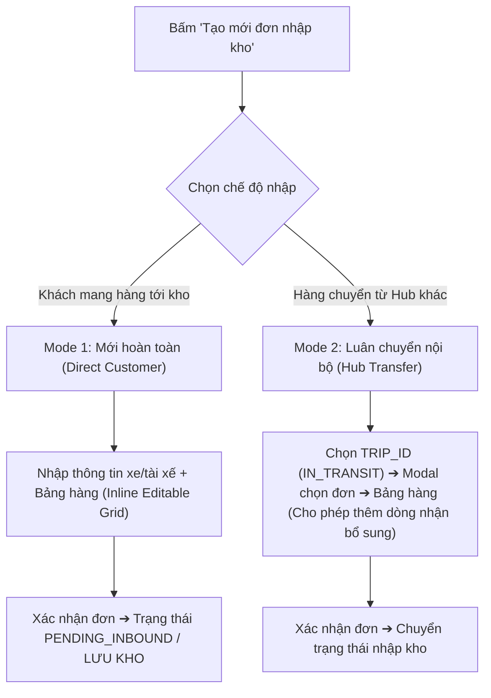
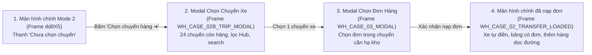
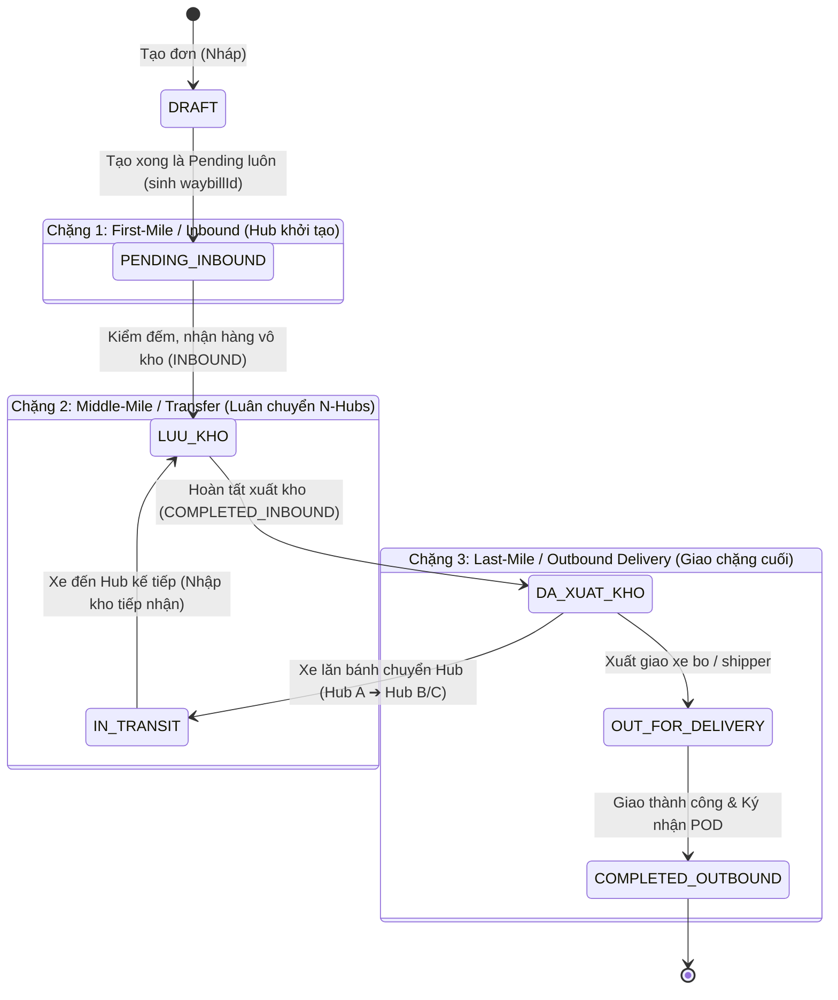

# Task Spec: Thiết Kế UI/UX Phân Hệ Quản Lý Kho (Warehouse Hub Operations)

> **Authority**: [leader](file:///.agents/skills/leader/SKILL.md) (TMS Business Architecture)  
> **Execution Agents**: [pencil-ui-designer](file:///.agents/skills/pencil-ui-designer/SKILL.md) & [ui-ux-flow-designer](file:///.agents/skills/ui-ux-flow-designer/SKILL.md)  
> **Auditing Agent**: [ui-spec-auditor](file:///.agents/skills/ui-spec-auditor/SKILL.md) (Compliance Gatekeeper)  
> **Canvas Output**: `pencil-workspace/pens/WAREHOUSE_FLOWS.pen`  
> **Authoritative References**:  
> - `docs_scan/required_field_border_red.png` (Bản đồ trực quan các trường bắt buộc viền đỏ trên bảng vận hành)  
> - `docs_scan/Kế Hoạch Đóng Hàng Xe 43H30703 Spider 3.9 K.xlsx` (Bảng Kế hoạch Đóng hàng & Xuất hàng xe tuyến thực tế)  
> - `docs_scan/TEM NHẬN DIỆN HÀNG HÓA THÀNH A4.xlsx` (Mẫu Tem Nhận Diện Hàng Hóa khổ A4 dán Pallet/Kiện)  
> - `docs_scan/form_create_new_don.JPG` (Màn hình tạo mới & Bảng nhập hàng)  
> - `docs_scan/workflow_trung_chuyen_hub_trip.JPG` (Quy trình luân chuyển Hub & Xe bo)  
> - `docs_scan/ke_hoach_dong_hang_so_trip.JPG` (Gom chuyến & Bảng kế hoạch Trip)  
> - `docs_scan/mau_phieu_nhap_kho.JPG` (Mẫu phiếu nhập kho & POD)  
> - `.agents/rules/rbac-matrix.md` (Phân quyền 3 lớp)  

---

## 🚨 1. NGUYÊN TẮC BẤT BIẾN & QUY TẮC TRƯỜNG BẮT BUỘC (ZERO-TOLERANCE INVARIANTS & RED-BORDER RULES)

Mọi agent (`pencil-ui-designer`, `ui-ux-flow-designer`, frontend/backend) bắt buộc tuân thủ 100% các điều kiện tiên quyết sau. Vi phạm bất kỳ điều nào sẽ bị `ui-spec-auditor` đánh **FAIL ngay lập tức**:

> [!CAUTION]
> ### QUY TẮC CẤM (FATAL ANTI-PATTERNS)
> 1. **TUYỆT ĐỐI KHÔNG QUẢN LÝ SKU / BARCODE / MÃ SẢN PHẨM LẺ (NO-SKU RULE):**
>    - TMS quản lý vận tải theo **kiện hàng/lô hàng tổng quan (Consignment/Freight Level)**.
>    - Thông số hàng hóa CHỈ gồm 4 trường: **Tên hàng** (mô tả tổng quát), **Số thùng/kiện**, **Số kg** (Gross weight), **Số khối ($m^3$ / CBM)**.
>    - CẤM tạo sub-item SKU, mã vạch từng sản phẩm lẻ, hoặc bảng quản lý tồn kho chi tiết từng mặt hàng.
> 2. **TUYỆT ĐỐI KHÔNG DÙNG FORM NHẬP TỪNG BƯỚC (NO WIZARD / STEPPER FORM):**
>    - Màn hình tạo đơn nhập hàng (Mode 1 & Mode 2) **PHẢI LÀ BẢNG NHẬP LIỆU DÒNG (Horizontal Row-by-Row Grid)** theo mẫu tài liệu scan `docs_scan/form_create_new_don.JPG` và bảng kế hoạch đóng hàng `docs_scan/Kế Hoạch Đóng Hàng Xe 43H30703 Spider 3.9 K.xlsx`.
>    - Cho phép nhập liên tục nhiều dòng hàng ngang, phím Tab chuyển ô, copy-paste nhiều dòng từ Excel.
> 3. **TUYỆT ĐỐI KHÔNG THAY ĐỔI THỨ TỰ CỘT SO VỚI BẢN SCAN & FILE EXCEL KẾ HOẠCH:**
>    - Thứ tự cột trên bảng nhập liệu PHẢI khớp 1:1 với bản scan thực tế của doanh nghiệp. Cấm tự ý đảo vị trí, thêm cột rác hoặc xóa cột bắt buộc.
> 4. **PENCIL ENGINE SCHEMA INVARIANT:**
>    - Trong file `.pen`, mọi Text Node **PHẢI DÙNG PROPERTY `"content"`**, TUYỆT ĐỐI KHÔNG DÙNG `"text"`.
> 5. **MÃ ĐƠN HÀNG DO SERVER SINH — `leader` PREREQUISITE:**
>    - Internal `orderCode` có format `{HUB_PREFIX}-{OPERATOR_INITIALS}-{YYMM}-{SEQUENCE}`, ví dụ `HCM-LTV-2609-011`.
>    - Hub prefix lấy từ `currentUser.hubId → hub.orderCodePrefix`; initials lấy từ full name đã lưu; kỳ thời gian dùng `YYMM` theo `Asia/Ho_Chi_Minh`; sequence cấp atomically theo tháng.
>    - UI không cho nhập/sửa internal code. Mode tạo Order hiển thị `Tự sinh khi lưu`; Mode 2 dùng lại code Order nguồn ở trạng thái readonly. Mã bill/chứng từ khách hàng phải là field tham chiếu riêng.
>    - Rule sinh mã không tự thay đổi quyền tạo Order; mọi role vẫn phải theo `leader` và RBAC matrix.

---

### 🔴 QUY TẮC CÁC TRƯỜNG BẮT BUỘC (RED-BORDER REQUIRED FIELDS)
Căn cứ theo bản scan nghiệp vụ thực tế `docs_scan/required_field_border_red.png`, hệ thống quy định rõ ràng danh sách các trường **BẮT BUỘC (VIỀN ĐỎ)** và các trường phụ trợ:

#### A. Khối Header Thông Tin Tiếp Nhận Tại Cửa Kho (Siêu Gọn):
| STT | Tên trường | Tình trạng | Mô tả nghiệp vụ & Quy tắc |
| :---: | :--- | :---: | :--- |
| 1 | **Ngày/tháng/năm** | 🔴 **Bắt buộc** | Ngày nhận hàng tại Hub (Default: Ngày hiện tại). |
| 2 | **Biển số xe** | 🔴 **Bắt buộc** | Biển kiểm soát phương tiện vận tải (VD: `43H30703` hoặc `50H-756.14`). |
| 3 | **Họ tên người nhận/tài xế** | 🔴 **Bắt buộc** | Họ tên lái xe hoặc người đại diện tiếp nhận/giao lô hàng (VD: `Phạm Thành Trung`). |

*(Đã tinh gọn loại bỏ: Nhà thầu, Điện thoại, Kế hoạch đóng hàng rườm rà, và Hotline điều hành khỏi header tiếp nhận sàn kho).*

#### B. Khối Dòng Hàng Hóa Cốt Lõi (Inline Editable Table - Rút Gọn Cột):
| STT | Tên cột trên Bảng | Tình trạng | Quy tắc nghiệp vụ |
| :---: | :--- | :---: | :--- |
| 1 | `STT` | Tự động | Số thứ tự tăng dần 1, 2, 3... |
| 2 | `Mã đơn hàng` | 🔴 **Bắt buộc / Tự động** | Internal code readonly do server sinh, ví dụ `HCM-LTV-2609-011`. |
| 3 | `Địa chỉ nhận hàng` | 🔴 **Bắt buộc** | Tên kho, địa chỉ chi tiết nơi lấy/nhận hàng (Kho khách hoặc Hub hiện tại). |
| 4 | `Tên hàng` | 🔴 **Bắt buộc** | Mô tả hàng hóa tổng quan (VD: *Nguyên Liệu*, *Vải cuộn*...). Tuyệt đối **KHÔNG** nhập SKU. |
| 5 | `Khối lượng: Số thùng` | 🔴 **Bắt buộc** | Số lượng kiện/thùng đóng gói (Integer $\ge 1$). |
| 6 | `Khối lượng: Số kg` | 🔴 **Bắt buộc** | Tổng trọng lượng Gross weight (Kg $> 0$). |
| 7 | `Khối lượng: Số khối` | 🔴 **Bắt buộc** | Tổng thể tích hàng hóa ($m^3$ / CBM $> 0$). |
| 8 | `Địa chỉ giao hàng` | 🔴 **Bắt buộc** | Điểm đến chặng cuối (Dropdown 3 chế độ: Free text khách lẻ, Hub L1 kho chính, hoặc Tuyến vệ tinh Xe bo 34 tỉnh thành). |
| 9 | `Ghi chú` | Tùy chọn | Lưu ý bốc xếp, cồng kềnh, quy cách kiện lẻ... |
| 10 | `Thao tác` | Action Buttons | `[🖨️ In tem]` (In tem nhận dạng dán pallet dòng này) \| `[➕ Nhân bản]` \| `[🗑️ Xóa]`. |

*(Đã loại bỏ 5 cột điều phối văn phòng: Điều hành, Khách hàng, Ngày cần bốc, Ngày cần giao, Đã soạn; tối ưu mật độ hiển thị nhiều dòng hàng).*

---

## 🧭 2. CẤU TRÚC ĐIỀU HƯỚNG KHO (WAREHOUSE 3-MENU NAVIGATION)

Phân hệ Quản lý Kho được tổ chức tinh gọn thành **3 menu chức năng cốt lõi**:
1. **`Nhập kho`** (`/dashboard/warehouse/inbound`): Nhập hàng từ khách (Mode 1) hoặc tiếp nhận xe luân chuyển từ Hub khác về (Mode 2).
2. **`Xuất kho`** (`/dashboard/warehouse/outbound`): Lập danh sách xuất xe tuyến / xe bo, gom đơn (kể cả đơn `DRAFT`), cập nhật lại thông số tải trọng và bàn giao.
3. **`Đơn hàng`** (`/dashboard/warehouse/orders`): Bảng danh sách tổng hợp toàn bộ các lô hàng tại Hub, hỗ trợ tra cứu, lọc và in ấn lại chứng từ.

---

## 👥 3. PHÂN QUYỀN & PHẠM VI TRUY CẬP (RBAC & HUB SCOPING)

| Vai trò (Role) | Mã Enum | Phạm vi dữ liệu (Hub Scoping) | Quyền hạn trên màn hình Kho |
| :--- | :--- | :--- | :--- |
| **Warehouse Manager** | `RoleEnum.WAREHOUSE_MANAGER` | **Strict Hub Scope** (`currentUser.hubId`) | Toàn quyền tạo đơn nhập kho, lập kế hoạch đóng hàng xuất xe, kiểm đếm hàng, in chứng từ, xác nhận nhập/xuất kho tại Hub của mình. Không can thiệp Hub khác. |
| **Dispatcher** | `RoleEnum.DISPATCHER` | Toàn mạng lưới | Chỉ xem (Read-only) tiến độ nhập/xuất kho để điều phối chuyến xe. |
| **Fleet Manager** | `RoleEnum.FLEET_MANAGER` | Toàn mạng lưới xe | Chỉ xem (Read-only) kế hoạch hàng về và kế hoạch đóng hàng để bố trí phương tiện. |
| **Super Admin** | `RoleEnum.SUPER_ADMIN` | Toàn hệ thống | Quản trị, giám sát toàn diện, cấu hình hệ thống, và **độc quyền xem lịch sử kiểm toán (Audit Trail)**. |

---

## 🔄 4. HAI CHẾ ĐỘ TẠO ĐƠN NHẬP KHO (DUAL-MODE SPECIFICATION)

Khi người dùng (Warehouse Manager) bấm nút **"Tạo mới đơn nhập kho"**, hệ thống cung cấp Tab chuyển đổi giữa 2 chế độ:



### Bảng so sánh chi tiết giữa 2 Mode:

| Tiêu chí | Mode 1: Mới hoàn toàn (Khách gửi) | Mode 2: Luân chuyển nội bộ (Hub-to-Hub) |
| :--- | :--- | :--- |
| **Nguồn hàng** | Khách hàng giao trực tiếp đến Hub. | Xe tuyến chở hàng từ Hub khác đến. |
| **Địa chỉ nhận hàng (Pickup Address)** | **Nhập tự do (Free text)** do khách cung cấp. | **Tự động điền (Read-only)**: Lấy `hubs.address` từ `currentUser.hubId`. |
| **Thông tin xe / Tài xế** | **Bắt buộc nhập (Red Border)**: Biển số xe, Họ tên tài xế/người giao. *(Đã bỏ hẳn Nhà thầu, SĐT)*. | **Không cần nhập tay**: Tự động trích xuất khi chọn `TRIP_ID`. |
| **Cách nạp dữ liệu** | - Nhập từng dòng trực tiếp trên Grid (Inline Editable).<br>- Nút `[+ Thêm 1 dòng đơn mới]` tự tạo đơn.<br>- Copy từ Excel (`Ctrl+C` ➔ `Ctrl+V`).<br>- Import file Excel (.xlsx). | - Chọn từ danh sách `TRIP_ID` đang `IN_TRANSIT`.<br>- Modal chọn 1 hoặc nhiều đơn trong Trip.<br>- Hỗ trợ **nhận thêm hàng dọc đường** (bấm nút "Thêm dòng"). |
| **Mã đơn hàng nội bộ** | Readonly `Tự sinh khi lưu` nếu flow được RBAC cho phép tạo canonical Order; server sinh theo Hub + initials + `YYMM` + counter. | Readonly, giữ nguyên code của Order nguồn; tuyệt đối không sinh mã mới khi nhận qua Hub. |
| **Trạng thái khởi tạo** | `DRAFT` ➔ Xác nhận chuyển sang `PENDING_INBOUND` / `LƯU KHO` luôn. | Cập nhật tiến trình luân chuyển của đơn trong chuyến. |

---

## 📐 4. QUY CÁCH BẢNG NHẬP LIỆU & BẢNG KẾ HOẠCH ĐÓNG HÀNG (EXCEL-MATCHING SPEC)

Màn hình bảng nhập liệu và bảng kế hoạch đóng hàng xuất xe phải tuân thủ nghiêm ngặt thứ tự và định dạng các cột sau:

### 4.1. Bảng 8 Cột Cốt Lõi Trên Modal Nhập Hàng Nhanh (Inbound Grid Quick Entry):
Dành cho thao tác tạo mới đơn hàng nhanh tại kho (`form_create_new_don.JPG`):

| STT | Tên cột trên UI | Kiểu nhập liệu (Control Type) | Bắt buộc (Required) | Quy tắc nghiệp vụ & Giá trị |
| :---: | :--- | :--- | :---: | :--- |
| **1** | **STT** | Text (Auto-increment) | Tự động | 1, 2, 3... |
| **2** | **Mã đơn hàng** | Readonly / System Generated | 🔴 **Bắt buộc / Tự động** | Hiển thị `Tự sinh khi lưu` trước khi tạo; sau create hiển thị code dạng `HCM-LTV-2609-011`. Mode 2 dùng lại code nguồn. |
| **3** | **Địa chỉ nhận hàng** | Text Input (Mode 1) / Readonly (Mode 2) | 🔴 **Bắt buộc** | Mode 1: Khách nhập; Mode 2: Tự lấy Hub hiện tại. |
| **4** | **Tên hàng** | Text Input | 🔴 **Bắt buộc** | Mô tả hàng hóa tổng quan (VD: Thùng carton bánh kẹo, Vải cuộn...). Tuyệt đối không ghi SKU. |
| **5** | **Khối lượng** *(Group Header)* | *Gồm 3 cột con bên dưới* | 🔴 **Bắt buộc** | Nhóm chỉ số tải trọng vận tải: |
| 5.1 | — *Số thùng (kiện)* | Number Input (Integer $\ge 1$) | 🔴 **Bắt buộc** | Đơn vị đóng gói vận chuyển. |
| 5.2 | — *Số kg* | Number Input (Decimal $> 0$) | 🔴 **Bắt buộc** | Tổng khối lượng hàng (Gross weight). |
| 5.3 | — *Số khối ($m^3$ / CBM)* | Number Input (Decimal $> 0$) | 🔴 **Bắt buộc** | Tổng thể tích hàng hóa. |
| **6** | **Địa chỉ giao hàng** | **Dropdown 3 Chế độ (3-in-1 Selector)** | 🔴 **Bắt buộc** | Cho phép chọn 1 trong 3 phân loại đích (xem mục 4.3). |
| **7** | **Ghi chú** | Text Input | Tùy chọn | Yêu cầu bảo quản, lưu ý bốc xếp, cồng kềnh... |
| **8** | **Thao tác** | Action Icons | N/A | Icon [Thêm dòng], [Nhân bản], [Xóa dòng]. |

### 4.2. Bảng 14 Cột Kế Hoạch Đóng Hàng & Xuất Hàng Xe Tuyến (Outbound Loading Board):
Dành cho bảng điều phối đóng hàng lên xe tuyến theo tài liệu chuẩn `Kế Hoạch Đóng Hàng Xe 43H30703 Spider 3.9 K.xlsx`:
1. `STT` (Auto `=ROW()-10`)
2. `Điều hành` (Dispatcher phụ trách)
3. `Mã đơn hàng` 🔴
4. `Khách hàng` (Mã KH + Tên KH)
5. `Địa chỉ nhận hàng` 🔴
6. `Ngày cần bốc hàng`
7. `Tên hàng` 🔴
8. `Khối lượng - Số thùng` 🔴
9. `Khối lượng - Số kg` 🔴 (Hàng tổng: `=SUBTOTAL(9, ...)`)
10. `Khối lượng - Số khối` 🔴 (Hàng tổng: `=SUBTOTAL(9, ...)`)
11. `Ngày cần giao hàng`
12. `Địa chỉ giao hàng` 🔴
13. `Đã soạn` (Tên trạm / Tỉnh giao hàng ngắn gọn)
14. `Ghi chú`

### 4.3. Chi tiết cột "Địa chỉ giao hàng" (Delivery Destination Selector):
Cột này bắt buộc có bộ chuyển đổi 3 lựa chọn (Segmented Tab hoặc Dropdown Category):
1. **Nhập địa chỉ thông thường (Free Text)**: Nhập số nhà, tên đường, phường/xã, quận/huyện cụ thể để giao chặng cuối cho khách lẻ.
2. **Hub cấp 1 (Dropdown Kho chính)**: Chọn các Hub trung tâm trong hệ thống (VD: Hub Hà Nội, Hub Đà Nẵng, Hub Sài Gòn).
3. **Hub cấp 2 / "Xe bo" (Dropdown Tuyến vệ tinh)**: Quản lý theo chuẩn định danh `/leader`: **`Xe bo Tuyến <Tên Tỉnh/Thành>`** ứng với **34 đơn vị hành chính cấp tỉnh Việt Nam** (6 TP trực thuộc TW + 28 Tỉnh) sau sáp nhập 1/7/2025 - 2026 (VD: *Xe bo Tuyến HCM, Xe bo Tuyến Hà Nội, Xe bo Tuyến Đà Nẵng, Xe bo Tuyến Hải Phòng, Xe bo Tuyến Cần Thơ, Xe bo Tuyến Huế, Xe bo Tuyến Hưng Yên, Xe bo Tuyến Đồng Nai, Xe bo Tuyến Khánh Hòa...*).

### 4.4. Hỗ trợ thao tác Excel (Excel Grid Interaction):
- **Copy-Paste thông minh**: Cho phép người dùng chọn vùng dữ liệu trên Excel (`Ctrl+C`), click vào ô đầu tiên trên Grid và bấm `Ctrl+V`. Hệ thống tự động phân tách Tab/Dấu cách thành các dòng và cột tương ứng.
- **Import Excel File**: Nút tải file mẫu `.xlsx`, nút tải file lên hệ thống để tự động nạp bảng.
- **Xem lại & Chỉnh sửa**: Sau khi paste/import, người dùng được toàn quyền sửa từng ô trực tiếp trên bảng hoặc xóa từng dòng trước khi bấm "Xác nhận đơn".

### 4.5. Cơ chế Cuộn Ngang & Hai Phiên Bản Màn Hình (Horizontal Scroll & 2 Viewport Versions):
Khi bảng có quá nhiều cột thông tin (lên tới 14–15 cột dữ liệu bao gồm điều hành, khách hàng, ngày bốc, các chỉ số tải trọng, ngày giao, trạm đích, ghi chú, thao tác), giao diện hỗ trợ cơ chế cuộn ngang thông minh cùng 2 trạng thái hiển thị:

1. **Phiên bản Toàn màn hình (Fullscreen Table — Frame `WH_FULLSCREEN_TABLE` - 1920x1100px)**:
   - Dành cho màn hình độ phân giải cao hoặc khi người dùng bấm nút **[⛶ Toàn màn hình]**.
   - Chiều rộng vùng làm việc mở rộng đến ~1616px.
   - Hiển thị **trọn vẹn toàn bộ 15 cột** cùng lúc với khoảng đệm thoải mái, không phát sinh cuộn ngang, giúp người điều phối và thủ kho bao quát toàn bộ tiến độ đóng hàng trong 1 cái nhìn duy nhất.

2. **Phiên bản Màn hình Thực tế của Người dùng (Standard Screen View — Frame `WH_VIEWPORT_SCROLL_VIEW` - 1440x1100px)**:
   - Mô phỏng thực tế màn hình làm việc thông dụng (1440px) có thanh Sidebar (256px) và padding trang, chiều rộng hiển thị thực tế của bảng bị giới hạn ở mức **1136px**.
   - Bảng được bao bọc trong vùng cuộn ngang (`overflow-x: auto` / `data-slot="scroll-area-viewport"`).
   - **Thực tế hiển thị**: Nhìn thấy được 10/15 cột ban đầu (STT, Điều hành, Mã đơn, Khách hàng, Địa chỉ nhận, Ngày bốc, Tên hàng, Số thùng, Số kg, Số khối).
   - **Các cột bị che khuất**: Cột 11 đến 15 (Ngày giao, Địa chỉ giao, Đã soạn, Ghi chú, Thao tác) nằm ngoài khung nhìn và hiển thị dần khi người dùng cuộn ngang.
   - **UI Feedback trực quan**:
     - Thanh cuộn ngang (Horizontal Scrollbar Track) màu xám nhạt với thanh trượt bo tròn (Scroll Thumb `#94A3B8`).
     - Badge thông báo tiến độ cuộn nổi bật: `👉 Đang hiển thị 10/15 cột · Cuộn ngang ➔` với nút bấm nhanh `[⛶ Mở rộng toàn màn hình]` ở góc phải trên của bảng.
     - Ghim cố định (Sticky Column) cho cột STT và Mã đơn hàng khi cuộn ngang để không bị mất ngữ cảnh dòng dữ liệu.

---

## 🚚 5. NGHIỆP VỤ CHỌN CHUYẾN LUÂN CHUYỂN & HÀNH TRÌNH TỪNG BƯỚC (MODE 2 - MODAL-BASED JOURNEY)

Chế độ **Luân chuyển nội bộ** được thiết kế theo quy trình từng bước tách nhỏ và mạch lạc, trong đó thao tác chọn chuyến xe được tách thành **Modal chuyên dụng** để giữ màn hình chính luôn gọn gàng và xử lý mượt mà khi có nhiều chuyến xe (> 20 chuyến):



### 5.1. Bước 1A: Màn hình chính khi chưa chọn chuyến (Frame `dd8X5`):
Khi người dùng chuyển sang Tab **"Luân chuyển nội bộ · Chọn chuyến hàng"**:
1. **Thanh Journey Stepper**:
   - `[① Chọn chuyến xe đang đến]` (🔴 Đang thực hiện - Xanh đậm `#0F3D62`)
   - `➔ [② Chọn đơn hàng trong chuyến]` (⚪ Chờ thực hiện)
   - `➔ [③ Kiểm tra & Nhập kho]` (⚪ Chờ thực hiện)
2. **Thanh Chọn Chuyến Xe Gọn Gàng (Compact Trip Selector Bar)**:
   - Trái: Nhãn `BƯỚC 1: CHUYẾN HÀNG LUÂN CHUYỂN (CÒN HÀNG TRÊN XE)` + Badge `24 chuyến xe còn hàng` + Giá trị: `Chưa chọn chuyến hàng luân chuyển`.
   - Phải: Nút nổi bật **`[🚚 Chọn chuyến hàng ➔]`** (Nền `#0F3D62`, text trắng, icon truck). Khi bấm nút này ➔ **Mở Modal Chọn Chuyến Xe (Bước 1B)**.
3. **Khu vực Thông Tin Xe (Vehicle Header)**: Hiển thị placeholder chờ: `-- (Tự động điền sau khi chọn chuyến xe)`.
4. **Khu vực Bảng Hàng Hóa (Order Grid)**: Hiển thị **Empty State**: Icon xe tải, thông báo `"Chưa có dữ liệu đơn hàng luân chuyển. Vui lòng bấm 'Chọn chuyến hàng' ở trên để bắt đầu"`.
5. **Khu vực Sticky Footer**: Nút **[Xác nhận tiếp nhận]** ở trạng thái **Disabled** (mờ xám).

### 5.2. Bước 1B: Modal Chọn Chuyến Hàng Luân Chuyển (Frame `WH_CASE_02B_TRIP_MODAL`):
Khi bấm nút `[🚚 Chọn chuyến hàng ➔]`, hệ thống mở Modal chuyên dụng để duyệt và tìm kiếm trong danh sách > 20 chuyến:
> 💡 **Quy tắc nghiệp vụ cốt lõi (Leader Business Rule)**: Hệ thống **KHÔNG** quản lý trạng thái vi mô như 'Tới cổng', 'Đang chạy'... mà xác định chuyến xe chưa kết thúc bằng logic: **Còn hàng trên chuyến xe đó thì chuyến xe đó chưa kết thúc** (`remainingOrderCount > 0`).
1. **Tiêu đề Modal**: `Chọn chuyến hàng đến Kho Hubble (24 chuyến còn hàng)`.
2. **Thanh Toolbar**:
   - *Bộ lọc theo Hub xuất phát (Origin Hub Filter Pills)*: `[Tất cả còn hàng (24)]`, `[Từ Andromeda Hà Nội (9)]`, `[Từ Hub Đà Nẵng (8)]`, `[Từ Hub Miền Tây (7)]`.
   - *Ô tìm kiếm tức thì (Live Search Box)*: Gõ từ khóa lọc theo Mã chuyến (`TRIP-ID`), Biển số xe, hoặc Tên tài xế/SĐT.
3. **Bảng Danh Sách Chuyến Xe (Inbound Trips Table)**:
   - 7 cột: `Mã chuyến`, `Biển số & Phương tiện`, `Tài xế & SĐT`, `Tuyến & Hub xuất phát`, `Tình trạng hàng trên xe` (VD: *Còn 5/5 đơn chưa dỡ* kèm badge xanh `CÒN HÀNG`), `Khối lượng hàng`, `Thao tác nạp đơn`.
   - Nút hành động trên mỗi dòng: **`[Chọn chuyến này ➔ Sang Bước 2]`**.
4. **Phân Trang Gọn Gàng**: `Hiển thị 3 / 24 chuyến xe còn hàng` kèm cụm phân trang `Trang 1 / 8` (`[‹ Trước] [1] [2] [3] ... [8] [Sau ›]`).

### 5.3. Bước 2: Modal Chọn Đơn Hàng Thuộc Chuyến Xe (Frame `WH_CASE_03_MODAL`):
Khi thủ kho bấm chọn chuyến xe (VD: `TRIP-260903-018`), Modal chuyển sang bước chọn đơn hàng:
1. **Tiêu đề**: `BƯỚC 2 / 3 · Chọn đơn hàng từ TRIP-260903-018 để nhập vào Kho Hubble`.
2. **Danh sách đơn hàng trên chuyến**: Hiển thị danh sách 5 đơn hàng. Mỗi đơn có Checkbox chọn, Mã đơn hàng, Khách hàng, Tên hàng, Tải trọng, Trạm nhận.
3. **Thao tác chọn**: Hỗ trợ nút **[Chọn tất cả]** hoặc tích chọn từng đơn cụ thể cần hạ hàng tại Hub này.
4. **Hành động tiếp tục**: Bấm nút **[Xác nhận nạp đơn vào bảng ➔]** để đóng modal và nạp dữ liệu vào Bước 3.

### 5.4. Bước 3: Kiểm Tra, Nhận Thêm Hàng Dọc Đường & Xác Nhận Nhập Kho (Frame `WH_CASE_02_TRANSFER_LOADED`):
Màn hình chính sau khi đã nạp đơn:
1. **Thanh Journey Stepper**: Đánh dấu hoàn thành:
   - `[① Chuyến TRIP-260903-018 ✓]` ➔ `[② Đã nạp 2/5 đơn hàng ✓]` ➔ `[③ Kiểm tra, nhận thêm hàng & Xác nhận]` (🔴 Đang thực hiện).
2. **Thông tin xe & tài xế**: Tự động điền đầy đủ và khóa chỉnh sửa (Read-only có badge `Khóa từ TRIP`).
3. **Bảng hàng hóa**: Nạp sẵn các đơn hàng đã chọn từ chuyến xe (dòng 1 & 2).
4. **Nghiệp vụ xe nhận thêm hàng trên đường di chuyển (Mid-Transit Cargo Additions)**:
   - Cung cấp nút bấm: **"+ Thêm hàng phát sinh"**.
   - Khi bấm, sinh thêm dòng mới (dòng 3) để thủ kho nhập bổ sung các kiện hàng phát sinh mà tài xế gom thêm dọc đường.
5. **Xác nhận nhập kho**:
   - Nút **[Xác nhận tiếp nhận]** ở Footer chuyển sang trạng thái **Active** (màu xanh đậm), sẵn sàng submit để chuyển trạng thái các đơn sang `INBOUND`.

---

## 🔄 6. VÒNG ĐỜI ĐƠN HÀNG & MA TRẬN HÀNH ĐỘNG TRÊN UI (ORDER STATE MACHINE)



### Ma trận hiển thị dữ liệu & Nút bấm theo từng trạng thái (Đã Chuẩn Hóa Thuật Ngữ):

| Giai đoạn | Trạng thái (`status`) | Nhãn hiển thị thuần Việt | Actor chính | Các nút thao tác nghiệp vụ (Action Buttons) |
| :--- | :--- | :--- | :--- | :--- |
| **0. Khởi tạo** | `DRAFT` | **Đơn nháp** | Warehouse Manager | `[Chỉnh sửa]`, `[Xóa]`, `[Xác nhận đơn]` *(Tạo Draft là sang Pending / Lưu kho luôn)* |
| **1. Nhập kho** | `PENDING_INBOUND` | **Chờ tiếp nhận** | System / Warehouse | `[Bắt đầu nhập kho]`, `[In phiếu nhập]`, `[🖨️ In Tem A4]`, `[Hủy đơn]` |
| | `INBOUND` | **`LƯU KHO`** (*Hàng đã nhập vô kho*) | Warehouse Manager / Nhân viên kho | `[Quét mã kiểm đếm]`, `[🖨️ In Tem A4]`, `[Ghi nhận bất thường]`, `[Hoàn tất nhập kho]` |
| | `COMPLETED_INBOUND` | **`ĐÃ XUẤT KHO`** (*Đã xuất ra khỏi kho*) | Warehouse Manager | `[Lập kế hoạch xuất]`, `[Điều chuyển Hub khác]`, `[Bàn giao xe bo/xe tuyến]` |
| **2. Trung chuyển** | `IN_TRANSIT` | **Đang vận chuyển** | Dispatcher / Tài xế xe tuyến | `[Theo dõi lộ trình]`, `[Xác nhận đến Hub đích]` |
| **3. Giao hàng** | `OUT_FOR_DELIVERY` | **Đang giao hàng** | Tài xế giao hàng (Xe bo / Shipper) | `[Gọi khách]`, `[Cập nhật trạng thái giao]`, `[Báo giao thất bại]`, `[Xác nhận giao thành công]` |
| **4. Hoàn tất** | `COMPLETED_OUTBOUND` | **Giao thành công** | System / Tài xế / Khách hàng | `[Xem chi tiết đơn]`, `[In biên bản bàn giao/POD]`, `[Lịch sử hành trình]` |
| **Auditing** | *Toàn bộ* | **Lịch sử kiểm toán (Audit Trail)** | **SUPER_ADMIN (Độc quyền Read-only)** | `[Xem lịch sử kiểm toán]` *(Chỉ dành cho Quản trị viên, ẩn với thủ kho)* |

---

## 📤 7. QUY CHUẨN MÀN HÌNH XUẤT KHO (OUTBOUND DISPATCH BOARD)

Màn hình Xuất kho (`/dashboard/warehouse/outbound`) phục vụ bàn giao hàng cho xe tuyến hoặc xe bo:
1. **Tìm kiếm & Nạp đơn hàng linh hoạt (Hỗ trợ cả đơn `DRAFT`)**:
   - Bộ lọc tìm kiếm cho phép chọn và gán cả những đơn hàng đang ở trạng thái **`DRAFT`** để giải quyết tình huống thực tế tại sàn kho: hàng giao đến là chất xe đi ngay mà không cần chờ thủ tục phê duyệt văn phòng.
2. **Nút `[🔄 Cập nhật lại thông số]` (Parameter Reload Button)**:
   - Nút bố trí nổi bật tại Toolbar phía trên bảng hàng xuất.
   - Khi bấm, hệ thống thực hiện query refetch tức thì, tải lại thông số tải trọng mới nhất (Số thùng, Số kg cân lại, Số khối $m^3$) từ hệ thống để đảm bảo số liệu xuất kho luôn chuẩn xác trước giờ xe lăn bánh.

---

## 🖨️ 8. QUY CÁCH CHỨNG TỪ & IN ẤN TẠI KHO (DOCUMENT & PRINT TEMPLATES)

Hệ thống kho yêu cầu tạo và in các chứng từ chuẩn hóa phục vụ vận hành:

### 8.1. Tem Nhận Diện Hàng Hóa Khổ A4 (Pallet / Cargo Identification Label):
Căn cứ chuẩn theo file mẫu `docs_scan/TEM NHẬN DIỆN HÀNG HÓA THÀNH A4.xlsx`, tem được thiết kế khổ A4 tiêu chuẩn dán trực tiếp lên pallet hoặc kiện hàng lớn tại kho. Toàn bộ thông tin `xxx` đều dùng biến động theo đơn hàng/dòng hàng:

```
+-------------------------------------------------------------------------------+
|                           TEM NHẬN DIỆN HÀNG HÓA                              |
+-------------------+-----------------------------------------------------------+
| KHO : [Hub Name]  | TÊN HÀNG: [Tên mặt hàng tổng quan]                        |
+-------------------+-----------------------------------------------------------+
| MÃ ĐƠN HÀNG : [orderCode]  -  [Barcode / QR Code to rõ quét PDA]              |
+---------------------------------------+---------------------------------------+
| NGÀY NHẬP : [DD/MM/YYYY]              |                                       |
+---------------------------------------+---------------------------------------+
| SỐ LƯỢNG : [Số kiện trên pallet] / [Tổng số lượng tạo của đơn] (VD: 10/80)    |
+---------------------------------------+---------------------------------------+
| PALET SỐ : [Pallet Index]             | TỔNG SỐ PALET : [Total Pallets]       |
+---------------------------------------+---------------------------------------+
| NGƯỜI NHẬP : [Họ tên thủ kho tiếp nhận tại Hub]                               |
+-------------------------------------------------------------------------------+
| GIAO ĐẾN : [Địa chỉ giao / Tỉnh thành / Hub chính hoặc Tuyến Xe bo nhận tiếp] |
+-------------------------------------------------------------------------------+
```

> **Quy tắc hiển thị biến động của Tem A4**:
> - `KHO : [Hub Name]`: Tên Hub của tài khoản thủ kho đang tiếp nhận (`currentUser.hub.name`).
> - `TÊN HÀNG`: Tên hàng từ dòng hàng tương ứng (tuyệt đối không có SKU).
> - `MÃ ĐƠN HÀNG`: Mã `orderCode` do server sinh, in kèm Barcode/QR Code to rõ.
> - `NGÀY NHẬP`: Định dạng `DD/MM/YYYY`.
> - `SỐ LƯỢNG`: Dạng `[Số kiện pallet này] / [Tổng số lượng tạo của đơn]` (Ví dụ `10/80`, với `/80` là tổng số lượng kiện được tạo ban đầu của đơn hàng).
> - `PALET SỐ`: Chỉ số pallet hiện tại và tổng số pallet của lô hàng.
> - `NGƯỜI NHẬP`: Họ tên thủ kho đang đăng nhập (`currentUser.fullName`).
> - `GIAO ĐẾN`: Địa chỉ giao hàng hoặc Tuyến Xe bo nhận tiếp.

### 8.2. Phiếu Nhập Kho (Inbound Receiving Slip):
- Quy tắc sinh mã phiếu: `DDMMYY-xxxx` (VD: `280826-0025`).
- Thông tin bắt buộc: Ngày tháng, Biển số xe, Họ tên tài xế giao, Nhập tại Hub nào.
- Bảng chi tiết: Mã đơn hàng, Tên mặt hàng, Số lượng, Đơn vị tính (KG/Thùng), Dòng lũy kế tổng.
- Ô ký nhận pháp lý 2 bên: **Thủ kho nhận hàng** (Ký & họ tên) và **Lái xe / Người giao hàng** (Ký & họ tên).

### 8.3. Phiếu Xuất Kho (Outbound Dispatch Slip):
- Dùng khi xuất hàng chuyển Hub hoặc bàn giao xe tuyến. Có thông tin xe nhận, danh sách kiện hàng và trọng lượng xuất kho.

### 8.4. Phiếu Giao Hàng (Delivery Note / POD):
- Dùng khi xuất kho cho xe bo hoặc shipper giao chặng cuối. Có ô ký nhận và xác nhận thanh toán/COD của khách hàng.

### 8.5. Bảng Kế Hoạch Đóng Hàng Xe Tuyến (Loading Dispatch Sheet):
- In khổ A4 ngang theo `docs_scan/Kế Hoạch Đóng Hàng Xe 43H30703 Spider 3.9 K.xlsx` khi gom chuyến xe tuyến lớn.
- Căn cứ theo `docs_scan/Kế Hoạch Đóng Hàng Xe 43H30703 Spider 3.9 K.xlsx`.
- In khổ A4 ngang phục vụ tài xế và thủ kho kiểm đếm khi chất hàng lên xe.
- Có đầy đủ thông tin: Tiêu đề Kế Hoạch Đóng Hàng, Thông tin xe, Nhà thầu, Lái xe, Bảng 14 cột chi tiết, Hàng tổng khối lượng (`SUBTOTAL`), và khối thông tin Hotline Điều Phối 3 Miền xử lý sự cố dọc đường.

---

## 📱 8. QUY CHUẨN GIAO DIỆN DI ĐỘNG (MOBILE & UX USABILITY)

Dành cho thủ kho cầm điện thoại thông minh hoặc máy quét PDA thao tác tại sàn kho:
1. **Touch Targets**: Chiều cao nút bấm, tab chuyển chế độ, ô nhập liệu tối thiểu **$\ge 44px$** (khuyến nghị $48px - 50px$).
2. **Xử lý Bảng trên Mobile**:
   - Không bắt cuộn ngang toàn trang.
   - Trên màn hình di động (< 640px), bảng nhập liệu tự động chuyển hóa thành danh sách **Thẻ hàng hóa (Cargo Item Cards)** xếp dọc, mỗi thẻ có đầy đủ thông tin tên hàng, số lượng, địa chỉ và nút xóa dòng.
   - Các trường bắt buộc (Red Border) trên Mobile Card phải có dấu sao đỏ `*` và đường viền cảnh báo rõ ràng.
3. **Sticky Action Bar**: Nút bấm quan trọng ("Xác nhận đơn", "Quét mã kiểm đếm") ghim cố định ở đáy màn hình di động (Sticky Bottom Bar) để dễ thao tác bằng ngón tay cái.

---

## ✅ 9. DANH MỤC NGHIỆM THU THIẾT KẾ (UI SPEC AUDITOR CHECKLIST)

Các agent kiểm tra từng tiêu chí trước khi bàn giao. `ui-spec-auditor` sẽ chấm điểm theo các tiêu chí:

- [ ] **Tiêu chí 1: Tuân thủ Cột & Bảng (docs_scan/form_create_new_don.JPG & Kế Hoạch Đóng Hàng)**: Đủ các cột, đúng thứ tự, không có trường SKU/Barcode lẻ nào.
- [ ] **Tiêu chí 2: Tuân thủ Trường Bắt Buộc (docs_scan/required_field_border_red.png)**: Header đủ 5 trường viền đỏ; Bảng hàng hóa bắt buộc đủ Mã đơn, Địa chỉ nhận, Tên hàng, Số thùng, Số kg, Số khối, Địa chỉ giao.
- [ ] **Tiêu chí 3: Đúng 2 Chế độ tạo đơn**: Phân tách rõ Tab "Mới hoàn toàn" (nhập thông tin xe + tự do) và "Luân chuyển nội bộ" (chọn TRIP_ID + khóa xe).
- [ ] **Tiêu chí 4: Bộ chọn "Địa chỉ giao hàng" 3 chế độ**: Đủ 3 tùy chọn (Nhập tự do, Hub cấp 1, Hub cấp 2 Xe bo).
- [ ] **Tiêu chí 5: Hỗ trợ Excel & Thêm dòng**: Có tính năng Paste từ Excel (`Ctrl+V`), nút thêm dòng nhận bổ sung dọc đường.
- [ ] **Tiêu chí 6: Trạng thái & Nút thao tác**: Chuẩn enum (`PENDING_INBOUND`, `INBOUND`, `COMPLETED_INBOUND`, v.v.) và Timeline Stepper 3 chặng.
- [ ] **Tiêu chí 7: Đủ Mẫu in chuẩn**: Phiếu nhập kho (mã `DDMMYY-xxxx`), phiếu xuất kho, phiếu giao hàng, bảng kế hoạch đóng hàng, và **Tem Nhận Diện A4 chuẩn 11 mục** (kèm `PALET SỐ` / `TỔNG SỐ PALET`).
- [ ] **Tiêu chí 8: Mobile UX & Touch Target**: Nút bấm $\ge 44px$, giao diện thẻ dọc trên điện thoại, sticky bottom bar.
- [ ] **Tiêu chí 9: Pencil Engine Schema**: Toàn bộ Text Node trong `.pen` sử dụng `"content"`, không dùng `"text"`.
- [ ] **Tiêu chí 10: Cơ chế Cuộn Ngang Bảng & 2 Viewport**: Bảng nhiều cột (>10 cột) được bọc trong container cuộn ngang; vẽ đầy đủ 2 phiên bản: Fullscreen 1920px (`WH_FULLSCREEN_TABLE`) và Viewport thực tế 1440px che các cột sau kèm track cuộn + badge chỉ dẫn (`WH_VIEWPORT_SCROLL_VIEW`).
- [ ] **Tiêu chí 11: Mã Order do server sinh**: UI chỉ hiển thị readonly `Tự sinh khi lưu`/code nguồn; format đúng `HCM-LTV-2609-011`; không có input sửa internal code hoặc endpoint preview không reserve.
