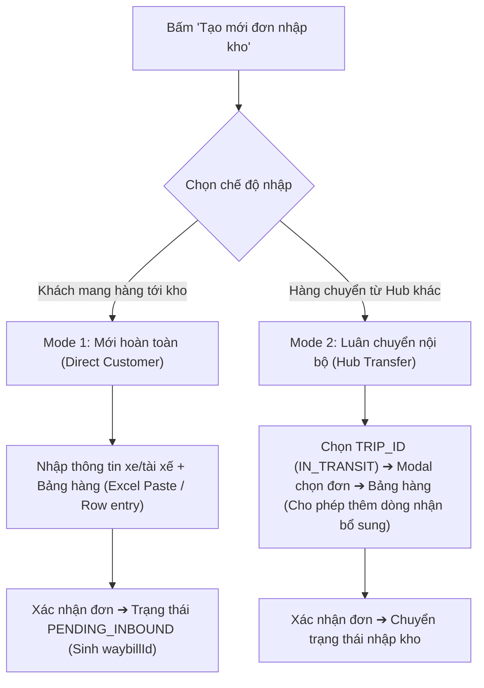
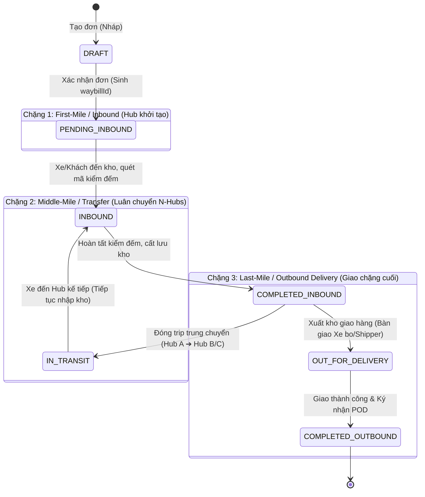

# Task Spec: Thiết Kế UI/UX Phân Hệ Quản Lý Kho (Warehouse Hub Operations)

> **Authority**: [leader](file:///.agents/skills/leader/SKILL.md) (TMS Business Architecture)  
> **Execution Agents**: [pencil-ui-designer](file:///.agents/skills/pencil-ui-designer/SKILL.md) & [ui-ux-flow-designer](file:///.agents/skills/ui-ux-flow-designer/SKILL.md)  
> **Auditing Agent**: [ui-spec-auditor](file:///.agents/skills/ui-spec-auditor/SKILL.md) (Compliance Gatekeeper)  
> **Canvas Output**: `pencil-workspace/pens/WAREHOUSE_FLOWS.pen`  
> **Authoritative References**:  
> - `docs_scan/form_create_new_don.JPG` (Màn hình tạo mới & Bảng nhập hàng)  
> - `docs_scan/workflow_trung_chuyen_hub_trip.JPG` (Quy trình luân chuyển Hub & Xe bo)  
> - `docs_scan/ke_hoach_dong_hang_so_trip.JPG` (Gom chuyến & Bảng kế hoạch Trip)  
> - `docs_scan/mau_phieu_nhap_kho.JPG` (Mẫu phiếu nhập kho & POD)  
> - `.agents/rules/rbac-matrix.md` (Phân quyền 3 lớp)  

---

## 🚨 1. NGUYÊN TẮC BẤT BIẾN (ZERO-TOLERANCE INVARIANTS)

Mọi agent (`pencil-ui-designer`, `ui-ux-flow-designer`, frontend/backend) bắt buộc tuân thủ 100% các điều kiện tiên quyết sau. Vi phạm bất kỳ điều nào sẽ bị `ui-spec-auditor` đánh **FAIL ngay lập tức**:

> [!CAUTION]
> ### QUY TẮC CẤM (FATAL ANTI-PATTERNS)
> 1. **TUYỆT ĐỐI KHÔNG QUẢN LÝ SKU / BARCODE / MÃ SẢN PHẨM LẺ (NO-SKU RULE):**
>    - TMS quản lý vận tải theo **kiện hàng/lô hàng tổng quan (Consignment/Freight Level)**.
>    - Thông số hàng hóa CHỈ gồm 4 trường: **Tên hàng** (mô tả tổng quát), **Số thùng/kiện**, **Số kg** (Gross weight), **Số khối ($m^3$ / CBM)**.
>    - CẤM tạo sub-item SKU, mã vạch từng sản phẩm lẻ, hoặc bảng quản lý tồn kho chi tiết từng mặt hàng.
> 2. **TUYỆT ĐỐI KHÔNG DÙNG FORM NHẬP TỪNG BƯỚC (NO WIZARD / STEPPER FORM):**
>    - Màn hình tạo đơn nhập hàng (Mode 1 & Mode 2) **PHẢI LÀ BẢNG NHẬP LIỆU DÒNG (Horizontal Row-by-Row Grid)** theo mẫu tài liệu scan `docs_scan/form_create_new_don.JPG`.
>    - Cho phép nhập liên tục nhiều dòng hàng ngang, phím Tab chuyển ô, copy-paste nhiều dòng từ Excel.
> 3. **TUYỆT ĐỐI KHÔNG THAY ĐỔI THỨ TỰ CỘT SO VỚI BẢN SCAN:**
>    - Thứ tự cột trên bảng nhập liệu PHẢI khớp 1:1 với bản scan thực tế của doanh nghiệp. Cấm tự ý đảo vị trí, thêm cột rác hoặc xóa cột bắt buộc.
> 4. **PENCIL ENGINE SCHEMA INVARIANT:**
>    - Trong file `.pen`, mọi Text Node **PHẢI DÙNG PROPERTY `"content"`**, TUYỆT ĐỐI KHÔNG DÙNG `"text"`.

---

## 👥 2. PHÂN QUYỀN & PHẠM VI TRUY CẬP (RBAC & HUB SCOPING)

| Vai trò (Role) | Mã Enum | Phạm vi dữ liệu (Hub Scoping) | Quyền hạn trên màn hình Kho |
| :--- | :--- | :--- | :--- |
| **Warehouse Manager** | `RoleEnum.WAREHOUSE_MANAGER` | **Strict Hub Scope** (`currentUser.hubId`) | Toàn quyền tạo đơn nhập kho, kiểm đếm hàng, xác nhận nhập/xuất kho tại Hub của mình. Không can thiệp Hub khác. |
| **Dispatcher** | `RoleEnum.DISPATCHER` | Toàn mạng lưới | Chỉ xem (Read-only) tiến độ nhập kho để điều phối chuyến xe. |
| **Fleet Manager** | `RoleEnum.FLEET_MANAGER` | Toàn mạng lưới xe | Chỉ xem (Read-only) kế hoạch hàng về để bố trí phương tiện. |
| **Super Admin** | `RoleEnum.SUPER_ADMIN` | Toàn hệ thống | Quản trị, giám sát và cấu hình. |

---

## 🔄 3. HAI CHẾ ĐỘ TẠO ĐƠN NHẬP KHO (DUAL-MODE SPECIFICATION)

Khi người dùng (Warehouse Manager) bấm nút **"Tạo mới đơn nhập kho"**, hệ thống cung cấp Tab chuyển đổi giữa 2 chế độ:

### Bảng so sánh chi tiết giữa 2 Mode:

| Tiêu chí | Mode 1: Mới hoàn toàn (Khách gửi) | Mode 2: Luân chuyển nội bộ (Hub-to-Hub) |
| :--- | :--- | :--- |
| **Nguồn hàng** | Khách hàng giao trực tiếp đến Hub. | Xe tuyến chở hàng từ Hub khác đến. |
| **Địa chỉ nhận hàng (Pickup Address)** | **Nhập tự do (Free text)** do khách cung cấp. | **Tự động điền (Read-only)**: Lấy `hubs.address` từ `currentUser.hubId`. |
| **Thông tin xe / Tài xế** | **Bắt buộc nhập**: Biển số xe, Họ tên tài xế, SĐT, Nhà thầu phụ/Đơn vị vận chuyển. | **Không cần nhập tay**: Tự động trích xuất khi chọn `TRIP_ID`. |
| **Cách nạp dữ liệu** | - Nhập từng dòng trực tiếp trên Grid. - Copy từ Excel (`Ctrl+C` ➔ `Ctrl+V`). - Import file Excel (.xlsx). | - Chọn từ danh sách `TRIP_ID` đang `IN_TRANSIT`. - Modal chọn 1 hoặc nhiều đơn trong Trip. - Hỗ trợ **nhận thêm hàng dọc đường** (bấm nút "Thêm dòng"). |
| **Trạng thái khởi tạo** | `PENDING_INBOUND` (Sinh mã vận đơn `waybillId`). | Cập nhật tiến trình luân chuyển của đơn trong chuyến. |

---

## 📐 4. QUY CÁCH BẢNG NHẬP LIỆU CHI TIẾT (1:1 THEO SCAN `form_create_new_don.JPG`)

Màn hình bảng nhập liệu phải tuân thủ nghiêm ngặt thứ tự và định dạng các cột sau:

### Bảng cấu hình các cột (Column Order & Data Types):

| STT | Tên cột trên UI | Kiểu nhập liệu (Control Type) | Bắt buộc (Required) | Quy tắc nghiệp vụ & Giá trị |
| :---: | :--- | :--- | :---: | :--- |
| **1** | **STT** | Text (Auto-increment) | Tự động | 1, 2, 3... |
| **2** | **Mã đơn hàng** | Text Input | **Bắt buộc** | Mã đơn định danh theo khách hàng / bill gửi. |
| **3** | **Địa chỉ nhận hàng** | Text Input (Mode 1) / Readonly (Mode 2) | **Bắt buộc** | Mode 1: Khách nhập; Mode 2: Tự lấy Hub hiện tại. |
| **4** | **Tên hàng** | Text Input | **Bắt buộc** | Mô tả hàng hóa tổng quan (VD: Thùng carton bánh kẹo, Vải cuộn...). Không ghi mã SKU. |
| **5** | **Khối lượng** *(Group Header)* | *Gồm 3 cột con bên dưới* | **Bắt buộc** | Nhóm chỉ số tải trọng vận tải: |
| 5.1 | — *Số thùng (kiện)* | Number Input (Integer) | Bắt buộc | Đơn vị đóng gói vận chuyển. |
| 5.2 | — *Số kg* | Number Input (Decimal) | Bắt buộc | Tổng khối lượng hàng (Gross weight). |
| 5.3 | — *Số kh ($m^3$ / CBM)* | Number Input (Decimal) | Bắt buộc | Tổng thể tích hàng hóa. |
| **6** | **Địa chỉ giao hàng** | **Dropdown 3 Chế độ (3-in-1 Selector)** | **Bắt buộc** | Cho phép chọn 1 trong 3 phân loại đích (xem mục 4.1). |
| **7** | **Ghi chú** | Text Input | Tùy chọn | Yêu cầu bảo quản, lưu ý bốc xếp, cồng kềnh... |
| **8** | **Thao tác** | Action Icons | N/A | Icon [Thêm dòng], [Nhân bản], [Xóa dòng]. |

#### 4.1. Chi tiết cột "Địa chỉ giao hàng" (Delivery Destination Selector):
Cột này bắt buộc có bộ chuyển đổi 3 lựa chọn (Segmented Tab hoặc Dropdown Category):
1. **Nhập địa chỉ thông thường (Free Text)**: Nhập số nhà, tên đường, phường/xã, quận/huyện cụ thể để giao chặng cuối.
2. **Hub cấp 1 (Dropdown Kho chính)**: Chọn các Hub trung tâm trong hệ thống (VD: Hub Hà Nội, Hub Đà Nẵng, Hub Sài Gòn).
3. **Hub cấp 2 / "Xe bo" (Dropdown Tuyến vệ tinh)**: Chọn các xe trung chuyển phân tán (VD: *Xe bo KH, Xe bo WT, Xe trung chuyển khu công nghiệp...*).

#### 4.2. Hỗ trợ thao tác Excel (Excel Grid Interaction):
- **Copy-Paste thông minh**: Cho phép người dùng chọn vùng dữ liệu trên Excel (`Ctrl+C`), click vào ô đầu tiên trên Grid và bấm `Ctrl+V`. Hệ thống tự động phân tách Tab/Dấu cách thành các dòng và cột tương ứng.
- **Import Excel File**: Nút tải file mẫu `.xlsx`, nút tải file lên hệ thống để tự động nạp bảng.
- **Xem lại & Chỉnh sửa**: Sau khi paste/import, người dùng được toàn quyền sửa từng ô trực tiếp trên bảng hoặc xóa từng dòng trước khi bấm "Xác nhận đơn".

---

## 🚚 5. NGHIỆP VỤ CHỌN TRIP LUÂN CHUYỂN (MODE 2 - TRIP SELECTION MODAL)

Khi thao tác ở chế độ **Luân chuyển nội bộ**:
1. **Thanh tìm kiếm Chuyến (Trip Search Toolbar)**:
   - Cho phép tìm kiếm các Trip có trạng thái `IN_TRANSIT` hướng về Hub của mình.
   - Hỗ trợ tìm kiếm đa tiêu chí: `Mã TRIP ID`, `Biển số xe`, `Tên tài xế`, `Số điện thoại tài xế`.
2. **Modal danh sách đơn hàng thuộc Trip**:
   - Hiển thị danh sách các đơn hàng đang nằm trên chuyến xe đó.
   - Mỗi dòng gồm: Checkbox chọn đơn, Mã đơn hàng, Tên hàng, Số thùng, Số kg, Số khối, Hub gửi, Ghi chú.
   - Hỗ trợ nút: **"Chọn tất cả"** hoặc chọn từng đơn lẻ.
3. **Nghiệp vụ xe nhận thêm hàng trên đường di chuyển (Mid-Transit Additions)**:
   - Cung cấp nút bấm: **"+ Thêm mặt hàng nhận thêm"**.
   - Khi bấm, sinh thêm 1 dòng trống trên bảng để thủ kho nhập bổ sung các kiện hàng phát sinh mà tài xế gom thêm dọc đường. Cho phép thêm nhiều dòng.
4. **Xác nhận nhập kho**:
   - Sau khi chọn đơn từ Trip và thêm hàng phát sinh (nếu có), thủ kho bấm nút **"Xác nhận nhập kho"** để hệ thống chính thức ghi nhận.

---

## 🔄 6. VÒNG ĐỜI ĐƠN HÀNG & MA TRẬN HÀNH ĐỘNG TRÊN UI (ORDER STATE MACHINE)

### Ma trận hiển thị dữ liệu & Nút bấm theo từng trạng thái:

| Giai đoạn | Trạng thái (`status`) | Actor chính | Dữ liệu trọng tâm trên UI | Các nút thao tác nghiệp vụ (Action Buttons) |
| :--- | :--- | :--- | :--- | :--- |
| **0. Khởi tạo** | `DRAFT` | Warehouse Manager / Khách hàng | Mã tạm, Khách hàng, Tên hàng, Số thùng, Khối lượng (Số kg, $m^3$), Ngày tạo | `[Chỉnh sửa]`, `[Xóa]`, `[Xác nhận đơn]` *(sinh mã `waybillId`)* |
| **1. Nhập kho** | `PENDING_INBOUND` | System / Dispatcher / Warehouse | `waybillId`, Mã đơn hàng, Tên/SĐT khách, Địa chỉ nhận, Giờ dự kiến | `[Bắt đầu nhập kho]`, `[In phiếu nhập/Tem kiện]`, `[Hủy đơn]` |
| | `INBOUND` | Warehouse Manager / Nhân viên kho | Vị trí bin/kệ dự kiến, Số lượng khai báo vs. Thực tế kiểm đếm, Tình trạng hàng, Ảnh chụp | `[Quét mã kiểm đếm]`, `[Ghi nhận bất thường]`, `[Hoàn tất nhập kho]` |
| | `COMPLETED_INBOUND` | Warehouse Manager | Vị trí lưu kho (Zone/Khu vực), Thời gian nhập kho, Số lượng đã lưu kho | `[Tạo kế hoạch xuất/Trip]`, `[Điều chuyển Hub khác]`, `[Bàn giao đi giao]` |
| **2. Trung chuyển** | `IN_TRANSIT` | Dispatcher / Tài xế xe tuyến | `tripId`, Biển số xe, Tên tài xế, Hub đi ➔ Hub đến, Giờ khởi hành & ETA | `[Theo dõi lộ trình]`, `[Xác nhận đến Hub đích]` |
| **3. Giao hàng** | `OUT_FOR_DELIVERY` | Tài xế giao hàng (Xe bo / Shipper) | Người nhận, Địa chỉ giao hàng, Tiền COD/Cước, Tài xế phụ trách | `[Gọi khách]`, `[Cập nhật trạng thái giao]`, `[Báo giao thất bại]`, `[Xác nhận giao thành công]` |
| **4. Hoàn tất** | `COMPLETED_OUTBOUND` | System / Tài xế / Khách hàng | Giờ giao thành công, Ảnh chứng từ POD, Chữ ký người nhận, Trạng thái thanh toán | `[Xem chi tiết đơn]`, `[In biên bản bàn giao/POD]`, `[Lịch sử hành trình]` |

> [!NOTE]
> **Thành phần bắt buộc trên màn hình Chi tiết đơn hàng (Order Detail):**
> 1. Phải có **Timeline Stepper** hiển thị trực quan tiến trình 3 chặng: *Nhập kho (Hub gốc) ➔ Luân chuyển (N-Hubs) ➔ Giao hàng (Hub đích/Khách)*.
> 2. Các nút thao tác chỉ được hiển thị đúng theo trạng thái tương ứng của đơn hàng.

---

## 🖨️ 7. QUY CÁCH CHỨNG TỪ & IN ẤN TẠI KHO (DOCUMENT & PRINT TEMPLATES)

Hệ thống kho yêu cầu tạo và in 4 loại chứng từ phục vụ bàn giao và dán kiện:

1. **Phiếu Nhập Kho (Inbound Receiving Slip)**:
   - Quy tắc sinh mã phiếu: `DDMMYY-xxxx` (VD: `280826-0025`).
   - Thông tin bắt buộc: Ngày tháng, Tài xế giao, Biển số xe, Nhập tại Hub nào.
   - Bảng chi tiết: Mã đơn hàng, Tên mặt hàng, Số lượng, Đơn vị tính (KG/Thùng), Dòng lũy kế tổng.
   - Ô ký nhận pháp lý 2 bên: **Thủ kho nhận hàng** (Ký & họ tên) và **Lái xe / Người giao hàng** (Ký & họ tên).
2. **Phiếu Xuất Kho (Outbound Dispatch Slip)**:
   - Dùng khi xuất hàng chuyển Hub hoặc bàn giao xe tuyến.
3. **Phiếu Giao Hàng (Delivery Note / POD)**:
   - Dùng khi xuất kho cho xe bo hoặc shipper giao chặng cuối. Có ô ký nhận của khách hàng.
4. **Tem Nhận Diện Đơn Hàng (Cargo Identification Label / Barcode Tag)**:
   - Dán trực tiếp lên từng thùng hàng / pallet.
   - Quy tắc in nhãn: Ghi rõ số kiện tổng quát theo cú pháp: `... / [Tổng số kiện]` (Ví dụ đơn có 50 kiện thì tem in: `... / 50 kiện`). Chừa chỗ ghi số thứ tự kiện/pallet khi bốc xếp thực tế.

---

## 📱 8. QUY CHUẨN GIAO DIỆN DI ĐỘNG (MOBILE & UX USABILITY)

Dành cho thủ kho cầm điện thoại thông minh hoặc máy quét PDA thao tác tại sàn kho:
1. **Touch Targets**: Chiều cao nút bấm, tab chuyển chế độ, ô nhập liệu tối thiểu **$\ge 44px$** (khuyến nghị $48px - 50px$).
2. **Xử lý Bảng trên Mobile**:
   - Không bắt cuộn ngang toàn trang.
   - Trên màn hình di động (< 640px), bảng nhập liệu tự động chuyển hóa thành danh sách **Thẻ hàng hóa (Cargo Item Cards)** xếp dọc, mỗi thẻ có đầy đủ thông tin tên hàng, số lượng, địa chỉ và nút xóa dòng.
3. **Sticky Action Bar**: Nút bấm quan trọng ("Xác nhận đơn", "Quét mã kiểm đếm") ghim cố định ở đáy màn hình di động (Sticky Bottom Bar) để dễ thao tác bằng ngón tay cái.

---

## ✅ 9. DANH MỤC NGHIỆM THU THIẾT KẾ (UI SPEC AUDITOR CHECKLIST)

Các agent kiểm tra từng tiêu chí trước khi bàn giao. `ui-spec-auditor` sẽ chấm điểm theo 5 tiêu chí:

- [ ] **Tiêu chí 1: Tuân thủ Cột & Bảng (docs_scan/form_create_new_don.JPG)**: Đủ các cột, đúng thứ tự, không có trường SKU/Barcode lẻ nào.
- [ ] **Tiêu chí 2: Đúng 2 Chế độ tạo đơn**: Phân tách rõ Tab "Mới hoàn toàn" (nhập thông tin xe + tự do) và "Luân chuyển nội bộ" (chọn TRIP_ID + khóa xe).
- [ ] **Tiêu chí 3: Bộ chọn "Địa chỉ giao hàng" 3 chế độ**: Đủ 3 tùy chọn (Nhập tự do, Hub cấp 1, Hub cấp 2 Xe bo).
- [ ] **Tiêu chí 4: Hỗ trợ Excel & Thêm dòng**: Có tính năng Paste từ Excel (`Ctrl+V`), nút thêm dòng nhận bổ sung dọc đường.
- [ ] **Tiêu chí 5: Trạng thái & Nút thao tác**: Chuẩn enum (`PENDING_INBOUND`, `INBOUND`, `COMPLETED_INBOUND`, v.v.) và Timeline Stepper 3 chặng.
- [ ] **Tiêu chí 6: Đủ 4 mẫu in**: Phiếu nhập kho (mã `DDMMYY-xxxx`), phiếu xuất kho, phiếu giao hàng, tem nhận diện `.../Tổng kiện`.
- [ ] **Tiêu chí 7: Mobile UX & Touch Target**: Nút bấm $\ge 44px$, giao diện thẻ dọc trên điện thoại, sticky bottom bar.
- [ ] **Tiêu chí 8: Pencil Engine Schema**: Toàn bộ Text Node trong `.pen` sử dụng `"content"`, không dùng `"text"`.
