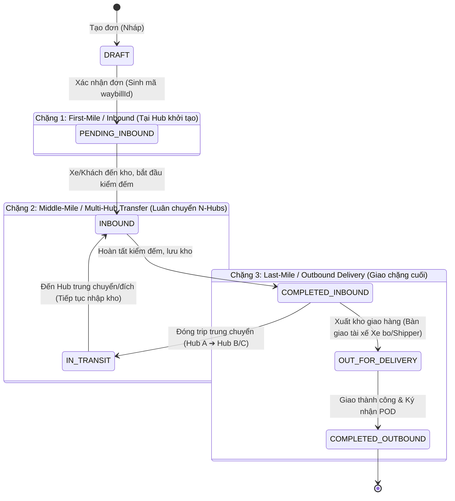

[leader](slashCommand;leader) lập plan, để sắp tới sẽ thêm 1 flow mới liên quan chú trọng vào nghiệp vụ của Kho (hubs)

[ui-ux-flow-designer](slashCommand;ui-ux-flow-designer) hãy tạo 1 file .pen mới nhé

**Yêu cầu về cách làm:**

- [leader](slashCommand;leader) làm việc cùng với [ui-ux-flow-designer](slashCommand;ui-ux-flow-designer) thiết kế UI flow trước mắt, UI sẽ support cơ bản cho mobile dễ thao tác nha (không nhất thiết phải thiết kế luôn mobile, nhưng phải đảm bảo mobile vẫn thao tác được nha, ví dụ như tab, nút bấm, dễ dàng điều hướng bằng ngón tay, hoặc ít cuộn ngang, zoom in/out không cần thiết)

- Khi UI đã được chốt thì tiến hành cho 2 agents phù hợp để dev frontend, backend làm việc. Yêu cầu 2 agents này phải đảm bảo UI đã hoàn thiện, UX đã ok, dễ thao tác cho mobile.

User story:
- Người quản lí Kho - Hub (có user được chỉ định là role Warehouse Manager) theo đúng hubId
cần có 1 màn hình tạo mới

**Yêu cầu chi tiết:**

1. Người quản lí Kho - Hub (có user được chỉ định là role Warehouse Manager) theo đúng hubId
cần có 1 màn hình tạo mới, khi click tạo mới sẽ có 2 mode: 

+ Mới hoàn toàn (nhập hàng từ khách hàng đưa vào kho)
+ Luân chuyển nội bộ (nhập hàng từ hub khác vào kho)

Màn hình tạo mới có UI follow theo các input, table, action button follow theo tài liệu scan ở folder docs_scan của dự án (.\docs_scan\form_create_new_don.JPG). Tuyệt đối không được thêm/bớt hoặc thay đổi vị trí các input/table/action button so với file scan. Yêu cầu tuân thủ các thông tin có trong tài liệu scan. Đây là tài liệu scan dạng ảnh, bạn UI cần dựa vào đó để thiết kế UI theo đúng yêu cầu. Yêu cầu thiết kế UI trên nền tảng web, app hỗ trợ cơ bản mobile.

**QUAN TRỌNG: Giao diện nhập hàng ở case "Mới hoàn toàn (nhập hàng từ khách hàng đưa vào kho)" sẽ mong muốn là dạng table như trong file scan, cho phép nhập liệu row by row (theo chiều ngang), không phải form dạng bước (wizard) hay dạng step.** 

**Bổ sung chi tiết:**
- Cột **"Địa chỉ giao hàng"** sẽ có 3 options:
  1. Nhập địa chỉ giao hàng thông thường (nhập free text).
  2. Chọn địa chỉ dropdown từ Hub khác (Hub cấp 1).
  3. Chọn Hub cấp 2 (Hub phân cấp thấp hơn), được gọi là "Xe bo"

- Khi nhập kho, giao diện có thêm lựa chọn là chọn vào 1 TRIP_ID (của các trip có trạng thái IN_TRANSIT) để thao tác nhanh, khi chọn vào thì sẽ hiện ra 1 modal hiển thị danh sách các đơn thuộc trip đó, cho phép người dùng chọn 1 hoặc nhiều đơn để nhập kho. Tuyệt đối không được thêm/bớt hoặc thay đổi vị trí các input/table/action button so với file scan. Người dùng phải click vào nút "Xác nhận đơn" mới thực sự xác nhận nhập kho. Logic trên UI để tìm TRIP_ID search theo mã TRIP ID, biển số xe, tên tài xế, sđt tài xế.

- Khi nhập hàng từ nguồn luân chuyển nội bộ, có thể thêm trường hợp là xe chở hàng có nhận thêm hàng trong lúc di chuyển, vì thế ở giao diện nhập kho (mode luân chuyển nội bộ) có cho thêm lựa chọn thêm item trong lúc nhập hàng. Khi người dùng chọn thêm item thì sẽ hiện thêm 1 dòng trống để nhập thông tin item; có thể thêm nhiều dòng.

- Nhập thông tin xe (Biển số xe, Tài xế, SĐT, Nhà thầu phụ) áp dụng mode: Nhập hàng từ khách hàng đưa vào kho. Còn đối với mode Luân chuyển nội bộ thì đã lựa chọn từ TRIP_ID, nên không cần nhập thông tin xe.

- Nhập kho trên giao diện ở mode **Mới hoàn toàn**, thì cho thêm option là nhập bằng excel (thao tác copy-paste từ excel vào table, column order phải đúng theo file scan), hoặc là import excel file. Sau khi copy paste hoặc import excel file xong thì cho phép xem lại danh sách mặt hàng đã nhập, cũng như chỉnh sửa lại thông tin mặt hàng trước khi xác nhận đơn, cũng như có thể xóa từng dòng mặt hàng.

- Khi tạo xong, đơn hàng sẽ ở trạng thái **PENDING_INBOUND** (Chờ nhập kho).

### **Các file cần in ra khi nhập kho**
- Phiếu nhập kho (nội bộ hub).
- Phiếu xuất kho (nếu là luân chuyển nội bộ).
- Phiếu giao hàng (nếu là giao hàng chặng cuối).
- Ngoài ra còn có phiếu in ra để dán vào từng thùng hàng. Chỉ cần ghi số lượng tổng (số kiện), chừa trống số lượng trên từng pallet, từng block, ví dụ có 5 pallet, mỗi pallet có 10 kiện hàng, thì ghi số lượng tổng là 50, còn mỗi pallet chừa trống số lượng => ghi 3 chấm kèm với tổng kiện hàng .../50 kiện hàng. Đây gọi là "tem nhận diện đơn hàng".

=> Các file này được tạo ra khi có sự kiện nhập kho, xuất kho, giao hàng. Phải đảm bảo thông tin trên các file này là chính xác.

### **Quy định trạng thái đơn hàng (Order Status Lifecycle)**

| Mã trạng thái (Enum) | Tên hiển thị (VN) | Tên tiếng Anh | Mã vận đơn (`waybillId`) | Mô tả nghiệp vụ |
| :--- | :--- | :--- | :---: | :--- |
| `DRAFT` | **Nháp** | Draft | ❌ Chưa có | Đơn hàng mới tạo ở dạng bản nháp, chưa xác nhận vào hệ thống. |
| `PENDING_INBOUND` | **Chờ nhập kho** | Pending Inbound | ✅ Đã sinh mã | Đơn hàng đã được xác nhận, hệ thống sinh mã vận đơn, đang chờ hàng về kho để kiểm tiếp nhận. |
| `INBOUND` | **Đang nhập kho** | Inbound | ✅ Đã sinh mã | Kho đang tiến hành kiểm đếm, quét mã và phân loại hàng tại Hub. |
| `COMPLETED_INBOUND`| **Đã nhập kho** | Completed Inbound | ✅ Đã sinh mã | Hàng đã hoàn tất nhập kho, lưu trữ an toàn trong Hub. |
| `IN_TRANSIT` | **Đang trung chuyển** | In Transit | ✅ Đã sinh mã | Hàng đã xuất kho và đang trong quá trình vận chuyển luân chuyển giữa các Hub. |
| `OUT_FOR_DELIVERY` | **Đang giao hàng** | Out for Delivery | ✅ Đã sinh mã | Hàng đã bàn giao cho tài xế/xe đi giao hàng chặng cuối cho khách hàng. |
| `COMPLETED_OUTBOUND`| **Đã xuất kho** | Completed Outbound | ✅ Đã sinh mã | Hàng đã xuất ra khỏi kho và hoàn tất giao hàng đến người nhận. |

### **Vòng đời của đơn hàng & Quy tắc hiển thị UI theo trạng thái (Order Lifecycle & UI State Specifications)**

Hệ thống theo dõi toàn bộ vòng đời đơn hàng theo biểu đồ `business_flow/1_vong_doi_don_hang.png` gồm 3 chặng vận hành chính: **1. First-mile / Inbound** (Tiếp nhận hàng từ khách) ➔ **2. Middle-mile / Multi-Hub Transit** (Luân chuyển mạng lưới N-Hubs) ➔ **3. Last-mile / Outbound Delivery** (Giao hàng đến người nhận).

#### **Ma trận dữ liệu & Hành vi UI theo từng trạng thái (AI Agent Actionable Matrix)**

| Giai đoạn (Phase) | Trạng thái (`status`) | Actor & Hành động kích hoạt | Dữ liệu hiển thị trọng tâm trên UI | Các nút thao tác nghiệp vụ (UI Action Buttons) |
| :--- | :--- | :--- | :--- | :--- |
| **0. Khởi tạo** | `DRAFT` | **Warehouse Manager / Khách hàng** Lưu nháp đơn | Mã tạm thời, Khách hàng, Tên hàng, Số thùng, Khối lượng (Số kg, Số khối m³), Ngày tạo | `[Chỉnh sửa]`, `[Xóa]`, `[Xác nhận đơn]` (chuyển sang `PENDING_INBOUND` + sinh `waybillId`) |
| **1. Nhập kho** | `PENDING_INBOUND` | **System / Dispatcher** Đã chốt đơn, chờ hàng về kho | `waybillId`, Mã đơn hàng, Tên/SĐT khách hàng, Địa chỉ nhận/lấy hàng, Ngày giờ dự kiến bốc hàng | `[Bắt đầu nhập kho]`, `[In phiếu nhập/Mã QR]`, `[Hủy đơn]` |
| | `INBOUND` | **Warehouse Manager / Nhân viên kho** Hàng đang tại sàn kho | Vị trí bin/kệ dự kiến, Số thùng & Số kg khai báo vs. Thực tế kiểm đếm, Tình trạng hàng (Nguyên vẹn/Hư hỏng), Ảnh chụp kiện hàng | `[Quét mã kiểm đếm]`, `[Ghi nhận bất thường]`, `[Hoàn tất nhập kho]` |
| | `COMPLETED_INBOUND` | **Warehouse Manager** Đã nhập kho thành công | Vị trí lưu kho (Hub ID, Zone/Khu vực), Thời gian nhập kho, Số thùng/kg đã lưu kho, Sẵn sàng điều phối xuất | `[Tạo kế hoạch xuất/Trip]`, `[Điều chuyển Hub khác]`, `[Bàn giao đi giao]` |
| **2. Trung chuyển** | `IN_TRANSIT` | **Dispatcher / Tài xế xe tuyến** Đã xuất khỏi Hub gửi | `tripId`, Biển số xe, Tên tài xế, Hub xuất phát ➔ Hub đích tiếp theo, Thời gian khởi hành & Dự kiến đến | `[Theo dõi lộ trình xe]`, `[Xác nhận đến Hub đích]` (chuyển Hub đích sang `INBOUND`) |
| **3. Giao hàng** | `OUT_FOR_DELIVERY` | **Tài xế giao hàng (Xe bo / Shipper)** Xuất kho chặng cuối | Tên/SĐT người nhận, Địa chỉ giao hàng chi tiết (Mode 1/2/3), Tiền thu hộ (COD/Cước), Tài xế giao phụ trách | `[Gọi khách]`, `[Cập nhật trạng thái giao]`, `[Báo giao thất bại]`, `[Xác nhận giao thành công]` |
| **4. Hoàn tất** | `COMPLETED_OUTBOUND` | **System / Tài xế** Khách đã nhận hàng | Thời gian giao thành công, Ảnh chứng từ giao hàng (POD - Proof of Delivery), Chữ ký người nhận, Trạng thái thanh toán | `[Xem chi tiết đơn]`, `[In biên bản bàn giao/POD]`, `[Lịch sử hành trình]` |

> [!NOTE]
> **Quy tắc hiển thị đa trạng thái (Lifecycle Visualizer Component):**
> 1. Mọi màn hình chi tiết đơn hàng (Order Detail) hoặc Modal xem nhanh MUST tích hợp **Timeline Stepper** hiển thị tiến trình 3 chặng trực quan: *Nhập kho (Hub gốc) ➔ Luân chuyển (N-Hubs) ➔ Giao hàng (Hub đích/Khách)*.
> 2. Các trường dữ liệu nhạy cảm hoặc không liên quan đến trạng thái hiện tại phải được ẩn hoặc đưa vào collapsible drawer để tối ưu giao diện trên thiết bị di động (Mobile Responsive).

### **Quy tắc xử lý cột "Địa chỉ nhận hàng" (Pickup Address Logic)**

- **Mode 1: Tạo mới hoàn toàn (Khách gửi hàng)**
  - **Kiểu nhập:** Free text.
  - **Mô tả:** Cho phép Warehouse Manager nhập tự do địa chỉ lấy/nhận hàng do khách hàng cung cấp.

- **Mode 2: Luân chuyển nội bộ (Hub-to-Hub Transfer)**
  - **Kiểu nhập:** Tự động điền (Auto-fill / Readonly).
  - **Logic trích xuất DB:**
    - Lấy `hubId` của user hiện tại đang đăng nhập (`currentUser.hubId` từ table `users`).
    - Query table `hubs` theo `id = currentUser.hubId`.
    - Gán giá trị cột `hubs.address` làm địa chỉ nhận hàng (kho gửi).

### **Các ghi chú nghiệp vụ & UX đặc thù từ tài liệu scan (Key Business & UX Specifications)**

#### **1. Nghiệp vụ Gom đơn & Đóng chuyến (Trip / Sổ Trip Planning)**
*(Nguồn: `docs_scan/ke_hoach_dong_hang_so_trip.JPG` & `docs_scan/workflow_trung_chuyen_hub_trip.JPG`)*
- **Header thông tin Trip (Chuyến xe vận chuyển):**
  - Thông tin xe/tài xế: `Ngày/tháng/năm`, `Nhà thầu vận tải (3PL/Đội xe)`, `Biển số xe`, `Họ tên tài xế / Người nhận`, `Số điện thoại`.
- **Bảng gom đơn vào Trip (Consolidation Grid):**
  - Mỗi chuyến xe cho phép gom nhiều đơn hàng (VD: 5 đến 10 đơn lẻ, tổng trọng lượng 100kg – 4,000kg, thể tích CBM tương ứng).
  - Cột `Mã đơn hàng` là khóa chính định danh để theo dõi xuyên suốt hành trình.
  - Cột `Đã soạn` (Checkbox): Cho phép nhân viên kho tick chọn xác nhận hàng đã tập kết đủ tại cửa xuất bến trước khi cho xe lăn bánh.
- **Tính năng UX quan trọng (Excel Copy/Paste Grid):**
  - UI cần hỗ trợ cơ chế **Copy từ Excel ➔ Paste trực tiếp vào bảng đơn hàng** (`Ctrl + C` từ file Excel ➔ `Ctrl + V` tự động parse thành dòng dữ liệu trên Grid) giúp thao tác nhập liệu nhanh, giảm thời gian gõ thủ công.

#### **2. Phân cấp Hub & Mô hình luân chuyển nội bộ (Hub Hierarchy)**
*(Nguồn: `docs_scan/workflow_trung_chuyen_hub_trip.JPG`)*
- **Level 1 (Hub chính / Kho trung tâm):** Hub A, Hub B, Hub C (các Hub cấp 1 có kho bãi, quản lý theo dõi `INBOUND`, `COMPLETED_INBOUND`, `IN_TRANSIT`).
- **Level 2 (Hub vệ tinh / Xe trung chuyển nhỏ):** Được gọi là **"Xe bo"** (VD: *Xe bo KH, Xe bo WT...*).
  - Đóng vai trò gom hàng linh hoạt hoặc giao phân tán chặng cuối từ Hub chính đến các điểm giao hàng nhỏ lẻ.
- **3 Chặng luân chuyển tổng thể (3 Legs):**
  - **Chuyến 1 (First-mile):** Khách hàng ➔ Hub A (Tạo đơn + Nhập kho Hub khởi tạo).
  - **Chuyến 2 (Middle-mile):** Hub A ➔ Hub B / Hub C (Đóng Trip xe tuyến trung chuyển giữa các Hub).
  - **Chuyến 3 (Last-mile):** Hub đích ➔ Khách nhận / Điểm giao (Xe bo / Shipper xuất kho giao hoàn tất).

#### **3. Quy tắc Phiếu Nhập Kho & Ký nhận (Inbound Receiving Slip & POD)**
*(Nguồn: `docs_scan/mau_phieu_nhap_kho.JPG`)*
- **Quy tắc sinh Mã Phiếu Nhập Kho:** `DDMMYY-xxxx` (VD: `280826-0025` = ngày 28/08/2026, số thứ tự 0025 trong ngày).
- **Thông tin tiếp nhận tại Hub:**
  - `Ngày/tháng/năm`, `Tài xế giao hàng`, `Biển số xe`, `Nhập tại Kho` (Tên Hub nhận).
  - Chi tiết hàng: `Mã đơn hàng`, `Tên mặt hàng`, `Số sêri / Số lô` (nếu có ghi chú), `Số lượng`, `Đơn vị tính (KG/Thùng)`, `Dòng luỹ kế tổng`.
- **Ký nhận 2 bên (Bàn giao có giá trị pháp lý):**
  - **Thủ kho nhận hàng** (Ký & họ tên).
  - **Lái xe / Người giao hàng** (Ký & họ tên xác nhận đã bàn giao đủ hàng và chứng từ đi kèm).

