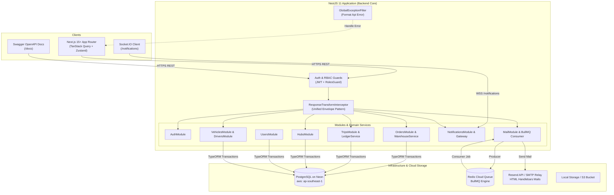
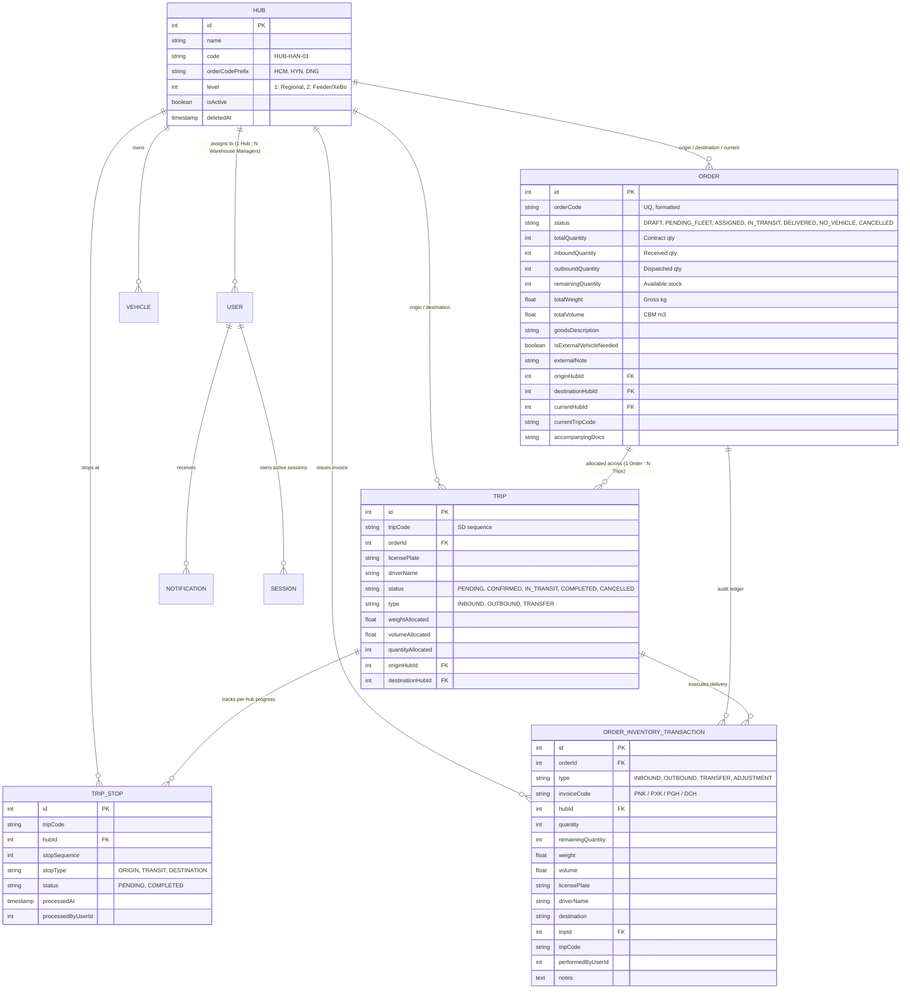
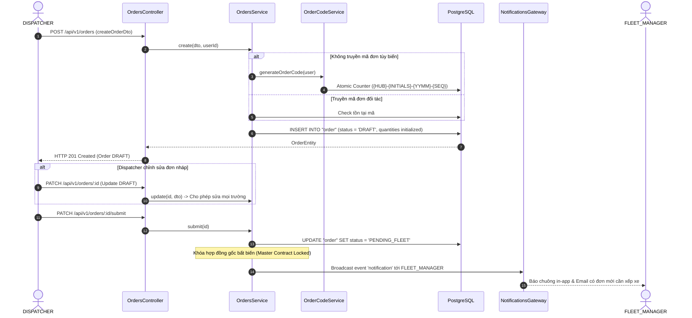
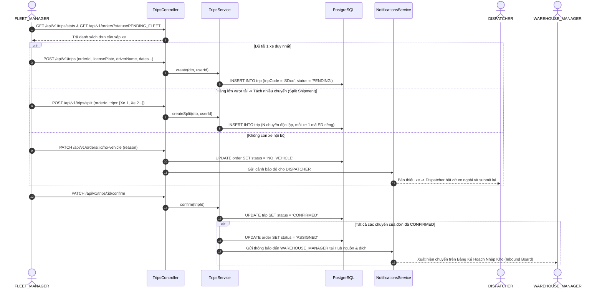
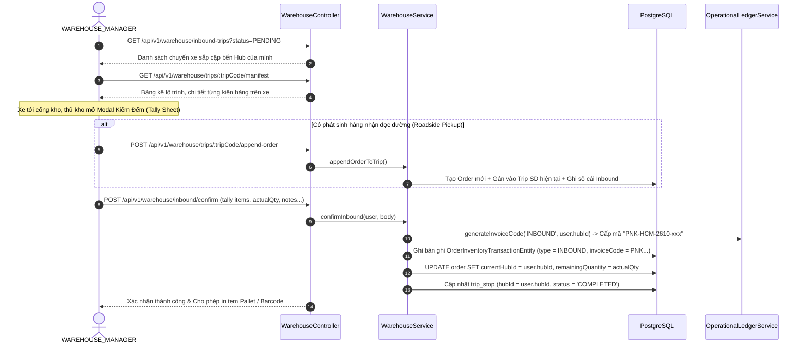
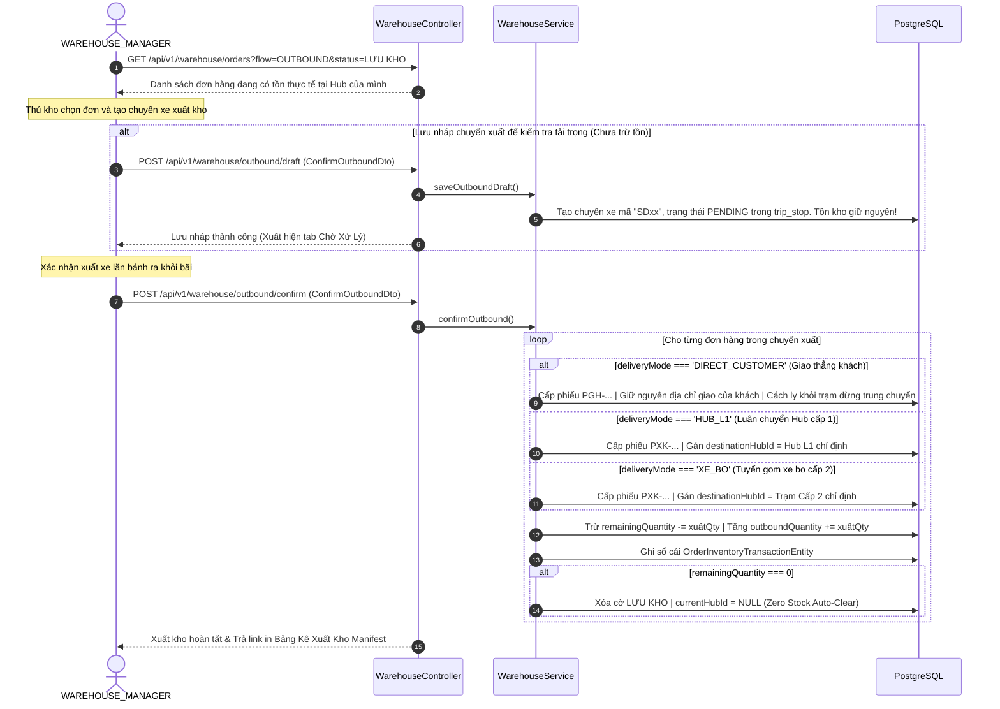

# 📘 TÀI LIỆU KỸ THUẬT TOÀN DIỆN BACKEND — LOGISTICS TMS (SPIDER EXPRESS)
> **Kiến trúc hệ thống, Luồng nghiệp vụ End-to-End & Danh mục API chi tiết**  
> **Nguồn sự thật kỹ thuật**: Trích xuất trực tiếp từ mã nguồn [`backend/`](file:///d:/Projects/logistics-website/backend)  
> **Góc nhìn nghiệp vụ**: Tham chiếu Leader Domain Guidelines ([`AGENTS.md`](file:///d:/Projects/logistics-website/AGENTS.md), [`leader/SKILL.md`](file:///d:/Projects/logistics-website/.agents/skills/leader/SKILL.md), [`rbac-matrix.md`](file:///d:/Projects/logistics-website/.agents/rules/rbac-matrix.md))  
> **Phiên bản hệ thống**: `v1.0.0` (Production Milestone) | **Cập nhật**: Tháng 10/2026

---

## 📑 MỤC LỤC

1. [TỔNG QUAN KIẾN TRÚC HỆ THỐNG & CÔNG NGHỆ CỐT LÕI](#1-tổng-quan-kiến-trúc-hệ-thống--công-nghệ-cốt-lõi)
2. [CÁC NGUYÊN TẮC BẤT BIẾN NGHIỆP VỤ (LEADER DOMAIN INVARIANTS)](#2-các-nguyên-tắc-bất-biến-nghiệp-vụ-leader-domain-invariants)
3. [MÔ HÌNH THỰC THỂ CƠ SỞ DỮ LIỆU (DATABASE ERD & ENTITIES)](#3-mô-hình-thực-thể-cơ-sở-dữ-liệu-database-erd--entities)
4. [CHI TIẾT TỪNG FLOW NGHIỆP VỤ & KỸ THUẬT (END-TO-END FLOWS)](#4-chi-tiết-từng-flow-nghiệp-vụ--kỹ-thuật-end-to-end-flows)
   - [Flow 1: Tiếp Nhận & Quản Lý Hợp Đồng Vận Chuyển (Orders)](#flow-1-tiếp-nhận--quản-lý-hợp-đồng-vận-chuyển-orders)
   - [Flow 2: Lập Kế Hoạch & Phân Bổ Đội Xe (Trips & Fleet Dispatch)](#flow-2-lập-kế-hoạch--phân-bổ-đội-xe-trips--fleet-dispatch)
   - [Flow 3: Vận Hành Nhập Kho & Kiểm Đếm Dỡ Hàng (Inbound & Tally)](#flow-3-vận-hành-nhập-kho--kiểm-đếm-dỡ-hàng-inbound--tally)
   - [Flow 4: Vận Hành Xuất Kho & 3 Hình Thức Giao Nhận (Outbound & Delivery Modes)](#flow-4-vận-hành-xuất-kho--3-hình-thức-giao-nhận-outbound--delivery-modes)
   - [Flow 5: Quản Lý Tồn Kho & Sổ Cái Giao Dịch Bất Biến (Inventory Ledger)](#flow-5-quản-lý-tồn-kho--sổ-cái-giao-dịch-bất-biến-inventory-ledger)
   - [Flow 6: Mạng Lưới Chi Nhánh Kho & Quản Trị Đội Xe (Hubs & Fleet Network)](#flow-6-mạng-lưới-chi-nhánh-kho--quản-trị-đội-xe-hubs--fleet-network)
   - [Flow 7: Xác Thực, Phân Quyền & Hạ Tầng Truyền Tin (Auth, RBAC & Notifications)](#flow-7-xác-thực-phân-quyền--hạ-tầng-truyền-tin-auth-rbac--notifications)
5. [DANH MỤC TRA CỨU TOÀN BỘ API BACKEND (EXHAUSTIVE API CATALOG)](#5-danh-mục-tra-cứu-toàn-bộ-api-backend-exhaustive-api-catalog)
   - [5.1. Orders Controller (`/api/v1/orders`)](#51-orders-controller-apiv1orders)
   - [5.2. Warehouse Controller (`/api/v1/warehouse`)](#52-warehouse-controller-apiv1warehouse)
   - [5.3. Trips Controller (`/api/v1/trips`)](#53-trips-controller-apiv1trips)
   - [5.4. Vehicles Controller (`/api/v1/vehicles`)](#54-vehicles-controller-apiv1vehicles)
   - [5.5. Drivers Controller (`/api/v1/drivers`)](#55-drivers-controller-apiv1drivers)
   - [5.6. Hubs Controller (`/api/v1/hubs`)](#56-hubs-controller-apiv1hubs)
   - [5.7. Users Controller (`/api/v1/users`)](#57-users-controller-apiv1users)
   - [5.8. Authentication Controller (`/api/v1/auth` & Social)](#58-authentication-controller-apiv1auth--social)
   - [5.9. Notifications Controller (`/api/v1/notifications`)](#59-notifications-controller-apiv1notifications)
   - [5.10. Mail & Queue Controller (`/api/v1/mail`)](#510-mail--queue-controller-apiv1mail)
   - [5.11. Files Controller (`/api/v1/files`)](#511-files-controller-apiv1files)
   - [5.12. Home & Health Controller (`/` & `/health`)](#512-home--health-controller---health)
6. [QUY CHUẨN ĐÓNG GÓI PHẢN HỒI (UNIFIED ENVELOPE) & XỬ LÝ LỖI](#6-quy-chuẩn-đóng-gói-phản-hồi-unified-envelope--xử-lý-lỗi)

---

## 1. TỔNG QUAN KIẾN TRÚC HỆ THỐNG & CÔNG NGHỆ CỐT LÕI

Hệ thống Backend Logistics TMS (Spider Express) được xây dựng theo kiến trúc **Modular Monolith** trên nền tảng **NestJS 11+**, giao tiếp với cơ sở dữ liệu quan hệ PostgreSQL trên Neon Cloud và các dịch vụ hàng đợi, truyền tin thời gian thực.



### Thông Số Công Nghệ:
- **Ngôn ngữ & Runtime**: Node.js 20+ LTS, TypeScript 5.7+
- **Backend Framework**: NestJS 11 (Express platform)
- **Database & ORM**: PostgreSQL 16 trên Neon Cloud (Singapore `ap-southeast-1`), TypeORM 0.3+ với cơ chế Migration tự động.
- **Bảo mật & Phiên làm việc**: Passport JWT (Access Token ngắn hạn) + Refresh Token lưu HttpOnly Cookie an toàn + `SessionEntity` quản lý phiên đa thiết bị.
- **Hàng đợi ngầm (Message Queue)**: BullMQ + Redis Cloud cho các tác vụ gửi email thông báo, đảm bảo các giao dịch DB không bao giờ bị nghẽn (Non-blocking).
- **Truyền tin thời gian thực**: Socket.IO Gateway (`/notifications` namespace) phát thông báo tức thì đến người dùng theo `userId`.
- **Đóng gói chuẩn hóa (Envelope Pattern)**: Mọi API trả về cấu trúc `{ statusCode, message, data, meta, timestamp }`.

---

## 2. CÁC NGUYÊN TẮC BẤT BIẾN NGHIỆP VỤ (LEADER DOMAIN INVARIANTS)

Để đảm bảo hệ thống vận hành thực tế không bị xung đột dữ liệu hay sai lệch số lượng hàng hóa, đội ngũ kiến trúc đã thiết lập 9 nguyên tắc bất biến:

1. **Quy chuẩn Kiện Vận Tải No-SKU (Consignment / Freight Level)**:
   - Hệ thống vận hành theo kiện hàng thực tế: **Tên hàng hóa**, **Số kiện / thùng**, **Số kg** (Gross Weight), **Số khối ($m^3$)**.
   - Tuyệt đối không quản lý mã SKU chi tiết hay chia nhỏ cấp độ bán lẻ trong core TMS.
2. **Quy chuẩn Không Quản Lý Vị Trí Kho (No Bin / Rack Management)**:
   - Hàng hóa chỉ định danh theo **Kho lưu trữ hiện tại (`currentHubId`)** và **Trạng thái lưu kho (`LƯU KHO`, `DRAFT`)**.
   - Không lưu tọa độ kệ hàng (A-01, Kệ B...).
3. **Tính Toàn Vẹn Chỉ Số Nghiệp Vụ (Dynamic Counter & Metric Integrity)**:
   - Tuyệt đối không sử dụng số ngẫu nhiên hay mock number trên giao diện. Mọi con số (thống kê KPI, số lượng trên tab filter, badges) đều được tính toán dynamic từ câu truy vấn SQL Backend, đạt độ tương quan 1:1 (`1:1 Parity`) với bảng danh sách.
4. **Hợp Đồng Gốc Bất Biến Sau Trạng Thái Nháp (Master Contract Immutability)**:
   - Các trường thuộc hợp đồng gốc: `totalQuantity`, `totalWeight`, `totalVolume`, `goodsDescription`, `originHubId`, `destinationHubId`, `route`.
   - Khi đơn hàng rời khỏi trạng thái `DRAFT`, các trường này bị **KHÓA BẤT BIẾN**. Mọi vai trò (kể cả Dispatcher hay Warehouse Manager) đều không được chỉnh sửa qua API thông thường.
   - Chỉ duy nhất `SUPER_ADMIN` được quyền điều chỉnh qua endpoint `PATCH /orders/:id/admin-override` với điều kiện bắt buộc nhập `auditReason` và hệ thống tự động ghi một phiếu điều chỉnh hợp đồng `DCH-...` vào sổ cái.
5. **Cơ Chế Sinh Mã Đơn Hàng Chuẩn Doanh Nghiệp (Canonical Order Code)**:
   - Format: `{HUB_PREFIX}-{OPERATOR_INITIALS}-{YYMM}-{SEQUENCE}` (Ví dụ: `HCM-LTV-2610-001`).
   - Cấp phát nguyên tử (Atomic Counter) trong cùng Database Transaction với đơn hàng, không tái sử dụng mã khi hủy, chống trùng lặp tuyệt đối.
6. **Mã Chuyến Xe Toàn Cục Ngắn Gọn (SD Trip Code Sequence)**:
   - Các chuyến xe do đội xe tạo hoặc các chuyến xuất/nhập gom hàng tại kho dùng chung chuỗi sequence PostgreSQL toàn cục: `SD1`, `SD2`, ... `SD100`...
7. **Sổ Cái Giao Dịch Kho Bất Biến (Immutable Operational Ledger)**:
   - Mọi hoạt động nhập, xuất, luân chuyển hoặc điều chỉnh số lượng đều sinh bản ghi `OrderInventoryTransactionEntity` kèm mã phiếu vận hành:
     * `PNK-...`: Phiếu nhập kho (Inbound).
     * `PXK-...`: Phiếu xuất kho luân chuyển giữa các Hub (Transfer).
     * `PGH-...`: Phiếu giao hàng tận nơi cho khách lẻ (Outbound).
     * `DCH-...`: Phiếu điều chỉnh hợp đồng gốc (Adjustment).
8. **Cách Ly Dữ Liệu Tồn Kho Tuyệt Đối Theo Hub (Hub Data Isolation)**:
   - Quản lý kho tại Hub nào chỉ có quyền thao tác và xuất những đơn hàng đang có tồn thực tế tại Hub đó (`currentHubId === user.hubId`).
9. **Tự Động Xóa Nhãn Lưu Kho Khi Hết Tồn (Zero-Stock Auto-Clear)**:
   - Khi một đơn hàng xuất hết toàn bộ số kiện (`remainingQuantity = 0`), nhãn `LƯU KHO` tự động biến mất và `currentHubId` chuyển về `NULL`.

---

## 3. MÔ HÌNH THỰC THỂ CƠ SỞ DỮ LIỆU (DATABASE ERD & ENTITIES)



---

## 4. CHI TIẾT TỪNG FLOW NGHIỆP VỤ & KỸ THUẬT (END-TO-END FLOWS)

### Flow 1: Tiếp Nhận & Quản Lý Hợp Đồng Vận Chuyển (Orders)
- **Vai trò thực hiện**: `DISPATCHER`, `SUPER_ADMIN`.
- **Mục tiêu**: Nhận thông tin gửi hàng từ khách hàng, tạo hợp đồng vận chuyển, kiểm tra tính hợp lệ và đưa vào hàng đợi điều xe của Đội xe.



- **Logic kỹ thuật sâu**:
  1. `OrdersService.create()` khởi tạo 4 chỉ số số lượng: `totalQuantity` = DTO qty, `inboundQuantity` = DTO qty, `outboundQuantity` = 0, `remainingQuantity` = DTO qty.
  2. Khi `submit()`: Đơn hàng chuyển sang `PENDING_FLEET`. Kể từ lúc này, mọi request tới `PATCH /orders/:id` mà thay đổi bất kỳ trường hợp đồng gốc nào (`CONTRACT_FIELDS`) sẽ bị `OrdersService.update()` ném ngoại lệ `ForbiddenException (403)` ngay lập tức.
  3. Nếu điều xe ngoài (`isExternalVehicleNeeded = true`), bắt buộc phải có `externalNote`, nếu thiếu sẽ trả lỗi `UnprocessableEntityException (422)`.

---

### Flow 2: Lập Kế Hoạch & Phân Bổ Đội Xe (Trips & Fleet Dispatch)
- **Vai trò thực hiện**: `FLEET_MANAGER`, `SUPER_ADMIN`.
- **Mục tiêu**: Kiểm tra khối lượng và thể tích của các đơn `PENDING_FLEET`, tạo Chuyến xe (`Trips`), gán xe, tài xế và ngày giờ đón trả. Hỗ trợ tách nhiều chuyến (Split Shipment) hoặc báo thiếu xe (`NO_VEHICLE`).



- **Logic kỹ thuật sâu**:
  1. `TripsService.create()` tự động nhận diện nếu `order.originHubId !== order.destinationHubId` thì chuyến xe mang type `TRANSFER` (luân chuyển liên Hub), ngược lại mang type `OUTBOUND`.
  2. Mỗi chuyến xe sinh mã toàn cục bằng sequence `SD...` qua `OperationalLedgerService.generateTripCode()`.
  3. `resolveWarehouseManagerRecipients()`: Backend thông minh chỉ gửi thông báo WebSocket/Email đến các Quản lý kho có `hubId` khớp với `originHubId` hoặc `destinationHubId` của đơn hàng, không gửi tràn lan toàn hệ thống.

---

### Flow 3: Vận Hành Nhập Kho & Kiểm Đếm Dỡ Hàng (Inbound & Tally)
- **Vai trò thực hiện**: `WAREHOUSE_MANAGER`, `SUPER_ADMIN`.
- **Mục tiêu**: Tiếp nhận xe đến bãi dỡ hàng, đối chiếu số kiện thực nhận với phiếu xuất phát (Tally Sheet), bốc hàng dọc đường hoặc nhập nhanh hàng khách mang thẳng đến gửi tại kho.



- **Các trường hợp nhập kho khác**:
  - **Nhập khách lẻ trực tiếp (`quickCreateInboundOrder`)**: Khách chở hàng tới gửi tại quầy. Hệ thống sinh đơn hàng mới, tự động cấp mã phiếu `PNK-...`, set trạng thái tồn kho là `LƯU KHO` tại Hub hiện tại mà không cần gắn vào chuyến xe nào.
  - **Nhập lô xe tải nhiều đơn (`batchCreateInboundOrders`)**: Tạo 1 chuyến xe gom và nhiều dòng đơn hàng cùng lúc, tự động tạo mã pallet và đồng bộ số dư kho.

---

### Flow 4: Vận Hành Xuất Kho & 3 Hình Thức Giao Nhận (Outbound & Delivery Modes)
- **Vai trò thực hiện**: `WAREHOUSE_MANAGER`, `SUPER_ADMIN`.
- **Mục tiêu**: Điều phối hàng đang lưu tại kho lên xe xuất đi, hỗ trợ 3 hình thức giao nhận phân tầng nghiêm ngặt, lưu chuyến nháp và in bảng kê xuất kho Manifest.



- **Logic kỹ thuật sâu**:
  1. **Bảo toàn địa chỉ khách lẻ (`DIRECT_CUSTOMER`)**: Backend tuyệt đối không ghi đè `destinationHubId` vào các trạm trung chuyển giữa đường. Nhờ đó, khi xe ghé trạm trung chuyển, hệ thống lọc thông minh loại trừ đơn giao thẳng, ngăn chặn việc dỡ nhầm hàng của khách.
  2. **Bốc đơn lưu kho bổ sung (`appendStoredOrdersToTrip`)**: Cho phép thủ kho tại trạm trung chuyển mở Modal 10 cột dữ liệu, tra cứu các đơn đang lưu tại Hub mình và xếp thêm lên chuyến xe đang dừng. Có thể gọi API `PATCH /warehouse/trips/:tripCode/orders/:orderId/destination` để chỉnh sửa điểm trả hàng ngay tức thì.

---

### Flow 5: Quản Lý Tồn Kho & Sổ Cái Giao Dịch Bất Biến (Inventory Ledger)
- **Bản chất kỹ thuật**:
  - Tồn kho khả dụng tại một Hub được tính toán theo nguyên lý kế toán kho kép:
    $$\text{Tồn khả dụng Hub } X = \sum \text{INBOUND}_{(Hub X)} - \sum (\text{OUTBOUND}_{(Hub X)} + \text{TRANSFER}_{(Hub X)})$$
  - Bảng thực thể `order_inventory_transaction` đóng vai trò là Sổ cái bất biến (Immutable Ledger). Mỗi dòng ghi nhận: `invoiceCode` (PNK/PXK/PGH/DCH), `quantity`, `remainingQuantity`, `weight`, `volume`, `licensePlate`, `driverName`, `performedByUserId`, `createdAt`.
  - Endpoint `GET /api/v1/orders/:id/ledger` trả về toàn bộ dòng thời gian của đơn hàng từ lúc nhập kho nguồn -> các trạm trung chuyển -> xuất giao khách -> các lần điều chỉnh hợp đồng của Super Admin.

---

### Flow 6: Mạng Lưới Chi Nhánh Kho & Quản Trị Đội Xe (Hubs & Fleet Network)
- **Cấu trúc mạng lưới 2 tầng**:
  - **Hub Cấp 1 (`level = 1`)**: Trung tâm logistics vùng kết nối liên tỉnh (Ví dụ: *Polaris Hub - Hưng Yên*, *Magellan Hub - Đà Nẵng*, *Andromeda Hub - HCM*). Vận chuyển bằng xe tải lớn (8 - 15 tấn, xe container).
  - **Hub Cấp 2 / Trạm Xe Bo (`level = 2`)**: Tuyến gom trả hàng vệ tinh nội thành và liên huyện (Ví dụ: *Xe bo Tuyến Hà Nội*, *XB-KH-02*, *Xe bo Nội Thành HCM*). Vận chuyển bằng xe tải nhỏ (1 - 2.5 tấn).
- **Liên kết thực thể**:
  - Mỗi `VehicleEntity` và `DriverEntity` được gán vào 1 Hub quản lý cố định.
  - Mỗi tài khoản `WAREHOUSE_MANAGER` được gán vào 1 Hub cố định (`user.hubId`). Khi Hub bị xóa mềm, hệ thống áp dụng `ON DELETE SET NULL`, bảo vệ toàn vẹn tài khoản người dùng.

---

### Flow 7: Xác Thực, Phân Quyền & Hạ Tầng Truyền Tin (Auth, RBAC & Notifications)
- **Token Rotation & Session Management**:
  - Đăng nhập qua `POST /api/v1/auth/email/login`: Trả về `token` (JWT Access Token) và ghi `refreshToken` vào Cookie `HttpOnly; SameSite=Lax`.
  - Frontend sử dụng `TokenManager` kết hợp `BroadcastChannel('tms_auth_sync_channel')` để đồng bộ token 0ms giữa tất cả các tab trình duyệt.
  - Khi token đạt 75% thời hạn sống, cơ chế **Proactive Silent Heartbeat** tự động gọi `POST /api/v1/auth/refresh` ngầm, triệt tiêu tình trạng đứt phiên làm việc.
- **WebSocket Real-time Push**:
  - Client kết nối qua namespace `/notifications` kèm Bearer token ở handshake auth.
  - `NotificationsGateway` duy trì map `userId -> Set<socketId>`. Khi có sự kiện đơn hàng, hệ thống phát đồng thời:
    1. Ghi thông báo vào bảng `notification` trong Postgres.
    2. Emit socket event `notification` và `unread_count_changed` tới client.
    3. Đẩy email thông báo vào hàng đợi BullMQ Redis để xử lý ngầm.

---

## 5. DANH MỤC TRA CỨU TOÀN BỘ API BACKEND (EXHAUSTIVE API CATALOG)

> Toàn bộ các API đều có tiền tố mặc định: `/api` và version `v1` (Ví dụ: `/api/v1/orders`).

### 5.1. Orders Controller (`/api/v1/orders`)
**File**: [`backend/src/orders/orders.controller.ts`](file:///d:/Projects/logistics-website/backend/src/orders/orders.controller.ts)  
**Bảo vệ**: `@UseGuards(AuthGuard('jwt'), RolesGuard)`

| Phương Thức & Đường Dẫn | Phân Quyền Role | Tham Số / Body DTO | Nghiệp Vụ & Hành Vi Kỹ Thuật | HTTP Status |
|---|---|---|---|:---:|
| `POST /api/v1/orders` | `SUPER_ADMIN`, `DISPATCHER` | Body: `CreateOrderDto`<br/>- `orderCode?`: string<br/>- `totalQuantity?`: number<br/>- `totalWeight`: number<br/>- `totalVolume`: number<br/>- `goodsDescription`: string<br/>- `originHubId`: number<br/>- `destinationHubId`: number<br/>- `route?`: string<br/>- `isExternalVehicleNeeded?`: boolean<br/>- `externalNote?`: string | Khởi tạo đơn hàng mới ở trạng thái `DRAFT`. Nếu không gửi `orderCode`, hệ thống tự sinh mã chuẩn `{HUB}-{INITIALS}-{YYMM}-{SEQ}`. Nếu bật xe ngoài mà thiếu `externalNote`, ném lỗi 422. Khởi tạo tồn kho khả dụng = tổng kiện. | `201 Created` |
| `GET /api/v1/orders` | Mọi Authenticated Role | Query: `QueryOrderDto`<br/>- `page?`, `limit?`<br/>- `search?`: freetext<br/>- `status?`: OrderStatus<br/>- `originHub?`, `destinationHub?`<br/>- `fromDate?`, `toDate?` | Lấy danh sách đơn hàng có phân trang. Hỗ trợ tìm kiếm theo mã đơn, người nhận, người gửi, số điện thoại. Định dạng chuẩn qua `PaginatedResult`. | `200 OK` |
| `GET /api/v1/orders/stats` | Mọi Authenticated Role | Query: `QueryOrderStatsDto`<br/>- `fromDate?`, `toDate?` | Thống kê tổng số lượng đơn hàng theo từng trạng thái (`total`, `pending`, `assigned`, `inTransit`, `delivered`, `noVehicle`, `cancelled`). Mặc định từ đầu tháng đến hiện tại. | `200 OK` |
| `GET /api/v1/orders/generate-code` | `SUPER_ADMIN`, `DISPATCHER` | Query: `prefix?`: string | Sinh mã đơn hàng tạm thời theo format định dạng phục vụ hiển thị trước trên form UI. | `200 OK` |
| `GET /api/v1/orders/check-code` | Mọi Authenticated Role | Query: `code`: string | Kiểm tra mã vận đơn/mã đơn hàng tự do đã tồn tại trong DB hay chưa (phục vụ validation khi nhập liệu onBlur). | `200 OK` |
| `POST /api/v1/orders/refresh-metrics` | Mọi Authenticated Role | Body: `{ orderIds: number[] }` | Tính toán và làm mới thông số tải trọng ($Kg, m^3$) cho danh sách đơn hàng chỉ định. | `200 OK` |
| `GET /api/v1/orders/:id` | Mọi Authenticated Role | Param: `id`: string (ID số hoặc `orderCode`) | Lấy thông tin chi tiết một đơn hàng, nạp đầy đủ quan hệ: `trips`, `inventoryTransactions`, `originHubEntity`, `destinationHubEntity`, `currentHubEntity`. | `200 OK` |
| `GET /api/v1/orders/:id/ledger` | Mọi Authenticated Role | Param: `id`: string (ID số hoặc `orderCode`) | Truy xuất sổ cái lịch sử toàn bộ phiếu vận hành (`PNK`, `PXK`, `PGH`, `DCH`) của đơn hàng theo dòng thời gian. | `200 OK` |
| `PATCH /api/v1/orders/:id` | `SUPER_ADMIN`, `DISPATCHER` | Param: `id`: number<br/>Body: `UpdateOrderDto` | Cập nhật thông tin đơn hàng. **Ràng buộc**: Nếu đơn hàng đã rời `DRAFT`, việc thay đổi các trường hợp đồng gốc bị chặn `403 Forbidden`. | `200 OK` |
| `PATCH /api/v1/orders/:id/submit` | `SUPER_ADMIN`, `DISPATCHER` | Param: `id`: number | Chuyển trạng thái đơn hàng từ `DRAFT` sang `PENDING_FLEET`, khóa hợp đồng gốc và gửi thông báo cho Quản lý đội xe. | `200 OK` |
| `PATCH /api/v1/orders/:id/no-vehicle` | `SUPER_ADMIN`, `FLEET_MANAGER` | Param: `id`: number<br/>Body: `{ reason?: string }` | Đội xe báo hết năng lực xe nội bộ. Đơn chuyển trạng thái `NO_VEHICLE`, gửi cảnh báo đỏ cho Dispatcher để điều xe ngoài 3PL. | `200 OK` |
| `PATCH /api/v1/orders/:id/admin-override` | `SUPER_ADMIN` | Param: `id`: number<br/>Body: `AdminOverrideOrderDto`<br/>- `auditReason`: string (Bắt buộc)<br/>- Các trường hợp đồng gốc cần sửa | Chức năng đặc quyền duy nhất của Super Admin để sửa thông số hợp đồng gốc sau khi gửi. Tự động sinh phiếu điều chỉnh `DCH-...` vào sổ cái. | `200 OK` |
| `DELETE /api/v1/orders/:id` | `SUPER_ADMIN`, `DISPATCHER`, `WAREHOUSE_MANAGER` | Param: `id`: number | Xóa mềm đơn hàng. **Ràng buộc**: Chỉ được phép xóa đơn hàng đang ở trạng thái `DRAFT`. | `204 No Content` |

---

### 5.2. Warehouse Controller (`/api/v1/warehouse`)
**File**: [`backend/src/orders/warehouse.controller.ts`](file:///d:/Projects/logistics-website/backend/src/orders/warehouse.controller.ts)  
**Bảo vệ**: `@UseGuards(AuthGuard('jwt'), RolesGuard)`, `@Throttle(600 req/min)`

| Phương Thức & Đường Dẫn | Phân Quyền Role | Tham Số / Body DTO | Nghiệp Vụ & Hành Vi Kỹ Thuật | HTTP Status |
|---|---|---|---|:---:|
| `GET /api/v1/warehouse/orders` | Mọi Authenticated Role | Query:<br/>- `search?`, `status?`<br/>- `flow?`: `INBOUND` \| `OUTBOUND` \| `OUTBOUND_LOOKUP`<br/>- `page?`, `limit?`<br/>- `fromDate?`, `toDate?`, `ids?` | Tra cứu hàng hóa trong kho theo góc nhìn Hub của người dùng (`currentHubId = user.hubId`). Hỗ trợ lọc theo trạng thái `LƯU KHO` và phân loại luồng. | `200 OK` |
| `GET /api/v1/warehouse/kpi` | `SUPER_ADMIN`, `WAREHOUSE_MANAGER` | Query: `fromDate?`, `toDate?` | Lấy 4 chỉ số KPI vận hành của kho: Chờ nhập (`waitingInbound`), Lưu kho (`stored`), Chờ xuất (`waitingOutbound`), Đã xuất (`dispatched`). | `200 OK` |
| `GET /api/v1/warehouse/inbound-trips` | `SUPER_ADMIN`, `WAREHOUSE_MANAGER` | Query:<br/>- `search?`, `status?` (`PENDING` \| `COMPLETED`)<br/>- `type?` (`CUSTOMER` \| `TRANSFER`)<br/>- `fromDate?`, `toDate?`, `page?`, `limit?` | Bảng danh sách chuyến xe cập bến Hub hiện tại. Phân loại theo trạm dừng `trip_stop` của Hub: Chờ xử lý hoặc Đã hoàn tất. | `200 OK` |
| `GET /api/v1/warehouse/outbound-trips` | `SUPER_ADMIN`, `WAREHOUSE_MANAGER` | Query:<br/>- `search?`, `status?` (`ALL` \| `PENDING` \| `COMPLETED`)<br/>- `type?` (`ALL` \| `CUSTOMER` \| `TRANSFER`)<br/>- `fromDate?`, `toDate?`, `page?`, `limit?` | Bảng chuyến xe xuất kho (`SD...`) xuất phát từ Hub hiện tại. Hỗ trợ lọc chuyến nháp đang chờ xử lý và chuyến đã lăn bánh. | `200 OK` |
| `GET /api/v1/warehouse/trips/:tripCode/manifest` | Mọi Authenticated Role | Param: `tripCode`: string (VD: `SD10`) | Bảng kê chi tiết lộ trình và danh sách toàn bộ kiện hàng trên xe, phân tách rõ hàng nhận tại Hub và hàng giao dọc đường. | `200 OK` |
| `POST /api/v1/warehouse/trips/:tripCode/append-order` | `SUPER_ADMIN`, `WAREHOUSE_MANAGER` | Param: `tripCode`: string<br/>Body: `AppendOrderToTripDto` | Bốc thêm đơn hàng phát sinh dọc đường (Roadside Pickup) trực tiếp lên chuyến xe đang chạy. Tạo đơn và ghi nhận vào sổ cái tức thì. | `201 Created` |
| `GET /api/v1/warehouse/trips/:tripCode/available-outbound-orders` | `SUPER_ADMIN`, `WAREHOUSE_MANAGER` | Param: `tripCode`: string<br/>Query: `hubId?`: number | Lấy danh sách các đơn hàng đang lưu tại Hub sẵn sàng bốc bổ sung lên chuyến xe đang dừng tại Hub (Bước 2 trung chuyển). | `200 OK` |
| `POST /api/v1/warehouse/trips/:tripCode/append-stored-orders` | `SUPER_ADMIN`, `WAREHOUSE_MANAGER` | Param: `tripCode`: string<br/>Body: `AppendStoredOrdersDto`<br/>- `orders`: Array<{ id, quantity, destination... }> | Gán hàng loạt đơn hàng lưu kho sẵn có lên chuyến xe xuất kho trung chuyển đi trạm kế tiếp. | `200 OK` |
| `PATCH /api/v1/warehouse/trips/:tripCode/orders/:orderId/destination` | `SUPER_ADMIN`, `WAREHOUSE_MANAGER` | Param: `tripCode`, `orderId`<br/>Body: `UpdateTripOrderDestinationDto`<br/>- `deliveryMode`: `DIRECT_CUSTOMER` \| `HUB_L1` \| `XE_BO`<br/>- `destinationHubId?`: number | Điều chỉnh hình thức giao hàng và nơi trả hàng cho một đơn trên chuyến xe trung chuyển (Bước 2). | `200 OK` |
| `POST /api/v1/warehouse/trips/:tripCode/transit-step` | `SUPER_ADMIN`, `WAREHOUSE_MANAGER` | Param: `tripCode`: string<br/>Body: `{ step: 'INBOUND'\|'OUTBOUND', action: 'CONFIRM'\|'SKIP' }` | Cập nhật tiến trình trạm dừng trung chuyển dọc tuyến của chuyến xe (`trip_stop`). | `200 OK` |
| `POST /api/v1/warehouse/inbound/quick-create` | `SUPER_ADMIN`, `WAREHOUSE_MANAGER` | Body: `QuickCreateInboundOrderDto` | Tạo nhanh 1 đơn hàng nhận trực tiếp từ khách tại kho. Tự động cấp mã đơn, sinh phiếu `PNK-...` và set trạng thái `LƯU KHO`. | `201 Created` |
| `POST /api/v1/warehouse/inbound/batch-create` | `SUPER_ADMIN`, `WAREHOUSE_MANAGER` | Body: `BatchQuickCreateInboundDto`<br/>- `vehicleInfo`<br/>- `orders`: Array | Tạo lô hàng nhập kho từ 1 xe gom (nhiều đơn chung xe), sinh chuyến `SD...`, cấp mã pallet và nhập kho hàng loạt. | `201 Created` |
| `POST /api/v1/warehouse/inbound/confirm` | `SUPER_ADMIN`, `WAREHOUSE_MANAGER` | Body: `{ tripCode, items: Array<{ orderId, actualQuantity... }> }` | Xác nhận kiểm đếm dỡ hàng (Tally Sheet) cho chuyến xe cập bến. Ghi nhận hàng thừa/thiếu, sinh phiếu `PNK-...`, chuyển hàng vào tồn kho. | `200 OK` |
| `POST /api/v1/warehouse/outbound/confirm` | `SUPER_ADMIN`, `WAREHOUSE_MANAGER` | Body: `ConfirmOutboundDto`<br/>- `draftTripCode?`: string<br/>- `orders`: Array<{ id, quantity, deliveryMode... }> | Xác nhận xuất kho xe lăn bánh. Cấp phiếu `PXK-...` hoặc `PGH-...`, trừ tồn kho khả dụng, hoàn tất chuyến nháp nếu có. | `200 OK` |
| `POST /api/v1/warehouse/outbound/draft` | `SUPER_ADMIN`, `WAREHOUSE_MANAGER` | Body: `ConfirmOutboundDto` | Lưu nháp chuyến xe xuất kho (`SD...`). Chuyến ở trạng thái Chờ Xử Lý, **chưa trừ tồn kho thực tế**. Cho phép cập nhật nháp cũ qua `draftTripCode`. | `200 OK` |
| `DELETE /api/v1/warehouse/outbound/drafts/:tripCode` | `SUPER_ADMIN`, `WAREHOUSE_MANAGER` | Param: `tripCode`: string | Hủy chuyến xe nháp xuất kho chưa thực xuất. Xóa các dòng phân bổ nháp mà không ảnh hưởng đến số tồn kho. | `200 OK` |

---

### 5.3. Trips Controller (`/api/v1/trips`)
**File**: [`backend/src/trips/trips.controller.ts`](file:///d:/Projects/logistics-website/backend/src/trips/trips.controller.ts)  
**Bảo vệ**: `@UseGuards(AuthGuard('jwt'), RolesGuard)`

| Phương Thức & Đường Dẫn | Phân Quyền Role | Tham Số / Body DTO | Nghiệp Vụ & Hành Vi Kỹ Thuật | HTTP Status |
|---|---|---|---|:---:|
| `POST /api/v1/trips` | `SUPER_ADMIN`, `FLEET_MANAGER` | Body: `CreateTripDto`<br/>- `orderId`: number<br/>- `licensePlate`: string<br/>- `driverName`: string<br/>- `weightAllocated`, `volumeAllocated`<br/>- `pickupDate`, `pickupTime`, `estimatedDeliveryDate` | Tạo một chuyến xe mới cho đơn hàng. Cấp mã chuyến `SD...` tự động. Trạng thái ban đầu: `PENDING`. | `201 Created` |
| `POST /api/v1/trips/split` | `SUPER_ADMIN`, `FLEET_MANAGER` | Body: `CreateSplitTripsDto`<br/>- `orderId`: number<br/>- `trips`: Array<TripItemDto> | Tách 1 đơn hàng thành nhiều chuyến xe (Split Shipment). Xóa các chuyến pending cũ và khởi tạo các chuyến mới với mã `SD` riêng biệt. | `201 Created` |
| `GET /api/v1/trips` | Mọi Authenticated Role | Query: `QueryTripDto`<br/>- `page?`, `limit?`<br/>- `status?`: TripStatus<br/>- `search?`, `licensePlate?` | Lấy danh sách chuyến xe có phân trang. Dispatcher dùng để theo dõi tiến độ chuyến xe của đơn hàng. | `200 OK` |
| `GET /api/v1/trips/stats` | Mọi Authenticated Role | Query: `QueryTripStatsDto`<br/>- `fromDate?`, `toDate?` | Thống kê số lượng chuyến xe theo trạng thái (`tripsTotal`, `tripsPending`, `tripsConfirmed`, `tripsInTransit`, `tripsCompleted`) và số đơn chờ xếp xe. | `200 OK` |
| `GET /api/v1/trips/:id` | Mọi Authenticated Role | Param: `id`: number | Xem chi tiết 1 chuyến xe, thông tin phương tiện, tài xế và đơn hàng liên kết. | `200 OK` |
| `PATCH /api/v1/trips/:id` | `SUPER_ADMIN`, `FLEET_MANAGER` | Param: `id`: number<br/>Body: `UpdateTripDto` | Cập nhật thông tin chuyến xe (đổi tài xế, đổi biển số xe, cập nhật thời gian dự kiến). | `200 OK` |
| `PATCH /api/v1/trips/:id/confirm` | `SUPER_ADMIN`, `FLEET_MANAGER` | Param: `id`: number | Xác nhận chuyến xe (`CONFIRMED`). Nếu tất cả chuyến của đơn đã xác nhận, đơn hàng tự động chuyển `ASSIGNED` và bắn thông báo cho Quản lý kho. | `200 OK` |
| `DELETE /api/v1/trips/:id` | `SUPER_ADMIN`, `FLEET_MANAGER` | Param: `id`: number | Xóa một chuyến xe đang chờ xử lý. | `204 No Content` |

---

### 5.4. Vehicles Controller (`/api/v1/vehicles`)
**File**: [`backend/src/vehicles/vehicles.controller.ts`](file:///d:/Projects/logistics-website/backend/src/vehicles/vehicles.controller.ts)  
**Bảo vệ**: `@Roles(RoleEnum.SUPER_ADMIN, RoleEnum.FLEET_MANAGER)`

| Phương Thức & Đường Dẫn | Phân Quyền Role | Tham Số / Body DTO | Nghiệp Vụ & Hành Vi Kỹ Thuật | HTTP Status |
|---|---|---|---|:---:|
| `POST /api/v1/vehicles` | `SUPER_ADMIN`, `FLEET_MANAGER` | Body: `CreateVehicleDto`<br/>- `licensePlate`: string<br/>- `type`: string<br/>- `maxWeight`, `maxVolume`<br/>- `hubId?`: number | Đăng ký phương tiện vận tải mới vào hệ thống, thiết lập tải trọng tối đa và chi nhánh kho quản lý xe. | `201 Created` |
| `GET /api/v1/vehicles` | `SUPER_ADMIN`, `FLEET_MANAGER` | Không | Lấy danh sách toàn bộ xe vận tải trong hệ thống kèm thông số tải trọng và Hub quản lý. | `200 OK` |
| `GET /api/v1/vehicles/:id` | `SUPER_ADMIN`, `FLEET_MANAGER` | Param: `id`: number | Xem thông tin chi tiết một phương tiện vận tải. | `200 OK` |
| `PATCH /api/v1/vehicles/:id` | `SUPER_ADMIN`, `FLEET_MANAGER` | Param: `id`: number<br/>Body: `UpdateVehicleDto` | Cập nhật thông số kỹ thuật, bảo dưỡng hoặc chuyển đổi Hub quản lý xe. | `200 OK` |
| `DELETE /api/v1/vehicles/:id` | `SUPER_ADMIN`, `FLEET_MANAGER` | Param: `id`: number | Xóa phương tiện khỏi hệ thống. | `204 No Content` |

---

### 5.5. Drivers Controller (`/api/v1/drivers`)
**File**: [`backend/src/drivers/drivers.controller.ts`](file:///d:/Projects/logistics-website/backend/src/drivers/drivers.controller.ts)  
**Bảo vệ**: `@Roles(RoleEnum.SUPER_ADMIN, RoleEnum.FLEET_MANAGER)`

| Phương Thức & Đường Dẫn | Phân Quyền Role | Tham Số / Body DTO | Nghiệp Vụ & Hành Vi Kỹ Thuật | HTTP Status |
|---|---|---|---|:---:|
| `POST /api/v1/drivers` | `SUPER_ADMIN`, `FLEET_MANAGER` | Body: `CreateDriverDto`<br/>- `fullName`: string<br/>- `phone`: string<br/>- `licenseNumber`: string | Đăng ký hồ sơ tài xế mới vào đội xe. | `201 Created` |
| `GET /api/v1/drivers` | `SUPER_ADMIN`, `FLEET_MANAGER` | Không | Danh sách toàn bộ tài xế phục vụ phân công chuyến xe. | `200 OK` |
| `GET /api/v1/drivers/:id` | `SUPER_ADMIN`, `FLEET_MANAGER` | Param: `id`: number | Lấy thông tin chi tiết tài xế. | `200 OK` |
| `PATCH /api/v1/drivers/:id` | `SUPER_ADMIN`, `FLEET_MANAGER` | Param: `id`: number<br/>Body: `UpdateDriverDto` | Cập nhật số điện thoại, giấy phép lái xe hoặc trạng thái sẵn sàng làm việc. | `200 OK` |
| `DELETE /api/v1/drivers/:id` | `SUPER_ADMIN`, `FLEET_MANAGER` | Param: `id`: number | Xóa hồ sơ tài xế. | `204 No Content` |

---

### 5.6. Hubs Controller (`/api/v1/hubs`)
**File**: [`backend/src/hubs/hubs.controller.ts`](file:///d:/Projects/logistics-website/backend/src/hubs/hubs.controller.ts)  
**Bảo vệ**: `@UseGuards(AuthGuard('jwt'), RolesGuard)`

| Phương Thức & Đường Dẫn | Phân Quyền Role | Tham Số / Body DTO | Nghiệp Vụ & Hành Vi Kỹ Thuật | HTTP Status |
|---|---|---|---|:---:|
| `POST /api/v1/hubs` | `SUPER_ADMIN` | Body: `CreateHubDto`<br/>- `name`: string<br/>- `code`: string<br/>- `orderCodePrefix`: string (HCM, HYN...)<br/>- `level`: 1 (Cấp 1) \| 2 (Cấp 2)<br/>- `address?`: string | Khởi tạo chi nhánh kho mới trong mạng lưới kho vận. Cấu hình tiền tố sinh mã đơn và phân cấp Hub. | `201 Created` |
| `GET /api/v1/hubs` | Mọi Authenticated Role | Query: `QueryHubDto`<br/>- `page?`, `limit?`, `search?` | Lấy danh sách toàn bộ chi nhánh kho có phân trang (dùng cho trang quản trị Hub của Super Admin). | `200 OK` |
| `GET /api/v1/hubs/active` | Mọi Authenticated Role | Query: `level?`: number (1 hoặc 2) | Danh sách rút gọn các Hub đang hoạt động (`isActive = true`), dùng cho các dropdown chọn kho nguồn/đích và lọc tuyến xe bo. | `200 OK` |
| `GET /api/v1/hubs/:id` | Mọi Authenticated Role | Param: `id`: number | Lấy chi tiết thông tin một chi nhánh kho. | `200 OK` |
| `PATCH /api/v1/hubs/:id` | `SUPER_ADMIN` | Param: `id`: number<br/>Body: `UpdateHubDto` | Cập nhật thông tin chi nhánh kho (tên, địa chỉ, tiền tố mã đơn, phân cấp). | `200 OK` |
| `PATCH /api/v1/hubs/:id/toggle-active` | `SUPER_ADMIN` | Param: `id`: number | Bật/tắt trạng thái hoạt động của Hub (tạm dừng tiếp nhận hoặc kích hoạt lại). | `200 OK` |
| `DELETE /api/v1/hubs/:id` | `SUPER_ADMIN` | Param: `id`: number | Xóa mềm chi nhánh kho (`deletedAt`). Tự động set null các liên kết user/phương tiện mà không làm mất dữ liệu lịch sử. | `200 OK` |

---

### 5.7. Users Controller (`/api/v1/users`)
**File**: [`backend/src/users/users.controller.ts`](file:///d:/Projects/logistics-website/backend/src/users/users.controller.ts)  
**Bảo vệ**: `@Roles(RoleEnum.SUPER_ADMIN)`

| Phương Thức & Đường Dẫn | Phân Quyền Role | Tham Số / Body DTO | Nghiệp Vụ & Hành Vi Kỹ Thuật | HTTP Status |
|---|---|---|---|:---:|
| `POST /api/v1/users` | `SUPER_ADMIN` | Body: `CreateUserDto`<br/>- `email`, `password`<br/>- `firstName`, `lastName`<br/>- `role`: { id: number }<br/>- `hub?`: { id: number } | Tạo tài khoản người dùng mới, gán vai trò (`DISPATCHER`, `FLEET_MANAGER`, `WAREHOUSE_MANAGER`) và gán Hub làm việc. | `201 Created` |
| `GET /api/v1/users` | `SUPER_ADMIN` | Query: `QueryUserDto`<br/>- `page?`, `limit?`, `filters?`, `sort?` | Lấy danh sách toàn bộ người dùng trong hệ thống (Infinity Pagination). | `200 OK` |
| `GET /api/v1/users/:id` | `SUPER_ADMIN` | Param: `id`: number \| string | Lấy thông tin chi tiết một tài khoản người dùng. | `200 OK` |
| `PATCH /api/v1/users/:id` | `SUPER_ADMIN` | Param: `id`<br/>Body: `UpdateUserDto` | Cập nhật thông tin nhân sự, đổi mật khẩu, đổi quyền hoặc chuyển đổi Hub công tác. | `200 OK` |
| `DELETE /api/v1/users/:id` | `SUPER_ADMIN` | Param: `id` | Xóa mềm tài khoản người dùng khỏi hệ thống. | `204 No Content` |

---

### 5.8. Authentication Controller (`/api/v1/auth` & Social)
**Files**: [`backend/src/auth/auth.controller.ts`](file:///d:/Projects/logistics-website/backend/src/auth/auth.controller.ts), `auth-google`, `auth-apple`, `auth-facebook`

| Phương Thức & Đường Dẫn | Phân Quyền Role | Tham Số / Body DTO | Nghiệp Vụ & Hành Vi Kỹ Thuật | HTTP Status |
|---|---|---|---|:---:|
| `POST /api/v1/auth/email/login` | Public (Throttled) | Body: `AuthEmailLoginDto`<br/>- `email`, `password` | Đăng nhập bằng Email/Password. Trả về `token` (Access Token) và ghi `refreshToken` vào Cookie `HttpOnly` an toàn. | `200 OK` |
| `POST /api/v1/auth/email/register` | Public (Throttled) | Body: `AuthRegisterLoginDto` | Đăng ký tài khoản người dùng mới qua email. | `204 No Content` |
| `POST /api/v1/auth/email/confirm` | Public | Body: `AuthConfirmEmailDto`<br/>- `hash`: string | Xác thực kích hoạt tài khoản qua mã hash gửi trong email. | `204 No Content` |
| `POST /api/v1/auth/forgot/password` | Public (Throttled) | Body: `AuthForgotPasswordDto`<br/>- `email`: string | Gửi yêu cầu đặt lại mật khẩu vào hòm thư người dùng. | `200 OK` |
| `POST /api/v1/auth/reset/password` | Public (Throttled) | Body: `AuthResetPasswordDto`<br/>- `hash`, `password` | Xác nhận mật khẩu mới thông qua mã hash hợp lệ. | `200 OK` |
| `GET /api/v1/auth/me` | Mọi Authenticated Role | Header: `Bearer <token>` | Lấy thông tin chi tiết hồ sơ tài khoản đang đăng nhập kèm quyền và Hub được gán. | `200 OK` |
| `POST /api/v1/auth/refresh` | Guard: `jwt-refresh` | Cookie hoặc Header: `refreshToken` | Làm mới Access Token và Refresh Token xoay vòng (Token Rotation) mà không làm gián đoạn phiên. | `200 OK` |
| `POST /api/v1/auth/logout` | Mọi Authenticated Role | Header: `Bearer <token>` | Hủy phiên làm việc trong bảng `session` và xóa cookie `refreshToken`. | `204 No Content` |
| `PATCH /api/v1/auth/me` | Mọi Authenticated Role | Body: `AuthUpdateDto` | Người dùng tự cập nhật thông tin cá nhân (họ tên, ảnh đại diện, mật khẩu cũ/mới). | `200 OK` |
| `DELETE /api/v1/auth/me` | Mọi Authenticated Role | Không | Người dùng tự yêu cầu khóa/xóa tài khoản của chính mình. | `204 No Content` |
| `POST /api/v1/auth/google/login` | Public | Body: `{ idToken: string }` | Đăng nhập / Đăng ký nhanh qua tài khoản Google OAuth2. | `200 OK` |

---

### 5.9. Notifications Controller (`/api/v1/notifications`)
**File**: [`backend/src/notifications/notifications.controller.ts`](file:///d:/Projects/logistics-website/backend/src/notifications/notifications.controller.ts)  
**Bảo vệ**: `@UseGuards(AuthGuard('jwt'))`, `@Throttle(1000 req/min dev / 300 req/min prod)`

| Phương Thức & Đường Dẫn | Phân Quyền Role | Tham Số / Body DTO | Nghiệp Vụ & Hành Vi Kỹ Thuật | HTTP Status |
|---|---|---|---|:---:|
| `POST /api/v1/notifications` | Mọi Authenticated Role | Body: `CreateNotificationDto`<br/>- `userId`, `title`, `body`, `type` | Tạo một thông báo nội bộ mới (dùng cho trigger dịch vụ hoặc kiểm toán hệ thống). | `201 Created` |
| `POST /api/v1/notifications/send-test` | Mọi Authenticated Role | Body: `SendTestNotificationDto`<br/>- `userId`, `title`, `message` | Bắn thông báo thử nghiệm trực tiếp qua WebSocket tới client đang kết nối (phục vụ E2E test). | `201 Created` |
| `GET /api/v1/notifications` | Mọi Authenticated Role | Query: `QueryNotificationDto`<br/>- `page?`, `limit?`, `type?`, `isRead?` | Lấy danh sách thông báo của tài khoản hiện tại (`req.user.id`), sắp xếp mới nhất lên đầu. | `200 OK` |
| `GET /api/v1/notifications/stats` | Mọi Authenticated Role | Không | Thống kê số lượng thông báo theo từng nhóm nghiệp vụ (`ALL`, `ORDER`, `TRIP`, `WAREHOUSE`). | `200 OK` |
| `GET /api/v1/notifications/unread-count` | Mọi Authenticated Role | Không | Đếm số lượng thông báo chưa đọc của người dùng để hiển thị trên quả chuông Header. | `200 OK` |
| `PATCH /api/v1/notifications/:id/read` | Mọi Authenticated Role | Param: `id`: number | Đánh dấu 1 thông báo là đã đọc (`@SilentResponse` chạy ngầm, không sinh toast UI). | `200 OK` |
| `PATCH /api/v1/notifications/read-all` | Mọi Authenticated Role | Không | Đánh dấu toàn bộ thông báo của người dùng là đã đọc. | `200 OK` |

---

### 5.10. Mail & Queue Controller (`/api/v1/mail`)
**File**: [`backend/src/mail/mail.controller.ts`](file:///d:/Projects/logistics-website/backend/src/mail/mail.controller.ts)  
**Bảo vệ**: `@UseGuards(AuthGuard('jwt'), RolesGuard)`

| Phương Thức & Đường Dẫn | Phân Quyền Role | Tham Số / Body DTO | Nghiệp Vụ & Hành Vi Kỹ Thuật | HTTP Status |
|---|---|---|---|:---:|
| `GET /api/v1/mail/queue-status` | Authenticated | Không | Kiểm tra trạng thái kết nối Redis Cloud và thống kê số lượng jobs (`waiting`, `active`, `completed`, `failed`) trong hàng đợi BullMQ. | `200 OK` |
| `POST /api/v1/mail/queue-clean` | `SUPER_ADMIN` | Không | Dọn sạch toàn bộ jobs đã hoàn thành/thất bại và giải phóng bộ nhớ Redis. | `200 OK` |
| `POST /api/v1/mail/test-send` | `SUPER_ADMIN`, `DISPATCHER` | Body: `TestSendEmailDto`<br/>- `email`: string | Gửi email thử nghiệm để kiểm tra thông suốt SMTP Relay / Resend API. | `200 OK` |

---

### 5.11. Files Controller (`/api/v1/files`)
**File**: [`backend/src/files/infrastructure/uploader/local/files.controller.ts`](file:///d:/Projects/logistics-website/backend/src/files/infrastructure/uploader/local/files.controller.ts)

| Phương Thức & Đường Dẫn | Phân Quyền Role | Tham Số / Body DTO | Nghiệp Vụ & Hành Vi Kỹ Thuật | HTTP Status |
|---|---|---|---|:---:|
| `POST /api/v1/files/upload` | Mọi Authenticated Role | Multipart Form: `file: binary` | Tải lên tài liệu chứng từ đi kèm hàng hóa (`accompanyingDocs`), ảnh biên bản dỡ hàng hỏng hóc hoặc avatar. | `201 Created` |
| `GET /api/v1/files/:path` | Public | Param: `path`: string | Tải xuống / xem trực tiếp file chứng từ lưu trong hệ thống. | `200 OK` |

---

### 5.12. Home & Health Controller (`/` & `/health`)
**File**: [`backend/src/home/home.controller.ts`](file:///d:/Projects/logistics-website/backend/src/home/home.controller.ts)

| Phương Thức & Đường Dẫn | Phân Quyền Role | Tham Số | Nghiệp Vụ & Hành Vi Kỹ Thuật | HTTP Status |
|---|---|---|---|:---:|
| `GET /api/v1` | Public | Không | Trả về thông tin phiên bản ứng dụng và tên hệ thống. | `200 OK` |
| `GET /api/v1/health` | Public | Không | Endpoint kiểm tra độ sống còn (Liveness / Readiness Probe) phục vụ giám sát Cloud Render & Uptime robot. Trả về `uptime`, `timestamp` và trạng thái `ok`. | `200 OK` |

---

## 6. QUY CHUẨN ĐÓNG GÓI PHẢN HỒI (UNIFIED ENVELOPE) & XỬ LÝ LỖI

### 6.1. Cấu Trúc Thành Công Chuẩn (Unified Success Envelope)
Được tự động đóng gói bởi [`ResponseTransformInterceptor`](file:///d:/Projects/logistics-website/backend/src/common/interceptors/response-transform.interceptor.ts):

```json
{
  "statusCode": 200,
  "message": "Success",
  "data": { ... },
  "meta": {
    "total": 120,
    "page": 1,
    "limit": 10,
    "totalPages": 12
  },
  "silent": false,
  "timestamp": "2026-10-08T10:30:00.000Z"
}
```

### 6.2. Cấu Trúc Ngoại Lệ & Lỗi Chuẩn (Global Exception Envelope)
Được chuẩn hóa bởi [`GlobalExceptionFilter`](file:///d:/Projects/logistics-website/backend/src/common/filters/global-exception.filter.ts):

```json
{
  "statusCode": 422,
  "message": "Đơn hàng yêu cầu điều xe ngoài bắt buộc phải nhập ghi chú/lý do điều xe ngoài (external_note)",
  "errors": {
    "externalNote": "externalNote should not be empty"
  },
  "timestamp": "2026-10-08T10:30:00.000Z",
  "path": "/api/v1/orders"
}
```

- **Quy chuẩn Sanitization**:
  - Mã lỗi kỹ thuật (`incorrectEmailOrPassword`, `notFound`, raw DTO dumps) luôn được định tuyến qua `formatApiError()` trên Frontend để hiển thị tiếng Việt vận hành rõ ràng, thân thiện với người dùng kho bãi.
  - Các lỗi hệ thống nghiêm trọng (HTTP 500) được ghi log stack trace đầy đủ trên server nhưng ẩn chi tiết nhạy cảm với người dùng cuối.

---
*Tài liệu kiến trúc và đặc tả API này là nguồn sự thật kỹ thuật chuẩn mực cho toàn bộ hệ thống Logistics TMS (Spider Express).*
