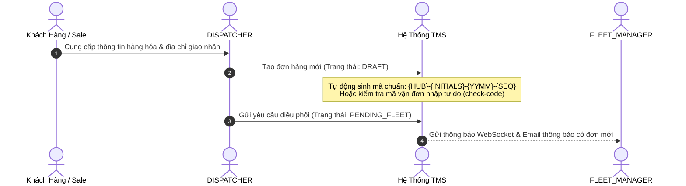
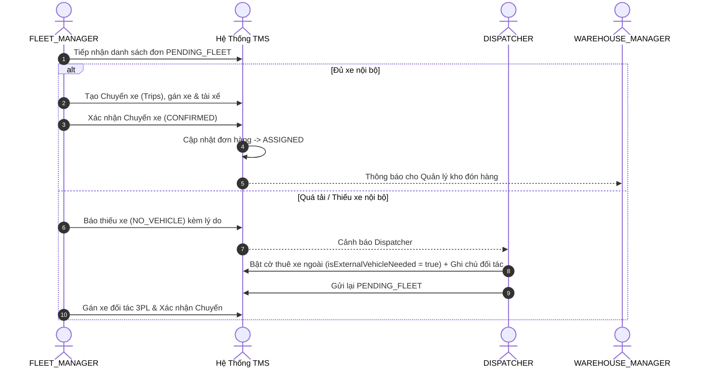
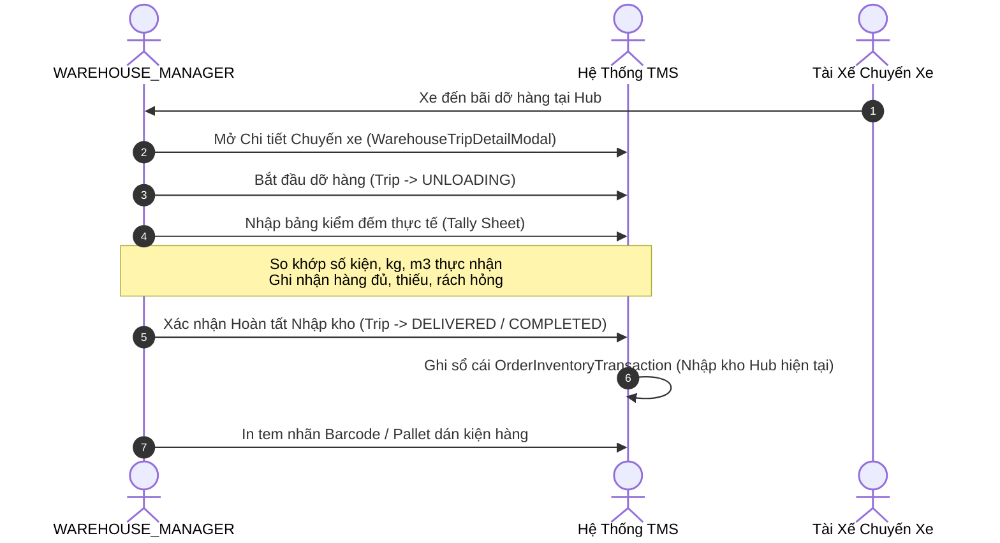
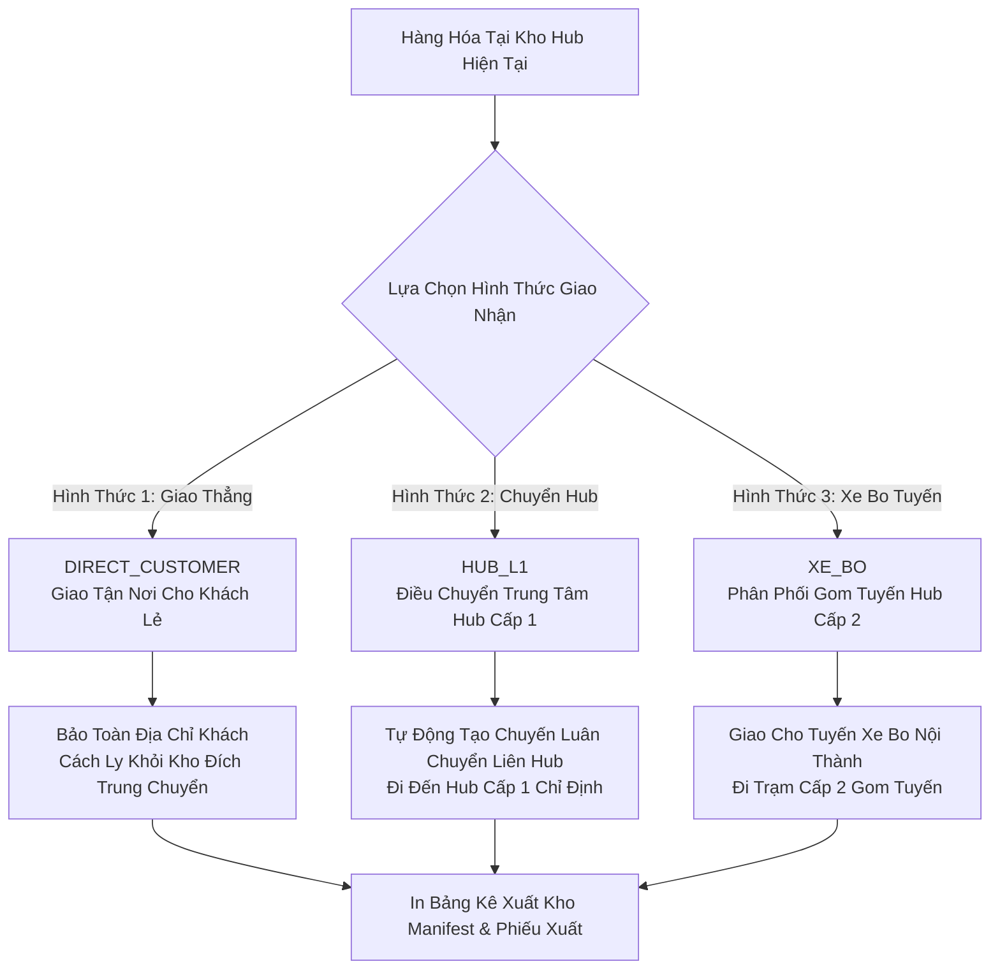
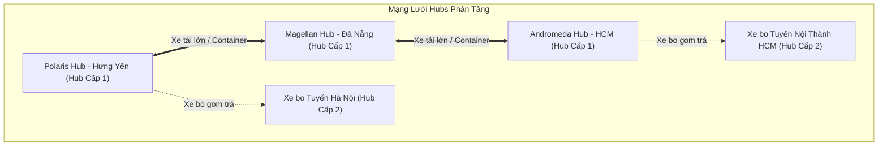

# 🚚 SPIDER EXPRESS TMS — TỔNG QUAN NGHIỆP VỤ & BẢN CHỐT RELEASE v1.0.0

> **Phiên bản**: `v1.0.0` (Production Milestone Release)  
> **Hệ thống**: Spider Express Transportation Management System (TMS)  
> **Ngày công bố**: 08/10/2026  
> **Môi trường triển khai**:  
> - **Domain Pro (Production)**: Frontend `https://logistics-website-frontend-kappa.vercel.app` | Backend `https://logistics-website-backend-1.onrender.com`  
> - **Domain Dev (Development)**: Frontend `https://logistics-website-frontend-git-dev-thai-lys-projects.vercel.app` | Backend `https://logistics-website-backend-1jho.onrender.com`  
> **Cơ sở dữ liệu**: PostgreSQL trên Neon Singapore (`ap-southeast-1.aws.neon.tech`)

---

## 📑 MỤC LỤC
1. [Kiến Trúc & Quy Chuẩn Bất Biến](#1-kiến-trúc--quy-chuẩn-bất-biến)
2. [Ma Trận Phân Quyền & Vai Trò Vận Hành (RBAC)](#2-ma-trận-phân-quyền--vai-trò-vận-hành-rbac)
3. [Flow 1: Khởi Tạo & Quản Lý Đơn Hàng (Orders)](#flow-1-khởi-tạo--quản-lý-đơn-hàng-orders)
4. [Flow 2: Lập Kế Hoạch & Điều Phối Chuyến Xe (Fleet & Dispatch)](#flow-2-lập-kế-hoạch--điều-phối-chuyến-xe-fleet--dispatch)
5. [Flow 3: Vận Hành Nhập Kho & Kiểm Đếm (Inbound & Tally)](#flow-3-vận-hành-nhập-kho--kiểm-đếm-inbound--tally)
6. [Flow 4: Vận Hành Xuất Kho & 3 Hình Thức Giao Nhận (Outbound & Delivery Modes)](#flow-4-vận-hành-xuất-kho--3-hình-thức-giao-nhận-outbound--delivery-modes)
7. [Flow 5: Quản Lý Tồn Kho & Sổ Cái Vận Hành (Inventory Ledger)](#flow-5-quản-lý-tồn-kho--sổ-cái-vận-hành-inventory-ledger)
8. [Flow 6: Mạng Lưới Chi Nhánh Kho & Quản Lý Đội Xe (Hubs & Fleet Network)](#flow-6-mạng-lưới-chi-nhánh-kho--quản-lý-đội-xe-hubs--fleet-network)
9. [Flow 7: Hệ Thống Thông Báo & Hạ Tầng Kỹ Thuật (Enterprise Foundations)](#flow-7-hệ-thống-thông-báo--hạ-tầng-kỹ-thuật-enterprise-foundations)
10. [Bảng Tổng Hợp Kiểm Thử & Nghiệm Thu (Quality Gate)](#10-bảng-tổng-hợp-kiểm-thử--nghiệm-thu-quality-gate)

---

## 1. KIẾN TRÚC & QUY CHUẨN BẤT BIẾN

Hệ thống Logistics TMS Spider Express v1.0.0 được thiết kế và vận hành theo các nguyên lý cốt lõi bất biến:

- **100% Cơ Sở Dữ Liệu Thật (Zero Mock Data Rule)**: Toàn bộ bảng dữ liệu, bộ lọc, thẻ thống kê KPI, ô tìm kiếm và luồng trạng thái kết nối trực tiếp với PostgreSQL trên Neon Cloud. Tuyệt đối không dùng dữ liệu giả lập hay fallback array.
- **Tính Toàn Vẹn Chỉ Số (Dynamic Counter & Metric Integrity)**: Mọi con số trong giao diện (KPI cards, số đếm trên tab filter, badges) đều phản ánh chỉ số nghiệp vụ thực tế, được tính toán xuyên suốt 3 tầng: SQL Query ➔ REST DTO ➔ Reactive State (TanStack Query v5 + Zustand). Tỉ lệ tương quan 1:1 giữa số đếm trên tab và số bản ghi trong bảng.
- **Quy Chuẩn Kiện Vận Tải No-SKU (Consignment / Freight Level)**: Quản lý hàng hóa theo thông số vận tải thực tế: Tên hàng hóa, Số kiện/thùng, Trọng lượng ($Kg$), Thể tích ($m^3$). Không quản lý mã SKU chi tiết cấp bán lẻ.
- **Quy Chuẩn Không Quản Lý Vị Trí Kho (No Bin / Rack Management)**: Hàng hóa trong kho chỉ quản lý ở cấp độ: **Kho lưu trữ hiện tại (Hub Scope)** và **Trạng thái lưu kho (`LƯU KHO`, `DRAFT`)**.
- **Giao Diện Siêu Gọn & Mật Độ Thông Tin Cao (Compact Density)**: Triệt tiêu khoảng cách thừa (`p-1` cho thẻ card, `p-2` cho modal body, `text-[10px]` cho bảng dữ liệu), tăng gấp đôi số lượng hàng hiển thị trên mỗi màn hình thao tác vận hành kho bãi.
- **Kiến Trúc Git 3 Repositories Độc Lập**: Root repo (`logistics-website`), Backend submodule (`backend/`), Frontend submodule (`frontend/`).

---

## 2. MA TRẬN PHÂN QUYỀN & VAI TRÒ VẬN HÀNH (RBAC)

Hệ thống triển khai cơ chế kiểm soát truy cập dựa trên vai trò (Role-Based Access Control) 3 lớp nghiêm ngặt:

| Vai Trò | Mã Quyền | Phạm Vi Nghiệp Vụ Cốt Lõi |
|---|---|---|
| **SUPER_ADMIN** | `SUPER_ADMIN` | Quản trị toàn hệ thống: Quản lý người dùng, tài khoản, cấu hình chi nhánh kho (Hubs Cấp 1 & Cấp 2), giám sát kiểm toán toàn bộ đơn hàng và chuyến xe trên cả nước. |
| **DISPATCHER** | `DISPATCHER` | Nhân viên điều phối kinh doanh: Tiếp nhận thông tin khách hàng, tạo đơn hàng nháp (`DRAFT`), nhập thông số tải trọng hàng hóa, gửi yêu cầu điều xe (`PENDING_FLEET`), kích hoạt cờ yêu cầu xe ngoài 3PL khi nội bộ quá tải, hủy đơn nháp. |
| **FLEET_MANAGER** | `FLEET_MANAGER` | Quản lý đội xe: Tiếp nhận yêu cầu điều xe từ Dispatcher, đánh giá năng lực xe và tài xế, tạo các Chuyến xe (`Trips`), phân bổ xe nội bộ hoặc xe đối tác 3PL, tách đơn đi nhiều chuyến (Split Shipment), báo hết xe (`NO_VEHICLE`), xác nhận chuyến xe (`CONFIRMED`). |
| **WAREHOUSE_MANAGER** | `WAREHOUSE_MANAGER` | Quản lý kho bãi tại Hub: Giám sát bảng lịch trình xe đến/đi, thực hiện kiểm đếm dỡ hàng (Inbound Tally), bốc hàng dọc đường (Roadside Pickup), xuất kho điều chuyển liên Hub (Hub L1), xuất xe bo tuyến tỉnh (Xe Bo L2), xuất giao thẳng khách lẻ, quản lý tồn kho tại Hub trực thuộc. |

---

## 3. FLOW 1: KHỞI TẠO & QUẢN LÝ ĐƠN HÀNG (ORDERS)

### Các Đặc Điểm Nghiệp Vụ Cốt Lõi:
1. **Cơ Chế Sinh Mã Đơn Hàng Chuẩn Doanh Nghiệp**:
   - Định dạng: `{HUB_PREFIX}-{OPERATOR_INITIALS}-{YYMM}-{SEQUENCE}` (Ví dụ: `HCM-LTV-2609-011`).
   - Cấp phát nguyên tử (Atomic Counter) trong Database Transaction, chống trùng lặp, gắn liền với Hub người tạo.
2. **Hỗ Trợ Mã Vận Đơn Tùy Biến (Custom Waybill Code)**:
   - Cho phép người dùng nhập trực tiếp mã vận đơn/mã tracking từ đối tác.
   - Endpoint `GET /api/v1/orders/check-code?code=...` kiểm tra trùng lặp thời gian thực khi rời ô nhập liệu (`onBlur`).
3. **Quản Lý Thông Số Vận Tải**:
   - Tên hàng hóa, Số kiện/thùng đóng gói, Tổng trọng lượng thực ($Kg$), Tổng thể tích ($m^3$).
   - Thông tin người gửi (Họ tên, SĐT, Địa chỉ lấy hàng, Hub gửi).
   - Thông tin người nhận (Họ tên, SĐT, Địa chỉ giao hàng, Hub đích/Tuyến nhận).
   - Quản lý chứng từ đi kèm hàng hóa (`accompanyingDocs`): Phiếu xuất kho kiêm vận chuyển nội bộ, hóa đơn VAT, biên bản bàn giao.
4. **Hủy Đơn Hàng**:
   - Dispatcher có quyền hủy đơn ở trạng thái `DRAFT` mà không kích hoạt thông báo gây phiền đến đội xe và kho.

---

## 4. FLOW 2: LẬP KẾ HOẠCH & ĐIỀU PHỐI CHUYẾN XE (FLEET & DISPATCH)

### Các Đặc Điểm Nghiệp Vụ Cốt Lõi:
1. **Quản Lý & Phân Bổ Năng Lực Vận Tải**:
   - Tính toán tải trọng xe khả dụng dựa trên tổng $Kg$ và tổng $m^3$ của các đơn hàng được gán vào chuyến.
   - Quản lý danh sách xe nội bộ theo Hub quản lý và liên kết tài xế tương ứng.
2. **Cơ Chế Tách Chuyến Đa Chặng (Split Shipment)**:
   - Khi một đơn hàng có khối lượng quá lớn vượt tải trọng 1 xe, Fleet Manager có thể phân bổ đơn hàng lên nhiều Chuyến xe (`Trips`) khác nhau.
   - Đơn hàng chỉ chuyển sang `ASSIGNED` khi toàn bộ các chuyến xe liên quan đã được xác nhận (`CONFIRMED`).
3. **Cơ Chế Xử Lý Ngoại Lệ Thiếu Xe (`NO_VEHICLE`) & Xe Thuê Ngoài (3PL)**:
   - Khi hết tải, Fleet Manager cập nhật trạng thái `NO_VEHICLE`.
   - Dispatcher kích hoạt chế độ xe ngoài (`isExternalVehicleNeeded = true`), hệ thống tự động gắn huy hiệu `🚨 [XE THUÊ NGOÀI]` trên giao diện và tiêu đề email thông báo.
4. **Lộ Trình Đa Điểm Dừng (Multi-Stop Trip Routing)**:
   - Chuyến xe hỗ trợ lộ trình từ Hub xuất phát -> Các trạm dừng trung chuyển dọc tuyến -> Hub đích cuối cùng.

---

## 5. FLOW 3: VẬN HÀNH NHẬP KHO & KIỂM ĐẾM (INBOUND & TALLY)

### Các Đặc Điểm Nghiệp Vụ Cốt Lõi:
1. **Bảng Kế Hoạch Nhập Kho Thời Gian Thực (Inbound Board)**:
   - Hiển thị các chuyến xe dự kiến cập bến, đang dỡ hàng và đã nhập kho hoàn tất.
   - Thống kê tự động tổng số kiện, tổng trọng lượng và tổng thể tích dự kiến tiếp nhận.
2. **Bảng Kiểm Đếm Dỡ Hàng (Warehouse Trip Tally Sheet)**:
   - So sánh trực quan giữa thông số trên vận đơn xuất phát và số lượng thực nhận tại cửa kho.
   - Ghi chú tình trạng hàng hóa bất thường (rách bao bì, ướt, móp méo) kèm biên bản kiểm nghiệm.
3. **Bốc Hàng Dọc Đường (Roadside Pickup / En-route Order Appending)**:
   - Hỗ trợ tài xế bốc hàng bổ sung phát sinh trên đường chạy, Quản lý kho có thể nhập nhanh đơn hàng dọc đường và gán ngay vào chuyến xe đang lưu thông.
4. **Nhập Kho Độc Lập Không Cần Chuyến Xe (Decoupled Inbound)**:
   - Hỗ trợ khách hàng chở hàng trực tiếp đến kho gửi.
   - Nhập nhanh qua lưới bảng tính tương tác trực tiếp (`WarehouseEditableGrid`) hoặc tải lên hàng loạt qua file Excel (`WarehouseExcelImportModal`).
5. **In Tem Nhãn Mã Vạch & Pallet**:
   - Sinh mã vạch chuẩn cho từng kiện hàng hoặc từng pallet để phục vụ dán tem nhận diện trong kho bãi.

---

## 6. FLOW 4: VẬN HÀNH XUẤT KHO & 3 HÌNH THỨC GIAO NHẬN (OUTBOUND & DELIVERY MODES)

### Các Đặc Điểm Nghiệp Vụ Cốt Lõi:
1. **3 Hình Thức Giao Nhận Phân Tầng Tuyệt Đối (`deliveryMode`)**:
   - **`DIRECT_CUSTOMER` (Giao Khách Tận Nơi)**: Nhập hoặc bảo toàn địa chỉ giao hàng của khách nhận. Hệ thống cách ly tuyệt đối khỏi các trạm trung chuyển, đảm bảo trạm dừng giữa đường không dỡ nhầm hàng của khách.
   - **`HUB_L1` (Luân Chuyển Hub Cấp 1)**: Chọn đích đến là một trong các trung tâm logistics vùng (Polaris Hub - Hưng Yên, Magellan Hub - Đà Nẵng, Andromeda Hub - HCM...). Tự động thiết lập chuyến vận tải xe lớn liên tỉnh.
   - **`XE_BO` (Tuyến Xe Bo Gom Cấp 2)**: Chọn tuyến xe bo chuyên trách giao nhận khu vực nội thành hoặc liên huyện theo phân cấp mạng lưới.
2. **Bốc Đơn Lưu Kho Lên Chuyến Xe Đang Dừng Tại Hub (Select Stored Orders to Transit Trip)**:
   - Chức năng Bước 2 trong chi tiết chuyến xe: Mở Modal 10 cột dữ liệu siêu gọn, tìm kiếm và chọn các đơn hàng đang lưu kho tại Hub để xếp thêm lên xe đi tiếp trạm sau.
   - Hỗ trợ tùy biến hình thức giao nhận và địa chỉ giao cho từng đơn hàng bốc thêm ngay tại lưới thao tác.
3. **In Bảng Kê Vận Chuyển Xuất Kho (Trip Manifest)**:
   - Tự động kết xuất bảng kê lộ trình chi tiết bao gồm thông tin phương tiện, tài xế, danh sách kiện hàng, người nhận, địa chỉ trả hàng và phân tách rõ ràng điểm trả hàng dọc đường.

---

## 7. FLOW 5: QUẢN LÝ TỒN KHO & SỔ CÁI VẬN HÀNH (INVENTORY LEDGER)

### Các Đặc Điểm Nghiệp Vụ Cốt Lõi:
1. **Sổ Cái Giao Dịch Kho (Order Inventory Ledger)**:
   - Mọi biến động nhập kho, dỡ hàng, chuyển kho, xuất giao đều được ghi nhận bất biến vào bảng thực thể `OrderInventoryTransactionEntity`.
   - Lưu vết chính xác: Thời gian thực hiện, Tài khoản thao tác, Hub xảy ra giao dịch, Số kiện biến động, Số lượng tồn trước và sau giao dịch.
2. **Cách Ly Dữ Liệu Tồn Kho Tuyệt Đối Theo Hub (Hub Data Isolation)**:
   - Quản lý kho của Hub nào chỉ xem và xuất được hàng hóa đang có tồn thực tế tại Hub đó (`currentHubId === user.hubId`).
   - Ngăn chặn triệt để tình trạng Hub A nhìn thấy hoặc xuất nhầm hàng thuộc quyền quản lý của Hub B.
3. **Cơ Chế Tự Động Xóa Trạng Thái "LƯU KHO" Khi Hết Tồn (Zero Stock Auto-Clear)**:
   - Khi một đơn hàng đã xuất hết toàn bộ số kiện/kg (`quantityAvailable = 0`), hệ thống tự động loại bỏ nhãn `LƯU KHO`, tránh gây nhầm lẫn trên bảng thống kê tồn kho.
4. **Hai Trạng Thái Tồn Kho Chuẩn Hóa**:
   - `LƯU KHO`: Hàng hóa đã nhập kho thành công và đang nằm trong kho sẵn sàng xuất điều chuyển hoặc giao khách.
   - `DRAFT`: Phiếu nhập/xuất kho đang ở chế độ soạn thảo nháp, chưa ảnh hưởng đến số tồn thực tế.

---

## 8. FLOW 6: MẠNG LƯỚI CHI NHÁNH KHO & QUẢN LÝ ĐỘI XE (HUBS & FLEET NETWORK)

### Các Đặc Điểm Nghiệp Vụ Cốt Lõi:
1. **Mạng Lưới Chi Nhánh Kho 2 Tầng (`hub.level`)**:
   - **Hub Cấp 1 (`level = 1`)**: Trung tâm luân chuyển vùng chính, kết nối các trục giao thông huyết mạch Bắc - Trung - Nam.
   - **Hub Cấp 2 (`level = 2`)**: Trạm giao nhận / tuyến xe bo vệ tinh phục vụ thu gom và phát hàng chặng cuối cho từng quận, huyện, thị xã.
2. **Quản Lý Đội Phương Tiện Gắn Với Hub**:
   - Mỗi phương tiện vận tải (xe tải thùng kín, bạt, đầu kéo container) được đăng ký trực thuộc một Hub cụ thể.
   - Kiểm soát chặt chẽ thông số kỹ thuật: Tải trọng tối đa ($Kg$), Thể tích lòng thùng ($m^3$), Biển kiểm soát, Hạn đăng kiểm, Trạng thái hoạt động (`ACTIVE`, `MAINTENANCE`, `INACTIVE`).
3. **Quản Trị Người Dùng & Phân Bổ Nhân Lực**:
   - Super Admin quản trị toàn bộ danh sách nhân sự trên hệ thống, phân quyền và gán cố định Hub làm việc cho từng tài khoản Quản lý kho.

---

## 9. FLOW 7: HỆ THỐNG THÔNG BÁO & HẠ TẦNG KỸ THUẬT (ENTERPRISE FOUNDATIONS)

### 1. Hệ Thống Thông Báo Thời Gian Thực & Đa Kênh
- **WebSocket Gateway (Socket.io)**: Phát sự kiện thời gian thực đến từng người dùng khi có đơn mới, chuyển trạng thái chuyến xe, hoàn tất dỡ hàng, cảnh báo thiếu xe.
- **Dịch Vụ Email Tự Động (Resend Cloud + SMTP Fallback)**:
  - Tự động gửi email thông báo trạng thái vận đơn với mẫu thiết kế HTML/Handlebars chuyên nghiệp.
  - Tích hợp cờ giả lập an toàn `MAIL_SIMULATE=true` trên môi trường kiểm thử để không làm cạn kiệt hạn ngạch gửi mail.

### 2. Quản Trị Phiên Đăng Nhập Doanh Nghiệp (Enterprise Session Management)
- **Token Manager (`src/lib/token-manager.ts`)**:
  - Tích hợp `BroadcastChannel('tms_auth_sync_channel')` đồng bộ xoay vòng Token Rotation 0ms giữa tất cả các tab trình duyệt.
  - **Proactive Silent Heartbeat**: Tự động trích xuất hạn token JWT và làm mới ngầm ở 75% vòng đời token, triệt tiêu hoàn toàn sự cố đứt phiên làm việc khi thao tác.

### 3. Tối Ưu Hóa Giao Diện & Mật Độ Thao Tác (Compact Density System)
- Chuẩn hóa toàn bộ thẻ card với padding 4px (`p-1`), modal body `p-2`, khoảng cách khối 6-8px (`gap-1.5` / `gap-2`).
- Bảng dữ liệu dùng font `text-[10px]`, chiều cao hàng ~26px, tăng gấp đôi số lượng đơn hàng hiển thị trực quan mà không cần cuộn trang nhiều.
- Các nút hành động chính (Lưu nháp, Xác nhận xuất kho, In bảng kê) được cố định với thanh `sticky bottom-0`.

---

## 10. BẢNG TỔNG HỢP KIỂM THỬ & NGHIỆM THU (QUALITY GATE)

| Phạm Vi Kiểm Thử | Số Lượng / Tiêu Chí | Kết Quả Nghiệm Thu | Ghi Chú |
|---|---|---|---|
| **Backend TypeScript Build** | `npm run build` | ✅ 0 Lỗi (Code 0) | NestJS 11 + TypeORM compiles cleanly |
| **Frontend Next.js Typecheck** | `npm run typecheck` | ✅ 0 Lỗi (Code 0) | Next.js 16 + React 19 + TypeScript 5.7 |
| **Frontend Production Build** | `npm run build` | ✅ 33/33 Routes Compiled | App Router Turbopack bundle optimized |
| **Playwright E2E Test Suites** | 37 test suites (`e2e/*.spec.ts`) | ✅ 100% PASSED | Bao gồm toàn bộ luồng Auth, RBAC, Inbound, Outbound, Tally, Task 21, 24, 27, 29 |
| **Dev & Pro Health Checks** | `/api/v1/health` trên Render | ✅ HTTP 200 OK | Uptime > 57,000s, kết nối Neon Cloud ổn định |
| **Vercel Frontend Health** | Dev & Pro Domains | ✅ HTTP 307 (Auth Guard OK) | Edge CDN phản hồi tức thì |
| **Git Repositories Synchronization** | Submodule architecture | ✅ Clean working tree | Đã đồng bộ nhánh `dev` và sẵn sàng release lên `master` |

---
*Tài liệu được ban hành chính thức bởi Antigravity TMS Domain Lead & Engineering Team.*  
*Phiên bản `v1.0.0` đã được kiểm duyệt và sẵn sàng cho môi trường Production.*
