# TÀI LIỆU HƯỚNG DẪN SỬ DỤNG HỆ THỐNG ĐIỀU VẬN & QUẢN LÝ ĐỘI XE (TMS)
*Spider Logistics Management System - Phiên bản 1.0*

---

## 📌 MỤC LỤC
1. [Tổng quan hệ thống & Phân quyền vai trò](#1-tổng-quan-hệ-thống--phân-quyền-vai-trò)
2. [Đăng nhập & Truy cập hệ thống](#2-đăng-nhập--truy-cập-hệ-thống)
3. [Quy trình dành cho Điều phối viên (Dispatcher)](#3-quy-trình-dành-cho-điều-phối-viên-dispatcher)
   - 3.1. [Xem danh sách & Trạng thái lệnh điều vận](#31-xem-danh-sách--trạng-thái-lệnh-điều-vận)
   - 3.2. [Tạo lệnh điều vận mới (Order Draft)](#32-tạo-lệnh-điều-vận-mới-order-draft)
   - 3.3. [Gửi lệnh sang Quản lý Đội xe (Fleet)](#33-gửi-lệnh-sang-quản-lý-đội-xe-fleet)
   - 3.4. [Theo dõi chi tiết & Timeline đơn hàng](#34-theo-dõi-chi-tiết--timeline-đơn-hàng)
4. [Quy trình dành cho Quản lý Đội xe (Fleet Manager)](#4-quy-trình-dành-cho-quản-lý-đội-xe-fleet-manager)
   - 4.1. [Bảng tiếp nhận đơn cần phân bổ xe](#41-bảng-tiếp-nhận-đơn-cần-phân-bổ-xe)
   - 4.2. [Phân công phương tiện đơn (Single Trip) & Đồng hồ đo tải trọng](#42-phân-công-phương-tiện-đơn-single-trip--đồng-hồ-đo-tải-trọng)
   - 4.3. [Phân chia nhiều xe (Split Shipment 2 - 5 xe)](#43-phân-chia-nhiều-xe-split-shipment-2---5-xe)
   - 4.4. [Xác nhận chuyến xe & Gửi thông báo đến Kho](#44-xác-nhận-chuyến-xe--gửi-thông-báo-đến-kho)
   - 4.5. [Quản lý phương tiện & Nhận diện xe thuê ngoài](#45-quản-lý-phương-tiện--nhận-diện-xe-thuê-ngoài)
5. [Quy trình dành cho Thủ kho (Warehouse Manager)](#5-quy-trình-dành-cho-thủ-kho-warehouse-manager)
   - 5.1. [Inbound Receiving Board - Theo dõi xe đến kho](#51-inbound-receiving-board---theo-dõi-xe-đến-kho)
   - 5.2. [Tra cứu & Tiếp nhận hàng hóa](#52-tra-cứu--tiếp-nhận-hàng-hóa)

---

## 1. Tổng quan hệ thống & Phân quyền vai trò

Hệ thống Logistics TMS vận hành liên hoàn giữa 4 vai trò chính:
- **👑 Quản trị viên cấp cao (SUPER_ADMIN)**: Toàn quyền quản trị tài khoản, cấu hình hệ thống và giám sát toàn bộ hoạt động.
- **📦 Điều phối viên (DISPATCHER)**: Khởi tạo lệnh điều vận, nhập khối lượng/thể tích/mô tả hàng hóa, gửi yêu cầu sang Fleet và xử lý thuê xe ngoài khi cần.
- **🚛 Quản lý Đội xe (FLEET_MANAGER)**: Tiếp nhận đơn hàng, điều phối xe nội bộ hoặc xe đối tác ngoài, chia chuyến (Split Shipment), xác nhận lịch trình và bắn thông báo tới kho.
- **🏢 Quản lý Kho (WAREHOUSE_MANAGER)**: Giám sát bảng Inbound Board, tiếp nhận thông tin chuyến xe đến từ trước để chuẩn bị cửa dock bốc dỡ và kiểm đếm.

---

## 2. Đăng nhập & Truy cập hệ thống

1. Truy cập đường dẫn: `http://localhost:3000/auth/sign-in`
2. Nhập Email & Mật khẩu tương ứng với vai trò của bạn hoặc nhấn nút **"Demo Accounts"** để chọn tài khoản mẫu nhanh chóng.

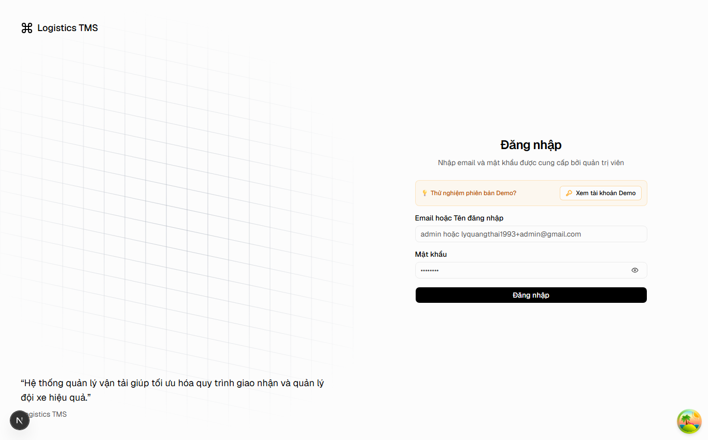

---

## 3. Quy trình dành cho Điều phối viên (Dispatcher)

### 3.1. Xem danh sách & Trạng thái lệnh điều vận
Truy cập menu **Lập Lệnh Điều Vận** (`/dashboard/orders`). Màn hình cung cấp 4 thẻ thống kê tổng quan (Tất cả đơn, Bản nháp, Chờ điều xe, Đã phân xe) cùng thanh tìm kiếm và lọc trạng thái.

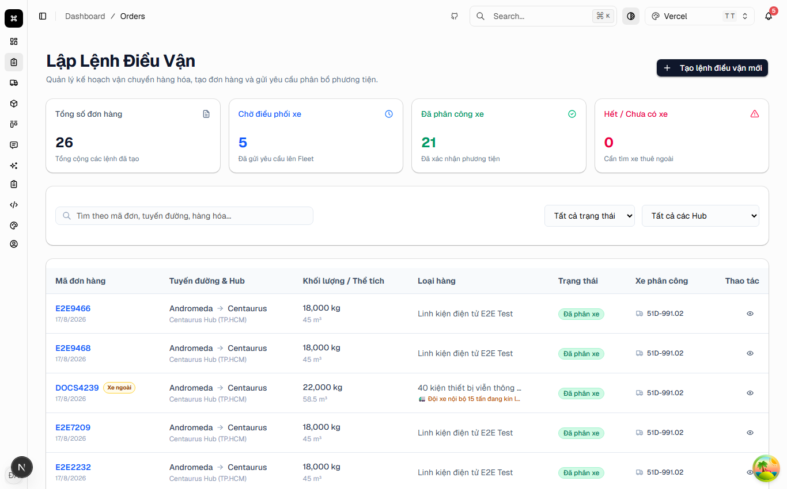

---

### 3.2. Tạo lệnh điều vận mới (Order Draft)
Nhấn nút **"+ Tạo lệnh điều vận mới"** ở góc phải trên. Điền đầy đủ thông tin:
- **Mã đơn hàng**: Tự nhập mã quy chuẩn của doanh nghiệp (hệ thống tự động gợi ý định dạng dựa theo tên viết tắt của bạn, VD: `NDA2608-xxxx`).
- **Hub Xuất phát & Hub Đích**: Andromeda Hub (Hà Nội), Centaurus Hub (TP.HCM), Pegasus Hub (Đà Nẵng),...
- **Tổng khối lượng (kg) & Tổng thể tích (m³)**.
- **Mô tả loại hàng (Textarea nhiều dòng)**: Nhập chi tiết quy cách đóng gói, tính chất hàng (dễ vỡ, hàng giá trị cao...).
- **Ghi chú điều vận (Textarea nhiều dòng)**: Nhập yêu cầu về xe (bửng nâng hạ, giờ giao hàng, liên hệ trước...).
- **Cần xe thuê ngoài**: Tích chọn nếu bắt buộc phải thuê xe ngoài từ đối tác.

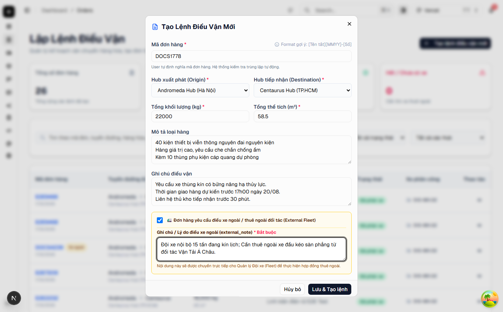

Sau khi nhấn **"Lưu & Tạo lệnh"**, đơn hàng sẽ được tạo ở trạng thái **Bản nháp (Draft)**.

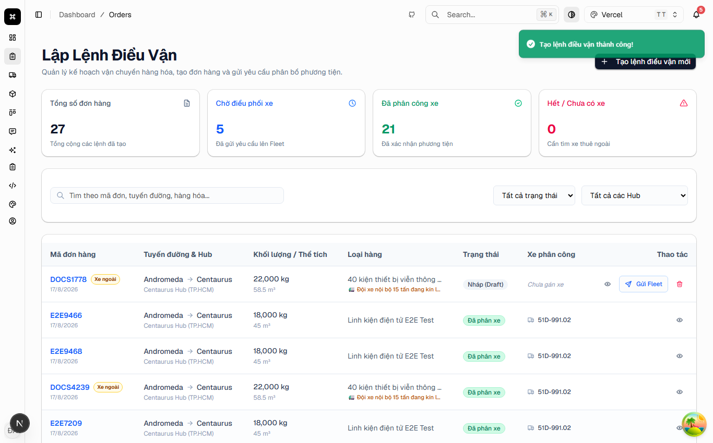

---

### 3.3. Gửi lệnh sang Quản lý Đội xe (Fleet)
Nhấn nút **"Gửi Fleet"** tại hàng đơn hàng tương ứng. Trạng thái đơn hàng sẽ chuyển ngay sang **"Chờ điều xe" (PENDING_FLEET)** và tự động hiển thị trên bảng điều phối của Quản lý Đội xe.

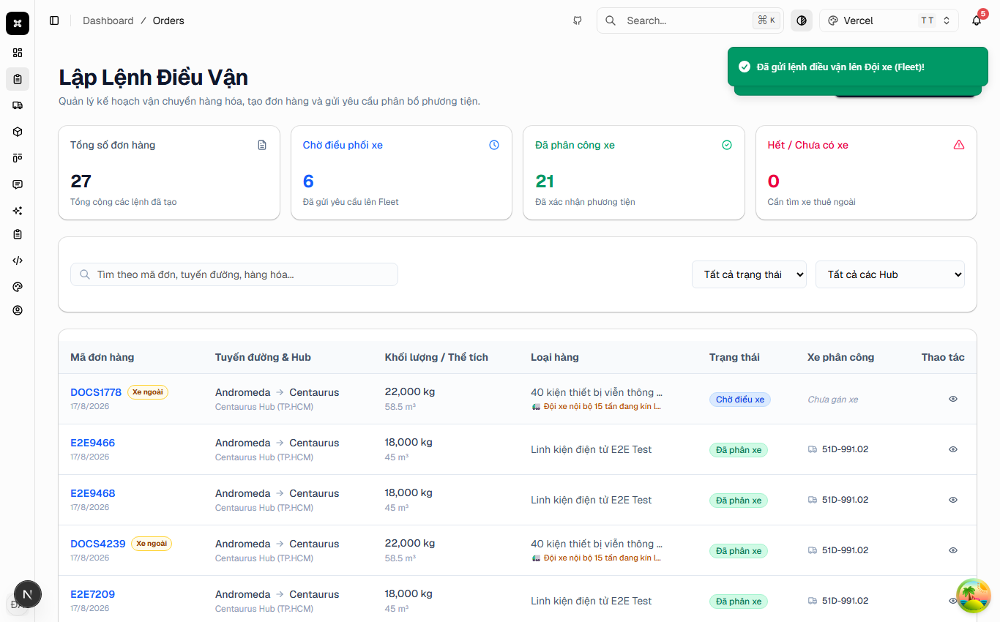

---

### 3.4. Theo dõi chi tiết & Timeline đơn hàng
Nhấp vào mã đơn hàng để mở trang chi tiết (`/dashboard/orders/[id]`). Tại đây người dùng có thể xem:
- Tiến trình trạng thái (Timeline từ Draft ➔ Đã gửi Fleet ➔ Đã gán xe ➔ Đang vận chuyển ➔ Đã giao).
- Danh sách các chuyến xe / biển số xe / tài xế được Fleet phân công.

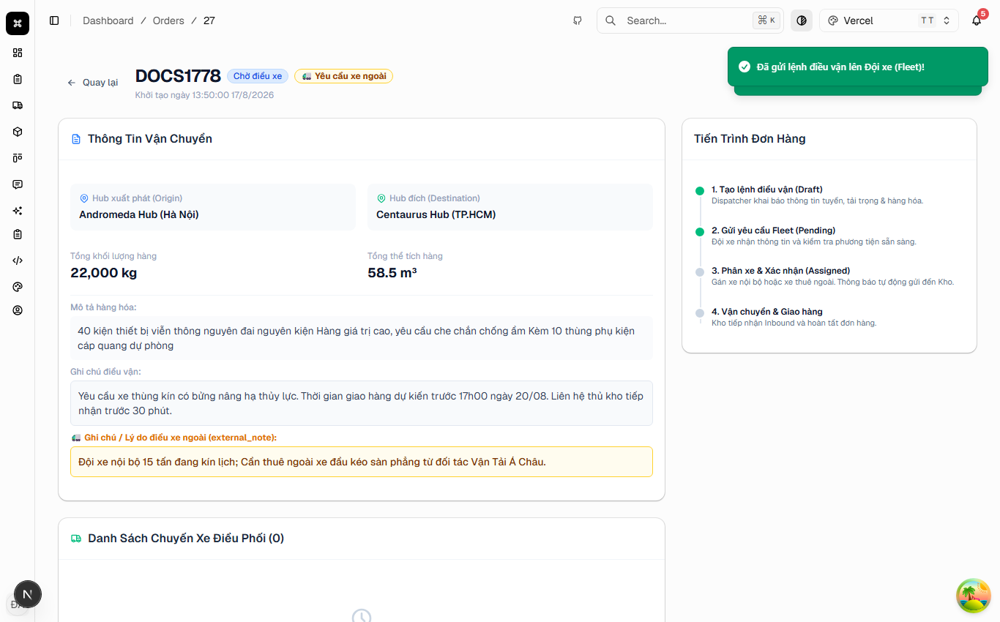

---

## 4. Quy trình dành cho Quản lý Đội xe (Fleet Manager)

### 4.1. Bảng tiếp nhận đơn cần phân bổ xe
Truy cập menu **Phân công xe** (`/dashboard/trips`). Tab **"Đơn Cần Phân Xe"** hiển thị danh sách tất cả các đơn hàng từ Dispatcher chuyển sang.

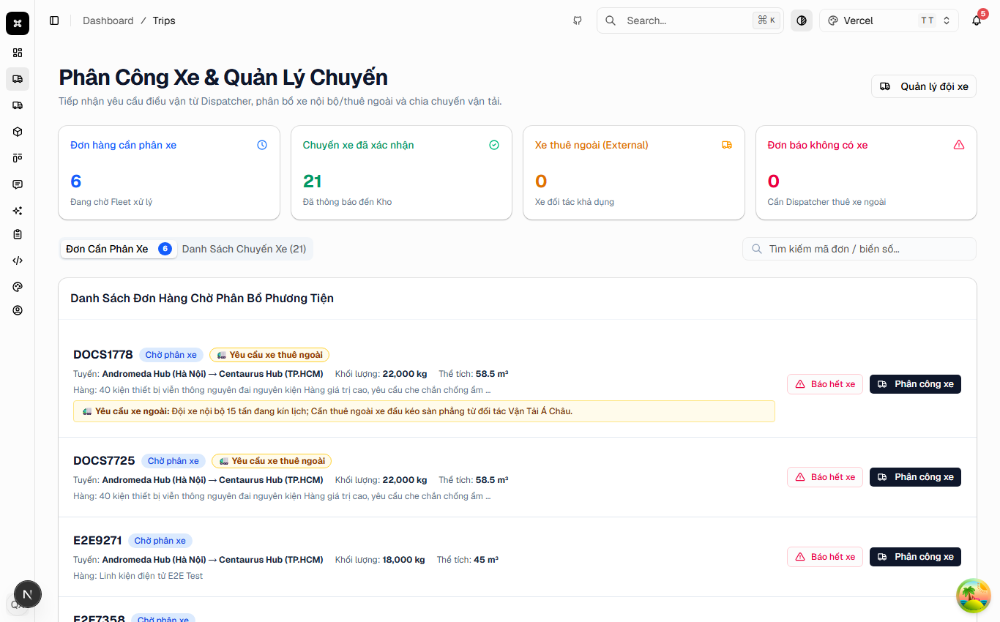

---

### 4.2. Phân công phương tiện đơn (Single Trip) & Đồng hồ đo tải trọng
Nhấn nút **"Phân công xe"** tại đơn hàng cần gán:
1. **Chọn Phương tiện & Tài xế**: Chọn xe nội bộ hoặc xe đối tác.
2. **Đồng hồ đo tải trọng (Capacity Gauge)**: Tự động so sánh tải trọng đơn hàng với tải trọng tối đa của xe (hiển thị tỷ lệ % tải trọng và cảnh báo màu cam nếu quá tải).
3. **Cảnh báo Xe thuê ngoài**: Nếu chọn xe ngoài, hệ thống sẽ hiển thị hộp cảnh báo màu hổ phách với tên nhà xe đối tác.
4. Nhập ngày lấy hàng, giờ nhận và ngày dự kiến đến kho.

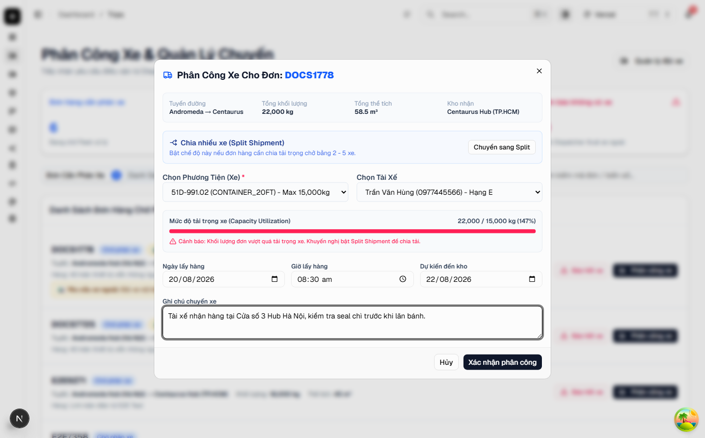

---

### 4.3. Phân chia nhiều xe (Split Shipment 2 - 5 xe)
Đối với các đơn hàng khối lượng lớn (vượt tải 1 xe), nhấn nút **"Chuyển sang Split"**:
- Cho phép thêm từ **2 đến 5 xe chở hàng**.
- Nhập khối lượng (kg) và thể tích (m³) phân bổ cho từng chuyến.
- Hệ thống tự động tính tổng khối lượng đã phân bổ so với tổng khối lượng của đơn hàng.

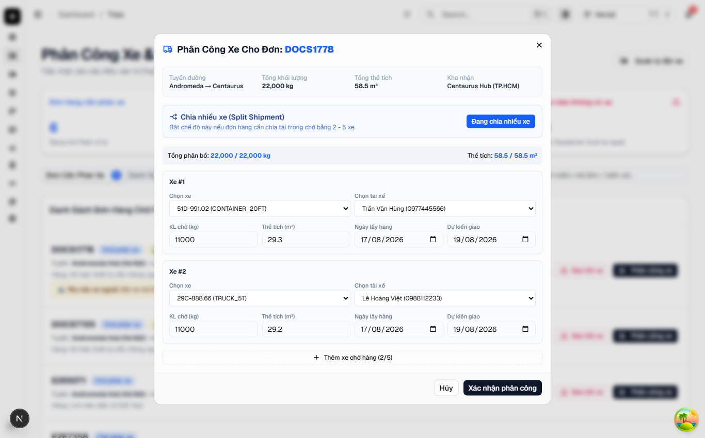

---

### 4.4. Xác nhận chuyến xe & Gửi thông báo đến Kho
Chuyển sang tab **"Danh Sách Chuyến Xe"**, tìm chuyến xe vừa lập và nhấn **"Xác nhận Trip"**:
- Trạng thái chuyến xe chuyển thành **"Đã xác nhận" (CONFIRMED)**.
- Hệ thống **tự động gửi Email & In-app Notification** tới Thủ kho tiếp nhận và Điều phối viên.

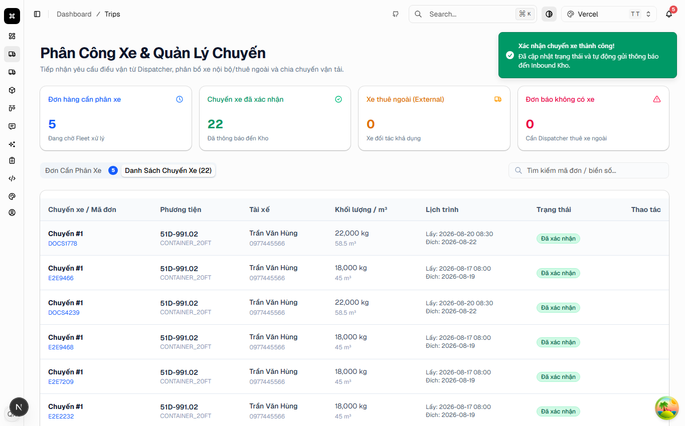

---

### 4.5. Quản lý phương tiện & Nhận diện xe thuê ngoài
Truy cập menu **Quản lý đội xe** (`/dashboard/fleet`) để quản lý danh sách đầu xe:
- Xe thuê ngoài được gắn nhãn màu hổ phách **"🚛 Xe thuê ngoài"** kèm tên nhà cung cấp đối tác.

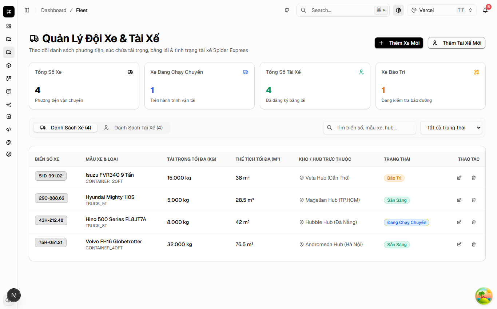

---

## 5. Quy trình dành cho Thủ kho (Warehouse Manager)

### 5.1. Inbound Receiving Board - Theo dõi xe đến kho
Truy cập menu **Inbound Kho** (`/dashboard/warehouse`). Bảng tiếp nhận Inbound hiển thị:
- Tổng số chuyến xe dự kiến đến trong ngày/tuần.
- Tổng tải trọng và thể tích hàng hóa sắp vào kho để bố trí nhân sự và dock bốc dỡ.
- Bộ lọc theo Hub tiếp nhận và ô tìm kiếm mã đơn / biển số.

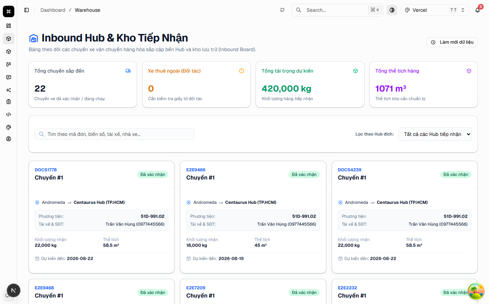

---

### 5.2. Tra cứu & Tiếp nhận hàng hóa
Thủ kho nhập mã đơn hàng hoặc biển số xe vào ô tìm kiếm để tra cứu nhanh thông tin hàng hóa, tài xế phụ trách và các ghi chú điều vận đặc biệt.

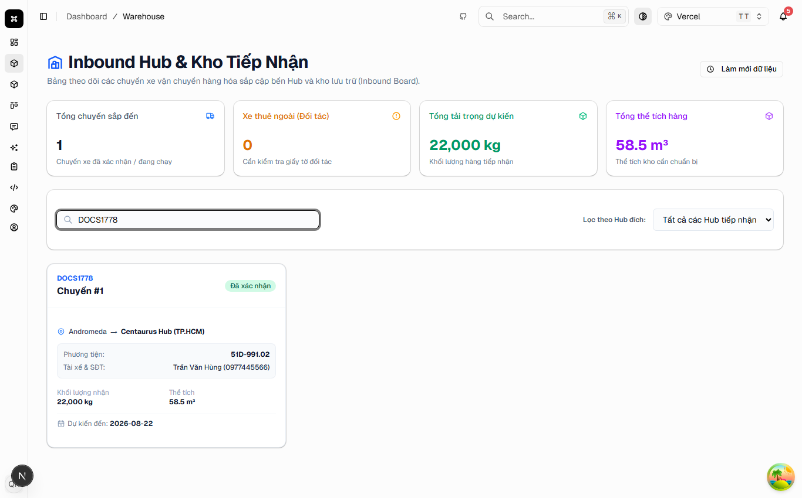

---

*Tài liệu được cập nhật tự động cùng bộ ảnh chụp thực tế từ hệ thống kiểm thử Playwright E2E.*
