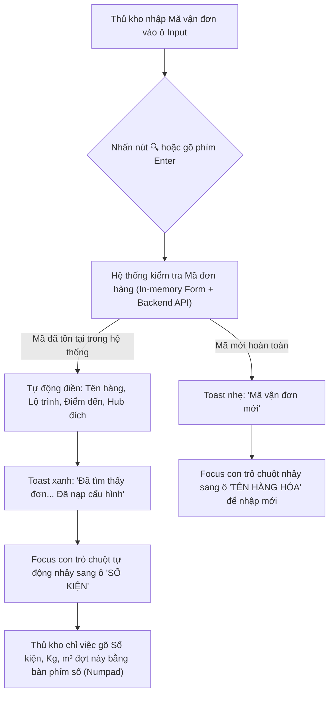

# ĐẶC TẢ NGHIỆP VỤ & QUY CHUẨN VẬN HÀNH: LOGIC TẠO MỚI NHẬP KHO & HIỂN THỊ TỒN KHO THEO CHUYẾN XE
> **Tài liệu chuẩn hóa bởi**: TMS Domain Lead (`/leader`)  
> **Áp dụng cho**: Phân hệ Kho vận Logistics TMS (Spider Express) — Frontend Next.js & Backend NestJS  
> **Mục tiêu**: Chuẩn hóa logic tiếp nhận hàng hóa tại luồng Nhập kho ([`warehouse-editable-grid.tsx`](file:///d:/Projects/logistics-website/frontend/src/features/warehouse/components/warehouse-editable-grid.tsx)) và hiển thị danh sách tồn kho thực tế tại trang Đơn hàng kho ([`warehouse/orders`](file:///d:/Projects/logistics-website/frontend/src/app/dashboard/warehouse/orders/page.tsx)).

---

## 📑 MỤC LỤC
1. [Nguyên Tắc Nghiệp Vụ Cốt Lõi (Core Business Invariants)](#1-nguyên-tắc-nghiệp-vụ-cốt-lõi-core-business-invariants)
2. [Nút Action "Nạp Cấu Hình Đơn" Tại Ô Mã Vận Đơn (Luồng Tạo Mới Nhập Kho)](#2-nút-action-nạp-cấu-hình-đơn-tại-ô-mã-vận-đơn-luồng-tạo-mới-nhập-kho)
3. [Quy Chuẩn Hiển Thị Tồn Kho Theo Từng Chuyến Xe (Không Cộng Dồn)](#3-quy-chuẩn-hiển-thị-tồn-kho-theo-từng-chuyến-xe-không-cộng-dồn)
4. [Cơ Chế Phòng Chống Lỗi Gõ Nhầm & Toàn Vẹn Dữ Liệu (Error Prevention)](#4-cơ-chế-phòng-chống-lỗi-gõ-nhầm--toàn-vẹn-dữ-liệu-error-prevention)
5. [Đặc Tả Kỹ Thuật & Kế Hoạch Triển Khai (Action Plan)](#5-đặc-tả-kỹ-thuật--kế-hoạch-triển-khai-action-plan)

---

## 1. NGUYÊN TẮC NGHIỆP VỤ CỐT LÕI (CORE BUSINESS INVARIANTS)

1. **1 Mã Vận Đơn = 1 Tên Hàng Duy Nhất (Consignment-Level / No-SKU)**:
   - Trong vận tải hàng hóa chành xe/ghép hàng (LTL), mỗi mã vận đơn (`orderCode`) đại diện cho một hợp đồng/lô hàng vận chuyển xác định của chủ hàng.
   - Một mã vận đơn **chỉ có duy nhất một tên hàng hóa tổng quát** (ví dụ: `MAY MẶC`, `VẢI`, hoặc `THIẾT BỊ ĐIỆN TỬ`).
   - Tuyệt đối không cho phép 1 mã vận đơn có 2 tên hàng khác nhau trên cùng hệ thống.
2. **Nhập Hàng Nhiều Đợt / Nhiều Chuyến Xe (Multi-Truck Inbound)**:
   - Một đơn hàng lớn có thể được vận chuyển về kho làm nhiều chuyến xe khác nhau (ví dụ: Chuyến 1 chở 30 kiện, Chuyến 2 chở 300 kiện).
   - Khi nhập hàng các đợt tiếp theo của cùng một mã vận đơn, người nhập **kế thừa toàn bộ thông tin hợp đồng ban đầu** (Tên hàng, Nơi gửi, Đích đến, Hub nhận) và **chỉ nhập số lượng thực tế của chuyến xe đợt này** (Số kiện, Số kg, Số $m^3$, Biển số xe, Tài xế).

---

## 2. NÚT ACTION "NẠP CẤU HÌNH ĐƠN" TẠI Ô MÃ VẬN ĐƠN (LUỒNG TẠO MỚI NHẬP KHO)

### 2.1. Thiết kế Giao diện (UI Layout)
Tại lưới nhập kho ([`warehouse-editable-grid.tsx`](file:///d:/Projects/logistics-website/frontend/src/features/warehouse/components/warehouse-editable-grid.tsx)), cột **MÃ ĐƠN HÀNG** bổ sung nút Action tra cứu tương tự màn hình Xuất kho:

```
┌──────────────────────────────────────────────────────────────┐
│ [ MCD2610-0001              ] [ 🔍 Nạp cấu hình / Enter ]    │
└──────────────────────────────────────────────────────────────┘
```

- **Ô Input**: Nhập mã vận đơn (chữ in hoa, font mono bold).
- **Nút Action (Icon Button)**: Đặt ngay cạnh ô Input (`h-7 w-7`, icon kính lúp `IconSearch`).
- **Phím tắt hỗ trợ**: Nhấn phím `Enter` ngay tại ô Input sẽ kích hoạt nút Action mà không cần dùng chuột.

### 2.2. Luồng Xử Lý Nghiệp Vụ (Interaction Flow)



### 2.3. Bảng Phân Định Dữ Liệu Khi Nạp Cấu Hình Đơn

| Trường Dữ Liệu | Cơ Chế Xử Lý Khi Nạp Đơn Cũ | Giải Thích Nghiệp Vụ |
|---|:---:|---|
| **Mã vận đơn (`orderCode`)** | Giữ nguyên mã vừa gõ | Mã định danh hợp đồng vận chuyển. |
| **Tên hàng hóa (`goodsDescription`)** | **Tự động điền (Auto-fill)** | Lấy chính xác tên hàng từ lần nhập trước đó. Không cho phép đổi sang tên khác. |
| **Nơi lấy hàng (`pickupAddress`)** | **Tự động điền (Auto-fill)** | Đồng nhất địa chỉ/kho gửi hàng ban đầu. |
| **Đích đến & Hình thức giao (`deliveryMode`, `destinationHubId`, `deliveryAddress`)** | **Tự động điền (Auto-fill)** | Đích đến của hợp đồng không đổi (Hub Cấp 1, Xe bo hoặc Giao khách lẻ). |
| **Số kiện (`totalQuantity`)** | **Để trống (hoặc mặc định 1)** | Đại diện cho **số lượng thực tế chuyến xe đợt này** mang về kho. |
| **Số kg (`totalWeight`), Số $m^3$ (`totalVolume`)** | **Để trống (hoặc 0)** | Khối lượng và thể tích thực tế bốc dỡ đợt này. |
| **Biển số xe, Tài xế, Ngày nhận** | Lấy từ Header phiếu nhập | Thuộc thông tin chuyến xe bốc dỡ hiện tại. |

---

## 3. QUY CHUẨN HIỂN THỊ TỒN KHO THEO TỪNG CHUYẾN XE (KHÔNG CỘNG DỒN)

### 3.1. Vấn Đề Khi Cộng Dồn (Group By) Đơn Hàng
Trước đây, hệ thống gom tất cả bản ghi có cùng `orderCode` thành một dòng cha tổng hợp trên trang [Tổng Hợp Đơn Hàng Tại Kho (`/dashboard/warehouse/orders`)](file:///d:/Projects/logistics-website/frontend/src/app/dashboard/warehouse/orders/page.tsx).  
Điều này dẫn đến các bất cập nghiêm trọng:
- Khi có 2 xe khác nhau chở hàng về, hệ thống gộp số kiện (ví dụ `30 + 300 = 330 kiện`).
- Tên hàng bị nối chuỗi kỳ lạ: `MAY MẶC, VẢI`.
- Chuyến xe bị thu gọn thành `SD7 +1`, làm ẩn mất biển số xe và tài xế của chuyến xe trước.
- Thủ kho không thể theo dõi tồn kho độc lập theo từng chuyến xe tiếp nhận.

### 3.2. Quy Chuẩn Vận Hành Chuẩn: Hiển Thị 2 Dòng Riêng Biệt
> **Quy tắc**: Khi một mã vận đơn được nhập làm **nhiều lần trên nhiều chuyến xe khác nhau**, danh sách tồn kho tại kho bãi **PHẢI HIỆN RA CÁC DÒNG RIÊNG BIỆT TƯƠNG ỨNG VỚI TỪNG CHUYẾN XE, TUYỆT ĐỐI KHÔNG CỘNG DỒN LẠI**.

**Ví dụ thực tế**: Mã đơn `MCD2610-0001` nhập 2 lần:
- Lần 1: Chuyến `SD5`, xe `50H-12345`, chở **30 kiện**, tên hàng `MAY MẶC`.
- Lần 2: Chuyến `SD7`, xe `75H01225`, chở **300 kiện**, tên hàng `MAY MẶC`.

**Giao diện bảng Tồn Kho hiển thị chuẩn**:
| STT | MÃ ĐƠN HÀNG | TÊN HÀNG HÓA | CHUYẾN XE / TRIP | TỒN KHO | SỐ KG | SỐ M³ | ĐÍCH ĐẾN | TRẠNG THÁI | THAO TÁC |
|:---:|:---|:---|:---|:---:|:---:|:---:|:---|:---:|:---:|
| 01 | **MCD2610-0001** | MAY MẶC | **SD5**<br>`50H-12345` | **30 / 30 kiện** | 500 kg | 5 m³ | Long An → TBS Tân Vạn | `LƯU KHO` | In tem / Chi tiết |
| 02 | **MCD2610-0001** | MAY MẶC | **SD7**<br>`75H01225` | **300 / 300 kiện** | 2.000 kg | 10 m³ | Long An → TBS Tân Vạn | `LƯU KHO` | In tem / Chi tiết |

**Lợi ích vận hành**:
1. **Minh bạch theo từng lần xe vào**: Thủ kho đối soát ngay lập tức số kiện theo từng biên bản bốc dỡ và từng tài xế giao nhận.
2. **Thuận tiện cho xuất kho**: Có thể linh hoạt chọn xuất lô 30 kiện của xe SD5 trước hoặc lô 300 kiện của xe SD7 sau.
3. **Triệt tiêu hoàn toàn lỗi hiển thị**: Không còn dòng cha gộp, không còn nút "Thu gọn/Xem dòng", không còn hiện tượng ghép tên hàng.

---

## 4. CƠ CHẾ PHÒNG CHỐNG LỖI GÕ NHẦM & TOÀN VẸN DỮ LIỆU (ERROR PREVENTION)

1. **Phát hiện ngay khi gõ nhầm mã vận đơn**:
   - Nếu tài xế xe chở hàng *Vải đi Hà Nội*, nhưng thủ kho lỡ tay gõ nhầm mã `MCD2610-0001` (vốn là đơn *May mặc đi Tân Vạn*):
   - Khi bấm nút 🔍 hoặc nhấn `Enter`, màn hình nhảy ra tên `MAY MẶC` và tuyến `TBS Tân Vạn`.
   - Thủ kho lập tức nhận ra sai sót: *"Ủa, xe này chở Vải mà sao lại ra May mặc? Mình đã gõ sai mã rồi!"* ➔ Sửa lại mã đúng ngay tại chỗ.
2. **Khóa chỉnh sửa tên hàng khi kế thừa đơn cũ**:
   - Khi đã nạp cấu hình từ đơn hàng cũ trong hệ thống, ô Tên hàng hóa được đặt ở chế độ cố định (Read-only/Khóa nhẹ kèm biểu tượng ổ khóa hoặc cảnh báo).
   - Nếu thủ kho cố tình thay đổi tên hàng khác với hợp đồng gốc, hệ thống hiển thị cảnh báo chặn:  
     `"Mã vận đơn [MÃ] đã được đăng ký với mặt hàng [TÊN]. Một mã vận đơn chỉ tương ứng với 1 tên hàng duy nhất!"`

---

## 5. ĐẶC TẢ KỸ THUẬT & KẾ HOẠCH TRIỂN KHAI (ACTION PLAN)

### 5.1. Frontend — Form Nhập Kho (`warehouse-editable-grid.tsx`)
- Tại `OrderCodeCell` (chế độ Inbound):
  - Bổ sung nút bấm `IconSearch` bên cạnh ô nhập mã đơn.
  - Lắng nghe sự kiện `onKeyDown`: Nếu bấm `Enter` ➔ kích hoạt hàm `handleLoadOrderConfig()`.
  - Logic hàm `handleLoadOrderConfig(orderCode)`:
    1. Kiểm tra trong danh sách các dòng hiện tại của form (`meta.allRows`).
    2. Nếu không có trong form, gọi API `GET /api/v1/orders/:orderCode` (hoặc `GET /api/v1/warehouse/orders?search=:orderCode`).
    3. Nếu tìm thấy: Gọi `meta.updateRow` cập nhật `goodsDescription`, `pickupAddress`, `deliveryMode`, `destinationHubId`, `deliveryAddress`.
    4. Kích hoạt auto-focus sang ô `totalQuantity` của dòng đó.

### 5.2. Frontend & Backend — Danh Sách Đơn Hàng Kho (`warehouse/orders`)
- **Backend (`warehouse.service.ts`)**:
  - Tại hàm `getOrders`: Mặc định trả về danh sách từng đợt tiếp nhận (từng Order/Trip line) với đầy đủ thông tin chuyến xe và tồn kho theo sổ cái, không bắt buộc gộp `groupBy: 'orderCode'`.
- **Frontend (`warehouse/orders/page.tsx`)**:
  - Hiển thị danh sách phẳng trực quan theo từng dòng nhập hàng thực tế.
  - Cột `CHUYẾN XE / TRIP` hiển thị rõ ràng mã chuyến `SD...` và biển số xe của chính đợt nhập đó.
  - Bỏ cấu trúc expand cha - con phức tạp đối với các đơn nhập nhiều xe.

---
*Tài liệu được cập nhật ngày 04/10/2026 bởi TMS Domain Lead (`/leader`) sau buổi đánh giá phản hồi vận hành thực tế.*