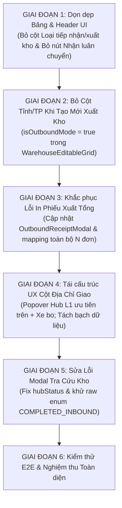

# ĐÁNH GIÁ HIỆN TRẠNG & KẾ HOẠCH NÂNG CẤP VẬN HÀNH KHO (INBOUND & OUTBOUND TMS)
> **Tài liệu**: Đánh giá hiện trạng kỹ thuật, khoảng cách kiến trúc và đặc tả giải pháp nâng cấp trải nghiệm người dùng (UX) & luồng vận hành kho  
> **Người lập**: TMS Domain Lead (`/leader`)  
> **Áp dụng cho**: Logistics TMS (Spider Express TMS Fullstack)  
> **Tài liệu tham chiếu**: [IMPLEMENT_STATUS_TRIP_AND_ORDER.md](file:///d:/Projects/logistics-website/IMPLEMENT_STATUS_TRIP_AND_ORDER.md), [AGENTS.md](file:///d:/Projects/logistics-website/AGENTS.md), [leader skill](file:///d:/Projects/logistics-website/.agents/skills/leader/SKILL.md), [ui-compact-density.md](file:///d:/Projects/logistics-website/.agents/rules/ui-compact-density.md)  
> **Cập nhật ngày**: 04/10/2026 (Bổ sung Hạng mục 6: Xử lý lỗi mâu thuẫn trạng thái Filter DRAFT vs COMPLETED_INBOUND trong Modal Tra Cứu Kho)  

---

## 📑 MỤC LỤC
1. [Tổng Quan Đánh Giá Từ Góc Nhìn Leader](#1-tổng-quan-đánh-giá-từ-góc-nhìn-leader)
2. [Chi Tiết Đánh Giá Hiện Trạng Từng Hạng Mục](#2-chi-tiết-đánh-giá-hiện-trạng-từng-hạng-mục)
   - [Hạng mục 1: Tối giản Bảng Danh Sách — Bỏ Cột "Loại tiếp nhận" & "Loại xuất kho"](#hạng-mục-1-tối-giản-bảng-danh-sách--bỏ-cột-loại-tiếp-nhận--loại-xuất-kho)
   - [Hạng mục 2: Bỏ Button "Nhận luân chuyển nội bộ" Tại Màn Hình Nhập Kho](#hạng-mục-2-bỏ-button-nhận-luân-chuyển-nội-bộ-tại-màn-hình-nhập-kho)
   - [Hạng mục 3: Tái Cấu Trúc UX Cột "Địa Chỉ Giao" Khi Tạo Mới Xuất Kho](#hạng-mục-3-tái-cấu-trúc-ux-cột-địa-chỉ-giao-khi-tạo-mới-xuất-kho)
   - [Hạng mục 4: Loại Bỏ Cột "Tỉnh/TP" Khi Tạo Mới Xuất Kho (Khác Với Nhập Kho Có Cột Này)](#hạng-mục-4-loại-bỏ-cột-tỉnhtp-khi-tạo-mới-xuất-kho-khác-với-nhập-kho-có-cột-này)
   - [Hạng mục 5: Khắc Phục Lỗi "In Phiếu Xuất" Chỉ Hiện 1 Đơn Cho Chuyến Xe Nhiều Đơn](#hạng-mục-5-khắc-phục-lỗi-in-phiếu-xuất-chỉ-hiện-1-đơn-cho-chuyến-xe-nhiều-đơn)
   - [Hạng mục 6: Sửa Lỗi Xung Đột Trạng Thái Filter "DRAFT" Với Dòng Hàng Hiển Thị "COMPLETED_INBOUND" Trong Modal Tra Cứu Kho](#hạng-mục-6-sửa-lỗi-xung-đột-trạng-thái-filter-draft-với-dòng-hàng-hiển-thị-completed_inbound-trong-modal-tra-cứu-kho)
3. [Bảng Ma Trận So Sánh: Trước & Sau Nâng Cấp](#3-bảng-ma-trận-so-sánh-trước--sau-nâng-cấp)
4. [Kế Hoạch Triển Khai Kỹ Thuật & Thứ Tự Ưu Tiên](#4-kế-hoạch-triển-khai-kỹ-thuật--thứ-tự-ưu-tiên)
5. [Tiêu Chí Nghiệm Thu (Definition of Done - DoD)](#5-tiêu-chí-nghiệm-thu-definition-of-done---dod)

---

## 1. TỔNG QUAN ĐÁNH GIÁ TỪ GÓC NHÌN LEADER

Qua quá trình rà soát trực tiếp mã nguồn Frontend (`frontend/src/app/dashboard/warehouse/`, `frontend/src/features/warehouse/`) và Backend (`backend/src/orders/`), Leader ghi nhận các phản hồi từ ngày 04/10/2026 là **hoàn toàn chính xác, sát thực tế vận hành tại kho bãi và phản ánh đúng khoảng cách giữa mã nguồn hiện tại với tài liệu kiến trúc chuẩn hóa [IMPLEMENT_STATUS_TRIP_AND_ORDER.md](file:///d:/Projects/logistics-website/IMPLEMENT_STATUS_TRIP_AND_ORDER.md)**.

### Bốn bất cập trọng tâm trong hiện trạng:
1. **Dư thừa thông tin & Phân mảnh thao tác**: Việc duy trì cột "Loại tiếp nhận" / "Loại xuất kho" cùng nút "Nhận luân chuyển nội bộ" là tàn dư từ giai đoạn cũ khi hệ thống chưa có cơ chế Chuyến xe đa trạm tự động định vị theo Hub (`TripStop`).
2. **Nguy cơ vi phạm nguyên tắc Hợp đồng Gốc Bất biến (Master Contract) & Thừa cột**: Ô nhập địa chỉ giao ở luồng tạo xuất kho đang dùng chung / ghi đè vào địa chỉ của luồng nhập kho; đồng thời bảng tạo mới xuất kho hiện tại vẫn render cột "Tỉnh/TP" (92px) không cần thiết.
3. **Lỗi chứng từ vận hành thực tế**: Phiếu xuất kho khi in từ chuyến xe bị cắt cụt chỉ hiển thị 1 đơn hàng đầu tiên (do code lấy cứng `orders[0]`), khiến phiếu xuất không thể hiện được vai trò là **Phiếu Xuất Tổng của Chuyến Xe (Trip Manifest / Outbound Dispatch Note)**.
4. **Xung đột trạng thái (Status Conflict & Raw Enum Leak)**: Trong modal "Tra Cứu & Chọn Đơn Hàng Từ Kho", tab filter hiển thị `DRAFT (1)` nhưng dòng hàng lại render badge enum thô `⚫ COMPLETED_INBOUND`, gây bối rối cực độ cho người dùng.

---

## 2. CHI TIẾT ĐÁNH GIÁ HIỆN TRẠNG TỪNG HẠNG MỤC

### HẠNG MỤC 1: Tối giản Bảng Danh Sách — Bỏ Cột "Loại tiếp nhận" & "Loại xuất kho"

#### 1. Hiện trạng trong Codebase:
- **Nhập kho (`frontend/src/app/dashboard/warehouse/inbound/page.tsx`)**:
  - Dòng 837: `<th className='py-1.5 px-2 text-center w-[100px]'>LOẠI TIẾP NHẬN</th>`.
  - Dòng 953–964: render `<Badge>{grp.isTransfer ? 'Luân chuyển' : 'Khách gửi'}</Badge>`.
  - Bảng đang chiếm `colSpan={7}` cho các trạng thái loading, empty và subrow.
- **Xuất kho (`frontend/src/app/dashboard/warehouse/outbound/page.tsx`)**:
  - Dòng 923: `<th className='py-1.5 px-2 text-center w-[100px]'>LOẠI XUẤT KHO</th>`.
  - Dòng 1039–1050: render `<Badge>{grp.isTransfer ? 'Luân chuyển' : 'Xuất khách'}</Badge>`.
  - Bảng đang chiếm `colSpan={7}`.

#### 2. Đánh giá Nghiệp vụ & UX:
- **Dư thừa thông tin**: Mỗi dòng trên Board đại diện cho một Chuyến xe (`SD...`) hoặc Xe vận chuyển. Tuyến đường, kho gửi, kho nhận và biển số xe đã thể hiện đầy đủ tính chất của chuyến xe.
- **Lãng phí không gian hiển thị**: Cột này chiếm 100px chiều ngang quý giá trên màn hình bảng điều khiển vận hành. Theo quy chuẩn [ui-compact-density.md](file:///d:/Projects/logistics-website/.agents/rules/ui-compact-density.md), việc loại bỏ cột này giúp dồn không gian cho các cột nghiệp vụ cốt lõi: Chuyến xe / Mã đơn, Xe & Tài xế, Tải trọng / Thể tích.

#### 3. Giải pháp Kỹ thuật:
- Xóa bỏ hoàn toàn thẻ `<th>LOẠI TIẾP NHẬN</th>` và `<td>` Badge tương ứng tại `inbound/page.tsx`.
- Xóa bỏ hoàn toàn thẻ `<th>LOẠI XUẤT KHO</th>` và `<td>` Badge tương ứng tại `outbound/page.tsx`.
- Cập nhật lại `colSpan` từ `7` xuống `6` trong toàn bộ bảng để tránh lệch cấu trúc HTML table.

---

### HẠNG MỤC 2: Bỏ Button "Nhận luân chuyển nội bộ" Tại Màn Hình Nhập Kho

#### 1. Hiện trạng trong Codebase:
- Tại `frontend/src/app/dashboard/warehouse/inbound/page.tsx`:
  - Dòng 670–674: Render nút bấm:
    ```tsx
    <Button onClick={() => setActiveView('MODE2_TRANSFER')}>
      <IconTruck className='mr-1 h-4 w-4' /> Nhận luân chuyển nội bộ
    </Button>
    ```
  - Dòng 1358–1368: Kích hoạt Component `WarehouseInboundTransferFlow` (Chế độ `MODE2_TRANSFER`), buộc thủ kho phải trải qua một quy trình chọn chuyến xe tách biệt.

#### 2. Đánh giá Kiến trúc & Nghiệp vụ:
- Theo đặc tả kiến trúc chuẩn trong [IMPLEMENT_STATUS_TRIP_AND_ORDER.md](file:///d:/Projects/logistics-website/IMPLEMENT_STATUS_TRIP_AND_ORDER.md) (Phần 1, 4 & 5):
  > *"Khi một Chuyến xe `SD...` xuất phát từ Kho A chở hàng đi qua Kho B và Kho C, hệ thống tự động sinh các điểm dừng `TripStop`. Tại Kho B, Chuyến xe `SD...` TỰ ĐỘNG XUẤT HIỆN trên Inbound Board của Kho B với trạng thái `Chờ xử lý` (`PENDING`)."*
- **Không còn lý do tồn tại luồng riêng**: Mọi chuyến xe hướng về kho đó đều đã hiển thị sẵn sàng ngay trên Inbound Board chính.
- Thủ kho chỉ cần nhấp trực tiếp vào Chuyến xe trên Board để mở `WarehouseTripDetailModal` (Kiểm đếm bóc tách chọn lọc - Selective Tally) và xác nhận nhập kho các kiện hàng thuộc kho mình.

#### 3. Giải pháp Kỹ thuật:
- Xóa bỏ button `<Button>Nhận luân chuyển nội bộ</Button>` ở Page Header của `inbound/page.tsx`.
- Header Inbound chỉ giữ lại duy nhất 1 action chính: `<Button><IconPlus /> Tạo đơn nhập mới</Button>`.
- Gỡ bỏ `activeView === 'MODE2_TRANSFER'` khỏi `inbound/page.tsx`.
- Toàn bộ quy trình tiếp nhận hàng luân chuyển được hợp nhất 100% về: **Inbound Board ➔ Bấm vào Chuyến xe ➔ `WarehouseTripDetailModal`**.

---

### HẠNG MỤC 3: Tái Cấu Trúc UX Cột "Địa Chỉ Giao" Khi Tạo Mới Xuất Kho

#### 1. Hiện trạng trong Codebase:
- Tại `frontend/src/features/warehouse/components/warehouse-editable-grid.tsx` (dòng 1030–1085):
  - Khi `isOutboundMode = true`, component `DeliveryAddressCell` hiện đang render một thẻ `<select>` với 3 lựa chọn:
    1. `DIRECT_CUSTOMER` (Địa chỉ thường)
    2. `HUB_L1` (Hub cấp 1)
    3. `XE_BO` (Xe bo)
  - Phía dưới là `SearchableHubSelect` hoặc một `textarea`.
  - Khi tra cứu mã đơn (`performSearch`, dòng 596–600), code đang gán:
    ```tsx
    deliveryAddress: foundOrder.destinationHub || foundOrder.deliveryAddress || ...
    ```

#### 2. Đánh giá Nghiệp vụ & Rủi ro Kiến trúc:
- **Tách bạch dữ liệu Hợp đồng Gốc vs Phiếu Xuất Kho**:
  - Địa chỉ giao ban đầu của đơn hàng (`order.deliveryAddress`) là một phần của **Hợp Đồng Ký Gửi Gốc (Master Contract)**, ghi nhận địa chỉ giao tận tay người nhận cuối cùng.
  - Địa chỉ xuất kho của chặng hiện tại (`outboundDestination` / `outboundDeliveryAddress`) là đích đến của riêng đợt xuất kho này. Tuyệt đối **không được ghi đè** địa chỉ đích xuất kho lên địa chỉ khách hàng gốc trong DB.
- **Trải nghiệm UX theo phản hồi của User**:
  - Bộ select 3 tầng hiện tại chiếm nhiều diện tích trong ô table hẹp.
  - Phản hồi người dùng yêu cầu chuyển đổi sang mô hình 2 lựa chọn cực kỳ rõ ràng và tiện dụng:
    1. **`Địa chỉ thường`**: Tự động nạp lại nguyên vẹn địa chỉ giao hàng đã nhập ở luồng nhập kho ban đầu.
    2. **`Thay đổi địa chỉ`**: Bấm nút mở một **Popover** tra cứu nhanh danh sách các Kho và Xe bo.
  - Trong Popover này, danh sách kho bắt buộc phải được sắp xếp ưu tiên: **Hub Cấp 1 (`level = 1`) hiển thị lên đầu**, sau đó mới đến **Tuyến Xe bo Cấp 2 (`level = 2`)**.

#### 3. Giải pháp Kỹ thuật:
- **Tầng Giao diện (Frontend Component)**:
  - Tái cấu trúc `DeliveryAddressCell` khi `isOutboundMode = true`:
    - Hiển thị 2 lựa chọn trực quan:
      * `[•] Địa chỉ thường`: Hiển thị địa chỉ giao gốc của đơn hàng đã nhập ở luồng nhập kho.
      * `[ ] Thay đổi địa chỉ`: Nút mở Popover chọn kho đích.
    - Xây dựng component `OutboundDestinationPopover`:
      * Tích hợp thanh live search: tìm theo tên kho, mã kho, tỉnh thành.
      * Danh sách phân nhóm:
        - **NHÓM 1: TRUNG TÂM TRUNG CHUYỂN (HUB CẤP 1)**: Polaris Hub (Hưng Yên), Magellan Hub (Đà Nẵng), Andromeda Hub (HCM)...
        - **NHÓM 2: TUYẾN XE BO VỆ TINH (CẤP 2)**: Tuyến Hà Nội, Tuyến HCM, gom hàng nội thành...
      * Khi chọn một Hub/Xe bo: cập nhật `destinationHubId`, hiển thị badge ngắn gọn trong ô (ví dụ: `[Hub Cấp 1] Polaris Hub`).
- **Tầng Dữ liệu & Backend Contract**:
  - Đảm bảo khi tạo đơn xuất kho, trường đích xuất kho được truyền vào `OutboundItemDto` (ví dụ `destinationHubId?: number`, `outboundDeliveryAddress?: string`) và lưu vết vào `order_inventory_transaction.destination`, hoàn toàn **không ghi đè** `order.deliveryAddress`.

---

### HẠNG MỤC 4: Loại Bỏ Cột "Tỉnh/TP" Khi Tạo Mới Xuất Kho (Khác Với Nhập Kho Có Cột Này)

#### 1. Hiện trạng trong Codebase:
- Tại `frontend/src/features/warehouse/components/warehouse-editable-grid.tsx` (dòng 1583–1588):
  - Component `WarehouseEditableGrid` hiện đang định nghĩa cột `province` (`header: 'TỈNH / TP'`, `size: 92`) dùng chung cho cả luồng Nhập kho (`isOutboundMode = false`) và Xuất kho (`isOutboundMode = true`).
  - Hậu quả: Khi thủ kho bấm tạo mới đơn xuất kho, bảng lưới chỉnh sửa vẫn render cột "TỈNH / TP" chiếm 92px chiều ngang.

#### 2. Đánh giá Nghiệp vụ Vận hành Kho:
- **Khác biệt bản chất giữa Nhập kho và Xuất kho**:
  - **Ở luồng Nhập kho**: Cần cột "Tỉnh/TP" để phân loại đơn hàng thuộc tỉnh thành nào nhằm phục vụ phân tuyến và gom hàng.
  - **Ở luồng Xuất kho**: Đơn hàng xuất kho đã có sẵn trong kho; đích đến của chuyến xuất được quyết định hoàn toàn tại cột "Địa chỉ giao" (giao thẳng đến địa chỉ khách hàng, hoặc điều chuyển đến Hub Cấp 1 / Tuyến Xe bo qua Popover).
  - Do đó, cột "Tỉnh/TP" trong form tạo mới đơn xuất kho là **hoàn toàn thừa thãi**, làm chật bảng và gây nhầm lẫn khi nhập liệu.
- Đúng theo phản hồi của người dùng: **Luồng xuất kho thì KHÔNG CÓ cột "Tỉnh/TP" như luồng nhập kho** ➔ Bắt buộc phải **loại bỏ (ẩn) cột "Tỉnh/TP" ra khỏi bảng tạo mới xuất kho**.

#### 3. Giải pháp Kỹ thuật:
- Trong `frontend/src/features/warehouse/components/warehouse-editable-grid.tsx`:
  - Trong khai báo `columns` (sử dụng `useMemo` với dependency `[isOutboundMode]`):
    - Nếu `isOutboundMode === true`: **KHÔNG ĐƯA** cột `province` vào danh sách cột.
    - Nếu `isOutboundMode === false`: Giữ nguyên cột `province` cho luồng nhập kho.
  - Code mẫu:
    ```tsx
    ...(isOutboundMode
      ? []
      : [
          {
            accessorKey: 'province',
            id: 'province',
            header: 'TỈNH / TP',
            size: 92,
            cell: ProvinceCell,
          },
        ]),
    ```
- Thu hồi ngay lập tức 92px chiều ngang giúp bảng tạo mới xuất kho cực kỳ thông thoáng, tập trung vào cột "Địa chỉ giao".

---

### HẠNG MỤC 5: Khắc Phục Lỗi "In Phiếu Xuất" Chỉ Hiện 1 Đơn Cho Chuyến Xe Nhiều Đơn

#### 1. Hiện trạng trong Codebase:
- Tại `frontend/src/app/dashboard/warehouse/outbound/page.tsx` (dòng 641–670):
  - Hàm `handleOpenReceiptForVehicle` nhận vào `grp: InboundVehicleGroup` (chứa N đơn hàng trên xe).
  - Tuy nhiên, dữ liệu truyền vào modal in chỉ lấy đơn hàng đầu tiên (`grp.orders[0]`).
- Tại `frontend/src/features/warehouse/components/warehouse-outbound-receipt-modal.tsx`:
  - Interface `OutboundReceiptData` (dòng 16–34) **hoàn toàn không có mảng `items?: OutboundReceiptItem[]`**.
  - Phần mã HTML in A4 (dòng 195–214) và bảng xem trước (dòng 349–365) bị **hardcode cứng 1 dòng duy nhất** (`<tr><td className="text-center">1</td>...</tr>`).
- Hậu quả trực tiếp: Khi chuyến xe chở 3 đơn hàng, thủ kho bấm "In phiếu xuất" thì phiếu in chỉ hiển thị 1 dòng với mã đơn của đơn đầu tiên.

#### 2. Đánh giá Nghiệp vụ & Chứng từ Pháp lý:
- Trong vận tải hàng hóa, Phiếu Xuất Kho in theo chuyến xe là **Biên Bản Xuất Hàng Tổng / Bảng Kê Vận Chuyển (Trip Outbound Manifest / Loading Plan)**.
- Tài xế và thủ kho ký nhận bàn giao dựa trên tổng số lượng kiện hàng thực tế của TOÀN BỘ các đơn hàng được xếp lên xe đó.
- Phiếu in bắt buộc phải liệt kê chi tiết từng mã đơn hàng, tên hàng, số kiện, nơi giao của từng đơn, và dòng tổng cộng cuối bảng.

#### 3. Giải pháp Kỹ thuật:
- Mở rộng interface `OutboundReceiptData` trong `warehouse-outbound-receipt-modal.tsx`:
  ```typescript
  export interface OutboundReceiptItem {
    orderCode: string;
    goodsDescription: string;
    quantity: number;
    unit?: string;
    deliveryAddress?: string;
    province?: string;
    accompanyingDocs?: string;
    notes?: string;
  }

  export interface OutboundReceiptData {
    tripCode?: string;
    licensePlate?: string;
    driverName?: string;
    // ... các trường header
    items?: OutboundReceiptItem[];
  }
  ```
- Cập nhật `handleOpenReceiptForVehicle` trong `outbound/page.tsx`:
  - Map toàn bộ danh sách `grp.orders` sang mảng `items: OutboundReceiptItem[]`.
  - Truyền đầy đủ `tripCode: grp.tripCode`, `licensePlate: grp.licensePlate`, `driverName: grp.driverName`, và tổng khối lượng/thể tích của toàn xe.
- Cập nhật cả mã HTML in ấn và Preview Dialog trong `WarehouseOutboundReceiptModal`:
  - Duyệt qua mảng `data.items.map((item, index) => ...)` để render tất cả các đơn hàng.
  - Hiển thị dòng tổng kết (Summary Row) tính tổng số kiện của chuyến xe.
  - Đặt tiêu đề phiếu chuẩn: **PHIẾU XUẤT KHO KIÊM BẢNG KÊ VẬN CHUYỂN CHUYẾN XE** kèm mã `SD...`.

---

### HẠNG MỤC 6: Sửa Lỗi Xung Đột Trạng Thái Filter "DRAFT" Với Dòng Hàng Hiển Thị "COMPLETED_INBOUND" Trong Modal Tra Cứu Kho

#### 1. Lời Văn Phản Hồi Từ Người Dùng (User Quote):
> *"ở modal 'Tra Cứu & Chọn Đơn Hàng Từ Kho', sao lại confuse cái status 'DRAFT' ở chỗ trạng thái filter với 'COMPLETED_INBOUND' đang thể hiện ở dòng hàng hóa"*

#### 2. Hiện trạng Codebase & Nguyên Nhân Gốc Rễ (Root Cause Analysis):
- **File**: `frontend/src/features/warehouse/components/warehouse-lookup-modal.tsx`.
- **Nguyên nhân 1 (Đọc nhầm trường trạng thái)**:
  - Dòng 343 & dòng 383:
    ```tsx
    const isStored = row.status === 'INBOUND' || row.status === 'STORED' || row.status === 'LUU_KHO';
    // ...
    {isStored ? '🟡 LƯU KHO' : `⚫ ${row.status}`}
    ```
  - Biến `row.status` trả về từ API là trạng thái **Order toàn cục** (khi Kho HCM xuất luân chuyển thì set `order.status = 'COMPLETED_INBOUND'`).
  - Trong khi đó, đối với người xem tại **Polaris Hub - Hưng Yên**, đơn hàng này đang trên xe hoặc đang chờ tiếp nhận dỡ hàng tại kho Hưng Yên (`row.hubStatus = 'WAITING'` hoặc `'DRAFT'`).
  - Khi người dùng bấm tab filter `DRAFT (1)`, backend trả về đơn hàng này vì tại Hưng Yên trạng thái ngữ cảnh là Chờ xử lý. Nhưng modal lại hiển thị `row.status` toàn cục (`COMPLETED_INBOUND`), tạo ra sự đối nghịch vô lý giữa bộ lọc và dòng dữ liệu!
- **Nguyên nhân 2 (Vi phạm quy chuẩn rò rỉ mã Enum kỹ thuật - Raw Enum Leak)**:
  - Code hardcode trực tiếp template string: ``⚫ ${row.status}`` (`COMPLETED_INBOUND`), vi phạm nghiêm trọng nguyên tắc **Zero Technical Jargon** và **Frontend Error Sanitization Rule** trong [AGENTS.md](file:///d:/Projects/logistics-website/AGENTS.md).
- **Nguyên nhân 3 (Nhãn Tab Filter tiếng Anh)**:
  - Dòng 280: Render nhãn `DRAFT ({meta.draftCount})` thay vì tiếng Việt chuẩn vận hành kho `Đơn nháp ({meta.draftCount})`.

#### 3. Giải pháp Kỹ thuật Chuẩn hóa:
1. **Lấy đúng trạng thái theo ngữ cảnh Hub**:
   ```tsx
   const displayStatus = (row as any).hubStatus ?? row.status;
   ```
2. **Khử hoàn toàn mã enum kỹ thuật, áp dụng Badge chuẩn vận hành**:
   - Sử dụng hàm chuẩn hóa hoặc mapping trạng thái:
     * `INBOUND` / `STORED` / `LUU_KHO` ➔ Badge vàng `🟡 LƯU KHO`
     * `DRAFT` ➔ Badge xám `⚪ Đơn nháp`
     * `PENDING` / `WAITING` / `PENDING_INBOUND` ➔ Badge hổ phách `🟠 Chờ nhập kho`
     * Tuyệt đối **không render** chuỗi `COMPLETED_INBOUND` trong modal này.
3. **Việt hóa Tab Filter**:
   - Đổi `DRAFT ({meta.draftCount})` thành `Đơn nháp ({meta.draftCount})`.
   - Đảm bảo 100% tính nhất quán (Filter & Counter Parity): Bấm tab "Đơn nháp" thì badge trên dòng hàng phải hiển thị "Đơn nháp" / "Chờ nhập kho".

---

## 3. BẢNG MA TRẬN SO SÁNH: TRƯỚC & SAU NÂNG CẤP

| Tiêu chí | Hiện trạng Codebase (Trước) | Thiết kế Chuẩn hóa (Sau Nâng cấp) | Lợi ích Đạt được |
|---|---|---|---|
| **Cột bảng Inbound / Outbound** | Có cột "Loại tiếp nhận" / "Loại xuất kho" (chiếm 100px). | Loại bỏ hoàn toàn cột này ở cả 2 màn hình. | Thu hồi 100px không gian, bảng hiển thị thoáng và chuẩn Compact Density. |
| **Nút "Nhận luân chuyển nội bộ"** | Có nút riêng, mở flow Mode 2 tách biệt gây phân mảnh. | Bỏ nút này; chuyến xe luân chuyển hiển thị sẵn trên Board, tiếp nhận qua Trip Detail Modal. | Trải nghiệm thống nhất 1 luồng duy nhất, đúng đặc tả `IMPLEMENT_STATUS_TRIP_AND_ORDER.md`. |
| **Địa chỉ giao khi tạo Xuất kho** | Thẻ `<select>` 3 cấp (`DIRECT_CUSTOMER`, `HUB_L1`, `XE_BO`), dễ đè dữ liệu gốc. | 2 lựa chọn: "Địa chỉ thường" (load địa chỉ nhập) & "Thay đổi địa chỉ" (Popover chọn Hub L1 / Xe bo). | Bảo vệ dữ liệu Hợp đồng gốc bất biến; thao tác chọn kho nhanh, không vỡ layout table. |
| **Thứ tự Hub trong Popover** | Dropdown phân tán theo từng select riêng. | Popover hợp nhất: **Hub Cấp 1 lên đầu**, tiếp theo là **Tuyến Xe bo Cấp 2**. | Tối ưu thao tác theo tần suất nghiệp vụ vận tải liên hub. |
| **Cột Tỉnh/TP ở tạo Xuất kho** | Vẫn hiển thị cột "Tỉnh/TP" (size 92px) gây thừa thãi. | **Bỏ hoàn toàn cột "Tỉnh/TP"** khi tạo mới xuất kho (`isOutboundMode = true`). | Bảng tạo xuất kho siêu gọn gàng, loại bỏ 92px dư thừa, không còn cuộn ngang. |
| **In Phiếu xuất kho theo Chuyến** | Chỉ in 1 đơn đầu tiên (`orders[0]`), bảng HTML hardcode 1 dòng. | In phiếu tổng hợp toàn bộ N đơn hàng trên xe kèm dòng tổng cộng. | Cung cấp đầy đủ căn cứ pháp lý và chứng từ bàn giao hàng hóa cho tài xế. |
| **Trạng thái Modal Tra Cứu Kho** | Filter tab `DRAFT` nhưng dòng hiển thị enum thô `COMPLETED_INBOUND`. | Đọc `row.hubStatus`, hiển thị badge tiếng Việt `Đơn nháp`/`Chờ nhập`, đổi tab thành `Đơn nháp`. | Xóa bỏ hoàn toàn sự khó hiểu (`confuse`), 100% nhất quán giữa filter và dữ liệu. |

---

## 4. KẾ HOẠCH TRIỂN KHAI KỸ THUẬT & THỨ TỰ ƯU TIÊN



---

## 5. TIÊU CHÍ NGHIỆM THU (DEFINITION OF DONE - DoD)

1. **Về Giao diện Danh sách (Board Tables)**:
   - [ ] Bảng Nhập kho không còn cột "Loại tiếp nhận", layout bảng cân đối với `colSpan = 6`.
   - [ ] Bảng Xuất kho không còn cột "Loại xuất kho", layout bảng cân đối với `colSpan = 6`.
   - [ ] Header Nhập kho chỉ còn duy nhất nút "Tạo đơn nhập mới", không còn nút "Nhận luân chuyển nội bộ".
2. **Về Form Tạo Mới Xuất Kho (No Province Column in Outbound Grid)**:
   - [ ] Bảng tạo mới xuất kho (`WarehouseEditableGrid` khi `isOutboundMode = true`) **KHÔNG CÒN CỘT "TỈNH / TP"**.
   - [ ] Bảng tạo mới nhập kho (`isOutboundMode = false`) **VẪN CÓ CỘT "TỈNH / TP"** bình thường.
3. **Về Bảng kê In Phiếu Xuất (Printing Parity)**:
   - [ ] Chuyến xe có N đơn hàng khi bấm "In phiếu xuất" phải hiển thị đầy đủ N dòng đơn hàng.
   - [ ] Tổng số kiện, tổng kg, tổng m³ ở hàng chân trang (Footer) khớp chính xác 100% với số liệu của chuyến xe.
4. **Về UX Cột Địa Chỉ Giao (Outbound Delivery Address)**:
   - [ ] Khi chọn "Địa chỉ thường": Tự động hiển thị đúng địa chỉ giao hàng ban đầu từ luồng nhập kho.
   - [ ] Khi chọn "Thay đổi địa chỉ": Popover mở ra mượt mà, hiển thị danh sách Hub Cấp 1 lên trước, Xe bo hiển thị sau, có ô tìm kiếm nhanh.
   - [ ] Thao tác thay đổi đích xuất kho không làm mất hoặc ghi đè địa chỉ giao gốc của đơn hàng trong Database.
5. **Về Modal Tra Cứu Kho (Lookup Modal Status Parity)**:
   - [ ] Khi chọn tab "Đơn nháp", dòng hàng hiển thị badge "Đơn nháp" / "Chờ nhập kho", **tuyệt đối không hiển thị `COMPLETED_INBOUND`**.
   - [ ] Trạng thái đọc chính xác theo `hubStatus` của Hub người xem.
   - [ ] Tab filter hiển thị nhãn tiếng Việt `Đơn nháp ({meta.draftCount})`.
6. **Về Tính Ổn Định & Tuân Thủ Quy Chuẩn**:
   - [ ] Không phát sinh lỗi console, không sử dụng mock data.
   - [ ] Tuân thủ tuyệt đối quy chuẩn [ui-compact-density.md](file:///d:/Projects/logistics-website/.agents/rules/ui-compact-density.md).