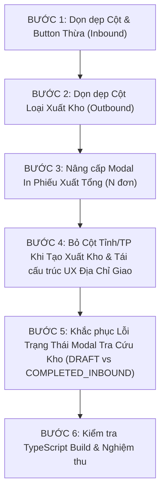

# KẾ HOẠCH TRIỂN KHAI CHO AI AGENT: NÂNG CẤP VẬN HÀNH KHO (INBOUND & OUTBOUND TMS)
> **Tài liệu**: Kế hoạch thực thi chi tiết, nguyên tử (Atomic Steps) dành cho AI Coding Agent  
> **Nguồn đánh giá hiện trạng**: [feedback_UI_and_flow_improve.md](feedback_UI_and_flow_improve.md)  
> **Tài liệu kiến trúc chuẩn**: [IMPLEMENT_STATUS_TRIP_AND_ORDER.md](../IMPLEMENT_STATUS_TRIP_AND_ORDER.md), [leader SKILL](../.agents/skills/leader/SKILL.md), [ui-compact-density.md](../.agents/rules/ui-compact-density.md)  
> **Branch**: `feature/orders-master-contract`  
> **Target Submodule**: `frontend/` (Next.js 15 App Router, Tailwind CSS, TanStack Table)  
> **Cập nhật ngày**: 04/10/2026 (Bổ sung Bước 5: Khắc phục lỗi mâu thuẫn trạng thái Filter DRAFT vs COMPLETED_INBOUND trong Modal Tra Cứu Kho theo phản hồi của User)  

---

## 🎯 MỤC TIÊU VÀ NGUYÊN TẮC BẮT BUỘC (AGENT GUARD RULES)

1. **Tuân thủ quy chuẩn UI Compact Density ([ui-compact-density.md](../.agents/rules/ui-compact-density.md))**:
   - Tuyệt đối **NGHIÊM CẤM** dùng các class padding/margin lớn: `p-4`, `p-6`, `space-y-3`, `space-y-4`, `gap-4`.
   - Bảng dữ liệu luôn dùng font siêu gọn `text-[10px]`, row padding `py-1 px-1.5`.
2. **Không Mock Data / Không Hardcode số ngẫu nhiên**:
   - Sử dụng 100% dữ liệu thực từ các endpoint REST API hiện có.
   - Dùng Nullish Coalescing `?? 0`, tuyệt đối không dùng fallback falsy `|| 52`.
3. **Bảo toàn Hợp đồng Gốc (Master Contract Immutability)**:
   - Thao tác tại luồng xuất kho **không được ghi đè** lên trường địa chỉ giao gốc của đơn hàng (`order.deliveryAddress`).
4. **Quy tắc Cột "Tỉnh/TP"**:
   - Luồng Nhập kho: **GIỮ NGUYÊN** cột Tỉnh/TP để phân loại địa bàn gom hàng ban đầu.
   - Luồng Tạo mới Xuất kho (`isOutboundMode = true`): **LOẠI BỎ HOÀN TOÀN** cột Tỉnh/TP để bảng tinh gọn, triệt tiêu 92px dư thừa, tập trung vào đích đến của chuyến xuất.
5. **Khử hoàn toàn mã Enum kỹ thuật (Zero Technical Jargon)**:
   - Tuyệt đối không hiển thị mã enum database thô (ví dụ: `COMPLETED_INBOUND`) lên giao diện người dùng; bắt buộc dùng badge tiếng Việt vận hành chuẩn (`LƯU KHO`, `Đơn nháp`, `Chờ nhập kho`).

---

## 🗺️ BẢN ĐỒ FILE CẦN CHỈNH SỬA (FILE MODIFICATION MAP)

| # | File Path | Mục đích chỉnh sửa | Mức độ rủi ro |
|---|---|---|---|
| **1** | [`frontend/src/app/dashboard/warehouse/inbound/page.tsx`](file:///d:/Projects/logistics-website/frontend/src/app/dashboard/warehouse/inbound/page.tsx) | Bỏ cột "Loại tiếp nhận" & Xóa button "Nhận luân chuyển nội bộ" | Thấp |
| **2** | [`frontend/src/app/dashboard/warehouse/outbound/page.tsx`](file:///d:/Projects/logistics-website/frontend/src/app/dashboard/warehouse/outbound/page.tsx) | Bỏ cột "Loại xuất kho", map toàn bộ N đơn hàng của chuyến xe vào phiếu in xuất tổng | Trung bình |
| **3** | [`frontend/src/features/warehouse/components/warehouse-outbound-receipt-modal.tsx`](file:///d:/Projects/logistics-website/frontend/src/features/warehouse/components/warehouse-outbound-receipt-modal.tsx) | Mở rộng `OutboundReceiptData` hỗ trợ mảng `items`, render động danh sách N đơn hàng và dòng tổng cộng A4 | Trung bình |
| **4** | [`frontend/src/features/warehouse/components/warehouse-editable-grid.tsx`](file:///d:/Projects/logistics-website/frontend/src/features/warehouse/components/warehouse-editable-grid.tsx) | **Bỏ cột Tỉnh/TP khi `isOutboundMode = true`**; Tái cấu trúc ô "Địa chỉ giao": 2 lựa chọn (Địa chỉ thường vs Thay đổi địa chỉ mở Popover Hub Cấp 1 lên trước, Xe bo sau) | Trung bình |
| **5** | [`frontend/src/features/warehouse/components/warehouse-lookup-modal.tsx`](file:///d:/Projects/logistics-website/frontend/src/features/warehouse/components/warehouse-lookup-modal.tsx) | **Sửa lỗi mâu thuẫn trạng thái**: Đọc `row.hubStatus` thay vì `row.status` toàn cục, khử enum `COMPLETED_INBOUND`, đổi tab filter `DRAFT` thành `Đơn nháp` | Thấp |

---

## 🛠️ CHI TIẾT TỪNG BƯỚC THỰC THI (STEP-BY-STEP ATOMIC TASKS)



---

### BƯỚC 1: Dọn Dẹp Bảng & Header Màn Hình Nhập Kho (Inbound)
**Target File**: [`frontend/src/app/dashboard/warehouse/inbound/page.tsx`](file:///d:/Projects/logistics-website/frontend/src/app/dashboard/warehouse/inbound/page.tsx)

#### Nhiệm vụ 1.1: Xóa nút "Nhận luân chuyển nội bộ" ở Header
- **Vị trí**: Khoảng dòng 670–674:
  ```tsx
  // XÓA ĐOẠN NÀY:
  <Button
    onClick={() => setActiveView('MODE2_TRANSFER')}
    className='bg-slate-900 text-white hover:bg-slate-800 dark:bg-slate-800 dark:hover:bg-slate-700 text-xs font-bold shadow-sm'
  >
    <IconTruck className='mr-1 h-4 w-4' /> Nhận luân chuyển nội bộ
  </Button>
  ```
- **Kết quả mong đợi**: Header Inbound chỉ còn duy nhất 1 nút chính: `<Button onClick={() => setActiveView('MODE1_CUSTOMER')}><IconPlus className='mr-1 h-4 w-4' /> Tạo đơn nhập mới</Button>`.

#### Nhiệm vụ 1.2: Xóa cột "LOẠI TIẾP NHẬN" trong Bảng Inbound Board
- **Vị trí thẻ `<th>`**: Khoảng dòng 837:
  ```tsx
  // XÓA:
  <th className='py-1.5 px-2 text-center w-[100px]'>LOẠI TIẾP NHẬN</th>
  ```
- **Vị trí thẻ `<td>`**: Khoảng dòng 953–964:
  ```tsx
  // XÓA:
  <td className='py-1 px-2 text-center'>
    <Badge
      variant='outline'
      className={
        grp.isTransfer
          ? 'bg-purple-50 text-purple-700 border-purple-300 font-bold text-[10px]'
          : 'bg-blue-50 text-blue-700 border-blue-300 font-bold text-[10px]'
      }
    >
      {grp.isTransfer ? 'Luân chuyển' : 'Khách gửi'}
    </Badge>
  </td>
  ```
- **Cập nhật `colSpan`**: Tìm tất cả các vị trí `colSpan={7}` trong bảng Inbound (loading state tại dòng 844, empty state tại dòng 851, subrow tại dòng 993) và đổi thành `colSpan={6}`.

---

### BƯỚC 2: Dọn Dẹp Bảng Màn Hình Xuất Kho (Outbound)
**Target File**: [`frontend/src/app/dashboard/warehouse/outbound/page.tsx`](file:///d:/Projects/logistics-website/frontend/src/app/dashboard/warehouse/outbound/page.tsx)

#### Nhiệm vụ 2.1: Xóa cột "LOẠI XUẤT KHO" trong Bảng Outbound Board
- **Vị trí thẻ `<th>`**: Khoảng dòng 923:
  ```tsx
  // XÓA:
  <th className='py-1.5 px-2 text-center w-[100px]'>LOẠI XUẤT KHO</th>
  ```
- **Vị trí thẻ `<td>`**: Khoảng dòng 1039–1050:
  ```tsx
  // XÓA thẻ td chứa Badge {grp.isTransfer ? 'Luân chuyển' : 'Xuất khách'}
  ```
- **Cập nhật `colSpan`**: Đổi tất cả các vị trí `colSpan={7}` trong bảng Outbound (loading state dòng 930, empty state dòng 937, subrow dòng 1089) thành `colSpan={6}`.

---

### BƯỚC 3: Nâng Cấp "In Phiếu Xuất" Thành Phiếu Xuất Tổng Của Chuyến Xe (N Đơn Hàng)

#### Nhiệm vụ 3.1: Cập nhật Interface và Logic Render trong Modal In Xuất Kho
**Target File**: [`frontend/src/features/warehouse/components/warehouse-outbound-receipt-modal.tsx`](file:///d:/Projects/logistics-website/frontend/src/features/warehouse/components/warehouse-outbound-receipt-modal.tsx)

1. **Bổ sung interface `OutboundReceiptItem`**:
   ```typescript
   export interface OutboundReceiptItem {
     orderCode: string;
     goodsDescription: string;
     quantity: number;
     unit?: string;
     deliveryAddress?: string;
     province?: string;
     accompanyingDocs?: string;
     notes?: string;
   }
   ```
2. **Bổ sung vào `OutboundReceiptData`**:
   ```typescript
   export interface OutboundReceiptData {
     tripCode?: string;
     orderCode: string;
     goodsDescription: string;
     totalQuantity: number;
     outboundQuantity?: number;
     // ... các trường hiện có
     items?: OutboundReceiptItem[]; // <-- BỔ SUNG MẢNG ITEMS
   }
   ```
3. **Cập nhật mã in HTML A4**:
   - Nếu `data.items && data.items.length > 0`: duyệt qua mảng `data.items.map((it, idx) => ...)` để sinh các dòng `<tr>` (STT, Mã Đơn, Tên mặt hàng, Số lượng xuất, Đơn vị, Địa chỉ giao hàng, Chứng từ đi kèm, Ghi chú).
   - Nếu không có `items`: fallback về 1 dòng đơn lẻ với `data.orderCode`.
   - Hàng Footer "Tổng cộng": tính tổng số lượng `data.totalQuantity` hoặc `data.items.reduce((s, it) => s + it.quantity, 0)`.
4. **Cập nhật Bảng Xem Trước trong Modal Dialog**:
   - Thay thế thẻ `<tr>` đơn cứng bằng vòng lặp `(data.items && data.items.length > 0 ? data.items : [fallbackItem]).map(...)`.

#### Nhiệm vụ 3.2: Truyền đầy đủ danh sách đơn hàng từ Chuyến Xe khi bấm "In phiếu xuất"
**Target File**: [`frontend/src/app/dashboard/warehouse/outbound/page.tsx`](file:///d:/Projects/logistics-website/frontend/src/app/dashboard/warehouse/outbound/page.tsx)

- **Vị trí**: Hàm `handleOpenReceiptForVehicle` (khoảng dòng 641–670):
- **Cập nhật code**:
  ```tsx
  const handleOpenReceiptForVehicle = (grp: InboundVehicleGroup) => {
    const orig =
      grp.orders[0]?.pickupAddress?.trim() ||
      grp.orders[0]?.originHubEntity?.name ||
      grp.orders[0]?.originHub ||
      user?.hub?.name;
    const dest =
      grp.orders[0]?.destinationHubEntity?.name ||
      grp.orders[0]?.destinationHub ||
      grp.orders[0]?.deliveryAddress?.trim() ||
      '';

    const items: OutboundReceiptItem[] = grp.orders.map((o) => ({
      orderCode: o.orderCode,
      goodsDescription: o.goodsDescription || 'Hàng hóa xuất kho',
      quantity: Number(o.totalQuantity ?? 1),
      unit: 'Kiện',
      deliveryAddress: o.deliveryAddress || o.destinationHub || '—',
      province: o.province || o.destinationHubEntity?.province || '—',
      accompanyingDocs: o.accompanyingDocs || 'KHÔNG CÓ',
      notes: o.notes || ''
    }));

    const receiptData: OutboundReceiptData = {
      tripCode: grp.tripCode !== '—' ? grp.tripCode : undefined,
      orderCode: grp.orders.length > 1 ? (grp.tripCode !== '—' ? grp.tripCode : `CHUYẾN-${grp.licensePlate}`) : (grp.orders[0]?.orderCode || 'WH-OUT'),
      goodsDescription: grp.goodsDescription,
      totalQuantity: grp.totalQuantity,
      outboundQuantity: grp.totalQuantity,
      totalWeight: grp.totalWeight,
      totalVolume: grp.totalVolume,
      driverName: grp.driverName,
      licensePlate: grp.licensePlate,
      deliveryAddress: dest,
      destinationHub: dest,
      originHub: orig,
      mode: grp.isTransfer ? 'TRANSFER' : 'CUSTOMER',
      dispatchDate: grp.receiveDate || new Date().toISOString().split('T')[0],
      notes: grp.notes || '',
      items
    };
    setSelectedReceiptData(receiptData);
    setIsReceiptModalOpen(true);
  };
  ```

---

### BƯỚC 4: Bỏ Cột "Tỉnh/TP" Khi Tạo Xuất Kho & Tái Cấu Trúc UX Cột "Địa Chỉ Giao"
**Target File**: [`frontend/src/features/warehouse/components/warehouse-editable-grid.tsx`](file:///d:/Projects/logistics-website/frontend/src/features/warehouse/components/warehouse-editable-grid.tsx)

#### Nhiệm vụ 4.1: BỎ CỘT "TỈNH / TP" khi `isOutboundMode = true`
- **Vị trí**: Định nghĩa `columns` (khoảng dòng 1500–1615):
- **Thay đổi**: Cột `province` chỉ xuất hiện khi `isOutboundMode === false` (Nhập kho). Khi `isOutboundMode === true` (Xuất kho), loại bỏ hoàn toàn cột này:
  ```tsx
  // Tại mảng columns trong useMemo:
  ...(isOutboundMode
    ? []
    : [
        {
          accessorKey: 'province',
          id: 'province',
          header: 'TỈNH / TP',
          size: 92,
          cell: ProvinceCell,
        },
      ]),
  ```
- **Lợi ích**: Thu hồi ngay lập tức 92px chiều ngang trên bảng tạo xuất kho, giúp bảng không bị cuộn ngang và tập trung vào cột Địa chỉ giao.

#### Nhiệm vụ 4.2: Tái thiết kế giao diện `DeliveryAddressCell` cho `isOutboundMode`
Thay thế thẻ `<select>` 3 tùy chọn bằng giao diện trực quan 2 lựa chọn:

1. **Lựa chọn 1: `Địa chỉ thường` (Mặc định)**:
   - Khi ở trạng thái này, ô tự động nạp và hiển thị lại địa chỉ giao hàng ban đầu từ luồng nhập kho của đơn hàng.
   - Hiển thị văn bản địa chỉ rõ ràng trong khung gọn gàng, không ghi đè dữ liệu gốc của đơn hàng.
2. **Lựa chọn 2: `Thay đổi địa chỉ`**:
   - Cung cấp một nút bấm nhỏ gọn, tiện dụng: `<button type="button" className="..."><IconMapPin /> Thay đổi địa chỉ</button>`.
   - Khi nhấp vào nút, kích hoạt một **Popover** (sử dụng `@radix-ui/react-popover` hoặc component `Popover` của Shadcn UI):
     - **Thanh tìm kiếm live-search**: Gõ tìm theo tên Hub, mã trạm, tỉnh thành.
     - **Danh sách phân cấp ưu tiên**:
       * **Section 1: HUB CẤP 1 (TRUNG TÂM TRUNG CHUYỂN)** (Xếp lên đầu tiên):
         Liệt kê danh sách các Hub có `level = 1` (ví dụ: *Polaris Hub - Hưng Yên*, *Magellan Hub - Đà Nẵng*, *Andromeda Hub - HCM*...).
       * **Section 2: XE BO CẤP 2 (TUYẾN VỆ TINH / GOM HÀNG)** (Xếp tiếp theo sau Hub Cấp 1):
         Liệt kê danh sách các trạm xe bo `level = 2` (ví dụ: *Tuyến xe bo Hà Nội*, *Tuyến xe bo HCM*, *XB-KH-02*...).
     - Khi người dùng nhấp chọn một dòng:
       * Tự động gán `destinationHubId = hub.id`.
       * Gán tên Hub/Xe bo vào đích xuất kho và hiển thị Badge trực quan trong ô: `[Hub Cấp 1] Polaris Hub` hoặc `[Xe Bo] Tuyến Hà Nội`.
       * Đóng Popover.
     - Cho phép nút bấm "Quay lại địa chỉ thường" để hoàn tác nạp lại địa chỉ gốc ban đầu.

---

### BƯỚC 5: Khắc Phục Lỗi Xung Đột Trạng Thái Filter "DRAFT" vs Dòng Hàng "COMPLETED_INBOUND" Trong Modal Tra Cứu Kho
**Target File**: [`frontend/src/features/warehouse/components/warehouse-lookup-modal.tsx`](file:///d:/Projects/logistics-website/frontend/src/features/warehouse/components/warehouse-lookup-modal.tsx)

> **Lời văn phản hồi từ User**:  
> *"ở modal 'Tra Cứu & Chọn Đơn Hàng Từ Kho', sao lại confuse cái status 'DRAFT' ở chỗ trạng thái filter với 'COMPLETED_INBOUND' đang thể hiện ở dòng hàng hóa"*

#### Nhiệm vụ 5.1: Đọc đúng trạng thái ngữ cảnh Hub (`hubStatus`) thay vì trạng thái toàn cục (`status`)
- **Vị trí**: Dòng 343 và dòng 383:
- **Nguyên nhân**: Đơn hàng luân chuyển từ HCM ra Hưng Yên: Kho HCM đã xuất nên `order.status = 'COMPLETED_INBOUND'`, nhưng tại Hưng Yên xe chưa dỡ hàng nên `row.hubStatus = 'WAITING'` hoặc `'DRAFT'` (Chờ nhập). Code cũ đọc `row.status` toàn cục nên in ra `COMPLETED_INBOUND`.
- **Cách sửa**:
  ```tsx
  // Xác định trạng thái hiển thị theo góc nhìn Hub người xem:
  const displayStatus = (row as any).hubStatus ?? row.status;
  const isStored = displayStatus === 'INBOUND' || displayStatus === 'STORED' || displayStatus === 'LUU_KHO';
  const isDraftLike = displayStatus === 'DRAFT' || displayStatus === 'PENDING' || displayStatus === 'WAITING' || displayStatus === 'PENDING_INBOUND';
  ```

#### Nhiệm vụ 5.2: Khử hoàn toàn mã Enum thô, dùng Badge tiếng Việt chuẩn
- **Vị trí**: Dòng 374–385 trong `warehouse-lookup-modal.tsx`:
- **Code cũ vi phạm**:
  ```tsx
  // CŨ:
  {isStored ? '🟡 LƯU KHO' : `⚫ ${row.status}`} // -> In ra ⚫ COMPLETED_INBOUND
  ```
- **Code mới chuẩn hóa**:
  ```tsx
  // MỚI:
  <Badge
    variant="outline"
    className={
      isStored
        ? 'bg-amber-50 text-amber-800 border-amber-300 dark:bg-amber-950/40 dark:text-amber-300 dark:border-amber-700 font-bold px-2.5 py-0.5 rounded-full'
        : isDraftLike
          ? 'bg-slate-100 text-slate-700 border-slate-300 dark:bg-slate-800 dark:text-slate-300 dark:border-slate-700 font-bold px-2.5 py-0.5 rounded-full'
          : 'bg-blue-50 text-blue-700 border-blue-300 dark:bg-blue-950/40 dark:text-blue-300 dark:border-blue-700 font-bold px-2.5 py-0.5 rounded-full'
    }
  >
    {isStored
      ? '🟡 LƯU KHO'
      : displayStatus === 'DRAFT'
        ? '⚪ Đơn nháp'
        : '🟠 Chờ nhập kho'}
  </Badge>
  ```

#### Nhiệm vụ 5.3: Việt hóa Tab Filter & Đồng bộ Counter Parity
- **Vị trí**: Dòng 268–281 trong `warehouse-lookup-modal.tsx`:
- **Đổi nhãn Tab Filter**:
  ```tsx
  // Đổi từ DRAFT thành Đơn nháp:
  <button
    type="button"
    onClick={() => {
      setStatusFilter('DRAFT');
      setPage(1);
    }}
    className={`px-3 py-1.5 rounded-full text-xs transition-all font-semibold flex items-center gap-1.5 ${
      statusFilter === 'DRAFT'
        ? 'bg-slate-700 text-white shadow-sm font-bold'
        : 'bg-slate-100 dark:bg-slate-800 text-slate-700 dark:text-slate-300 border border-slate-200 dark:border-slate-700 hover:bg-slate-200'
    }`}
  >
    <span className="w-2 h-2 rounded-full bg-slate-400 inline-block" />
    Đơn nháp ({meta.draftCount})
  </button>
  ```
- **Kết quả**: Khi bấm tab "Đơn nháp (1)", dòng hàng hiển thị badge "⚪ Đơn nháp" hoặc "🟠 Chờ nhập kho", **100% khớp với tab filter, triệt tiêu hoàn toàn sự khó hiểu (`confuse`)**.

---

### BƯỚC 6: Kiểm Tra Toàn Bộ Mã Nguồn & Xác Nhận Nghiệm Thu (Verification)

Sau khi hoàn tất chỉnh sửa, AI Agent bắt buộc phải chạy các lệnh kiểm thử sau:

1. **Kiểm tra biên dịch TypeScript Frontend**:
   ```bash
   npm --prefix frontend run build
   ```
   *(Hoặc `npx --prefix frontend tsc --noEmit` để đảm bảo 0 lỗi kiểu dữ liệu).*
2. **Kiểm tra Git Status**:
   ```bash
   git -C frontend status -sb
   ```
   *(Xác nhận các file thay đổi đúng phạm vi và sạch sẽ).*

---

## ✅ CHECKLIST NGHIỆM THU DÀNH CHO AI AGENT (DoD)

- [ ] **Mục 1**: Không còn cột "LOẠI TIẾP NHẬN" trên bảng Inbound Board; `colSpan` đã giảm về 6.
- [ ] **Mục 2**: Không còn button "Nhận luân chuyển nội bộ" ở Header Inbound; chỉ có nút "Tạo đơn nhập mới".
- [ ] **Mục 3**: Không còn cột "LOẠI XUẤT KHO" trên bảng Outbound Board; `colSpan` đã giảm về 6.
- [ ] **Mục 4 (Bỏ Cột Tỉnh/TP Xuất Kho)**: 
  - Bảng tạo mới xuất kho (`WarehouseEditableGrid` khi `isOutboundMode = true`) **KHÔNG CÒN CỘT "TỈNH / TP"**.
  - Bảng tạo mới nhập kho (`isOutboundMode = false`) **VẪN CÓ CỘT "TỈNH / TP"** bình thường.
- [ ] **Mục 5 (In Phiếu Xuất Tổng)**: Nút "In phiếu xuất" tại Outbound Board của chuyến xe chở 3 đơn hàng khi bấm sẽ mở ra phiếu in A4 hiển thị đúng 3 đơn hàng cùng hàng tổng cộng chính xác.
- [ ] **Mục 6 (Địa Chỉ Giao)**: Cột địa chỉ giao trong form tạo xuất kho hiển thị 2 chế độ rõ ràng (Địa chỉ thường & Thay đổi địa chỉ bằng Popover phân cấp Hub Cấp 1 lên trước, Xe bo lên sau). Thao tác không làm mất địa chỉ gốc trong DB.
- [ ] **Mục 7 (Khắc Phục Lỗi Modal Tra Cứu Kho)**: 
  - Khi chọn tab "Đơn nháp", dòng hàng hiển thị badge "⚪ Đơn nháp" hoặc "🟠 Chờ nhập kho", **tuyệt đối không hiển thị enum kỹ thuật `COMPLETED_INBOUND`**.
  - Trạng thái dòng hàng đọc theo `(row as any).hubStatus ?? row.status`.
  - Tab filter hiển thị nhãn tiếng Việt `Đơn nháp ({meta.draftCount})`.
- [ ] **Mục 8**: Lệnh `npm --prefix frontend run build` (hoặc typecheck) thành công với 0 lỗi.
