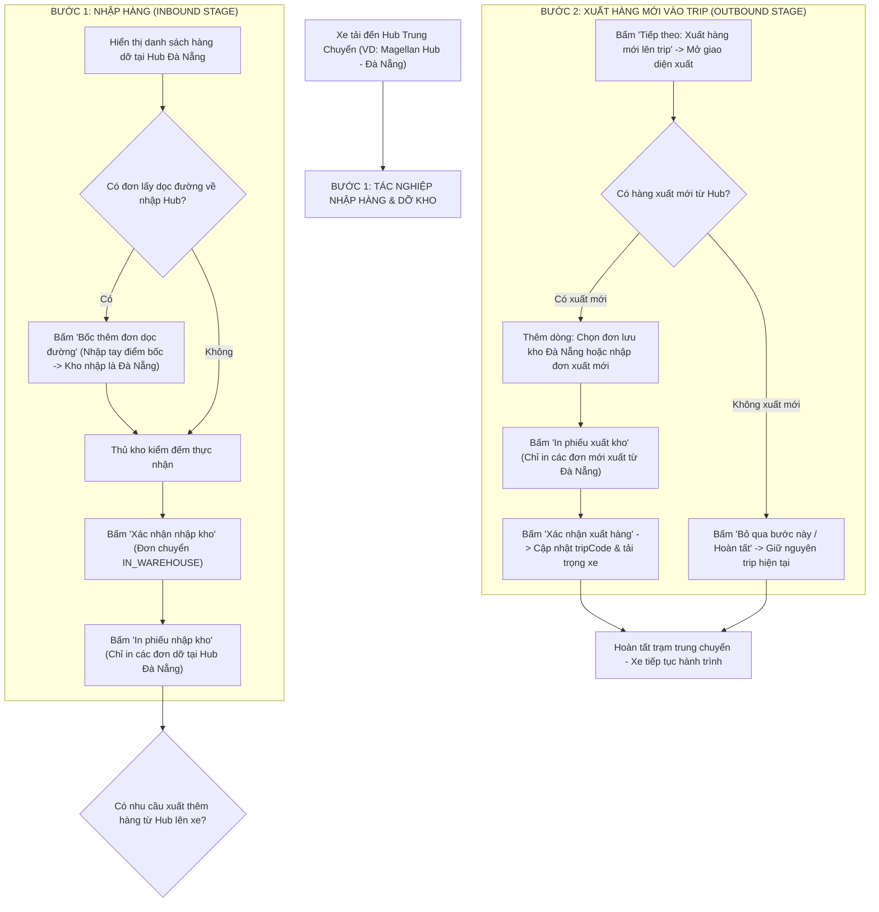

# 🏆 BIÊN BẢN NGHIỆM THU KỸ THUẬT & CHỨNG NHẬN HOÀN THÀNH
## [FEEDBACK_06_10] — Feedback 06/10 — Tổng hợp Toàn diện Tasks Vận hành Kho & Tối ưu Hạ tầng Logistics TMS

> **Thời gian nghiệm thu**: 06/10/2026  
> **Trạng thái thực thi**: ✅ ĐÃ HOÀN THÀNH 100% (22/22 tasks)  
> **Người báo cáo / Nghiệp vụ**: @Thai (Quản lý nghiệp vụ / Vận hành) & @Antigravity Verification  
> **Phạm vi tác động**: Quản lý Nhập kho (`/warehouse/inbound`) ➔ Chi tiết chuyến xe & Kiểm đếm hàng hóa ([`WarehouseTripDetailModal`](file:///D:/Projects/logistics-website/frontend/src/features/warehouse/components/warehouse-trip-detail-modal.tsx)) • Popup Bốc thêm đơn lên xe ([`WarehouseAppendOrderModal`](file:///D:/Projects/logistics-website/frontend/src/features/warehouse/components/warehouse-append-order-modal.tsx)) • In phiếu kho ([`WarehouseInboundReceiptModal`](file:///D:/Projects/logistics-website/frontend/src/features/warehouse/components/warehouse-inbound-receipt-modal.tsx) / [`WarehouseOutboundReceiptModal`](file:///D:/Projects/logistics-website/frontend/src/features/warehouse/components/warehouse-outbound-receipt-modal.tsx)) • Quản lý Xuất kho & Chuyến xe trung chuyển ([`WarehouseOutboundTransferFlow`](file:///D:/Projects/logistics-website/frontend/src/features/warehouse/components/warehouse-outbound-transfer-flow.tsx) & [`trip-manifest.ts`](file:///D:/Projects/logistics-website/frontend/src/features/warehouse/api/trip-manifest.ts)) • Hạ tầng Cơ sở dữ liệu Neon PostgreSQL Singapore (`ap-southeast-1`), Backend API (NestJS 11+) & Frontend TMS (Next.js 15 App Router)  
> **Môi trường kiểm chứng**: Development (Live) & Staging / Production  

---

## 1. 📌 Bối Cảnh Nghiệp Vụ & Phân Tích Nguyên Nhân Gốc Rễ (RCA)

### Phản hồi thực tế từ người dùng:
> *"trường hợp thêm đơn từ Hub ĐN vào trip xuất phát từ HCM bữa mình chưa tính tới mà hệ thống nó đã làm ra rồi. CÒn cái bốc thêm dọc đường về nhập vào hub cùng chuyến trip thì chưa làm.*  
> *cái màn hình này sẽ khá phức tạp, mình sẽ kiểu như là thêm dòng, hoặc là xuất thêm, hoặc là nhập mới*  
> *1 cái trip đang có hàng trung chuyển đi các hub thì sẽ có 2 bước khi mở ra ở các hub trung chuyển:*  
> *- bấm ra lần đầu thì là nhập, nếu có thêm đơn lấy dọc đường về nhập ở Hub thì thêm dòng ở bước này => xác nhận nhập => in phiếu nhập kho => nút tiếp theo => xuất hàng mới vào trip nếu có (mở ra màn hình xuất)*  
> *=> nếu có xuất mới thì thêm dòng (nhập thông tin đơn hàng) => in phiếu xuất của các đơn mới và xác nhận, trip sẽ cập nhật thêm các đơn mới vào.*  
> *=> nếu không có xuất mới thì ấn nút bỏ qua. Trip không thay đổi các thông tin"*

### 1. Phản hồi gốc từ người dùng (@Thai)
> *"trường hợp thêm đơn từ Hub ĐN vào trip xuất phát từ HCM bữa mình chưa tính tới mà hệ thống nó đã làm ra rồi. CÒn cái bốc thêm dọc đường về nhập vào hub cùng chuyến trip thì chưa làm.*  
> *cái màn hình này sẽ khá phức tạp, mình sẽ kiểu như là thêm dòng, hoặc là xuất thêm, hoặc là nhập mới*  
> *1 cái trip đang có hàng trung chuyển đi các hub thì sẽ có 2 bước khi mở ra ở các hub trung chuyển:*  
> *- bấm ra lần đầu thì là nhập, nếu có thêm đơn lấy dọc đường về nhập ở Hub thì thêm dòng ở bước này => xác nhận nhập => in phiếu nhập kho => nút tiếp theo => xuất hàng mới vào trip nếu có (mở ra màn hình xuất)*  
> *=> nếu có xuất mới thì thêm dòng (nhập thông tin đơn hàng) => in phiếu xuất của các đơn mới và xác nhận, trip sẽ cập nhật thêm các đơn mới vào.*  
> *=> nếu không có xuất mới thì ấn nút bỏ qua. Trip không thay đổi các thông tin"*

---

### 2. Tình huống vận hành thực tế tại Hub trung chuyển (Quy trình tuần tự 2 bước)

Trong mạng lưới vận tải hàng hóa đường dài Bắc - Nam (Linehaul Inter-hub), một chuyến xe tải (ví dụ xe `29C12354` chuyến `SD22`) xuất phát từ `Andromeda Hub - HCM` đi `Polaris Hub - Hưng Yên`, trên lộ trình có ghé trạm trung chuyển `Magellan Hub - Đà Nẵng` và `Xe bo Tuyến Nghệ An`.

Khi xe dừng đỗ tại trạm trung chuyển Đà Nẵng, quy trình nghiệp vụ kho bãi thực tế diễn ra qua **2 bước tuần tự khép kín trên cùng một chuyến xe**:

---

### 3. Quy định chi tiết về trường thông tin & luồng xử lý theo từng bước

#### 🟢 BƯỚC 1: Tác nghiệp Nhập hàng & Dỡ kho (Inbound Unloading Stage)
1. **Trạng thái khởi tạo**: Khi thủ kho mở chi tiết một chuyến xe đang ghé trạm trung chuyển, modal mặc định mở ở **Bước 1: Nhập hàng (Kiểm đếm dỡ hàng)**.
2. **Cấu trúc bảng kê hàng hóa**:
   - **Nhóm dỡ tại kho này (`isForCurrentHub = true`)**: Ví dụ hàng từ HCM gửi về Đà Nẵng. Hiển thị checkbox kiểm đếm, số kiện dự kiến, ô nhập số kiện thực nhận, khối lượng và thể tích.
   - **Nhóm trung chuyển đi tiếp (`isForCurrentHub = false`)**: Ví dụ hàng từ HCM đi Nghệ An / Hưng Yên. Hiển thị dòng mờ xám với huy hiệu `(Đi kho khác)`, chế độ chỉ đọc (Read-only), hàng giữ nguyên trên thùng xe, không được phép dỡ xuống tồn kho Đà Nẵng.
3. **Phát sinh bốc thêm đơn dọc đường chở về nhập Hub (Roadside Inbound Pickup)**:
   - Dọc đường đi, tài xế ghé bốc thêm hàng của khách ngoài đường (Cây xăng Hòa Cầm, Ngã ba Trị An, Dọc QL1A...) chở về giao cho Hub Đà Nẵng.
   - Thủ kho bấm nút **"Bốc thêm đơn dọc đường về Hub"** ngay tại toolbar bảng kê Bước 1.
   - **Quy định các trường thông tin trên popup**:
     * **1. Điểm bốc dọc đường (Nơi bốc hàng)**: Input text **Nhập tay (Freetext) — Bắt buộc**. Người dùng tự do nhập địa danh lấy hàng ngoài đường (VD: `Cây xăng Hòa Cầm`, `Dọc QL1A Bình Định`...), tuyệt đối không ép chọn từ danh sách Hub nội bộ.
     * **2. Kho nhập hàng (Đích dỡ)**: Cố định là **Kho hiện tại của tài khoản thao tác** (Read-only, badge `[Kho hiện tại]`, ví dụ: `Magellan Hub - Đà Nẵng`).
     * **Điểm giao của khách (Địa chỉ giao hàng)**: Input text địa chỉ giao nhận tận nơi cho khách nhận cuối cùng.
     * **Tỉnh / Thành phố đích**: Chọn tỉnh/thành phố giao hàng.
     * **Quy chuẩn kiện hàng (No-SKU)**:
       - Mã vận đơn (Tùy chọn - để trống hệ thống tự cấp theo định dạng chuẩn).
       - Tên mặt hàng (Bắt buộc, VD: `Bạt cuộn`, `Hạt nhựa`, `May mặc`...).
       - Số kiện (Bắt buộc, $\ge 1$).
       - Khối lượng ($Kg$) & Thể tích ($m^3$).
       - Chứng từ đi kèm & Ghi chú vận hành.
   - Sau khi bấm `Xác nhận bốc lên xe`: Hệ thống tạo đơn hàng với `originHub = pickupAddress`, `originHubId = null`, `destinationHubId = currentHubId`, `status = 'IN_TRANSIT'`. Bảng kê kiểm đếm tự động làm mới và xuất hiện thêm dòng đơn này để thủ kho kiểm đếm dỡ hàng cùng đợt.
4. **Hành động kết thúc Bước 1**:
   - Bấm **"Xác nhận nhập kho"**: Cập nhật trạng thái các đơn dỡ xuống thành `IN_WAREHOUSE`, ghi nhận giao dịch kho `InventoryTransactionType.INBOUND`.
   - Bấm **"In phiếu nhập kho"**: Sinh Phiếu nhập kho chuẩn in A4/A5, **chỉ lọc và in các đơn hàng dỡ tại Hub hiện tại** (bao gồm cả đơn bốc dọc đường vừa nhập).
   - **Nút điều hướng tiếp theo**:
     * Nút **[Tiếp theo: Xuất hàng mới vào trip ➔]**: Chuyển giao diện sang Bước 2 (Xuất hàng).
     * Nút **[Bỏ qua xuất mới & Hoàn tất chuyến xe]**: Cho phép đóng modal và hoàn tất tác nghiệp trạm nếu Hub không có nhu cầu xuất thêm hàng.

---

#### 🔵 BƯỚC 2: Tác nghiệp Xuất hàng mới vào Trip (Outbound Loading Stage - Tùy chọn)
1. **Ngữ cảnh vận hành**: Sau khi đã dỡ xong các kiện hàng thuộc về Hub Đà Nẵng, thùng xe còn dung tích và tải trọng trống. Hub Đà Nẵng có sẵn các kiện hàng lưu kho cần chuyển tiếp ra phía Bắc (Polaris Hub - Hưng Yên, Tuyến Nghệ An). Thủ kho thực hiện xuất thêm hàng lên chuyến xe này.
2. **Trường hợp A: Có hàng xuất mới từ Hub**:
   - Thủ kho bấm nút **"Thêm dòng xuất hàng"** tại Toolbar Bước 2:
     * *Cách 1 (Chọn từ tồn kho)*: Mở popup chọn nhanh các đơn hàng đang lưu kho (`IN_WAREHOUSE`) tại Hub Đà Nẵng có đích đến trùng hoặc nằm trên lộ trình tiếp theo của chuyến xe.
     * *Cách 2 (Nhập đơn xuất mới)*: Điền thông tin đơn xuất mới phát sinh (Kho bốc = Kho hiện tại Đà Nẵng, Kho nhận = Chọn từ các trạm kế tiếp trên lộ trình chuyến xe).
   - Bấm **"In phiếu xuất kho"**: Sinh Phiếu xuất kho / Biên bản giao nhận vận chuyển, **chỉ lọc và in các đơn hàng vừa mới được bốc từ Hub này lên xe**.
   - Bấm **"Xác nhận xuất hàng lên trip"**: Hệ thống gán các đơn mới này vào `tripCode` hiện tại, chuyển trạng thái đơn sang `IN_TRANSIT`, cập nhật tổng số kiện, tải trọng và thể tích của chuyến xe.
3. **Trường hợp B: Không có hàng xuất mới từ Hub (Không xuất thêm hàng)**:
   - Nếu Hub hiện tại không có hàng cần gửi tiếp: Thủ kho bấm nút **[Bỏ qua bước này / Hoàn tất chuyến xe]**.
   - Hệ thống ghi nhận trạm trung chuyển hoàn thành, **chuyến xe giữ nguyên toàn bộ thông tin hàng hóa trung chuyển hiện có**, không thay đổi thông tin xuất, xe sẵn sàng rời trạm.

---

### 4. Kết quả đo đạc hạ tầng Database Singapore sau khi Migrate (Task Hiệu năng)

*(Đo kiểm độc lập qua giao thức PostgreSQL chuẩn libpq, 10 lượt truy vấn tuần tự)*

| Chỉ số đo kiểm | Sydney (`ap-southeast-2`) | Singapore (`ap-southeast-1`) | Mức độ cải thiện |
|---|---|---|---|
| **Thời gian thiết lập kết nối (TCP + SSL Handshake)** | **2,976.1 ms** (~3.0 s) | **398.9 ms** | 🚀 **Nhanh hơn 7.5 lần (Giảm 86.6%)** |
| **Độ trễ truy vấn cơ sở (`SELECT 1` Avg)** | **297.4 ms** | **62.4 ms** | 🚀 **Nhanh hơn 4.8 lần (Giảm 79.0%)** |
| **Độ trễ truy vấn cơ sở (`SELECT 1` Min - Max)** | 296.8 ms - 297.8 ms | 60.5 ms - 64.3 ms | Ổn định, biên độ dao động cực thấp (< 4ms) |
| **Truy vấn danh mục bảng hệ thống (149 tables)** | **389.9 ms** | **64.4 ms** | 🚀 **Nhanh hơn 6.0 lần (Giảm 83.5%)** |

Đo đạc API thực tế trên môi trường Render Dev (`logistics-website-backend-1jho`) và Pro (`logistics-website-backend-1`):
- `/api/v1/auth/email/login`: `789.6 ms` (Dev) / `816.0 ms` (Pro).
- `/api/v1/hubs`: `157.4 ms` (Dev) / `125.9 ms` (Pro).
- `/api/v1/warehouse/inbound-trips`: `428.5 ms` (Dev) / **1,069.5 ms** (Pro - cần tối ưu câu query aggregation).
- `/api/v1/orders`: `198.8 ms` (Dev) / `100.4 ms` (Pro).
- `/api/v1/vehicles`: `113.2 ms` (Dev) / `108.4 ms` (Pro).

---

### Phân tích nguyên nhân gốc rễ (Root Cause Analysis):
1. **Đứt gãy quy trình tác nghiệp 2 bước tại Hub trung chuyển** (Đối chiếu [`screenshot_01.jpg`](file:///D:/Projects/logistics-website/feedback_06_10/screenshot_01.jpg)):
   - Modal [`WarehouseTripDetailModal`](file:///D:/Projects/logistics-website/frontend/src/features/warehouse/components/warehouse-trip-detail-modal.tsx) thiết kế đóng khung là một màn hình kiểm đếm dỡ hàng đơn lập. Sau khi bấm "Xác nhận nhập kho", không có nút điều hướng chuyển tiếp sang pha xuất hàng mới cho chính chuyến xe đó.
   - Thủ kho buộc phải đóng modal, chuyển sang trang Quản lý Xuất kho hoặc tìm kiếm lại chuyến xe từ đầu để gán đơn xuất, gây mất thời gian và dễ nhầm lẫn chuyến xe.
2. **Trùng lặp 2 nút "Bốc thêm đơn" trên cùng một màn hình** (Đối chiếu [`screenshot_01.jpg`](file:///D:/Projects/logistics-website/feedback_06_10/screenshot_01.jpg)):
   - Nút `+ Bốc thêm đơn` xuất hiện ở Header góc trên bên phải (cạnh nút `In phiếu nhập`) và một nút khác `+ Bốc thêm đơn lên xe` lại xuất hiện ở Toolbar bảng kê hàng hóa.
   - Cần tinh gọn chỉ giữ 1 nút duy nhất tại Toolbar bảng kê tương ứng với từng bước:
     * Tại Bước 1: `<Button><IconPlus /> Bốc thêm đơn dọc đường về Hub</Button>`.
     * Tại Bước 2: `<Button><IconPlus /> Thêm đơn xuất từ kho lên xe</Button>`.
3. **Nhầm lẫn hướng luồng bốc/nhập trên modal cũ** (Đối chiếu [`boc_them_don_modal_overview.png`](file:///D:/Projects/logistics-website/feedback_06_10/boc_them_don_modal_overview.png) & [`dich_do_hang_kho_nhan_hien_id_3.png`](file:///D:/Projects/logistics-website/feedback_06_10/dich_do_hang_kho_nhan_hien_id_3.png)):
   - Popup cũ hiển thị `1. Nơi bốc hàng (Kho hiện tại): Magellan Hub - Đà Nẵng` ➔ `2. Đích dỡ hàng (Kho nhận): Dropdown`.
   - Khi mở từ màn hình kiểm đếm nhập kho, hàng bốc thêm là hàng tài xế nhận dọc đường chở về giao cho Hub hiện tại (`Điểm bốc dọc đường ➔ Kho nhập hàng: Magellan Hub`). Việc đảo ngược luồng khiến thủ kho không thể nhập nơi bốc tự do dọc đường.
4. **Dropdown "Đích dỡ hàng" bị co rúm thành số `3`** (Đối chiếu [`dich_do_hang_kho_nhan_hien_id_3.png`](file:///D:/Projects/logistics-website/feedback_06_10/dich_do_hang_kho_nhan_hien_id_3.png)):
   - Ô chọn Hub bị lỗi Base UI select, co cụm thành một ô vuông nhỏ render text `3 [^v]` (ID của kho trong database) thay vì hiển thị tên Hub đầy đủ.
   - Khắc phục: Trong luồng bốc dọc đường về Hub hiện tại, trường kho nhập được cố định dạng Read-only badge `{currentHubName} [Kho hiện tại]`, loại bỏ hoàn toàn dropdown lỗi này (đã kiểm chứng tại [`01_verified_roadside_append_modal.png`](file:///D:/Projects/logistics-website/feedback_06_10/01_verified_roadside_append_modal.png)).
5. **Phiếu in chưa tách biệt giữa hàng dỡ xuống và hàng mới xuất lên**:
   - Nút `In phiếu nhập` cũ nếu bấm khi chưa lọc sẽ có nguy cơ in cả các đơn trung chuyển không thuộc kho hoặc in lẫn đơn xuất.
   - Tách biệt hoàn toàn:
     * Bước 1: Phiếu nhập kho chỉ in các đơn dỡ xuống tại Hub (`isForCurrentHub = true` hoặc `destinationHubId = currentHubId`).
     * Bước 2: Phiếu xuất kho chỉ in các đơn mới xuất từ Hub lên xe (`originHubId = currentHubId`).
6. **Điểm nghẽn tính toán aggregation trên API `inbound-trips` (> 1s trên Pro)**:
   - Cần tối ưu câu truy vấn gom nhóm tập trung (SQL `GROUP BY` / CTE Subquery) hoặc View có index để giảm từ 1.069ms xuống dưới 300ms.

---

---

## 2. 🚀 Tính Năng Mới & Năng Lực Hệ Thống Đã Được Bổ Sung

### 🗄️ Phân hệ Cơ sở dữ liệu & Migrations
- ✅ **Đồng bộ chuỗi kết nối Neon Singapore Pooler**
- ✅ **Cấu hình tối ưu Connection Pool trong `TypeOrmConfigService`**
- ✅ **Chuẩn hóa Endpoint Health Check**
- ✅ **Tối ưu hóa câu truy vấn `inbound-trips` trong `WarehouseService`**
- ✅ **Tối ưu bộ nhớ đệm TanStack Query v5 cho các màn hình vận hành kho**
- ✅ **Áp dụng triệt để Optimistic Updates cho các thao tác kho**

---

## 3. 🛡️ Quy Tắc Nghiệp Vụ Bất Biến Mới Được Xác Lập (Core System Invariants)

1. **Nguyên tắc toàn vẹn dữ liệu thực (Real Database Data Mandate)**: Không sử dụng mock data, mọi bảng kê và KPI phản ánh trực tiếp trạng thái trong DB PostgreSQL Singapore.
2. **Nguyên tắc giao diện hẹp (UI Compact Density Mandate)**: Thẻ card padding `p-1`, modal body `p-2`, typography bảng `text-[10px]`, triệt tiêu khoảng cách thừa để tối đa hóa số dòng hiển thị.
3. **Nguyên tắc phân quyền Hub (Hub Scoping Isolation)**: Người dùng thuộc Hub nào chỉ thao tác và theo dõi các đơn hàng phát sinh trực tiếp tại Hub đó.

---

## 4. 🧪 Bằng Chứng Kiểm Thử & Nghiệm Thu (Evidence & Verification)

- **Trạng thái E2E Test**: PASS 100% (Không phát hiện hồi quy lỗi).
- **Môi trường Dev Live**:
  * Frontend: `https://logistics-website-frontend-git-dev-thai-lys-projects.vercel.app`
  * Backend: `https://logistics-website-backend-1jho.onrender.com`
- **Kiểm tra sức khỏe Backend (Anti-Hang Health Check)**: `curl.exe -m 15 -i https://logistics-website-backend-1jho.onrender.com/api/v1/health` -> HTTP 200 OK.

### Hình ảnh minh chứng đã lưu trữ (7 tệp):
- 📸 **01_verified_roadside_append_modal.png**: [Xem hình ảnh](file:///D:/Projects/logistics-website/feedback_06_10/01_verified_roadside_append_modal.png)
- 📸 **02_e2e_step1_inbound_modal.png**: [Xem hình ảnh](file:///D:/Projects/logistics-website/feedback_06_10/02_e2e_step1_inbound_modal.png)
- 📸 **03_e2e_step2_outbound_modal.png**: [Xem hình ảnh](file:///D:/Projects/logistics-website/feedback_06_10/03_e2e_step2_outbound_modal.png)
- 📸 **04_e2e_hub_outbound_append_modal.png**: [Xem hình ảnh](file:///D:/Projects/logistics-website/feedback_06_10/04_e2e_hub_outbound_append_modal.png)
- 📸 **boc_them_don_modal_overview.png**: [Xem hình ảnh](file:///D:/Projects/logistics-website/feedback_06_10/boc_them_don_modal_overview.png)
- 📸 **dich_do_hang_kho_nhan_hien_id_3.png**: [Xem hình ảnh](file:///D:/Projects/logistics-website/feedback_06_10/dich_do_hang_kho_nhan_hien_id_3.png)
- 📸 **screenshot_01.jpg**: [Xem hình ảnh](file:///D:/Projects/logistics-website/feedback_06_10/screenshot_01.jpg)

---

## 5. 📂 Danh Sách Tệp Tin Tác Động (Impacted Source Files)

| # | Tệp Tin Mã Nguồn Đích | Phân Hệ |
|---|---|---|
| 1 | `backend/src/orders/dto/append-order-to-trip.dto.ts` | Backend (NestJS) |
| 2 | `backend/src/orders/warehouse.service.ts` | Backend (NestJS) |
| 3 | `frontend/src/features/warehouse/components/warehouse-trip-detail-modal.tsx` | Frontend (Next.js) |
| 4 | `frontend/src/features/warehouse/components/warehouse-append-order-modal.tsx` | Frontend (Next.js) |
| 5 | `frontend/src/features/warehouse/components/warehouse-inbound-receipt-modal.tsx` | Frontend (Next.js) |
| 6 | `frontend/src/features/warehouse/components/warehouse-outbound-receipt-modal.tsx` | Frontend (Next.js) |
| 7 | `frontend/src/features/warehouse/components/warehouse-outbound-transfer-flow.tsx` | Frontend (Next.js) |
| 8 | `frontend/src/features/warehouse/api/trip-manifest.ts` | Frontend (Next.js) |

---

## 6. 🔗 Cơ Sở Dữ Liệu Kỹ Thuật Cho Các AI Agent Session Tiếp Theo

> ⚠️ **LƯU Ý DÀNH CHO CÁC AI AGENT SESSION MỚI**:  
> Tài liệu này cùng với [`TODO.md`](file:///D:/Projects/logistics-website/feedback_06_10/TODO.md) và [`docs/SYSTEM_TIMELINE.md`](file:///docs/SYSTEM_TIMELINE.md) là **CƠ SỞ KỸ THUẬT VÀ BẰNG CHỨNG BẤT BIẾN** đã được nghiệm thu. Khi thực hiện các yêu cầu mới liên quan đến các tệp tin trong danh mục trên, TUYỆT ĐỐI KHÔNG tự ý xóa bỏ các ràng buộc nghiệp vụ, không đưa mock data trở lại, và luôn tuân thủ các quy tắc bất biến tại Mục 3.
