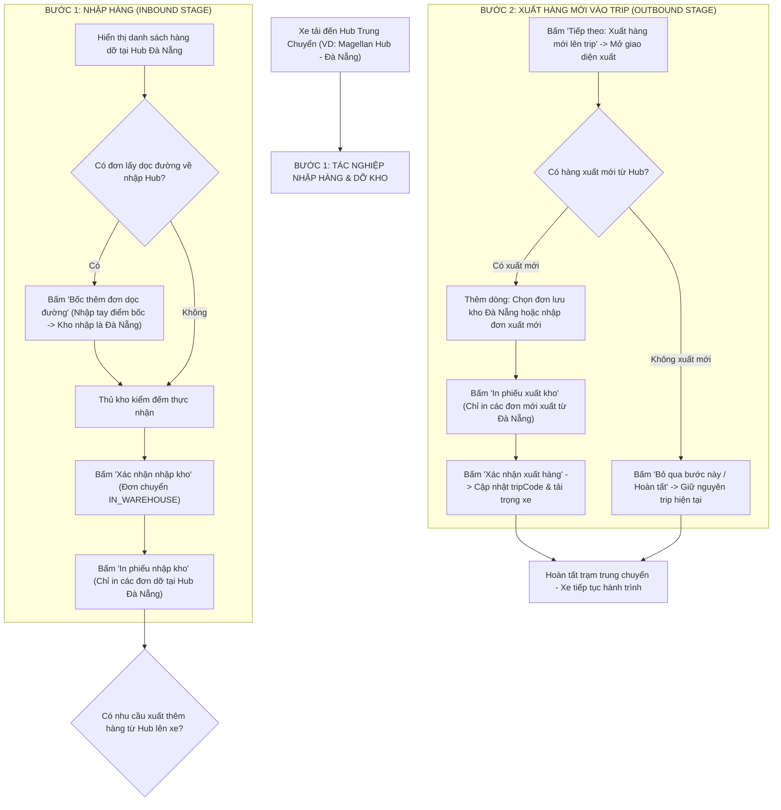

# Feedback 06/10 — Tổng hợp Toàn diện Tasks Vận hành Kho & Tối ưu Hạ tầng Logistics TMS

> **Thời gian ghi nhận**: 06/10/2026  
> **Người báo cáo**: @Thai (Quản lý nghiệp vụ / Vận hành) & @Antigravity Verification  
> **Phạm vi tác động**:  
> - Quản lý Nhập kho (`/warehouse/inbound`) ➔ Chi tiết chuyến xe & Kiểm đếm hàng hóa ([`WarehouseTripDetailModal`](file:///D:/Projects/logistics-website/frontend/src/features/warehouse/components/warehouse-trip-detail-modal.tsx))  
> - Popup Bốc thêm đơn lên xe ([`WarehouseAppendOrderModal`](file:///D:/Projects/logistics-website/frontend/src/features/warehouse/components/warehouse-append-order-modal.tsx))  
> - In phiếu kho ([`WarehouseInboundReceiptModal`](file:///D:/Projects/logistics-website/frontend/src/features/warehouse/components/warehouse-inbound-receipt-modal.tsx) / [`WarehouseOutboundReceiptModal`](file:///D:/Projects/logistics-website/frontend/src/features/warehouse/components/warehouse-outbound-receipt-modal.tsx))  
> - Quản lý Xuất kho & Chuyến xe trung chuyển ([`WarehouseOutboundTransferFlow`](file:///D:/Projects/logistics-website/frontend/src/features/warehouse/components/warehouse-outbound-transfer-flow.tsx) & [`trip-manifest.ts`](file:///D:/Projects/logistics-website/frontend/src/features/warehouse/api/trip-manifest.ts))  
> - Hạ tầng Cơ sở dữ liệu Neon PostgreSQL Singapore (`ap-southeast-1`), Backend API (NestJS 11+) & Frontend TMS (Next.js 15 App Router)  
> **Tài liệu tham chiếu**:  
> - `/leader` Business Domain Architecture ([`SKILL.md`](file:///D:/Projects/logistics-website/.agents/skills/leader/SKILL.md))  
> - Quy chế phát triển hệ thống [`AGENTS.md`](file:///D:/Projects/logistics-website/AGENTS.md)  
> - Quy chuẩn giao diện hẹp [`.agents/rules/ui-compact-density.md`](file:///D:/Projects/logistics-website/.agents/rules/ui-compact-density.md) & [`ui-spacing-guard`](file:///D:/Projects/logistics-website/.agents/skills/ui-spacing-guard/SKILL.md)  
> - Quy chuẩn kiểm soát kiện vận tải (No-SKU, Consignment Level)  
> **Ảnh minh chứng đính kèm trong thư mục**:  
> - [`screenshot_01.jpg`](file:///D:/Projects/logistics-website/feedback_06_10/screenshot_01.jpg): Chi tiết chuyến xe liên tỉnh `SD22` tại trạm kiểm đếm với các đơn dỡ tại kho và đơn trung chuyển đi kho khác, vị trí nút bấm trên bảng kê.  
> - [`boc_them_don_modal_overview.png`](file:///D:/Projects/logistics-website/feedback_06_10/boc_them_don_modal_overview.png): Toàn cảnh giao diện modal cũ khi gọi từ màn hình kiểm đếm nhập kho.  
> - [`dich_do_hang_kho_nhan_hien_id_3.png`](file:///D:/Projects/logistics-website/feedback_06_10/dich_do_hang_kho_nhan_hien_id_3.png): Lỗi hiển thị giao diện cũ (nhầm lẫn hướng luồng bốc/nhập và dropdown Base UI co rúm thành số `3`).  
> - [`01_verified_roadside_append_modal.png`](file:///D:/Projects/logistics-website/feedback_06_10/01_verified_roadside_append_modal.png): Giao diện chuẩn hóa đã xác minh cho luồng bốc dọc đường về nhập vào Hub hiện tại.  

---

## 📌 Bối cảnh nghiệp vụ thực tế (Chốt theo phản hồi người dùng)

### 1. Phản hồi gốc từ người dùng (@Thai)
> *"trường hợp thêm đơn từ Hub ĐN vào trip xuất phát từ HCM bữa mình chưa tính tới mà hệ thống nó đã làm ra rồi. CÒn cái bốc thêm dọc đường về nhập vào hub cùng chuyến trip thì chưa làm.*  
> *cái màn hình này sẽ khá phức tạp, mình sẽ kiểu như là thêm dòng, hoặc là xuất thêm, hoặc là nhập mới*  
> *1 cái trip đang có hàng trung chuyển đi các hub thì sẽ có 2 bước khi mở ra ở các hub trung chuyển:*  
> *- bấm ra lần đầu thì là nhập, nếu có thêm đơn lấy dọc đường về nhập ở Hub thì thêm dòng ở bước này => xác nhận nhập => in phiếu nhập kho => nút tiếp theo => xuất hàng mới vào trip nếu có (mở ra màn hình xuất)*  
> *=> nếu có xuất mới thì thêm dòng (nhập thông tin đơn hàng) => in phiếu xuất của các đơn mới và xác nhận, trip sẽ cập nhật thêm các đơn mới vào.*  
> *=> nếu không có xuất mới thì ấn nút bỏ qua. Trip không thay đổi các thông tin"*

---

### 2. Tình huống vận hành thực tế tại Hub trung chuyển (Quy trình tuần tự 2 bước)

Trong mạng lưới vận tải hàng hóa đường dài Bắc - Nam (Linehaul Inter-hub), một chuyến xe tải (ví dụ xe `29C12354` chuyến `SD22`) xuất phát từ `Andromeda Hub - HCM` đi `Polaris Hub - Hưng Yên`, trên lộ trình có ghé trạm trung chuyển `Magellan Hub - Đà Nẵng` và `Xe bo Tuyến Nghệ An`.

Khi xe dừng đỗ tại trạm trung chuyển Đà Nẵng, quy trình nghiệp vụ kho bãi thực tế diễn ra qua **2 bước tuần tự khép kín trên cùng một chuyến xe**:

---

### 3. Quy định chi tiết về trường thông tin & luồng xử lý theo từng bước

#### 🟢 BƯỚC 1: Tác nghiệp Nhập hàng & Dỡ kho (Inbound Unloading Stage)
1. **Trạng thái khởi tạo**: Khi thủ kho mở chi tiết một chuyến xe đang ghé trạm trung chuyển, modal mặc định mở ở **Bước 1: Nhập hàng (Kiểm đếm dỡ hàng)**.
2. **Cấu trúc bảng kê hàng hóa**:
   - **Nhóm dỡ tại kho này (`isForCurrentHub = true`)**: Ví dụ hàng từ HCM gửi về Đà Nẵng. Hiển thị checkbox kiểm đếm, số kiện dự kiến, ô nhập số kiện thực nhận, khối lượng và thể tích.
   - **Nhóm trung chuyển đi tiếp (`isForCurrentHub = false`)**: Ví dụ hàng từ HCM đi Nghệ An / Hưng Yên. Hiển thị dòng mờ xám với huy hiệu `(Đi kho khác)`, chế độ chỉ đọc (Read-only), hàng giữ nguyên trên thùng xe, không được phép dỡ xuống tồn kho Đà Nẵng.
3. **Phát sinh bốc thêm đơn dọc đường chở về nhập Hub (Roadside Inbound Pickup)**:
   - Dọc đường đi, tài xế ghé bốc thêm hàng của khách ngoài đường (Cây xăng Hòa Cầm, Ngã ba Trị An, Dọc QL1A...) chở về giao cho Hub Đà Nẵng.
   - Thủ kho bấm nút **"Bốc thêm đơn dọc đường về Hub"** ngay tại toolbar bảng kê Bước 1.
   - **Quy định các trường thông tin trên popup**:
     * **1. Điểm bốc dọc đường (Nơi bốc hàng)**: Input text **Nhập tay (Freetext) — Bắt buộc**. Người dùng tự do nhập địa danh lấy hàng ngoài đường (VD: `Cây xăng Hòa Cầm`, `Dọc QL1A Bình Định`...), tuyệt đối không ép chọn từ danh sách Hub nội bộ.
     * **2. Kho nhập hàng (Đích dỡ)**: Cố định là **Kho hiện tại của tài khoản thao tác** (Read-only, badge `[Kho hiện tại]`, ví dụ: `Magellan Hub - Đà Nẵng`).
     * **Điểm giao của khách (Địa chỉ giao hàng)**: Input text địa chỉ giao nhận tận nơi cho khách nhận cuối cùng.
     * **Tỉnh / Thành phố đích**: Chọn tỉnh/thành phố giao hàng.
     * **Quy chuẩn kiện hàng (No-SKU)**:
       - Mã vận đơn (Tùy chọn - để trống hệ thống tự cấp theo định dạng chuẩn).
       - Tên mặt hàng (Bắt buộc, VD: `Bạt cuộn`, `Hạt nhựa`, `May mặc`...).
       - Số kiện (Bắt buộc, $\ge 1$).
       - Khối lượng ($Kg$) & Thể tích ($m^3$).
       - Chứng từ đi kèm & Ghi chú vận hành.
   - Sau khi bấm `Xác nhận bốc lên xe`: Hệ thống tạo đơn hàng với `originHub = pickupAddress`, `originHubId = null`, `destinationHubId = currentHubId`, `status = 'IN_TRANSIT'`. Bảng kê kiểm đếm tự động làm mới và xuất hiện thêm dòng đơn này để thủ kho kiểm đếm dỡ hàng cùng đợt.
4. **Hành động kết thúc Bước 1**:
   - Bấm **"Xác nhận nhập kho"**: Cập nhật trạng thái các đơn dỡ xuống thành `IN_WAREHOUSE`, ghi nhận giao dịch kho `InventoryTransactionType.INBOUND`.
   - Bấm **"In phiếu nhập kho"**: Sinh Phiếu nhập kho chuẩn in A4/A5, **chỉ lọc và in các đơn hàng dỡ tại Hub hiện tại** (bao gồm cả đơn bốc dọc đường vừa nhập).
   - **Nút điều hướng tiếp theo**:
     * Nút **[Tiếp theo: Xuất hàng mới vào trip ➔]**: Chuyển giao diện sang Bước 2 (Xuất hàng).
     * Nút **[Bỏ qua xuất mới & Hoàn tất chuyến xe]**: Cho phép đóng modal và hoàn tất tác nghiệp trạm nếu Hub không có nhu cầu xuất thêm hàng.

---

#### 🔵 BƯỚC 2: Tác nghiệp Xuất hàng mới vào Trip (Outbound Loading Stage - Tùy chọn)
1. **Ngữ cảnh vận hành**: Sau khi đã dỡ xong các kiện hàng thuộc về Hub Đà Nẵng, thùng xe còn dung tích và tải trọng trống. Hub Đà Nẵng có sẵn các kiện hàng lưu kho cần chuyển tiếp ra phía Bắc (Polaris Hub - Hưng Yên, Tuyến Nghệ An). Thủ kho thực hiện xuất thêm hàng lên chuyến xe này.
2. **Trường hợp A: Có hàng xuất mới từ Hub**:
   - Thủ kho bấm nút **"Thêm dòng xuất hàng"** tại Toolbar Bước 2:
     * *Cách 1 (Chọn từ tồn kho)*: Mở popup chọn nhanh các đơn hàng đang lưu kho (`IN_WAREHOUSE`) tại Hub Đà Nẵng có đích đến trùng hoặc nằm trên lộ trình tiếp theo của chuyến xe.
     * *Cách 2 (Nhập đơn xuất mới)*: Điền thông tin đơn xuất mới phát sinh (Kho bốc = Kho hiện tại Đà Nẵng, Kho nhận = Chọn từ các trạm kế tiếp trên lộ trình chuyến xe).
   - Bấm **"In phiếu xuất kho"**: Sinh Phiếu xuất kho / Biên bản giao nhận vận chuyển, **chỉ lọc và in các đơn hàng vừa mới được bốc từ Hub này lên xe**.
   - Bấm **"Xác nhận xuất hàng lên trip"**: Hệ thống gán các đơn mới này vào `tripCode` hiện tại, chuyển trạng thái đơn sang `IN_TRANSIT`, cập nhật tổng số kiện, tải trọng và thể tích của chuyến xe.
3. **Trường hợp B: Không có hàng xuất mới từ Hub (Không xuất thêm hàng)**:
   - Nếu Hub hiện tại không có hàng cần gửi tiếp: Thủ kho bấm nút **[Bỏ qua bước này / Hoàn tất chuyến xe]**.
   - Hệ thống ghi nhận trạm trung chuyển hoàn thành, **chuyến xe giữ nguyên toàn bộ thông tin hàng hóa trung chuyển hiện có**, không thay đổi thông tin xuất, xe sẵn sàng rời trạm.

---

### 4. Kết quả đo đạc hạ tầng Database Singapore sau khi Migrate (Task Hiệu năng)

*(Đo kiểm độc lập qua giao thức PostgreSQL chuẩn libpq, 10 lượt truy vấn tuần tự)*

| Chỉ số đo kiểm | Sydney (`ap-southeast-2`) | Singapore (`ap-southeast-1`) | Mức độ cải thiện |
|---|---|---|---|
| **Thời gian thiết lập kết nối (TCP + SSL Handshake)** | **2,976.1 ms** (~3.0 s) | **398.9 ms** | 🚀 **Nhanh hơn 7.5 lần (Giảm 86.6%)** |
| **Độ trễ truy vấn cơ sở (`SELECT 1` Avg)** | **297.4 ms** | **62.4 ms** | 🚀 **Nhanh hơn 4.8 lần (Giảm 79.0%)** |
| **Độ trễ truy vấn cơ sở (`SELECT 1` Min - Max)** | 296.8 ms - 297.8 ms | 60.5 ms - 64.3 ms | Ổn định, biên độ dao động cực thấp (< 4ms) |
| **Truy vấn danh mục bảng hệ thống (149 tables)** | **389.9 ms** | **64.4 ms** | 🚀 **Nhanh hơn 6.0 lần (Giảm 83.5%)** |

Đo đạc API thực tế trên môi trường Render Dev (`logistics-website-backend-1jho`) và Pro (`logistics-website-backend-1`):
- `/api/v1/auth/email/login`: `789.6 ms` (Dev) / `816.0 ms` (Pro).
- `/api/v1/hubs`: `157.4 ms` (Dev) / `125.9 ms` (Pro).
- `/api/v1/warehouse/inbound-trips`: `428.5 ms` (Dev) / **1,069.5 ms** (Pro - cần tối ưu câu query aggregation).
- `/api/v1/orders`: `198.8 ms` (Dev) / `100.4 ms` (Pro).
- `/api/v1/vehicles`: `113.2 ms` (Dev) / `108.4 ms` (Pro).

---

## 🔍 Tổng hợp các điểm chưa đúng trên hệ thống cần khắc phục

1. **Đứt gãy quy trình tác nghiệp 2 bước tại Hub trung chuyển** (Đối chiếu [`screenshot_01.jpg`](file:///D:/Projects/logistics-website/feedback_06_10/screenshot_01.jpg)):
   - Modal [`WarehouseTripDetailModal`](file:///D:/Projects/logistics-website/frontend/src/features/warehouse/components/warehouse-trip-detail-modal.tsx) thiết kế đóng khung là một màn hình kiểm đếm dỡ hàng đơn lập. Sau khi bấm "Xác nhận nhập kho", không có nút điều hướng chuyển tiếp sang pha xuất hàng mới cho chính chuyến xe đó.
   - Thủ kho buộc phải đóng modal, chuyển sang trang Quản lý Xuất kho hoặc tìm kiếm lại chuyến xe từ đầu để gán đơn xuất, gây mất thời gian và dễ nhầm lẫn chuyến xe.
2. **Trùng lặp 2 nút "Bốc thêm đơn" trên cùng một màn hình** (Đối chiếu [`screenshot_01.jpg`](file:///D:/Projects/logistics-website/feedback_06_10/screenshot_01.jpg)):
   - Nút `+ Bốc thêm đơn` xuất hiện ở Header góc trên bên phải (cạnh nút `In phiếu nhập`) và một nút khác `+ Bốc thêm đơn lên xe` lại xuất hiện ở Toolbar bảng kê hàng hóa.
   - Cần tinh gọn chỉ giữ 1 nút duy nhất tại Toolbar bảng kê tương ứng với từng bước:
     * Tại Bước 1: `<Button><IconPlus /> Bốc thêm đơn dọc đường về Hub</Button>`.
     * Tại Bước 2: `<Button><IconPlus /> Thêm đơn xuất từ kho lên xe</Button>`.
3. **Nhầm lẫn hướng luồng bốc/nhập trên modal cũ** (Đối chiếu [`boc_them_don_modal_overview.png`](file:///D:/Projects/logistics-website/feedback_06_10/boc_them_don_modal_overview.png) & [`dich_do_hang_kho_nhan_hien_id_3.png`](file:///D:/Projects/logistics-website/feedback_06_10/dich_do_hang_kho_nhan_hien_id_3.png)):
   - Popup cũ hiển thị `1. Nơi bốc hàng (Kho hiện tại): Magellan Hub - Đà Nẵng` ➔ `2. Đích dỡ hàng (Kho nhận): Dropdown`.
   - Khi mở từ màn hình kiểm đếm nhập kho, hàng bốc thêm là hàng tài xế nhận dọc đường chở về giao cho Hub hiện tại (`Điểm bốc dọc đường ➔ Kho nhập hàng: Magellan Hub`). Việc đảo ngược luồng khiến thủ kho không thể nhập nơi bốc tự do dọc đường.
4. **Dropdown "Đích dỡ hàng" bị co rúm thành số `3`** (Đối chiếu [`dich_do_hang_kho_nhan_hien_id_3.png`](file:///D:/Projects/logistics-website/feedback_06_10/dich_do_hang_kho_nhan_hien_id_3.png)):
   - Ô chọn Hub bị lỗi Base UI select, co cụm thành một ô vuông nhỏ render text `3 [^v]` (ID của kho trong database) thay vì hiển thị tên Hub đầy đủ.
   - Khắc phục: Trong luồng bốc dọc đường về Hub hiện tại, trường kho nhập được cố định dạng Read-only badge `{currentHubName} [Kho hiện tại]`, loại bỏ hoàn toàn dropdown lỗi này (đã kiểm chứng tại [`01_verified_roadside_append_modal.png`](file:///D:/Projects/logistics-website/feedback_06_10/01_verified_roadside_append_modal.png)).
5. **Phiếu in chưa tách biệt giữa hàng dỡ xuống và hàng mới xuất lên**:
   - Nút `In phiếu nhập` cũ nếu bấm khi chưa lọc sẽ có nguy cơ in cả các đơn trung chuyển không thuộc kho hoặc in lẫn đơn xuất.
   - Tách biệt hoàn toàn:
     * Bước 1: Phiếu nhập kho chỉ in các đơn dỡ xuống tại Hub (`isForCurrentHub = true` hoặc `destinationHubId = currentHubId`).
     * Bước 2: Phiếu xuất kho chỉ in các đơn mới xuất từ Hub lên xe (`originHubId = currentHubId`).
6. **Điểm nghẽn tính toán aggregation trên API `inbound-trips` (> 1s trên Pro)**:
   - Cần tối ưu câu truy vấn gom nhóm tập trung (SQL `GROUP BY` / CTE Subquery) hoặc View có index để giảm từ 1.069ms xuống dưới 300ms.

---

## 📋 Danh sách công việc triển khai (Action Checklist)

### 🎯 PHẦN I: CÁC HẠNG MỤC ĐÃ HOÀN THÀNH TRONG ĐỢT ĐẦU 06/10 (8/8 TASKS) ✅

- [x] **Cập nhật DTO `AppendOrderToTripDto`**:
  - `pickupAddress`: Bắt buộc nhập, mô tả nơi tài xế lấy hàng dọc đường.
  - `destinationHubId`: Tùy chọn, mặc định lấy kho hiện tại của người thao tác (`userWithHub.hubId`).
  - `deliveryAddress`: Điểm giao hàng cho khách.
- [x] **Cập nhật Logic `appendOrderToTrip` trong `WarehouseService`**:
  - Gán `originHub`: Điểm bốc dọc đường do người dùng nhập.
  - Gán `originHubId`: `null` (do lấy dọc đường, không phải Hub nội bộ).
  - Gán `destinationHubId`: `userWithHub.hubId` (Kho hiện tại nhập hàng).
  - Gán `destinationHub`: `userWithHub.hub.name`.
  - Tạo `TripEntity` liên kết vào `tripCode` hiện tại với `destinationHubId = userWithHub.hubId`.
  - Upsert `TripStopEntity` cho kho hiện tại.
- [x] **Thiết kế lại Modal `WarehouseAppendOrderModal` theo chuẩn mới**:
  - Khung lộ trình đơn hàng: Điểm bốc dọc đường (nhập tay) ➔ Kho nhập hàng `{currentHubName} [Kho hiện tại]`, triệt tiêu lỗi ID `3`.
  - Khối thông tin kiện hàng chuẩn No-SKU (Mã đơn tự cấp, Tên hàng, Số kiện, Khối lượng, Thể tích, Chứng từ, Ghi chú).
- [x] **Làm mới bảng kê sau khi thêm thành công**:
  - Trigger `refetchManifest()` để dòng đơn mới xuất hiện ngay với cờ `isForCurrentHub = true`.
- [x] **Tinh gọn nút bấm trong `WarehouseTripDetailModal`**:
  - Giữ lại 1 nút bấm duy nhất trên Toolbar bảng kê hàng hóa, loại bỏ nút trùng lặp ở Header trên cùng bên phải.
- [x] **Kiểm tra biên dịch & Linting toàn dự án**: Backend & Frontend build PASS (0 errors).

---

### 🚀 PHẦN II: TỐI ƯU HẠ TẦNG DATABASE SINGAPORE & HIỆU NĂNG HỆ THỐNG

#### 1. Backend (`backend/`)
- [x] **Đồng bộ chuỗi kết nối Neon Singapore Pooler**:
  - Đảm bảo biến môi trường `DATABASE_URL` trên Render Dev (`logistics-website-backend-1jho`), Render Pro (`logistics-website-backend-1`) và các công cụ runner sử dụng endpoint có `-pooler` thuộc region `ap-southeast-1.aws.neon.tech`.
- [x] **Cấu hình tối ưu Connection Pool trong `TypeOrmConfigService`**:
  - Bổ sung cấu hình `extra` cho `node-postgres`: `statement_timeout: 10000`, `idleTimeoutMillis: 30000`, `connectionTimeoutMillis: 5000`, `keepConnectionAlive: true`.
- [x] **Chuẩn hóa Endpoint Health Check**:
  - Bổ sung route alias cho `@Get('health')` và `@Get('api/v1/health')` trong `HomeController`, trả về `{ status: 'ok', region: 'ap-southeast-1', uptime: process.uptime(), timestamp: ... }`.
- [x] **Tối ưu hóa câu truy vấn `inbound-trips` trong `WarehouseService`**:
  - Tái cấu trúc logic lấy danh sách chuyến xe nhập kho: thay thế subquery N+1 bằng `LEFT JOIN` với bảng tổng hợp kiện hàng, đẩy việc tính `SUM(quantity)`, `SUM(weight)`, `SUM(volume)` trực tiếp xuống PostgreSQL engine.
  - Tận dụng chỉ mục trên `trips`, `trip_stops` và `orders`.

#### 2. Frontend (`frontend/`)
- [x] **Tối ưu bộ nhớ đệm TanStack Query v5 cho các màn hình vận hành kho**:
  - Thiết lập `staleTime: 30 * 1000` (30 giây) và `gcTime: 5 * 60 * 1000` (5 phút) cho các query `inbound-trips`, `outbound-trips`, `orders` và `hubs`.
  - Giữ dữ liệu trong cache khi chuyển đổi giữa các tab trạng thái để loại bỏ hoàn toàn hiện tượng nhấp nháy giao diện.
- [x] **Áp dụng triệt để Optimistic Updates cho các thao tác kho**:
  - Tuân thủ skill `tanstack-optimistic-updates`: Giao diện cập nhật ngay lập tức (0ms latency), tự động rollback an toàn nếu API phản hồi lỗi.

---

### 📦 PHẦN III: QUY TRÌNH TÁC NGHIỆP 2 BƯỚC TẠI HUB TRUNG CHUYỂN (TRỌNG TÂM NGHIỆP VỤ)

#### 1. Backend (`backend/`)
- [x] **Nâng cấp DTO `AppendOrderToTripDto` ([`append-order-to-trip.dto.ts`](file:///D:/Projects/logistics-website/backend/src/orders/dto/append-order-to-trip.dto.ts))**:
  - Bổ sung trường `appendMode`: Enum `'ROADSIDE_INBOUND' | 'HUB_OUTBOUND'` (mặc định `'ROADSIDE_INBOUND'`).
  - Trường `pickupAddress`: Bắt buộc nhập khi `ROADSIDE_INBOUND` (Điểm bốc tự do dọc đường); tùy chọn khi `HUB_OUTBOUND`.
  - Trường `originHubId`: `null` khi `ROADSIDE_INBOUND`; tự động lấy ID kho thao tác khi `HUB_OUTBOUND`.
  - Trường `destinationHubId`: Cố định bằng ID kho thao tác khi `ROADSIDE_INBOUND`; bắt buộc chọn Hub tiếp theo trên lộ trình chuyến xe khi `HUB_OUTBOUND`.
  - Validation logic: Khi `HUB_OUTBOUND`, kiểm tra `destinationHubId` phải nằm trong các trạm dừng tiếp theo của chuyến xe (`TripStopEntity`), ngăn chặn chọn ngược tuyến.
- [x] **Hoàn thiện logic `appendOrderToTrip` trong `WarehouseService` ([`warehouse.service.ts`](file:///D:/Projects/logistics-website/backend/src/orders/warehouse.service.ts))**:
  - **Nhánh `ROADSIDE_INBOUND`**:
    * Gán `originHub`: Tên điểm bốc dọc đường do người dùng nhập tay (`dto.pickupAddress`).
    * Gán `originHubId`: `null`.
    * Gán `destinationHubId`: `userWithHub.hubId` (Kho hiện tại dỡ hàng).
    * Gán `destinationHub`: `userWithHub.hub.name`.
    * Gán `status`: `IN_TRANSIT`.
    * Gán `currentTripCode`: `tripCode`.
    * Ghi nhận `OrderInventoryTransactionEntity` (type: `TRANSFER`, ghi chú bốc dọc đường).
  - **Nhánh `HUB_OUTBOUND`**:
    * Gán `originHubId`: `userWithHub.hubId` (Kho hiện tại xuất hàng).
    * Gán `originHub`: `userWithHub.hub.name`.
    * Gán `destinationHubId`: `dto.destinationHubId` (Hub đích được chọn).
    * Gán `destinationHub`: Tên Hub đích.
    * Gán `status`: `IN_TRANSIT`.
    * Tạo liên kết `TripEntity` mới vào `tripCode` hiện tại.
    * Ghi nhận `OrderInventoryTransactionEntity` (type: `TRANSFER`, xuất từ kho lên xe).
- [x] **Bổ sung API hỗ trợ lấy danh sách đơn lưu kho khả dụng để xuất lên xe**:
  - Endpoint `GET /api/v1/warehouse/trips/:tripCode/available-outbound-orders`:
    * Query các đơn hàng đang lưu tại kho hiện tại (`status = 'IN_WAREHOUSE'` và `currentHubId = userWithHub.hubId`).
    * Lọc các đơn có `destinationHubId` thuộc các trạm tiếp theo của chuyến xe.
    * Trả về danh sách đơn hàng sẵn sàng xuất lên xe.
- [x] **Bổ sung API cập nhật tiến trình trạm trung chuyển (Transit Stop Lifecycle)**:
  - Endpoint `POST /api/v1/warehouse/trips/:tripCode/transit-step`:
    * Nhận payload `{ step: 'INBOUND' | 'OUTBOUND', action: 'CONFIRM' | 'SKIP' }`.
    * Đánh dấu hoàn thành bước kiểm đếm nhập hoặc bước xuất hàng tại trạm dừng hiện tại.

#### 2. Frontend (`frontend/`)
- [x] **Tái cấu trúc Modal `WarehouseTripDetailModal` ([`warehouse-trip-detail-modal.tsx`](file:///D:/Projects/logistics-website/frontend/src/features/warehouse/components/warehouse-trip-detail-modal.tsx)) theo quy trình 2 bước**:
  - **Thanh tiến trình 2 bước (Stepper Bar)** đặt ngay dưới Header:
    * `[1. Nhập hàng & Dỡ kho]` (Active / Done) ➔ `[2. Xuất hàng mới lên xe (Tùy chọn)]` (Pending / Active / Skipped).
  - **Giao diện Bước 1: Nhập hàng (Inbound Stage)**:
    * Bảng kê phân tách: Hàng dỡ tại Hub (có checkbox kiểm đếm, số kiện thực nhận) vs Hàng đi kho khác (dòng mờ chỉ đọc).
    * Toolbar bảng kê: Nút `<Button><IconPlus /> Bốc thêm đơn dọc đường về Hub</Button>` mở popup ở chế độ `ROADSIDE_INBOUND`.
    * Loại bỏ nút `+ Bốc thêm đơn` trùng lặp ở Header trên cùng bên phải.
    * Footer Bước 1:
      - Nút `<Button><IconPrinter /> In phiếu nhập kho</Button>`: In phiếu cho các đơn dỡ tại Hub.
      - Nút `<Button><IconCircleCheck /> Xác nhận nhập kho ({count} dòng)</Button>`: Chốt dỡ hàng vào tồn kho.
      - Nút chuyển bước chính: `<Button variant="default"><IconArrowRight /> Tiếp theo: Xuất hàng mới vào trip</Button>` ➔ Chuyển sang Bước 2.
      - Nút bỏ qua: `<Button variant="outline">Bỏ qua xuất mới & Hoàn tất chuyến xe</Button>` ➔ Hoàn tất trạm và đóng modal.
  - **Giao diện Bước 2: Xuất hàng mới vào Trip (Outbound Stage)**:
    * Hiển thị bảng tổng hợp:
      - Danh sách các đơn hàng tiếp tục đi trên xe (hàng trung chuyển từ các trạm trước).
      - Danh sách các đơn hàng mới bốc từ Hub hiện tại lên xe.
    * Toolbar bảng kê:
      - Nút `<Button><IconPlus /> Thêm đơn xuất từ kho lên xe</Button>`: Mở modal chọn từ tồn kho hoặc tạo đơn xuất mới (`mode = 'HUB_OUTBOUND'`).
    * Footer Bước 2:
      - Nút `<Button><IconPrinter /> In phiếu xuất kho</Button>`: Chỉ in các đơn mới xuất từ Hub này lên xe.
      - Nút `<Button variant="default"><IconDeviceFloppy /> Xác nhận xuất hàng lên trip</Button>`: Ghi nhận đơn mới vào chuyến xe.
      - Nút `<Button variant="ghost">Bỏ qua bước này (Không xuất thêm)</Button>`: Hoàn tất chuyến xe mà không thay đổi đơn xuất.
- [x] **Nâng cấp `WarehouseAppendOrderModal` ([`warehouse-append-order-modal.tsx`](file:///D:/Projects/logistics-website/frontend/src/features/warehouse/components/warehouse-append-order-modal.tsx)) hỗ trợ 2 chế độ**:
  - Prop `mode?: 'ROADSIDE_INBOUND' | 'HUB_OUTBOUND'`.
  - Chế độ `ROADSIDE_INBOUND` (Mở từ Bước 1):
    * Tiêu đề: `Bốc thêm đơn dọc đường về nhập Hub {currentHubName}`.
    * Nơi bốc: Input text Freetext (Bắt buộc) — Placeholder: `VD: Cây xăng Hòa Cầm, Ngã 3 Trị An, Dọc QL1A...`.
    * Kho nhập: Badge cố định `[Kho hiện tại] {currentHubName}`.
    * Điểm giao của khách: Input text địa chỉ giao nhận khách cuối.
  - Chế độ `HUB_OUTBOUND` (Mở từ Bước 2):
    * Tiêu đề: `Bốc thêm đơn từ Hub {currentHubName} lên chuyến xe {tripCode}`.
    * Kho bốc: Badge cố định `[Kho hiện tại] {currentHubName}`.
    * Kho nhận: Dropdown chọn các trạm kế tiếp trên lộ trình của xe (loại trừ kho hiện tại, render tên Hub rõ ràng, triệt tiêu lỗi ID số `3`).
- [x] **Chuẩn hóa in phiếu trong `WarehouseInboundReceiptModal` & `WarehouseOutboundReceiptModal`**:
  - `WarehouseInboundReceiptModal`: Chỉ filter các đơn `isForCurrentHub = true` hoặc `destinationHubId = currentHubId`.
  - `WarehouseOutboundReceiptModal`: Chỉ filter các đơn xuất phát từ Hub hiện tại (`originHubId = currentHubId` được gán vào chuyến xe này).
- [x] **Tuân thủ nghiêm ngặt Quy chuẩn giao diện hẹp (UI Compact Density Mandate)**:
  - Card/Container: Padding siêu gọn `p-1` hoặc `p-2`.
  - Modal Body: Padding `p-2` (tối đa `p-2.5`), `overflow-y-auto max-h-[85vh]`.
  - Khoảng cách phần tử: Tối đa `gap-1.5` đến `gap-2`, `space-y-1.5` đến `space-y-2`.
  - Bảng dữ liệu: Typography `text-[10px]`, mã đơn `text-[11px] font-mono font-bold`, chiều cao dòng ~26px (`py-1 px-1.5`).
  - Footer hành động: `sticky bottom-0 bg-white dark:bg-slate-900 border-t p-1.5`.
  - Zero redundant icons: Triệt tiêu mọi icon/ký tự trùng lặp (`<Button><IconPlus /> Thêm dòng</Button>`).

#### 3. Kiểm thử & Nghiệm thu (Definition of Done)
- [x] **Kiểm tra biên dịch & Linting**:
  - Type check backend: `npm run lint --prefix backend` & `npm run build --prefix backend` PASS (0 errors).
  - Type check frontend: `npm run build --prefix frontend` PASS (Next.js Turbopack compiled successfully, TypeScript passed, 33/33 static pages generated, 0 errors).
- [x] **Kịch bản kiểm thử nghiệp vụ thực tế (Manual & E2E Verification)**:
  - **Kịch bản 1: Luồng chuẩn 2 bước (Có bốc dọc đường + Có xuất mới)**:
    1. Đăng nhập tài khoản thủ kho Đà Nẵng (`Magellan Hub - Đà Nẵng`).
    2. Mở chuyến xe trung chuyển `SD22` (từ HCM đi Hưng Yên qua Đà Nẵng).
    3. Tại Bước 1 (Nhập hàng): Bấm `Bốc thêm đơn dọc đường` ➔ Nhập điểm bốc `Cây xăng Hòa Cầm`, hàng `5 kiện - 120kg` ➔ Bấm lưu ➔ Đơn xuất hiện trên bảng dỡ hàng Đà Nẵng.
    4. Tích chọn kiểm đếm ➔ Bấm `Xác nhận nhập kho` ➔ Bấm `In phiếu nhập kho` (kiểm tra phiếu chỉ có đơn dỡ tại Đà Nẵng và đơn bốc dọc đường).
    5. Bấm nút `Tiếp theo: Xuất hàng mới vào trip ➔` ➔ Giao diện chuyển mượt mà sang Bước 2.
    6. Tại Bước 2: Bấm `Thêm đơn xuất từ kho lên xe` ➔ Chọn đơn gửi ra Hưng Yên ➔ Bấm `In phiếu xuất kho` (kiểm tra phiếu chỉ có đơn xuất mới) ➔ Bấm `Xác nhận xuất hàng lên trip`.
    7. Chuyến xe cập nhật đủ số kiện mới, đóng modal thành công.
  - **Kịch bản 2: Luồng bỏ qua xuất mới (Không có hàng xuất từ Hub)**:
    1. Mở chuyến xe `SD22` tại Đà Nẵng.
    2. Hoàn tất kiểm đếm dỡ hàng ở Bước 1.
    3. Bấm nút `Bỏ qua xuất mới & Hoàn tất chuyến xe`.
    4. Modal đóng lại, chuyến xe được ghi nhận đã xử lý xong trạm Đà Nẵng, dữ liệu hàng hóa trên chuyến xe không bị xáo trộn.
  - **Kịch bản 3: Chuyến xe không có hàng dỡ tại Hub (Chỉ ghé trạm để xuất thêm)**:
    1. Mở chuyến xe chỉ chở hàng đi Hưng Yên (không có kiện dỡ tại Đà Nẵng).
    2. Bước 1 hiển thị 0 đơn cần dỡ. Bấm ngay `Tiếp theo: Xuất hàng mới vào trip ➔`.
    3. Thực hiện bốc thêm hàng từ Đà Nẵng đi Hưng Yên ở Bước 2 như bình thường.
