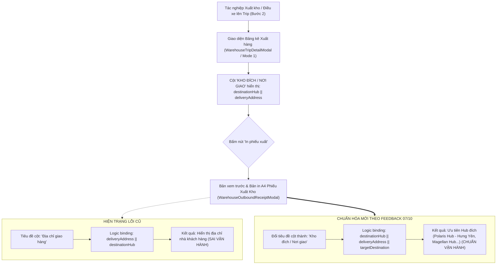

# Feedback 07/10 — Chuẩn hóa Cột "Kho Đích / Nơi Giao" trên Phiếu Xuất Kho & Đồng bộ Giao diện Điều xe

> **Thời gian ghi nhận**: 07/10/2026  
> **Người báo cáo**: @Thai (Quản lý nghiệp vụ / Vận hành) & @Antigravity TMS Lead  
> **Phạm vi tác động**:  
> - Phiếu Xuất Kho in ấn & xem trước ([`WarehouseOutboundReceiptModal`](file:///D:/Projects/logistics-website/frontend/src/features/warehouse/components/warehouse-outbound-receipt-modal.tsx))  
> - Modal Chi tiết Chuyến xe & Điều xe Xuất kho Bước 2 ([`WarehouseTripDetailModal`](file:///D:/Projects/logistics-website/frontend/src/features/warehouse/components/warehouse-trip-detail-modal.tsx))  
> - Bảng Quản lý Xuất kho & Thao tác in phiếu xuất theo xe ([`dashboard/warehouse/outbound/page.tsx`](file:///D:/Projects/logistics-website/frontend/src/app/dashboard/warehouse/outbound/page.tsx))  
> - Giao diện Tạo phiếu xuất kho Mode 1 ([`WarehouseEditableGrid`](file:///D:/Projects/logistics-website/frontend/src/features/warehouse/components/warehouse-editable-grid.tsx))  
> - Backend Warehouse Service & Trip Manifest API ([`warehouse.service.ts`](file:///D:/Projects/logistics-website/backend/src/orders/warehouse.service.ts))  
> **Tài liệu tham chiếu**:  
> - `/leader` Business Domain Architecture ([`SKILL.md`](file:///D:/Projects/logistics-website/.agents/skills/leader/SKILL.md))  
> - Quy chế phát triển hệ thống [`AGENTS.md`](file:///D:/Projects/logistics-website/AGENTS.md)  
> - Quy chuẩn giao diện hẹp [`.agents/rules/ui-compact-density.md`](file:///D:/Projects/logistics-website/.agents/rules/ui-compact-density.md) & [`ui-spacing-guard`](file:///D:/Projects/logistics-website/.agents/skills/ui-spacing-guard/SKILL.md)  
> - Quy chuẩn kiểm soát kiện vận tải (No-SKU, Consignment Level)  
> **Ảnh minh chứng đính kèm trong thư mục**:  
> - [`screenshot_01.jpg`](file:///D:/Projects/logistics-website/feedback_07_10/screenshot_01.jpg): Giao diện tạo phiếu xuất / điều xe xuất kho (`Bước 2: Xuất hàng mới lên xe đi trạm kế tiếp` trên modal Chuyến xe `SD62`), người dùng khoanh đỏ cột **`KHO ĐÍCH / NƠI GIAO`** với các giá trị: `Polaris Hub - Hưng Yên`, `Magellan Hub - Đà Nẵng`, `Xe bo Tuyến Khánh Hòa`.  
> - Tham chiếu mẫu cấu trúc chuẩn: [`feedback_06_10/TODO.md`](file:///D:/Projects/logistics-website/feedback_06_10/TODO.md)

---

## 📌 Bối cảnh nghiệp vụ thực tế (Chốt theo phản hồi người dùng)

### 1. Phản hồi gốc từ người dùng (@Thai)
> *"cột địa chỉ giao của phiếu xuất kho đang hiển thị thông tin địa chỉ của khách hàng. Sửa lại phần hiển thị của cột địa chỉ giao của phiếu xuất kho giống với thông tin địa chỉ giao trong giao diện tạo phiếu xuất"*

---

### 2. Tình huống vận hành thực tế tại Hub xuất hàng & Trạm trung chuyển

Trong mạng lưới vận tải hàng hóa đường dài Bắc - Nam (Linehaul Inter-hub) và phân phối chặng cuối (Last-mile Delivery) của hệ thống Logistics TMS (Spider Express):

1. **Bản chất của Phiếu Xuất Kho (Outbound Receipt / Biên bản bàn giao vận chuyển theo xe)**:
   - Khi xe tải bốc hàng rời kho xuất phát đi trạm kế tiếp (ví dụ xe `43H00001` chuyến `SD62` xuất phát từ `Andromeda Hub - HCM`), thủ kho in **Phiếu Xuất Kho** bàn giao cho tài xế và lưu trữ hồ sơ xuất kho tại Hub.
   - Tài xế xe đường dài và thủ kho tại các trạm trung chuyển kế tiếp cần nắm rõ **Hàng hóa này được chở đến trạm/kho nào tiếp theo** (Kho đích trung chuyển / Hub cấp 1 / Điểm tập kết tuyến xe bo), ví dụ:
     * Đơn `TEST-TR-HY01` ➔ Chở ra giao cho `Polaris Hub - Hưng Yên`.
     * Đơn `TEST-TR-XEBO` ➔ Chở ra dỡ tại `Magellan Hub - Đà Nẵng`.
     * Đơn `TETS-TR-DN` ➔ Chở ra giao cho trạm trung chuyển `Xe bo Tuyến Khánh Hòa`.
   - **Tuyệt đối không hiển thị địa chỉ nhà riêng của khách hàng cuối** (ví dụ: *"Số 123 Đường ABC, Phường X, Quận Y..."*) trên cột bàn giao của chuyến xe luân chuyển trung chuyển liên Hub, bởi vì tài xế xe tải đường dài không đi giao tận nhà khách hàng mà chỉ chở hàng từ Hub xuất đến Hub đích / Điểm trung chuyển. Việc in địa chỉ nhà khách hàng gây nhầm lẫn nghiêm trọng cho tài xế và thủ kho các trạm dọc đường.

2. **Trường hợp xuất giao khách lẻ trực tiếp (`DIRECT_CUSTOMER`)**:
   - Chỉ khi đơn hàng là đơn giao thẳng tận nơi cho khách (không qua Hub trung chuyển nội bộ, `destinationHubId = null`), thì cột này mới hiển thị địa chỉ giao tận nơi của khách hàng (`deliveryAddress`).

3. **Nguyên tắc đồng bộ 100% giữa Giao diện tạo phiếu xuất và Bản in Phiếu xuất kho**:
   - Tại màn hình tạo phiếu xuất / điều xe xuất kho Bước 2 ([`WarehouseTripDetailModal`](file:///D:/Projects/logistics-website/frontend/src/features/warehouse/components/warehouse-trip-detail-modal.tsx)), cột thông tin đã hiển thị rất chuẩn mực và trực quan:
     * Tiêu đề cột: **`KHO ĐÍCH / NƠI GIAO`**
     * Thứ tự ưu tiên hiển thị: `destinationHub || deliveryAddress || 'Chưa xác định'`
   - Tuy nhiên, khi bấm nút **"In phiếu xuất"** (góc trên bên phải modal Bước 2) hoặc mở popup Phiếu xuất kho ([`WarehouseOutboundReceiptModal`](file:///D:/Projects/logistics-website/frontend/src/features/warehouse/components/warehouse-outbound-receipt-modal.tsx)):
     * Tiêu đề cột bị lệch thành: `Địa chỉ giao hàng`
     * Thứ tự binding dữ liệu bị **đảo ngược lỗi**: `deliveryAddress || destinationHub`, dẫn đến nếu đơn có địa chỉ khách hàng thì phiếu xuất sẽ hiển thị đè địa chỉ khách hàng thay vì Hub đích.
   - Cần chuẩn hóa đồng bộ toàn diện trên cả 3 tầng: Backend API DTO/Manifest ➔ State/Handler chuyển đổi dữ liệu ➔ UI Modal xem trước & Bản in A4 Phiếu xuất kho.



---

## 🔍 Tổng hợp các điểm chưa đúng trên giao diện cũ (Đối chiếu minh chứng)

Đối chiếu trực tiếp với ảnh chụp màn hình [`screenshot_01.jpg`](file:///D:/Projects/logistics-website/feedback_07_10/screenshot_01.jpg) do người dùng cung cấp:

1. **Lệch pha logic binding dữ liệu giữa Bảng kê Bước 2 và Hàm in phiếu xuất** ([`WarehouseTripDetailModal.tsx`](file:///D:/Projects/logistics-website/frontend/src/features/warehouse/components/warehouse-trip-detail-modal.tsx)):
   - **Trên bảng kê hiển thị Bước 2** (Dòng 1206–1208):
     ```tsx
     <td className='py-1 px-1.5 text-slate-700 dark:text-slate-300 font-semibold'>
       {l.destinationHub || l.deliveryAddress || 'Chưa xác định'}
     </td>
     ```
     -> Ưu tiên `l.destinationHub` trước, nên hiển thị đúng: `Polaris Hub - Hưng Yên`, `Magellan Hub - Đà Nẵng`, `Xe bo Tuyến Khánh Hòa`.
   - **Trong hàm chuẩn bị dữ liệu in `handlePrintReceipt`** (Dòng 162):
     ```tsx
     deliveryAddress: l.deliveryAddress || l.destinationHub || '—',
     ```
     -> **Đảo ngược thứ tự**: `l.deliveryAddress` được gán trước! Do đó, khi đơn hàng có chuỗi địa chỉ khách hàng (từ route hoặc DTO tạo đơn), biến `deliveryAddress` bị gán địa chỉ khách thay vì Hub đích.

2. **Lỗi đảo ngược thứ tự fallback trong Bảng Quản lý Xuất kho** ([`dashboard/warehouse/outbound/page.tsx`](file:///D:/Projects/logistics-website/frontend/src/app/dashboard/warehouse/outbound/page.tsx)):
   - Tại `handleOpenReceiptForVehicle` (Dòng 876):
     ```tsx
     deliveryAddress: o.deliveryAddress || o.destinationHub || dest,
     ```
   - Tại `handlePrintOrderReceipt` (Dòng 965 & 980):
     ```tsx
     deliveryAddress: o.deliveryAddress || o.destinationHub || '',
     ```
     -> Cả hai hàm chuẩn bị dữ liệu in đều ưu tiên `o.deliveryAddress` (địa chỉ khách) thay vì `o.destinationHub` / `o.destinationHubEntity?.name`.

3. **Tiêu đề cột và fallback binding bên trong Modal Phiếu Xuất Kho chưa chuẩn** ([`warehouse-outbound-receipt-modal.tsx`](file:///D:/Projects/logistics-website/frontend/src/features/warehouse/components/warehouse-outbound-receipt-modal.tsx)):
   - Dòng 102–103:
     ```tsx
     const deliveryAddress =
       data.deliveryAddress || data.destinationHub || (isTransfer ? 'Kho luân chuyển' : '—');
     ```
     -> Ưu tiên `data.deliveryAddress` trước `data.destinationHub`.
   - Interface `OutboundReceiptItem` (Dòng 23–32) thiếu trường `destinationHub?: string;`.
   - Dòng 279 (Bản in HTML A4) và Dòng 538 (Paper Preview): Tiêu đề cột vẫn là `Địa chỉ giao hàng` thay vì `Kho đích / Nơi giao` như trên giao diện tạo xuất Bước 2.
   - Dòng 296 và 558: Table cell render `${it.deliveryAddress || deliveryAddress}` thay vì ưu tiên `${it.destinationHub || it.deliveryAddress || targetDestination}`.

4. **Đồng bộ hóa dữ liệu Trip Manifest phía Backend** ([`warehouse.service.ts`](file:///D:/Projects/logistics-website/backend/src/orders/warehouse.service.ts)):
   - Dòng 3098–3102 trong `getTripManifest`:
     ```typescript
     deliveryAddress:
       deliveryAddress ||
       o.destinationHub ||
       o.destinationHubEntity?.name ||
       '',
     ```
     Nếu `o.route` có chuỗi `"A → B"` thì `deliveryAddress` bị gán bằng `parts[1]` (địa chỉ khách). Cần đảm bảo trường `destinationHub` luôn được trả về nguyên vẹn từ `o.destinationHub || o.destinationHubEntity?.name` và ưu tiên đích kho cho các đơn hàng luân chuyển/trung chuyển.

---

## 📋 Danh sách công việc triển khai (Action Checklist)

### 1. Backend (`backend/`)

- [x] **Rà soát & Chuẩn hóa Manifest Line DTO / Return Type trong `WarehouseService`** ([`backend/src/orders/warehouse.service.ts`](file:///D:/Projects/logistics-website/backend/src/orders/warehouse.service.ts)):
  - [x] Trong phương thức `getTripManifest(user, tripCode)`:
    * Đảm bảo trường `destinationHub` luôn được resolve chính xác từ `o.destinationHub || o.destinationHubEntity?.name || ''`.
    * Đảm bảo relation `destinationHubEntity` luôn được `leftJoinAndSelect` trong QueryBuilder để không bị rỗng tên kho khi `destinationHub` dạng text chưa đồng bộ.
    * Phân tách rạch ròi 2 trường dữ liệu trả về cho từng line:
      - `destinationHub`: Tên Hub nhận / Kho đích trung chuyển (VD: `Polaris Hub - Hưng Yên`, `Magellan Hub - Đà Nẵng`, `Xe bo Tuyến Khánh Hòa`).
      - `deliveryAddress`: Địa chỉ giao hàng chặng cuối của khách (nếu có).
  - [x] Trong phương thức `getWarehouseOrdersForHub` (quản lý tồn kho & xuất kho):
    * Đảm bảo các đơn hàng luân chuyển nội bộ (`isTransfer = true` hoặc có `destinationHubId`) luôn gán `destinationHub` ưu tiên cao hơn địa chỉ khách hàng tách từ route.
- [x] **Kiểm tra DTO xác nhận xuất kho** ([`backend/src/orders/dto/confirm-outbound.dto.ts`](file:///D:/Projects/logistics-website/backend/src/orders/dto/confirm-outbound.dto.ts)):
  - [x] Đảm bảo payload xuất kho chấp nhận và lưu trữ chính xác `destinationHubId` / `destinationHub` mà không làm mất thông tin địa chỉ khách giao sau này.

---

### 2. Frontend (`frontend/`)

#### A. Modal Phiếu Xuất Kho ([`warehouse-outbound-receipt-modal.tsx`](file:///D:/Projects/logistics-website/frontend/src/features/warehouse/components/warehouse-outbound-receipt-modal.tsx))
- [x] **Cập nhật Interface `OutboundReceiptItem`**:
  - [x] Bổ sung trường `destinationHub?: string;` vào interface item.
- [x] **Chuẩn hóa Logic Fallback Điểm đến**:
  - [x] Thay đổi dòng 102–103:
    ```typescript
    const targetDestination =
      data.destinationHub || data.deliveryAddress || (isTransfer ? 'Kho luân chuyển' : '—');
    ```
    -> Ưu tiên `data.destinationHub` lên hàng đầu.
- [x] **Đổi Tiêu đề Cột & Render Cell trên Bản in A4 (HTML Print Frame)**:
  - [x] Đổi tiêu đề cột tại dòng 279:
    ```html
    <th style="width: ${isLandscape ? '23%' : '18%'};">Kho đích / Nơi giao</th>
    ```
    *(Khớp 1:1 với tiêu đề cột tại giao diện Bước 2 trong `screenshot_01.jpg`)*.
  - [x] Sửa cell render tại dòng 296:
    ```html
    <td>${it.destinationHub || it.deliveryAddress || targetDestination}</td>
    ```
- [x] **Đổi Tiêu đề Cột & Render Cell trên Giao diện Xem trước (Paper Preview)**:
  - [x] Đổi tiêu đề cột tại dòng 538 từ `Địa chỉ giao hàng` thành `Kho đích / Nơi giao`.
  - [x] Sửa cell render tại dòng 558:
    ```tsx
    <td className='p-2 text-slate-600 dark:text-slate-400'>
      {it.destinationHub || it.deliveryAddress || targetDestination}
    </td>
    ```
  - [x] Sửa fallback row đơn lẻ tại dòng 578:
    ```tsx
    <td className='p-2 text-slate-600 dark:text-slate-400'>{targetDestination}</td>
    ```

#### B. Modal Chi tiết Chuyến xe & Điều xe Xuất kho Bước 2 ([`warehouse-trip-detail-modal.tsx`](file:///D:/Projects/logistics-website/frontend/src/features/warehouse/components/warehouse-trip-detail-modal.tsx))
- [x] **Sửa Hàm `handlePrintReceipt` (Dòng 152–170)**:
  - [x] Sửa mapping `filteredOrders` cho chế độ in `OUTBOUND`:
    ```typescript
    destinationHub: l.destinationHub || l.destinationHubEntity?.name || '',
    deliveryAddress:
      l.destinationHub ||
      l.destinationHubEntity?.name ||
      l.deliveryAddress ||
      '—',
    ```
    -> Đảm bảo khi bấm nút **"In phiếu xuất"** tại Bước 2, dữ liệu chuyển vào `WarehouseOutboundReceiptModal` mang đúng tên Kho đích (`Polaris Hub - Hưng Yên`, `Magellan Hub - Đà Nẵng`, `Xe bo Tuyến Khánh Hòa`) hệt như đang hiển thị trên bảng kê của Bước 2.

#### C. Bảng Quản lý Xuất kho ([`dashboard/warehouse/outbound/page.tsx`](file:///D:/Projects/logistics-website/frontend/src/app/dashboard/warehouse/outbound/page.tsx))
- [x] **Sửa Hàm `handleOpenReceiptForVehicle` (Dòng 859–909)**:
  - [x] Tại dòng 876: Sửa `deliveryAddress` và bổ sung `destinationHub`:
    ```typescript
    const itemDestination =
      o.destinationHub ||
      o.destinationHubEntity?.name ||
      o.deliveryAddress ||
      dest;

    return {
      orderCode: o.orderCode,
      goodsDescription: o.goodsDescription || 'Hàng hóa xuất kho',
      quantity: exportedQty,
      unit: 'Kiện',
      destinationHub: itemDestination,
      deliveryAddress: itemDestination,
      province: o.province || o.destinationHubEntity?.province || '—',
      accompanyingDocs: o.accompanyingDocs || '—',
      notes: o.notes || ''
    };
    ```
- [x] **Sửa Hàm `handlePrintOrderReceipt` (Dòng 965 & 980)**:
  - [x] Ưu tiên `o.destinationHub || o.destinationHubEntity?.name` trước `o.deliveryAddress`.

#### D. Quy chuẩn Giao diện Hẹp & Bố cục UI (Tuân thủ `ui-compact-density.md`)
- [x] Đảm bảo bảng in và paper preview giữ vững quy chuẩn typography `text-[10px]` / `text-[11px]`, padding ô bảng gọn gàng (`p-2` hoặc `py-1 px-1.5`).
- [x] Kiểm tra hiển thị tốt trên cả 2 chế độ khổ giấy: Khổ ngang (`landscape` - khuyến nghị cho nhiều cột) và Khổ dọc (`portrait`).

---

### 3. Kiểm thử & Nghiệm thu (Testing & Quality Gate)

- [x] **Kiểm tra Biên dịch & Type Checking**:
  - [x] Chạy Typecheck & Build Backend: `npm run build` trong `backend/` (0 errors).
  - [x] Chạy Typecheck & Build Frontend: `npm run build` trong `frontend/` (0 errors).
  - [x] Chạy Linting check toàn hệ thống.
- [x] **Kịch bản Kiểm thử Vận hành Thực tế (Acceptance Test Scenarios)**:
  - [x] **Kịch bản 1 (Chuyến xe trung chuyển liên Hub - Giống ảnh screenshot_01.jpg)**:
    1. Đăng nhập tài khoản thủ kho tại `Andromeda Hub - HCM`.
    2. Mở chuyến xe trung chuyển `SD62` có các đơn đi `Polaris Hub - Hưng Yên`, `Magellan Hub - Đà Nẵng`, `Xe bo Tuyến Khánh Hòa`.
    3. Chuyển sang Bước 2: Quan sát cột `KHO ĐÍCH / NƠI GIAO` hiển thị đầy đủ tên các Hub đích.
    4. Bấm nút **"In phiếu xuất"** góc trên bên phải.
    5. **Tiêu chí nghiệm thu**: Modal Phiếu Xuất Kho và Bản in A4 hiển thị tiêu đề cột là `Kho đích / Nơi giao`, nội dung từng dòng hiển thị đúng `Polaris Hub - Hưng Yên`, `Magellan Hub - Đà Nẵng`, `Xe bo Tuyến Khánh Hòa`; **TUYỆT ĐỐI KHÔNG** hiển thị địa chỉ nhà riêng của khách hàng.
  - [x] **Kịch bản 2 (Đơn xuất giao thẳng khách lẻ - DIRECT_CUSTOMER)**:
    1. Tạo hoặc chọn đơn hàng xuất trực tiếp cho khách lẻ không qua Hub trung chuyển nội bộ (`destinationHubId = null`).
    2. Bấm In phiếu xuất.
    3. **Tiêu chí nghiệm thu**: Cột `Kho đích / Nơi giao` tự động fallback hiển thị địa chỉ nhận hàng tận nơi của khách hàng.
  - [x] **Kịch bản 3 (In phiếu xuất từ Bảng điều khiển Quản lý Xuất kho)**:
    1. Truy cập `/dashboard/warehouse/outbound`.
    2. Tại danh sách xe xuất kho, bấm nút **"In phiếu xuất"** của từng xe và từng đơn lẻ.
    3. **Tiêu chí nghiệm thu**: Dữ liệu trên phiếu xuất hoàn toàn trùng khớp với tên Hub đích của các đơn hàng trên xe.
