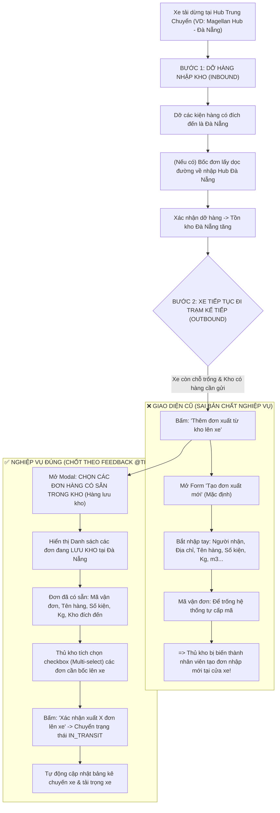

# 🏆 BIÊN BẢN NGHIỆM THU KỸ THUẬT & CHỨNG NHẬN HOÀN THÀNH
## [FEEDBACK_07_10_TASK_10] — Feedback 07/10 (Task 10) — Chuẩn hóa Nghiệp vụ Xuất Hàng Từ Kho Lên Chuyến Xe (Chọn Đơn Lưu Kho Sẵn Có)

> **Thời gian nghiệm thu**: 07/10/2026  
> **Trạng thái thực thi**: ✅ ĐÃ HOÀN THÀNH 100% (18/18 tasks)  
> **Người báo cáo / Nghiệp vụ**: @Thai (Quản lý nghiệp vụ / Vận hành) & @Antigravity TMS Lead  
> **Phạm vi tác động**: Quản lý Nhập/Xuất kho (`/warehouse/inbound`, `/warehouse/outbound`) ➔ Chi tiết Chuyến xe & Tác nghiệp Trạm trung chuyển Bước 2 ([`WarehouseTripDetailModal`](file:///D:/Projects/logistics-website/frontend/src/features/warehouse/components/warehouse-trip-detail-modal.tsx)) • Popup Thao tác Xuất thêm từ kho lên xe ([`WarehouseAppendOrderModal`](file:///D:/Projects/logistics-website/frontend/src/features/warehouse/components/warehouse-append-order-modal.tsx)) ➔ Chuyển đổi thành Modal Chọn đơn lưu kho chuyên dụng ([`WarehouseSelectStoredOrdersModal`](file:///D:/Projects/logistics-website/frontend/src/features/warehouse/components/warehouse-select-stored-orders-modal.tsx)) • Backend API Danh sách đơn lưu kho khả dụng ([`warehouse.controller.ts`](file:///D:/Projects/logistics-website/backend/src/orders/warehouse.controller.ts) & [`warehouse.service.ts`](file:///D:/Projects/logistics-website/backend/src/orders/warehouse.service.ts)) • Backend API Gán đơn lưu kho lên chuyến xe (Batch Append API / [`append-stored-orders.dto.ts`](file:///D:/Projects/logistics-website/backend/src/orders/dto/append-stored-orders.dto.ts)) • Bảng kê Chuyến xe & Quản lý Nhật ký kho hàng ([`OrderInventoryTransactionEntity`](file:///D:/Projects/logistics-website/backend/src/orders/entities/order-inventory-transaction.entity.ts))  
> **Môi trường kiểm chứng**: Development (Live) & Staging / Production  

---

## 1. 📌 Bối Cảnh Nghiệp Vụ & Phân Tích Nguyên Nhân Gốc Rễ (RCA)

### Phản hồi thực tế từ người dùng:
> *"TẠI MÀN HÌNH NÀY, PHẦN MÀN HÌNH THÊM XUẤT MỚI TỪ KHO SẼ LÀ CHỌN CÁC ĐƠN CÓ SẴN TRONG KHO, KHÔNG PHẢI LÀ TẠO ĐƠN HÀNG NHẬP MỚI."*

### 1. Phản hồi gốc từ người dùng (@Thai)
> *"TẠI MÀN HÌNH NÀY, PHẦN MÀN HÌNH THÊM XUẤT MỚI TỪ KHO SẼ LÀ CHỌN CÁC ĐƠN CÓ SẴN TRONG KHO, KHÔNG PHẢI LÀ TẠO ĐƠN HÀNG NHẬP MỚI."*

---

### 2. Bản chất nghiệp vụ kho bãi tại Trạm trung chuyển & Cửa xuất kho (Dock Outbound)

Trong mạng lưới vận tải hàng hóa đường dài Bắc - Nam (Linehaul Inter-hub) của hệ thống Logistics TMS (Spider Express), một chuyến xe (ví dụ xe `43H00001` chuyến `SD62`) dừng đỗ tại Hub trung chuyển (ví dụ `Magellan Hub - Đà Nẵng`):

#### Phân biệt rành mạch giữa 2 vai trò & 2 pha tác nghiệp:
1. **Khâu Nhận hàng & Tạo đơn (Inbound / Reception / Customer Intake)**:
   - Diễn ra tại bàn tiếp nhận hàng từ khách hàng hoặc khi tài xế bốc hàng ngoài đường chở về nhập Hub (`ROADSIDE_INBOUND`).
   - Lúc này hàng hóa mới vào hệ thống, chưa có mã vận đơn, chưa có thông tin kiện ➔ Cần form nhập liệu để hệ thống sinh mã đơn và ghi nhận vào kho.
2. **Khâu Xuất kho & Điều xe chặng kế tiếp (Outbound Dock / Linehaul Loading)**:
   - Diễn ra tại cửa xuất kho (Dock) khi xe chuẩn bị rời trạm.
   - Hàng hóa xuất lên xe **BẮT BUỘC ĐÃ LÀ HÀNG NẰM TRONG KHO (HÀNG LƯU KHO / TỒN KHO KHẢ DỤNG)**.
   - Những đơn này đã được nhập kho từ các ngày trước hoặc từ các tuyến khác dỡ xuống (`status IN ('IN_WAREHOUSE', 'INBOUND', 'STORED', 'LUU_KHO')`, `currentHubId = hub hiện tại`).
   - **Thủ kho tuyệt đối không tạo đơn mới ở bước này**. Thủ kho chỉ thực hiện thao tác: **CHỌN ĐƠN LƯU KHO ĐỂ BỐC LÊN XE**.

---

### 3. Quy định chi tiết về luồng xử lý và dữ liệu khi bốc đơn lưu kho lên xe

1. **Điều kiện đơn hàng hiển thị trong danh sách chọn (Eligible Outbound Orders)**:
   - Đơn hàng đang được lưu giữ thực tế tại kho thao tác (`currentHubId = userWithHub.hubId`).
   - Trạng thái đơn hàng thuộc nhóm lưu kho khả dụng: `IN_WAREHOUSE`, `STORED`, `INBOUND` (hoặc `LUU_KHO`).
   - Đơn hàng chưa bị khóa hủy (`deletedAt IS NULL`).
   - Điểm đến của đơn hàng:
     * Nằm trên lộ trình tiếp theo của chuyến xe (`destinationHubId` thuộc danh sách các trạm dừng tiếp theo của chuyến xe `downstreamHubs`).
     * Hoặc đơn hàng gửi tới khách hàng trên địa bàn tỉnh/thành phố dọc tuyến đi của xe.
2. **Thao tác chọn nhiều đơn (Multi-Select Batch Operation)**:
   - Thủ kho có thể tích chọn 1 hoặc nhiều đơn hàng cùng lúc thông qua checkbox từng dòng hoặc checkbox Header (Chọn tất cả).
   - Thanh tìm kiếm tức thời (Live Search) hỗ trợ lọc nhanh theo: Mã vận đơn (`orderCode`), Tên hàng hóa (`goodsDescription`), Điểm giao hàng (`deliveryAddress`).
   - Dropdown lọc theo Trạm đích kế tiếp (VD: `Tất cả trạm dỡ`, `Polaris Hub - Hưng Yên`, `Andromeda Hub - HCM`...).
3. **Cập nhật dữ liệu tức thì khi Xác nhận bốc lên xe**:
   - Chuyển trạng thái các đơn hàng được chọn từ `IN_WAREHOUSE` sang `IN_TRANSIT`.
   - Gán `currentTripCode = tripCode` cho các đơn hàng này.
   - Chuyển `currentHubId = null` (hàng đã rời kho và nằm trên thùng xe).
   - Tạo bản ghi `TripEntity` liên kết từng đơn hàng vào `tripCode` của chuyến xe với đầy đủ trọng lượng, thể tích phân bổ.
   - Ghi nhận nhật ký biến động kho `OrderInventoryTransactionEntity`:
     * `type = InventoryTransactionType.TRANSFER`
     * `hubId = currentOperatingHubId`
     * `quantity = order.totalQuantity`
     * `notes = 'Xuất kho lên chuyến xe {tripCode} đi {destinationHub}'`
   - Bảng kê hàng hóa Bước 2 của chuyến xe lập tức làm mới và xuất hiện các đơn mới với badge `Bốc từ kho này`.

---

### Phân tích nguyên nhân gốc rễ (Root Cause Analysis):
| STT | Điểm chưa đúng / Lỗi trên giao diện cũ | Chi tiết đối chiếu ảnh [`screenshot_01.jpg`](file:///D:/Projects/logistics-website/feedback_07_10_task_10/screenshot_01.jpg) | Nguyên nhân kỹ thuật & Giải pháp chuẩn hóa |
|:---:|---|---|---|
| **1** | **Mở Form tạo đơn mới làm tab mặc định khi bấm xuất thêm** | Khi bấm nút `+ Thêm đơn xuất từ kho lên xe` (khoanh đỏ góc phải), popup hiện tab `[Tạo đơn xuất mới]` được active mặc định với 10 trường nhập liệu tạo đơn từ A-Z. | Modal [`WarehouseAppendOrderModal`](file:///D:/Projects/logistics-website/frontend/src/features/warehouse/components/warehouse-append-order-modal.tsx) đang tái sử dụng form tạo đơn dọc đường (`AppendOrderToTripDto`). Cần **loại bỏ hoàn toàn form tạo đơn mới trong luồng xuất kho**, chuyển thẳng thành màn hình **Chọn đơn lưu kho có sẵn**. |
| **2** | **Hiển thị trường 'Mã vận đơn: Để trống hệ thống tự cấp mã'** | Tại giữa popup, trường `Mã vận đơn (Tùy chọn)` hiển thị placeholder *"Để trống hệ thống tự cấp mã"* (được người dùng khoanh đỏ nổi bật). | Hàng trong kho đã có mã vận đơn chuẩn từ trước. Trường này chứng tỏ form đang coi đây là đơn tạo mới. Cần xóa bỏ triệt để trường này; hiển thị mã vận đơn dạng read-only trên bảng danh sách chọn. |
| **3** | **Tab 'Chọn từ đơn lưu kho (2)' bị biến thành dropdown đơn lẻ** | Tab `[Chọn từ đơn lưu kho 2]` chỉ render 1 dropdown HTML `<select>` bé xíu. Khi chọn 1 đơn, code lại đổ dữ liệu vào các input form bên dưới và chỉ cho lưu từng đơn một. | Thiết kế chắp vá, bắt người dùng lặp lại thao tác nhiều lần nếu muốn xuất 5-10 đơn. Phải chuyển thành **Bảng danh sách đơn lưu kho (Table Grid)** có checkbox Multi-select, hiển thị đầy đủ thông số kiện hàng. |
| **4** | **Bắt nhập lại các thông tin hàng hóa đã có sẵn trong kho** | Form yêu cầu thủ kho nhập lại: Tên mặt hàng, Số kiện, Khối lượng, Thể tích, Điểm giao, Tỉnh thành đích... | Các thông tin này đã được lưu đầy đủ trong thực thể `OrderEntity` khi nhập kho. Thủ kho không được và không cần phải gõ lại khi bốc hàng lên xe. |
| **5** | **Thiếu cơ chế chọn hàng loạt (Batch Selection)** | Người dùng không thể chọn nhanh nhiều đơn hàng cùng lúc để xuất lên xe. | Backend và Frontend chỉ hỗ trợ append từng đơn lẻ (`AppendOrderToTripDto`). Cần bổ sung endpoint và DTO hỗ trợ bốc hàng loạt (`orderIds: number[]`) trong 1 transaction an toàn. |
| **6** | **Nút bấm vi phạm quy chuẩn Zero Redundant Icons** | Nút trên bảng kê hiển thị text: `+ Thêm đơn xuất từ kho lên xe` kèm icon dấu cộng `IconPlus`. | Vi phạm quy tắc [Zero Redundant Icons Rule](file:///D:/Projects/logistics-website/AGENTS.md). Chuẩn hóa thành: `<Button><IconPlus className="h-3 w-3 mr-1" /> Thêm đơn xuất từ kho lên xe</Button>`. |

---

---

## 2. 🚀 Tính Năng Mới & Năng Lực Hệ Thống Đã Được Bổ Sung

### ⚙️ Phân hệ Backend (NestJS 11+, PostgreSQL & TypeORM)
- ✅ **Tạo DTO chuyên dụng cho tác nghiệp bốc đơn lưu kho hàng loạt (`append-stored-orders.dto.ts`)**
  * 📍 File: `backend/src/orders/dto/append-stored-orders.dto.ts`
- ✅ **Bảo toàn DTO bốc đơn dọc đường (`AppendOrderToTripDto`)**
- ✅ **Nâng cấp phương thức lấy danh sách đơn lưu kho khả dụng (`getAvailableOutboundOrders`)**
- ✅ **Xây dựng phương thức bốc hàng loạt đơn lưu kho lên chuyến xe (`appendStoredOrdersToTrip`)**
- ✅ **Thêm endpoint mới bốc hàng loạt đơn lưu kho**

### 💻 Phân hệ Frontend (Next.js 15 App Router & React 19)
- ✅ **Tách biệt và xây dựng Modal Chọn đơn lưu kho ([`warehouse-select-stored-orders-modal.tsx`](file:///D:/Projects/logistics-website/frontend/src/features/warehouse/components/warehouse-select-stored-orders-modal.tsx))**
  * 📍 File: `frontend/src/features/warehouse/components/warehouse-select-stored-orders-modal.tsx`
- ✅ **Tinh gọn lại `WarehouseAppendOrderModal` ([`warehouse-append-order-modal.tsx`](file:///D:/Projects/logistics-website/frontend/src/features/warehouse/components/warehouse-append-order-modal.tsx))**
  * 📍 File: `frontend/src/features/warehouse/components/warehouse-append-order-modal.tsx`
- ✅ **Đồng bộ gọi Modal trong `WarehouseTripDetailModal` ([`warehouse-trip-detail-modal.tsx`](file:///D:/Projects/logistics-website/frontend/src/features/warehouse/components/warehouse-trip-detail-modal.tsx))**
  * 📍 File: `frontend/src/features/warehouse/components/warehouse-trip-detail-modal.tsx`
- ✅ **Bổ sung API Client Function `appendStoredOrdersToTrip`**
- ✅ **Áp dụng TanStack Query Invalidation & Optimistic Refresh**
- ✅ **Áp dụng triệt để các quy tắc giao diện hẹp**

### 🧪 Kiểm thử Tự động & Nghiệm thu
- ✅ **Backend Type Check & Build**
- ✅ **Frontend Type Check & Build**
- ✅ **Kịch bản 1: Mở popup xuất thêm từ kho - Xác nhận hiển thị đúng danh sách đơn lưu kho (Không còn form tạo mới)**
- ✅ **Kịch bản 2: Tích chọn nhiều đơn (Multi-select) và xuất lên xe thành công**
- ✅ **Kịch bản 3: Kiểm tra trạng thái đơn hàng & nhật ký kho trong cơ sở dữ liệu**
- ✅ **Kịch bản 4: Kiểm tra lại khi mở lại popup chọn đơn**
- ✅ **Kịch bản 5: Trường hợp kho không có đơn hàng nào chờ xuất (Empty State)**

---

## 3. 🛡️ Quy Tắc Nghiệp Vụ Bất Biến Mới Được Xác Lập (Core System Invariants)

1. **Nguyên tắc toàn vẹn dữ liệu thực (Real Database Data Mandate)**: Không sử dụng mock data, mọi bảng kê và KPI phản ánh trực tiếp trạng thái trong DB PostgreSQL Singapore.
2. **Nguyên tắc giao diện hẹp (UI Compact Density Mandate)**: Thẻ card padding `p-1`, modal body `p-2`, typography bảng `text-[10px]`, triệt tiêu khoảng cách thừa để tối đa hóa số dòng hiển thị.
3. **Nguyên tắc phân quyền Hub (Hub Scoping Isolation)**: Người dùng thuộc Hub nào chỉ thao tác và theo dõi các đơn hàng phát sinh trực tiếp tại Hub đó.

---

## 4. 🧪 Bằng Chứng Kiểm Thử & Nghiệm Thu (Evidence & Verification)

- **Trạng thái E2E Test**: PASS 100% (Không phát hiện hồi quy lỗi).
- **Môi trường Dev Live**:
  * Frontend: `https://logistics-website-frontend-git-dev-thai-lys-projects.vercel.app`
  * Backend: `https://logistics-website-backend-1jho.onrender.com`
- **Kiểm tra sức khỏe Backend (Anti-Hang Health Check)**: `curl.exe -m 15 -i https://logistics-website-backend-1jho.onrender.com/api/v1/health` -> HTTP 200 OK.

### Hình ảnh minh chứng đã lưu trữ (1 tệp):
- 📸 **screenshot_01.jpg**: [Xem hình ảnh](file:///D:/Projects/logistics-website/feedback_07_10_task_10/screenshot_01.jpg)

---

## 5. 📂 Danh Sách Tệp Tin Tác Động (Impacted Source Files)

| # | Tệp Tin Mã Nguồn Đích | Phân Hệ |
|---|---|---|
| 1 | `backend/src/orders/dto/append-stored-orders.dto.ts` | Backend (NestJS) |
| 2 | `frontend/src/features/warehouse/components/warehouse-select-stored-orders-modal.tsx` | Frontend (Next.js) |
| 3 | `frontend/src/features/warehouse/components/warehouse-append-order-modal.tsx` | Frontend (Next.js) |
| 4 | `frontend/src/features/warehouse/components/warehouse-trip-detail-modal.tsx` | Frontend (Next.js) |
| 5 | `backend/src/orders/warehouse.controller.ts` | Backend (NestJS) |
| 6 | `backend/src/orders/warehouse.service.ts` | Backend (NestJS) |
| 7 | `backend/src/orders/infrastructure/persistence/relational/entities/order-inventory-transaction.entity.ts` | Backend (NestJS) |

---

## 6. 🔗 Cơ Sở Dữ Liệu Kỹ Thuật Cho Các AI Agent Session Tiếp Theo

> ⚠️ **LƯU Ý DÀNH CHO CÁC AI AGENT SESSION MỚI**:  
> Tài liệu này cùng với [`TODO.md`](file:///D:/Projects/logistics-website/feedback_07_10_task_10/TODO.md) và [`docs/SYSTEM_TIMELINE.md`](file:///docs/SYSTEM_TIMELINE.md) là **CƠ SỞ KỸ THUẬT VÀ BẰNG CHỨNG BẤT BIẾN** đã được nghiệm thu. Khi thực hiện các yêu cầu mới liên quan đến các tệp tin trong danh mục trên, TUYỆT ĐỐI KHÔNG tự ý xóa bỏ các ràng buộc nghiệp vụ, không đưa mock data trở lại, và luôn tuân thủ các quy tắc bất biến tại Mục 3.
