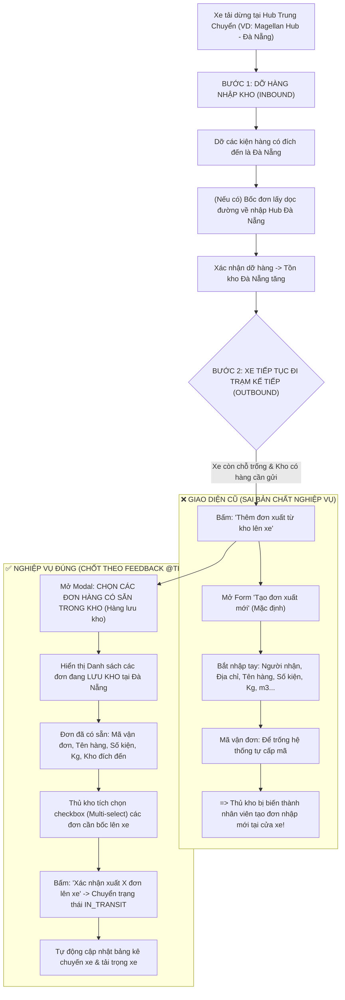

# Feedback 07/10 (Task 10) — Chuẩn hóa Nghiệp vụ Xuất Hàng Từ Kho Lên Chuyến Xe (Chọn Đơn Lưu Kho Sẵn Có)

> **Thời gian ghi nhận**: 07/10/2026  
> **Người báo cáo**: @Thai (Quản lý nghiệp vụ / Vận hành) & @Antigravity TMS Lead  
> **Phạm vi tác động**:  
> - Quản lý Nhập/Xuất kho (`/warehouse/inbound`, `/warehouse/outbound`) ➔ Chi tiết Chuyến xe & Tác nghiệp Trạm trung chuyển Bước 2 ([`WarehouseTripDetailModal`](file:///D:/Projects/logistics-website/frontend/src/features/warehouse/components/warehouse-trip-detail-modal.tsx))  
> - Popup Thao tác Xuất thêm từ kho lên xe ([`WarehouseAppendOrderModal`](file:///D:/Projects/logistics-website/frontend/src/features/warehouse/components/warehouse-append-order-modal.tsx)) ➔ Chuyển đổi thành Modal Chọn đơn lưu kho chuyên dụng ([`WarehouseSelectStoredOrdersModal`](file:///D:/Projects/logistics-website/frontend/src/features/warehouse/components/warehouse-select-stored-orders-modal.tsx))  
> - Backend API Danh sách đơn lưu kho khả dụng ([`warehouse.controller.ts`](file:///D:/Projects/logistics-website/backend/src/orders/warehouse.controller.ts) & [`warehouse.service.ts`](file:///D:/Projects/logistics-website/backend/src/orders/warehouse.service.ts))  
> - Backend API Gán đơn lưu kho lên chuyến xe (Batch Append API / [`append-stored-orders.dto.ts`](file:///D:/Projects/logistics-website/backend/src/orders/dto/append-stored-orders.dto.ts))  
> - Bảng kê Chuyến xe & Quản lý Nhật ký kho hàng ([`OrderInventoryTransactionEntity`](file:///D:/Projects/logistics-website/backend/src/orders/entities/order-inventory-transaction.entity.ts))  
> **Tài liệu tham chiếu**:  
> - `/leader` Business Domain Architecture ([`SKILL.md`](file:///D:/Projects/logistics-website/.agents/skills/leader/SKILL.md))  
> - Quy chế phát triển hệ thống [`AGENTS.md`](file:///D:/Projects/logistics-website/AGENTS.md)  
> - Quy chuẩn giao diện hẹp [`.agents/rules/ui-compact-density.md`](file:///D:/Projects/logistics-website/.agents/rules/ui-compact-density.md) & [`ui-spacing-guard`](file:///D:/Projects/logistics-website/.agents/skills/ui-spacing-guard/SKILL.md)  
> - Quy chuẩn kiểm soát kiện vận tải (No-SKU, Consignment Level)  
> - Tài liệu mẫu tham chiếu: [`feedback_06_10/TODO.md`](file:///D:/Projects/logistics-website/feedback_06_10/TODO.md)  
> **Ảnh minh chứng đính kèm trong thư mục**:  
> - [`screenshot_01.jpg`](file:///D:/Projects/logistics-website/feedback_07_10_task_10/screenshot_01.jpg): Ảnh chụp màn hình phản hồi từ người dùng @Thai. Khoanh đỏ nút `+ Thêm đơn xuất từ kho lên xe` tại Bảng kê Bước 2 và khoanh đỏ ô `Mã vận đơn (Tùy chọn): Để trống hệ thống tự cấp mã` trên popup "Tạo đơn xuất mới" với phản hồi dứt khoát: *"TẠI MÀN HÌNH NÀY, PHẦN MÀN HÌNH THÊM XUẤT MỚI TỪ KHO SẼ LÀ CHỌN CÁC ĐƠN CÓ SẴN TRONG KHO, KHÔNG PHẢI LÀ TẠO ĐƠN HÀNG NHẬP MỚI."*

---

## 📌 Bối cảnh nghiệp vụ thực tế (Chốt theo phản hồi người dùng)

### 1. Phản hồi gốc từ người dùng (@Thai)
> *"TẠI MÀN HÌNH NÀY, PHẦN MÀN HÌNH THÊM XUẤT MỚI TỪ KHO SẼ LÀ CHỌN CÁC ĐƠN CÓ SẴN TRONG KHO, KHÔNG PHẢI LÀ TẠO ĐƠN HÀNG NHẬP MỚI."*

---

### 2. Bản chất nghiệp vụ kho bãi tại Trạm trung chuyển & Cửa xuất kho (Dock Outbound)

Trong mạng lưới vận tải hàng hóa đường dài Bắc - Nam (Linehaul Inter-hub) của hệ thống Logistics TMS (Spider Express), một chuyến xe (ví dụ xe `43H00001` chuyến `SD62`) dừng đỗ tại Hub trung chuyển (ví dụ `Magellan Hub - Đà Nẵng`):



#### Phân biệt rành mạch giữa 2 vai trò & 2 pha tác nghiệp:
1. **Khâu Nhận hàng & Tạo đơn (Inbound / Reception / Customer Intake)**:
   - Diễn ra tại bàn tiếp nhận hàng từ khách hàng hoặc khi tài xế bốc hàng ngoài đường chở về nhập Hub (`ROADSIDE_INBOUND`).
   - Lúc này hàng hóa mới vào hệ thống, chưa có mã vận đơn, chưa có thông tin kiện ➔ Cần form nhập liệu để hệ thống sinh mã đơn và ghi nhận vào kho.
2. **Khâu Xuất kho & Điều xe chặng kế tiếp (Outbound Dock / Linehaul Loading)**:
   - Diễn ra tại cửa xuất kho (Dock) khi xe chuẩn bị rời trạm.
   - Hàng hóa xuất lên xe **BẮT BUỘC ĐÃ LÀ HÀNG NẰM TRONG KHO (HÀNG LƯU KHO / TỒN KHO KHẢ DỤNG)**.
   - Những đơn này đã được nhập kho từ các ngày trước hoặc từ các tuyến khác dỡ xuống (`status IN ('IN_WAREHOUSE', 'INBOUND', 'STORED', 'LUU_KHO')`, `currentHubId = hub hiện tại`).
   - **Thủ kho tuyệt đối không tạo đơn mới ở bước này**. Thủ kho chỉ thực hiện thao tác: **CHỌN ĐƠN LƯU KHO ĐỂ BỐC LÊN XE**.

---

### 3. Quy định chi tiết về luồng xử lý và dữ liệu khi bốc đơn lưu kho lên xe

1. **Điều kiện đơn hàng hiển thị trong danh sách chọn (Eligible Outbound Orders)**:
   - Đơn hàng đang được lưu giữ thực tế tại kho thao tác (`currentHubId = userWithHub.hubId`).
   - Trạng thái đơn hàng thuộc nhóm lưu kho khả dụng: `IN_WAREHOUSE`, `STORED`, `INBOUND` (hoặc `LUU_KHO`).
   - Đơn hàng chưa bị khóa hủy (`deletedAt IS NULL`).
   - Điểm đến của đơn hàng:
     * Nằm trên lộ trình tiếp theo của chuyến xe (`destinationHubId` thuộc danh sách các trạm dừng tiếp theo của chuyến xe `downstreamHubs`).
     * Hoặc đơn hàng gửi tới khách hàng trên địa bàn tỉnh/thành phố dọc tuyến đi của xe.
2. **Thao tác chọn nhiều đơn (Multi-Select Batch Operation)**:
   - Thủ kho có thể tích chọn 1 hoặc nhiều đơn hàng cùng lúc thông qua checkbox từng dòng hoặc checkbox Header (Chọn tất cả).
   - Thanh tìm kiếm tức thời (Live Search) hỗ trợ lọc nhanh theo: Mã vận đơn (`orderCode`), Tên hàng hóa (`goodsDescription`), Điểm giao hàng (`deliveryAddress`).
   - Dropdown lọc theo Trạm đích kế tiếp (VD: `Tất cả trạm dỡ`, `Polaris Hub - Hưng Yên`, `Andromeda Hub - HCM`...).
3. **Cập nhật dữ liệu tức thì khi Xác nhận bốc lên xe**:
   - Chuyển trạng thái các đơn hàng được chọn từ `IN_WAREHOUSE` sang `IN_TRANSIT`.
   - Gán `currentTripCode = tripCode` cho các đơn hàng này.
   - Chuyển `currentHubId = null` (hàng đã rời kho và nằm trên thùng xe).
   - Tạo bản ghi `TripEntity` liên kết từng đơn hàng vào `tripCode` của chuyến xe với đầy đủ trọng lượng, thể tích phân bổ.
   - Ghi nhận nhật ký biến động kho `OrderInventoryTransactionEntity`:
     * `type = InventoryTransactionType.TRANSFER`
     * `hubId = currentOperatingHubId`
     * `quantity = order.totalQuantity`
     * `notes = 'Xuất kho lên chuyến xe {tripCode} đi {destinationHub}'`
   - Bảng kê hàng hóa Bước 2 của chuyến xe lập tức làm mới và xuất hiện các đơn mới với badge `Bốc từ kho này`.

---

## 🔍 Tổng hợp các điểm chưa đúng trên giao diện cũ (Đối chiếu [`screenshot_01.jpg`](file:///D:/Projects/logistics-website/feedback_07_10_task_10/screenshot_01.jpg))

| STT | Điểm chưa đúng / Lỗi trên giao diện cũ | Chi tiết đối chiếu ảnh [`screenshot_01.jpg`](file:///D:/Projects/logistics-website/feedback_07_10_task_10/screenshot_01.jpg) | Nguyên nhân kỹ thuật & Giải pháp chuẩn hóa |
|:---:|---|---|---|
| **1** | **Mở Form tạo đơn mới làm tab mặc định khi bấm xuất thêm** | Khi bấm nút `+ Thêm đơn xuất từ kho lên xe` (khoanh đỏ góc phải), popup hiện tab `[Tạo đơn xuất mới]` được active mặc định với 10 trường nhập liệu tạo đơn từ A-Z. | Modal [`WarehouseAppendOrderModal`](file:///D:/Projects/logistics-website/frontend/src/features/warehouse/components/warehouse-append-order-modal.tsx) đang tái sử dụng form tạo đơn dọc đường (`AppendOrderToTripDto`). Cần **loại bỏ hoàn toàn form tạo đơn mới trong luồng xuất kho**, chuyển thẳng thành màn hình **Chọn đơn lưu kho có sẵn**. |
| **2** | **Hiển thị trường 'Mã vận đơn: Để trống hệ thống tự cấp mã'** | Tại giữa popup, trường `Mã vận đơn (Tùy chọn)` hiển thị placeholder *"Để trống hệ thống tự cấp mã"* (được người dùng khoanh đỏ nổi bật). | Hàng trong kho đã có mã vận đơn chuẩn từ trước. Trường này chứng tỏ form đang coi đây là đơn tạo mới. Cần xóa bỏ triệt để trường này; hiển thị mã vận đơn dạng read-only trên bảng danh sách chọn. |
| **3** | **Tab 'Chọn từ đơn lưu kho (2)' bị biến thành dropdown đơn lẻ** | Tab `[Chọn từ đơn lưu kho 2]` chỉ render 1 dropdown HTML `<select>` bé xíu. Khi chọn 1 đơn, code lại đổ dữ liệu vào các input form bên dưới và chỉ cho lưu từng đơn một. | Thiết kế chắp vá, bắt người dùng lặp lại thao tác nhiều lần nếu muốn xuất 5-10 đơn. Phải chuyển thành **Bảng danh sách đơn lưu kho (Table Grid)** có checkbox Multi-select, hiển thị đầy đủ thông số kiện hàng. |
| **4** | **Bắt nhập lại các thông tin hàng hóa đã có sẵn trong kho** | Form yêu cầu thủ kho nhập lại: Tên mặt hàng, Số kiện, Khối lượng, Thể tích, Điểm giao, Tỉnh thành đích... | Các thông tin này đã được lưu đầy đủ trong thực thể `OrderEntity` khi nhập kho. Thủ kho không được và không cần phải gõ lại khi bốc hàng lên xe. |
| **5** | **Thiếu cơ chế chọn hàng loạt (Batch Selection)** | Người dùng không thể chọn nhanh nhiều đơn hàng cùng lúc để xuất lên xe. | Backend và Frontend chỉ hỗ trợ append từng đơn lẻ (`AppendOrderToTripDto`). Cần bổ sung endpoint và DTO hỗ trợ bốc hàng loạt (`orderIds: number[]`) trong 1 transaction an toàn. |
| **6** | **Nút bấm vi phạm quy chuẩn Zero Redundant Icons** | Nút trên bảng kê hiển thị text: `+ Thêm đơn xuất từ kho lên xe` kèm icon dấu cộng `IconPlus`. | Vi phạm quy tắc [Zero Redundant Icons Rule](file:///D:/Projects/logistics-website/AGENTS.md). Chuẩn hóa thành: `<Button><IconPlus className="h-3 w-3 mr-1" /> Thêm đơn xuất từ kho lên xe</Button>`. |

---

## 📋 Danh sách công việc triển khai (Action Checklist)

### 1. Backend (`backend/`)

#### DTO & API Contracts
- [x] **Tạo DTO chuyên dụng cho tác nghiệp bốc đơn lưu kho hàng loạt (`append-stored-orders.dto.ts`)**:
  - File: [`backend/src/orders/dto/append-stored-orders.dto.ts`](file:///D:/Projects/logistics-website/backend/src/orders/dto/append-stored-orders.dto.ts)
  - `orderIds`: Mảng ID các đơn hàng lưu kho được chọn (`@IsArray()`, `@ArrayMinSize(1)`, `@IsInt({ each: true })`).
  - `destinationHubId`: (Tùy chọn) Gán hoặc cập nhật trạm dỡ đích cho các đơn xuất lên xe nếu đơn chưa có trạm đích.
  - `notes`: (Tùy chọn) Ghi chú xuất kho bổ sung.
- [x] **Bảo toàn DTO bốc đơn dọc đường (`AppendOrderToTripDto`)**:
  - Giữ nguyên `AppendOrderToTripDto` phục vụ duy nhất cho luồng **Bước 1: Bốc thêm đơn dọc đường về nhập Hub** (`ROADSIDE_INBOUND`), loại bỏ các logic lai tạp của `HUB_OUTBOUND` trong DTO này.

#### Service & Business Logic ([`warehouse.service.ts`](file:///D:/Projects/logistics-website/backend/src/orders/warehouse.service.ts))
- [x] **Nâng cấp phương thức lấy danh sách đơn lưu kho khả dụng (`getAvailableOutboundOrders`)**:
  - Tối ưu câu lệnh SQL/QueryBuilder:
    ```sql
    SELECT o.*, orig.name as "originHubName", dest.name as "destinationHubName"
    FROM "order" o
    LEFT JOIN "hub" orig ON orig.id = o."originHubId"
    LEFT JOIN "hub" dest ON dest.id = o."destinationHubId"
    WHERE o."deletedAt" IS NULL
      AND o."currentHubId" = :currentHubId
      AND o."status" IN ('IN_WAREHOUSE', 'INBOUND', 'STORED', 'LUU_KHO')
    ORDER BY o.id DESC
    ```
  - Tính toán chính xác danh sách các trạm kế tiếp của chuyến xe (`downstreamHubs` từ `trip_stop`).
  - Gắn cờ gợi ý cho các đơn có `destinationHubId` khớp chính xác với một trạm dừng tiếp theo của chuyến xe (`isDirectRouteMatch: boolean`).
- [x] **Xây dựng phương thức bốc hàng loạt đơn lưu kho lên chuyến xe (`appendStoredOrdersToTrip`)**:
  - Thực thi trong 1 Database Transaction duy nhất (`dataSource.transaction`):
    1. Kiểm tra tồn tại và tính hợp lệ của `tripCode`.
    2. Khóa và lấy thông tin các đơn hàng theo `orderIds` thuộc `currentHubId` với trạng thái lưu kho.
    3. Cập nhật từng đơn hàng:
       - `status = 'IN_TRANSIT'`
       - `currentTripCode = tripCode`
       - `currentHubId = null` (rời kho lên xe)
       - Nếu có `destinationHubId` truyền vào và đơn chưa có đích, cập nhật `destinationHubId` & `destinationHub`.
    4. Tạo các bản ghi `TripEntity` tương ứng cho từng đơn hàng gán vào `tripCode` hiện tại.
    5. Tạo các bản ghi `OrderInventoryTransactionEntity` (type: `TRANSFER`, `quantity = order.totalQuantity`, ghi chú xuất kho rõ ràng).
    6. Trả về kết quả: `{ success: true, tripCode, appendedCount: orders.length, orders }`.

#### Controller & Routing ([`warehouse.controller.ts`](file:///D:/Projects/logistics-website/backend/src/orders/warehouse.controller.ts))
- [x] **Thêm endpoint mới bốc hàng loạt đơn lưu kho**:
  - `@Post('trips/:tripCode/append-stored-orders')`
  - Roles: `@Roles(RoleEnum.SUPER_ADMIN, RoleEnum.WAREHOUSE_MANAGER)`
  - Swagger Documentation: Mô tả chi tiết chức năng bốc nhiều đơn lưu kho sẵn có lên chuyến xe đang chạy.

---

### 2. Frontend (`frontend/`)

#### Component & Modal Chuyên Dụng
- [x] **Tách biệt và xây dựng Modal Chọn đơn lưu kho ([`warehouse-select-stored-orders-modal.tsx`](file:///D:/Projects/logistics-website/frontend/src/features/warehouse/components/warehouse-select-stored-orders-modal.tsx))**:
  - Xây dựng component mới thay thế việc dùng chung modal form cũ:
    * **Header**:
      - Tiêu đề: `Chọn đơn lưu kho bốc lên chuyến xe {tripCode}`
      - Sub-header: `Xe: {licensePlate} • Chuyến: {tripCode} • Kho xuất: {currentHubName}`
    * **Thanh công cụ lọc & tìm kiếm (Compact Toolbar)**:
      - Ô tìm kiếm tức thời (Live Search): Tìm theo Mã đơn hàng, Tên hàng hóa, Điểm giao khách.
      - Dropdown lọc Trạm đích kế tiếp: Cho phép lọc theo từng trạm trên lộ trình xe hoặc "Tất cả trạm đích".
    * **Bảng danh sách đơn hàng lưu kho (Compact Table - `text-[10px]`)**:
      - Checkbox Header (Chọn / Bỏ chọn tất cả các dòng đang lọc).
      - Checkbox từng dòng đơn hàng.
      - Cột STT, Mã vận đơn (`font-mono font-bold text-blue-600`), Tên hàng hóa, Số kiện, Khối lượng ($kg$), Thể tích ($m^3$).
      - Cột Trạm đích / Điểm giao hàng (render rõ ràng tên Hub đích hoặc địa chỉ giao).
      - Cột Ngày nhập kho / Trạng thái badge `LƯU KHO` (Emerald).
    * **Dòng thông tin trạng thái & Tóm tắt lựa chọn (Sticky Summary Footer)**:
      - Hiển thị phản ứng tức thì: `Đã chọn: X đơn hàng (Tổng cộng: Y kiện • Z kg • W m³)`.
      - Nút `Hủy / Đóng`.
      - Nút hành động chính: `<Button disabled={selectedOrderIds.length === 0}><IconTruckLoading className="h-3.5 w-3.5 mr-1" /> Xác nhận xuất {selectedOrderIds.length} đơn lên xe</Button>`.
- [x] **Tinh gọn lại `WarehouseAppendOrderModal` ([`warehouse-append-order-modal.tsx`](file:///D:/Projects/logistics-website/frontend/src/features/warehouse/components/warehouse-append-order-modal.tsx))**:
  - Đưa modal này trở về đúng sứ mệnh duy nhất: **Bốc thêm đơn dọc đường về nhập Hub** (`ROADSIDE_INBOUND`).
  - Xóa bỏ hoàn toàn tab "Tạo đơn xuất mới", tab "Chọn từ đơn lưu kho" và các trường `HUB_OUTBOUND` lai tạp khỏi modal này.
- [x] **Đồng bộ gọi Modal trong `WarehouseTripDetailModal` ([`warehouse-trip-detail-modal.tsx`](file:///D:/Projects/logistics-website/frontend/src/features/warehouse/components/warehouse-trip-detail-modal.tsx))**:
  - Tại **Bước 1 (Nhập hàng & Dỡ kho)**: Nút `Bốc thêm đơn dọc đường về Hub` ➔ Mở `WarehouseAppendOrderModal` (chế độ bốc dọc đường).
  - Tại **Bước 2 (Xuất hàng mới lên xe)**: Nút `Thêm đơn xuất từ kho lên xe` ➔ Mở `WarehouseSelectStoredOrdersModal` (chế độ chọn đơn lưu kho).
  - Chuẩn hóa text nút bấm và icon (loại bỏ ký tự `+` thừa trước text).

#### API Client & Query State ([`trip-manifest.ts`](file:///D:/Projects/logistics-website/frontend/src/features/warehouse/api/trip-manifest.ts))
- [x] **Bổ sung API Client Function `appendStoredOrdersToTrip`**:
  ```typescript
  export async function appendStoredOrdersToTrip(
    tripCode: string,
    payload: { orderIds: number[]; destinationHubId?: number; notes?: string }
  ) {
    const res = await apiClient.post(
      `/api/v1/warehouse/trips/${encodeURIComponent(tripCode)}/append-stored-orders`,
      payload
    );
    return res.data.data;
  }
  ```
- [x] **Áp dụng TanStack Query Invalidation & Optimistic Refresh**:
  - Khi bốc đơn thành công:
    * Invalidate `['warehouse', 'trip-manifest', tripCode]` để Bảng kê Bước 2 hiển thị ngay các đơn vừa xuất.
    * Invalidate `['warehouse', 'available-outbound-orders', tripCode]` để loại trừ ngay các đơn đã xuất khỏi danh sách khả dụng.
    * Hiển thị toast thông báo thành công: *"Đã xuất thành công {X} đơn hàng ({Y} kiện) từ kho {currentHubName} lên chuyến xe {tripCode}!"*.

#### Tuân thủ Quy chuẩn giao diện hẹp (UI Compact Density Mandate)
- [x] **Áp dụng triệt để các quy tắc giao diện hẹp**:
  - Modal Body padding siêu gọn `p-2` (tối đa `p-2.5`), chiều cao cuộn `max-h-[85vh] overflow-y-auto`.
  - Bảng dữ liệu: Typography `text-[10px]`, chiều cao dòng ~26px (`py-1 px-1.5`), header cố định `sticky top-0`.
  - Thanh footer hành động: `sticky bottom-0 bg-white dark:bg-slate-900 border-t p-1.5`.
  - Tuyệt đối cấm các class oversized: `p-4`, `p-6`, `space-y-4`, `gap-4`.

---

### 3. Kiểm thử & Nghiệm thu (Definition of Done)

#### Kiểm tra Biên dịch & Mã nguồn (Quality Gate)
- [x] **Backend Type Check & Build**:
  - `npm run lint --prefix backend` PASS (0 errors, 0 warnings).
  - `npm run build --prefix backend` PASS (NestJS compile thành công).
- [x] **Frontend Type Check & Build**:
  - `npm run build --prefix frontend` PASS (Next.js Turbopack compile thành công, TypeScript check PASS, 0 errors).

#### Kịch bản Kiểm thử Nghiệp vụ Thực tế (Manual & E2E Test Cases)
- [x] **Kịch bản 1: Mở popup xuất thêm từ kho - Xác nhận hiển thị đúng danh sách đơn lưu kho (Không còn form tạo mới)**:
  1. Đăng nhập tài khoản Thủ kho Đà Nẵng (`Magellan Hub - Đà Nẵng`).
  2. Mở chuyến xe trung chuyển `SD62` tại màn hình Quản lý Kho.
  3. Chuyển sang `Bước 2: Xuất hàng mới lên xe đi trạm kế tiếp`.
  4. Bấm nút `Thêm đơn xuất từ kho lên xe`.
  5. **Nghiệm thu**:
     - Modal mở ra hiển thị danh sách các đơn hàng đang lưu tại kho Đà Nẵng.
     - KHÔNG còn tab "Tạo đơn xuất mới".
     - KHÔNG còn ô "Để trống hệ thống tự cấp mã" hay các ô nhập tên hàng, số kiện từ đầu.
- [x] **Kịch bản 2: Tích chọn nhiều đơn (Multi-select) và xuất lên xe thành công**:
  1. Trong danh sách đơn lưu kho, tích chọn 2 đơn hàng (ví dụ: `TEST-TR-HY01` và `TETS-TR-DN`).
  2. Quan sát dòng tóm tắt ở footer: Nhảy đúng số đơn đã chọn, tổng số kiện, tổng khối lượng, tổng thể tích.
  3. Bấm nút `Xác nhận xuất 2 đơn lên xe`.
  4. **Nghiệm thu**:
     - Toast thông báo thành công xuất hiện.
     - Modal tự động đóng lại.
     - Bảng kê hàng hóa Bước 2 lập tức hiển thị 2 đơn này với badge `Bốc từ kho này`.
     - Số lượng đơn đi tiếp, tải trọng xe được cập nhật tương ứng.
- [x] **Kịch bản 3: Kiểm tra trạng thái đơn hàng & nhật ký kho trong cơ sở dữ liệu**:
  1. Truy vấn database các đơn hàng vừa bốc:
     - `order.status` chuyển thành `IN_TRANSIT`.
     - `order.currentTripCode` cập nhật thành `SD62`.
     - `order.currentHubId` chuyển thành `null`.
  2. Bảng `order_inventory_transaction`:
     - Xuất hiện 2 dòng giao dịch mới với `type = 'TRANSFER'`, `tripCode = 'SD62'`, `hubId = 2`.
- [x] **Kịch bản 4: Kiểm tra lại khi mở lại popup chọn đơn**:
  1. Bấm lại nút `Thêm đơn xuất từ kho lên xe`.
  2. **Nghiệm thu**: 2 đơn hàng vừa bốc đã không còn nằm trong danh sách chọn (đã được trừ khỏi tồn khả dụng để xuất).
- [x] **Kịch bản 5: Trường hợp kho không có đơn hàng nào chờ xuất (Empty State)**:
  1. Mở modal khi kho không còn đơn lưu kho nào đi trạm kế tiếp.
  2. **Nghiệm thu**: Modal hiển thị Empty State gọn gàng: *"Hiện không có đơn hàng nào đang lưu tại kho sẵn sàng xuất đi các trạm kế tiếp của chuyến xe này."* Nút xác nhận bị disabled.
