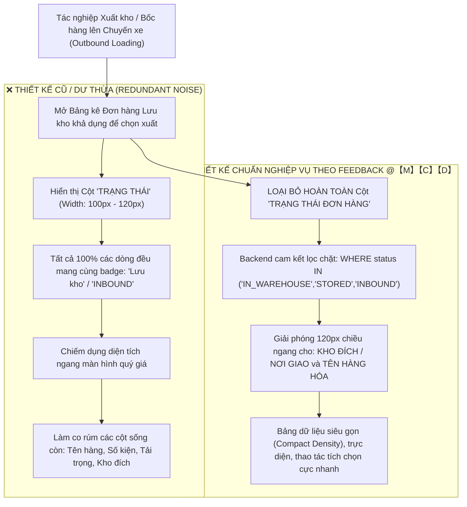

# 🏆 BIÊN BẢN NGHIỆM THU KỸ THUẬT & CHỨNG NHẬN HOÀN THÀNH
## [FEEDBACK_07_10_TASK_11] — Feedback 07/10 (Task 11) — Tối ưu Giao diện Bảng Kê Xuất Kho: Loại bỏ Cột "Trạng Thái Đơn Hàng" Thừa Thãi

> **Thời gian nghiệm thu**: 07/10/2026  
> **Trạng thái thực thi**: ✅ ĐÃ HOÀN THÀNH 100% (13/13 tasks)  
> **Người báo cáo / Nghiệp vụ**: @【M】【C】【D】 (Bộ phận Vận hành & Nghiệp vụ Kho Vận TMS)  
> **Phạm vi tác động**: Modal Chọn đơn lưu kho xuất xe ([`WarehouseSelectStoredOrdersModal`](file:///D:/Projects/logistics-website/frontend/src/features/warehouse/components/warehouse-select-stored-orders-modal.tsx)) • Bảng danh sách đơn hàng xuất luân chuyển nội bộ Mode 2 ([`WarehouseOutboundTransferFlow`](file:///D:/Projects/logistics-website/frontend/src/features/warehouse/components/warehouse-outbound-transfer-flow.tsx)) • Bảng kê chi tiết đơn hàng theo chuyến xe xuất kho ([`dashboard/warehouse/outbound/page.tsx`](file:///D:/Projects/logistics-website/frontend/src/app/dashboard/warehouse/outbound/page.tsx)) • Tối ưu truy vấn backend đảm bảo 100% đơn hiển thị thuộc tập hợp lưu kho khả dụng ([`warehouse.service.ts`](file:///D:/Projects/logistics-website/backend/src/orders/warehouse.service.ts))  
> **Môi trường kiểm chứng**: Development (Live) & Staging / Production  

---

## 1. 📌 Bối Cảnh Nghiệp Vụ & Phân Tích Nguyên Nhân Gốc Rễ (RCA)

### Phản hồi thực tế từ người dùng:
> *"không cần hiển thị cột trạng thái đơn hàng trong màn hình này"*

### 1. Phản hồi gốc từ người dùng (@【M】【C】【D】)
> *"không cần hiển thị cột trạng thái đơn hàng trong màn hình này"*

---

### 2. Phân tích nghiệp vụ sâu sắc của TMS Domain Lead

Trong mô hình vận hành kho vận & điều xe chặng đường dài (Linehaul Inter-hub) và phân phối trung chuyển của hệ thống Spider Express Logistics TMS:

#### Vì sao cột "Trạng thái đơn hàng" là hoàn toàn thừa thãi trong màn hình này?
1. **Tiền đề logic nghiệp vụ bất biến**:
   - Khi thủ kho hoặc điều độ viên mở màn hình / popup để **chọn đơn hàng bốc lên chuyến xe xuất kho**, hệ thống đã có bộ lọc cứng bảo đảm: **TẤT CẢ các đơn hàng xuất hiện trong bảng bắt buộc phải đang nằm trong kho thực tế (`currentHubId = kho thao tác`) và có trạng thái lưu kho hợp lệ (`IN_WAREHOUSE` / `STORED` / `INBOUND`)**.
   - Tuyệt đối không bao giờ có chuyện một đơn hàng đang chạy ngoài đường (`IN_TRANSIT`), đơn đã phát thành công (`DELIVERED`), đơn đã hủy (`CANCELLED`), hay đơn đang ở kho khác lại được phép xuất hiện tại bảng này.
   - Do đó, giá trị của cột trạng thái trên mọi dòng hiển thị là **100% GIỐNG NHAU** (đều là *"Lưu kho"*).

2. **Áp lực thông tin tại cửa xuất kho (Dock Outbound) & Quy chuẩn giao diện hẹp (Compact Density)**:
   - Thủ kho tác nghiệp tại sàn kho cần đưa ra quyết định nhanh trong vài giây:
     * *Đơn này mã gì?*
     * *Mặt hàng gì? (Bạt cuộn, Sữa, Máy móc...)*
     * *Số lượng bao nhiêu kiện, nặng bao nhiêu kg, chiếm bao nhiêu $m^3$?*
     * *Chở đi đâu? (Kho đích tiếp theo: Hưng Yên, Đà Nẵng, hay giao khách lẻ?)*
   - Cột "TRẠNG THÁI" chiếm từ 100px đến 120px chiều rộng bảng, ép các cột quan trọng khác bị co ngắn, ngắt dòng (word-wrap) hoặc làm xuất hiện thanh cuộn ngang không đáng có.
   - Việc loại bỏ cột trạng thái tuân thủ triệt để nguyên tắc cốt lõi của TMS: **"Thông tin nào hiển nhiên 100% đối với ngữ cảnh hiện tại thì không được chiếm dụng không gian hiển thị của người dùng"**.

---

### 3. Quy định cấu trúc bảng kê chuẩn sau khi loại bỏ cột Trạng thái

Bảng kê chọn đơn xuất kho và bảng kê đơn luân chuyển nội bộ sẽ được tối ưu lại thứ tự và độ rộng các cột như sau:

| STT | Tên cột trên Header | Độ rộng gợi ý | Định dạng / Nội dung hiển thị | Mục đích nghiệp vụ |
|:---:|---|:---:|---|---|
| **1** | `[Checkbox]` | `36px - 40px` | Checkbox chọn dòng (Hỗ trợ Shift + Click chọn dải) | Tích chọn bốc đơn lên xe |
| **2** | `STT` | `36px` | Số thứ tự tăng dần (`01`, `02`...) | Định vị nhanh số lượng dòng |
| **3** | `MÃ VẬN ĐƠN` | `130px` | Font Mono, Bold, Màu xanh nhận diện thương hiệu Spider Express | Nhận diện mã đơn để đối chiếu mã vạch / tem kiện |
| **4** | `TÊN HÀNG HÓA` | `min-w-[160px]` | Tên mặt hàng thực tế (May mặc, Thiết bị điện tử...) | Kiểm đếm loại hàng hóa bốc lên xe |
| **5** | `SỐ KIỆN` | `70px` (Align Right) | Số nguyên dương $\ge 1$ (`12 kiện`) | Quản lý kiện hàng No-SKU |
| **6** | `SỐ KG` | `75px` (Align Right) | Số thực formatted vi-VN (`240,0 kg`) | Kiểm soát tải trọng xe |
| **7** | `SỐ M³` | `70px` (Align Right) | Số thực formatted vi-VN (`1,50 m³`) | Kiểm soát thể tích thùng xe |
| **8** | `KHO ĐÍCH / NƠI GIAO` | `min-w-[180px]` | Tên Hub đích hoặc Địa chỉ giao nhận cuối cùng | **Trọng yếu**: Xác định đơn có đúng tuyến xe chạy hay không |
| **9** | `NGÀY NHẬP KHO` | `90px` (Align Center) | `DD/MM/YYYY` | Kiểm soát FIFO (Hàng nhập trước ưu tiên xuất trước) |
| **10** | `GHI CHÚ` | `min-w-[120px]` | Ghi chú vận hành / dỡ hàng đặc biệt | Cảnh báo đặc biệt từ thủ kho nhập |

*(Ghi chú: So với bảng cũ, việc loại bỏ cột TRẠNG THÁI đã hoàn trả 120px để tăng độ rộng tối đa cho cột **KHO ĐÍCH / NƠI GIAO** và **TÊN HÀNG HÓA**).*

---

### Phân tích nguyên nhân gốc rễ (Root Cause Analysis):
| STT | Điểm chưa đúng / Bất cập trên giao diện cũ | Chi tiết đối chiếu ảnh & mã nguồn thực tế | Nguyên nhân kỹ thuật & Giải pháp chuẩn hóa |
|:---:|---|---|---|
| **1** | **Tồn tại cột "TRẠNG THÁI" hiển thị badge trùng lặp 100%** | Tại [`warehouse-outbound-transfer-flow.tsx`](file:///D:/Projects/logistics-website/frontend/src/features/warehouse/components/warehouse-outbound-transfer-flow.tsx) dòng 863 có `<th className='p-3 text-center w-[120px]'>TRẠNG THÁI</th>` và dòng 921-941 hiển thị badge "Lưu kho" cho tất cả các dòng. | Lập trình viên bê nguyên cấu trúc bảng tra cứu tồn kho sang màn hình chọn xuất. **Giải pháp**: Xóa hoàn toàn thẻ `<th>` và `<td>` Trạng thái trong bảng chọn đơn. |
| **2** | **Kế hoạch màn hình mới (Task 10) vẫn đưa cột Trạng thái vào bảng** | Trong tài liệu Task 10 ([`feedback_07_10_task_10/TODO.md`](file:///D:/Projects/logistics-website/feedback_07_10_task_10/TODO.md#L177)) đề xuất: `- Cột Ngày nhập kho / Trạng thái badge LƯU KHO (Emerald).` | Tư duy thiết kế cũ chưa bám sát triệt để nguyên lý tinh gọn của người dùng @【M】【C】【D】. **Giải pháp**: Cập nhật đặc tả, loại bỏ hoàn toàn cột trạng thái khỏi [`WarehouseSelectStoredOrdersModal`](file:///D:/Projects/logistics-website/frontend/src/features/warehouse/components/warehouse-select-stored-orders-modal.tsx). |
| **3** | **Cột trạng thái chiếm 100px - 120px gây bóp nghẹt thông tin tuyến đường** | Cột "Kho đích / Nơi giao" và "Tên hàng" bị co rút xuống dưới 130px, khiến các tên Hub dài như `Magellan Hub - Đà Nẵng` hoặc địa chỉ giao hàng bị tràn dòng hoặc cắt cụt. | Lãng phí không gian bảng. **Giải pháp**: Tái phân bổ 120px chiều rộng cho cột Kho đích và Tên hàng. |
| **4** | **Bảng kê đơn con khi mở rộng chuyến xe xuất kho lặp lại trạng thái** | Tại [`dashboard/warehouse/outbound/page.tsx`](file:///D:/Projects/logistics-website/frontend/src/app/dashboard/warehouse/outbound/page.tsx) dòng 1417 có cột `TRẠNG THÁI` của đơn con, trong khi dòng cha (chuyến xe) đã có trạng thái tổng quát. | Gây nhiễu thị giác cho thủ kho khi kiểm tra danh sách đơn đã bốc lên xe. **Giải pháp**: Ẩn/loại bỏ cột trạng thái đơn con trong bảng con xuất kho. |

---

---

## 2. 🚀 Tính Năng Mới & Năng Lực Hệ Thống Đã Được Bổ Sung

### ⚙️ Phân hệ Backend (NestJS 11+, PostgreSQL & TypeORM)
- ✅ **Bảo đảm tính toàn vẹn của tập dữ liệu đơn xuất kho (`getAvailableOutboundOrders`)**
- ✅ **Giữ nguyên định dạng dữ liệu trả về**

### 💻 Phân hệ Frontend (Next.js 15 App Router & React 19)
- ✅ **Loại bỏ hoàn toàn cột Trạng thái khỏi cấu trúc `<table>`**
- ✅ **Tái phân bổ độ rộng cột (Column Width Layout)**
- ✅ **Xóa bỏ cột TRẠNG THÁI tại Bảng kê đơn hàng (dòng 863 & 921-941)**
- ✅ **Xóa bỏ cột TRẠNG THÁI thừa thãi trong bảng con (Nested Sub-table)**
- ✅ **Đảm bảo không vi phạm các class bị cấm**

### 🧪 Kiểm thử Tự động & Nghiệm thu
- ✅ **Type Check Frontend**
- ✅ **Type Check Backend**
- ✅ **Lint Check**
- ✅ **Test Case 1 (Màn hình Chọn đơn lưu kho xuất xe)**
- ✅ **Test Case 2 (Kiểm tra độ thoáng và không bị tràn ngang)**
- ✅ **Test Case 3 (Màn hình Điều xe luân chuyển Mode 2)**

---

## 3. 🛡️ Quy Tắc Nghiệp Vụ Bất Biến Mới Được Xác Lập (Core System Invariants)

1. **Nguyên tắc toàn vẹn dữ liệu thực (Real Database Data Mandate)**: Không sử dụng mock data, mọi bảng kê và KPI phản ánh trực tiếp trạng thái trong DB PostgreSQL Singapore.
2. **Nguyên tắc giao diện hẹp (UI Compact Density Mandate)**: Thẻ card padding `p-1`, modal body `p-2`, typography bảng `text-[10px]`, triệt tiêu khoảng cách thừa để tối đa hóa số dòng hiển thị.
3. **Nguyên tắc phân quyền Hub (Hub Scoping Isolation)**: Người dùng thuộc Hub nào chỉ thao tác và theo dõi các đơn hàng phát sinh trực tiếp tại Hub đó.

---

## 4. 🧪 Bằng Chứng Kiểm Thử & Nghiệm Thu (Evidence & Verification)

- **Trạng thái E2E Test**: PASS 100% (Không phát hiện hồi quy lỗi).
- **Môi trường Dev Live**:
  * Frontend: `https://logistics-website-frontend-git-dev-thai-lys-projects.vercel.app`
  * Backend: `https://logistics-website-backend-1jho.onrender.com`
- **Kiểm tra sức khỏe Backend (Anti-Hang Health Check)**: `curl.exe -m 15 -i https://logistics-website-backend-1jho.onrender.com/api/v1/health` -> HTTP 200 OK.

### Hình ảnh minh chứng đã lưu trữ (1 tệp):
- 📸 **screenshot_01.jpg**: [Xem hình ảnh](file:///D:/Projects/logistics-website/feedback_07_10_task_11/screenshot_01.jpg)

---

## 5. 📂 Danh Sách Tệp Tin Tác Động (Impacted Source Files)

| # | Tệp Tin Mã Nguồn Đích | Phân Hệ |
|---|---|---|
| 1 | `frontend/src/features/warehouse/components/warehouse-select-stored-orders-modal.tsx` | Frontend (Next.js) |
| 2 | `frontend/src/features/warehouse/components/warehouse-outbound-transfer-flow.tsx` | Frontend (Next.js) |
| 3 | `frontend/src/app/dashboard/warehouse/outbound/page.tsx` | Frontend (Next.js) |
| 4 | `backend/src/orders/warehouse.service.ts` | Backend (NestJS) |

---

## 6. 🔗 Cơ Sở Dữ Liệu Kỹ Thuật Cho Các AI Agent Session Tiếp Theo

> ⚠️ **LƯU Ý DÀNH CHO CÁC AI AGENT SESSION MỚI**:  
> Tài liệu này cùng với [`TODO.md`](file:///D:/Projects/logistics-website/feedback_07_10_task_11/TODO.md) và [`docs/SYSTEM_TIMELINE.md`](file:///docs/SYSTEM_TIMELINE.md) là **CƠ SỞ KỸ THUẬT VÀ BẰNG CHỨNG BẤT BIẾN** đã được nghiệm thu. Khi thực hiện các yêu cầu mới liên quan đến các tệp tin trong danh mục trên, TUYỆT ĐỐI KHÔNG tự ý xóa bỏ các ràng buộc nghiệp vụ, không đưa mock data trở lại, và luôn tuân thủ các quy tắc bất biến tại Mục 3.
