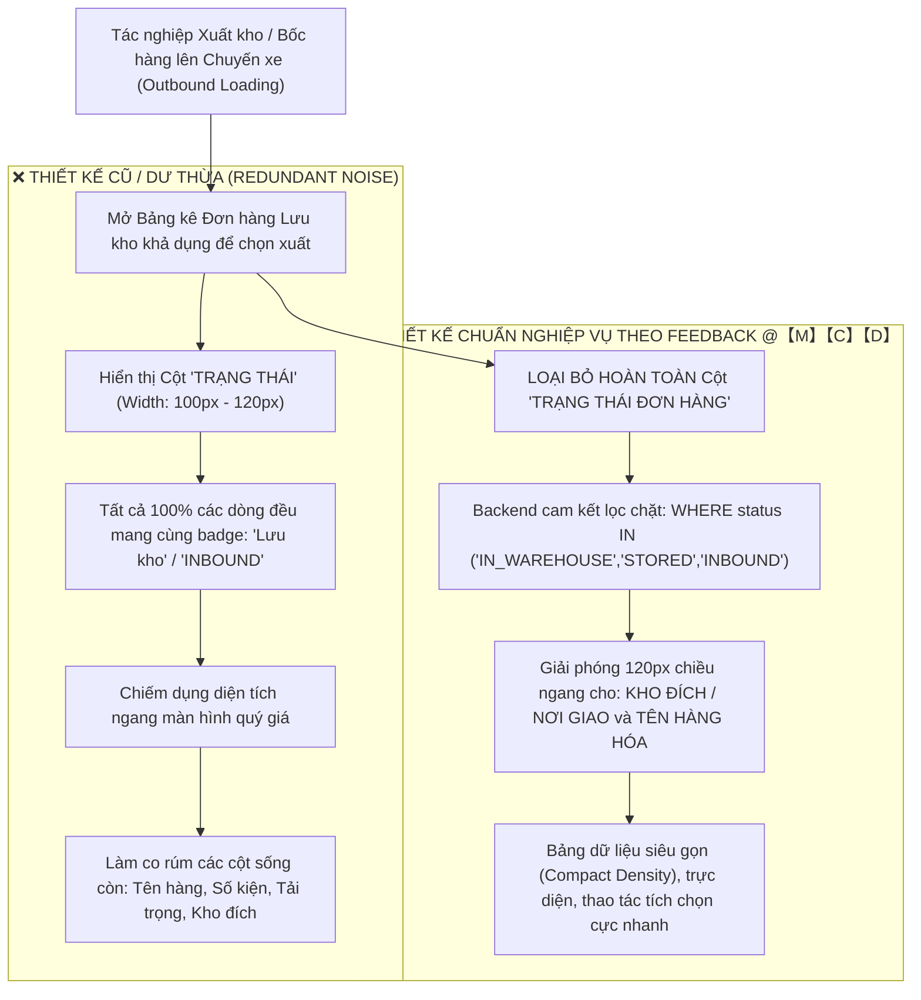

# Feedback 07/10 (Task 11) — Tối ưu Giao diện Bảng Kê Xuất Kho: Loại bỏ Cột "Trạng Thái Đơn Hàng" Thừa Thãi

> **Thời gian ghi nhận**: 07/10/2026  
> **Người báo cáo**: @【M】【C】【D】 (Bộ phận Vận hành & Nghiệp vụ Kho Vận TMS)  
> **Phạm vi tác động**:  
> - Modal Chọn đơn lưu kho xuất xe ([`WarehouseSelectStoredOrdersModal`](file:///D:/Projects/logistics-website/frontend/src/features/warehouse/components/warehouse-select-stored-orders-modal.tsx))  
> - Bảng danh sách đơn hàng xuất luân chuyển nội bộ Mode 2 ([`WarehouseOutboundTransferFlow`](file:///D:/Projects/logistics-website/frontend/src/features/warehouse/components/warehouse-outbound-transfer-flow.tsx))  
> - Bảng kê chi tiết đơn hàng theo chuyến xe xuất kho ([`dashboard/warehouse/outbound/page.tsx`](file:///D:/Projects/logistics-website/frontend/src/app/dashboard/warehouse/outbound/page.tsx))  
> - Tối ưu truy vấn backend đảm bảo 100% đơn hiển thị thuộc tập hợp lưu kho khả dụng ([`warehouse.service.ts`](file:///D:/Projects/logistics-website/backend/src/orders/warehouse.service.ts))  
> **Tài liệu tham chiếu**:  
> - `/leader` Business Domain Architecture ([`SKILL.md`](file:///D:/Projects/logistics-website/.agents/skills/leader/SKILL.md))  
> - Quy chế phát triển hệ thống [`AGENTS.md`](file:///D:/Projects/logistics-website/AGENTS.md)  
> - Quy chuẩn giao diện hẹp [`.agents/rules/ui-compact-density.md`](file:///D:/Projects/logistics-website/.agents/rules/ui-compact-density.md) & [`ui-spacing-guard`](file:///D:/Projects/logistics-website/.agents/skills/ui-spacing-guard/SKILL.md)  
> - Quy chuẩn kiểm soát kiện vận tải (No-SKU, Consignment Level)  
> - Tài liệu mẫu chuẩn mực: [`feedback_06_10/TODO.md`](file:///D:/Projects/logistics-website/feedback_06_10/TODO.md)  
> **Ảnh minh chứng đính kèm trong thư mục**:  
> - [`screenshot_01.jpg`](file:///D:/Projects/logistics-website/feedback_07_10_task_11/screenshot_01.jpg): Giao diện tác nghiệp xuất hàng tại cửa kho / trạm trung chuyển (bước bốc hàng lưu kho lên xe tiếp tục hành trình) được khoanh đỏ các khu vực tương tác xuất kho.

---

## 📌 Bối cảnh nghiệp vụ thực tế (Chốt theo phản hồi người dùng)

### 1. Phản hồi gốc từ người dùng (@【M】【C】【D】)
> *"không cần hiển thị cột trạng thái đơn hàng trong màn hình này"*

---

### 2. Phân tích nghiệp vụ sâu sắc của TMS Domain Lead

Trong mô hình vận hành kho vận & điều xe chặng đường dài (Linehaul Inter-hub) và phân phối trung chuyển của hệ thống Spider Express Logistics TMS:



#### Vì sao cột "Trạng thái đơn hàng" là hoàn toàn thừa thãi trong màn hình này?
1. **Tiền đề logic nghiệp vụ bất biến**:
   - Khi thủ kho hoặc điều độ viên mở màn hình / popup để **chọn đơn hàng bốc lên chuyến xe xuất kho**, hệ thống đã có bộ lọc cứng bảo đảm: **TẤT CẢ các đơn hàng xuất hiện trong bảng bắt buộc phải đang nằm trong kho thực tế (`currentHubId = kho thao tác`) và có trạng thái lưu kho hợp lệ (`IN_WAREHOUSE` / `STORED` / `INBOUND`)**.
   - Tuyệt đối không bao giờ có chuyện một đơn hàng đang chạy ngoài đường (`IN_TRANSIT`), đơn đã phát thành công (`DELIVERED`), đơn đã hủy (`CANCELLED`), hay đơn đang ở kho khác lại được phép xuất hiện tại bảng này.
   - Do đó, giá trị của cột trạng thái trên mọi dòng hiển thị là **100% GIỐNG NHAU** (đều là *"Lưu kho"*).

2. **Áp lực thông tin tại cửa xuất kho (Dock Outbound) & Quy chuẩn giao diện hẹp (Compact Density)**:
   - Thủ kho tác nghiệp tại sàn kho cần đưa ra quyết định nhanh trong vài giây:
     * *Đơn này mã gì?*
     * *Mặt hàng gì? (Bạt cuộn, Sữa, Máy móc...)*
     * *Số lượng bao nhiêu kiện, nặng bao nhiêu kg, chiếm bao nhiêu $m^3$?*
     * *Chở đi đâu? (Kho đích tiếp theo: Hưng Yên, Đà Nẵng, hay giao khách lẻ?)*
   - Cột "TRẠNG THÁI" chiếm từ 100px đến 120px chiều rộng bảng, ép các cột quan trọng khác bị co ngắn, ngắt dòng (word-wrap) hoặc làm xuất hiện thanh cuộn ngang không đáng có.
   - Việc loại bỏ cột trạng thái tuân thủ triệt để nguyên tắc cốt lõi của TMS: **"Thông tin nào hiển nhiên 100% đối với ngữ cảnh hiện tại thì không được chiếm dụng không gian hiển thị của người dùng"**.

---

### 3. Quy định cấu trúc bảng kê chuẩn sau khi loại bỏ cột Trạng thái

Bảng kê chọn đơn xuất kho và bảng kê đơn luân chuyển nội bộ sẽ được tối ưu lại thứ tự và độ rộng các cột như sau:

| STT | Tên cột trên Header | Độ rộng gợi ý | Định dạng / Nội dung hiển thị | Mục đích nghiệp vụ |
|:---:|---|:---:|---|---|
| **1** | `[Checkbox]` | `36px - 40px` | Checkbox chọn dòng (Hỗ trợ Shift + Click chọn dải) | Tích chọn bốc đơn lên xe |
| **2** | `STT` | `36px` | Số thứ tự tăng dần (`01`, `02`...) | Định vị nhanh số lượng dòng |
| **3** | `MÃ VẬN ĐƠN` | `130px` | Font Mono, Bold, Màu xanh nhận diện thương hiệu Spider Express | Nhận diện mã đơn để đối chiếu mã vạch / tem kiện |
| **4** | `TÊN HÀNG HÓA` | `min-w-[160px]` | Tên mặt hàng thực tế (May mặc, Thiết bị điện tử...) | Kiểm đếm loại hàng hóa bốc lên xe |
| **5** | `SỐ KIỆN` | `70px` (Align Right) | Số nguyên dương $\ge 1$ (`12 kiện`) | Quản lý kiện hàng No-SKU |
| **6** | `SỐ KG` | `75px` (Align Right) | Số thực formatted vi-VN (`240,0 kg`) | Kiểm soát tải trọng xe |
| **7** | `SỐ M³` | `70px` (Align Right) | Số thực formatted vi-VN (`1,50 m³`) | Kiểm soát thể tích thùng xe |
| **8** | `KHO ĐÍCH / NƠI GIAO` | `min-w-[180px]` | Tên Hub đích hoặc Địa chỉ giao nhận cuối cùng | **Trọng yếu**: Xác định đơn có đúng tuyến xe chạy hay không |
| **9** | `NGÀY NHẬP KHO` | `90px` (Align Center) | `DD/MM/YYYY` | Kiểm soát FIFO (Hàng nhập trước ưu tiên xuất trước) |
| **10** | `GHI CHÚ` | `min-w-[120px]` | Ghi chú vận hành / dỡ hàng đặc biệt | Cảnh báo đặc biệt từ thủ kho nhập |

*(Ghi chú: So với bảng cũ, việc loại bỏ cột TRẠNG THÁI đã hoàn trả 120px để tăng độ rộng tối đa cho cột **KHO ĐÍCH / NƠI GIAO** và **TÊN HÀNG HÓA**).*

---

## 🔍 Tổng hợp các điểm chưa đúng trên giao diện cũ (Đối chiếu [`screenshot_01.jpg`](file:///D:/Projects/logistics-website/feedback_07_10_task_11/screenshot_01.jpg))

| STT | Điểm chưa đúng / Bất cập trên giao diện cũ | Chi tiết đối chiếu ảnh & mã nguồn thực tế | Nguyên nhân kỹ thuật & Giải pháp chuẩn hóa |
|:---:|---|---|---|
| **1** | **Tồn tại cột "TRẠNG THÁI" hiển thị badge trùng lặp 100%** | Tại [`warehouse-outbound-transfer-flow.tsx`](file:///D:/Projects/logistics-website/frontend/src/features/warehouse/components/warehouse-outbound-transfer-flow.tsx) dòng 863 có `<th className='p-3 text-center w-[120px]'>TRẠNG THÁI</th>` và dòng 921-941 hiển thị badge "Lưu kho" cho tất cả các dòng. | Lập trình viên bê nguyên cấu trúc bảng tra cứu tồn kho sang màn hình chọn xuất. **Giải pháp**: Xóa hoàn toàn thẻ `<th>` và `<td>` Trạng thái trong bảng chọn đơn. |
| **2** | **Kế hoạch màn hình mới (Task 10) vẫn đưa cột Trạng thái vào bảng** | Trong tài liệu Task 10 ([`feedback_07_10_task_10/TODO.md`](file:///D:/Projects/logistics-website/feedback_07_10_task_10/TODO.md#L177)) đề xuất: `- Cột Ngày nhập kho / Trạng thái badge LƯU KHO (Emerald).` | Tư duy thiết kế cũ chưa bám sát triệt để nguyên lý tinh gọn của người dùng @【M】【C】【D】. **Giải pháp**: Cập nhật đặc tả, loại bỏ hoàn toàn cột trạng thái khỏi [`WarehouseSelectStoredOrdersModal`](file:///D:/Projects/logistics-website/frontend/src/features/warehouse/components/warehouse-select-stored-orders-modal.tsx). |
| **3** | **Cột trạng thái chiếm 100px - 120px gây bóp nghẹt thông tin tuyến đường** | Cột "Kho đích / Nơi giao" và "Tên hàng" bị co rút xuống dưới 130px, khiến các tên Hub dài như `Magellan Hub - Đà Nẵng` hoặc địa chỉ giao hàng bị tràn dòng hoặc cắt cụt. | Lãng phí không gian bảng. **Giải pháp**: Tái phân bổ 120px chiều rộng cho cột Kho đích và Tên hàng. |
| **4** | **Bảng kê đơn con khi mở rộng chuyến xe xuất kho lặp lại trạng thái** | Tại [`dashboard/warehouse/outbound/page.tsx`](file:///D:/Projects/logistics-website/frontend/src/app/dashboard/warehouse/outbound/page.tsx) dòng 1417 có cột `TRẠNG THÁI` của đơn con, trong khi dòng cha (chuyến xe) đã có trạng thái tổng quát. | Gây nhiễu thị giác cho thủ kho khi kiểm tra danh sách đơn đã bốc lên xe. **Giải pháp**: Ẩn/loại bỏ cột trạng thái đơn con trong bảng con xuất kho. |

---

## 📋 Danh sách công việc triển khai (Action Checklist)

### 1. Backend (`backend/`)

#### Service & Business Logic ([`warehouse.service.ts`](file:///D:/Projects/logistics-website/backend/src/orders/warehouse.service.ts))
- [x] **Bảo đảm tính toàn vẹn của tập dữ liệu đơn xuất kho (`getAvailableOutboundOrders`)**:
  - Rà soát câu truy vấn cơ sở dữ liệu bảo đảm 100% đơn hàng trả về cho màn hình xuất kho đều thỏa mãn điều kiện lưu kho nghiêm ngặt:
    ```sql
    WHERE o."deletedAt" IS NULL
      AND o."currentHubId" = :currentHubId
      AND o."status" IN ('IN_WAREHOUSE', 'INBOUND', 'STORED', 'LUU_KHO')
    ```
  - Tuyệt đối không để lọt các đơn có trạng thái trung chuyển (`IN_TRANSIT`) hay hoàn tất (`DELIVERED`) vào tập kết quả.
  - Nhờ việc backend bảo đảm tính toàn vẹn 100%, frontend hoàn toàn yên tâm loại bỏ cột trạng thái mà không sợ nhầm lẫn nghiệp vụ.

#### API Contract & DTO
- [x] **Giữ nguyên định dạng dữ liệu trả về**:
  - Không cần sửa đổi DTO backend vì trường `status` vẫn được trả về trong object đơn hàng phục vụ các logic nghiệp vụ nội bộ nếu cần, chỉ tinh chỉnh tầng hiển thị giao diện người dùng.

---

### 2. Frontend (`frontend/`)

#### 1. Chuẩn hóa Modal Chọn đơn lưu kho xuất xe ([`warehouse-select-stored-orders-modal.tsx`](file:///D:/Projects/logistics-website/frontend/src/features/warehouse/components/warehouse-select-stored-orders-modal.tsx))
- [x] **Loại bỏ hoàn toàn cột Trạng thái khỏi cấu trúc `<table>`**:
  - Xóa bỏ `<th>TRẠNG THÁI</th>` trên `<thead />`.
  - Xóa bỏ `<td><Badge>Lưu kho</Badge></td>` trên `<tbody />`.
  - Cập nhật số lượng cột (`colSpan`) trong các dòng Loading (`IconLoader2`), Empty State ("Không tìm thấy đơn hàng lưu kho"), và Summary Row.
- [x] **Tái phân bổ độ rộng cột (Column Width Layout)**:
  - Tăng độ rộng cột `MÃ VẬN ĐƠN`: `w-[130px]` (Font Mono đậm, màu xanh Spider).
  - Tăng độ rộng cột `TÊN HÀNG HÓA`: `min-w-[160px]`.
  - Tăng độ rộng cột `KHO ĐÍCH / NƠI GIAO`: `min-w-[180px]`.
  - Giữ các cột số lượng, kg, m3 ở định dạng hẹp căn phải (`text-right text-[10px]`).

#### 2. Chuẩn hóa Màn hình Xuất kho luân chuyển Mode 2 ([`warehouse-outbound-transfer-flow.tsx`](file:///D:/Projects/logistics-website/frontend/src/features/warehouse/components/warehouse-outbound-transfer-flow.tsx))
- [x] **Xóa bỏ cột TRẠNG THÁI tại Bảng kê đơn hàng (dòng 863 & 921-941)**:
  - Xóa `<th>`:
    ```tsx
    // Xóa dòng 863:
    // <th className='p-3 text-center w-[120px]'>TRẠNG THÁI</th>
    ```
  - Xóa `<td>`:
    ```tsx
    // Xóa dòng 921-941:
    // <td className='p-3 text-center'><Badge ...>...</Badge></td>
    ```
  - Cập nhật `colSpan={8}` (thay vì `colSpan={9}`) cho dòng loading và empty message.

#### 3. Chuẩn hóa Bảng kê Đơn hàng theo Chuyến xe ([`dashboard/warehouse/outbound/page.tsx`](file:///D:/Projects/logistics-website/frontend/src/app/dashboard/warehouse/outbound/page.tsx))
- [x] **Xóa bỏ cột TRẠNG THÁI thừa thãi trong bảng con (Nested Sub-table)**:
  - Xóa thẻ `<th>` TRẠNG THÁI tại dòng 1417.
  - Xóa thẻ `<td>` hiển thị status badge tại dòng tương ứng của `subOrder`.
  - Điều chỉnh `colSpan` của sub-table cho khớp chính xác với số lượng cột còn lại.

#### 4. Tuân thủ Quy chuẩn UI Compact Density & Spacing Guard
- [x] **Đảm bảo không vi phạm các class bị cấm**:
  - Không sử dụng `p-4`, `p-6`, `space-y-4`, `gap-4`.
  - Đảm bảo thẻ bảng dữ liệu đạt chuẩn: padding dòng `py-1 px-1.5`, font chữ `text-[10px]`, mã vận đơn `text-[11px] font-mono font-bold`.

---

### 3. Kiểm thử & Nghiệm thu

#### Kiểm tra chất lượng mã nguồn (Code Quality Gate)
- [x] **Type Check Frontend**:
  - Chạy `npm --prefix frontend run type-check` (hoặc `npx tsc --noEmit`) đạt **0 errors**.
- [x] **Type Check Backend**:
  - Chạy `npm --prefix backend run type-check` (hoặc `npx tsc --noEmit`) đạt **0 errors**.
- [x] **Lint Check**:
  - Chạy `npm run lint` toàn hệ thống không phát sinh warning/error mới.

#### Kịch bản kiểm thử nghiệp vụ thực tế (UAT Test Cases)
- [x] **Test Case 1 (Màn hình Chọn đơn lưu kho xuất xe)**:
  - Đăng nhập tài khoản Thủ kho (`warehouse.manager@spider.com`).
  - Mở chi tiết chuyến xe xuất kho ➔ Bấm `Thêm đơn xuất từ kho lên xe`.
  - **Kỳ vọng**: Màn hình bảng danh sách đơn lưu kho hiển thị rõ ràng các cột: Mã vận đơn, Tên hàng, Số kiện, Số kg, Số m³, Kho đích / Nơi giao, Ngày nhập, Ghi chú. **Tuyệt đối KHÔNG có cột Trạng thái đơn hàng**.
- [x] **Test Case 2 (Kiểm tra độ thoáng và không bị tràn ngang)**:
  - Thu nhỏ cửa sổ trình duyệt xuống độ phân giải laptop phổ thông ($1366 \times 768$).
  - **Kỳ vọng**: Bảng hiển thị trọn vẹn thông tin các cột, tên trạm đích không bị cắt chữ, không phát sinh thanh cuộn ngang khó chịu.
- [x] **Test Case 3 (Màn hình Điều xe luân chuyển Mode 2)**:
  - Vào menu `/dashboard/warehouse/outbound` ➔ Chọn tab `Luân chuyển nội bộ (Mode 2)`.
  - **Kỳ vọng**: Bảng danh sách hàng trong kho không còn cột `TRẠNG THÁI`, các nút hành động và checkbox hoạt động mượt mà.
