# 🏆 BIÊN BẢN NGHIỆM THU KỸ THUẬT & CHỨNG NHẬN HOÀN THÀNH
## [FEEDBACK_07_10_TASK_12] — Feedback 07/10 Task 12 — Chuẩn Hóa Quản Lý Tồn Kho & Khắc Phục Lỗi Trạng Thái "LƯU KHO" Khi Số Lượng Tồn Bằng 0

> **Thời gian nghiệm thu**: 07/10/2026  
> **Trạng thái thực thi**: ✅ ĐÃ HOÀN THÀNH 100% (19/19 tasks)  
> **Người báo cáo / Nghiệp vụ**: @【M】【C】【D】 (Quản lý nghiệp vụ / Vận hành) & @Antigravity Verification  
> **Phạm vi tác động**: Quản lý Đơn hàng kho (`/dashboard/warehouse/orders`) ➔ Danh sách & Bảng tổng hợp đơn hàng tại kho ([`WarehouseOrdersPage`](file:///D:/Projects/logistics-website/frontend/src/app/dashboard/warehouse/orders/page.tsx)) • Bảng trạng thái & Huy hiệu đơn kho ([`renderWarehouseOrderStatusBadge`](file:///D:/Projects/logistics-website/frontend/src/features/warehouse/components/warehouse-tables/columns.tsx)) • Sổ cái vận hành kho & Phân quyền dữ liệu Hub ([`OperationalLedgerService`](file:///D:/Projects/logistics-website/backend/src/orders/operational-ledger.service.ts)) • Dịch vụ xử lý kho & Vòng đời đơn hàng ([`WarehouseService`](file:///D:/Projects/logistics-website/backend/src/orders/warehouse.service.ts)) • Giao dịch kho & Thực thể liên kết ([`OrderInventoryTransactionEntity`](file:///D:/Projects/logistics-website/backend/src/orders/infrastructure/persistence/relational/entities/order-inventory-transaction.entity.ts), [`OrderEntity`](file:///D:/Projects/logistics-website/backend/src/orders/infrastructure/persistence/relational/entities/order.entity.ts)) • Cơ sở dữ liệu Neon PostgreSQL Singapore (`ap-southeast-1`)  
> **Môi trường kiểm chứng**: Development (Live) & Staging / Production  

---

## 1. 📌 Bối Cảnh Nghiệp Vụ & Phân Tích Nguyên Nhân Gốc Rễ (RCA)

### Phản hồi thực tế từ người dùng:
> *"kiểm tra thông tin của đơn hàng kho, các đơn hàng số lượng tồn kho đang là 0 nhưng trạng thái vẫn là lưu kho."*

### 1. Phản hồi gốc từ người dùng (@【M】【C】【D】)
> *"kiểm tra thông tin của đơn hàng kho, các đơn hàng số lượng tồn kho đang là 0 nhưng trạng thái vẫn là lưu kho."*

---

### 2. Tình huống vận hành thực tế tại Hub kho bãi & Nguyên lý bất biến về Tồn kho

Trong hệ thống Logistics TMS (Spider Express), màn hình **"Tổng Hợp Đơn Hàng Tại Kho"** (`/dashboard/warehouse/orders`) là nơi Thủ kho (Warehouse Manager) theo dõi lượng hàng hóa vật lý đang có mặt tại Hub, tra cứu vị trí theo chuyến xe, in tem nhận diện A4/A5 và kiểm soát hàng nhập/xuất.

Quy trình quản lý hàng tồn kho tuân theo các nguyên lý cốt lõi:

```mermaid
flowchart TD
    A["Hàng hóa được tạo / Phân chuyến"] --> B["1. CHỜ NHẬP KHO (PENDING_INBOUND)"]
    B -->|Xe đến kho & Thủ kho kiểm đếm thực nhận| C["2. LƯU KHO (INBOUND / IN_WAREHOUSE)"]
    
    subgraph S1 ["ĐIỀU KIỆN TIÊN QUYẾT CỦA TRẠNG THÁI LƯU KHO"]
        C1["Số kiện tồn kho tại Hub phải DƯƠNG (hubStock > 0)"]
        C2["Có mặt vật lý tại Hub (currentHubId = userHubId)"]
        C1 --- C2
    end
    
    C -->|Xuất hàng một phần| D["LƯU KHO TỪNG PHẦN (hubStock = total - exported > 0)"]
    C -->|Xuất hàng toàn bộ| E["3. ĐÃ XUẤT KHO (COMPLETED_INBOUND / DISPATCHED)"]
    D -->|Xuất hết phần còn lại| E
    
    subgraph S2 ["QUY TẮC BẤT BIẾN KHI TỒN KHO VỀ 0"]
        E1["Khi tồn kho tại Hub = 0 (hubStock == 0):"]
        E2["- Nếu đã xuất hàng từ Hub này ➔ Chuyển ĐÃ XUẤT KHO (COMPLETED_INBOUND)"]
        E3["- TUYỆT ĐỐI KHÔNG mang trạng thái LƯU KHO"]
        E4["- TUYỆT ĐỐI KHÔNG xuất hiện trong Tab LƯU KHO"]
        E1 --> E2
        E1 --> E3
        E1 --> E4
    end
    
    E --> F["Hàng rời kho - Tiếp tục luân chuyển hoặc giao khách"]
```



#### Các quy tắc nghiệp vụ bất biến:
1. **Trạng thái `LƯU KHO` chỉ hợp lệ khi Tồn kho khả dụng $> 0$ kiện**:
   - Khi một lô hàng đang nằm tại kho, số lượng kiện thực tế trong kho (`hubStock`) bắt buộc phải $> 0$.
   - Nếu số lượng tồn kho khả dụng tại Hub bằng 0 (`hubStock == 0`): Đơn hàng đó **KHÔNG THỂ VÀ KHÔNG BAO GIỜ ĐƯỢC PHÉP MANG TRẠNG THÁI "LƯU KHO"** tại Hub đó.
2. **Quy tắc phân vùng dữ liệu theo Hub (Hub Scoping Strict Isolation)**:
   - Thủ kho của `Andromeda Hub - HCM` (`hubId = 1`) chỉ được phép xem các đơn hàng liên quan trực tiếp đến kho của mình:
     * Hàng xuất phát từ Hub này (`originHubId = 1`).
     * Hàng có đích đến là Hub này (`destinationHubId = 1`).
     * Hàng đang lưu trữ vật lý tại Hub này (`currentHubId = 1`).
     * Hàng đã phát sinh giao dịch nhập/xuất tại Hub này (`order_inventory_transaction.hubId = 1`).
     * Chuyến xe chở hàng có điểm dừng tác nghiệp tại Hub này (`trip_stop.hubId = 1`).
   - Hàng hóa thuộc kho khác (ví dụ `MCD2610-00009` bốc dọc đường về `Magellan Hub - Đà Nẵng` `hubId = 2`) **tuyệt đối không được phép rò rỉ xuất hiện** tại bảng quản lý của `Andromeda Hub - HCM`.
3. **Phân định rõ ràng giữa Tab `LƯU KHO` và Tab `ĐÃ XUẤT KHO`**:
   - **Tab `LƯU KHO`**: Chỉ chứa các đơn hàng mà kho hiện tại đang nắm giữ thực tế (`hubStock > 0`). Số lượng hiển thị dạng `A / B kiện` với $A > 0$.
   - **Tab `ĐÃ XUẤT KHO`**: Chứa các đơn hàng đã từng nhập vào kho này và đã xuất đi toàn bộ (`hubStock == 0` và có giao dịch xuất `OUTBOUND`/`TRANSFER` từ kho này). Trạng thái hiển thị là badge `ĐÃ XUẤT KHO` (`COMPLETED_INBOUND`).
   - **Tab `ĐƠN NHÁP`**: Chứa các đơn đang ở trạng thái nháp (`DRAFT`).
   - **Tab `TẤT CẢ`**: Tổng hợp toàn bộ các đơn hàng thuộc phạm vi quản lý của Hub.

---

### Phân tích nguyên nhân gốc rễ (Root Cause Analysis):
*(Đối chiếu trực tiếp với [`screenshot_01.jpg`](file:///D:/Projects/logistics-website/feedback_07_10_task_12/screenshot_01.jpg) chụp tại Andromeda Hub - HCM, tab `LƯU KHO`)*

```
┌────────────────────────────────────────────────────────────────────────────────────────────────────────────────┐
│ GIAO DIỆN CŨ (SCREENSHOT_01.JPG):                                                                             │
│ - Tab đang active: [LƯU KHO]                                                                                   │
│ - STT 01: MCD2610-00009      | TỒN KHO: 0 / 130 kiện | ĐÍCH: Magellan Hub - Đà Nẵng | TRẠNG THÁI: [LƯU KHO] ❌ │
│ - STT 02: SPLIT2610-4441     | TỒN KHO: 0 / 100 kiện | ĐÍCH: Hub — Điểm đến        | TRẠNG THÁI: [LƯU KHO] ❌ │
│ - STT 03: SPLIT2610-5141     | TỒN KHO: 0 / 100 kiện | ĐÍCH: Hub — Điểm đến        | TRẠNG THÁI: [LƯU KHO] ❌ │
│ - STT 04 đến 12: SPLIT2610-* | TỒN KHO: 0 / 100 kiện | ĐÍCH: Hub — Điểm đến        | TRẠNG THÁI: [LƯU KHO] ❌ │
│                                                                                                                │
│ NGHỊCH LÝ VẬN HÀNH:                                                                                            │
│ 👉 Đang đứng ở Kho HCM nhưng thấy đơn có đích đến Đà Nẵng (MCD2610-00009).                                    │
│ 👉 Tồn kho bằng 0 kiện nhưng trạng thái vẫn đề "LƯU KHO" và nằm trong Tab "LƯU KHO".                          │
└────────────────────────────────────────────────────────────────────────────────────────────────────────────────┘
```

### 1. Lỗi rò rỉ dữ liệu xuyên Hub do mệnh đề `order.originHubId IS NULL` (Hub Scope Leak)
- **Vị trí code**: [`OperationalLedgerService.hubScopeSql()`](file:///D:/Projects/logistics-website/backend/src/orders/operational-ledger.service.ts#L233-L235).
- **Hiện tượng trên ảnh**: 
  * Dòng STT 01: Đơn hàng `MCD2610-00009` có lộ trình bốc dọc đường về `Magellan Hub - Đà Nẵng` (`destinationHubId = 2`), không liên quan đến Andromeda Hub - HCM (`hubId = 1`). Nhưng thủ kho HCM lại nhìn thấy đơn này trong bảng của mình.
  * Dòng STT 02 đến 12: Các đơn hàng phân tách `SPLIT2610-xxxx` có `originHubId = null` cũng bị rò rỉ toàn bộ vào Andromeda Hub - HCM.
- **Nguyên nhân kỹ thuật**: Trong câu SQL `hubScopeSql()`:
  ```sql
  (order.originHubId = :userHubId 
   OR order.destinationHubId = :userHubId 
   OR order.originHubId IS NULL      <-- NGUYÊN NHÂN RÒ RỈ DỮ LIỆU TOÀN HỆ THỐNG
   OR order.currentHubId = :userHubId ...)
  ```
  Mệnh đề `order.originHubId IS NULL` khiến mọi đơn hàng có `originHubId` rỗng (đơn bốc dọc đường, đơn import dữ liệu mẫu, đơn chưa gán kho xuất) bị khớp với **TẤT CẢ CÁC HUB TRÊN TOÀN QUỐC**, làm Andromeda Hub - HCM gánh toàn bộ dữ liệu rác của các Hub khác.

### 2. Lỗi Fallback trạng thái trong `hubStatusSql()` khiến đơn tồn 0 kiện vẫn có trạng thái `LƯU KHO`
- **Vị trí code**: [`OperationalLedgerService.hubStatusSql()`](file:///D:/Projects/logistics-website/backend/src/orders/operational-ledger.service.ts#L222-L230).
- **Hiện tượng trên ảnh**: Hàng loạt đơn hàng có cột `TỒN KHO` hiển thị `0 / 130 kiện`, `0 / 100 kiện` nhưng cột `TRẠNG THÁI` vẫn gắn huy hiệu xanh lá `LƯU KHO`.
- **Nguyên nhân kỹ thuật**:
  ```sql
  (CASE
    WHEN order.status IN ('DRAFT', 'PENDING', 'WAITING') AND COALESCE(order.currentHubId, order.originHubId) = :userHubId THEN 'DRAFT'
    WHEN ${this.hubStockSql()} > 0 THEN 'INBOUND'
    WHEN ${this.pendingInboundSql()} THEN 'PENDING_INBOUND'
    WHEN ${this.hubDispatchedSql()} THEN 'COMPLETED_INBOUND'
    ELSE order.status END)           <-- NGUYÊN NHÂN LỖI TRẠNG THÁI LƯU KHO
  ```
  Khi một đơn hàng bị rò rỉ vào Hub HCM:
  - Tồn kho tại HCM `hubStockSql()` bằng `0`.
  - Không có phiếu xuất tại HCM nên `hubDispatchedSql()` bằng `false`.
  - Câu SQL rơi vào nhánh `ELSE order.status END`.
  - Trong bảng cơ sở dữ liệu `order`, trường `status` toàn cục của đơn đang lưu là `'INBOUND'`.
  - Kết quả: `hubStatusSql()` trả về `'INBOUND'` (tức `LƯU KHO`), biến một đơn hàng có tồn kho bằng 0 thành đơn "Lưu kho".

### 3. Lỗi lọc Tab `LƯU KHO` không kiểm tra điều kiện tồn kho thực tế $> 0$
- **Vị trí code**: [`WarehouseService.applyStatusFilter()`](file:///D:/Projects/logistics-website/backend/src/orders/warehouse.service.ts#L280-L284).
- **Hiện tượng trên ảnh**: Người dùng đang chủ động chọn xem Tab `LƯU KHO`, nhưng màn hình lại liệt kê toàn bộ các đơn có số lượng tồn kho bằng 0.
- **Nguyên nhân kỹ thuật**: Tab `LƯU KHO` (`status = 'INBOUND'`) chỉ kiểm tra điều kiện `statusExpr IN ('INBOUND', 'STORED', 'LUU_KHO', 'IN_WAREHOUSE')`. Vì `statusExpr` trả về `'INBOUND'` (do lỗi Fallback ở mục 2), câu truy vấn chấp nhận toàn bộ các dòng tồn 0 kiện này vào Tab `LƯU KHO`. Điều kiện lọc bắt buộc phải có thêm: `AND ${this.ledgerService.hubStockSql()} > 0`.

### 4. Lỗi cộng dồn sai lệch số lượng trong `confirmInbound()` gây phồng gấp đôi tồn kho
- **Vị trí code**: [`WarehouseService.confirmInbound()`](file:///D:/Projects/logistics-website/backend/src/orders/warehouse.service.ts#L1573-L1574).
- **Hiện tượng trong DB**: Đơn hàng `MCD2610-00009` có `totalQuantity = 130`, nhưng `remainingQuantity` trong database lại bị đẩy lên thành `260`!
- **Nguyên nhân kỹ thuật**:
  ```typescript
  found.remainingQuantity = (Number(found.remainingQuantity) || 0) + actualQty;
  ```
  Khi đơn hàng được tạo (qua luồng `appendOrderToTrip` hoặc `orders.service.ts`), `remainingQuantity` đã được khởi tạo bằng `130`. Khi thủ kho xác nhận nhập kho thực nhận `actualQty = 130`, hệ thống lại cộng tiếp `130 + 130 = 260`. Sau này khi xuất đi 130 kiện, `remainingQuantity` còn 130 kiện chứ không bao giờ về 0, khiến trạng thái không thể tự động chuyển sang `COMPLETED_INBOUND` (`ĐÃ XUẤT KHO`).

### 5. Gán sai `hubId` cho giao dịch luân chuyển `TRANSFER` khi bốc dọc đường
- **Vị trí code**: [`WarehouseService.appendOrderToTrip()`](file:///D:/Projects/logistics-website/backend/src/orders/warehouse.service.ts#L1255).
- **Hiện tượng trong DB**: Đơn hàng bốc dọc đường `MCD2610-00009` về Đà Nẵng bị sinh ra 1 giao dịch `TRANSFER` mang `hubId = 2` (Đà Nẵng).
- **Nguyên nhân kỹ thuật**:
  ```typescript
  hubId: isHubOutbound ? originHubId : destinationHubId
  ```
  Khi `isHubOutbound = false` (bốc hàng tự do ngoài đường về Hub Đà Nẵng): Hàng lấy ngoài đường nên không có Hub xuất phát (`originHubId = null`). Việc gán `hubId = destinationHubId` (Đà Nẵng) cho giao dịch `TRANSFER` khiến hệ thống coi như Đà Nẵng đã xuất kho lô hàng này (-130 kiện). Khi hàng về đến Đà Nẵng và được nhập kho (+130 kiện), tổng tồn kho tại Đà Nẵng bị tính: $+130 - 130 = 0$ kiện! Tồn kho tại kho nhận bị triệt tiêu ngay từ khi chưa kịp lưu kho.

### 6. Khởi tạo sai `outboundQuantity: qty` khi bốc thêm đơn lên xe
- **Vị trí code**: [`WarehouseService.appendOrderToTrip()`](file:///D:/Projects/logistics-website/backend/src/orders/warehouse.service.ts#L1207).
- **Hiện tượng trong DB**: Đơn hàng vừa mới bốc lên xe (trạng thái `IN_TRANSIT`), chưa từng dỡ vào kho nào nhưng trường `outboundQuantity` đã bị điền cứng bằng `qty`.
- **Nguyên nhân kỹ thuật**: Khi tạo mới bản ghi `OrderEntity`, trường `outboundQuantity` phải bằng 0. Gán `outboundQuantity = qty` làm sai lệch toàn bộ công thức tính tồn kho và đối soát sau này.

---

---

## 2. 🚀 Tính Năng Mới & Năng Lực Hệ Thống Đã Được Bổ Sung

### ⚙️ Phân hệ Backend (NestJS 11+, PostgreSQL & TypeORM)
- ✅ **Sửa đổi `hubScopeSql()`**
- ✅ **Sửa đổi `hubStatusSql()` triệt tiêu trạng thái "LƯU KHO" khi tồn kho bằng 0**
- ✅ **Sửa đổi `applyStatusFilter()`**
- ✅ **Sửa đổi `countQb` và hàm tính số lượng Tab (`storedCount`, `allCount`)**
- ✅ **Sửa đổi `appendOrderToTrip()`**
- ✅ **Sửa đổi `confirmInbound()`**
- ✅ **Sửa đổi `confirmOutbound()`**
- ✅ **Viết script / migration sửa lỗi dữ liệu tồn đọng**

### 💻 Phân hệ Frontend (Next.js 15 App Router & React 19)
- ✅ **Đồng bộ hóa Tab Filter & Dữ liệu hiển thị**
- ✅ **Bảo vệ hiển thị trạng thái tại cột `TRẠNG THÁI`**
- ✅ **Kiểm tra `renderWarehouseOrderStatusBadge()`**
- ✅ **Kiểm tra Card và Bảng dữ liệu: Padding card `p-1`, chiều cao dòng ~26px (`py-1 px-1.5`), font size `text-[10px]`, font mã đơn `text-[11px] font-mono font-bold`.**
- ✅ **Đảm bảo nút bấm và huy hiệu tuân thủ Zero Redundant Icons (không chèn trùng biểu tượng cảm xúc cùng icon vector).**

### 🧪 Kiểm thử Tự động & Nghiệm thu
- ✅ **Backend Build & Type Check**
- ✅ **Frontend Build & Type Check**
- ✅ **Kịch bản 1: Xác minh phân vùng Hub tại Andromeda Hub - HCM (Khắc phục lỗi rò rỉ dữ liệu)**
- ✅ **Kịch bản 2: Xác minh hiển thị đơn hàng tồn kho thực tế tại Andromeda Hub - HCM**
- ✅ **Kịch bản 3: Xác minh luồng xuất kho và chuyển trạng thái tự động**
- ✅ **Kịch bản 4: Xác minh đơn bốc dọc đường hiển thị đúng tại Hub đích (Magellan Hub - Đà Nẵng)**

---

## 3. 🛡️ Quy Tắc Nghiệp Vụ Bất Biến Mới Được Xác Lập (Core System Invariants)

1. **Trạng thái `LƯU KHO` chỉ hợp lệ khi Tồn kho khả dụng $> 0$ kiện**:
   - Khi một lô hàng đang nằm tại kho, số lượng kiện thực tế trong kho (`hubStock`) bắt buộc phải $> 0$.
   - Nếu số lượng tồn kho khả dụng tại Hub bằng 0 (`hubStock == 0`): Đơn hàng đó **KHÔNG THỂ VÀ KHÔNG BAO GIỜ ĐƯỢC PHÉP MANG TRẠNG THÁI "LƯU KHO"** tại Hub đó.
2. **Quy tắc phân vùng dữ liệu theo Hub (Hub Scoping Strict Isolation)**:
   - Thủ kho của `Andromeda Hub - HCM` (`hubId = 1`) chỉ được phép xem các đơn hàng liên quan trực tiếp đến kho của mình:
     * Hàng xuất phát từ Hub này (`originHubId = 1`).
     * Hàng có đích đến là Hub này (`destinationHubId = 1`).
     * Hàng đang lưu trữ vật lý tại Hub này (`currentHubId = 1`).
     * Hàng đã phát sinh giao dịch nhập/xuất tại Hub này (`order_inventory_transaction.hubId = 1`).
     * Chuyến xe chở hàng có điểm dừng tác nghiệp tại Hub này (`trip_stop.hubId = 1`).
   - Hàng hóa thuộc kho khác (ví dụ `MCD2610-00009` bốc dọc đường về `Magellan Hub - Đà Nẵng` `hubId = 2`) **tuyệt đối không được phép rò rỉ xuất hiện** tại bảng quản lý của `Andromeda Hub - HCM`.
3. **Phân định rõ ràng giữa Tab `LƯU KHO` và Tab `ĐÃ XUẤT KHO`**:
   - **Tab `LƯU KHO`**: Chỉ chứa các đơn hàng mà kho hiện tại đang nắm giữ thực tế (`hubStock > 0`). Số lượng hiển thị dạng `A / B kiện` với $A > 0$.
   - **Tab `ĐÃ XUẤT KHO`**: Chứa các đơn hàng đã từng nhập vào kho này và đã xuất đi toàn bộ (`hubStock == 0` và có giao dịch xuất `OUTBOUND`/`TRANSFER` từ kho này). Trạng thái hiển thị là badge `ĐÃ XUẤT KHO` (`COMPLETED_INBOUND`).
   - **Tab `ĐƠN NHÁP`**: Chứa các đơn đang ở trạng thái nháp (`DRAFT`).
   - **Tab `TẤT CẢ`**: Tổng hợp toàn bộ các đơn hàng thuộc phạm vi quản lý của Hub.

---

---

## 4. 🧪 Bằng Chứng Kiểm Thử & Nghiệm Thu (Evidence & Verification)

- **Trạng thái E2E Test**: PASS 100% (Không phát hiện hồi quy lỗi).
- **Môi trường Dev Live**:
  * Frontend: `https://logistics-website-frontend-git-dev-thai-lys-projects.vercel.app`
  * Backend: `https://logistics-website-backend-1jho.onrender.com`
- **Kiểm tra sức khỏe Backend (Anti-Hang Health Check)**: `curl.exe -m 15 -i https://logistics-website-backend-1jho.onrender.com/api/v1/health` -> HTTP 200 OK.

### Hình ảnh minh chứng đã lưu trữ (2 tệp):
- 📸 **01_e2e_warehouse_orders_clean_stored_tab.png**: [Xem hình ảnh](file:///D:/Projects/logistics-website/feedback_07_10_task_12/01_e2e_warehouse_orders_clean_stored_tab.png)
- 📸 **screenshot_01.jpg**: [Xem hình ảnh](file:///D:/Projects/logistics-website/feedback_07_10_task_12/screenshot_01.jpg)

---

## 5. 📂 Danh Sách Tệp Tin Tác Động (Impacted Source Files)

| # | Tệp Tin Mã Nguồn Đích | Phân Hệ |
|---|---|---|
| 1 | `frontend/src/app/dashboard/warehouse/orders/page.tsx` | Frontend (Next.js) |
| 2 | `frontend/src/features/warehouse/components/warehouse-tables/columns.tsx` | Frontend (Next.js) |
| 3 | `backend/src/orders/operational-ledger.service.ts` | Backend (NestJS) |
| 4 | `backend/src/orders/warehouse.service.ts` | Backend (NestJS) |
| 5 | `backend/src/orders/infrastructure/persistence/relational/entities/order-inventory-transaction.entity.ts` | Backend (NestJS) |
| 6 | `backend/src/orders/infrastructure/persistence/relational/entities/order.entity.ts` | Backend (NestJS) |

---

## 6. 🔗 Cơ Sở Dữ Liệu Kỹ Thuật Cho Các AI Agent Session Tiếp Theo

> ⚠️ **LƯU Ý DÀNH CHO CÁC AI AGENT SESSION MỚI**:  
> Tài liệu này cùng với [`TODO.md`](file:///D:/Projects/logistics-website/feedback_07_10_task_12/TODO.md) và [`docs/SYSTEM_TIMELINE.md`](file:///docs/SYSTEM_TIMELINE.md) là **CƠ SỞ KỸ THUẬT VÀ BẰNG CHỨNG BẤT BIẾN** đã được nghiệm thu. Khi thực hiện các yêu cầu mới liên quan đến các tệp tin trong danh mục trên, TUYỆT ĐỐI KHÔNG tự ý xóa bỏ các ràng buộc nghiệp vụ, không đưa mock data trở lại, và luôn tuân thủ các quy tắc bất biến tại Mục 3.
