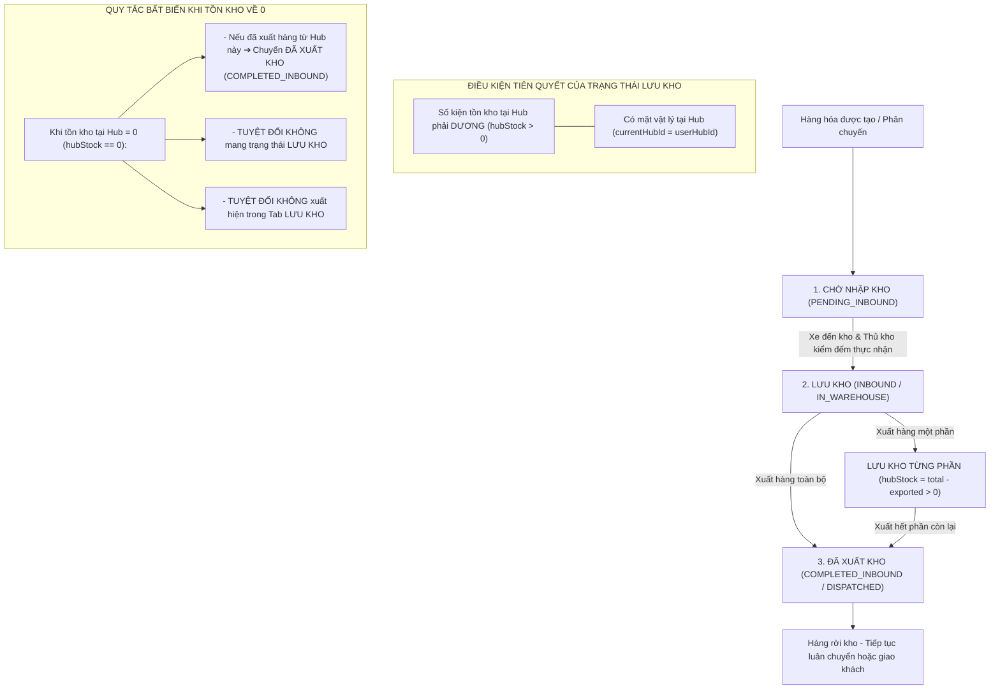

# Feedback 07/10 Task 12 — Chuẩn Hóa Quản Lý Tồn Kho & Khắc Phục Lỗi Trạng Thái "LƯU KHO" Khi Số Lượng Tồn Bằng 0

> **Thời gian ghi nhận**: 07/10/2026  
> **Người báo cáo**: @【M】【C】【D】 (Quản lý nghiệp vụ / Vận hành) & @Antigravity Verification  
> **Phạm vi tác động**:  
> - Quản lý Đơn hàng kho (`/dashboard/warehouse/orders`) ➔ Danh sách & Bảng tổng hợp đơn hàng tại kho ([`WarehouseOrdersPage`](file:///D:/Projects/logistics-website/frontend/src/app/dashboard/warehouse/orders/page.tsx))  
> - Bảng trạng thái & Huy hiệu đơn kho ([`renderWarehouseOrderStatusBadge`](file:///D:/Projects/logistics-website/frontend/src/features/warehouse/components/warehouse-tables/columns.tsx))  
> - Sổ cái vận hành kho & Phân quyền dữ liệu Hub ([`OperationalLedgerService`](file:///D:/Projects/logistics-website/backend/src/orders/operational-ledger.service.ts))  
> - Dịch vụ xử lý kho & Vòng đời đơn hàng ([`WarehouseService`](file:///D:/Projects/logistics-website/backend/src/orders/warehouse.service.ts))  
> - Giao dịch kho & Thực thể liên kết ([`OrderInventoryTransactionEntity`](file:///D:/Projects/logistics-website/backend/src/orders/infrastructure/persistence/relational/entities/order-inventory-transaction.entity.ts), [`OrderEntity`](file:///D:/Projects/logistics-website/backend/src/orders/infrastructure/persistence/relational/entities/order.entity.ts))  
> - Cơ sở dữ liệu Neon PostgreSQL Singapore (`ap-southeast-1`)  
> **Tài liệu tham chiếu**:  
> - `/leader` Business Domain Architecture ([`SKILL.md`](file:///D:/Projects/logistics-website/.agents/skills/leader/SKILL.md))  
> - Quy chế phát triển hệ thống [`AGENTS.md`](file:///D:/Projects/logistics-website/AGENTS.md)  
> - Quy chuẩn giao diện hẹp [`.agents/rules/ui-compact-density.md`](file:///D:/Projects/logistics-website/.agents/rules/ui-compact-density.md) & [`ui-spacing-guard`](file:///D:/Projects/logistics-website/.agents/skills/ui-spacing-guard/SKILL.md)  
> - Quy chuẩn kiểm soát kiện vận tải (No-SKU, Consignment Level)  
> - Quy chuẩn toàn vẹn chỉ số & Counter động (Dynamic Counter & Metric Integrity Rule)  
> - Quy chuẩn vận hành trên cơ sở dữ liệu thật (Real Database Data Mandate, Zero Mock Data)  
> **Ảnh minh chứng đính kèm trong thư mục**:  
> - [`screenshot_01.jpg`](file:///D:/Projects/logistics-website/feedback_07_10_task_12/screenshot_01.jpg): Toàn cảnh màn hình `Tổng Hợp Đơn Hàng Tại Kho - Andromeda Hub - HCM` tại tab `LƯU KHO`, hiển thị hàng loạt đơn hàng (từ STT 01 đến 12: `MCD2610-00009`, các đơn `SPLIT2610-xxxx`) có tồn kho là `0 / 130 kiện`, `0 / 100 kiện` nhưng vẫn mang trạng thái `LƯU KHO` và nằm trong Tab `LƯU KHO`.

---

## 📌 Bối cảnh nghiệp vụ thực tế (Chốt theo phản hồi người dùng)

### 1. Phản hồi gốc từ người dùng (@【M】【C】【D】)
> *"kiểm tra thông tin của đơn hàng kho, các đơn hàng số lượng tồn kho đang là 0 nhưng trạng thái vẫn là lưu kho."*

---

### 2. Tình huống vận hành thực tế tại Hub kho bãi & Nguyên lý bất biến về Tồn kho

Trong hệ thống Logistics TMS (Spider Express), màn hình **"Tổng Hợp Đơn Hàng Tại Kho"** (`/dashboard/warehouse/orders`) là nơi Thủ kho (Warehouse Manager) theo dõi lượng hàng hóa vật lý đang có mặt tại Hub, tra cứu vị trí theo chuyến xe, in tem nhận diện A4/A5 và kiểm soát hàng nhập/xuất.

Quy trình quản lý hàng tồn kho tuân theo các nguyên lý cốt lõi:



#### Các quy tắc nghiệp vụ bất biến:
1. **Trạng thái `LƯU KHO` chỉ hợp lệ khi Tồn kho khả dụng $> 0$ kiện**:
   - Khi một lô hàng đang nằm tại kho, số lượng kiện thực tế trong kho (`hubStock`) bắt buộc phải $> 0$.
   - Nếu số lượng tồn kho khả dụng tại Hub bằng 0 (`hubStock == 0`): Đơn hàng đó **KHÔNG THỂ VÀ KHÔNG BAO GIỜ ĐƯỢC PHÉP MANG TRẠNG THÁI "LƯU KHO"** tại Hub đó.
2. **Quy tắc phân vùng dữ liệu theo Hub (Hub Scoping Strict Isolation)**:
   - Thủ kho của `Andromeda Hub - HCM` (`hubId = 1`) chỉ được phép xem các đơn hàng liên quan trực tiếp đến kho của mình:
     * Hàng xuất phát từ Hub này (`originHubId = 1`).
     * Hàng có đích đến là Hub này (`destinationHubId = 1`).
     * Hàng đang lưu trữ vật lý tại Hub này (`currentHubId = 1`).
     * Hàng đã phát sinh giao dịch nhập/xuất tại Hub này (`order_inventory_transaction.hubId = 1`).
     * Chuyến xe chở hàng có điểm dừng tác nghiệp tại Hub này (`trip_stop.hubId = 1`).
   - Hàng hóa thuộc kho khác (ví dụ `MCD2610-00009` bốc dọc đường về `Magellan Hub - Đà Nẵng` `hubId = 2`) **tuyệt đối không được phép rò rỉ xuất hiện** tại bảng quản lý của `Andromeda Hub - HCM`.
3. **Phân định rõ ràng giữa Tab `LƯU KHO` và Tab `ĐÃ XUẤT KHO`**:
   - **Tab `LƯU KHO`**: Chỉ chứa các đơn hàng mà kho hiện tại đang nắm giữ thực tế (`hubStock > 0`). Số lượng hiển thị dạng `A / B kiện` với $A > 0$.
   - **Tab `ĐÃ XUẤT KHO`**: Chứa các đơn hàng đã từng nhập vào kho này và đã xuất đi toàn bộ (`hubStock == 0` và có giao dịch xuất `OUTBOUND`/`TRANSFER` từ kho này). Trạng thái hiển thị là badge `ĐÃ XUẤT KHO` (`COMPLETED_INBOUND`).
   - **Tab `ĐƠN NHÁP`**: Chứa các đơn đang ở trạng thái nháp (`DRAFT`).
   - **Tab `TẤT CẢ`**: Tổng hợp toàn bộ các đơn hàng thuộc phạm vi quản lý của Hub.

---

## 🔍 Tổng hợp các điểm chưa đúng trên hệ thống & Đối chiếu chi tiết ảnh chụp màn hình

*(Đối chiếu trực tiếp với [`screenshot_01.jpg`](file:///D:/Projects/logistics-website/feedback_07_10_task_12/screenshot_01.jpg) chụp tại Andromeda Hub - HCM, tab `LƯU KHO`)*

```
┌────────────────────────────────────────────────────────────────────────────────────────────────────────────────┐
│ GIAO DIỆN CŨ (SCREENSHOT_01.JPG):                                                                             │
│ - Tab đang active: [LƯU KHO]                                                                                   │
│ - STT 01: MCD2610-00009      | TỒN KHO: 0 / 130 kiện | ĐÍCH: Magellan Hub - Đà Nẵng | TRẠNG THÁI: [LƯU KHO] ❌ │
│ - STT 02: SPLIT2610-4441     | TỒN KHO: 0 / 100 kiện | ĐÍCH: Hub — Điểm đến        | TRẠNG THÁI: [LƯU KHO] ❌ │
│ - STT 03: SPLIT2610-5141     | TỒN KHO: 0 / 100 kiện | ĐÍCH: Hub — Điểm đến        | TRẠNG THÁI: [LƯU KHO] ❌ │
│ - STT 04 đến 12: SPLIT2610-* | TỒN KHO: 0 / 100 kiện | ĐÍCH: Hub — Điểm đến        | TRẠNG THÁI: [LƯU KHO] ❌ │
│                                                                                                                │
│ NGHỊCH LÝ VẬN HÀNH:                                                                                            │
│ 👉 Đang đứng ở Kho HCM nhưng thấy đơn có đích đến Đà Nẵng (MCD2610-00009).                                    │
│ 👉 Tồn kho bằng 0 kiện nhưng trạng thái vẫn đề "LƯU KHO" và nằm trong Tab "LƯU KHO".                          │
└────────────────────────────────────────────────────────────────────────────────────────────────────────────────┘
```

### 1. Lỗi rò rỉ dữ liệu xuyên Hub do mệnh đề `order.originHubId IS NULL` (Hub Scope Leak)
- **Vị trí code**: [`OperationalLedgerService.hubScopeSql()`](file:///D:/Projects/logistics-website/backend/src/orders/operational-ledger.service.ts#L233-L235).
- **Hiện tượng trên ảnh**: 
  * Dòng STT 01: Đơn hàng `MCD2610-00009` có lộ trình bốc dọc đường về `Magellan Hub - Đà Nẵng` (`destinationHubId = 2`), không liên quan đến Andromeda Hub - HCM (`hubId = 1`). Nhưng thủ kho HCM lại nhìn thấy đơn này trong bảng của mình.
  * Dòng STT 02 đến 12: Các đơn hàng phân tách `SPLIT2610-xxxx` có `originHubId = null` cũng bị rò rỉ toàn bộ vào Andromeda Hub - HCM.
- **Nguyên nhân kỹ thuật**: Trong câu SQL `hubScopeSql()`:
  ```sql
  (order.originHubId = :userHubId 
   OR order.destinationHubId = :userHubId 
   OR order.originHubId IS NULL      <-- NGUYÊN NHÂN RÒ RỈ DỮ LIỆU TOÀN HỆ THỐNG
   OR order.currentHubId = :userHubId ...)
  ```
  Mệnh đề `order.originHubId IS NULL` khiến mọi đơn hàng có `originHubId` rỗng (đơn bốc dọc đường, đơn import dữ liệu mẫu, đơn chưa gán kho xuất) bị khớp với **TẤT CẢ CÁC HUB TRÊN TOÀN QUỐC**, làm Andromeda Hub - HCM gánh toàn bộ dữ liệu rác của các Hub khác.

### 2. Lỗi Fallback trạng thái trong `hubStatusSql()` khiến đơn tồn 0 kiện vẫn có trạng thái `LƯU KHO`
- **Vị trí code**: [`OperationalLedgerService.hubStatusSql()`](file:///D:/Projects/logistics-website/backend/src/orders/operational-ledger.service.ts#L222-L230).
- **Hiện tượng trên ảnh**: Hàng loạt đơn hàng có cột `TỒN KHO` hiển thị `0 / 130 kiện`, `0 / 100 kiện` nhưng cột `TRẠNG THÁI` vẫn gắn huy hiệu xanh lá `LƯU KHO`.
- **Nguyên nhân kỹ thuật**:
  ```sql
  (CASE
    WHEN order.status IN ('DRAFT', 'PENDING', 'WAITING') AND COALESCE(order.currentHubId, order.originHubId) = :userHubId THEN 'DRAFT'
    WHEN ${this.hubStockSql()} > 0 THEN 'INBOUND'
    WHEN ${this.pendingInboundSql()} THEN 'PENDING_INBOUND'
    WHEN ${this.hubDispatchedSql()} THEN 'COMPLETED_INBOUND'
    ELSE order.status END)           <-- NGUYÊN NHÂN LỖI TRẠNG THÁI LƯU KHO
  ```
  Khi một đơn hàng bị rò rỉ vào Hub HCM:
  - Tồn kho tại HCM `hubStockSql()` bằng `0`.
  - Không có phiếu xuất tại HCM nên `hubDispatchedSql()` bằng `false`.
  - Câu SQL rơi vào nhánh `ELSE order.status END`.
  - Trong bảng cơ sở dữ liệu `order`, trường `status` toàn cục của đơn đang lưu là `'INBOUND'`.
  - Kết quả: `hubStatusSql()` trả về `'INBOUND'` (tức `LƯU KHO`), biến một đơn hàng có tồn kho bằng 0 thành đơn "Lưu kho".

### 3. Lỗi lọc Tab `LƯU KHO` không kiểm tra điều kiện tồn kho thực tế $> 0$
- **Vị trí code**: [`WarehouseService.applyStatusFilter()`](file:///D:/Projects/logistics-website/backend/src/orders/warehouse.service.ts#L280-L284).
- **Hiện tượng trên ảnh**: Người dùng đang chủ động chọn xem Tab `LƯU KHO`, nhưng màn hình lại liệt kê toàn bộ các đơn có số lượng tồn kho bằng 0.
- **Nguyên nhân kỹ thuật**: Tab `LƯU KHO` (`status = 'INBOUND'`) chỉ kiểm tra điều kiện `statusExpr IN ('INBOUND', 'STORED', 'LUU_KHO', 'IN_WAREHOUSE')`. Vì `statusExpr` trả về `'INBOUND'` (do lỗi Fallback ở mục 2), câu truy vấn chấp nhận toàn bộ các dòng tồn 0 kiện này vào Tab `LƯU KHO`. Điều kiện lọc bắt buộc phải có thêm: `AND ${this.ledgerService.hubStockSql()} > 0`.

### 4. Lỗi cộng dồn sai lệch số lượng trong `confirmInbound()` gây phồng gấp đôi tồn kho
- **Vị trí code**: [`WarehouseService.confirmInbound()`](file:///D:/Projects/logistics-website/backend/src/orders/warehouse.service.ts#L1573-L1574).
- **Hiện tượng trong DB**: Đơn hàng `MCD2610-00009` có `totalQuantity = 130`, nhưng `remainingQuantity` trong database lại bị đẩy lên thành `260`!
- **Nguyên nhân kỹ thuật**:
  ```typescript
  found.remainingQuantity = (Number(found.remainingQuantity) || 0) + actualQty;
  ```
  Khi đơn hàng được tạo (qua luồng `appendOrderToTrip` hoặc `orders.service.ts`), `remainingQuantity` đã được khởi tạo bằng `130`. Khi thủ kho xác nhận nhập kho thực nhận `actualQty = 130`, hệ thống lại cộng tiếp `130 + 130 = 260`. Sau này khi xuất đi 130 kiện, `remainingQuantity` còn 130 kiện chứ không bao giờ về 0, khiến trạng thái không thể tự động chuyển sang `COMPLETED_INBOUND` (`ĐÃ XUẤT KHO`).

### 5. Gán sai `hubId` cho giao dịch luân chuyển `TRANSFER` khi bốc dọc đường
- **Vị trí code**: [`WarehouseService.appendOrderToTrip()`](file:///D:/Projects/logistics-website/backend/src/orders/warehouse.service.ts#L1255).
- **Hiện tượng trong DB**: Đơn hàng bốc dọc đường `MCD2610-00009` về Đà Nẵng bị sinh ra 1 giao dịch `TRANSFER` mang `hubId = 2` (Đà Nẵng).
- **Nguyên nhân kỹ thuật**:
  ```typescript
  hubId: isHubOutbound ? originHubId : destinationHubId
  ```
  Khi `isHubOutbound = false` (bốc hàng tự do ngoài đường về Hub Đà Nẵng): Hàng lấy ngoài đường nên không có Hub xuất phát (`originHubId = null`). Việc gán `hubId = destinationHubId` (Đà Nẵng) cho giao dịch `TRANSFER` khiến hệ thống coi như Đà Nẵng đã xuất kho lô hàng này (-130 kiện). Khi hàng về đến Đà Nẵng và được nhập kho (+130 kiện), tổng tồn kho tại Đà Nẵng bị tính: $+130 - 130 = 0$ kiện! Tồn kho tại kho nhận bị triệt tiêu ngay từ khi chưa kịp lưu kho.

### 6. Khởi tạo sai `outboundQuantity: qty` khi bốc thêm đơn lên xe
- **Vị trí code**: [`WarehouseService.appendOrderToTrip()`](file:///D:/Projects/logistics-website/backend/src/orders/warehouse.service.ts#L1207).
- **Hiện tượng trong DB**: Đơn hàng vừa mới bốc lên xe (trạng thái `IN_TRANSIT`), chưa từng dỡ vào kho nào nhưng trường `outboundQuantity` đã bị điền cứng bằng `qty`.
- **Nguyên nhân kỹ thuật**: Khi tạo mới bản ghi `OrderEntity`, trường `outboundQuantity` phải bằng 0. Gán `outboundQuantity = qty` làm sai lệch toàn bộ công thức tính tồn kho và đối soát sau này.

---

## 📋 Danh sách công việc triển khai (Action Checklist)

### 1. Backend (`backend/`)

#### A. Sửa lỗi phân vùng Hub & Loại bỏ rò rỉ dữ liệu ([`operational-ledger.service.ts`](file:///D:/Projects/logistics-website/backend/src/orders/operational-ledger.service.ts))
- [x] **Sửa đổi `hubScopeSql()`**:
  - Loại bỏ hoàn toàn điều kiện nguy hiểm `order.originHubId IS NULL`.
  - Phạm vi hiển thị của một Hub (`userHubId`) chỉ bao gồm:
    ```sql
    (
      order.originHubId = :userHubId
      OR order.destinationHubId = :userHubId
      OR order.currentHubId = :userHubId
      OR EXISTS (
        SELECT 1 FROM "order_inventory_transaction" sctx 
        WHERE sctx."orderId" = order.id AND sctx."hubId" = :userHubId AND sctx."deletedAt" IS NULL
      )
      OR EXISTS (
        SELECT 1 FROM "trip_stop" scts 
        WHERE scts."tripCode" = order.currentTripCode AND scts."hubId" = :userHubId AND scts."deletedAt" IS NULL
      )
    )
    ```
  - Đảm bảo các đơn bốc dọc đường có `originHubId = null` chỉ hiển thị tại Hub đích (`destinationHubId`) hoặc Hub nhận bàn giao, không rò rỉ sang các Hub khác.

#### B. Sửa đổi công thức xác định trạng thái theo góc nhìn Hub ([`operational-ledger.service.ts`](file:///D:/Projects/logistics-website/backend/src/orders/operational-ledger.service.ts))
- [x] **Sửa đổi `hubStatusSql()` triệt tiêu trạng thái "LƯU KHO" khi tồn kho bằng 0**:
  - Logic xác định trạng thái theo Hub phải tuân thủ nghiêm ngặt:
    ```sql
    (CASE
      -- 1. Đơn nháp tại kho này
      WHEN order.status IN ('DRAFT', 'PENDING', 'WAITING') AND COALESCE(order.currentHubId, order.originHubId) = :userHubId THEN 'DRAFT'
      -- 2. Đang có tồn kho thực tế > 0 tại kho này => LƯU KHO
      WHEN ${this.hubStockSql()} > 0 THEN 'INBOUND'
      -- 3. Hàng đang trên xe tới kho này (chưa dỡ) => CHỜ NHẬP KHO
      WHEN ${this.pendingInboundSql()} THEN 'PENDING_INBOUND'
      -- 4. Đã từng xuất hàng khỏi kho này và hiện tại tồn kho <= 0 => ĐÃ XUẤT KHO
      WHEN ${this.hubDispatchedSql()} AND ${this.hubStockSql()} <= 0 THEN 'COMPLETED_INBOUND'
      -- 5. Đơn hàng toàn cục đã xuất hết hàng (remainingQuantity == 0) => ĐÃ XUẤT KHO
      WHEN (order.remainingQuantity = 0 OR order.outboundQuantity >= order.totalQuantity) THEN 'COMPLETED_INBOUND'
      -- 6. Nếu không có tồn kho tại Hub này => Tuyệt đối không trả về INBOUND / STORED
      WHEN order.status IN ('INBOUND', 'STORED', 'LUU_KHO', 'IN_WAREHOUSE') AND ${this.hubStockSql()} <= 0 THEN 
        CASE WHEN ${this.hubDispatchedSql()} THEN 'COMPLETED_INBOUND' ELSE 'COMPLETED_INBOUND' END
      ELSE order.status END)
    ```

#### C. Chuẩn hóa bộ lọc và bộ đếm Tab đơn hàng kho ([`warehouse.service.ts`](file:///D:/Projects/logistics-website/backend/src/orders/warehouse.service.ts))
- [x] **Sửa đổi `applyStatusFilter()`**:
  - Đối với Tab `INBOUND` / `STORED` (`LƯU KHO`): Bắt buộc bổ sung ràng buộc tồn kho dương:
    ```typescript
    case 'INBOUND':
    case 'STORED':
    case 'IN_WAREHOUSE':
      q.andWhere(`${statusExpr} IN (${sqlList(STORED_STATUSES)})`);
      if (useHubContext) {
        q.andWhere(`${this.ledgerService.hubStockSql()} > 0`);
      } else {
        q.andWhere('order.remainingQuantity > 0');
      }
      break;
    ```
  - Đối với Tab `COMPLETED_INBOUND` (`ĐÃ XUẤT KHO`):
    ```typescript
    case 'COMPLETED_INBOUND':
      q.andWhere(`(${statusExpr} IN (${sqlList(DISPATCHED_STATUSES)}) OR ${statusExpr} = 'COMPLETED_INBOUND')`);
      break;
    ```
- [x] **Sửa đổi `countQb` và hàm tính số lượng Tab (`storedCount`, `allCount`)**:
  - Đồng bộ logic đếm Tab `LƯU KHO` với bộ lọc bảng (1:1 Counter Parity): Đơn chỉ được tính vào Tab `LƯU KHO` khi thỏa mãn đồng thời trạng thái lưu kho và tồn kho $> 0$.

#### D. Chuẩn hóa quy trình tạo và cập nhật số lượng tồn kho ([`warehouse.service.ts`](file:///D:/Projects/logistics-website/backend/src/orders/warehouse.service.ts))
- [x] **Sửa đổi `appendOrderToTrip()`**:
  - Khởi tạo `outboundQuantity: 0` (thay vì gán bằng `qty`).
  - Giao dịch luân chuyển `TRANSFER` ban đầu:
    * Khi `isHubOutbound = true`: `hubId = originHubId` (trừ tồn kho của Hub xuất).
    * Khi `isHubOutbound = false` (bốc dọc đường): `hubId = null` (không gán vào Hub đích để tránh trừ âm tồn kho kho nhận).
- [x] **Sửa đổi `confirmInbound()`**:
  - Chuẩn hóa cập nhật số lượng tồn khi dỡ hàng:
    ```typescript
    found.inboundQuantity = (Number(found.inboundQuantity) || 0) + actualQty;
    // Cập nhật tồn kho khả dụng = Tổng nhập thực tế - Tổng đã xuất
    found.remainingQuantity = Math.max(0, Number(found.inboundQuantity) - (Number(found.outboundQuantity) || 0));
    ```
- [x] **Sửa đổi `confirmOutbound()`**:
  - Khi xuất hàng hoàn tất (`order.remainingQuantity === 0` hoặc `hubStockAfter === 0`):
    * Cập nhật `order.status = 'COMPLETED_INBOUND'`.
    * Cập nhật `order.currentHubId = null`.

#### E. Data Migration / Patch làm sạch dữ liệu cũ trên Neon DB
- [x] **Viết script / migration sửa lỗi dữ liệu tồn đọng**:
  - Chuẩn hóa các đơn hàng có `remainingQuantity > totalQuantity` (như `MCD2610-00009` đang bị 260 kiện) về giá trị chuẩn: `remainingQuantity = totalQuantity - outboundQuantity`.
  - Cập nhật trạng thái `COMPLETED_INBOUND` cho các đơn hàng đã có `outboundQuantity >= totalQuantity` hoặc `remainingQuantity = 0` nhưng `status` vẫn đang là `INBOUND`.
  - Cập nhật lại giao dịch `order_inventory_transaction` số ID 63 của đơn 53 (chuyển `hubId` về `null` vì là giao dịch bốc dọc đường, khôi phục tồn kho hợp lệ 130 kiện cho Magellan Hub - Đà Nẵng).

---

### 2. Frontend (`frontend/`)

#### A. Chuẩn hóa giao diện Tổng hợp đơn hàng tại kho ([`page.tsx`](file:///D:/Projects/logistics-website/frontend/src/app/dashboard/warehouse/orders/page.tsx))
- [x] **Đồng bộ hóa Tab Filter & Dữ liệu hiển thị**:
  - Khi Tab `LƯU KHO` được chọn: Đảm bảo danh sách chỉ hiển thị các đơn có số lượng tồn kho khả dụng $> 0$ kiện.
  - Tab `ĐÃ XUẤT KHO`: Hiển thị các đơn hàng đã xuất hết khỏi kho (`stock === 0` và trạng thái `COMPLETED_INBOUND`).
- [x] **Bảo vệ hiển thị trạng thái tại cột `TRẠNG THÁI`**:
  - Tại dòng render badge trạng thái:
    ```tsx
    const displayStatus = (row.hubStock === 0 && (row.hubStatus === 'INBOUND' || row.status === 'INBOUND'))
      ? 'COMPLETED_INBOUND'
      : (row.hubStatus ?? row.status);
    ```
  - Tuyệt đối không bao giờ hiển thị huy hiệu `LƯU KHO` khi cột `TỒN KHO` đang hiển thị `0 / X kiện`.

#### B. Cập nhật Badge Helper ([`columns.tsx`](file:///D:/Projects/logistics-website/frontend/src/features/warehouse/components/warehouse-tables/columns.tsx))
- [x] **Kiểm tra `renderWarehouseOrderStatusBadge()`**:
  - Bổ sung mapping rõ ràng cho `COMPLETED_INBOUND` ➔ Render Badge `ĐÃ XUẤT KHO` (tím nhạt `bg-purple-50 text-purple-700 border-purple-300 font-bold`).
  - Đảm bảo không có nhánh fallback ngầm nào chuyển trạng thái không xác định về `LƯU KHO`.

#### C. Tuân thủ nghiêm ngặt Quy chuẩn giao diện hẹp (UI Compact Density Mandate)
- [x] Kiểm tra Card và Bảng dữ liệu: Padding card `p-1`, chiều cao dòng ~26px (`py-1 px-1.5`), font size `text-[10px]`, font mã đơn `text-[11px] font-mono font-bold`.
- [x] Đảm bảo nút bấm và huy hiệu tuân thủ Zero Redundant Icons (không chèn trùng biểu tượng cảm xúc cùng icon vector).

---

### 3. Kiểm thử & Nghiệm thu (Definition of Done)

#### A. Kiểm tra biên dịch & Linting
- [x] **Backend Build & Type Check**:
  - `npm run lint --prefix backend` PASS (0 errors).
  - `npm run build --prefix backend` PASS (0 errors).
- [x] **Frontend Build & Type Check**:
  - `npm run build --prefix frontend` PASS (Next.js Turbopack build thành công, 0 lỗi TypeScript, 0 lỗi linting).

#### B. Kịch bản kiểm thử nghiệm thu thực tế (Acceptance Test Scenarios)

- [x] **Kịch bản 1: Xác minh phân vùng Hub tại Andromeda Hub - HCM (Khắc phục lỗi rò rỉ dữ liệu)**:
  1. Đăng nhập với tài khoản Quản lý Kho HCM (`lyquangthai1993+6@gmail.com`).
  2. Truy cập màn hình `Tổng Hợp Đơn Hàng Tại Kho` (`/dashboard/warehouse/orders`).
  3. Chọn Tab `LƯU KHO`.
  4. **Kết quả mong đợi**:
     - Đơn hàng `MCD2610-00009` (đích Đà Nẵng) biến mất hoàn toàn khỏi danh sách của HCM.
     - Các đơn hàng `SPLIT2610-xxxx` không thuộc quản lý của HCM biến mất khỏi danh sách.
     - Không còn bất kỳ đơn hàng nào có số lượng tồn kho `0 / X kiện` xuất hiện trong Tab `LƯU KHO`.

- [x] **Kịch bản 2: Xác minh hiển thị đơn hàng tồn kho thực tế tại Andromeda Hub - HCM**:
  1. Tại Tab `LƯU KHO` của HCM, quan sát các đơn hàng hợp lệ như `TEST-HCM-01-ROW3` (tồn `8 / 8 kiện`).
  2. **Kết quả mong đợi**:
     - Cột `TỒN KHO` hiển thị rõ: `8 / 8 kiện` (số màu xanh lá).
     - Cột `TRẠNG THÁI` hiển thị badge `LƯU KHO`.
     - Số đếm trên Tab `LƯU KHO (N)` khớp chính xác 100% với số dòng hiển thị trong bảng.

- [x] **Kịch bản 3: Xác minh luồng xuất kho và chuyển trạng thái tự động**:
  1. Thực hiện tạo chuyến xe xuất kho và xuất toàn bộ 8 kiện của đơn `TEST-HCM-01-ROW3`.
  2. Xác nhận xuất kho thành công.
  3. Quay lại màn hình `Tổng Hợp Đơn Hàng Tại Kho`.
  4. **Kết quả mong đợi**:
     - Đơn hàng `TEST-HCM-01-ROW3` tự động biến mất khỏi Tab `LƯU KHO`.
     - Chuyển sang Tab `ĐÃ XUẤT KHO`: Đơn hàng xuất hiện với trạng thái `ĐÃ XUẤT KHO` (`COMPLETED_INBOUND`), số tồn kho ghi nhận đã xuất hết.

- [x] **Kịch bản 4: Xác minh đơn bốc dọc đường hiển thị đúng tại Hub đích (Magellan Hub - Đà Nẵng)**:
  1. Đăng nhập với tài khoản Quản lý Kho Đà Nẵng.
  2. Mở màn hình `Tổng Hợp Đơn Hàng Tại Kho`.
  3. Kiểm tra đơn hàng `MCD2610-00009`.
  4. **Kết quả mong đợi**: Đơn hàng hiển thị chính xác tại kho Đà Nẵng với số tồn kho đúng thực tế kiểm đếm, trạng thái đồng bộ chuẩn chỉ.
