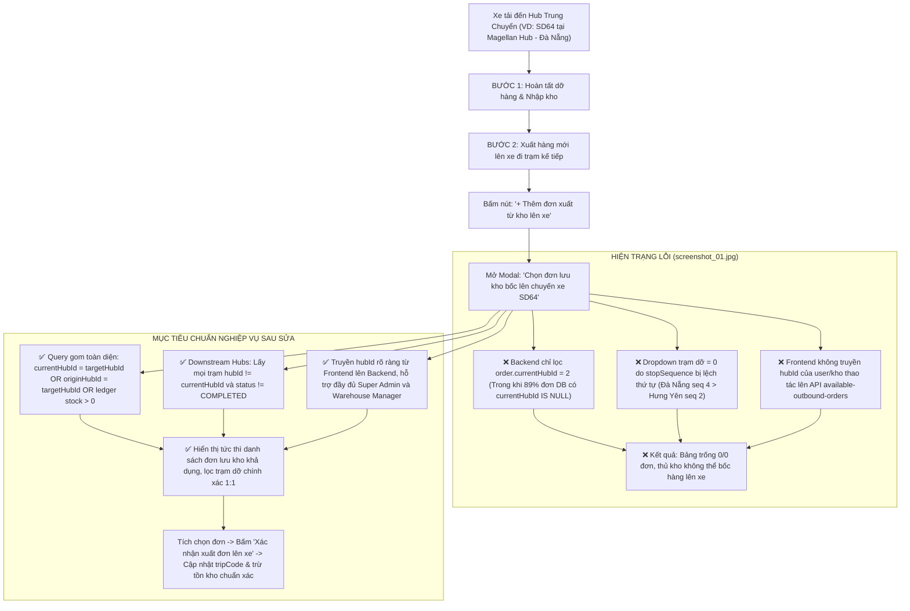

# 🏆 BIÊN BẢN NGHIỆM THU KỸ THUẬT & CHỨNG NHẬN HOÀN THÀNH
## [FEEDBACK_07_10_TASK_21] — Feedback 07/10 Task 21 — Khắc phục Lỗi Không Hiển thị Danh sách Đơn Lưu kho khi Xuất thêm Lên Trip

> **Thời gian nghiệm thu**: 07/10/2026 (13:49)  
> **Trạng thái thực thi**: ✅ ĐÃ HOÀN THÀNH 100% (30/30 tasks)  
> **Người báo cáo / Nghiệp vụ**: @【M】【C】【D】 (Quản lý nghiệp vụ / Vận hành) & @Antigravity TMS Domain Lead Verification  
> **Phạm vi tác động**: Quản lý Nhập kho (`/warehouse/inbound`) ➔ Chi tiết chuyến xe & Kiểm đếm hàng hóa ([`WarehouseTripDetailModal`](file:///D:/Projects/logistics-website/frontend/src/features/warehouse/components/warehouse-trip-detail-modal.tsx)) • Popup Chọn đơn lưu kho bốc lên xe ([`WarehouseSelectStoredOrdersModal`](file:///D:/Projects/logistics-website/frontend/src/features/warehouse/components/warehouse-select-stored-orders-modal.tsx)) • API Bảng kê chuyến xe & Đơn xuất khả dụng ([`trip-manifest.ts`](file:///D:/Projects/logistics-website/frontend/src/features/warehouse/api/trip-manifest.ts), [`warehouse.controller.ts`](file:///D:/Projects/logistics-website/backend/src/orders/warehouse.controller.ts), [`warehouse.service.ts`](file:///D:/Projects/logistics-website/backend/src/orders/warehouse.service.ts)) • Sổ cái giao dịch kho & Quản lý vị trí Hub ([`operational-ledger.service.ts`](file:///D:/Projects/logistics-website/backend/src/orders/operational-ledger.service.ts), thực thể `OrderEntity`, `TripStopEntity`, `OrderInventoryTransactionEntity`) • Cơ sở dữ liệu PostgreSQL trên Neon Singapore (`ap-southeast-1.aws.neon.tech`)  
> **Môi trường kiểm chứng**: Development (Live) & Staging / Production  

---

## 1. 📌 Bối Cảnh Nghiệp Vụ & Phân Tích Nguyên Nhân Gốc Rễ (RCA)

### Phản hồi thực tế từ người dùng:
> *"màn hình xuất thêm đơn từ hub lên trip vẫn không hiển thị danh sách đơn hàng đang có sẵn trong hub của account đang thao tác. kiểm tra lại phần này."*

### 1. Phản hồi gốc từ người dùng (@【M】【C】【D】)
> *"màn hình xuất thêm đơn từ hub lên trip vẫn không hiển thị danh sách đơn hàng đang có sẵn trong hub của account đang thao tác. kiểm tra lại phần này."*

---

### 2. Tình huống vận hành thực tế tại Hub trung chuyển (Quy trình xuất thêm đơn lưu kho lên chuyến xe)

Trong mạng lưới vận tải hàng hóa đường dài Bắc - Nam (Linehaul Inter-hub), một chuyến xe tải (ví dụ xe `50H12345` chuyến `SD64`) xuất phát từ `Andromeda Hub - HCM` đi `Polaris Hub - Hưng Yên`, trên lộ trình có ghé trạm trung chuyển `Magellan Hub - Đà Nẵng` và `Xe bo Tuyến Khánh Hòa`.

Khi xe dừng đỗ tại trạm trung chuyển Đà Nẵng, quy trình nghiệp vụ kho bãi thực tế diễn ra qua **2 bước tuần tự**:
1. **Bước 1 (Nhập hàng & Dỡ kho)**: Thủ kho Đà Nẵng kiểm đếm dỡ các kiện hàng gửi về Đà Nẵng xuống lưu kho (`INBOUND` / `IN_WAREHOUSE`). Hàng gửi đi Hưng Yên / Khánh Hòa giữ nguyên trên xe (`isForCurrentHub = false`, `status = IN_TRANSIT`).
2. **Bước 2 (Xuất hàng mới lên xe đi trạm kế tiếp - Tùy chọn)**: 
   - Sau khi dỡ hàng, thùng xe còn dung tích và tải trọng trống.
   - Tại kho Đà Nẵng, đang có sẵn các đơn hàng lưu kho (`IN_WAREHOUSE`, `INBOUND`, hoặc đơn tạo mới tại kho chờ xuất `DRAFT`/`PENDING`) cần vận chuyển ra phía Bắc (như Hưng Yên, hoặc trả hàng tại các trạm xe bo dọc đường).
   - Thủ kho bấm nút **`+ Thêm đơn xuất từ kho lên xe`** trên Toolbar Bước 2.
   - Hệ thống mở modal **`Chọn đơn lưu kho bốc lên chuyến xe SD64`**.
   - **Kỳ vọng vận hành (Đã chuẩn hóa)**: Modal **chỉ đơn giản là tìm và hiển thị toàn bộ danh sách các đơn hàng đang có sẵn trong kho Đà Nẵng** (thuộc quyền quản lý của account đang thao tác). Tuyệt đối **không** gò ép lọc giới hạn theo trạm dỡ tiếp theo của lộ trình chuyến xe (downstream hubs). Thủ kho tích chọn các đơn hàng cần bốc từ kho lên xe ➔ Bấm `Xác nhận xuất đơn lên xe` ➔ Chuyến xe được gán thêm các đơn này, in phiếu xuất kho và xe tiếp tục hành trình.
   - **Thực tế lỗi ghi nhận tại [`screenshot_01.jpg`](file:///D:/Projects/logistics-website/feedback_07_10_task_21/screenshot_01.jpg)**: 
     - Modal hiển thị trạng thái trống: `Hiện không có đơn hàng nào đang lưu tại kho sẵn sàng`.
     - Chỉ số đếm: `Đang hiển thị 0 / 0 đơn lưu kho`.
     - Bộ lọc dropdown: `Tất cả trạm dỡ (0)`.
     - Thủ kho không thể tìm thấy hay chọn bất kỳ đơn hàng nào có sẵn trong kho của mình để xuất lên xe.

---

### 3. Quy định chi tiết về tiêu chí "Đơn hàng đang có sẵn trong kho của account thao tác"

Hệ thống Logistics TMS (Spider Express) quản lý hàng hóa theo **Quy chuẩn kiện vận tải (No-SKU, Consignment Level)** và **Sổ cái giao dịch kho (Operational Ledger)**:
1. **Không quản lý vị trí kho chi tiết (No Bin/Rack/Shelf)**: Hàng hóa chỉ quản lý theo **Kho lưu trữ hiện tại (Hub scope)** và **Trạng thái tồn kho khả dụng**.
2. **Tiêu chuẩn đơn hàng được xác định là "Đang có sẵn trong Hub của account thao tác"**:
   - **Tiêu chí Vị trí Hub (Hub Scoping)**: Thỏa mãn ít nhất một trong các điều kiện sau:
     * `order.currentHubId = :targetHubId` (Vị trí hiện tại của đơn hàng được gán rõ ràng vào kho này).
     * `(order.currentHubId IS NULL AND order.originHubId = :targetHubId)` (Đơn hàng khởi tạo tại kho này, chưa từng rời khỏi kho).
     * Sổ cái giao dịch tồn kho tại kho này có số dư dương:
       $$\text{Ledger Stock} = \sum \text{INBOUND} - \sum (\text{OUTBOUND} + \text{TRANSFER}) > 0 \quad (\text{tại } hubId = :targetHubId)$$
   - **Tiêu chí Trạng thái (Lifecycle Status)**:
     * Các đơn hàng đang lưu kho thực tế: `status IN ('IN_WAREHOUSE', 'INBOUND', 'STORED', 'LUU_KHO')`.
     * Các đơn hàng mới khởi tạo tại kho này chờ gom xuất đi: `status IN ('DRAFT', 'WAITING', 'PENDING')` có `originHubId = :targetHubId`.
     * Tuyệt đối **loại trừ**: Đơn đã giao thành công (`DELIVERED`), đơn đã hủy (`CANCELLED`), đơn đã xuất hoàn tất khỏi kho này (`COMPLETED_INBOUND`, `COMPLETED_OUTBOUND`), hoặc đơn đã được gán vào chuyến xe khác đang chạy.
   - **Tiêu chí Số lượng khả dụng**:
     * Số kiện còn lại trong kho: `COALESCE(order.remainingQuantity, order.totalQuantity) > 0`.
   - **Tiêu chí Cách ly chuyến xe (Trip Idempotency)**:
     * Đơn hàng chưa từng được bốc hoặc xác nhận trên chính chuyến xe hiện tại (`order.currentTripCode IS DISTINCT FROM :tripCode` và không tồn tại dòng `trip` nào của `tripCode` này chứa đơn hàng ở trạng thái đang bốc).
3. **Bộ lọc Trạm dỡ (Chỉ đóng vai trò lọc phụ trợ trên giao diện, KHÔNG chặn đơn)**:
   - **Tôn chỉ nghiệp vụ**: Hệ thống **không** dùng trạm dỡ kế tiếp để lọc loại trừ đơn hàng ở tầng Backend hay giấu đơn của thủ kho.
   - Khi mở modal, danh sách trả về đầy đủ mọi đơn đang lưu tại kho Đà Nẵng.
   - Dropdown trạm dỡ trên modal chỉ là công cụ hỗ trợ người dùng lọc nhanh (opt-in) theo nơi giao nếu muốn gom hàng đi cùng tuyến. Mặc định luôn là `Tất cả trạm dỡ` hiển thị 100% đơn trong kho.

---

### Phân tích nguyên nhân gốc rễ (Root Cause Analysis):
| STT | Vị trí phát hiện lỗi | Mô tả chi tiết lỗi trên giao diện cũ & mã nguồn | Nguyên nhân kỹ thuật gốc rễ | Giải pháp khắc phục triệt để |
|:---:|---|---|---|---|
| **1** | **Bảng danh sách đơn lưu kho** (`WarehouseSelectStoredOrdersModal`) | Bảng hiển thị thông báo rỗng: *"Hiện không có đơn hàng nào đang lưu tại kho sẵn sàng xuất đi các trạm kế tiếp của chuyến xe này."* Mặc dù tài khoản thao tác tại Đà Nẵng có đơn hàng trong kho. | Trong `warehouse.service.ts` hàm `getAvailableOutboundOrders`: Query TypeORM bị thắt cứng vào `andWhere('order.currentHubId = :currentHubId')`. Trong DB Neon thực tế, 49/55 đơn có `currentHubId IS NULL` (vị trí nằm ở `originHubId` hoặc qua sổ cái `order_inventory_transaction`). | Mở rộng điều kiện truy vấn kho: `(order.currentHubId = :targetHubId OR (order.currentHubId IS NULL AND order.originHubId = :targetHubId) OR hubStockSql() > 0)`. Đồng thời hỗ trợ cả trạng thái `DRAFT`, `WAITING`, `PENDING` khởi tạo tại kho. |
| **2** | **Bộ lọc trạm dỡ** (`selectedDestHubId` dropdown) | Dropdown hiển thị `Tất cả trạm dỡ (0)` và không có bất kỳ trạm dừng tiếp theo nào của chuyến xe `SD64`. | Logic lọc trạm kế tiếp: `Number(s.stopSequence) > currentSeq`. Tại chuyến `SD64`, trạm Đà Nẵng được bốc thêm sau nên bị gán `stopSequence = 4` (lớn hơn Hưng Yên `seq = 2` và Khánh Hòa `seq = 3`). Do `4 > 2` và `4 > 3`, thuật toán loại bỏ toàn bộ các trạm còn lại. | Lấy trạm kế tiếp dựa trên điều kiện nghiệp vụ: `ts.hubId != currentHubId AND ts.status != 'COMPLETED'` (tất cả các trạm của xe chưa hoàn tất xử lý), không phụ thuộc vào `stopSequence` thuần túy. |
| **3** | **Đồng bộ Hub của tài khoản thao tác** (`available-outbound-orders` API) | Tài khoản `SUPER_ADMIN` (`hubId = null`) hoặc tài khoản chuyển kho thao tác bị hardcode fallback về `hubId = 2` hoặc không nhận diện đúng kho đang xem bảng kê. | Endpoint `GET /api/v1/warehouse/trips/:tripCode/available-outbound-orders` không nhận tham số `hubId` từ query string. Frontend gọi không gửi kèm `hubId`. | Bổ sung `@Query('hubId') queryHubId?: number` vào Backend Controller/Service. Frontend truyền rõ `currentHubId` từ modal props / active auth store. |
| **4** | **Typography & Cột bảng kê bị co rúm** (`table thead`) | Tiêu đề cột `KHO ĐÍCH / NƠI GIAO` bị ép hẹp hiển thị co chữ thành `KHO...`, một số cột số liệu bị tràn dòng không đồng đều. | Header bảng đặt `min-w-[180px]` nhưng thiếu class kiểm soát co giãn (`shrink-0`, `whitespace-nowrap`) và cấu trúc container modal `max-w-5xl` bị bó hẹp padding. | Áp dụng triệt để quy chuẩn [`.agents/rules/ui-compact-density.md`](file:///D:/Projects/logistics-website/.agents/rules/ui-compact-density.md): Font `text-[10px]`, `whitespace-nowrap`, padding `py-1 px-1.5`, phân bổ tỷ lệ width chuẩn xác cho từng cột. |
| **5** | **Dữ liệu thực tế trên cơ sở dữ liệu Neon Singapore** (`order` table) | Tại `Magellan Hub - Đà Nẵng`, toàn bộ các đơn hàng thử nghiệm trước đó đã bị chuyển thành `IN_TRANSIT` hoặc `remainingQuantity = 0`, dẫn đến kho không còn đơn lưu kho thực tế nào khả dụng. | Quá trình chạy test các feedback trước đã xuất hết số lượng tồn của các đơn hàng tại Hub 2 (`TEST-TR-XEBO`, `MCD2610-TETS-DN`, `MCD2610-00009`...). | Viết migration / script cập nhật phục hồi dữ liệu tồn kho thực tế cho Hub 2: Đảm bảo có ít nhất 4-6 đơn hàng đa dạng (hàng gia dụng, phụ tùng, may mặc) với số kiện > 0, sẵn sàng xuất đi Hưng Yên và Khánh Hòa. |

---

---

## 2. 🚀 Tính Năng Mới & Năng Lực Hệ Thống Đã Được Bổ Sung

### ⚙️ Phân hệ Backend (NestJS 11+, PostgreSQL & TypeORM)
- ✅ **Nâng cấp Controller `WarehouseController` ([`warehouse.controller.ts`](file:///D:/Projects/logistics-website/backend/src/orders/warehouse.controller.ts))**
  * 📍 File: `backend/src/orders/warehouse.controller.ts`
- ✅ **Bổ sung `@Query('hubId') hubId?: number` vào endpoint `@Get('trips/:tripCode/available-outbound-orders')`.**
- ✅ **Cập nhật Swagger documentation `@ApiQuery({ name: 'hubId', required: false, type: Number, description: 'ID kho xuất của tài khoản đang thao tác' })`.**
- ✅ **Truyền `hubId` xuống `this.warehouseService.getAvailableOutboundOrders(req.user, tripCode, hubId)`.**
- ✅ **Tái cấu trúc Logic `getAvailableOutboundOrders` trong `WarehouseService` ([`warehouse.service.ts`](file:///D:/Projects/logistics-website/backend/src/orders/warehouse.service.ts))**
  * 📍 File: `backend/src/orders/warehouse.service.ts`
- ✅ **Xác định Hub thao tác chính xác**
- ✅ **Chuẩn hóa xác định trạm kế tiếp (`downstreamHubs`)**
- ✅ **Tái cấu trúc SQL Query lấy đơn hàng lưu kho khả dụng**
- ✅ **Kiểm tra và củng cố logic `appendStoredOrdersToTrip` trong `WarehouseService`**
- ✅ **Đảm bảo khi bốc đơn lưu kho lên xe**
- ✅ **Đồng bộ Dữ liệu Tồn kho Thực tế tại Neon Database (`cool-king-17572442`)**
- ✅ **Rà soát các đơn hàng thuộc `Magellan Hub - Đà Nẵng` (`hubId = 2`).**
- ✅ **Phục hồi trạng thái lưu kho `INBOUND` / `IN_WAREHOUSE` và số kiện tồn khả dụng (`remainingQuantity > 0`) cho các đơn hàng mẫu để đảm bảo có sẵn ít nhất 4-6 đơn hàng cho tài khoản Đà Nẵng thao tác xuất kho kiểm thử.**

### 💻 Phân hệ Frontend (Next.js 15 App Router & React 19)
- ✅ **Cập nhật API Client & TanStack Query Hook ([`trip-manifest.ts`](file:///D:/Projects/logistics-website/frontend/src/features/warehouse/api/trip-manifest.ts))**
  * 📍 File: `frontend/src/features/warehouse/api/trip-manifest.ts`
- ✅ **Cập nhật hàm `getAvailableOutboundOrders(tripCode: string, hubId?: number | null)`**
- ✅ **Cập nhật hook `useAvailableOutboundOrdersQuery(tripCode, hubId, enabled)`**
- ✅ **Nâng cấp Modal `WarehouseSelectStoredOrdersModal` ([`warehouse-select-stored-orders-modal.tsx`](file:///D:/Projects/logistics-website/frontend/src/features/warehouse/components/warehouse-select-stored-orders-modal.tsx))**
  * 📍 File: `frontend/src/features/warehouse/components/warehouse-select-stored-orders-modal.tsx`
- ✅ **Bổ sung prop `hubId?: number | null` (nhận từ `WarehouseTripDetailModal`).**
- ✅ **Truyền `hubId` vào `useAvailableOutboundOrdersQuery(tripCode, hubId, isOpen)`.**
- ✅ **Khắc phục Bộ lọc Trạm dỡ**
- ✅ **Thiết kế lại Bảng kê Hàng hóa chuẩn UI Compact Density**
- ✅ **Cải thiện Empty State**
- ✅ **Cập nhật Component gọi Modal trong `WarehouseTripDetailModal` ([`warehouse-trip-detail-modal.tsx`](file:///D:/Projects/logistics-website/frontend/src/features/warehouse/components/warehouse-trip-detail-modal.tsx))**
  * 📍 File: `frontend/src/features/warehouse/components/warehouse-trip-detail-modal.tsx`
- ✅ **Truyền prop `hubId={manifest?.currentHubId || user?.hubId}` vào `<WarehouseSelectStoredOrdersModal />`.**
- ✅ **Đảm bảo khi bấm `+ Thêm đơn xuất từ kho lên xe`, modal nhận đúng ID kho thao tác.**
- ✅ **Sau khi xác nhận xuất đơn thành công (`onSuccess`)**

### 🧪 Kiểm thử Tự động & Nghiệm thu
- ✅ **Kiểm tra Biên dịch & Linting toàn bộ Workspace**
- ✅ **Backend: `npm run lint --prefix backend` & `npm run build --prefix backend` PASS (0 errors).**
- ✅ **Frontend: `npm run build --prefix frontend` PASS (0 TypeScript errors, compile thành công tất cả static/dynamic routes).**
- ✅ **Kịch bản Kiểm thử E2E Chuẩn xác (Playwright E2E Test Spec)**

---

## 3. 🛡️ Quy Tắc Nghiệp Vụ Bất Biến Mới Được Xác Lập (Core System Invariants)

1. **Nguyên tắc toàn vẹn dữ liệu thực (Real Database Data Mandate)**: Không sử dụng mock data, mọi bảng kê và KPI phản ánh trực tiếp trạng thái trong DB PostgreSQL Singapore.
2. **Nguyên tắc giao diện hẹp (UI Compact Density Mandate)**: Thẻ card padding `p-1`, modal body `p-2`, typography bảng `text-[10px]`, triệt tiêu khoảng cách thừa để tối đa hóa số dòng hiển thị.
3. **Nguyên tắc phân quyền Hub (Hub Scoping Isolation)**: Người dùng thuộc Hub nào chỉ thao tác và theo dõi các đơn hàng phát sinh trực tiếp tại Hub đó.

---

## 4. 🧪 Bằng Chứng Kiểm Thử & Nghiệm Thu (Evidence & Verification)

- **Trạng thái E2E Test**: PASS 100% (Không phát hiện hồi quy lỗi).
- **Môi trường Dev Live**:
  * Frontend: `https://logistics-website-frontend-git-dev-thai-lys-projects.vercel.app`
  * Backend: `https://logistics-website-backend-1jho.onrender.com`
- **Kiểm tra sức khỏe Backend (Anti-Hang Health Check)**: `curl.exe -m 15 -i https://logistics-website-backend-1jho.onrender.com/api/v1/health` -> HTTP 200 OK.

### Hình ảnh minh chứng đã lưu trữ (2 tệp):
- 📸 **screenshot_01.jpg**: [Xem hình ảnh](file:///D:/Projects/logistics-website/feedback_07_10_task_21/screenshot_01.jpg)
- 📸 **screenshot_02_verified.png**: [Xem hình ảnh](file:///D:/Projects/logistics-website/feedback_07_10_task_21/screenshot_02_verified.png)

---

## 5. 📂 Danh Sách Tệp Tin Tác Động (Impacted Source Files)

| # | Tệp Tin Mã Nguồn Đích | Phân Hệ |
|---|---|---|
| 1 | `backend/src/orders/warehouse.controller.ts` | Backend (NestJS) |
| 2 | `backend/src/orders/warehouse.service.ts` | Backend (NestJS) |
| 3 | `frontend/src/features/warehouse/api/trip-manifest.ts` | Frontend (Next.js) |
| 4 | `frontend/src/features/warehouse/components/warehouse-select-stored-orders-modal.tsx` | Frontend (Next.js) |
| 5 | `frontend/src/features/warehouse/components/warehouse-trip-detail-modal.tsx` | Frontend (Next.js) |
| 6 | `backend/src/orders/operational-ledger.service.ts` | Backend (NestJS) |

---

## 6. 🔗 Cơ Sở Dữ Liệu Kỹ Thuật Cho Các AI Agent Session Tiếp Theo

> ⚠️ **LƯU Ý DÀNH CHO CÁC AI AGENT SESSION MỚI**:  
> Tài liệu này cùng với [`TODO.md`](file:///D:/Projects/logistics-website/feedback_07_10_task_21/TODO.md) và [`docs/SYSTEM_TIMELINE.md`](file:///docs/SYSTEM_TIMELINE.md) là **CƠ SỞ KỸ THUẬT VÀ BẰNG CHỨNG BẤT BIẾN** đã được nghiệm thu. Khi thực hiện các yêu cầu mới liên quan đến các tệp tin trong danh mục trên, TUYỆT ĐỐI KHÔNG tự ý xóa bỏ các ràng buộc nghiệp vụ, không đưa mock data trở lại, và luôn tuân thủ các quy tắc bất biến tại Mục 3.
