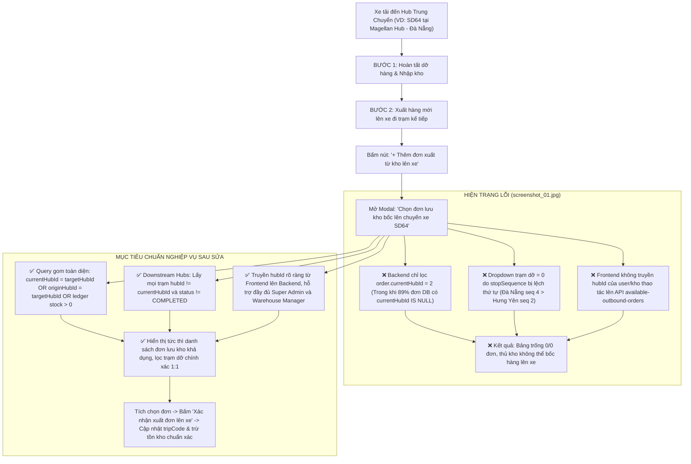

# Feedback 07/10 Task 21 — Khắc phục Lỗi Không Hiển thị Danh sách Đơn Lưu kho khi Xuất thêm Lên Trip

> **Thời gian ghi nhận**: 07/10/2026 (13:49)  
> **Người báo cáo**: @【M】【C】【D】 (Quản lý nghiệp vụ / Vận hành) & @Antigravity TMS Domain Lead Verification  
> **Phạm vi tác động**:  
> - Quản lý Nhập kho (`/warehouse/inbound`) ➔ Chi tiết chuyến xe & Kiểm đếm hàng hóa ([`WarehouseTripDetailModal`](file:///D:/Projects/logistics-website/frontend/src/features/warehouse/components/warehouse-trip-detail-modal.tsx))  
> - Popup Chọn đơn lưu kho bốc lên xe ([`WarehouseSelectStoredOrdersModal`](file:///D:/Projects/logistics-website/frontend/src/features/warehouse/components/warehouse-select-stored-orders-modal.tsx))  
> - API Bảng kê chuyến xe & Đơn xuất khả dụng ([`trip-manifest.ts`](file:///D:/Projects/logistics-website/frontend/src/features/warehouse/api/trip-manifest.ts), [`warehouse.controller.ts`](file:///D:/Projects/logistics-website/backend/src/orders/warehouse.controller.ts), [`warehouse.service.ts`](file:///D:/Projects/logistics-website/backend/src/orders/warehouse.service.ts))  
> - Sổ cái giao dịch kho & Quản lý vị trí Hub ([`operational-ledger.service.ts`](file:///D:/Projects/logistics-website/backend/src/orders/operational-ledger.service.ts), thực thể `OrderEntity`, `TripStopEntity`, `OrderInventoryTransactionEntity`)  
> - Cơ sở dữ liệu PostgreSQL trên Neon Singapore (`ap-southeast-1.aws.neon.tech`)  
> **Tài liệu tham chiếu**:  
> - `/leader` Business Domain Architecture ([`SKILL.md`](file:///D:/Projects/logistics-website/.agents/skills/leader/SKILL.md))  
> - Quy chế phát triển hệ thống [`AGENTS.md`](file:///D:/Projects/logistics-website/AGENTS.md)  
> - Quy chuẩn giao diện hẹp [`.agents/rules/ui-compact-density.md`](file:///D:/Projects/logistics-website/.agents/rules/ui-compact-density.md) & [`ui-spacing-guard`](file:///D:/Projects/logistics-website/.agents/skills/ui-spacing-guard/SKILL.md)  
> - Quy chuẩn kiểm soát kiện vận tải (No-SKU, Consignment Level, Real Database Data Mandate)  
> **Ảnh minh chứng đính kèm trong thư mục**:  
> - [`screenshot_01.jpg`](file:///D:/Projects/logistics-website/feedback_07_10_task_21/screenshot_01.jpg): Minh chứng màn hình thực tế Bước 2 xuất hàng chuyến xe `SD64` tại `Magellan Hub - Đà Nẵng` mở popup `Chọn đơn lưu kho bốc lên chuyến xe SD64` hiển thị danh sách trống (0 / 0 đơn lưu kho), dropdown trạm dỡ rỗng `Tất cả trạm dỡ (0)`.  

---

## 📌 Bối cảnh nghiệp vụ thực tế (Chốt theo phản hồi người dùng)

### 1. Phản hồi gốc từ người dùng (@【M】【C】【D】)
> *"màn hình xuất thêm đơn từ hub lên trip vẫn không hiển thị danh sách đơn hàng đang có sẵn trong hub của account đang thao tác. kiểm tra lại phần này."*

---

### 2. Tình huống vận hành thực tế tại Hub trung chuyển (Quy trình xuất thêm đơn lưu kho lên chuyến xe)

Trong mạng lưới vận tải hàng hóa đường dài Bắc - Nam (Linehaul Inter-hub), một chuyến xe tải (ví dụ xe `50H12345` chuyến `SD64`) xuất phát từ `Andromeda Hub - HCM` đi `Polaris Hub - Hưng Yên`, trên lộ trình có ghé trạm trung chuyển `Magellan Hub - Đà Nẵng` và `Xe bo Tuyến Khánh Hòa`.

Khi xe dừng đỗ tại trạm trung chuyển Đà Nẵng, quy trình nghiệp vụ kho bãi thực tế diễn ra qua **2 bước tuần tự**:
1. **Bước 1 (Nhập hàng & Dỡ kho)**: Thủ kho Đà Nẵng kiểm đếm dỡ các kiện hàng gửi về Đà Nẵng xuống lưu kho (`INBOUND` / `IN_WAREHOUSE`). Hàng gửi đi Hưng Yên / Khánh Hòa giữ nguyên trên xe (`isForCurrentHub = false`, `status = IN_TRANSIT`).
2. **Bước 2 (Xuất hàng mới lên xe đi trạm kế tiếp - Tùy chọn)**: 
   - Sau khi dỡ hàng, thùng xe còn dung tích và tải trọng trống.
   - Tại kho Đà Nẵng, đang có sẵn các đơn hàng lưu kho (`IN_WAREHOUSE`, `INBOUND`, hoặc đơn tạo mới tại kho chờ xuất `DRAFT`/`PENDING`) cần vận chuyển ra phía Bắc (như Hưng Yên, hoặc trả hàng tại các trạm xe bo dọc đường).
   - Thủ kho bấm nút **`+ Thêm đơn xuất từ kho lên xe`** trên Toolbar Bước 2.
   - Hệ thống mở modal **`Chọn đơn lưu kho bốc lên chuyến xe SD64`**.
   - **Kỳ vọng vận hành (Đã chuẩn hóa)**: Modal **chỉ đơn giản là tìm và hiển thị toàn bộ danh sách các đơn hàng đang có sẵn trong kho Đà Nẵng** (thuộc quyền quản lý của account đang thao tác). Tuyệt đối **không** gò ép lọc giới hạn theo trạm dỡ tiếp theo của lộ trình chuyến xe (downstream hubs). Thủ kho tích chọn các đơn hàng cần bốc từ kho lên xe ➔ Bấm `Xác nhận xuất đơn lên xe` ➔ Chuyến xe được gán thêm các đơn này, in phiếu xuất kho và xe tiếp tục hành trình.
   - **Thực tế lỗi ghi nhận tại [`screenshot_01.jpg`](file:///D:/Projects/logistics-website/feedback_07_10_task_21/screenshot_01.jpg)**: 
     - Modal hiển thị trạng thái trống: `Hiện không có đơn hàng nào đang lưu tại kho sẵn sàng`.
     - Chỉ số đếm: `Đang hiển thị 0 / 0 đơn lưu kho`.
     - Bộ lọc dropdown: `Tất cả trạm dỡ (0)`.
     - Thủ kho không thể tìm thấy hay chọn bất kỳ đơn hàng nào có sẵn trong kho của mình để xuất lên xe.



---

### 3. Quy định chi tiết về tiêu chí "Đơn hàng đang có sẵn trong kho của account thao tác"

Hệ thống Logistics TMS (Spider Express) quản lý hàng hóa theo **Quy chuẩn kiện vận tải (No-SKU, Consignment Level)** và **Sổ cái giao dịch kho (Operational Ledger)**:
1. **Không quản lý vị trí kho chi tiết (No Bin/Rack/Shelf)**: Hàng hóa chỉ quản lý theo **Kho lưu trữ hiện tại (Hub scope)** và **Trạng thái tồn kho khả dụng**.
2. **Tiêu chuẩn đơn hàng được xác định là "Đang có sẵn trong Hub của account thao tác"**:
   - **Tiêu chí Vị trí Hub (Hub Scoping)**: Thỏa mãn ít nhất một trong các điều kiện sau:
     * `order.currentHubId = :targetHubId` (Vị trí hiện tại của đơn hàng được gán rõ ràng vào kho này).
     * `(order.currentHubId IS NULL AND order.originHubId = :targetHubId)` (Đơn hàng khởi tạo tại kho này, chưa từng rời khỏi kho).
     * Sổ cái giao dịch tồn kho tại kho này có số dư dương:
       $$\text{Ledger Stock} = \sum \text{INBOUND} - \sum (\text{OUTBOUND} + \text{TRANSFER}) > 0 \quad (\text{tại } hubId = :targetHubId)$$
   - **Tiêu chí Trạng thái (Lifecycle Status)**:
     * Các đơn hàng đang lưu kho thực tế: `status IN ('IN_WAREHOUSE', 'INBOUND', 'STORED', 'LUU_KHO')`.
     * Các đơn hàng mới khởi tạo tại kho này chờ gom xuất đi: `status IN ('DRAFT', 'WAITING', 'PENDING')` có `originHubId = :targetHubId`.
     * Tuyệt đối **loại trừ**: Đơn đã giao thành công (`DELIVERED`), đơn đã hủy (`CANCELLED`), đơn đã xuất hoàn tất khỏi kho này (`COMPLETED_INBOUND`, `COMPLETED_OUTBOUND`), hoặc đơn đã được gán vào chuyến xe khác đang chạy.
   - **Tiêu chí Số lượng khả dụng**:
     * Số kiện còn lại trong kho: `COALESCE(order.remainingQuantity, order.totalQuantity) > 0`.
   - **Tiêu chí Cách ly chuyến xe (Trip Idempotency)**:
     * Đơn hàng chưa từng được bốc hoặc xác nhận trên chính chuyến xe hiện tại (`order.currentTripCode IS DISTINCT FROM :tripCode` và không tồn tại dòng `trip` nào của `tripCode` này chứa đơn hàng ở trạng thái đang bốc).
3. **Bộ lọc Trạm dỡ (Chỉ đóng vai trò lọc phụ trợ trên giao diện, KHÔNG chặn đơn)**:
   - **Tôn chỉ nghiệp vụ**: Hệ thống **không** dùng trạm dỡ kế tiếp để lọc loại trừ đơn hàng ở tầng Backend hay giấu đơn của thủ kho.
   - Khi mở modal, danh sách trả về đầy đủ mọi đơn đang lưu tại kho Đà Nẵng.
   - Dropdown trạm dỡ trên modal chỉ là công cụ hỗ trợ người dùng lọc nhanh (opt-in) theo nơi giao nếu muốn gom hàng đi cùng tuyến. Mặc định luôn là `Tất cả trạm dỡ` hiển thị 100% đơn trong kho.

---

## 🔍 Tổng hợp các điểm chưa đúng trên hệ thống (Đối chiếu `screenshot_01.jpg`)

| STT | Vị trí phát hiện lỗi | Mô tả chi tiết lỗi trên giao diện cũ & mã nguồn | Nguyên nhân kỹ thuật gốc rễ | Giải pháp khắc phục triệt để |
|:---:|---|---|---|---|
| **1** | **Bảng danh sách đơn lưu kho** (`WarehouseSelectStoredOrdersModal`) | Bảng hiển thị thông báo rỗng: *"Hiện không có đơn hàng nào đang lưu tại kho sẵn sàng xuất đi các trạm kế tiếp của chuyến xe này."* Mặc dù tài khoản thao tác tại Đà Nẵng có đơn hàng trong kho. | Trong `warehouse.service.ts` hàm `getAvailableOutboundOrders`: Query TypeORM bị thắt cứng vào `andWhere('order.currentHubId = :currentHubId')`. Trong DB Neon thực tế, 49/55 đơn có `currentHubId IS NULL` (vị trí nằm ở `originHubId` hoặc qua sổ cái `order_inventory_transaction`). | Mở rộng điều kiện truy vấn kho: `(order.currentHubId = :targetHubId OR (order.currentHubId IS NULL AND order.originHubId = :targetHubId) OR hubStockSql() > 0)`. Đồng thời hỗ trợ cả trạng thái `DRAFT`, `WAITING`, `PENDING` khởi tạo tại kho. |
| **2** | **Bộ lọc trạm dỡ** (`selectedDestHubId` dropdown) | Dropdown hiển thị `Tất cả trạm dỡ (0)` và không có bất kỳ trạm dừng tiếp theo nào của chuyến xe `SD64`. | Logic lọc trạm kế tiếp: `Number(s.stopSequence) > currentSeq`. Tại chuyến `SD64`, trạm Đà Nẵng được bốc thêm sau nên bị gán `stopSequence = 4` (lớn hơn Hưng Yên `seq = 2` và Khánh Hòa `seq = 3`). Do `4 > 2` và `4 > 3`, thuật toán loại bỏ toàn bộ các trạm còn lại. | Lấy trạm kế tiếp dựa trên điều kiện nghiệp vụ: `ts.hubId != currentHubId AND ts.status != 'COMPLETED'` (tất cả các trạm của xe chưa hoàn tất xử lý), không phụ thuộc vào `stopSequence` thuần túy. |
| **3** | **Đồng bộ Hub của tài khoản thao tác** (`available-outbound-orders` API) | Tài khoản `SUPER_ADMIN` (`hubId = null`) hoặc tài khoản chuyển kho thao tác bị hardcode fallback về `hubId = 2` hoặc không nhận diện đúng kho đang xem bảng kê. | Endpoint `GET /api/v1/warehouse/trips/:tripCode/available-outbound-orders` không nhận tham số `hubId` từ query string. Frontend gọi không gửi kèm `hubId`. | Bổ sung `@Query('hubId') queryHubId?: number` vào Backend Controller/Service. Frontend truyền rõ `currentHubId` từ modal props / active auth store. |
| **4** | **Typography & Cột bảng kê bị co rúm** (`table thead`) | Tiêu đề cột `KHO ĐÍCH / NƠI GIAO` bị ép hẹp hiển thị co chữ thành `KHO...`, một số cột số liệu bị tràn dòng không đồng đều. | Header bảng đặt `min-w-[180px]` nhưng thiếu class kiểm soát co giãn (`shrink-0`, `whitespace-nowrap`) và cấu trúc container modal `max-w-5xl` bị bó hẹp padding. | Áp dụng triệt để quy chuẩn [`.agents/rules/ui-compact-density.md`](file:///D:/Projects/logistics-website/.agents/rules/ui-compact-density.md): Font `text-[10px]`, `whitespace-nowrap`, padding `py-1 px-1.5`, phân bổ tỷ lệ width chuẩn xác cho từng cột. |
| **5** | **Dữ liệu thực tế trên cơ sở dữ liệu Neon Singapore** (`order` table) | Tại `Magellan Hub - Đà Nẵng`, toàn bộ các đơn hàng thử nghiệm trước đó đã bị chuyển thành `IN_TRANSIT` hoặc `remainingQuantity = 0`, dẫn đến kho không còn đơn lưu kho thực tế nào khả dụng. | Quá trình chạy test các feedback trước đã xuất hết số lượng tồn của các đơn hàng tại Hub 2 (`TEST-TR-XEBO`, `MCD2610-TETS-DN`, `MCD2610-00009`...). | Viết migration / script cập nhật phục hồi dữ liệu tồn kho thực tế cho Hub 2: Đảm bảo có ít nhất 4-6 đơn hàng đa dạng (hàng gia dụng, phụ tùng, may mặc) với số kiện > 0, sẵn sàng xuất đi Hưng Yên và Khánh Hòa. |

---

## 📋 Danh sách công việc triển khai (Action Checklist)

### 1. Backend (`backend/`)

- [x] **Nâng cấp Controller `WarehouseController` ([`warehouse.controller.ts`](file:///D:/Projects/logistics-website/backend/src/orders/warehouse.controller.ts))**:
  - [x] Bổ sung `@Query('hubId') hubId?: number` vào endpoint `@Get('trips/:tripCode/available-outbound-orders')`.
  - [x] Cập nhật Swagger documentation `@ApiQuery({ name: 'hubId', required: false, type: Number, description: 'ID kho xuất của tài khoản đang thao tác' })`.
  - [x] Truyền `hubId` xuống `this.warehouseService.getAvailableOutboundOrders(req.user, tripCode, hubId)`.

- [x] **Tái cấu trúc Logic `getAvailableOutboundOrders` trong `WarehouseService` ([`warehouse.service.ts`](file:///D:/Projects/logistics-website/backend/src/orders/warehouse.service.ts))**:
  - [x] **Xác định Hub thao tác chính xác**:
    * Ưu tiên 1: `queryHubId` truyền từ client lên (nếu hợp lệ).
    * Ưu tiên 2: `userWithHub.hubId` của tài khoản đang đăng nhập.
    * Ưu tiên 3: `trip_stop` của chuyến xe tại trạm đang dừng đỗ.
  - [x] **Chuẩn hóa xác định trạm kế tiếp (`downstreamHubs`)**:
    * Query toàn bộ các trạm dừng trong `trip_stop` của chuyến xe: `WHERE ts."tripCode" = :tripCode AND ts."deletedAt" IS NULL`.
    * Lọc các trạm dỡ kế tiếp khả dụng:
      ```typescript
      const downstreamStops = stops.filter(
        (s) => Number(s.hubId) !== currentHubId && s.status !== 'COMPLETED'
      );
      ```
    * Trường hợp chuyến xe chưa có trạm dừng nào ngoài trạm hiện tại: Tự động lấy các Hub cấp 1/2 trên tuyến vận tải để thủ kho lựa chọn đích đến linh hoạt.
  - [x] **Tái cấu trúc SQL Query lấy đơn hàng lưu kho khả dụng**:
    * Không chỉ dựa vào `order.currentHubId`:
      ```sql
      WHERE order.deletedAt IS NULL
        AND (
          order.currentHubId = :currentHubId
          OR (order.currentHubId IS NULL AND order.originHubId = :currentHubId)
          OR EXISTS (
            SELECT 1 FROM order_inventory_transaction tx 
            WHERE tx."orderId" = order.id 
              AND tx."hubId" = :currentHubId 
              AND tx."deletedAt" IS NULL
          )
        )
        AND (
          order.status IN ('IN_WAREHOUSE', 'INBOUND', 'STORED', 'LUU_KHO')
          OR (order.status IN ('DRAFT', 'WAITING', 'PENDING') AND order.originHubId = :currentHubId)
        )
        AND COALESCE(order.remainingQuantity, order.totalQuantity) > 0
        AND (order.currentTripCode IS NULL OR order.currentTripCode != :tripCode)
      ```
    * Đảm bảo tính toán đúng số lượng tồn khả dụng tại Hub thao tác (`remainingQuantity` phản ánh chính xác số kiện trong kho).
    * `LEFT JOIN` với `originHubEntity` và `destinationHubEntity` để trả về đầy đủ tên trạm gửi, trạm nhận.

- [x] **Kiểm tra và củng cố logic `appendStoredOrdersToTrip` trong `WarehouseService`**:
  - [x] Đảm bảo khi bốc đơn lưu kho lên xe:
    * Cập nhật `order.status = 'IN_TRANSIT'`.
    * Cập nhật `order.currentTripCode = tripCode`.
    * Tạo bản ghi `TripEntity` mới liên kết `tripCode` với `originHubId = currentHubId`.
    * Ghi nhận giao dịch kho `OrderInventoryTransactionEntity` (type: `TRANSFER`, `hubId = currentHubId`, `tripCode = tripCode`, số kiện xuất).
    * Giảm trừ `remainingQuantity` chính xác. Nếu xuất hết ➔ `currentHubId = null`.

- [x] **Đồng bộ Dữ liệu Tồn kho Thực tế tại Neon Database (`cool-king-17572442`)**:
  - [x] Rà soát các đơn hàng thuộc `Magellan Hub - Đà Nẵng` (`hubId = 2`).
  - [x] Phục hồi trạng thái lưu kho `INBOUND` / `IN_WAREHOUSE` và số kiện tồn khả dụng (`remainingQuantity > 0`) cho các đơn hàng mẫu để đảm bảo có sẵn ít nhất 4-6 đơn hàng cho tài khoản Đà Nẵng thao tác xuất kho kiểm thử.

---

### 2. Frontend (`frontend/`)

- [x] **Cập nhật API Client & TanStack Query Hook ([`trip-manifest.ts`](file:///D:/Projects/logistics-website/frontend/src/features/warehouse/api/trip-manifest.ts))**:
  - [x] Cập nhật hàm `getAvailableOutboundOrders(tripCode: string, hubId?: number | null)`:
    * Append query param `?hubId=${hubId}` vào URL khi có giá trị.
  - [x] Cập nhật hook `useAvailableOutboundOrdersQuery(tripCode, hubId, enabled)`:
    * Query key chuẩn hóa: `['warehouse', 'available-outbound-orders', tripCode, hubId]`.
    * Giữ nguyên cấu trúc cache `staleTime: 30 * 1000`.

- [x] **Nâng cấp Modal `WarehouseSelectStoredOrdersModal` ([`warehouse-select-stored-orders-modal.tsx`](file:///D:/Projects/logistics-website/frontend/src/features/warehouse/components/warehouse-select-stored-orders-modal.tsx))**:
  - [x] Bổ sung prop `hubId?: number | null` (nhận từ `WarehouseTripDetailModal`).
  - [x] Truyền `hubId` vào `useAvailableOutboundOrdersQuery(tripCode, hubId, isOpen)`.
  - [x] **Khắc phục Bộ lọc Trạm dỡ**:
    * Render dropdown với dữ liệu thực tế từ API và props:
      ```tsx
      <option value='ALL'>Tất cả trạm dỡ ({rawOrders.length})</option>
      ```
    * Render danh sách trạm kế tiếp rõ ràng: `{h.name} ({matchCount} đơn)`.
    * Xử lý trường hợp đơn hàng chưa gắn trạm nhận: Bổ sung tùy chọn `Chưa gán trạm nhận ({count})` hoặc cho phép xuất đến bất kỳ trạm nào trên tuyến xe.
  - [x] **Thiết kế lại Bảng kê Hàng hóa chuẩn UI Compact Density**:
    * Triệt tiêu lỗi co rúm chữ cột `KHO ĐÍCH / NƠI GIAO`: Sử dụng `min-w-[170px] whitespace-nowrap`.
    * Tuân thủ nghiêm ngặt [`.agents/rules/ui-compact-density.md`](file:///D:/Projects/logistics-website/.agents/rules/ui-compact-density.md):
      - Cỡ chữ ô dữ liệu: `text-[10px]`.
      - Mã vận đơn: `text-[11px] font-mono font-bold text-blue-600`.
      - Chiều cao dòng bảng kê: ~26px (`py-1 px-1.5`).
      - Nút bấm và input tìm kiếm: Chiều cao `h-7 text-[10px]`.
      - Footer hành động: `sticky bottom-0 bg-white dark:bg-slate-900 border-t p-1.5`.
  - [x] **Cải thiện Empty State**:
    * Hiển thị thông báo thân thiện kèm tên Hub: *"Hiện không có đơn hàng nào đang lưu tại kho {currentHubName} sẵn sàng xuất đi các trạm kế tiếp."*

- [x] **Cập nhật Component gọi Modal trong `WarehouseTripDetailModal` ([`warehouse-trip-detail-modal.tsx`](file:///D:/Projects/logistics-website/frontend/src/features/warehouse/components/warehouse-trip-detail-modal.tsx))**:
  - [x] Truyền prop `hubId={manifest?.currentHubId || user?.hubId}` vào `<WarehouseSelectStoredOrdersModal />`.
  - [x] Đảm bảo khi bấm `+ Thêm đơn xuất từ kho lên xe`, modal nhận đúng ID kho thao tác.
  - [x] Sau khi xác nhận xuất đơn thành công (`onSuccess`):
    * Invalidate `['warehouse', 'trip-manifest', tripCode]`.
    * Invalidate `['warehouse', 'available-outbound-orders']`.
    * Invalidate `['warehouse', 'inbound-trips']`.
    * Invalidate `['warehouse', 'orders']`.
    * Invalidate `['warehouse', 'kpi']`.

---

### 3. Kiểm thử & Nghiệm thu (Definition of Done)

- [x] **Kiểm tra Biên dịch & Linting toàn bộ Workspace**:
  - [x] Backend: `npm run lint --prefix backend` & `npm run build --prefix backend` PASS (0 errors).
  - [x] Frontend: `npm run build --prefix frontend` PASS (0 TypeScript errors, compile thành công tất cả static/dynamic routes).

- [x] **Kịch bản Kiểm thử E2E Chuẩn xác (Playwright E2E Test Spec)**:
  - **Mục tiêu**: Tự động hóa và kiểm chứng bằng mắt toàn bộ hành trình Quản lý kho xuất thêm đơn lưu kho lên chuyến xe trung chuyển, giải quyết triệt để lỗi trống danh sách tại `screenshot_01.jpg`.
  - **Tệp kiểm thử**: [`frontend/e2e/36-feedback-07-10-task-21.spec.ts`](file:///D:/Projects/logistics-website/frontend/e2e/36-feedback-07-10-task-21.spec.ts).

  #### 🔄 Quy trình Thao tác Tuần tự Từng Bước (Step-by-Step E2E Action Sequence):
  1. **Bước 1 (Đăng nhập & Điều hướng)**:
     - User: `lyquangthai1993+5@gmail.com` / `123456` (`WAREHOUSE_MANAGER`, phụ trách `Magellan Hub - Đà Nẵng`, `hubId = 2`).
     - Mở trang `/dashboard/warehouse/inbound`.
     - Chờ danh sách bảng điều vận kho tải xong (`waitForSelector('[data-slot="card"]')`).
  2. **Bước 2 (Mở chuyến xe trung chuyển)**:
     - Tìm chuyến xe ghé qua trạm Đà Nẵng (ví dụ `SD64`).
     - Click nút mở chi tiết chuyến xe ➔ Modal `WarehouseTripDetailModal` mở ra (`[data-slot="dialog-content"]`).
  3. **Bước 3 (Chuyển sang Bước 2: Xuất hàng lên xe)**:
     - Click tab/nút `2. Xe xuất kho` (hoặc chuyển sang chế độ Bước 2).
     - Kiểm tra nút hành động `+ Thêm đơn xuất từ kho lên xe` hiển thị và có trạng thái clickable.
  4. **Bước 4 (Mở Modal Chọn đơn lưu kho & Intercept API)**:
     - Lắng nghe request `GET **/api/v1/warehouse/trips/*/available-outbound-orders*`.
     - Click nút `+ Thêm đơn xuất từ kho lên xe`.
     - **Assertion 1 (API Param)**: Kiểm tra URL request bắt buộc chứa param `hubId=2`.
     - **Assertion 2 (API Status)**: Response trả về HTTP `200 OK`, mảng `data` có ít nhất 1 đơn hàng khả dụng.
  5. **Bước 5 (Kiểm tra Giao diện Modal theo Chuẩn UI Mới)**:
     - **Assertion 3 (Modal Width Level 4)**: Khung Modal có class `w-[95vw] sm:max-w-5xl xl:max-w-6xl` (không bị bóp hẹp `max-w-sm` hay `max-w-xl`).
     - **Assertion 4 (Header & Kho xuất)**: Tiêu đề hiển thị `Chọn đơn lưu kho bốc lên chuyến xe...`, subtitle có dòng `Kho xuất: Magellan Hub - Đà Nẵng`.
     - **Assertion 5 (Số lượng đếm)**: Chỉ số đếm hiển thị `Đang hiển thị X / X đơn lưu kho` với $X > 0$ (khắc phục hoàn toàn lỗi `0 / 0` tại `screenshot_01.jpg`).
     - **Assertion 6 (Dropdown Trạm dỡ)**: Dropdown mặc định là `Tất cả trạm dỡ (X)`. Mở dropdown thấy danh sách trạm kế tiếp của tuyến xe (như `Polaris Hub - Hưng Yên`, `Xe bo Tuyến Khánh Hòa...`), không bị rỗng `(0)`.
     - **Assertion 7 (Bảng kê hàng hóa)**: Bảng dữ liệu có đầy đủ các cột (Checkbox, STT, Mã vận đơn, Tên hàng, Số kiện, Kg, Khối, Kho đích, Ghi chú) với font `text-[10px]`, không bị co rúm chữ hay cắt cụt tiêu đề.
  6. **Bước 6 (Tương tác Tích chọn & Reactive Counter)**:
     - Tích chọn checkbox dòng đơn thứ 1 và dòng đơn thứ 2.
     - **Assertion 8 (Live Metric Counter)**: Thanh Sticky Footer cập nhật ngay lập tức (0ms):
       `Đã chọn: 2 đơn | [Tổng kiện] kiện | [Tổng Kg] kg | [Tổng m³] m³`.
     - Nút `Xác nhận xuất đơn lên xe (2 đơn)` sáng màu xanh (`bg-blue-600`), chuyển từ disabled sang enabled.
  7. **Bước 7 (Gửi lệnh Bốc hàng & Xác nhận)**:
     - Lắng nghe request `POST **/api/v1/warehouse/trips/*/append-stored-orders`.
     - Click `Xác nhận xuất đơn lên xe (2 đơn)`.
     - **Assertion 9 (Payload)**: Request body gửi đúng `{ orderIds: [id1, id2], hubId: 2 }`.
     - **Assertion 10 (Toast Success)**: Hiển thị Toast thông báo thành công bằng tiếng Việt.
     - **Assertion 11 (Modal Close)**: Modal `WarehouseSelectStoredOrdersModal` tự động đóng lại.
  8. **Bước 8 (Hậu kiểm Bảng kê & Sổ cái Tồn kho)**:
     - **Assertion 12 (Trip Manifest)**: Bảng kê hàng hóa chuyến xe tải lại và hiển thị 2 đơn hàng vừa bốc thêm.
     - **Assertion 13 (Idempotency)**: Bấm mở lại modal `+ Thêm đơn xuất từ kho lên xe` lần 2 ➔ 2 đơn vừa bốc KHÔNG CÒN xuất hiện trong danh sách đơn lưu kho (đã chuyển thành `IN_TRANSIT`).

---

### 4. 🛡️ Ma Trận Edge Cases Cần Kiểm Thử Toàn Diện (Edge Cases Matrix)

| Mã Case | Tên tình huống biên (Edge Case) | Điều kiện kích hoạt (Trigger Condition) | Hành vi kỳ vọng của hệ thống (Expected Behavior) | Assertion kiểm tra chính xác |
|:---:|---|---|---|---|
| **EC-01** | **Kho rỗng không có hàng lưu (Zero-state)** | Kho Đà Nẵng không có đơn hàng nào đang lưu (`remainingQuantity = 0` hoặc kho mới tinh). | - Hiển thị Empty State rõ ràng: *"Hiện không có đơn hàng nào đang lưu tại kho Magellan Hub - Đà Nẵng sẵn sàng xuất."*<br>- Counter: `0 / 0 đơn lưu kho`.<br>- Nút `Xác nhận xuất đơn` bị disabled.<br>- Không crash React, không văng lỗi console. | `expect(page.locator('text=Hiện không có đơn hàng nào đang lưu tại kho')).toBeVisible()` |
| **EC-02** | **Đơn đã xuất hết sạch kiện (`remainingQuantity = 0`)** | Đơn hàng từng nhập kho Đà Nẵng nhưng đã bốc hết lên các chuyến xe trước đó. | - Hệ thống **tuyệt đối không hiển thị** đơn này trong modal chọn đơn xuất kho.<br>- Chỉ hiển thị đơn có `remainingQuantity > 0`. | API response không chứa bất kỳ order nào có `remainingQuantity <= 0`. |
| **EC-03** | **Cách ly hàng hóa giữa các Hub (Hub Isolation)** | Đơn hàng đang lưu tại `Andromeda Hub - HCM` (`hubId = 1`) hoặc `Polaris Hub - Hưng Yên` (`hubId = 3`). | - Tuyệt đối **không lọt** vào modal của thủ kho Đà Nẵng (`hubId = 2`).<br>- Thủ kho chỉ thấy và xuất đúng hàng hóa đang nằm thực tế tại Hub của mình. | Mọi đơn trong bảng đều có `currentHubId = 2` hoặc `originHubId = 2` (nếu chưa chuyển kho). |
| **EC-04** | **Đơn đã nằm trên chính chuyến xe (Trip Idempotency)** | Đơn hàng đã được bốc lên chuyến `SD64` ở chặng trước hoặc vừa bốc xong. | - Đơn hàng bị loại trừ khỏi modal xuất kho của chuyến `SD64` để tránh gán trùng (duplicate assignment). | `order.currentTripCode !== 'SD64'` trên toàn bộ các dòng modal. |
| **EC-05** | **Đơn hàng chưa gán trạm nhận (`destinationHubId = null`)** | Khách gửi hàng tại kho Đà Nẵng nhưng chọn giao thẳng xe bo dọc đường hoặc chưa chốt trạm Hub nhận cố định. | - Modal **vẫn hiển thị đơn này bình thường**, không bị ẩn hoặc nuốt đơn.<br>- Cột Kho đích hiển thị `Giao dọc đường` hoặc `Chưa gán trạm`. Thủ kho được phép bốc lên xe. | `expect(page.locator('tr:has-text("Mã đơn")')).toBeVisible()` |
| **EC-06** | **Lọc Dropdown Trạm dỡ kế tiếp** | Thủ kho muốn gom hàng đi riêng cho `Polaris Hub - Hưng Yên`. Chọn dropdown = `Polaris Hub - Hưng Yên`. | - Bảng chỉ hiển thị các đơn có đích đến Hưng Yên.<br>- Khi chuyển lại về `Tất cả trạm dỡ` ➔ Bảng phục hồi 100% toàn bộ đơn lưu kho của Đà Nẵng. | Số dòng bảng thay đổi tức thì khớp với số lượng hiển thị trên nhãn dropdown option. |
| **EC-07** | **Tìm kiếm từ khóa tức thì (Live Search Filter)** | Thủ kho gõ mã đơn cụ thể (VD `MCD2610-001`) hoặc tên người nhận vào ô tìm kiếm. | - Bảng lọc realtime (sau debounce 200ms) hiển thị chính xác dòng khớp.<br>- Khi xóa trắng ô input ➔ Bảng trở về danh sách đầy đủ. | `expect(tableRows).toHaveCount(1)` khi gõ mã chính xác. |
| **EC-08** | **Đơn bị Hủy hoặc Đã Giao (`CANCELLED`, `DELIVERED`)** | Đơn hàng trong DB có `status = 'CANCELLED'` hoặc `'DELIVERED'`. | - Tuyệt đối bị loại trừ khỏi truy vấn Backend, không hiển thị cho thủ kho bốc. | Query SQL lọc cứng `order.status NOT IN ('CANCELLED', 'DELIVERED')`. |
| **EC-09** | **Tài khoản Super Admin (`hubId = null`)** | Super Admin đăng nhập mở chuyến xe đang dừng tại trạm Đà Nẵng. | - Modal nhận diện đúng ngữ cảnh `manifest.currentHubId = 2` từ chuyến xe.<br>- Hiển thị trọn vẹn danh sách đơn lưu kho của Đà Nẵng như thủ kho Đà Nẵng. | Param `?hubId=2` vẫn được gửi chuẩn xác lên Backend. |
| **EC-10** | **Bốc một phần số kiện (Partial Outbound / Multi-package)** | Đơn hàng có 20 kiện, xuất đợt 1 là 8 kiện lên chuyến `SD64`. | - `remainingQuantity` giảm từ 20 xuống 12.<br>- Khi mở lại modal cho chuyến sau, đơn vẫn hiển thị với số kiện tồn khả dụng là 12 kiện. | `expect(remainingQuantity).toBe(12)` sau khi bốc 8 kiện. |
