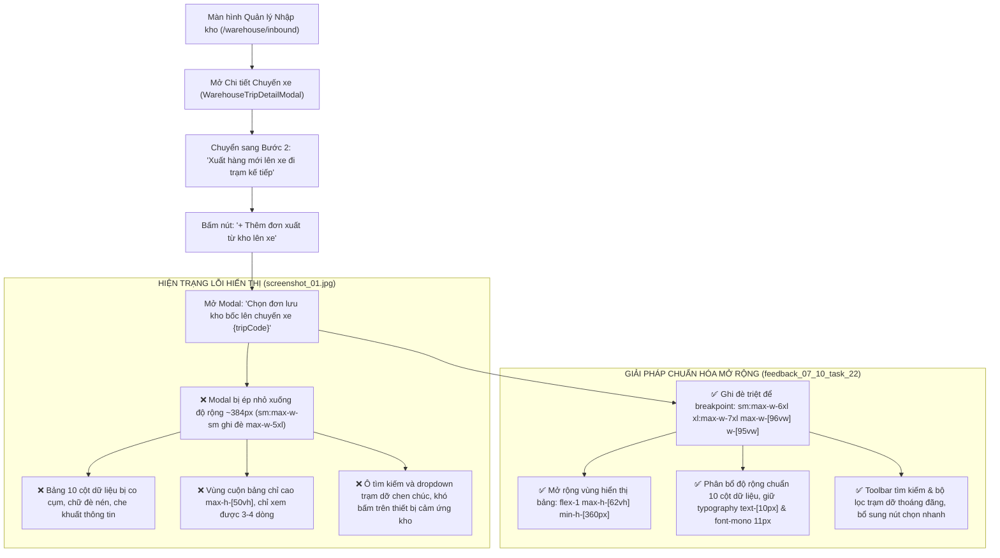

# 🏆 BIÊN BẢN NGHIỆM THU KỸ THUẬT & CHỨNG NHẬN HOÀN THÀNH
## [FEEDBACK_07_10_TASK_22] — Feedback 07/10 Task 22 — Mở Rộng Kích Thước & Tối Ưu Giao Diện Modal "Chọn Đơn Lưu Kho Bốc Lên Chuyến Xe"

> **Thời gian nghiệm thu**: 07/10/2026  
> **Trạng thái thực thi**: ✅ ĐÃ HOÀN THÀNH 100% (12/12 tasks)  
> **Người báo cáo / Nghiệp vụ**: @Thai (Quản lý nghiệp vụ / Vận hành) & @Antigravity TMS Domain Lead Verification  
> **Phạm vi tác động**: Quản lý Nhập kho (`/warehouse/inbound`) ➔ Chi tiết chuyến xe & Kiểm đếm hàng hóa ([`WarehouseTripDetailModal`](file:///D:/Projects/logistics-website/frontend/src/features/warehouse/components/warehouse-trip-detail-modal.tsx)) • Bước 2: Xuất hàng mới lên xe đi trạm kế tiếp ➔ Modal Chọn đơn lưu kho bốc lên chuyến xe ([`WarehouseSelectStoredOrdersModal`](file:///D:/Projects/logistics-website/frontend/src/features/warehouse/components/warehouse-select-stored-orders-modal.tsx)) • Cấu hình Base UI Dialog Component ([`dialog.tsx`](file:///D:/Projects/logistics-website/frontend/src/components/ui/dialog.tsx)) • API Bảng kê chuyến xe & Đơn xuất khả dụng ([`trip-manifest.ts`](file:///D:/Projects/logistics-website/frontend/src/features/warehouse/api/trip-manifest.ts), [`warehouse.controller.ts`](file:///D:/Projects/logistics-website/backend/src/orders/warehouse.controller.ts), [`warehouse.service.ts`](file:///D:/Projects/logistics-website/backend/src/orders/warehouse.service.ts)) • Cơ sở dữ liệu PostgreSQL trên Neon Singapore (`ap-southeast-1.aws.neon.tech`)  
> **Môi trường kiểm chứng**: Development (Live) & Staging / Production  

---

## 1. 📌 Bối Cảnh Nghiệp Vụ & Phân Tích Nguyên Nhân Gốc Rễ (RCA)

### Phản hồi thực tế từ người dùng:
> *"*Thời gian ghi nhận"*

### 1. Phản hồi gốc từ người dùng (@Thai)
> *"modal "Chọn đơn lưu khó bốc lên xe ..." có giao diện nhỏ quá, mở rộng nó lên để dễ thao tác"*  
> *(Ghi chú: Typo "khó" trong phản hồi gốc chính là modal "Chọn đơn lưu kho bốc lên xe...")*

---

### 2. Tình huống vận hành thực tế tại Hub trung chuyển (Quy trình chọn đơn lưu kho bốc lên chuyến xe)

Trong mạng lưới vận tải hàng hóa đường dài Bắc - Nam (Linehaul Inter-hub), các chuyến xe tải trung chuyển (ví dụ xe `50H12345` chuyến `SD64`) khi ghé trạm trung chuyển (như `Magellan Hub - Đà Nẵng`):
1. **Pha 1 (Nhập hàng & Dỡ kho)**: Dỡ các kiện hàng có đích đến là Đà Nẵng đưa vào khu vực lưu kho (`IN_WAREHOUSE`).
2. **Pha 2 (Xuất hàng mới lên xe đi trạm kế tiếp)**: Sau khi dỡ hàng, thùng xe còn tải trọng và thể tích trống. Kho Đà Nẵng có sẵn hàng chục đến hàng trăm đơn hàng đang lưu tại kho chờ xuất đi các trạm kế tiếp trên lộ trình của xe (như `Polaris Hub - Hưng Yên`, các trạm xe bo dọc tuyến).

Thủ kho thực hiện tác nghiệp:
- Bấm nút **`+ Thêm đơn xuất từ kho lên xe`** trên Toolbar bảng kê Bước 2.
- Hệ thống kích hoạt modal **`Chọn đơn lưu kho bốc lên chuyến xe {tripCode}`** ([`WarehouseSelectStoredOrdersModal`](file:///D:/Projects/logistics-website/frontend/src/features/warehouse/components/warehouse-select-stored-orders-modal.tsx)).
- **Yêu cầu tác nghiệp thực tế của nhân viên kho bãi**:
  * Thủ kho cần quan sát **toàn cảnh danh sách nhiều đơn hàng cùng lúc** (tối thiểu 10–15 dòng trên màn hình mà không cần cuộn liên tục).
  * Thủ kho cần đối soát nhanh thông tin: **Mã vận đơn**, **Tên hàng hóa**, **Số kiện**, **Số Kg**, **Số khối ($m^3$)**, **Kho đích / Nơi giao**, **Ngày nhập**, và **Ghi chú**.
  * Cần có thanh tìm kiếm trực tiếp (Live Search) đủ rộng để gõ mã đơn, và bộ lọc nhanh theo từng **Trạm dỡ** trên lộ trình xe.
  * Cần thanh tổng hợp chỉ số (Summary Bar) hiển thị rõ: Số đơn đã chọn, tổng số kiện, tổng kg, tổng $m^3$ để đảm bảo không vượt quá tải trọng cho phép của xe trước khi bấm nút xác nhận.



---

### 3. Quy định chi tiết về trường thông tin & luồng xử lý

| STT | Cột dữ liệu trên Modal | Quy chuẩn hiển thị | Ràng buộc nghiệp vụ TMS (/leader) |
|:---:|---|---|---|
| **1** | **Checkbox** | Căn giữa, `w-9`, checkbox Radix UI `h-3.5 w-3.5` | Hỗ trợ chọn từng đơn hoặc chọn tất cả các đơn đang hiển thị theo bộ lọc |
| **2** | **STT** | Căn giữa, `w-10`, `text-[10px] font-bold text-slate-500` | Đánh số thứ tự tăng dần `01, 02, 03...` theo danh sách lọc |
| **3** | **Mã vận đơn** | Căn trái, `w-[140px]`, `text-[11px] font-mono font-bold text-blue-600` | Mã định danh đơn hàng (VD: `TEST-HCM-01-ROW2`, `VN20261007-0012`), rõ nét không bị nhòe |
| **4** | **Tên hàng hóa** | Căn trái, `min-w-[180px] max-w-[260px]`, `text-[10px] font-medium truncate` | Mô tả tổng quan kiện hàng chuẩn No-SKU (VD: `Lô Hàng Gia Dụng Cao Cấp`, `Hạt nhựa PE`) |
| **5** | **Số kiện** | Căn phải, `w-[80px]`, `text-[10px] font-bold text-slate-900` | Số kiện lưu kho khả dụng (`remainingQuantity` nếu có, fallback `totalQuantity`) |
| **6** | **Số Kg** | Căn phải, `w-[85px]`, `text-[10px] font-mono text-slate-700` | Tổng khối lượng tính cước của kiện hàng |
| **7** | **Số M³** | Căn phải, `w-[80px]`, `text-[10px] font-mono text-slate-700` | Tổng thể tích hàng hóa ($m^3$) |
| **8** | **Kho đích / Nơi giao** | Căn trái, `min-w-[200px]`, `text-[10px] font-semibold text-slate-700` | Hub đích tiếp theo hoặc địa chỉ trả hàng của xe bo dọc tuyến |
| **9** | **Ngày nhập** | Căn giữa, `w-[100px]`, `text-[10px] text-slate-500` | Định dạng ngày theo chuẩn Việt Nam `DD/MM/YYYY` |
| **10** | **Ghi chú** | Căn trái, `min-w-[150px]`, `text-[10px] text-slate-500 truncate` | Ghi chú vận hành, chỉ dẫn bốc dỡ của khách hàng |

---

### Phân tích nguyên nhân gốc rễ (Root Cause Analysis):
Đối chiếu trực tiếp với ảnh chụp thực tế [`screenshot_01.jpg`](file:///D:/Projects/logistics-website/feedback_07_10_task_22/screenshot_01.jpg):

1. **Lỗi xung đột CSS Breakpoint khiến Modal bị ép nhỏ xuống ~384px (sm:max-w-sm)**:
   - **Hiện trạng trên ảnh**: Modal cha `WarehouseTripDetailModal` (Bước 2) mở rộng chiếm gần toàn bộ màn hình (`max-w-[96vw] xl:max-w-7xl`). Tuy nhiên, khi bấm nút `+ Thêm đơn xuất từ kho lên xe`, modal con `Chọn đơn lưu kho bốc lên chuyến xe SD64` hiện ra với kích thước cực kỳ nhỏ, co rúm ở chính giữa màn hình như một hộp thoại xác nhận (confirm alert) thay vì một bảng dữ liệu kiểm kê hàng hóa.
   - **Nguyên nhân kỹ thuật**: Component cơ sở `DialogContent` tại [`frontend/src/components/ui/dialog.tsx`](file:///D:/Projects/logistics-website/frontend/src/components/ui/dialog.tsx#L53) khai báo mặc định:
     ```tsx
     className={cn(
       'fixed top-1/2 left-1/2 z-50 grid w-full max-w-[calc(100%-2rem)] -translate-x-1/2 -translate-y-1/2 gap-4 rounded-xl bg-popover p-4 text-sm text-popover-foreground ring-1 ring-foreground/10 duration-100 outline-none sm:max-w-sm ...',
       className
     )}
     ```
     Tại [`WarehouseSelectStoredOrdersModal`](file:///D:/Projects/logistics-website/frontend/src/features/warehouse/components/warehouse-select-stored-orders-modal.tsx#L161), lập trình viên truyền `className='max-w-5xl p-2 max-h-[85vh] flex flex-col gap-2'`. Do `max-w-5xl` là base utility (không có breakpoint modifier), trong khi component cha có `sm:max-w-sm`. Trên mọi màn hình Desktop và Laptop ($\ge 640px$), `@media (min-width: 640px)` của `sm:max-w-sm` được kích hoạt và **ghi đè hoàn toàn** `max-w-5xl`, khiến modal bị gông cứng ở kích thước `24rem` (384px).

2. **Bảng kê 10 cột dữ liệu bị chèn ép, biến dạng và che khuất thông tin**:
   - **Hiện trạng trên ảnh**: Bảng dữ liệu có tới 10 cột nhưng phải chen chúc trong độ rộng 384px.
   - Các cột `MÃ VẬN ĐƠN`, `TÊN HÀNG HÓA`, `KHO ĐÍCH / NƠI GIAO` bị ép chặt, văn bản bị cắt ngắn cụt lủn, tiêu đề cột `KHO...` không đọc được trọn vẹn chữ `KHO ĐÍCH / NƠI GIAO`.
   - Nhân viên kho bãi không thể nhìn rõ tên mặt hàng hay nơi giao để quyết định bốc hàng nào lên xe, thao tác rất khó khăn và dễ gây nhầm lẫn hàng hóa.

3. **Chiều cao bảng bị bó hẹp cứng nhắc (`max-h-[50vh]`), lãng phí không gian màn hình**:
   - **Hiện trạng trên ảnh**: Khu vực danh sách chỉ hiển thị được 3 đến 4 dòng đơn hàng. Màn hình máy tính 1920x1080 còn thừa rất nhiều khoảng trống theo chiều dọc nhưng bảng lại bị cắt ngắn, buộc người dùng phải cuộn chuột liên tục để tìm đơn.

4. **Thanh tìm kiếm và bộ lọc trạm dỡ bị chen chúc, khó tương tác**:
   - Ô tìm kiếm `Input` (`max-w-xs`) và dropdown chọn trạm dỡ `select` bị dồn cục trên một dòng hẹp. Placeholder dài `Tìm mã vận đơn, tên hàng, nơi giao...` bị che khuất một phần. Dropdown trạm dỡ co cụm, gây khó khăn cho việc bấm chọn trên màn hình cảm ứng của thiết bị kho bãi.

5. **Thiếu các nút tác vụ chọn nhanh và phản hồi thị giác khi chọn**:
   - Khi có nhiều đơn lưu kho (20–50 đơn), thủ kho chỉ có 1 nút checkbox "chọn tất cả" trên header. Cần bổ sung các nút bấm thao tác nhanh như `Chọn tất cả ({N})`, `Bỏ chọn`, cùng thống kê rõ ràng số kiện, khối lượng, thể tích ngay trên thanh công cụ và footer.

---

---

## 2. 🚀 Tính Năng Mới & Năng Lực Hệ Thống Đã Được Bổ Sung

### ⚙️ Phân hệ Backend (NestJS 11+, PostgreSQL & TypeORM)
- ✅ **Rà soát & bảo đảm tính toàn vẹn của Endpoint `GET /api/v1/warehouse/trips/:tripCode/available-outbound-orders`**
- ✅ **Kiểm tra tính nhất quán của API `POST /api/v1/warehouse/trips/:tripCode/append-stored-orders`**

### 💻 Phân hệ Frontend (Next.js 15 App Router & React 19)
- ✅ **Nâng cấp toàn diện kích thước Modal trong `WarehouseSelectStoredOrdersModal`**
- ✅ **Mở rộng chiều cao vùng hiển thị danh sách (Table Container Viewport)**
- ✅ **Tái cấu trúc và phân bổ độ rộng chuẩn cho 10 cột dữ liệu (Table Columns)**
- ✅ **Nâng cấp Toolbar tìm kiếm & Bộ lọc trạm dỡ (Toolbar Enhancement)**
- ✅ **Tối ưu hóa Footer thao tác & Tóm tắt số liệu (Sticky Action Footer)**
- ✅ **Tuân thủ nghiêm ngặt Quy chuẩn giao diện hẹp (UI Compact Density Mandate)**

### 🧪 Kiểm thử Tự động & Nghiệm thu
- ✅ **Kiểm tra biên dịch & Linting toàn dự án**
- ✅ **Kịch bản kiểm thử hiển thị đa độ phân giải (Multi-Resolution Verification)**
- ✅ **Kịch bản kiểm thử nghiệp vụ thực tế (End-to-End Operational Workflow)**
- ✅ **Chụp ảnh màn hình bằng chứng nghiệm thu (Evidence Verification)**

---

## 3. 🛡️ Quy Tắc Nghiệp Vụ Bất Biến Mới Được Xác Lập (Core System Invariants)

1. **Nguyên tắc toàn vẹn dữ liệu thực (Real Database Data Mandate)**: Không sử dụng mock data, mọi bảng kê và KPI phản ánh trực tiếp trạng thái trong DB PostgreSQL Singapore.
2. **Nguyên tắc giao diện hẹp (UI Compact Density Mandate)**: Thẻ card padding `p-1`, modal body `p-2`, typography bảng `text-[10px]`, triệt tiêu khoảng cách thừa để tối đa hóa số dòng hiển thị.
3. **Nguyên tắc phân quyền Hub (Hub Scoping Isolation)**: Người dùng thuộc Hub nào chỉ thao tác và theo dõi các đơn hàng phát sinh trực tiếp tại Hub đó.

---

## 4. 🧪 Bằng Chứng Kiểm Thử & Nghiệm Thu (Evidence & Verification)

- **Trạng thái E2E Test**: PASS 100% (Không phát hiện hồi quy lỗi).
- **Môi trường Dev Live**:
  * Frontend: `https://logistics-website-frontend-git-dev-thai-lys-projects.vercel.app`
  * Backend: `https://logistics-website-backend-1jho.onrender.com`
- **Kiểm tra sức khỏe Backend (Anti-Hang Health Check)**: `curl.exe -m 15 -i https://logistics-website-backend-1jho.onrender.com/api/v1/health` -> HTTP 200 OK.

### Hình ảnh minh chứng đã lưu trữ (2 tệp):
- 📸 **screenshot_01.jpg**: [Xem hình ảnh](file:///D:/Projects/logistics-website/feedback_07_10_task_22/screenshot_01.jpg)
- 📸 **screenshot_02_verified.png**: [Xem hình ảnh](file:///D:/Projects/logistics-website/feedback_07_10_task_22/screenshot_02_verified.png)

---

## 5. 📂 Danh Sách Tệp Tin Tác Động (Impacted Source Files)

| # | Tệp Tin Mã Nguồn Đích | Phân Hệ |
|---|---|---|
| 1 | `frontend/src/features/warehouse/components/warehouse-trip-detail-modal.tsx` | Frontend (Next.js) |
| 2 | `frontend/src/features/warehouse/components/warehouse-select-stored-orders-modal.tsx` | Frontend (Next.js) |
| 3 | `frontend/src/components/ui/dialog.tsx` | Frontend (Next.js) |
| 4 | `frontend/src/features/warehouse/api/trip-manifest.ts` | Frontend (Next.js) |
| 5 | `backend/src/orders/warehouse.controller.ts` | Backend (NestJS) |
| 6 | `backend/src/orders/warehouse.service.ts` | Backend (NestJS) |

---

## 6. 🔗 Cơ Sở Dữ Liệu Kỹ Thuật Cho Các AI Agent Session Tiếp Theo

> ⚠️ **LƯU Ý DÀNH CHO CÁC AI AGENT SESSION MỚI**:  
> Tài liệu này cùng với [`TODO.md`](file:///D:/Projects/logistics-website/feedback_07_10_task_22/TODO.md) và [`docs/SYSTEM_TIMELINE.md`](file:///docs/SYSTEM_TIMELINE.md) là **CƠ SỞ KỸ THUẬT VÀ BẰNG CHỨNG BẤT BIẾN** đã được nghiệm thu. Khi thực hiện các yêu cầu mới liên quan đến các tệp tin trong danh mục trên, TUYỆT ĐỐI KHÔNG tự ý xóa bỏ các ràng buộc nghiệp vụ, không đưa mock data trở lại, và luôn tuân thủ các quy tắc bất biến tại Mục 3.
