# Feedback 07/10 Task 22 — Mở Rộng Kích Thước & Tối Ưu Giao Diện Modal "Chọn Đơn Lưu Kho Bốc Lên Chuyến Xe"

> **Thời gian ghi nhận**: 07/10/2026  
> **Người báo cáo**: @Thai (Quản lý nghiệp vụ / Vận hành) & @Antigravity TMS Domain Lead Verification  
> **Phạm vi tác động**:  
> - Quản lý Nhập kho (`/warehouse/inbound`) ➔ Chi tiết chuyến xe & Kiểm đếm hàng hóa ([`WarehouseTripDetailModal`](file:///D:/Projects/logistics-website/frontend/src/features/warehouse/components/warehouse-trip-detail-modal.tsx))  
> - Bước 2: Xuất hàng mới lên xe đi trạm kế tiếp ➔ Modal Chọn đơn lưu kho bốc lên chuyến xe ([`WarehouseSelectStoredOrdersModal`](file:///D:/Projects/logistics-website/frontend/src/features/warehouse/components/warehouse-select-stored-orders-modal.tsx))  
> - Cấu hình Base UI Dialog Component ([`dialog.tsx`](file:///D:/Projects/logistics-website/frontend/src/components/ui/dialog.tsx))  
> - API Bảng kê chuyến xe & Đơn xuất khả dụng ([`trip-manifest.ts`](file:///D:/Projects/logistics-website/frontend/src/features/warehouse/api/trip-manifest.ts), [`warehouse.controller.ts`](file:///D:/Projects/logistics-website/backend/src/orders/warehouse.controller.ts), [`warehouse.service.ts`](file:///D:/Projects/logistics-website/backend/src/orders/warehouse.service.ts))  
> - Cơ sở dữ liệu PostgreSQL trên Neon Singapore (`ap-southeast-1.aws.neon.tech`)  
> **Tài liệu tham chiếu**:  
> - `/leader` Business Domain Architecture ([`SKILL.md`](file:///D:/Projects/logistics-website/.agents/skills/leader/SKILL.md))  
> - Quy chế phát triển hệ thống [`AGENTS.md`](file:///D:/Projects/logistics-website/AGENTS.md)  
> - Quy chuẩn giao diện hẹp & triệt tiêu khoảng cách thừa [`.agents/rules/ui-compact-density.md`](file:///D:/Projects/logistics-website/.agents/rules/ui-compact-density.md) & [`ui-spacing-guard`](file:///D:/Projects/logistics-website/.agents/skills/ui-spacing-guard/SKILL.md)  
> - Quy chuẩn kiểm soát kiện vận tải (No-SKU, Consignment Level, Real Database Data Mandate)  
> **Ảnh minh chứng đính kèm trong thư mục**:  
> - [`screenshot_01.jpg`](file:///D:/Projects/logistics-website/feedback_07_10_task_22/screenshot_01.jpg): Minh chứng màn hình thực tế Bước 2 xuất hàng chuyến xe `SD64` tại `Magellan Hub - Đà Nẵng` khi bấm nút `+ Thêm đơn xuất từ kho lên xe`. Modal con `Chọn đơn lưu kho bốc lên chuyến xe SD64` bị co rúm thành một hộp thoại hẹp (~384px) ở chính giữa màn hình, bảng kê 10 cột dữ liệu bị chèn ép nghiêm trọng, che khuất tầm nhìn của thủ kho.  

---

## 📌 Bối cảnh nghiệp vụ thực tế (Chốt theo phản hồi người dùng)

### 1. Phản hồi gốc từ người dùng (@Thai)
> *"modal "Chọn đơn lưu khó bốc lên xe ..." có giao diện nhỏ quá, mở rộng nó lên để dễ thao tác"*  
> *(Ghi chú: Typo "khó" trong phản hồi gốc chính là modal "Chọn đơn lưu kho bốc lên xe...")*

---

### 2. Tình huống vận hành thực tế tại Hub trung chuyển (Quy trình chọn đơn lưu kho bốc lên chuyến xe)

Trong mạng lưới vận tải hàng hóa đường dài Bắc - Nam (Linehaul Inter-hub), các chuyến xe tải trung chuyển (ví dụ xe `50H12345` chuyến `SD64`) khi ghé trạm trung chuyển (như `Magellan Hub - Đà Nẵng`):
1. **Pha 1 (Nhập hàng & Dỡ kho)**: Dỡ các kiện hàng có đích đến là Đà Nẵng đưa vào khu vực lưu kho (`IN_WAREHOUSE`).
2. **Pha 2 (Xuất hàng mới lên xe đi trạm kế tiếp)**: Sau khi dỡ hàng, thùng xe còn tải trọng và thể tích trống. Kho Đà Nẵng có sẵn hàng chục đến hàng trăm đơn hàng đang lưu tại kho chờ xuất đi các trạm kế tiếp trên lộ trình của xe (như `Polaris Hub - Hưng Yên`, các trạm xe bo dọc tuyến).

Thủ kho thực hiện tác nghiệp:
- Bấm nút **`+ Thêm đơn xuất từ kho lên xe`** trên Toolbar bảng kê Bước 2.
- Hệ thống kích hoạt modal **`Chọn đơn lưu kho bốc lên chuyến xe {tripCode}`** ([`WarehouseSelectStoredOrdersModal`](file:///D:/Projects/logistics-website/frontend/src/features/warehouse/components/warehouse-select-stored-orders-modal.tsx)).
- **Yêu cầu tác nghiệp thực tế của nhân viên kho bãi**:
  * Thủ kho cần quan sát **toàn cảnh danh sách nhiều đơn hàng cùng lúc** (tối thiểu 10–15 dòng trên màn hình mà không cần cuộn liên tục).
  * Thủ kho cần đối soát nhanh thông tin: **Mã vận đơn**, **Tên hàng hóa**, **Số kiện**, **Số Kg**, **Số khối ($m^3$)**, **Kho đích / Nơi giao**, **Ngày nhập**, và **Ghi chú**.
  * Cần có thanh tìm kiếm trực tiếp (Live Search) đủ rộng để gõ mã đơn, và bộ lọc nhanh theo từng **Trạm dỡ** trên lộ trình xe.
  * Cần thanh tổng hợp chỉ số (Summary Bar) hiển thị rõ: Số đơn đã chọn, tổng số kiện, tổng kg, tổng $m^3$ để đảm bảo không vượt quá tải trọng cho phép của xe trước khi bấm nút xác nhận.

```mermaid
flowchart TD
    A["Màn hình Quản lý Nhập kho (/warehouse/inbound)"] --> B["Mở Chi tiết Chuyến xe (WarehouseTripDetailModal)"]
    B --> C["Chuyển sang Bước 2: 'Xuất hàng mới lên xe đi trạm kế tiếp'"]
    C --> D["Bấm nút: '+ Thêm đơn xuất từ kho lên xe'"]
    D --> E["Mở Modal: 'Chọn đơn lưu kho bốc lên chuyến xe {tripCode}'"]

    subgraph ISSUE ["HIỆN TRẠNG LỖI HIỂN THỊ (screenshot_01.jpg)"]
        E --> F1["❌ Modal bị ép nhỏ xuống độ rộng ~384px (sm:max-w-sm ghi đè max-w-5xl)"]
        F1 --> F2["❌ Bảng 10 cột dữ liệu bị co cụm, chữ đè nén, che khuất thông tin"]
        F1 --> F3["❌ Vùng cuộn bảng chỉ cao max-h-[50vh], chỉ xem được 3-4 dòng"]
        F1 --> F4["❌ Ô tìm kiếm và dropdown trạm dỡ chen chúc, khó bấm trên thiết bị cảm ứng kho"]
    end

    subgraph TARGET ["GIẢI PHÁP CHUẨN HÓA MỞ RỘNG (feedback_07_10_task_22)"]
        E --> G1["✅ Ghi đè triệt để breakpoint: sm:max-w-6xl xl:max-w-7xl max-w-[96vw] w-[95vw]"]
        G1 --> G2["✅ Mở rộng vùng hiển thị bảng: flex-1 max-h-[62vh] min-h-[360px]"]
        G1 --> G3["✅ Phân bổ độ rộng chuẩn 10 cột dữ liệu, giữ typography text-[10px] & font-mono 11px"]
        G1 --> G4["✅ Toolbar tìm kiếm & bộ lọc trạm dỡ thoáng đãng, bổ sung nút chọn nhanh"]
    end
```



---

### 3. Quy định chi tiết về trường thông tin & luồng xử lý

| STT | Cột dữ liệu trên Modal | Quy chuẩn hiển thị | Ràng buộc nghiệp vụ TMS (/leader) |
|:---:|---|---|---|
| **1** | **Checkbox** | Căn giữa, `w-9`, checkbox Radix UI `h-3.5 w-3.5` | Hỗ trợ chọn từng đơn hoặc chọn tất cả các đơn đang hiển thị theo bộ lọc |
| **2** | **STT** | Căn giữa, `w-10`, `text-[10px] font-bold text-slate-500` | Đánh số thứ tự tăng dần `01, 02, 03...` theo danh sách lọc |
| **3** | **Mã vận đơn** | Căn trái, `w-[140px]`, `text-[11px] font-mono font-bold text-blue-600` | Mã định danh đơn hàng (VD: `TEST-HCM-01-ROW2`, `VN20261007-0012`), rõ nét không bị nhòe |
| **4** | **Tên hàng hóa** | Căn trái, `min-w-[180px] max-w-[260px]`, `text-[10px] font-medium truncate` | Mô tả tổng quan kiện hàng chuẩn No-SKU (VD: `Lô Hàng Gia Dụng Cao Cấp`, `Hạt nhựa PE`) |
| **5** | **Số kiện** | Căn phải, `w-[80px]`, `text-[10px] font-bold text-slate-900` | Số kiện lưu kho khả dụng (`remainingQuantity` nếu có, fallback `totalQuantity`) |
| **6** | **Số Kg** | Căn phải, `w-[85px]`, `text-[10px] font-mono text-slate-700` | Tổng khối lượng tính cước của kiện hàng |
| **7** | **Số M³** | Căn phải, `w-[80px]`, `text-[10px] font-mono text-slate-700` | Tổng thể tích hàng hóa ($m^3$) |
| **8** | **Kho đích / Nơi giao** | Căn trái, `min-w-[200px]`, `text-[10px] font-semibold text-slate-700` | Hub đích tiếp theo hoặc địa chỉ trả hàng của xe bo dọc tuyến |
| **9** | **Ngày nhập** | Căn giữa, `w-[100px]`, `text-[10px] text-slate-500` | Định dạng ngày theo chuẩn Việt Nam `DD/MM/YYYY` |
| **10** | **Ghi chú** | Căn trái, `min-w-[150px]`, `text-[10px] text-slate-500 truncate` | Ghi chú vận hành, chỉ dẫn bốc dỡ của khách hàng |

---

## 🔍 Tổng hợp các điểm chưa đúng trên giao diện cũ (Đối chiếu ảnh chụp màn hình)

Đối chiếu trực tiếp với ảnh chụp thực tế [`screenshot_01.jpg`](file:///D:/Projects/logistics-website/feedback_07_10_task_22/screenshot_01.jpg):

1. **Lỗi xung đột CSS Breakpoint khiến Modal bị ép nhỏ xuống ~384px (sm:max-w-sm)**:
   - **Hiện trạng trên ảnh**: Modal cha `WarehouseTripDetailModal` (Bước 2) mở rộng chiếm gần toàn bộ màn hình (`max-w-[96vw] xl:max-w-7xl`). Tuy nhiên, khi bấm nút `+ Thêm đơn xuất từ kho lên xe`, modal con `Chọn đơn lưu kho bốc lên chuyến xe SD64` hiện ra với kích thước cực kỳ nhỏ, co rúm ở chính giữa màn hình như một hộp thoại xác nhận (confirm alert) thay vì một bảng dữ liệu kiểm kê hàng hóa.
   - **Nguyên nhân kỹ thuật**: Component cơ sở `DialogContent` tại [`frontend/src/components/ui/dialog.tsx`](file:///D:/Projects/logistics-website/frontend/src/components/ui/dialog.tsx#L53) khai báo mặc định:
     ```tsx
     className={cn(
       'fixed top-1/2 left-1/2 z-50 grid w-full max-w-[calc(100%-2rem)] -translate-x-1/2 -translate-y-1/2 gap-4 rounded-xl bg-popover p-4 text-sm text-popover-foreground ring-1 ring-foreground/10 duration-100 outline-none sm:max-w-sm ...',
       className
     )}
     ```
     Tại [`WarehouseSelectStoredOrdersModal`](file:///D:/Projects/logistics-website/frontend/src/features/warehouse/components/warehouse-select-stored-orders-modal.tsx#L161), lập trình viên truyền `className='max-w-5xl p-2 max-h-[85vh] flex flex-col gap-2'`. Do `max-w-5xl` là base utility (không có breakpoint modifier), trong khi component cha có `sm:max-w-sm`. Trên mọi màn hình Desktop và Laptop ($\ge 640px$), `@media (min-width: 640px)` của `sm:max-w-sm` được kích hoạt và **ghi đè hoàn toàn** `max-w-5xl`, khiến modal bị gông cứng ở kích thước `24rem` (384px).

2. **Bảng kê 10 cột dữ liệu bị chèn ép, biến dạng và che khuất thông tin**:
   - **Hiện trạng trên ảnh**: Bảng dữ liệu có tới 10 cột nhưng phải chen chúc trong độ rộng 384px.
   - Các cột `MÃ VẬN ĐƠN`, `TÊN HÀNG HÓA`, `KHO ĐÍCH / NƠI GIAO` bị ép chặt, văn bản bị cắt ngắn cụt lủn, tiêu đề cột `KHO...` không đọc được trọn vẹn chữ `KHO ĐÍCH / NƠI GIAO`.
   - Nhân viên kho bãi không thể nhìn rõ tên mặt hàng hay nơi giao để quyết định bốc hàng nào lên xe, thao tác rất khó khăn và dễ gây nhầm lẫn hàng hóa.

3. **Chiều cao bảng bị bó hẹp cứng nhắc (`max-h-[50vh]`), lãng phí không gian màn hình**:
   - **Hiện trạng trên ảnh**: Khu vực danh sách chỉ hiển thị được 3 đến 4 dòng đơn hàng. Màn hình máy tính 1920x1080 còn thừa rất nhiều khoảng trống theo chiều dọc nhưng bảng lại bị cắt ngắn, buộc người dùng phải cuộn chuột liên tục để tìm đơn.

4. **Thanh tìm kiếm và bộ lọc trạm dỡ bị chen chúc, khó tương tác**:
   - Ô tìm kiếm `Input` (`max-w-xs`) và dropdown chọn trạm dỡ `select` bị dồn cục trên một dòng hẹp. Placeholder dài `Tìm mã vận đơn, tên hàng, nơi giao...` bị che khuất một phần. Dropdown trạm dỡ co cụm, gây khó khăn cho việc bấm chọn trên màn hình cảm ứng của thiết bị kho bãi.

5. **Thiếu các nút tác vụ chọn nhanh và phản hồi thị giác khi chọn**:
   - Khi có nhiều đơn lưu kho (20–50 đơn), thủ kho chỉ có 1 nút checkbox "chọn tất cả" trên header. Cần bổ sung các nút bấm thao tác nhanh như `Chọn tất cả ({N})`, `Bỏ chọn`, cùng thống kê rõ ràng số kiện, khối lượng, thể tích ngay trên thanh công cụ và footer.

---

## 📋 Danh sách công việc triển khai (Action Checklist)

### 1. Backend (`backend/`)

- [x] **Rà soát & bảo đảm tính toàn vẹn của Endpoint `GET /api/v1/warehouse/trips/:tripCode/available-outbound-orders`**:
  - File: [`warehouse.controller.ts`](file:///D:/Projects/logistics-website/backend/src/orders/warehouse.controller.ts) & [`warehouse.service.ts`](file:///D:/Projects/logistics-website/backend/src/orders/warehouse.service.ts).
  - Đảm bảo câu lệnh query trả về đầy đủ các trường thông tin cần thiết phục vụ bảng mở rộng:
    * `order.id`, `order.orderCode`, `order.goodsDescription`
    * `order.remainingQuantity`, `order.totalQuantity`
    * `order.totalWeight`, `order.totalVolume`
    * `order.destinationHubId`, `order.destinationHub`, thông tin thực thể `destinationHubEntity` (tên kho đích, mã kho)
    * `order.deliveryAddress`, `order.route`
    * `order.createdAt`, `order.notes`
  - Đảm bảo logic lọc chính xác theo Hub hiện tại của tài khoản (`order.currentHubId = currentHubId`), trạng thái lưu kho hợp lệ (`IN_WAREHOUSE`, `INBOUND`, `STORED`, `LUU_KHO`) và số kiện còn lại $> 0$.
- [x] **Kiểm tra tính nhất quán của API `POST /api/v1/warehouse/trips/:tripCode/append-stored-orders`**:
  - Đảm bảo nhận payload `AppendStoredOrdersDto` (`{ orderIds: number[] }`).
  - Gán chính xác đơn hàng vào chuyến xe (`tripCode`), cập nhật trạng thái đơn thành `IN_TRANSIT`, ghi nhận giao dịch sổ cái kho (`OrderInventoryTransactionEntity` với type `TRANSFER`), đồng thời tính toán lại tổng tải trọng của chuyến xe.

---

### 2. Frontend (`frontend/`)

- [x] **Nâng cấp toàn diện kích thước Modal trong `WarehouseSelectStoredOrdersModal`**:
  - File: [`warehouse-select-stored-orders-modal.tsx`](file:///D:/Projects/logistics-website/frontend/src/features/warehouse/components/warehouse-select-stored-orders-modal.tsx).
  - Thay thế `className` cũ tại `<DialogContent>`:
    ```tsx
    // ❌ CŨ (bị sm:max-w-sm ghi đè):
    <DialogContent className='max-w-5xl p-2 max-h-[85vh] flex flex-col gap-2'>

    // ✅ MỚI (Ghi đè triệt để breakpoint sm, md, xl, mở rộng 95% màn hình):
    <DialogContent className='sm:max-w-6xl xl:max-w-7xl max-w-[96vw] w-[95vw] max-h-[90vh] flex flex-col p-2 gap-2 overflow-hidden'>
    ```
  - Đảm bảo trên các màn hình máy tính bảng (`sm:`), laptop (`md:`, `lg:`) và máy tính bàn (`xl:`, `2xl:`), modal luôn chiếm từ 90% đến 95% chiều rộng khung nhìn (tối đa ~1280px–1400px), mở ra không gian hiển thị rộng rãi, thoáng mắt.
- [x] **Mở rộng chiều cao vùng hiển thị danh sách (Table Container Viewport)**:
  - Tăng chiều cao container chứa bảng dữ liệu từ `max-h-[50vh]` lên:
    ```tsx
    <div className='flex-1 border border-slate-200 dark:border-slate-700 rounded-lg overflow-y-auto max-h-[62vh] min-h-[360px]'>
    ```
  - Giúp thủ kho có thể xem đồng thời 12 đến 16 dòng đơn hàng mà không phải cuộn liên tục.
- [x] **Tái cấu trúc và phân bổ độ rộng chuẩn cho 10 cột dữ liệu (Table Columns)**:
  - Header bảng: `sticky top-0 z-10 bg-slate-100 dark:bg-slate-800 text-[10px] uppercase font-bold py-1 px-1.5`.
  - Phân bổ độ rộng tối ưu:
    * `Checkbox`: `w-9 text-center`
    * `STT`: `w-10 text-center font-bold text-slate-500`
    * `MÃ VẬN ĐƠN`: `w-[140px] font-mono font-bold text-[11px] text-blue-600 dark:text-blue-400`
    * `TÊN HÀNG HÓA`: `min-w-[180px] max-w-[260px] font-medium text-slate-800 dark:text-slate-200 truncate`
    * `SỐ KIỆN`: `w-[80px] text-right font-bold text-slate-900 dark:text-white`
    * `SỐ KG`: `w-[85px] text-right font-mono text-slate-700 dark:text-slate-300`
    * `SỐ M³`: `w-[80px] text-right font-mono text-slate-700 dark:text-slate-300`
    * `KHO ĐÍCH / NƠI GIAO`: `min-w-[200px] font-semibold text-slate-700 dark:text-slate-300`
    * `NGÀY NHẬP`: `w-[100px] text-center text-slate-500`
    * `GHI CHÚ`: `min-w-[150px] text-slate-500 truncate`
  - Đảm bảo văn bản hiển thị đầy đủ, không bị cắt cụt hay vỡ layout.
- [x] **Nâng cấp Toolbar tìm kiếm & Bộ lọc trạm dỡ (Toolbar Enhancement)**:
  - Mở rộng ô tìm kiếm Live Search lên `w-72 md:w-80`, bổ sung nút xóa nhanh khi có từ khóa.
  - Dropdown chọn trạm dỡ (`downstreamHubs`) thiết kế sắc nét với padding gọn gàng, hiển thị rõ số lượng đơn khả dụng tương ứng từng trạm.
  - Hiển thị badge thống kê rõ ràng: `Đang hiển thị {filteredOrders.length} / {rawOrders.length} đơn lưu kho`.
- [x] **Tối ưu hóa Footer thao tác & Tóm tắt số liệu (Sticky Action Footer)**:
  - Giữ cố định `sticky bottom-0 bg-white dark:bg-slate-900 border-t border-slate-200 dark:border-slate-800 p-1.5`.
  - Hiển thị nổi bật số liệu đã chọn:
    `Đã chọn: X đơn hàng (Tổng cộng: Y kiện • Z kg • W m³)`
  - Nút bấm thao tác rõ ràng:
    * Nút `Hủy`: `variant="outline"`, `h-7.5 text-xs`.
    * Nút `Xác nhận xuất X đơn lên xe`: `bg-[#0F3D62] text-white font-bold h-7.5 text-xs`, có icon `<IconTruckLoading />`, tuân thủ nguyên tắc Zero Redundant Icons.
- [x] **Tuân thủ nghiêm ngặt Quy chuẩn giao diện hẹp (UI Compact Density Mandate)**:
  - Tuyệt đối không sinh bất kỳ class bị cấm nào (`p-4`, `p-6`, `space-y-3`, `gap-4`).
  - Toàn bộ padding modal body: `p-2`, table data cells: `py-1 px-1.5`, cỡ chữ: `text-[10px]`, mã vận đơn: `text-[11px] font-mono font-bold`.

---

### 3. Kiểm thử & Nghiệm thu (Definition of Done)

- [x] **Kiểm tra biên dịch & Linting toàn dự án**:
  - Backend: `npm run lint --prefix backend` & `npm run build --prefix backend` PASS (0 errors, 0 warnings).
  - Frontend: `npm run build --prefix frontend` PASS (TypeScript check passed, Next.js build passed, 0 errors).
- [x] **Kịch bản kiểm thử hiển thị đa độ phân giải (Multi-Resolution Verification)**:
  - **Màn hình Full HD (1920x1080)**: Modal mở rộng đạt độ rộng chuẩn (~1200px–1350px), bảng 10 cột hiển thị đầy đủ, không xuất hiện thanh cuộn ngang không cần thiết, chiều cao hiển thị được 14–16 dòng.
  - **Màn hình Laptop phổ thông (1366x768)**: Modal chiếm 95vw, hiển thị vừa vặn trong khung nhìn mà không tràn khỏi màn hình, thanh cuộn dọc hoạt động mượt mà.
  - **Màn hình Tablet (1024x768)**: Modal tự động co giãn linh hoạt, thanh cuộn ngang nội bộ bảng xuất hiện an toàn khi thiếu diện tích.
- [x] **Kịch bản kiểm thử nghiệp vụ thực tế (End-to-End Operational Workflow)**:
  1. Đăng nhập tài khoản Quản lý kho Đà Nẵng (`Magellan Hub - Đà Nẵng`).
  2. Vào trang `/warehouse/inbound`, mở chi tiết chuyến xe `SD64` (hoặc chuyến xe trung chuyển tương đương).
  3. Chuyển sang Bước 2 (`Xuất hàng mới lên xe đi trạm kế tiếp`).
  4. Bấm nút `+ Thêm đơn xuất từ kho lên xe`.
  5. **Kiểm tra kích thước modal**: Modal mở to rộng rãi, giao diện rõ ràng, thoáng mắt.
  6. **Kiểm tra dữ liệu**: Toàn bộ 10 cột dữ liệu hiển thị sắc nét, tên hàng và nơi giao không bị co cụm.
  7. **Kiểm tra bộ lọc & tìm kiếm**: Gõ từ khóa tìm kiếm và chọn dropdown trạm dỡ, danh sách đơn cập nhật tức thì.
  8. **Kiểm tra thao tác chọn & xuất**: Tích chọn 2 đơn hàng ➔ Footer cập nhật chính xác tổng kiện, kg, $m^3$ ➔ Bấm `Xác nhận xuất 2 đơn lên xe` ➔ Đơn được thêm vào chuyến xe thành công và modal đóng lại.
- [x] **Chụp ảnh màn hình bằng chứng nghiệm thu (Evidence Verification)**:
  - Lưu ảnh chụp giao diện modal sau khi đã mở rộng thành công vào thư mục `feedback_07_10_task_22/` để làm bằng chứng nghiệm thu đối chiếu với [`screenshot_01.jpg`](file:///D:/Projects/logistics-website/feedback_07_10_task_22/screenshot_01.jpg).
