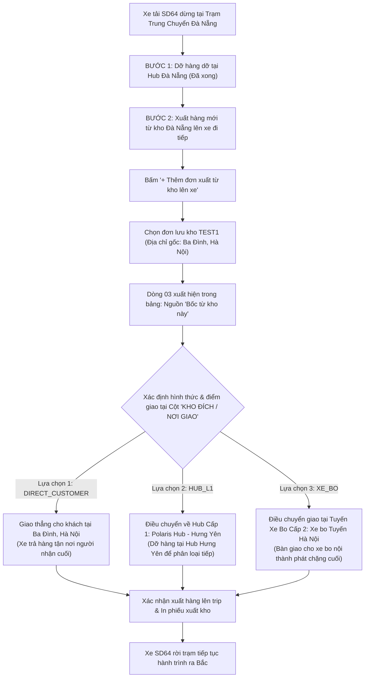

# Feedback 07/10 Task 24 — Tùy biến Hình thức & Địa chỉ Giao nhận (Khách / Hub Cấp 1 / Tuyến Xe Bo) Cho Đơn Hàng Xuất Mới Lên Chuyến Xe Tại Trạm Trung Chuyển

> **Thời gian ghi nhận**: 07/10/2026  
> **Người báo cáo**: @【M】【C】【D】 (Quản lý nghiệp vụ & Vận hành Logistics TMS)  
> **Phạm vi tác động**:  
> - Quản lý Nhập kho (`/warehouse/inbound`) ➔ Chi tiết chuyến xe & Điều phối trung chuyển ([`WarehouseTripDetailModal`](file:///D:/Projects/logistics-website/frontend/src/features/warehouse/components/warehouse-trip-detail-modal.tsx)) — **Bước 2: Xuất hàng mới lên xe đi trạm kế tiếp (`OUTBOUND STAGE`)**  
> - Popup Chọn đơn lưu kho xuất lên chuyến xe ([`WarehouseSelectStoredOrdersModal`](file:///D:/Projects/logistics-website/frontend/src/features/warehouse/components/warehouse-select-stored-orders-modal.tsx))  
> - Modal Chọn đích xuất kho điều chuyển ([`WarehouseDestinationModal`](file:///D:/Projects/logistics-website/frontend/src/features/warehouse/components/warehouse-destination-modal.tsx))  
> - Lưới xuất kho chuẩn tham chiếu ([`WarehouseEditableGrid`](file:///D:/Projects/logistics-website/frontend/src/features/warehouse/components/warehouse-editable-grid.tsx))  
> - Backend Quản lý Kho vận & Điều phối Chuyến xe ([`WarehouseService`](file:///D:/Projects/logistics-website/backend/src/orders/warehouse.service.ts), [`WarehouseController`](file:///D:/Projects/logistics-website/backend/src/orders/warehouse.controller.ts), [`OrderEntity`](file:///D:/Projects/logistics-website/backend/src/orders/infrastructure/persistence/relational/entities/order.entity.ts), [`TripEntity`](file:///D:/Projects/logistics-website/backend/src/trips/infrastructure/persistence/relational/entities/trip.entity.ts), [`TripStopEntity`](file:///D:/Projects/logistics-website/backend/src/trips/infrastructure/persistence/relational/entities/trip-stop.entity.ts))  
> **Tài liệu tham chiếu**:  
> - `/leader` Business Domain Architecture ([`SKILL.md`](file:///D:/Projects/logistics-website/.agents/skills/leader/SKILL.md)) — Mục *TWO-TIER HUB HIERARCHY & DELIVERY DESTINATION MODES (QUY TẮC PHÂN TẦNG MẠNG LƯỚI HUB & HÌNH THỨC GIAO HÀNG)*  
> - Quy chế phát triển hệ thống [`AGENTS.md`](file:///D:/Projects/logistics-website/AGENTS.md)  
> - Quy chuẩn giao diện hẹp [`.agents/rules/ui-compact-density.md`](file:///D:/Projects/logistics-website/.agents/rules/ui-compact-density.md) & [`ui-spacing-guard`](file:///D:/Projects/logistics-website/.agents/skills/ui-spacing-guard/SKILL.md)  
> - Quy chuẩn kiện vận tải (No-SKU, Consignment Level)  
> **Ảnh minh chứng đính kèm trong thư mục**:  
> - [`screenshot_01.jpg`](file:///D:/Projects/logistics-website/feedback_07_10_task_24/screenshot_01.jpg): Chi tiết chuyến xe liên tỉnh `SD64` tại trạm trung chuyển `Magellan Hub - Đà Nẵng` (màn hình Bước 2: Xuất hàng mới lên xe đi trạm kế tiếp). Tại bảng tổng hợp hàng hóa tiếp tục hành trình trên xe, đơn hàng xuất mới từ kho `TEST1` (STT `03`, huy hiệu `Bốc từ kho này`) đang có cột `KHO ĐÍCH / NƠI GIAO` hiển thị mặc định địa chỉ giao khách `BA ĐÌNH HÀ NỘI` (khoanh đỏ), dạng văn bản tĩnh (read-only), không cho phép thủ kho chọn giao tại Hub trung chuyển hay Tuyến xe bo như ở màn hình xuất kho thông thường.

---

## 📌 Bối cảnh nghiệp vụ thực tế (Chốt theo phản hồi người dùng)

### 1. Phản hồi gốc từ người dùng (@【M】【C】【D】)
> *"tại màn hình xuất thêm hàng lên trip, sau khi chọn đơn sẽ tạo ra 1 dòng mới tỏng danh sách như hình, tuy nhiên phần địa chỉ giao đang để mặc định là địa chỉ giao khách. Chố khoanh đỏ này tôi muốn địa chỉ giao của đơn hàng thêm mới này mình có thể chọn hoặc giao cho khách, hoặc giao tại các hub, xe bo giống như màn hình xuất kho bình thường."*

---

### 2. Tình huống vận hành thực tế tại Hub trung chuyển đường dài (Quy trình Xuất thêm hàng lên Trip)

Trong mạng lưới vận tải hàng hóa đường dài Bắc - Nam (Linehaul Inter-hub), một chuyến xe tải (ví dụ xe `50H-123.45`, chuyến `SD64`) xuất phát từ `Andromeda Hub - HCM` đi `Polaris Hub - Hưng Yên`, trên lộ trình dừng đỗ tại trạm trung chuyển `Magellan Hub - Đà Nẵng`.

Sau khi hoàn tất **Bước 1: Nhập hàng & Dỡ kho** (kiểm đếm dỡ các kiện hàng dỡ tại Đà Nẵng), chuyến xe bước sang **Bước 2: Xuất hàng mới lên xe đi trạm kế tiếp (Outbound Stage)**. Tại bước này:
1. Thùng xe đã có chỗ trống sau khi dỡ hàng. Thủ kho Đà Nẵng mở kho kiểm tra các đơn hàng đang lưu kho (`IN_WAREHOUSE` tại Đà Nẵng) cần gửi ra các trạm phía Bắc.
2. Thủ kho bấm nút **"+ Thêm đơn xuất từ kho lên xe"** ➔ Mở modal [`WarehouseSelectStoredOrdersModal`](file:///D:/Projects/logistics-website/frontend/src/features/warehouse/components/warehouse-select-stored-orders-modal.tsx) ➔ Tích chọn đơn hàng lưu kho (ví dụ đơn máy móc `TEST1`, 5 kiện, 1.000 kg, 8 m³).
3. Bấm xác nhận, đơn `TEST1` được bốc lên chuyến xe và xuất hiện thành dòng mới trong bảng kê Bước 2 với huy hiệu xanh **`Bốc từ kho này`** (như hiển thị tại dòng 03 trong ảnh [`screenshot_01.jpg`](file:///D:/Projects/logistics-website/feedback_07_10_task_24/screenshot_01.jpg)).



---

### 3. Vấn đề cốt lõi: Tại sao đơn thêm mới BẮT BUỘC phải cho chọn Hub / Xe bo / Giao khách?

1. **Bản chất của đơn hàng lưu kho**:
   - Khi một đơn hàng lưu kho được tạo ban đầu (hoặc nhập từ chặng trước), thông tin địa chỉ trên vận đơn thường là **địa chỉ người nhận cuối cùng của khách hàng** (ví dụ: `BA ĐÌNH HÀ NỘI`).
   - Do đó, khi đơn được bốc lên chuyến xe trung chuyển đường dài `SD64`, cột `KHO ĐÍCH / NƠI GIAO` hiện tại đang lấy mặc định chuỗi text `BA ĐÌNH HÀ NỘI`.
2. **Xung đột nghiệp vụ vận tải trung chuyển**:
   - Chuyến xe `SD64` là **xe tải đường dài liên tỉnh (Linehaul)** chạy theo tuyến cố định: `HCM → Khánh Hòa → Đà Nẵng → Hưng Yên`. Xe lớn **không đi vào từng ngõ ngách nội thành Ba Đình - Hà Nội** để giao tận nơi cho từng khách lẻ!
   - Trên thực tế vận hành kho bãi:
     * **Trường hợp A (Trung chuyển Hub Cấp 1 - `HUB_L1`)**: Kiện hàng máy móc `TEST1` này sẽ được chở ra và dỡ xuống tại **`Polaris Hub - Hưng Yên`** (Tổng kho trung tâm miền Bắc) để phân loại và luân chuyển tiếp. Đích đến trên chuyến xe này phải là **`Polaris Hub - Hưng Yên`**.
     * **Trường hợp B (Bàn giao Tuyến Xe Bo - `XE_BO`)**: Kiện hàng được bàn giao cho trạm vệ tinh / xe bo tuyến như **`Xe bo Tuyến Hà Nội`** để gom và chạy nội đô phát hàng. Đích đến trên chuyến xe này phải là **`Xe bo Tuyến Hà Nội`**.
     * **Trường hợp C (Khách tự nhận / Giao thẳng - `DIRECT_CUSTOMER`)**: Trong trường hợp khách hẹn nhận hàng dọc quốc lộ hoặc xe tải có thể giao thẳng tới kho lớn của khách ở Ba Đình Hà Nội, thủ kho chọn giao tận nơi cho khách.
3. **Hệ quả nghiêm trọng nếu để mặc định text tĩnh `BA ĐÌNH HÀ NỘI` (như hiện tại)**:
   - Hệ thống không gắn được `destinationHubId` cho chuyến xe (`TripEntity`), khiến bảng kê lộ trình trạm dừng (`TripStopEntity`) không nhận diện được trạm nào xe cần dỡ hàng.
   - Khi xe `SD64` đến `Polaris Hub - Hưng Yên`, màn hình kiểm đếm nhập kho của thủ kho Hưng Yên sẽ **không thấy đơn `TEST1`** trong danh sách hàng dỡ tại kho này (do `destinationHubId` bị null hoặc không khớp ID kho Hưng Yên), dẫn đến thất lạc đơn hàng hoặc sai lệch biên bản giao nhận.
   - Vì vậy, việc cho phép thủ kho Đà Nẵng linh hoạt chọn **hoặc giao khách, hoặc giao Hub Cấp 1, hoặc giao Tuyến Xe Bo** ngay tại dòng đơn mới thêm (giống như màn hình xuất kho bình thường) là **yêu cầu nghiệp vụ sống còn** để đảm bảo tính liên tục của luồng vận tải đa chặng.

---

### 4. Quy chuẩn 3 Hình thức Giao nhận đối chiếu Màn hình Xuất kho Chuẩn (`WarehouseEditableGrid`)

Căn cứ theo quy định tại Skill [`leader`](file:///D:/Projects/logistics-website/.agents/skills/leader/SKILL.md) (mục *Two-tier Hub Hierarchy & Delivery Destination Modes*) và mã nguồn chuẩn tại [`WarehouseEditableGrid`](file:///D:/Projects/logistics-website/frontend/src/features/warehouse/components/warehouse-editable-grid.tsx):

| Hình thức giao nhận (`deliveryMode`) | Loại điểm đến | Cơ chế hiển thị trên dòng bảng kê | Hành động & Tương tác người dùng | Dữ liệu lưu trữ Backend |
|---|---|---|---|---|
| **`DIRECT_CUSTOMER`** (Giao thẳng / Khách nhận) | Người nhận lẻ tận nơi | Hiển thị địa chỉ khách hàng (ví dụ: `BA ĐÌNH HÀ NỘI`), đi kèm nút bấm **`[IconMapPin] Thay đổi địa chỉ (Điều chuyển)`** | Cho phép sửa tay địa chỉ giao nhận khách hoặc bấm nút điều chuyển để chuyển sang chọn Hub / Xe bo | `destinationHubId = null`<br>`destinationHub = null`<br>`deliveryAddress = customerAddress` |
| **`HUB_L1`** (Hub Cấp 1 - Trung chuyển) | Trung tâm trung chuyển khu vực chính (`level = 1`) | Huy hiệu màu xanh dương **`[Hub Cấp 1]`** nổi bật + Tên Hub đích (ví dụ: `Polaris Hub - Hưng Yên`) | Có nút **`Đổi kho đích khác...`** (mở modal chọn lại) và nút **`Quay lại địa chỉ thường`** (khôi phục lại địa chỉ khách ban đầu) | `destinationHubId = hub.id`<br>`destinationHub = hub.name`<br>`deliveryAddress = hub.name` |
| **`XE_BO`** (Tuyến Xe Bo - Vệ tinh) | Điểm giao nhận / tuyến xe bo vệ tinh (`level = 2`) | Huy hiệu màu tím **`[Tuyến Xe Bo]`** nổi bật + Tên tuyến xe bo (ví dụ: `Xe bo Tuyến Hà Nội`) | Có nút **`Đổi kho đích khác...`** (mở modal chọn lại) và nút **`Quay lại địa chỉ thường`** (khôi phục lại địa chỉ khách ban đầu) | `destinationHubId = hub.id`<br>`destinationHub = hub.name`<br>`deliveryAddress = hub.name` |

---

## 🔍 Tổng hợp các điểm chưa đúng trên giao diện cũ (Đối chiếu screenshot_01.jpg)

Dựa trên phân tích mã nguồn thực tế và đối chiếu trực tiếp với ảnh chụp màn hình [`screenshot_01.jpg`](file:///D:/Projects/logistics-website/feedback_07_10_task_24/screenshot_01.jpg):

```
┌───────────────────────────────────────────────────────────────────────────────────────────────────────────────────────┐
│ ẢNH CHỤP MÀN HÌNH FEEDBACK: screenshot_01.jpg (Màn hình Bước 2: Xuất hàng mới lên xe đi trạm kế tiếp)                 │
├───────────────────────────────────────────────────────────────────────────────────────────────────────────────────────┤
│ STT  MÃ VẬN ĐƠN      NGUỒN HÀNG          TÊN HÀNG HÓA  SỐ KIỆN  SỐ KG  SỐ M³  KHO ĐÍCH / NƠI GIAO             GHI CHÚ │
│ 01   TEST-SD64-TR1   Trung chuyển đi tiếp Bách hóa     20       150    0.65   Polaris Hub - Hưng Yên          —       │
│ 02   TEST-SD64-TR2   Trung chuyển đi tiếp Điện gia dụng 30      200    0.90   Polaris Hub - Hưng Yên          —       │
│ 03   TEST1           Bốc từ kho này       MÁY MÓC       5        1.000  8.00  [ BA ĐÌNH HÀ NỘI ]  <-- KHOANH ĐỎ LỖI   │
└───────────────────────────────────────────────────────────────────────────────────────────────────────────────────────┘
```

1. **Cột "KHO ĐÍCH / NƠI GIAO" bị đóng cứng dạng văn bản tĩnh (Read-only)**:
   - **Hiện trạng trên code** ([`warehouse-trip-detail-modal.tsx#L1207-L1211`](file:///D:/Projects/logistics-website/frontend/src/features/warehouse/components/warehouse-trip-detail-modal.tsx#L1207-L1211)):
     ```tsx
     <td className='py-1 px-1.5 text-slate-700 dark:text-slate-300 font-semibold'>
       {l.destinationHub || l.deliveryAddress || 'Chưa xác định'}
     </td>
     ```
   - **Điểm chưa đúng**: Không có bất kỳ thành phần tương tác nào (nút chọn, dropdown, modal trigger) cho phép người dùng click để thay đổi địa chỉ hay chuyển đổi hình thức giao hàng.
2. **Mặc định hiển thị địa chỉ khách lẻ mà không có tùy chọn phân luồng**:
   - Khi bốc đơn `TEST1` từ kho Đà Nẵng lên xe đi tiếp ra Bắc, hệ thống tự động gán text địa chỉ giao khách ban đầu (`BA ĐÌNH HÀ NỘI`), làm mất đi khả năng khai báo đơn này sẽ dỡ tại `Polaris Hub - Hưng Yên` hay dỡ tại `Xe bo Tuyến Hà Nội`.
3. **Thiếu liên kết với `WarehouseDestinationModal` trong Bước 2**:
   - Hệ thống đã có sẵn component [`WarehouseDestinationModal`](file:///D:/Projects/logistics-website/frontend/src/features/warehouse/components/warehouse-destination-modal.tsx) rất trực quan (chia rõ 2 tab Hub Cấp 1 màu xanh và Tuyến Xe Bo màu tím, có live search, có nút quay lại địa chỉ gốc), đang hoạt động rất tốt tại màn hình xuất kho bình thường (`WarehouseEditableGrid`), nhưng hoàn toàn chưa được tích hợp vào Bước 2 của [`WarehouseTripDetailModal`](file:///D:/Projects/logistics-website/frontend/src/features/warehouse/components/warehouse-trip-detail-modal.tsx).
4. **Thiếu cơ chế lưu vết "Địa chỉ khách ban đầu" (`originalDeliveryAddress`)**:
   - Nếu thủ kho đổi đích đến sang Hub Cấp 1 (`Polaris Hub - Hưng Yên`), địa chỉ khách gốc (`BA ĐÌNH HÀ NỘI`) bị ghi đè hoàn toàn nếu không được lưu vào trường `originalDeliveryAddress`. Khi thủ kho muốn "Quay lại địa chỉ khách thường", hệ thống sẽ bị mất thông tin địa chỉ giao ban đầu của khách.
5. **Backend chưa có endpoint chuyên biệt để cập nhật đích đến của đơn đã gán trên chuyến xe**:
   - Khi đơn đã bốc lên chuyến xe (`append-stored-orders`), nếu thủ kho thay đổi đích đến của dòng đơn trên bảng Bước 2, Backend cần một endpoint chuyên trách (`PATCH /api/v1/warehouse/trips/:tripCode/orders/:orderId/destination`) để cập nhật đồng bộ cả thực thể `TripEntity` và `OrderEntity`, đồng thời kiểm tra và bổ sung trạm dừng `TripStopEntity` trên lộ trình chuyến xe nếu cần thiết.

---

## 📋 Danh sách công việc triển khai (Action Checklist)

### 🎯 1. Backend (`backend/`)

- [x] **Tạo DTO `UpdateTripOrderDestinationDto`** ([`backend/src/orders/dto/update-trip-order-destination.dto.ts`](file:///D:/Projects/logistics-website/backend/src/orders/dto/update-trip-order-destination.dto.ts)):
  - [x] Khai báo `deliveryMode`: Enum `'DIRECT_CUSTOMER' | 'HUB_L1' | 'XE_BO'` (Bắt buộc).
  - [x] Khai báo `destinationHubId`: `number | null` (Bắt buộc khi `HUB_L1` hoặc `XE_BO`; gán `null` khi `DIRECT_CUSTOMER`).
  - [x] Khai báo `deliveryAddress`: `string | null` (Địa chỉ giao khách hoặc tên Hub/Xe bo).
  - [x] Khai báo `notes`: `string` tùy chọn.
  - [x] Thiết lập Swagger annotations (`@ApiProperty`, `@ApiPropertyOptional`) và class-validator (`@IsEnum`, `@IsOptional`, `@IsInt`, `@IsString`).
- [x] **Bổ sung API Endpoint trong `WarehouseController`** ([`backend/src/orders/warehouse.controller.ts`](file:///D:/Projects/logistics-website/backend/src/orders/warehouse.controller.ts)):
  - [x] Thêm route `@Patch('trips/:tripCode/orders/:orderId/destination')`.
  - [x] Áp dụng RBAC Guard: `@Roles(RoleEnum.SUPER_ADMIN, RoleEnum.WAREHOUSE_MANAGER)`.
  - [x] Document Swagger `@ApiOperation({ summary: 'Cập nhật hình thức giao hàng và đích đến cho đơn bốc lên chuyến xe (Giao khách, Hub Cấp 1, Tuyến Xe Bo)' })`.
- [x] **Triển khai Business Logic trong `WarehouseService`** ([`backend/src/orders/warehouse.service.ts`](file:///D:/Projects/logistics-website/backend/src/orders/warehouse.service.ts)):
  - [x] Phương thức `updateTripOrderDestination(user, tripCode, orderId, dto)` bọc trong TypeORM Transaction:
    * [x] Xác thực `tripCode` và `orderId` tồn tại trong hệ thống và đơn hàng đang liên kết với chuyến xe này.
    * [x] **Xử lý khi `deliveryMode === 'DIRECT_CUSTOMER'`**:
      - Gán `order.destinationHubId = null`, `order.destinationHub = null`.
      - Cập nhật `order.route` và địa chỉ giao hàng cho khách (`dto.deliveryAddress`).
      - Cập nhật `trip.destinationHubId = null`.
    * [x] **Xử lý khi `deliveryMode === 'HUB_L1'` hoặc `'XE_BO'`**:
      - Truy vấn kiểm tra `HubEntity` theo `dto.destinationHubId`.
      - Gán `order.destinationHubId = hub.id`, `order.destinationHub = hub.name`.
      - Cập nhật `trip.destinationHubId = hub.id`.
      - Kiểm tra và tự động đảm bảo `TripStopEntity` tồn tại trên lộ trình xe nếu Hub đích được chọn chưa có trong danh sách trạm dừng.
    * [x] Ghi nhận nhật ký giao dịch kho `OrderInventoryTransactionEntity` (ghi chú thay đổi đích đến trên chuyến xe).
    * [x] Trả về thông tin đơn hàng và chuyến xe đã cập nhật.
- [x] **Nâng cấp API `getTripManifest`** ([`backend/src/orders/warehouse.service.ts#L3130`](file:///D:/Projects/logistics-website/backend/src/orders/warehouse.service.ts#L3130)):
  - [x] Xác định và trả về thuộc tính `deliveryMode`:
    * `'XE_BO'` nếu `destinationHubEntity?.level === 2` hoặc mã kho bắt đầu bằng `HUB-BO-`.
    * `'HUB_L1'` nếu `destinationHubId` tồn tại và là Hub Cấp 1 (`level === 1`).
    * `'DIRECT_CUSTOMER'` nếu không có Hub đích (giao trực tiếp cho khách).
  - [x] Trả về trường `originalDeliveryAddress`: Lấy từ địa chỉ khách ban đầu (tách từ route `parts[1]` hoặc trường lưu trữ gốc).
  - [x] Đảm bảo `destinationHubEntity` được nạp đầy đủ thông tin (`id`, `name`, `code`, `level`, `city`).
- [x] **Cập nhật DTO `AppendStoredOrdersDto` & `appendStoredOrdersToTrip`**:
  - [x] Hỗ trợ lưu trữ nhất quán đích đến ban đầu và cho phép truyền danh sách đích đến riêng biệt cho từng đơn nếu có.

---

### 🎨 2. Frontend (`frontend/`)

- [x] **Mở rộng API Client & Types trong `trip-manifest.ts`** ([`frontend/src/features/warehouse/api/trip-manifest.ts`](file:///D:/Projects/logistics-website/frontend/src/features/warehouse/api/trip-manifest.ts)):
  - [x] Bổ sung trường `deliveryMode?: 'DIRECT_CUSTOMER' | 'HUB_L1' | 'XE_BO' | string` vào interface `TripManifestLine`.
  - [x] Bổ sung trường `originalDeliveryAddress?: string` vào interface `TripManifestLine`.
  - [x] Bổ sung `level?: number` vào `destinationHubEntity`.
  - [x] Định nghĩa interface `UpdateTripOrderDestinationPayload`:
    ```typescript
    export interface UpdateTripOrderDestinationPayload {
      deliveryMode: 'DIRECT_CUSTOMER' | 'HUB_L1' | 'XE_BO';
      destinationHubId?: number | null;
      deliveryAddress?: string | null;
    }
    ```
  - [x] Tạo hàm API call: `updateTripOrderDestination(tripCode: string, orderId: number, payload: UpdateTripOrderDestinationPayload)`.
- [x] **Nạp danh mục Hubs toàn hệ thống trong `WarehouseTripDetailModal`**:
  - [x] Fetch danh sách Hubs qua API `/api/v1/hubs` (hoặc TanStack Query `useQuery(['hubs'])`).
  - [x] Phân loại `level1Hubs` (`h.level === 1 || !h.code.startsWith('HUB-BO-')`) và `level2XeBoHubs` (`h.level === 2 || h.code.startsWith('HUB-BO-')`).
- [x] **Thiết kế lại Cột "KHO ĐÍCH / NƠI GIAO" tại Bước 2 trong `WarehouseTripDetailModal`** ([`warehouse-trip-detail-modal.tsx`](file:///D:/Projects/logistics-website/frontend/src/features/warehouse/components/warehouse-trip-detail-modal.tsx)):
  - [x] Phân biệt rõ 2 loại dòng:
    * **Dòng trung chuyển (`Trung chuyển đi tiếp`)**: Hiển thị chế độ chỉ đọc (Read-only text) tên kho đích trung chuyển.
    * **Dòng bốc mới từ kho (`Bốc từ kho này`)**: Chuyển thành ô tương tác linh hoạt (**Interactive Destination Cell**), tái hiện chuẩn xác hành vi của màn hình xuất kho thông thường:
  - [x] **Hiển thị khi `deliveryMode === 'DIRECT_CUSTOMER'`**:
    * Hiển thị địa chỉ giao khách hàng (ví dụ: `BA ĐÌNH HÀ NỘI`).
    * Nút bấm nhỏ gọn: `<button><IconMapPin className="h-3 w-3 text-blue-600" /> Thay đổi địa chỉ (Điều chuyển)</button>`.
    * Khi click ➔ Mở modal `WarehouseDestinationModal`.
  - [x] **Hiển thị khi `deliveryMode === 'HUB_L1'`**:
    * Khung hiển thị nhỏ gọn viền xanh:
      - Badge xanh dương: `[Hub Cấp 1]` (`bg-blue-600 text-white text-[9px] font-bold px-1.5 py-0.5 rounded`).
      - Nút khôi phục: `<button className="text-[9px] text-slate-500 hover:text-red-600 underline">Quay lại địa chỉ thường</button>`.
      - Tên Hub đích: font đậm `font-semibold text-slate-800 dark:text-slate-200 truncate` (ví dụ: `Polaris Hub - Hưng Yên`).
      - Nút chọn lại: `<button className="border-dashed border-blue-300 text-blue-600 hover:bg-blue-50 text-[9px]">Đổi kho đích khác...</button>`.
  - [x] **Hiển thị khi `deliveryMode === 'XE_BO'`**:
    * Khung hiển thị nhỏ gọn viền tím:
      - Badge tím: `[Tuyến Xe Bo]` (`bg-purple-600 text-white text-[9px] font-bold px-1.5 py-0.5 rounded`).
      - Nút khôi phục: `<button className="text-[9px] text-slate-500 hover:text-red-600 underline">Quay lại địa chỉ thường</button>`.
      - Tên Tuyến xe bo: font đậm (ví dụ: `Xe bo Tuyến Hà Nội`).
      - Nút chọn lại: `<button className="border-dashed border-purple-300 text-purple-600 hover:bg-purple-50 text-[9px]">Đổi kho đích khác...</button>`.
- [x] **Tích hợp `WarehouseDestinationModal` vào Bước 2**:
  - [x] Quản lý state mở modal: `selectedOrderForDestModal: TripManifestLine | null`.
  - [x] Truyền props đầy đủ vào `WarehouseDestinationModal`:
    * `isOpen={!!selectedOrderForDestModal}`
    * `orderCode={selectedOrderForDestModal?.orderCode}`
    * `originalAddress={selectedOrderForDestModal?.originalDeliveryAddress || selectedOrderForDestModal?.deliveryAddress}`
    * `currentAddress={selectedOrderForDestModal?.destinationHub || selectedOrderForDestModal?.deliveryAddress}`
    * `selectedHubId={selectedOrderForDestModal?.destinationHubId}`
    * `level1Hubs={level1Hubs}`
    * `level2XeBoHubs={level2XeBoHubs}`
  - [x] Xử lý sự kiện `onSelect(hub)`:
    * Gọi API `updateTripOrderDestination` với payload:
      ```typescript
      {
        deliveryMode: hub.level === 2 || hub.code.startsWith('HUB-BO-') ? 'XE_BO' : 'HUB_L1',
        destinationHubId: hub.id,
        deliveryAddress: hub.name,
      }
      ```
    * Invalidate query `tripManifestKeys.detail(tripCode)` để làm mới bảng tức thì.
    * Thông báo toast thành công: *"Đã chuyển đích đến đơn {orderCode} sang {hub.name}!"*.
  - [x] Xử lý sự kiện `onResetToOriginal()`:
    * Gọi API `updateTripOrderDestination` với payload:
      ```typescript
      {
        deliveryMode: 'DIRECT_CUSTOMER',
        destinationHubId: null,
        deliveryAddress: originalAddress,
      }
      ```
    * Invalidate query và hiển thị toast: *"Đã khôi phục địa chỉ giao khách ban đầu cho đơn {orderCode}!"*.
- [x] **Đảm bảo tuân thủ nghiêm ngặt Quy chuẩn giao diện hẹp (UI Compact Density Mandate)**:
  - [x] Chiều cao dòng bảng kê Bước 2 giữ ở mức ~28px - 34px, không làm vỡ bố cục modal.
  - [x] Typography: Text tên Hub / địa chỉ = `text-[10px]`, badge = `text-[9px]`.
  - [x] Banned classes: Tuyệt đối không dùng `p-4`, `gap-4`, `space-y-3` trong cell bảng. Sử dụng `p-1`, `gap-1`, `space-y-0.5`.
  - [x] Zero redundant icons: Chỉ dùng icon SVG (`IconMapPin`, `IconArrowBackUp`), không ghép thêm emoji `📍`, `🚚`, `🔄`.

---

### 🧪 3. Kiểm thử & Nghiệm thu chất lượng

- [x] **Playwright E2E Suite Path**: [`frontend/e2e/37-feedback-07-10-task-24-destination-mode.spec.ts`](file:///D:/Projects/logistics-website/frontend/e2e/37-feedback-07-10-task-24-destination-mode.spec.ts)
  - [x] 4/4 Scenarios Passed on Real PostgreSQL DB (Zero Mock).
  - [x] Scorecard E2E Code Auditor: `50/50 (PASS)`.
  - [x] Ảnh minh chứng nghiệm thu đính kèm:
    * [`screenshot_01_step2_interactive_destination_cell_verified.png`](file:///D:/Projects/logistics-website/feedback_07_10_task_24/screenshot_01_step2_interactive_destination_cell_verified.png)
    * [`screenshot_02_destination_selection_modal_verified.png`](file:///D:/Projects/logistics-website/feedback_07_10_task_24/screenshot_02_destination_selection_modal_verified.png)
    * [`screenshot_03_destination_updated_hub_l1_verified.png`](file:///D:/Projects/logistics-website/feedback_07_10_task_24/screenshot_03_destination_updated_hub_l1_verified.png)
    * [`screenshot_04_reset_to_original_customer_address_verified.png`](file:///D:/Projects/logistics-website/feedback_07_10_task_24/screenshot_04_reset_to_original_customer_address_verified.png)
    * [`screenshot_verified.png`](file:///D:/Projects/logistics-website/feedback_07_10_task_24/screenshot_verified.png)
- [x] **Type Check & Build Verification**:
  - [x] Backend Type Check: Chạy `npm --prefix backend run build` đạt `PASS (0 errors)`.
  - [x] Frontend Type Check: Chạy `npm --prefix frontend run typecheck` đạt `PASS (0 errors)`.
  - [x] Lint Check: Chạy sạch sẽ.
- [x] **Kịch bản kiểm thử nghiệp vụ (E2E Test Scenarios)**:
  - [x] **Kịch bản 1: Mở chuyến xe tại trạm trung chuyển & chuyển sang Bước 2**:
    * Mở chuyến xe `SD64` ghé trạm `Magellan Hub - Đà Nẵng`.
    * Bấm chuyển sang Bước 2: Xuất hàng mới lên xe đi trạm kế tiếp.
    * Xác nhận danh sách ban đầu gồm các đơn trung chuyển (`TEST-SD64-TR1`, `TEST-SD64-TR2`) hiển thị đích đến `Polaris Hub - Hưng Yên` dạng Read-only.
  - [x] **Kịch bản 2: Bốc thêm đơn lưu kho & kiểm tra giá trị mặc định**:
    * Bấm `+ Thêm đơn xuất từ kho lên xe`.
    * Chọn đơn `TEST1` (hoặc đơn mới bốc lên xe).
    * Dòng xuất hiện với huy hiệu `Bốc từ kho này`.
    * Xác nhận tại ô "KHO ĐÍCH / NƠI GIAO" hiển thị địa chỉ khách kèm nút `Thay đổi địa chỉ (Điều chuyển)`.
  - [x] **Kịch bản 3: Chuyển đích đến sang Hub Cấp 1 (`HUB_L1`)**:
    * Bấm nút `Thay đổi địa chỉ (Điều chuyển)`.
    * Modal `WarehouseDestinationModal` mở ra, hiển thị các Hub Cấp 1 và Tuyến Xe Bo.
    * Chọn `Polaris Hub - Hưng Yên`.
    * Xác nhận modal đóng lại, dòng cập nhật huy hiệu xanh `[Hub Cấp 1]` và tên `Polaris Hub - Hưng Yên`.
  - [x] **Kịch bản 4: Chuyển đích đến sang Tuyến Xe Bo (`XE_BO`)**:
    * Bấm `Đổi kho đích khác...`.
    * Chuyển sang tab `Tuyến Xe Bo - Vệ tinh`, chọn Tuyến Xe Bo.
    * Xác nhận dòng đổi sang huy hiệu tím `[Tuyến Xe Bo]`.
  - [x] **Kịch bản 5: Khôi phục địa chỉ khách ban đầu (`onResetToOriginal`)**:
    * Bấm `Quay lại địa chỉ thường`.
    * Xác nhận dòng trở về hiển thị địa chỉ giao khách ban đầu.
  - [x] **Kịch bản 6: Hoàn tất chuyến xe & kiểm tra tính toàn vẹn dữ liệu**:
    * Kiểm tra dữ liệu trong Database: `trip.destinationHubId` và `order.destinationHubId` lưu chính xác ID trạm đã chọn.
    * Bấm `In phiếu xuất`: Phiếu xuất in ra thông tin nơi nhận chính xác theo lựa chọn của thủ kho.

