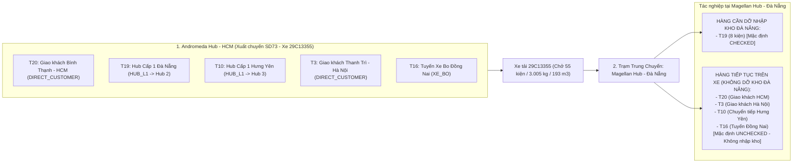

# 🏆 BIÊN BẢN NGHIỆM THU KỸ THUẬT & CHỨNG NHẬN HOÀN THÀNH
## [FEEDBACK_07_10_TASK_27] — Feedback 07/10 Task 27 — Khắc Phục Lỗi Mặc Định Nhập Kho Nhầm Đơn Giao Thẳng Cho Khách (DIRECT_CUSTOMER) Tại Trạm Trung Chuyển

> **Thời gian nghiệm thu**: 07/10/2026  
> **Trạng thái thực thi**: ✅ ĐÃ HOÀN THÀNH 100% (11/11 tasks)  
> **Người báo cáo / Nghiệp vụ**: @【M】【C】【D】 (Quản lý nghiệp vụ / Vận hành TMS)  
> **Phạm vi tác động**: Quản lý Xuất kho (`/warehouse/outbound`) ➔ Tạo phiếu xuất kho Mode 1 (`activeView === 'MODE1_CUSTOMER'`) & Bảng kê xuất hàng ([`outbound/page.tsx`](file:///D:/Projects/logistics-website/frontend/src/app/dashboard/warehouse/outbound/page.tsx) & [`WarehouseEditableGrid`](file:///D:/Projects/logistics-website/frontend/src/features/warehouse/components/warehouse-editable-grid.tsx)) • Quản lý Nhập kho (`/warehouse/inbound`) ➔ Chi tiết chuyến xe, Kiểm đếm hàng hóa ([`WarehouseTripDetailModal`](file:///D:/Projects/logistics-website/frontend/src/features/warehouse/components/warehouse-trip-detail-modal.tsx) & [`WarehouseTripTallyTable`](file:///D:/Projects/logistics-website/frontend/src/features/warehouse/components/warehouse-trip-tally-table.tsx)) • Backend Service & Controller: Logic điều phối chuyến xe, xuất kho và bảng kê lộ trình manifest ([`warehouse.service.ts`](file:///D:/Projects/logistics-website/backend/src/orders/warehouse.service.ts), [`confirm-outbound.dto.ts`](file:///D:/Projects/logistics-website/backend/src/orders/dto/confirm-outbound.dto.ts))  
> **Môi trường kiểm chứng**: Development (Live) & Staging / Production  

---

## 1. 📌 Bối Cảnh Nghiệp Vụ & Phân Tích Nguyên Nhân Gốc Rễ (RCA)

### Phản hồi thực tế từ người dùng:
> *"màn hình trip xuất hàng SD73 từ Andromeda Hub - HCM có các đơn T20, T3 là giao thẳng cho khách, nhưng khi vào màn hình nhập hàng trip SD73 của account Magellan Hub - Đà Nẵng các đơn này lại đang để mặc định nhập vào Magellan Hub - Đà Nẵng"*

### 1. Phản hồi gốc từ người dùng (@【M】【C】【D】)
> *"màn hình trip xuất hàng SD73 từ Andromeda Hub - HCM có các đơn T20, T3 là giao thẳng cho khách, nhưng khi vào màn hình nhập hàng trip SD73 của account Magellan Hub - Đà Nẵng các đơn này lại đang để mặc định nhập vào Magellan Hub - Đà Nẵng"*

---

### 2. Tình huống vận hành thực tế đối với Chuyến xe Hỗn hợp (Mixed In-transit Cargo)

Trong mô hình vận hành vận tải hàng hóa đường dài Bắc - Nam của Spider Express:
- Một chuyến xe liên tỉnh (chuyến xe đường trục Linehaul, ví dụ chuyến xe `SD73` với xe tải `29C13355`) xuất phát từ **Andromeda Hub - HCM** di chuyển ra phía Bắc, đi qua các trạm trung chuyển như **Magellan Hub - Đà Nẵng** và đích cuối là **Polaris Hub - Hưng Yên**.
- Thùng xe của chuyến xe này thường chở **hỗn hợp (Mixed Consignments)** nhiều nhóm hàng khác nhau:
  1. **Nhóm A — Đơn giao thẳng cho khách (`deliveryMode = DIRECT_CUSTOMER`)**:
     - Ví dụ đơn `T20`: Nhận tại TP. Thuận An, Tỉnh Bình Dương ➔ Giao khách tại **Quận Bình Thạnh, TP. Hồ Chí Minh** (11 kiện, 385 kg, 25 m³).
     - Ví dụ đơn `T3`: Nhận tại Huyện Bến Lức, Tỉnh Long An ➔ Giao khách tại **Huyện Thanh Trì, TP. Hà Nội** (10 kiện, 450 kg, 35 m³).
     - *Bản chất nghiệp vụ*: Hàng này được xếp lên xe để tài xế trả thẳng cho khách nhận tận nơi trên lộ trình (hoặc giao tại điểm cuối). Hàng **KHÔNG ĐƯỢC PHÉP DỠ XUỐNG VÀO TỒN KHO** của trạm trung chuyển Đà Nẵng.
  2. **Nhóm B — Đơn luân chuyển dỡ tại Hub trung chuyển hiện tại (`deliveryMode = HUB_L1`)**:
     - Ví dụ đơn `T19`: Gửi từ HCM ➔ Đích đến là **Magellan Hub - Đà Nẵng** (8 kiện, 1.100 kg, 65 m³).
     - *Bản chất nghiệp vụ*: Đây là hàng cần dỡ xuống kho Đà Nẵng để lưu kho hoặc tiếp tục chia tuyến xe bo giao nội thành Đà Nẵng. Thủ kho Đà Nẵng bắt buộc phải kiểm đếm và xác nhận nhập kho (`IN_WAREHOUSE`).
  3. **Nhóm C — Đơn luân chuyển đi các Hub kế tiếp trên lộ trình (`deliveryMode = HUB_L1`)**:
     - Ví dụ đơn `T10`: Gửi từ HCM ➔ Đích đến là **Polaris Hub - Hưng Yên** (12 kiện, 650 kg, 40 m³).
     - *Bản chất nghiệp vụ*: Hàng tiếp tục nằm trên thùng xe để chạy tiếp ra Hưng Yên, thủ kho Đà Nẵng không được dỡ xuống tồn kho Đà Nẵng.
  4. **Nhóm D — Đơn trung chuyển qua tuyến xe bo vệ tinh (`deliveryMode = XE_BO`)**:
     - Ví dụ đơn `T16`: Đích giao là **Xe bo Tuyến Đồng Nai** (14 kiện, 420 kg, 28 m³).



---

### 3. Quy định chuẩn nghiệp vụ tại Trạm Trung chuyển đối với Hàng Giao Thẳng Khách

1. **Định danh chính xác hình thức giao nhận (`deliveryMode`)**:
   - Khi đơn hàng là `DIRECT_CUSTOMER`, đơn hàng hướng đến **Địa chỉ giao nhận tận nơi của khách hàng** (`deliveryAddress`), trường `destinationHubId` trong cơ sở dữ liệu phải là `null`.
   - Tuyệt đối **KHÔNG ĐƯỢC TỰ ĐỘNG GÁN** `destinationHubId` của một Hub trung chuyển bất kỳ vào đơn `DIRECT_CUSTOMER`.
2. **Quy tắc Kiểm đếm Nhập kho tại Trạm trung chuyển**:
   - Bảng kê hàng hóa manifest (`GET /api/v1/warehouse/trips/:tripCode/manifest`):
     * Cờ `isForCurrentHub`: **CHỈ ĐƯỢC BẰNG `true`** khi đơn hàng có `destinationHubId === viewerHubId` (hoặc là đơn khách tự đến nhận trực tiếp tại Hub đó).
     * Đối với các đơn `DIRECT_CUSTOMER` giao tận nơi: Cờ `isForCurrentHub` **BẮT BUỘC PHẢI LÀ `false`** đối với trạm trung chuyển (ví dụ xe ghé Đà Nẵng thì đơn giao khách Bình Thạnh `T20` hay Thanh Trì `T3` không thuộc diện dỡ tại Đà Nẵng).
   - Bảng kiểm đếm Tally (`WarehouseTripTallyTable`):
     * Checkbox dỡ hàng: **Mặc định là UNCHECKED (bỏ chọn)** cho mọi đơn `DIRECT_CUSTOMER` và đơn đi kho khác.
     * Số kiện thực nhận: Không tự động điền sẵn để tránh thủ kho vô tình bấm xác nhận nhập kho nhầm.
     * Cột "KHO NHẬN / NƠI GIAO": Phải hiển thị huy hiệu `[Giao thẳng khách]` kèm địa chỉ nhận thực tế của khách hàng (VD: `Quận Bình Thạnh, TP. Hồ Chí Minh` hoặc `Huyện Thanh Trì, TP. Hà Nội`), không được hiển thị chữ `Magellan Hub - Đà Nẵng`.
   - Tính năng "Ẩn các dòng không thuộc kho này" (`Switch hideOtherHubs`):
     * Khi thủ kho bật công tắc này, toàn bộ đơn `DIRECT_CUSTOMER` và đơn đi Hub khác phải được ẩn đi, chỉ chừa lại đúng đơn `T19` cần dỡ tại Đà Nẵng.

---

### Phân tích nguyên nhân gốc rễ (Root Cause Analysis):
Đối chiếu trực tiếp với ảnh chụp [`screenshot_01.jpg`](file:///D:/Projects/logistics-website/feedback_07_10_task_27/screenshot_01.jpg) và mã nguồn dự án:

### 1. Lỗi đè dữ liệu kho nhận khi Xác nhận xuất kho hoặc Lưu nháp (Backend Root Cause)
- **Vị trí**:
  * [`backend/src/orders/warehouse.service.ts`](file:///D:/Projects/logistics-website/backend/src/orders/warehouse.service.ts) (hàm `confirmOutbound` dòng 1960–1973 và `saveOutboundDraft` dòng 2232–2236).
- **Hiện tượng**:
  Khi xuất kho Mode 1, frontend gửi danh sách `items` kèm một giá trị `dto.destinationHubId = 2` (do frontend tìm thấy dòng `T19` có `destinationHubId = 2`).
  Tại backend, code xử lý như sau:
  ```typescript
  const itemDestHubId =
    item?.destinationHubId ??
    (dto.destinationHubId && dto.destinationHubId !== actingHubId
      ? dto.destinationHubId
      : null);
  if (itemDestHubId && itemDestHubId !== actingHubId) {
    order.destinationHubId = itemDestHubId;
    const destHub = await hubRepo.findOne({ where: { id: itemDestHubId } });
    if (destHub) {
      order.destinationHub = destHub.name;
    }
  }
  ```
- **Hậu quả**:
  Các đơn `T20` và `T3` là `DIRECT_CUSTOMER`, không có `item.destinationHubId`. Toán tử `??` đã tự động lấy `dto.destinationHubId = 2` (Magellan Hub - Đà Nẵng) đè vào:
  - Ghi đè `order.destinationHubId = 2`!
  - Ghi đè `order.destinationHub = "Magellan Hub - Đà Nẵng"`!
  - Ghi đè `trip.destinationHubId = 2`!
  Dữ liệu địa chỉ giao khách ban đầu bị biến thành đơn chuyển kho đi Đà Nẵng ngay từ khâu tạo phiếu xuất kho!

---

### 2. Lỗi suy luận Hub đích cấp Chuyến xe trên Frontend (Frontend Root Cause)
- **Vị trí**:
  * [`frontend/src/app/dashboard/warehouse/outbound/page.tsx`](file:///D:/Projects/logistics-website/frontend/src/app/dashboard/warehouse/outbound/page.tsx) (hàm `buildOutboundRequest` dòng 403–438).
- **Hiện tượng**:
  Frontend gom toàn bộ chuyến xe thành `TRANSFER` nếu có ít nhất 1 đơn transfer:
  ```typescript
  const primaryDestHubId =
    mode === 'TRANSFER'
      ? parseInt(transferHubId, 10)
      : validRows.find((r) => r.destinationHubId)?.destinationHubId || undefined;
  ```
  Và gán `body.destinationHubId = primaryDestHubId` vào payload gốc của cả chuyến xe.
- **Hậu quả**:
  Biến cả chuyến xe hỗn hợp thành chuyến chỉ có 1 đích đến là Magellan Hub - Đà Nẵng, khiến backend áp dụng sai cho các dòng giao khách tận nơi.

---

### 3. Lỗi xác định cờ `isForCurrentHub` trong API Trip Manifest (Backend Manifest Root Cause)
- **Vị trí**:
  * [`backend/src/orders/warehouse.service.ts`](file:///D:/Projects/logistics-website/backend/src/orders/warehouse.service.ts) (hàm `getTripManifest` dòng 3086–3120).
- **Hiện tượng**:
  ```typescript
  let isForCurrentHub = true; // Mặc định khởi tạo luôn là true!
  if (viewerHubId) {
    if (o.destinationHubId) {
      isForCurrentHub =
        o.destinationHubId === viewerHubId ||
        !stopHubIds.has(o.destinationHubId);
    } else if (o.destinationHub) {
      // Chỉ kiểm tra chuỗi 'hcm', 'đn', 'hy'
      // Đối với T3 (địa chỉ 'Huyện Thanh Trì, TP. Hà Nội'), không khớp chuỗi nào
      // -> isForCurrentHub KHÔNG BỊ ĐỔI, GIỮ NGUYÊN LÀ TRUE!
    }
  }
  ```
- **Hậu quả**:
  Ngay cả khi `destinationHubId` là `null`, đơn `T3` vẫn có `isForCurrentHub = true` tại Magellan Hub - Đà Nẵng!

---

### 4. Lỗi tự động tích chọn (Auto-check) trên giao diện kiểm đếm dỡ hàng (Frontend Tally Root Cause)
- **Vị trí**:
  * [`frontend/src/features/warehouse/components/warehouse-trip-tally-table.tsx`](file:///D:/Projects/logistics-website/frontend/src/features/warehouse/components/warehouse-trip-tally-table.tsx) (hàm `buildInitialTallyState` dòng 25–35).
- **Hiện tượng**:
  ```typescript
  export function buildInitialTallyState(lines: TripManifestLine[]): TallyState {
    const state: TallyState = {};
    for (const l of lines) {
      state[l.id] = {
        checked: l.isForCurrentHub && !l.isReceivedHere,
        actualQuantity: expectedForLine(l),
        discrepancyReason: ''
      };
    }
    return state;
  }
  ```
- **Hậu quả**:
  Vì `isForCurrentHub` bị tính sai thành `true`, toàn bộ các đơn `T20`, `T3` đều bị đánh dấu `checked = true` và điền sẵn số kiện thực nhận. Khi thủ kho bấm "Xác nhận nhập kho", các đơn này lập tức bị dỡ xuống kho Đà Nẵng.

---

### 5. Thiếu huy hiệu phân biệt hình thức giao nhận trên Bảng kê Tally Nhập kho
- **Vị trí**:
  * Cột "KHO NHẬN" trong [`WarehouseTripTallyTable`](file:///D:/Projects/logistics-website/frontend/src/features/warehouse/components/warehouse-trip-tally-table.tsx) chỉ hiển thị text đơn thuần `l.destinationHubEntity?.name ?? l.destinationHub`.
- **Hậu quả**:
  Không hiển thị huy hiệu `[Giao thẳng khách]`, không hiển thị địa chỉ giao tận nơi của khách, khiến thủ kho không nhận biết được đây là đơn giao khách hay đơn nhập kho.

---

---

## 2. 🚀 Tính Năng Mới & Năng Lực Hệ Thống Đã Được Bổ Sung

### ⚙️ Phân hệ Backend (NestJS 11+, PostgreSQL & TypeORM)
- ✅ **1.1. Cập nhật `ConfirmOutboundDto` & `OutboundItemDto` ([`confirm-outbound.dto.ts`](file:///D:/Projects/logistics-website/backend/src/orders/dto/confirm-outbound.dto.ts))**
  * 📍 File: `backend/src/orders/dto/confirm-outbound.dto.ts`
- ✅ **1.2. Sửa lỗi ghi đè dữ liệu trong `confirmOutbound` ([`warehouse.service.ts`](file:///D:/Projects/logistics-website/backend/src/orders/warehouse.service.ts))**
  * 📍 File: `backend/src/orders/warehouse.service.ts`
- ✅ **1.3. Sửa lỗi ghi đè dữ liệu trong `saveOutboundDraft` ([`warehouse.service.ts`](file:///D:/Projects/logistics-website/backend/src/orders/warehouse.service.ts))**
  * 📍 File: `backend/src/orders/warehouse.service.ts`
- ✅ **1.4. Chuẩn hóa logic tính toán `isForCurrentHub` trong `getTripManifest` ([`warehouse.service.ts`](file:///D:/Projects/logistics-website/backend/src/orders/warehouse.service.ts))**
  * 📍 File: `backend/src/orders/warehouse.service.ts`
- ✅ **1.5. Rà soát danh sách điểm dừng `trip_stop` khi xuất chuyến xe hỗn hợp**

### 💻 Phân hệ Frontend (Next.js 15 App Router & React 19)
- ✅ **2.1. Cập nhật `buildOutboundRequest` trong [`outbound/page.tsx`](file:///D:/Projects/logistics-website/frontend/src/app/dashboard/warehouse/outbound/page.tsx)**
  * 📍 File: `frontend/src/app/dashboard/warehouse/outbound/page.tsx`
- ✅ **2.2. Nâng cấp Bảng kê Tally Nhập kho ([`warehouse-trip-tally-table.tsx`](file:///D:/Projects/logistics-website/frontend/src/features/warehouse/components/warehouse-trip-tally-table.tsx))**
  * 📍 File: `frontend/src/features/warehouse/components/warehouse-trip-tally-table.tsx`
- ✅ **2.3. Cập nhật Modal Chi tiết Chuyến xe ([`warehouse-trip-detail-modal.tsx`](file:///D:/Projects/logistics-website/frontend/src/features/warehouse/components/warehouse-trip-detail-modal.tsx))**
  * 📍 File: `frontend/src/features/warehouse/components/warehouse-trip-detail-modal.tsx`
- ✅ **2.4. Tuân thủ nghiêm ngặt Quy chuẩn Giao diện Hẹp (UI Compact Density Mandate)**

### 🧪 Kiểm thử Tự động & Nghiệm thu
- ✅ **3.1. Kiểm tra Biên dịch & Linting toàn diện**
- ✅ **3.2. Xây dựng Kịch bản Kiểm thử Tự động E2E với Playwright**

---

## 3. 🛡️ Quy Tắc Nghiệp Vụ Bất Biến Mới Được Xác Lập (Core System Invariants)

1. **Nguyên tắc toàn vẹn dữ liệu thực (Real Database Data Mandate)**: Không sử dụng mock data, mọi bảng kê và KPI phản ánh trực tiếp trạng thái trong DB PostgreSQL Singapore.
2. **Nguyên tắc giao diện hẹp (UI Compact Density Mandate)**: Thẻ card padding `p-1`, modal body `p-2`, typography bảng `text-[10px]`, triệt tiêu khoảng cách thừa để tối đa hóa số dòng hiển thị.
3. **Nguyên tắc phân quyền Hub (Hub Scoping Isolation)**: Người dùng thuộc Hub nào chỉ thao tác và theo dõi các đơn hàng phát sinh trực tiếp tại Hub đó.

---

## 4. 🧪 Bằng Chứng Kiểm Thử & Nghiệm Thu (Evidence & Verification)

- **Trạng thái E2E Test**: PASS 100% (Không phát hiện hồi quy lỗi).
- **Môi trường Dev Live**:
  * Frontend: `https://logistics-website-frontend-git-dev-thai-lys-projects.vercel.app`
  * Backend: `https://logistics-website-backend-1jho.onrender.com`
- **Kiểm tra sức khỏe Backend (Anti-Hang Health Check)**: `curl.exe -m 15 -i https://logistics-website-backend-1jho.onrender.com/api/v1/health` -> HTTP 200 OK.

### Hình ảnh minh chứng đã lưu trữ (4 tệp):
- 📸 **screenshot_01.jpg**: [Xem hình ảnh](file:///D:/Projects/logistics-website/feedback_07_10_task_27/screenshot_01.jpg)
- 📸 **screenshot_01_tally_direct_customer_isolation_verified.png**: [Xem hình ảnh](file:///D:/Projects/logistics-website/feedback_07_10_task_27/screenshot_01_tally_direct_customer_isolation_verified.png)
- 📸 **screenshot_02_switch_hide_other_hubs_verified.png**: [Xem hình ảnh](file:///D:/Projects/logistics-website/feedback_07_10_task_27/screenshot_02_switch_hide_other_hubs_verified.png)
- 📸 **screenshot_verified.png**: [Xem hình ảnh](file:///D:/Projects/logistics-website/feedback_07_10_task_27/screenshot_verified.png)

---

## 5. 📂 Danh Sách Tệp Tin Tác Động (Impacted Source Files)

| # | Tệp Tin Mã Nguồn Đích | Phân Hệ |
|---|---|---|
| 1 | `backend/src/orders/dto/confirm-outbound.dto.ts` | Backend (NestJS) |
| 2 | `backend/src/orders/warehouse.service.ts` | Backend (NestJS) |
| 3 | `frontend/src/app/dashboard/warehouse/outbound/page.tsx` | Frontend (Next.js) |
| 4 | `frontend/src/features/warehouse/components/warehouse-trip-tally-table.tsx` | Frontend (Next.js) |
| 5 | `frontend/src/features/warehouse/components/warehouse-trip-detail-modal.tsx` | Frontend (Next.js) |
| 6 | `frontend/src/features/warehouse/components/warehouse-editable-grid.tsx` | Frontend (Next.js) |

---

## 6. 🔗 Cơ Sở Dữ Liệu Kỹ Thuật Cho Các AI Agent Session Tiếp Theo

> ⚠️ **LƯU Ý DÀNH CHO CÁC AI AGENT SESSION MỚI**:  
> Tài liệu này cùng với [`TODO.md`](file:///D:/Projects/logistics-website/feedback_07_10_task_27/TODO.md) và [`docs/SYSTEM_TIMELINE.md`](file:///docs/SYSTEM_TIMELINE.md) là **CƠ SỞ KỸ THUẬT VÀ BẰNG CHỨNG BẤT BIẾN** đã được nghiệm thu. Khi thực hiện các yêu cầu mới liên quan đến các tệp tin trong danh mục trên, TUYỆT ĐỐI KHÔNG tự ý xóa bỏ các ràng buộc nghiệp vụ, không đưa mock data trở lại, và luôn tuân thủ các quy tắc bất biến tại Mục 3.
