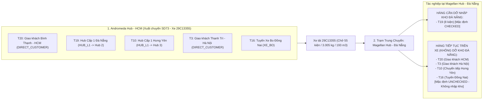

# Feedback 07/10 Task 27 — Khắc Phục Lỗi Mặc Định Nhập Kho Nhầm Đơn Giao Thẳng Cho Khách (DIRECT_CUSTOMER) Tại Trạm Trung Chuyển

> **Thời gian ghi nhận**: 07/10/2026  
> **Người báo cáo**: @【M】【C】【D】 (Quản lý nghiệp vụ / Vận hành TMS)  
> **Phạm vi tác động**:  
> - Quản lý Xuất kho (`/warehouse/outbound`) ➔ Tạo phiếu xuất kho Mode 1 (`activeView === 'MODE1_CUSTOMER'`) & Bảng kê xuất hàng ([`outbound/page.tsx`](file:///D:/Projects/logistics-website/frontend/src/app/dashboard/warehouse/outbound/page.tsx) & [`WarehouseEditableGrid`](file:///D:/Projects/logistics-website/frontend/src/features/warehouse/components/warehouse-editable-grid.tsx))  
> - Quản lý Nhập kho (`/warehouse/inbound`) ➔ Chi tiết chuyến xe, Kiểm đếm hàng hóa ([`WarehouseTripDetailModal`](file:///D:/Projects/logistics-website/frontend/src/features/warehouse/components/warehouse-trip-detail-modal.tsx) & [`WarehouseTripTallyTable`](file:///D:/Projects/logistics-website/frontend/src/features/warehouse/components/warehouse-trip-tally-table.tsx))  
> - Backend Service & Controller: Logic điều phối chuyến xe, xuất kho và bảng kê lộ trình manifest ([`warehouse.service.ts`](file:///D:/Projects/logistics-website/backend/src/orders/warehouse.service.ts), [`confirm-outbound.dto.ts`](file:///D:/Projects/logistics-website/backend/src/orders/dto/confirm-outbound.dto.ts))  
> **Tài liệu tham chiếu**:  
> - `/leader` Business Domain Architecture ([`SKILL.md`](file:///D:/Projects/logistics-website/.agents/skills/leader/SKILL.md))  
> - Quy chế phát triển hệ thống [`AGENTS.md`](file:///D:/Projects/logistics-website/AGENTS.md)  
> - Quy chuẩn giao diện hẹp [`.agents/rules/ui-compact-density.md`](file:///D:/Projects/logistics-website/.agents/rules/ui-compact-density.md) & [`ui-spacing-guard`](file:///D:/Projects/logistics-website/.agents/skills/ui-spacing-guard/SKILL.md)  
> - Quy chuẩn phân tầng mạng lưới Hub & Hình thức giao hàng (Two-Tier Hub Hierarchy & Delivery Destination Modes: `DIRECT_CUSTOMER`, `HUB_L1`, `XE_BO`)  
> **Ảnh minh chứng đính kèm trong thư mục**:  
> - [`screenshot_01.jpg`](file:///D:/Projects/logistics-website/feedback_07_10_task_27/screenshot_01.jpg): Giao diện Tạo Phiếu Xuất Kho chuyến xe `SD73` (xe tải `29C13355`) tại trạm gốc `Andromeda Hub - HCM` chở hỗn hợp các đơn giao khách tận nơi và điều chuyển liên Hub.  

---

## 📌 Bối cảnh nghiệp vụ thực tế (Chốt theo phản hồi người dùng)

### 1. Phản hồi gốc từ người dùng (@【M】【C】【D】)
> *"màn hình trip xuất hàng SD73 từ Andromeda Hub - HCM có các đơn T20, T3 là giao thẳng cho khách, nhưng khi vào màn hình nhập hàng trip SD73 của account Magellan Hub - Đà Nẵng các đơn này lại đang để mặc định nhập vào Magellan Hub - Đà Nẵng"*

---

### 2. Tình huống vận hành thực tế đối với Chuyến xe Hỗn hợp (Mixed In-transit Cargo)

Trong mô hình vận hành vận tải hàng hóa đường dài Bắc - Nam của Spider Express:
- Một chuyến xe liên tỉnh (chuyến xe đường trục Linehaul, ví dụ chuyến xe `SD73` với xe tải `29C13355`) xuất phát từ **Andromeda Hub - HCM** di chuyển ra phía Bắc, đi qua các trạm trung chuyển như **Magellan Hub - Đà Nẵng** và đích cuối là **Polaris Hub - Hưng Yên**.
- Thùng xe của chuyến xe này thường chở **hỗn hợp (Mixed Consignments)** nhiều nhóm hàng khác nhau:
  1. **Nhóm A — Đơn giao thẳng cho khách (`deliveryMode = DIRECT_CUSTOMER`)**:
     - Ví dụ đơn `T20`: Nhận tại TP. Thuận An, Tỉnh Bình Dương ➔ Giao khách tại **Quận Bình Thạnh, TP. Hồ Chí Minh** (11 kiện, 385 kg, 25 m³).
     - Ví dụ đơn `T3`: Nhận tại Huyện Bến Lức, Tỉnh Long An ➔ Giao khách tại **Huyện Thanh Trì, TP. Hà Nội** (10 kiện, 450 kg, 35 m³).
     - *Bản chất nghiệp vụ*: Hàng này được xếp lên xe để tài xế trả thẳng cho khách nhận tận nơi trên lộ trình (hoặc giao tại điểm cuối). Hàng **KHÔNG ĐƯỢC PHÉP DỠ XUỐNG VÀO TỒN KHO** của trạm trung chuyển Đà Nẵng.
  2. **Nhóm B — Đơn luân chuyển dỡ tại Hub trung chuyển hiện tại (`deliveryMode = HUB_L1`)**:
     - Ví dụ đơn `T19`: Gửi từ HCM ➔ Đích đến là **Magellan Hub - Đà Nẵng** (8 kiện, 1.100 kg, 65 m³).
     - *Bản chất nghiệp vụ*: Đây là hàng cần dỡ xuống kho Đà Nẵng để lưu kho hoặc tiếp tục chia tuyến xe bo giao nội thành Đà Nẵng. Thủ kho Đà Nẵng bắt buộc phải kiểm đếm và xác nhận nhập kho (`IN_WAREHOUSE`).
  3. **Nhóm C — Đơn luân chuyển đi các Hub kế tiếp trên lộ trình (`deliveryMode = HUB_L1`)**:
     - Ví dụ đơn `T10`: Gửi từ HCM ➔ Đích đến là **Polaris Hub - Hưng Yên** (12 kiện, 650 kg, 40 m³).
     - *Bản chất nghiệp vụ*: Hàng tiếp tục nằm trên thùng xe để chạy tiếp ra Hưng Yên, thủ kho Đà Nẵng không được dỡ xuống tồn kho Đà Nẵng.
  4. **Nhóm D — Đơn trung chuyển qua tuyến xe bo vệ tinh (`deliveryMode = XE_BO`)**:
     - Ví dụ đơn `T16`: Đích giao là **Xe bo Tuyến Đồng Nai** (14 kiện, 420 kg, 28 m³).



---

### 3. Quy định chuẩn nghiệp vụ tại Trạm Trung chuyển đối với Hàng Giao Thẳng Khách

1. **Định danh chính xác hình thức giao nhận (`deliveryMode`)**:
   - Khi đơn hàng là `DIRECT_CUSTOMER`, đơn hàng hướng đến **Địa chỉ giao nhận tận nơi của khách hàng** (`deliveryAddress`), trường `destinationHubId` trong cơ sở dữ liệu phải là `null`.
   - Tuyệt đối **KHÔNG ĐƯỢC TỰ ĐỘNG GÁN** `destinationHubId` của một Hub trung chuyển bất kỳ vào đơn `DIRECT_CUSTOMER`.
2. **Quy tắc Kiểm đếm Nhập kho tại Trạm trung chuyển**:
   - Bảng kê hàng hóa manifest (`GET /api/v1/warehouse/trips/:tripCode/manifest`):
     * Cờ `isForCurrentHub`: **CHỈ ĐƯỢC BẰNG `true`** khi đơn hàng có `destinationHubId === viewerHubId` (hoặc là đơn khách tự đến nhận trực tiếp tại Hub đó).
     * Đối với các đơn `DIRECT_CUSTOMER` giao tận nơi: Cờ `isForCurrentHub` **BẮT BUỘC PHẢI LÀ `false`** đối với trạm trung chuyển (ví dụ xe ghé Đà Nẵng thì đơn giao khách Bình Thạnh `T20` hay Thanh Trì `T3` không thuộc diện dỡ tại Đà Nẵng).
   - Bảng kiểm đếm Tally (`WarehouseTripTallyTable`):
     * Checkbox dỡ hàng: **Mặc định là UNCHECKED (bỏ chọn)** cho mọi đơn `DIRECT_CUSTOMER` và đơn đi kho khác.
     * Số kiện thực nhận: Không tự động điền sẵn để tránh thủ kho vô tình bấm xác nhận nhập kho nhầm.
     * Cột "KHO NHẬN / NƠI GIAO": Phải hiển thị huy hiệu `[Giao thẳng khách]` kèm địa chỉ nhận thực tế của khách hàng (VD: `Quận Bình Thạnh, TP. Hồ Chí Minh` hoặc `Huyện Thanh Trì, TP. Hà Nội`), không được hiển thị chữ `Magellan Hub - Đà Nẵng`.
   - Tính năng "Ẩn các dòng không thuộc kho này" (`Switch hideOtherHubs`):
     * Khi thủ kho bật công tắc này, toàn bộ đơn `DIRECT_CUSTOMER` và đơn đi Hub khác phải được ẩn đi, chỉ chừa lại đúng đơn `T19` cần dỡ tại Đà Nẵng.

---

## 🔍 Tổng hợp các điểm chưa đúng trên hệ thống & Truy vết Mã nguồn (Root Cause Analysis)

Đối chiếu trực tiếp với ảnh chụp [`screenshot_01.jpg`](file:///D:/Projects/logistics-website/feedback_07_10_task_27/screenshot_01.jpg) và mã nguồn dự án:

### 1. Lỗi đè dữ liệu kho nhận khi Xác nhận xuất kho hoặc Lưu nháp (Backend Root Cause)
- **Vị trí**:
  * [`backend/src/orders/warehouse.service.ts`](file:///D:/Projects/logistics-website/backend/src/orders/warehouse.service.ts) (hàm `confirmOutbound` dòng 1960–1973 và `saveOutboundDraft` dòng 2232–2236).
- **Hiện tượng**:
  Khi xuất kho Mode 1, frontend gửi danh sách `items` kèm một giá trị `dto.destinationHubId = 2` (do frontend tìm thấy dòng `T19` có `destinationHubId = 2`).
  Tại backend, code xử lý như sau:
  ```typescript
  const itemDestHubId =
    item?.destinationHubId ??
    (dto.destinationHubId && dto.destinationHubId !== actingHubId
      ? dto.destinationHubId
      : null);
  if (itemDestHubId && itemDestHubId !== actingHubId) {
    order.destinationHubId = itemDestHubId;
    const destHub = await hubRepo.findOne({ where: { id: itemDestHubId } });
    if (destHub) {
      order.destinationHub = destHub.name;
    }
  }
  ```
- **Hậu quả**:
  Các đơn `T20` và `T3` là `DIRECT_CUSTOMER`, không có `item.destinationHubId`. Toán tử `??` đã tự động lấy `dto.destinationHubId = 2` (Magellan Hub - Đà Nẵng) đè vào:
  - Ghi đè `order.destinationHubId = 2`!
  - Ghi đè `order.destinationHub = "Magellan Hub - Đà Nẵng"`!
  - Ghi đè `trip.destinationHubId = 2`!
  Dữ liệu địa chỉ giao khách ban đầu bị biến thành đơn chuyển kho đi Đà Nẵng ngay từ khâu tạo phiếu xuất kho!

---

### 2. Lỗi suy luận Hub đích cấp Chuyến xe trên Frontend (Frontend Root Cause)
- **Vị trí**:
  * [`frontend/src/app/dashboard/warehouse/outbound/page.tsx`](file:///D:/Projects/logistics-website/frontend/src/app/dashboard/warehouse/outbound/page.tsx) (hàm `buildOutboundRequest` dòng 403–438).
- **Hiện tượng**:
  Frontend gom toàn bộ chuyến xe thành `TRANSFER` nếu có ít nhất 1 đơn transfer:
  ```typescript
  const primaryDestHubId =
    mode === 'TRANSFER'
      ? parseInt(transferHubId, 10)
      : validRows.find((r) => r.destinationHubId)?.destinationHubId || undefined;
  ```
  Và gán `body.destinationHubId = primaryDestHubId` vào payload gốc của cả chuyến xe.
- **Hậu quả**:
  Biến cả chuyến xe hỗn hợp thành chuyến chỉ có 1 đích đến là Magellan Hub - Đà Nẵng, khiến backend áp dụng sai cho các dòng giao khách tận nơi.

---

### 3. Lỗi xác định cờ `isForCurrentHub` trong API Trip Manifest (Backend Manifest Root Cause)
- **Vị trí**:
  * [`backend/src/orders/warehouse.service.ts`](file:///D:/Projects/logistics-website/backend/src/orders/warehouse.service.ts) (hàm `getTripManifest` dòng 3086–3120).
- **Hiện tượng**:
  ```typescript
  let isForCurrentHub = true; // Mặc định khởi tạo luôn là true!
  if (viewerHubId) {
    if (o.destinationHubId) {
      isForCurrentHub =
        o.destinationHubId === viewerHubId ||
        !stopHubIds.has(o.destinationHubId);
    } else if (o.destinationHub) {
      // Chỉ kiểm tra chuỗi 'hcm', 'đn', 'hy'
      // Đối với T3 (địa chỉ 'Huyện Thanh Trì, TP. Hà Nội'), không khớp chuỗi nào
      // -> isForCurrentHub KHÔNG BỊ ĐỔI, GIỮ NGUYÊN LÀ TRUE!
    }
  }
  ```
- **Hậu quả**:
  Ngay cả khi `destinationHubId` là `null`, đơn `T3` vẫn có `isForCurrentHub = true` tại Magellan Hub - Đà Nẵng!

---

### 4. Lỗi tự động tích chọn (Auto-check) trên giao diện kiểm đếm dỡ hàng (Frontend Tally Root Cause)
- **Vị trí**:
  * [`frontend/src/features/warehouse/components/warehouse-trip-tally-table.tsx`](file:///D:/Projects/logistics-website/frontend/src/features/warehouse/components/warehouse-trip-tally-table.tsx) (hàm `buildInitialTallyState` dòng 25–35).
- **Hiện tượng**:
  ```typescript
  export function buildInitialTallyState(lines: TripManifestLine[]): TallyState {
    const state: TallyState = {};
    for (const l of lines) {
      state[l.id] = {
        checked: l.isForCurrentHub && !l.isReceivedHere,
        actualQuantity: expectedForLine(l),
        discrepancyReason: ''
      };
    }
    return state;
  }
  ```
- **Hậu quả**:
  Vì `isForCurrentHub` bị tính sai thành `true`, toàn bộ các đơn `T20`, `T3` đều bị đánh dấu `checked = true` và điền sẵn số kiện thực nhận. Khi thủ kho bấm "Xác nhận nhập kho", các đơn này lập tức bị dỡ xuống kho Đà Nẵng.

---

### 5. Thiếu huy hiệu phân biệt hình thức giao nhận trên Bảng kê Tally Nhập kho
- **Vị trí**:
  * Cột "KHO NHẬN" trong [`WarehouseTripTallyTable`](file:///D:/Projects/logistics-website/frontend/src/features/warehouse/components/warehouse-trip-tally-table.tsx) chỉ hiển thị text đơn thuần `l.destinationHubEntity?.name ?? l.destinationHub`.
- **Hậu quả**:
  Không hiển thị huy hiệu `[Giao thẳng khách]`, không hiển thị địa chỉ giao tận nơi của khách, khiến thủ kho không nhận biết được đây là đơn giao khách hay đơn nhập kho.

---

## 📋 Danh sách công việc triển khai (Action Checklist)

### 1. Backend (`backend/`)

- [x] **1.1. Cập nhật `ConfirmOutboundDto` & `OutboundItemDto` ([`confirm-outbound.dto.ts`](file:///D:/Projects/logistics-website/backend/src/orders/dto/confirm-outbound.dto.ts))**:
  - Đảm bảo `OutboundItemDto` hỗ trợ rõ ràng `deliveryMode?: 'DIRECT_CUSTOMER' | 'HUB_L1' | 'XE_BO'`.
  - Khẳng định rõ: Khi `deliveryMode === 'DIRECT_CUSTOMER'`, `destinationHubId` của item luôn là `null` hoặc không áp dụng fallback từ trip-level `destinationHubId`.

- [x] **1.2. Sửa lỗi ghi đè dữ liệu trong `confirmOutbound` ([`warehouse.service.ts`](file:///D:/Projects/logistics-website/backend/src/orders/warehouse.service.ts))**:
  - Không cho phép `itemDestHubId` tự động fallback sang `dto.destinationHubId` nếu dòng hàng có `item.deliveryMode === 'DIRECT_CUSTOMER'` hoặc nếu đơn hàng gốc là đơn giao khách tận nơi.
  - Khi `deliveryMode === 'DIRECT_CUSTOMER'`:
    * Giữ nguyên `order.destinationHubId = null`.
    * Giữ nguyên địa chỉ giao khách ban đầu `order.deliveryAddress`.
    * Không ghi đè `order.destinationHub` thành tên của Hub trung chuyển.
    * Tạo `TripEntity` với `destinationHubId = null`, `type = 'OUTBOUND'`, ghi chú rõ `[XUẤT KHO - GIAO KHÁCH]`.

- [x] **1.3. Sửa lỗi ghi đè dữ liệu trong `saveOutboundDraft` ([`warehouse.service.ts`](file:///D:/Projects/logistics-website/backend/src/orders/warehouse.service.ts))**:
  - Áp dụng nguyên tắc tương tự: Nếu `item.deliveryMode === 'DIRECT_CUSTOMER'`, không lấy `dto.destinationHubId` của chuyến xe gán vào đơn nháp.
  - Lưu `TripEntity` nháp với `destinationHubId = null` và `type = 'OUTBOUND'`.

- [x] **1.4. Chuẩn hóa logic tính toán `isForCurrentHub` trong `getTripManifest` ([`warehouse.service.ts`](file:///D:/Projects/logistics-website/backend/src/orders/warehouse.service.ts))**:
  - Mặc định: `let isForCurrentHub = false;` (an toàn tuyệt đối theo nguyên tắc Zero-Assumption).
  - Đối với đơn `deliveryMode === 'DIRECT_CUSTOMER'` hoặc `destinationHubId === null`:
    * `isForCurrentHub` luôn là `false` khi xem tại các trạm trung chuyển trung gian (`viewerHubId`).
    * Chỉ chấp nhận `isForCurrentHub = true` nếu điểm nhận của khách chỉ định rõ ràng tại trạm dừng hiện tại.
  - Đối với đơn `deliveryMode === 'HUB_L1'` hoặc `'XE_BO'`:
    * `isForCurrentHub = (effectiveDestHubId === viewerHubId)`.
  - Đảm bảo trả về đúng `deliveryMode: 'DIRECT_CUSTOMER'` và giữ nguyên `deliveryAddress` của khách.

- [x] **1.5. Rà soát danh sách điểm dừng `trip_stop` khi xuất chuyến xe hỗn hợp**:
  - Đảm bảo `trip_stop` chỉ tạo điểm dừng cho các `destinationHubId` có thật và khác `originHubId`.
  - Không sinh điểm dừng `trip_stop` rác cho các đơn `DIRECT_CUSTOMER`.

---

### 2. Frontend (`frontend/`)

- [x] **2.1. Cập nhật `buildOutboundRequest` trong [`outbound/page.tsx`](file:///D:/Projects/logistics-website/frontend/src/app/dashboard/warehouse/outbound/page.tsx)**:
  - Khi build mảng `items`: Nếu dòng hàng có `r.deliveryMode === 'DIRECT_CUSTOMER'`, truyền rõ ràng `destinationHubId: null`, `deliveryMode: 'DIRECT_CUSTOMER'`, `deliveryAddress: r.deliveryAddress`.
  - Nếu chuyến xe chở hỗn hợp các đơn (vừa giao khách, vừa chuyển Hub khác nhau), không lấy đại diện 1 Hub đè lên `dto.destinationHubId` toàn cục nếu nó làm sai lệch các dòng khác.

- [x] **2.2. Nâng cấp Bảng kê Tally Nhập kho ([`warehouse-trip-tally-table.tsx`](file:///D:/Projects/logistics-website/frontend/src/features/warehouse/components/warehouse-trip-tally-table.tsx))**:
  - **Hàm `buildInitialTallyState`**:
    * Chỉ tự động tích chọn (`checked: true`) khi: `l.isForCurrentHub && !l.isReceivedHere && l.deliveryMode !== 'DIRECT_CUSTOMER'`.
    * Các đơn `DIRECT_CUSTOMER` hoặc đơn đi kho khác mặc định `checked: false`, ô số kiện thực nhận để trống hoặc hiển thị dạng chỉ đọc/cảnh báo.
  - **Cột "KHO NHẬN / NƠI GIAO"**:
    * Hiển thị Badge trực quan:
      - `[Giao thẳng khách]` (màu Slate / Cyan nhạt): Kèm text địa chỉ giao nhận khách cuối.
      - `[Hub Cấp 1]` (màu Blue đậm): Kèm tên Hub nhận.
      - `[Tuyến Xe Bo]` (màu Purple): Kèm tên tuyến xe bo.
    * Khi đơn là `DIRECT_CUSTOMER` và xe đang ở Hub trung chuyển, hiển thị thêm badge nhỏ `(Hàng trên xe - Không dỡ)`.
  - **Công tắc "Ẩn các dòng không thuộc kho này" (`Switch hideOtherHubs`)**:
    * Ẩn toàn bộ các đơn `DIRECT_CUSTOMER` và đơn đi kho khác, giúp thủ kho chỉ thấy các đơn dỡ xuống tại kho của mình.

- [x] **2.3. Cập nhật Modal Chi tiết Chuyến xe ([`warehouse-trip-detail-modal.tsx`](file:///D:/Projects/logistics-website/frontend/src/features/warehouse/components/warehouse-trip-detail-modal.tsx))**:
  - Tách biệt rõ ràng ở Header/Toolbar giữa:
    * Số đơn cần dỡ tại Hub này (ví dụ: `1 đơn - 8 kiện`).
    * Số đơn tiếp tục nằm trên xe (ví dụ: `4 đơn - 47 kiện: 2 đơn giao khách + 1 đơn đi Hưng Yên + 1 đơn Tuyến Đồng Nai`).
  - Nút **"In phiếu nhập kho"**: Chỉ in các đơn thực nhận dỡ tại Hub hiện tại, tuyệt đối không in các đơn `DIRECT_CUSTOMER` giao khách tận nơi.

- [x] **2.4. Tuân thủ nghiêm ngặt Quy chuẩn Giao diện Hẹp (UI Compact Density Mandate)**:
  - Bảng Tally: Padding `py-1 px-1.5`, Typography `text-[10px]`, font mã đơn `text-[11px] font-mono font-bold`.
  - Không sinh các class cấm: `p-4`, `p-6`, `space-y-3`, `gap-4`. Sử dụng `p-1`, `p-2`, `space-y-1.5`, `gap-1.5`.
  - Zero redundant icons: Triệt tiêu mọi icon trùng lặp với text label.

---

### 3. Kiểm thử & Nghiệm thu (Definition of Done)

- [x] **3.1. Kiểm tra Biên dịch & Linting toàn diện**:
  - Backend: `npm run lint --prefix backend` và `npm run build --prefix backend` đạt PASS (0 errors).
  - Frontend: `npm run build --prefix frontend` đạt PASS (0 errors, TypeScript compile pass).

- [x] **3.2. Xây dựng Kịch bản Kiểm thử Tự động E2E với Playwright**:
  - Tạo file spec mới: [`frontend/e2e/38-feedback-07-10-task-27-direct-customer-transit.spec.ts`](file:///D:/Projects/logistics-website/frontend/e2e/38-feedback-07-10-task-27-direct-customer-transit.spec.ts).
  - **Bước 1**: Đăng nhập tài khoản `Andromeda Hub - HCM`, tạo/xác nhận phiếu xuất kho cho chuyến xe (chứa đơn `T20` giao khách Bình Thạnh - HCM, `T3` giao khách Thanh Trì - Hà Nội, và `T19` chuyển Đà Nẵng).
  - **Bước 2**: Đăng nhập tài khoản `Magellan Hub - Đà Nẵng`, truy cập màn hình Nhập kho (`/warehouse/inbound`).
  - **Bước 3**: Mở modal kiểm đếm dỡ hàng của chuyến xe đó.
  - **Bước 4 (Khẳng định nghiệm thu then chốt)**:
    * Đơn `T19` (đi Đà Nẵng) hiển thị thuộc kho Đà Nẵng, checkbox dỡ hàng mặc định `CHECKED`.
    * Đơn `T20` và `T3` hiển thị rõ badge `[Giao thẳng khách]`, địa chỉ giao khách đúng, checkbox dỡ hàng mặc định `UNCHECKED`, cờ `isForCurrentHub` là `false`.
    * Bật switch "Ẩn các dòng không thuộc kho này" ➔ Bảng chỉ còn hiển thị đơn `T19`, các đơn `T20`, `T3` bị ẩn chính xác.
  - **Bước 5**: Chụp ảnh màn hình bằng chứng nghiệm thu thực tế lưu vào [`feedback_07_10_task_27/screenshot_verified.png`](file:///D:/Projects/logistics-website/feedback_07_10_task_27/screenshot_verified.png).

---

> *Bản kế hoạch hành động nghiệp vụ được lập bởi TMS Domain Lead — Spider Express. Mọi can thiệp code phải tuân thủ nghiêm ngặt quy chế Git Submodules, Branching from `dev`, và Quality Gate Promotion Mandate.*
