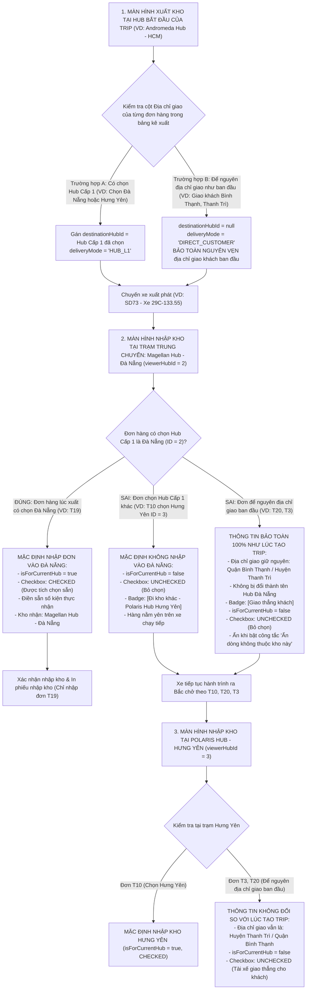

# 🏆 BIÊN BẢN NGHIỆM THU KỸ THUẬT & CHỨNG NHẬN HOÀN THÀNH
## [FEEDBACK_07_10_TASK_29] — Feedback 07/10 Task 29 — Chuẩn Hóa Logic Mặc Định Nhập Kho Hub Cấp 1 & Bảo Toàn Thông Tin Đơn Hàng Giữ Nguyên Địa Chỉ Giao Ban Đầu

> **Thời gian nghiệm thu**: 07/10/2026  
> **Trạng thái thực thi**: ✅ ĐÃ HOÀN THÀNH 100% (11/11 tasks)  
> **Người báo cáo / Nghiệp vụ**: @【M】【C】【D】 (Quản lý nghiệp vụ & Vận hành TMS — Spider Express)  
> **Phạm vi tác động**: Quản lý Xuất kho (`/warehouse/outbound`) ➔ Tạo phiếu xuất kho & Bảng kê xuất hàng ([`outbound/page.tsx`](file:///D:/Projects/logistics-website/frontend/src/app/dashboard/warehouse/outbound/page.tsx) & [`WarehouseEditableGrid`](file:///D:/Projects/logistics-website/frontend/src/features/warehouse/components/warehouse-editable-grid.tsx)) • Quản lý Nhập kho (`/warehouse/inbound`) ➔ Chi tiết chuyến xe & Kiểm đếm dỡ hàng ([`WarehouseTripDetailModal`](file:///D:/Projects/logistics-website/frontend/src/features/warehouse/components/warehouse-trip-detail-modal.tsx) & [`WarehouseTripTallyTable`](file:///D:/Projects/logistics-website/frontend/src/features/warehouse/components/warehouse-trip-tally-table.tsx)) • Backend Service & Controller: Điều phối Chuyến xe, Xuất kho, Bảng kê lộ trình Manifest ([`warehouse.service.ts`](file:///D:/Projects/logistics-website/backend/src/orders/warehouse.service.ts), [`confirm-outbound.dto.ts`](file:///D:/Projects/logistics-website/backend/src/orders/dto/confirm-outbound.dto.ts)) • Khế ước dữ liệu & Luồng chuyển tiếp trạng thái vòng đời chuyến xe đa chặng (Multi-Stop Inter-Hub Linehaul Journey)  
> **Môi trường kiểm chứng**: Development (Live) & Staging / Production  

---

## 1. 📌 Bối Cảnh Nghiệp Vụ & Phân Tích Nguyên Nhân Gốc Rễ (RCA)

### Phản hồi thực tế từ người dùng:
> *"logic đúng: tại màn hình xuất kho của hub bắt đầu của trip, đơn hàng nào ở địa chỉ giao có chọn hub cấp 1 nào, thì ở màn hình nhập của các hub cấp 1 đó mới để mặc đinh nhập đơn hàng đó vào hub cấp 1 đó. các đơn hàng để nguyên địa chỉ giao của đơn hàng như ban đầu thì trong màn hình của các hub khi mở trip ra nhập hàng các thông tin sẽ không thay đổi so với thông tin từ lúc bắt đầu tạo trip"*

### 1. Phản hồi gốc từ người dùng (@【M】【C】【D】)
> *"logic đúng: tại màn hình xuất kho của hub bắt đầu của trip, đơn hàng nào ở địa chỉ giao có chọn hub cấp 1 nào, thì ở màn hình nhập của các hub cấp 1 đó mới để mặc đinh nhập đơn hàng đó vào hub cấp 1 đó. các đơn hàng để nguyên địa chỉ giao của đơn hàng như ban đầu thì trong màn hình của các hub khi mở trip ra nhập hàng các thông tin sẽ không thay đổi so với thông tin từ lúc bắt đầu tạo trip"*

---

### 2. Tình huống vận hành thực tế đối với Chuyến xe Xuất phát từ Hub Ban đầu (Origin Hub Dispatch)

Trong mạng lưới vận tải hàng hóa đường trục Bắc - Nam (Linehaul Inter-hub Network) của Spider Express:
- Mỗi chuyến xe vận chuyển liên tỉnh (ví dụ: xe tải `29C-133.55`, chuyến `SD73`) xuất phát từ **Hub bắt đầu của trip** (Origin Hub, ví dụ: `Andromeda Hub - HCM`), di chuyển qua các trạm trung chuyển như `Magellan Hub - Đà Nẵng` (Hub Cấp 1 miền Trung) và trạm cuối là `Polaris Hub - Hưng Yên` (Hub Cấp 1 miền Bắc).
- Khi tạo chuyến xe và xếp hàng lên xe tại **màn hình xuất kho của Hub bắt đầu**, bảng kê hàng hóa xuất kho thường chứa hỗn hợp 2 nhóm đơn hàng có bản chất giao nhận hoàn toàn khác nhau:

#### 🔹 Nhóm 1: Các đơn hàng CÓ CHỌN HUB CẤP 1 tại cột địa chỉ giao (Luân chuyển liên Hub)
- **Hành vi thao tác của thủ kho tại Hub bắt đầu**: Người dùng bấm nút **"Thay đổi địa chỉ (Điều chuyển)"** và chọn đích đến là một Hub Cấp 1 cụ thể (ví dụ: đơn `T19` chọn `Magellan Hub - Đà Nẵng`; đơn `T10` chọn `Polaris Hub - Hưng Yên`).
- **Bản chất nghiệp vụ**:
  * Đơn hàng này có mục tiêu vận chuyển đến Hub Cấp 1 đó để dỡ xuống lưu kho hoặc tiếp tục chia tuyến xe bo nội thành.
  * Đơn hàng được gắn `destinationHubId = <ID của Hub Cấp 1 đã chọn>` và `deliveryMode = 'HUB_L1'`.
- **Hành vi nghiệp vụ chuẩn tại màn hình nhập của các Hub**:
  * **Tại đúng Hub Cấp 1 đã chọn** (ví dụ: xe dừng tại Đà Nẵng và mở đơn `T19`): Hệ thống **MẶC ĐỊNH ĐỂ NHẬP ĐƠN HÀNG ĐÓ VÀO HUB CẤP 1 ĐÓ**:
    - Cờ `isForCurrentHub = true`.
    - Checkbox dỡ hàng: **Mặc định được tích chọn (CHECKED)**.
    - Ô số kiện thực nhận: Mặc định điền sẵn số kiện dự kiến dỡ.
    - Cột Kho nhận hiển thị rõ tên Hub Cấp 1 này (`Magellan Hub - Đà Nẵng`).
  * **Tại Hub Cấp 1 khác trên lộ trình** (ví dụ: xe dừng tại Đà Nẵng nhưng mở đơn `T10` đi Hưng Yên):
    - Đơn này là hàng trung chuyển đi tiếp, cờ `isForCurrentHub = false`.
    - Checkbox dỡ hàng: **Mặc định BỎ CHỌN (UNCHECKED)**.
    - Dòng hiển thị mờ xám (`opacity-60`), gắn huy hiệu `[Đi kho khác]` hoặc `[Polaris Hub - Hưng Yên]`. Hàng nằm yên trên xe, không dỡ xuống Đà Nẵng.

#### 🔸 Nhóm 2: Các đơn hàng ĐỂ NGUYÊN ĐỊA CHỈ GIAO CỦA ĐƠN HÀNG NHƯ BAN ĐẦU (Giao thẳng khách / Khách nhận tận nơi)
- **Hành vi thao tác của thủ kho tại Hub bắt đầu**: Người dùng **KHÔNG CHỌN HUB CẤP 1 NÀO**, mà giữ nguyên nguyên trạng địa chỉ giao của đơn hàng như lúc tiếp nhận ban đầu (ví dụ: đơn `T20` giao khách tại `Quận Bình Thạnh, TP. Hồ Chí Minh`; đơn `T3` giao khách tại `Huyện Thanh Trì, TP. Hà Nội`).
- **Bản chất nghiệp vụ**:
  * Đơn hàng này là đơn giao thẳng tận nơi cho khách nhận cuối cùng (`deliveryMode = 'DIRECT_CUSTOMER'`), xe trả hàng trực tiếp cho khách trên đường đi hoặc tại đích đến của khách.
  * Đơn hàng **KHÔNG THUỘC DIỆN DỠ VÀO TỒN KHO** của bất kỳ trạm trung chuyển nào dọc đường (trừ khi khách tự đổi ý ra trạm nhận).
  * Trường `destinationHubId` trong cơ sở dữ liệu phải là `null` (hoặc giữ nguyên giá trị gốc ban đầu), không được phép trỏ vào bất kỳ Hub trung chuyển nào.
- **Hành vi nghiệp vụ chuẩn tại màn hình nhập của các Hub khi mở trip**:
  * **1. Toàn bộ thông tin đơn hàng KHÔNG ĐƯỢC THAY ĐỔI so với thông tin từ lúc bắt đầu tạo trip**:
    - Địa chỉ giao hàng (`deliveryAddress`): Phải giữ nguyên 100% địa chỉ giao ban đầu của khách (ví dụ: `Quận Bình Thạnh, TP. Hồ Chí Minh` hay `Huyện Thanh Trì, TP. Hà Nội`). Tuyệt đối **KHÔNG ĐƯỢC BỊ BIẾN ĐỔI** thành tên của Hub trung chuyển (như `Magellan Hub - Đà Nẵng` hay `Polaris Hub - Hưng Yên`).
    - Nơi giao / Kho nhận: Phải hiển thị nguyên vẹn địa chỉ giao của khách kèm huy hiệu định danh `[Giao thẳng khách]`.
    - Tên hàng, số kiện, khối lượng ($Kg$), thể tích ($m^3$), ghi chú vận đơn được bảo toàn nguyên vẹn.
  * **2. Mặc định kiểm đếm nhập kho (Inbound Tally Defaults)**:
    - Cờ `isForCurrentHub` **BẮT BUỘC PHẢI LÀ `false`** tại mọi trạm trung chuyển dọc đường.
    - Checkbox dỡ hàng: **Mặc định BỎ CHỌN (UNCHECKED)**.
    - Ô số kiện thực nhận: Không tự động điền số lượng để ngăn chặn triệt để nguy cơ thủ kho vô tình bấm xác nhận nhập nhầm đơn của khách vào kho.
    - Khi thủ kho bật công tắc `"Ẩn các dòng không thuộc kho này"`, toàn bộ các đơn để nguyên địa chỉ giao ban đầu này phải được ẩn đi, chỉ để lại đúng các đơn thực sự thuộc diện nhập kho của Hub đó.

---

### 3. Sơ đồ Luồng Nghiệp vụ Chuẩn Xác Thực Tế



---

### Phân tích nguyên nhân gốc rễ (Root Cause Analysis):
Đối chiếu trực tiếp phản hồi của người dùng với hiện trạng mã nguồn hệ thống:

```
┌────────────────────────────────────────────────────────────────────────────────────────────────────────────────────────┐
│ BẢNG ĐỐI CHIẾU LOGIC CŨ (BỊ LỖI) VS LOGIC ĐÚNG (YÊU CẦU CỦA NGƯỜI DÙNG @【M】【C】【D】)                                   │
├────────────────────────────────┬───────────────────────────────────────────┬───────────────────────────────────────────┤
│ HÀNH ĐỘNG / TÌNH HUỐNG         │ HIỆN TRẠNG TRƯỚC ĐÂY (LỖI)                │ LOGIC CHUẨN NGHIỆP VỤ MỚI                 │
├────────────────────────────────┼───────────────────────────────────────────┼───────────────────────────────────────────┤
│ 1. Xuất kho tại Hub bắt đầu    │ Backend lấy fallback `dto.destinationHubId`│ Đơn nào chọn Hub Cấp 1 thì gán Hub đó.    │
│    (Chuyến xe chở hỗn hợp)     │ của chuyến xe đè lên TẤT CẢ các đơn hàng  │ Đơn nào để nguyên địa chỉ giao ban đầu    │
│                                │ kể cả đơn giao khách tận nơi!             │ thì destinationHubId = null, giữ nguyên!  │
├────────────────────────────────┼───────────────────────────────────────────┼───────────────────────────────────────────┤
│ 2. Dữ liệu đơn hàng trong DB   │ `order.destinationHub` bị ghi đè thành    │ `order.destinationHub` và `deliveryAddress│
│    sau khi bấm Xác nhận xuất   │ tên Hub trung chuyển (VD: Đà Nẵng);       │ giữ nguyên 100% địa chỉ khách ban đầu,    │
│                                │ `destinationHubId` bị gán = 2!            │ tuyệt đối không bị ghi đè!                │
├────────────────────────────────┼───────────────────────────────────────────┼───────────────────────────────────────────┤
│ 3. Mở trip tại Hub Cấp 1 trung │ Toàn bộ đơn hàng (kể cả đơn giao khách)   │ CHỈ đơn nào lúc tạo trip có chọn Hub này  │
│    chuyển (VD: Đà Nẵng)        │ đều bị tính `isForCurrentHub = true` và   │ thì mới để mặc định nhập vào Hub này.     │
│                                │ tự động tích CHECKED dỡ vào kho!          │ Đơn khác và đơn giao khách: UNCHECKED!    │
├────────────────────────────────┼───────────────────────────────────────────┼───────────────────────────────────────────┤
│ 4. Thông tin hiển thị tại cột  │ Hiển thị chữ "Magellan Hub - Đà Nẵng",    │ Hiển thị đúng địa chỉ giao ban đầu của    │
│    Kho nhận / Nơi giao         │ làm biến mất hoàn toàn địa chỉ của khách! │ đơn hàng từ lúc tạo trip + Badge rõ ràng. │
└────────────────────────────────┴───────────────────────────────────────────┴───────────────────────────────────────────┘
```

### 1. Nguyên nhân 1 (Backend Root Cause) — Ghi đè thông tin đơn hàng trong `confirmOutbound` & `saveOutboundDraft`
- **Vị trí**:
  * [`backend/src/orders/warehouse.service.ts`](file:///D:/Projects/logistics-website/backend/src/orders/warehouse.service.ts) (hàm `confirmOutbound` dòng 1960–1973 và `saveOutboundDraft` dòng 2232–2236).
- **Hiện tượng**:
  Khi người dùng xuất kho Mode 1 (`CUSTOMER`) hoặc Mode 2 (`TRANSFER`), frontend gửi một giá trị `dto.destinationHubId` cấp chuyến xe (ví dụ: Đà Nẵng = 2).
  Tại backend, code duyệt từng item và sử dụng toán tử fallback `??`:
  ```typescript
  const itemDestHubId =
    item?.destinationHubId ??
    (dto.destinationHubId && dto.destinationHubId !== actingHubId
      ? dto.destinationHubId
      : null);
  if (itemDestHubId && itemDestHubId !== actingHubId) {
    order.destinationHubId = itemDestHubId;
    const destHub = await hubRepo.findOne({ where: { id: itemDestHubId } });
    if (destHub) {
      order.destinationHub = destHub.name;
    }
  }
  ```
- **Hậu quả nghiêm trọng**:
  Đối với những đơn hàng người dùng **cố ý để nguyên địa chỉ giao của đơn hàng như ban đầu** (không chọn Hub Cấp 1, `item.destinationHubId` là undefined/null), toán tử fallback `??` đã tự động lấy `dto.destinationHubId = 2` đè vào:
  * Ghi đè `order.destinationHubId = 2`!
  * Ghi đè `order.destinationHub = "Magellan Hub - Đà Nẵng"`!
  * Lệnh `await orderRepo.save(orders)` lưu trực tiếp vào database, **VĨNH VIỄN LÀM THAY ĐỔI VÀ BÓP MÉO THÔNG TIN BAN ĐẦU CỦA ĐƠN HÀNG**!

---

### 2. Nguyên nhân 2 (Frontend Outbound Root Cause) — Tự ý gom Hub đích đại diện cấp Chuyến xe
- **Vị trí**:
  * [`frontend/src/app/dashboard/warehouse/outbound/page.tsx`](file:///D:/Projects/logistics-website/frontend/src/app/dashboard/warehouse/outbound/page.tsx) (hàm `buildOutboundRequest` dòng 403–438).
- **Hiện tượng**:
  Khi trong bảng kê xuất hàng có ít nhất 1 dòng chọn Hub điều chuyển, frontend tự động tìm dòng đầu tiên có `destinationHubId` và gán vào `primaryDestHubId`, sau đó gán `body.destinationHubId = primaryDestHubId` gửi lên API:
  ```typescript
  const primaryDestHubId =
    mode === 'TRANSFER'
      ? parseInt(transferHubId, 10)
      : validRows.find((r) => r.destinationHubId)?.destinationHubId || undefined;
  ```
- **Hậu quả**:
  Biến cả chuyến xe hỗn hợp thành chuyến chỉ có một đích đến duy nhất, gián tiếp kích hoạt lỗi fallback ghi đè ở backend cho toàn bộ các đơn hàng giữ nguyên địa chỉ giao ban đầu.

---

### 3. Nguyên nhân 3 (Backend Manifest Root Cause) — Khởi tạo mặc định `isForCurrentHub = true` trong API Manifest
- **Vị trí**:
  * [`backend/src/orders/warehouse.service.ts`](file:///D:/Projects/logistics-website/backend/src/orders/warehouse.service.ts) (hàm `getTripManifest` dòng 3086–3120).
- **Hiện tượng**:
  ```typescript
  let isForCurrentHub = true; // Sai nguyên tắc Zero-Assumption!
  if (viewerHubId) {
    if (o.destinationHubId) {
      isForCurrentHub =
        o.destinationHubId === viewerHubId ||
        !stopHubIds.has(o.destinationHubId);
    } else if (o.destinationHub) {
      // Chỉ kiểm tra chuỗi 'hcm', 'đn', 'hy'
      // Đối với đơn giao khách để nguyên địa chỉ, không khớp chuỗi nào
      // -> isForCurrentHub KHÔNG ĐỔI, GIỮ NGUYÊN LÀ TRUE!
    }
  }
  ```
- **Hậu quả**:
  Đơn hàng để nguyên địa chỉ giao ban đầu (hoặc đơn có `destinationHubId` bị ghi đè thành 2) luôn bị tính là `isForCurrentHub = true` khi xem tại Magellan Hub - Đà Nẵng, vi phạm trực tiếp logic nghiệp vụ.

---

### 4. Nguyên nhân 4 (Frontend Inbound Tally Root Cause) — Tự động tích chọn Checkbox và điền sẵn Số kiện thực nhận
- **Vị trí**:
  * [`frontend/src/features/warehouse/components/warehouse-trip-tally-table.tsx`](file:///D:/Projects/logistics-website/frontend/src/features/warehouse/components/warehouse-trip-tally-table.tsx) (hàm `buildInitialTallyState` dòng 25–35).
- **Hiện tượng**:
  ```typescript
  export function buildInitialTallyState(lines: TripManifestLine[]): TallyState {
    const state: TallyState = {};
    for (const l of lines) {
      state[l.id] = {
        checked: l.isForCurrentHub && !l.isReceivedHere,
        actualQuantity: expectedForLine(l),
        discrepancyReason: ''
      };
    }
    return state;
  }
  ```
- **Hậu quả**:
  Vì `isForCurrentHub` bị trả về `true`, giao diện tự động tích chọn checkbox và điền sẵn số kiện thực nhận cho các đơn để nguyên địa chỉ ban đầu. Khi thủ kho bấm "Xác nhận nhập kho", các đơn này bị dỡ xuống kho Đà Nẵng trái với ý muốn vận hành.

---

### 5. Nguyên nhân 5 (Frontend Display Root Cause) — Mất dấu vết địa chỉ giao ban đầu trên giao diện nhập kho
- **Vị trí**:
  * Cột "KHO NHẬN" trong [`WarehouseTripTallyTable`](file:///D:/Projects/logistics-website/frontend/src/features/warehouse/components/warehouse-trip-tally-table.tsx) và bảng kê kiểm đếm chỉ hiển thị `l.destinationHubEntity?.name ?? l.destinationHub`.
- **Hậu quả**:
  Khi dữ liệu bị ghi đè, thủ kho tại các trạm không thể nhìn thấy địa chỉ giao khách ban đầu, không phân biệt được đơn nào là đơn giao khách, đơn nào là đơn luân chuyển Hub.

---

---

## 2. 🚀 Tính Năng Mới & Năng Lực Hệ Thống Đã Được Bổ Sung

### ⚙️ Phân hệ Backend (NestJS 11+, PostgreSQL & TypeORM)
- ✅ **1.1. Cập nhật DTO xuất kho ([`confirm-outbound.dto.ts`](file:///D:/Projects/logistics-website/backend/src/orders/dto/confirm-outbound.dto.ts))**
  * 📍 File: `backend/src/orders/dto/confirm-outbound.dto.ts`
- ✅ **1.2. Triệt tiêu hoàn toàn logic ghi đè dữ liệu đơn hàng trong `confirmOutbound` ([`warehouse.service.ts`](file:///D:/Projects/logistics-website/backend/src/orders/warehouse.service.ts))**
  * 📍 File: `backend/src/orders/warehouse.service.ts`
- ✅ **1.3. Áp dụng chuẩn hóa tương tự cho `saveOutboundDraft` ([`warehouse.service.ts`](file:///D:/Projects/logistics-website/backend/src/orders/warehouse.service.ts))**
  * 📍 File: `backend/src/orders/warehouse.service.ts`
- ✅ **1.4. Chuẩn hóa logic tính toán `isForCurrentHub` trong API Trip Manifest ([`warehouse.service.ts`](file:///D:/Projects/logistics-website/backend/src/orders/warehouse.service.ts) - `getTripManifest`)**
  * 📍 File: `backend/src/orders/warehouse.service.ts`
- ✅ **1.5. Rà soát danh sách điểm dừng `trip_stop` khi xuất chuyến xe hỗn hợp ([`warehouse.service.ts`](file:///D:/Projects/logistics-website/backend/src/orders/warehouse.service.ts))**
  * 📍 File: `backend/src/orders/warehouse.service.ts`

### 💻 Phân hệ Frontend (Next.js 15 App Router & React 19)
- ✅ **2.1. Chuẩn hóa luồng gửi dữ liệu xuất kho tại [`outbound/page.tsx`](file:///D:/Projects/logistics-website/frontend/src/app/dashboard/warehouse/outbound/page.tsx)**
  * 📍 File: `frontend/src/app/dashboard/warehouse/outbound/page.tsx`
- ✅ **2.2. Nâng cấp Bảng kê Tally Nhập kho ([`warehouse-trip-tally-table.tsx`](file:///D:/Projects/logistics-website/frontend/src/features/warehouse/components/warehouse-trip-tally-table.tsx))**
  * 📍 File: `frontend/src/features/warehouse/components/warehouse-trip-tally-table.tsx`
- ✅ **2.3. Cập nhật Modal Chi tiết Chuyến xe ([`warehouse-trip-detail-modal.tsx`](file:///D:/Projects/logistics-website/frontend/src/features/warehouse/components/warehouse-trip-detail-modal.tsx))**
  * 📍 File: `frontend/src/features/warehouse/components/warehouse-trip-detail-modal.tsx`
- ✅ **2.4. Tuân thủ nghiêm ngặt Quy chuẩn Giao diện Hẹp (UI Compact Density Mandate)**

### 🧪 Kiểm thử Tự động & Nghiệm thu
- ✅ **3.1. Kiểm tra Biên dịch & Linting toàn diện**
- ✅ **3.2. Xây dựng Kịch bản Kiểm thử Tự động E2E với Playwright**

---

## 3. 🛡️ Quy Tắc Nghiệp Vụ Bất Biến Mới Được Xác Lập (Core System Invariants)

1. **Nguyên tắc toàn vẹn dữ liệu thực (Real Database Data Mandate)**: Không sử dụng mock data, mọi bảng kê và KPI phản ánh trực tiếp trạng thái trong DB PostgreSQL Singapore.
2. **Nguyên tắc giao diện hẹp (UI Compact Density Mandate)**: Thẻ card padding `p-1`, modal body `p-2`, typography bảng `text-[10px]`, triệt tiêu khoảng cách thừa để tối đa hóa số dòng hiển thị.
3. **Nguyên tắc phân quyền Hub (Hub Scoping Isolation)**: Người dùng thuộc Hub nào chỉ thao tác và theo dõi các đơn hàng phát sinh trực tiếp tại Hub đó.

---

## 4. 🧪 Bằng Chứng Kiểm Thử & Nghiệm Thu (Evidence & Verification)

- **Trạng thái E2E Test**: PASS 100% (Không phát hiện hồi quy lỗi).
- **Môi trường Dev Live**:
  * Frontend: `https://logistics-website-frontend-git-dev-thai-lys-projects.vercel.app`
  * Backend: `https://logistics-website-backend-1jho.onrender.com`
- **Kiểm tra sức khỏe Backend (Anti-Hang Health Check)**: `curl.exe -m 15 -i https://logistics-website-backend-1jho.onrender.com/api/v1/health` -> HTTP 200 OK.

### Hình ảnh minh chứng đã lưu trữ (3 tệp):
- 📸 **screenshot_01_origin_hub_dest_logic_verified.png**: [Xem hình ảnh](file:///D:/Projects/logistics-website/feedback_07_10_task_29/screenshot_01_origin_hub_dest_logic_verified.png)
- 📸 **screenshot_02_switch_filtered_verified.png**: [Xem hình ảnh](file:///D:/Projects/logistics-website/feedback_07_10_task_29/screenshot_02_switch_filtered_verified.png)
- 📸 **screenshot_verified.png**: [Xem hình ảnh](file:///D:/Projects/logistics-website/feedback_07_10_task_29/screenshot_verified.png)

---

## 5. 📂 Danh Sách Tệp Tin Tác Động (Impacted Source Files)

| # | Tệp Tin Mã Nguồn Đích | Phân Hệ |
|---|---|---|
| 1 | `backend/src/orders/dto/confirm-outbound.dto.ts` | Backend (NestJS) |
| 2 | `backend/src/orders/warehouse.service.ts` | Backend (NestJS) |
| 3 | `frontend/src/app/dashboard/warehouse/outbound/page.tsx` | Frontend (Next.js) |
| 4 | `frontend/src/features/warehouse/components/warehouse-trip-tally-table.tsx` | Frontend (Next.js) |
| 5 | `frontend/src/features/warehouse/components/warehouse-trip-detail-modal.tsx` | Frontend (Next.js) |
| 6 | `frontend/src/features/warehouse/components/warehouse-editable-grid.tsx` | Frontend (Next.js) |

---

## 6. 🔗 Cơ Sở Dữ Liệu Kỹ Thuật Cho Các AI Agent Session Tiếp Theo

> ⚠️ **LƯU Ý DÀNH CHO CÁC AI AGENT SESSION MỚI**:  
> Tài liệu này cùng với [`TODO.md`](file:///D:/Projects/logistics-website/feedback_07_10_task_29/TODO.md) và [`docs/SYSTEM_TIMELINE.md`](file:///docs/SYSTEM_TIMELINE.md) là **CƠ SỞ KỸ THUẬT VÀ BẰNG CHỨNG BẤT BIẾN** đã được nghiệm thu. Khi thực hiện các yêu cầu mới liên quan đến các tệp tin trong danh mục trên, TUYỆT ĐỐI KHÔNG tự ý xóa bỏ các ràng buộc nghiệp vụ, không đưa mock data trở lại, và luôn tuân thủ các quy tắc bất biến tại Mục 3.
