# 🏆 BIÊN BẢN NGHIỆM THU KỸ THUẬT & CHỨNG NHẬN HOÀN THÀNH
## [FEEDBACK_09_10] — Feedback 09/10 — Phân Định Tuyệt Đối Quy Trình Tác Nghiệp: Chuyến Xe Nhập Trực Tiếp (Khách Gửi) vs. Chuyến Xe Trung Chuyển Liên Hub

> **Thời gian nghiệm thu**: 09/10/2026  
> **Trạng thái thực thi**: ✅ ĐÃ HOÀN THÀNH 100% (9/9 tasks)  
> **Người báo cáo / Nghiệp vụ**: @【M】【C】【D】 (Quản lý nghiệp vụ / Vận hành TMS) & @TMS Domain Lead  
> **Phạm vi tác động**: Quản lý Nhập kho (`/dashboard/warehouse/inbound`) ➔ Chi tiết chuyến xe & Kiểm đếm hàng hóa ([`WarehouseTripDetailModal`](file:///D:/Projects/logistics-website/frontend/src/features/warehouse/components/warehouse-trip-detail-modal.tsx)) • API Quản lý Manifest Chuyến xe ([`trip-manifest.ts`](file:///D:/Projects/logistics-website/frontend/src/features/warehouse/api/trip-manifest.ts) & [`warehouse.service.ts`](file:///D:/Projects/logistics-website/backend/src/orders/warehouse.service.ts)) • Giao diện thanh tiến trình tác nghiệp trạm (Stepper Bar) & Cụm nút hành động chân modal (Modal Action Footer) • Bốc thêm đơn dọc đường ([`WarehouseAppendOrderModal`](file:///D:/Projects/logistics-website/frontend/src/features/warehouse/components/warehouse-append-order-modal.tsx))  
> **Môi trường kiểm chứng**: Development (Live) & Staging / Production  

---

## 1. 📌 Bối Cảnh Nghiệp Vụ & Phân Tích Nguyên Nhân Gốc Rễ (RCA)

### Phản hồi thực tế từ người dùng:
> *"đối với các trip nhập hàng được tạo từ màn hình tạo đơn nhập mới, hãy loại bảo các nút khoanh đỏ này. Các trip nhập hàng phát sinh từ trip xuất hàng từ hub khác thì giữ nguyên."*

### 1. Phản hồi gốc từ người dùng (@【M】【C】【D】)
> *"đối với các trip nhập hàng được tạo từ màn hình tạo đơn nhập mới, hãy loại bảo các nút khoanh đỏ này. Các trip nhập hàng phát sinh từ trip xuất hàng từ hub khác thì giữ nguyên."*

---

### 2. Bản chất nghiệp vụ Logistics TMS tại trạm kho bãi

Hệ thống Logistics TMS (Spider Express) quản lý dòng hàng lưu chuyển qua kho bãi với hai luồng chuyến xe nhập kho có tính chất vận hành hoàn toàn khác biệt:

```mermaid
flowchart TD
    subgraph FlowA ["NHÁNH A: CHUYẾN XE TẠO TỪ 'TẠO ĐƠN NHẬP MỚI' (Khách gửi trực tiếp / Gom nội đô)"]
        A1["Xe tải chở hàng từ khách đến Hub"] --> A2["Tác nghiệp KIỂM ĐẾM DỠ HÀNG VÀO KHO"]
        A2 --> A3["Thủ kho kiểm đếm thực nhận"]
        A3 --> A4["Bấm 'Xác nhận nhập kho' & 'In phiếu nhập'"]
        A4 --> A5["HOÀN TẤT TÁC NGHIỆP TẠI KHO (Đóng modal / Xe rời đi)"]
        
        style FlowA fill:#f0f9ff,stroke:#0284c7,stroke-width:2px
        style A5 fill:#dcfce7,stroke:#16a34a,stroke-width:2px
    end

    subgraph FlowB ["NHÁNH B: CHUYẾN XE PHÁT SINH TỪ HUB KHÁC (Chuyến xe trung chuyển liên Hub)"]
        B1["Xe đường dài ghé Hub trung chuyển (VD: HCM -> Đà Nẵng -> Hưng Yên)"] --> B2["BƯỚC 1: DỠ HÀNG DÀNH CHO HUB NÀY"]
        B2 --> B3["Xác nhận nhập kho & In phiếu nhập"]
        B3 --> B4{"Có hàng xuất mới từ Hub lên xe?"}
        B4 -- "Có xuất mới" --> B5["Bấm 'Tiếp theo: Xuất hàng mới vào trip' -> Thêm đơn xuất"]
        B4 -- "Không xuất mới" --> B6["Bấm 'Bỏ qua xuất mới & Hoàn tất'"]
        B5 --> B7["Xác nhận xuất hàng -> Xe tiếp tục hành trình ra Bắc"]
        B6 --> B7
        
        style FlowB fill:#fdf4ff,stroke:#a855f7,stroke-width:2px
        style B7 fill:#dcfce7,stroke:#16a34a,stroke-width:2px
    end
```

#### 🔹 Nhánh A: Chuyến xe nhập hàng tạo từ "Màn hình tạo đơn nhập mới" (Direct Inbound / Khách gửi trực tiếp)
- **Nguồn gốc phát sinh**: Được thủ kho tạo thủ công tại Hub qua nút **"Tạo đơn nhập mới"** trên trang Nhập kho (`/dashboard/warehouse/inbound`) thông qua endpoint `POST /api/v1/warehouse/inbound/batch-create`.
- **Huy hiệu hiển thị (Badge)**: `[Khách gửi trực tiếp]` (`isTransfer = false`, loại `type = 'INBOUND'`).
- **Đặc điểm vận hành**:
  * Chiếc xe tải (xe nhà hoặc xe khách thuê) chở hàng từ địa chỉ gửi của khách hoặc nhận dọc đường gom về để dỡ hàng nhập vào Hub hiện tại.
  * Đây là chặng gom hàng nội đô hoặc tiếp nhận hàng đầu vào (First-mile Inbound / Local Intake).
  * Chiếc xe này **KHÔNG PHẢI** là xe chạy tuyến đường dài liên Hub ghé trạm rồi đi tiếp ra Bắc/Nam.
  * Vì vậy, quy trình tác nghiệp cho xe này **CHỈ CÓ 1 BƯỚC DUY NHẤT: Kiểm đếm dỡ hàng & Nhập kho**.
  * **Quy chuẩn giao diện**:
    - **LOẠI BỎ** Bước 2 `[2. Xuất hàng mới lên xe (Tùy chọn)]` trên thanh Stepper Bar (vì xe không nhận hàng xuất đi đâu tiếp).
    - **LOẠI BỎ** nút `[Tiếp theo: Xuất hàng mới vào trip]` (không có bước 2 để tiếp theo).
    - **LOẠI BỎ** nút `[Bỏ qua xuất mới & Hoàn tất]` (tác nghiệp dỡ hàng hoàn tất ngay khi bấm `[Xác nhận nhập kho]`).
    - Cụm nút chân trang chỉ giữ: `[Đóng]`, `[Lưu thay đổi]`, `[Xác nhận nhập kho]` (kết hợp nút `[In phiếu nhập]` ở Header).

#### 🔹 Nhánh B: Chuyến xe phát sinh từ trip xuất hàng từ Hub khác (Inter-hub Transfer / Luân chuyển nội bộ)
- **Nguồn gốc phát sinh**: Được tạo từ tác nghiệp Xuất kho của một Hub khác gửi đến (`POST /api/v1/warehouse/outbound/confirm` với `mode = 'TRANSFER'`), xe chạy lộ trình liên Hub Bắc - Nam (ví dụ chuyến `SD22` từ Andromeda Hub - HCM đi Polaris Hub - Hưng Yên, ghé qua Magellan Hub - Đà Nẵng).
- **Huy hiệu hiển thị (Badge)**: `[Luân chuyển nội bộ]` (`isTransfer = true`, loại `type = 'TRANSFER'`).
- **Đặc điểm vận hành**:
  * Xe dừng tại trạm trung chuyển (Đà Nẵng):
    - **Bước 1 (Dỡ hàng)**: Dỡ các kiện hàng có đích đến là Đà Nẵng (và có thể bốc thêm đơn dọc đường chở về Đà Nẵng).
    - **Bước 2 (Xuất hàng)**: Xe tiếp tục đi tiếp ra trạm kế tiếp (Hưng Yên), nên thủ kho Đà Nẵng có quyền xuất thêm hàng mới từ kho Đà Nẵng lên xe để chuyển tiếp (nếu có), hoặc bỏ qua nếu không có hàng xuất.
  * **Quy chuẩn giao diện**: **BẮT BUỘC GIỮ NGUYÊN 100%** toàn bộ quy trình 2 bước đã chuẩn hóa từ Feedback 06/10:
    - Giữ nguyên Stepper Bar `[1. Nhập hàng & Dỡ kho]` ➔ `[2. Xuất hàng mới lên xe (Tùy chọn)]`.
    - Giữ nguyên nút `[Tiếp theo: Xuất hàng mới vào trip]`.
    - Giữ nguyên nút `[Bỏ qua xuất mới & Hoàn tất]`.
    - Giữ nguyên giao diện Bước 2 (chọn đơn từ tồn kho, nhập đơn xuất mới, in phiếu xuất, xác nhận xuất).

---

### 3. Ma trận đối chiếu tính năng giữa 2 loại chuyến xe

| Tiêu chí | Chuyến tạo từ "Tạo đơn nhập mới" (Nhánh A) | Chuyến phát sinh từ Hub khác (Nhánh B) |
|---|---|---|
| **Huy hiệu loại chuyến (Badge)** | `[Khách gửi trực tiếp]` (Blue badge) | `[Luân chuyển nội bộ]` (Purple badge) |
| **Giá trị cờ `isTransfer`** | `false` | `true` |
| **Bản chất vận hành** | Xe gom hàng dỡ vào kho, kết thúc hành trình dỡ tại đây | Xe liên tỉnh ghé trạm, dỡ hàng kho này rồi đi tiếp |
| **Thanh Stepper Bar** | **Ẩn Bước 2** (hoặc ẩn toàn bộ Stepper Bar) | **Hiển thị đầy đủ 2 Bước**: Bước 1 & Bước 2 |
| **Nút "Tiếp theo: Xuất hàng mới vào trip"** | ❌ **LOẠI BỎ TRIỆT ĐỂ** | ✅ **GIỮ NGUYÊN** |
| **Nút "Bỏ qua xuất mới & Hoàn tất"** | ❌ **LOẠI BỎ TRIỆT ĐỂ** | ✅ **GIỮ NGUYÊN** |
| **Giao diện Bước 2 (Xuất hàng mới)** | ❌ **Không cho phép truy cập** | ✅ **Cho phép thêm đơn xuất từ kho lên xe** |
| **Nút kết thúc tác nghiệp** | `[Xác nhận nhập kho]` chốt lưu kho | `[Xác nhận xuất hàng]` hoặc `[Bỏ qua xuất mới & Hoàn tất]` |

---

### Phân tích nguyên nhân gốc rễ (Root Cause Analysis):
*(Đối chiếu trực tiếp với ảnh chụp màn hình [`screenshot_01.jpg`](file:///D:/Projects/logistics-website/feedback_09_10/screenshot_01.jpg))*

1. **Lỗi hiển thị Tab Bước 2 trên chuyến xe nhập trực tiếp (Khoanh đỏ số 1)**:
   - *Hiện trạng trên ảnh*: Chuyến xe `SD37` có badge `[Khách gửi trực tiếp]`, biển số `60C-315.82`, tài xế `Phạm Quốc Bảo`, trạng thái `Chờ xử lý`. Trên thanh Stepper Bar lại hiển thị nút `[2 2. Xuất hàng mới lên xe (Tùy chọn) +4]`.
   - *Bất cập nghiệp vụ*: Đây là chuyến xe khách gửi trực tiếp đến kho `Andromeda Hub - HCM` để nhập kho. Xe không có lộ trình đi tiếp đến hub nào khác, không có nghiệp vụ xuất thêm hàng lên xe.
   - *Số đếm ảo `+4`*: Do hàm `outboundBreakdown` trong [`WarehouseTripDetailModal`](file:///D:/Projects/logistics-website/frontend/src/features/warehouse/components/warehouse-trip-detail-modal.tsx) lọc `manifest.lines.filter(l => l.originHubId === currentHubId)`. Khi tạo đơn nhập mới tại Hub HCM (`originHubId = 1`), cả 4 dòng hàng nhập đều có `originHubId = 1`, khiến hệ thống hiểu nhầm 4 đơn này là đơn xuất từ Hub HCM lên xe, hiển thị badge ảo `+4` gây hoang mang cho người dùng.

2. **Lỗi nút chuyển bước "Tiếp theo: Xuất hàng mới vào trip" xuất hiện vô nghĩa (Khoanh đỏ số 2)**:
   - *Hiện trạng trên ảnh*: Nút màu xanh dương `[-> Tiếp theo: Xuất hàng mới vào trip]` nằm nổi bật ở chân trang bên phải.
   - *Bất cập nghiệp vụ*: Với chuyến xe nhập thuần túy từ khách, khi thủ kho bấm nút này sẽ bị chuyển sang Bước 2 (giao diện xuất hàng trống rỗng hoặc hiển thị nhầm 4 đơn nhập thành đơn xuất), làm đứt gãy mạch thao tác và gây hiểu lầm rằng xe này phải xuất tiếp hàng đi nơi khác.

3. **Lỗi nút "Bỏ qua xuất mới & Hoàn tất" gây rối rắm thừa thãi (Khoanh đỏ số 3)**:
   - *Hiện trạng trên ảnh*: Nút viền xám `[Bỏ qua xuất mới & Hoàn tất]` nằm cạnh nút "Tiếp theo".
   - *Bất cập nghiệp vụ*: Với chuyến xe khách gửi trực tiếp, chỉ cần bấm `[Xác nhận nhập kho]` là toàn bộ hàng hóa đã chuyển trạng thái `IN_WAREHOUSE` và hoàn tất tác nghiệp. Việc xuất hiện nút "Bỏ qua xuất mới" khiến thủ kho băn khoăn không biết nên bấm "Xác nhận nhập kho" hay bấm "Bỏ qua xuất mới", tiềm ẩn nguy cơ bấm nhầm bỏ qua mà chưa thực hiện dỡ hàng kiểm đếm.

4. **Căn nguyên kỹ thuật trong mã nguồn**:
   - **Frontend** ([`warehouse-trip-detail-modal.tsx`](file:///D:/Projects/logistics-website/frontend/src/features/warehouse/components/warehouse-trip-detail-modal.tsx)):
     * Dòng 922–974: Thanh Stepper Bar hiển thị cố định cả Step 1 và Step 2 mà không kiểm tra cờ `isTransfer` (`manifest?.isTransfer ?? tripGroup.isTransfer`).
     * Dòng 1689–1709: Cụm nút `[Tiếp theo: Xuất hàng mới vào trip]` và `[Bỏ qua xuất mới & Hoàn tất]` được render mặc định trong footer của Bước 1 cho mọi chuyến xe.
     * Dòng 453–470: Thuật toán `outboundBreakdown` chưa loại trừ các đơn dỡ tại kho (`isForCurrentHub`) hoặc đơn có `type === 'INBOUND'`, dẫn đến badge `+4` ảo.
   - **Backend** ([`warehouse.service.ts`](file:///D:/Projects/logistics-website/backend/src/orders/warehouse.service.ts)):
     * Dòng 1267 trong `appendOrderToTrip`: Khi bốc thêm đơn dọc đường (`ROADSIDE_INBOUND`), tạo `TripEntity` gán cứng `type: 'TRANSFER'`, vô tình làm sai lệch cờ `isTransfer` của chuyến xe nhập trực tiếp nếu có thêm đơn dọc đường.

---

---

## 2. 🚀 Tính Năng Mới & Năng Lực Hệ Thống Đã Được Bổ Sung

### ⚙️ Phân hệ Backend (NestJS 11+, PostgreSQL & TypeORM)
- ✅ **Chuẩn hóa loại chuyến xe trong `WarehouseService.appendOrderToTrip` ([`warehouse.service.ts`](file:///D:/Projects/logistics-website/backend/src/orders/warehouse.service.ts))**
  * 📍 File: `backend/src/orders/warehouse.service.ts`
- ✅ **Kiểm tra tính toàn vẹn của cờ `isTransfer` trong `getTripManifest`**
- ✅ **Rà soát API `GET /api/v1/warehouse/inbound-trips`**

### 💻 Phân hệ Frontend (Next.js 15 App Router & React 19)
- ✅ **Tái cấu trúc điều kiện hiển thị trong [`WarehouseTripDetailModal`](file:///D:/Projects/logistics-website/frontend/src/features/warehouse/components/warehouse-trip-detail-modal.tsx)**
  * 📍 File: `frontend/src/features/warehouse/components/warehouse-trip-detail-modal.tsx`

### 🧪 Kiểm thử Tự động & Nghiệm thu
- ✅ **Backend: Chạy `npm run lint --prefix backend` & `npm run build --prefix backend` ➔ Đạt chuẩn 0 errors.**
- ✅ **Frontend: Chạy `npm run build --prefix frontend` ➔ Next.js App Router compile thành công 0 errors, TypeScript passed.**
- ✅ **Kịch bản 1: Nghiệm thu chuyến xe tạo từ màn hình "Tạo đơn nhập mới" (Đối chiếu trực tiếp [`screenshot_01.jpg`](file:///D:/Projects/logistics-website/feedback_09_10/screenshot_01.jpg))**
- ✅ **Kịch bản 2: Nghiệm thu chuyến xe luân chuyển từ Hub khác đến (Bảo toàn 100% quy trình 2 bước)**
- ✅ **Kịch bản 3: Nghiệm thu bốc thêm đơn dọc đường trên chuyến xe nhập trực tiếp**

---

## 3. 🛡️ Quy Tắc Nghiệp Vụ Bất Biến Mới Được Xác Lập (Core System Invariants)

1. **Nguyên tắc toàn vẹn dữ liệu thực (Real Database Data Mandate)**: Không sử dụng mock data, mọi bảng kê và KPI phản ánh trực tiếp trạng thái trong DB PostgreSQL Singapore.
2. **Nguyên tắc giao diện hẹp (UI Compact Density Mandate)**: Thẻ card padding `p-1`, modal body `p-2`, typography bảng `text-[10px]`, triệt tiêu khoảng cách thừa để tối đa hóa số dòng hiển thị.
3. **Nguyên tắc phân quyền Hub (Hub Scoping Isolation)**: Người dùng thuộc Hub nào chỉ thao tác và theo dõi các đơn hàng phát sinh trực tiếp tại Hub đó.

---

## 4. 🧪 Bằng Chứng Kiểm Thử & Nghiệm Thu (Evidence & Verification)

- **Trạng thái E2E Test**: PASS 100% (Không phát hiện hồi quy lỗi).
- **Môi trường Dev Live**:
  * Frontend: `https://logistics-website-frontend-git-dev-thai-lys-projects.vercel.app`
  * Backend: `https://logistics-website-backend-1jho.onrender.com`
- **Kiểm tra sức khỏe Backend (Anti-Hang Health Check)**: `curl.exe -m 15 -i https://logistics-website-backend-1jho.onrender.com/api/v1/health` -> HTTP 200 OK.

### Hình ảnh minh chứng đã lưu trữ (1 tệp):
- 📸 **screenshot_01.jpg**: [Xem hình ảnh](file:///D:/Projects/logistics-website/feedback_09_10/screenshot_01.jpg)

---

## 5. 📂 Danh Sách Tệp Tin Tác Động (Impacted Source Files)

| # | Tệp Tin Mã Nguồn Đích | Phân Hệ |
|---|---|---|
| 1 | `backend/src/orders/warehouse.service.ts` | Backend (NestJS) |
| 2 | `frontend/src/features/warehouse/components/warehouse-trip-detail-modal.tsx` | Frontend (Next.js) |
| 3 | `feedback_09_10/screenshot_01.jpg` | Source |
| 4 | `frontend/src/features/warehouse/api/trip-manifest.ts` | Frontend (Next.js) |
| 5 | `frontend/src/features/warehouse/components/warehouse-append-order-modal.tsx` | Frontend (Next.js) |

---

## 6. 🔗 Cơ Sở Dữ Liệu Kỹ Thuật Cho Các AI Agent Session Tiếp Theo

> ⚠️ **LƯU Ý DÀNH CHO CÁC AI AGENT SESSION MỚI**:  
> Tài liệu này cùng với [`TODO.md`](file:///D:/Projects/logistics-website/feedback_09_10/TODO.md) và [`docs/SYSTEM_TIMELINE.md`](file:///docs/SYSTEM_TIMELINE.md) là **CƠ SỞ KỸ THUẬT VÀ BẰNG CHỨNG BẤT BIẾN** đã được nghiệm thu. Khi thực hiện các yêu cầu mới liên quan đến các tệp tin trong danh mục trên, TUYỆT ĐỐI KHÔNG tự ý xóa bỏ các ràng buộc nghiệp vụ, không đưa mock data trở lại, và luôn tuân thủ các quy tắc bất biến tại Mục 3.
