# Feedback 09/10 — Phân Định Tuyệt Đối Quy Trình Tác Nghiệp: Chuyến Xe Nhập Trực Tiếp (Khách Gửi) vs. Chuyến Xe Trung Chuyển Liên Hub

> **Thời gian ghi nhận**: 09/10/2026  
> **Người báo cáo**: @【M】【C】【D】 (Quản lý nghiệp vụ / Vận hành TMS) & @TMS Domain Lead  
> **Phạm vi tác động**:  
> - Quản lý Nhập kho (`/dashboard/warehouse/inbound`) ➔ Chi tiết chuyến xe & Kiểm đếm hàng hóa ([`WarehouseTripDetailModal`](file:///D:/Projects/logistics-website/frontend/src/features/warehouse/components/warehouse-trip-detail-modal.tsx))  
> - API Quản lý Manifest Chuyến xe ([`trip-manifest.ts`](file:///D:/Projects/logistics-website/frontend/src/features/warehouse/api/trip-manifest.ts) & [`warehouse.service.ts`](file:///D:/Projects/logistics-website/backend/src/orders/warehouse.service.ts))  
> - Giao diện thanh tiến trình tác nghiệp trạm (Stepper Bar) & Cụm nút hành động chân modal (Modal Action Footer)  
> - Bốc thêm đơn dọc đường ([`WarehouseAppendOrderModal`](file:///D:/Projects/logistics-website/frontend/src/features/warehouse/components/warehouse-append-order-modal.tsx))  
> **Tài liệu tham chiếu**:  
> - `/leader` Business Domain Architecture ([`SKILL.md`](file:///D:/Projects/logistics-website/.agents/skills/leader/SKILL.md))  
> - Quy chế phát triển hệ thống [`AGENTS.md`](file:///D:/Projects/logistics-website/AGENTS.md)  
> - Quy chuẩn giao diện hẹp [`.agents/rules/ui-compact-density.md`](file:///D:/Projects/logistics-website/.agents/rules/ui-compact-density.md) & [`ui-spacing-guard`](file:///D:/Projects/logistics-website/.agents/skills/ui-spacing-guard/SKILL.md)  
> - Tiêu chuẩn phân định luồng vận tải First-mile Inbound vs. Linehaul Inter-hub  
> **Ảnh minh chứng đính kèm trong thư mục**:  
> - [`screenshot_01.jpg`](file:///D:/Projects/logistics-website/feedback_09_10/screenshot_01.jpg): Chi tiết chuyến xe `SD37` (`[Khách gửi trực tiếp]`) tại `Andromeda Hub - HCM`, thể hiện 3 vị trí khoanh đỏ cần loại bỏ:  
>   1. Tab Bước 2 `[2 2. Xuất hàng mới lên xe (Tùy chọn) +4]` trên thanh Stepper bar.  
>   2. Nút `[-> Tiếp theo: Xuất hàng mới vào trip]` ở góc phải chân trang.  
>   3. Nút `[Bỏ qua xuất mới & Hoàn tất]` ở góc phải chân trang.  

---

## 📌 Bối cảnh nghiệp vụ thực tế (Chốt theo phản hồi người dùng)

### 1. Phản hồi gốc từ người dùng (@【M】【C】【D】)
> *"đối với các trip nhập hàng được tạo từ màn hình tạo đơn nhập mới, hãy loại bảo các nút khoanh đỏ này. Các trip nhập hàng phát sinh từ trip xuất hàng từ hub khác thì giữ nguyên."*

---

### 2. Bản chất nghiệp vụ Logistics TMS tại trạm kho bãi

Hệ thống Logistics TMS (Spider Express) quản lý dòng hàng lưu chuyển qua kho bãi với hai luồng chuyến xe nhập kho có tính chất vận hành hoàn toàn khác biệt:

```mermaid
flowchart TD
    subgraph FlowA ["NHÁNH A: CHUYẾN XE TẠO TỪ 'TẠO ĐƠN NHẬP MỚI' (Khách gửi trực tiếp / Gom nội đô)"]
        A1["Xe tải chở hàng từ khách đến Hub"] --> A2["Tác nghiệp KIỂM ĐẾM DỠ HÀNG VÀO KHO"]
        A2 --> A3["Thủ kho kiểm đếm thực nhận"]
        A3 --> A4["Bấm 'Xác nhận nhập kho' & 'In phiếu nhập'"]
        A4 --> A5["HOÀN TẤT TÁC NGHIỆP TẠI KHO (Đóng modal / Xe rời đi)"]
        
        style FlowA fill:#f0f9ff,stroke:#0284c7,stroke-width:2px
        style A5 fill:#dcfce7,stroke:#16a34a,stroke-width:2px
    end

    subgraph FlowB ["NHÁNH B: CHUYẾN XE PHÁT SINH TỪ HUB KHÁC (Chuyến xe trung chuyển liên Hub)"]
        B1["Xe đường dài ghé Hub trung chuyển (VD: HCM -> Đà Nẵng -> Hưng Yên)"] --> B2["BƯỚC 1: DỠ HÀNG DÀNH CHO HUB NÀY"]
        B2 --> B3["Xác nhận nhập kho & In phiếu nhập"]
        B3 --> B4{"Có hàng xuất mới từ Hub lên xe?"}
        B4 -- "Có xuất mới" --> B5["Bấm 'Tiếp theo: Xuất hàng mới vào trip' -> Thêm đơn xuất"]
        B4 -- "Không xuất mới" --> B6["Bấm 'Bỏ qua xuất mới & Hoàn tất'"]
        B5 --> B7["Xác nhận xuất hàng -> Xe tiếp tục hành trình ra Bắc"]
        B6 --> B7
        
        style FlowB fill:#fdf4ff,stroke:#a855f7,stroke-width:2px
        style B7 fill:#dcfce7,stroke:#16a34a,stroke-width:2px
    end
```



#### 🔹 Nhánh A: Chuyến xe nhập hàng tạo từ "Màn hình tạo đơn nhập mới" (Direct Inbound / Khách gửi trực tiếp)
- **Nguồn gốc phát sinh**: Được thủ kho tạo thủ công tại Hub qua nút **"Tạo đơn nhập mới"** trên trang Nhập kho (`/dashboard/warehouse/inbound`) thông qua endpoint `POST /api/v1/warehouse/inbound/batch-create`.
- **Huy hiệu hiển thị (Badge)**: `[Khách gửi trực tiếp]` (`isTransfer = false`, loại `type = 'INBOUND'`).
- **Đặc điểm vận hành**:
  * Chiếc xe tải (xe nhà hoặc xe khách thuê) chở hàng từ địa chỉ gửi của khách hoặc nhận dọc đường gom về để dỡ hàng nhập vào Hub hiện tại.
  * Đây là chặng gom hàng nội đô hoặc tiếp nhận hàng đầu vào (First-mile Inbound / Local Intake).
  * Chiếc xe này **KHÔNG PHẢI** là xe chạy tuyến đường dài liên Hub ghé trạm rồi đi tiếp ra Bắc/Nam.
  * Vì vậy, quy trình tác nghiệp cho xe này **CHỈ CÓ 1 BƯỚC DUY NHẤT: Kiểm đếm dỡ hàng & Nhập kho**.
  * **Quy chuẩn giao diện**:
    - **LOẠI BỎ** Bước 2 `[2. Xuất hàng mới lên xe (Tùy chọn)]` trên thanh Stepper Bar (vì xe không nhận hàng xuất đi đâu tiếp).
    - **LOẠI BỎ** nút `[Tiếp theo: Xuất hàng mới vào trip]` (không có bước 2 để tiếp theo).
    - **LOẠI BỎ** nút `[Bỏ qua xuất mới & Hoàn tất]` (tác nghiệp dỡ hàng hoàn tất ngay khi bấm `[Xác nhận nhập kho]`).
    - Cụm nút chân trang chỉ giữ: `[Đóng]`, `[Lưu thay đổi]`, `[Xác nhận nhập kho]` (kết hợp nút `[In phiếu nhập]` ở Header).

#### 🔹 Nhánh B: Chuyến xe phát sinh từ trip xuất hàng từ Hub khác (Inter-hub Transfer / Luân chuyển nội bộ)
- **Nguồn gốc phát sinh**: Được tạo từ tác nghiệp Xuất kho của một Hub khác gửi đến (`POST /api/v1/warehouse/outbound/confirm` với `mode = 'TRANSFER'`), xe chạy lộ trình liên Hub Bắc - Nam (ví dụ chuyến `SD22` từ Andromeda Hub - HCM đi Polaris Hub - Hưng Yên, ghé qua Magellan Hub - Đà Nẵng).
- **Huy hiệu hiển thị (Badge)**: `[Luân chuyển nội bộ]` (`isTransfer = true`, loại `type = 'TRANSFER'`).
- **Đặc điểm vận hành**:
  * Xe dừng tại trạm trung chuyển (Đà Nẵng):
    - **Bước 1 (Dỡ hàng)**: Dỡ các kiện hàng có đích đến là Đà Nẵng (và có thể bốc thêm đơn dọc đường chở về Đà Nẵng).
    - **Bước 2 (Xuất hàng)**: Xe tiếp tục đi tiếp ra trạm kế tiếp (Hưng Yên), nên thủ kho Đà Nẵng có quyền xuất thêm hàng mới từ kho Đà Nẵng lên xe để chuyển tiếp (nếu có), hoặc bỏ qua nếu không có hàng xuất.
  * **Quy chuẩn giao diện**: **BẮT BUỘC GIỮ NGUYÊN 100%** toàn bộ quy trình 2 bước đã chuẩn hóa từ Feedback 06/10:
    - Giữ nguyên Stepper Bar `[1. Nhập hàng & Dỡ kho]` ➔ `[2. Xuất hàng mới lên xe (Tùy chọn)]`.
    - Giữ nguyên nút `[Tiếp theo: Xuất hàng mới vào trip]`.
    - Giữ nguyên nút `[Bỏ qua xuất mới & Hoàn tất]`.
    - Giữ nguyên giao diện Bước 2 (chọn đơn từ tồn kho, nhập đơn xuất mới, in phiếu xuất, xác nhận xuất).

---

### 3. Ma trận đối chiếu tính năng giữa 2 loại chuyến xe

| Tiêu chí | Chuyến tạo từ "Tạo đơn nhập mới" (Nhánh A) | Chuyến phát sinh từ Hub khác (Nhánh B) |
|---|---|---|
| **Huy hiệu loại chuyến (Badge)** | `[Khách gửi trực tiếp]` (Blue badge) | `[Luân chuyển nội bộ]` (Purple badge) |
| **Giá trị cờ `isTransfer`** | `false` | `true` |
| **Bản chất vận hành** | Xe gom hàng dỡ vào kho, kết thúc hành trình dỡ tại đây | Xe liên tỉnh ghé trạm, dỡ hàng kho này rồi đi tiếp |
| **Thanh Stepper Bar** | **Ẩn Bước 2** (hoặc ẩn toàn bộ Stepper Bar) | **Hiển thị đầy đủ 2 Bước**: Bước 1 & Bước 2 |
| **Nút "Tiếp theo: Xuất hàng mới vào trip"** | ❌ **LOẠI BỎ TRIỆT ĐỂ** | ✅ **GIỮ NGUYÊN** |
| **Nút "Bỏ qua xuất mới & Hoàn tất"** | ❌ **LOẠI BỎ TRIỆT ĐỂ** | ✅ **GIỮ NGUYÊN** |
| **Giao diện Bước 2 (Xuất hàng mới)** | ❌ **Không cho phép truy cập** | ✅ **Cho phép thêm đơn xuất từ kho lên xe** |
| **Nút kết thúc tác nghiệp** | `[Xác nhận nhập kho]` chốt lưu kho | `[Xác nhận xuất hàng]` hoặc `[Bỏ qua xuất mới & Hoàn tất]` |

---

## 🔍 Tổng hợp các điểm chưa đúng trên giao diện cũ

*(Đối chiếu trực tiếp với ảnh chụp màn hình [`screenshot_01.jpg`](file:///D:/Projects/logistics-website/feedback_09_10/screenshot_01.jpg))*

1. **Lỗi hiển thị Tab Bước 2 trên chuyến xe nhập trực tiếp (Khoanh đỏ số 1)**:
   - *Hiện trạng trên ảnh*: Chuyến xe `SD37` có badge `[Khách gửi trực tiếp]`, biển số `60C-315.82`, tài xế `Phạm Quốc Bảo`, trạng thái `Chờ xử lý`. Trên thanh Stepper Bar lại hiển thị nút `[2 2. Xuất hàng mới lên xe (Tùy chọn) +4]`.
   - *Bất cập nghiệp vụ*: Đây là chuyến xe khách gửi trực tiếp đến kho `Andromeda Hub - HCM` để nhập kho. Xe không có lộ trình đi tiếp đến hub nào khác, không có nghiệp vụ xuất thêm hàng lên xe.
   - *Số đếm ảo `+4`*: Do hàm `outboundBreakdown` trong [`WarehouseTripDetailModal`](file:///D:/Projects/logistics-website/frontend/src/features/warehouse/components/warehouse-trip-detail-modal.tsx) lọc `manifest.lines.filter(l => l.originHubId === currentHubId)`. Khi tạo đơn nhập mới tại Hub HCM (`originHubId = 1`), cả 4 dòng hàng nhập đều có `originHubId = 1`, khiến hệ thống hiểu nhầm 4 đơn này là đơn xuất từ Hub HCM lên xe, hiển thị badge ảo `+4` gây hoang mang cho người dùng.

2. **Lỗi nút chuyển bước "Tiếp theo: Xuất hàng mới vào trip" xuất hiện vô nghĩa (Khoanh đỏ số 2)**:
   - *Hiện trạng trên ảnh*: Nút màu xanh dương `[-> Tiếp theo: Xuất hàng mới vào trip]` nằm nổi bật ở chân trang bên phải.
   - *Bất cập nghiệp vụ*: Với chuyến xe nhập thuần túy từ khách, khi thủ kho bấm nút này sẽ bị chuyển sang Bước 2 (giao diện xuất hàng trống rỗng hoặc hiển thị nhầm 4 đơn nhập thành đơn xuất), làm đứt gãy mạch thao tác và gây hiểu lầm rằng xe này phải xuất tiếp hàng đi nơi khác.

3. **Lỗi nút "Bỏ qua xuất mới & Hoàn tất" gây rối rắm thừa thãi (Khoanh đỏ số 3)**:
   - *Hiện trạng trên ảnh*: Nút viền xám `[Bỏ qua xuất mới & Hoàn tất]` nằm cạnh nút "Tiếp theo".
   - *Bất cập nghiệp vụ*: Với chuyến xe khách gửi trực tiếp, chỉ cần bấm `[Xác nhận nhập kho]` là toàn bộ hàng hóa đã chuyển trạng thái `IN_WAREHOUSE` và hoàn tất tác nghiệp. Việc xuất hiện nút "Bỏ qua xuất mới" khiến thủ kho băn khoăn không biết nên bấm "Xác nhận nhập kho" hay bấm "Bỏ qua xuất mới", tiềm ẩn nguy cơ bấm nhầm bỏ qua mà chưa thực hiện dỡ hàng kiểm đếm.

4. **Căn nguyên kỹ thuật trong mã nguồn**:
   - **Frontend** ([`warehouse-trip-detail-modal.tsx`](file:///D:/Projects/logistics-website/frontend/src/features/warehouse/components/warehouse-trip-detail-modal.tsx)):
     * Dòng 922–974: Thanh Stepper Bar hiển thị cố định cả Step 1 và Step 2 mà không kiểm tra cờ `isTransfer` (`manifest?.isTransfer ?? tripGroup.isTransfer`).
     * Dòng 1689–1709: Cụm nút `[Tiếp theo: Xuất hàng mới vào trip]` và `[Bỏ qua xuất mới & Hoàn tất]` được render mặc định trong footer của Bước 1 cho mọi chuyến xe.
     * Dòng 453–470: Thuật toán `outboundBreakdown` chưa loại trừ các đơn dỡ tại kho (`isForCurrentHub`) hoặc đơn có `type === 'INBOUND'`, dẫn đến badge `+4` ảo.
   - **Backend** ([`warehouse.service.ts`](file:///D:/Projects/logistics-website/backend/src/orders/warehouse.service.ts)):
     * Dòng 1267 trong `appendOrderToTrip`: Khi bốc thêm đơn dọc đường (`ROADSIDE_INBOUND`), tạo `TripEntity` gán cứng `type: 'TRANSFER'`, vô tình làm sai lệch cờ `isTransfer` của chuyến xe nhập trực tiếp nếu có thêm đơn dọc đường.

---

## 📋 Danh sách công việc triển khai (Action Checklist)

### 1. Backend (`backend/`)
- [x] **Chuẩn hóa loại chuyến xe trong `WarehouseService.appendOrderToTrip` ([`warehouse.service.ts`](file:///D:/Projects/logistics-website/backend/src/orders/warehouse.service.ts))**:
  * Khi `dto.appendMode === AppendOrderMode.ROADSIDE_INBOUND`: Gán `tripRepo.create({ type: 'INBOUND', ... })` và `txRepo.create({ type: InventoryTransactionType.INBOUND, ... })`. Tuyệt đối không gán `TRANSFER` cho đơn bốc dọc đường về nhập tại Hub hiện tại.
  * Chỉ gán `type: 'TRANSFER'` khi `dto.appendMode === AppendOrderMode.HUB_OUTBOUND` (xuất thêm từ Hub lên xe trung chuyển).
- [x] **Kiểm tra tính toàn vẹn của cờ `isTransfer` trong `getTripManifest`**:
  * Đảm bảo `manifest.isTransfer` trả về `false` chuẩn xác cho các chuyến xe tạo từ `batchCreateInboundOrders` và các chuyến xe có đơn bốc dọc đường về Hub hiện tại.
  * Đảm bảo `manifest.isTransfer` chỉ trả về `true` khi chuyến xe thực sự có các chặng luân chuyển liên Hub hoặc phát sinh từ tác nghiệp xuất kho chuyển tiếp của Hub khác.
- [x] **Rà soát API `GET /api/v1/warehouse/inbound-trips`**:
  * Đảm bảo trường `isTransfer` trong danh sách chuyến xe bảng Inbound Board phản ánh đồng bộ 100% với dữ liệu chi tiết manifest, triệt tiêu mọi sai lệch giữa bảng danh sách và modal chi tiết.

---

### 2. Frontend (`frontend/`)
- [x] **Tái cấu trúc điều kiện hiển thị trong [`WarehouseTripDetailModal`](file:///D:/Projects/logistics-website/frontend/src/features/warehouse/components/warehouse-trip-detail-modal.tsx)**:
  * **Xác định biến cờ chuẩn**:
    ```tsx
    const isTransferTrip = Boolean(manifest?.isTransfer ?? tripGroup?.isTransfer);
    ```
  * **Thanh Stepper Bar (Dòng 922–974)**:
    - Khi `!isTransferTrip` (Chuyến khách gửi trực tiếp / tạo từ đơn nhập mới):
      * **ẨN HOÀN TOÀN** nút tab Bước 2 `[2. Xuất hàng mới lên xe]` và icon phân cách `IconChevronRight`.
      * Tối ưu không gian theo chuẩn compact density: Có thể ẩn luôn thanh Stepper Bar để tiết kiệm 32px chiều cao màn hình, dồn không gian hiển thị bảng kê kiểm đếm.
      * Header tiêu đề chuyến xe hiển thị: `Kiểm đếm dỡ hàng & Nhập kho` (loại bỏ tiền tố `Bước 1:` vì không có bước 2).
    - Khi `isTransferTrip` (Chuyến xe trung chuyển từ Hub khác):
      * **GIỮ NGUYÊN 100%** thanh Stepper Bar đầy đủ `1. Nhập hàng & Dỡ kho` ➔ `2. Xuất hàng mới lên xe (Tùy chọn)`.
  * **Cụm nút Footer Bước 1 (Dòng 1689–1709)**:
    - Khi `!isTransferTrip`:
      * **LOẠI BỎ HOÀN TOÀN** nút `<Button>Tiếp theo: Xuất hàng mới vào trip</Button>`.
      * **LOẠI BỎ HOÀN TOÀN** nút `<Button>Bỏ qua xuất mới & Hoàn tất</Button>`.
      * Footer chỉ hiển thị:
        - Bên trái: Tổng số đơn, tổng số kiện, tổng tải trọng ($kg$).
        - Bên phải: Nút `[Đóng]`, nút `[Lưu thay đổi]`, và nút chính `[Xác nhận nhập kho]`.
    - Khi `isTransferTrip`:
      * **GIỮ NGUYÊN 100%** nút `[Tiếp theo: Xuất hàng mới vào trip]` và nút `[Bỏ qua xuất mới & Hoàn tất]`.
  * **Cưỡng chế khóa bước (Step Guard)**:
    - Khi `!isTransferTrip`, luôn đảm bảo `currentStep === 1`. Nếu có bất kỳ sự kiện nào cố tình kích hoạt `setCurrentStep(2)`, lập tức bỏ qua.
  * **Sửa lỗi tính toán số đếm ảo trong `outboundBreakdown` (Dòng 453–470)**:
    - Bổ sung điều kiện lọc: Các đơn được coi là xuất mới từ Hub phải thỏa mãn `l.originHubId === currentHubId && !l.isForCurrentHub && l.destinationHubId !== currentHubId`.
    - Triệt tiêu vĩnh viễn tình trạng hiển thị `+4` ảo trên các đơn hàng dỡ tại kho hiện tại.
  * **Trải nghiệm sau khi Xác nhận nhập kho thành công (`handleConfirmInbound`)**:
    - Đối với chuyến xe khách gửi trực tiếp: Sau khi xác nhận nhập kho thành công và gọi `onSuccess()`, giữ trạng thái bảng kê đã cập nhật hoặc hỗ trợ nút in phiếu nhập kho nhanh, nút `[Đóng]` sẵn sàng để kết thúc.

---

### 3. Kiểm thử & Nghiệm thu (Definition of Done)

#### 🧪 Kiểm tra biên dịch & Linting
- [x] Backend: Chạy `npm run lint --prefix backend` & `npm run build --prefix backend` ➔ Đạt chuẩn 0 errors.
- [x] Frontend: Chạy `npm run build --prefix frontend` ➔ Next.js App Router compile thành công 0 errors, TypeScript passed.

#### 🎯 Kịch bản kiểm thử nghiệp vụ thực tế (Manual & E2E Test Scenarios)
- [x] **Kịch bản 1: Nghiệm thu chuyến xe tạo từ màn hình "Tạo đơn nhập mới" (Đối chiếu trực tiếp [`screenshot_01.jpg`](file:///D:/Projects/logistics-website/feedback_09_10/screenshot_01.jpg))**:
  1. Đăng nhập tài khoản thủ kho (`Andromeda Hub - HCM`).
  2. Bấm nút "Tạo đơn nhập mới" ➔ Nhập thông tin xe `60C-315.82`, tài xế `Phạm Quốc Bảo`, 4 dòng hàng ➔ Bấm lưu nháp hoặc tạo đơn nhập.
  3. Mở modal chi tiết chuyến xe vừa tạo (`SD37`):
     - **Xác minh 1**: Huy hiệu hiển thị đúng `[Khách gửi trực tiếp]`.
     - **Xác minh 2**: Thanh Stepper Bar **KHÔNG CÒN** hiển thị tab Bước 2 `[2. Xuất hàng mới lên xe]`, không còn badge ảo `+4`.
     - **Xác minh 3**: Chân modal **KHÔNG CÒN** nút `[Tiếp theo: Xuất hàng mới vào trip]`.
     - **Xác minh 4**: Chân modal **KHÔNG CÒN** nút `[Bỏ qua xuất mới & Hoàn tất]`.
     - **Xác minh 5**: Chân modal hiển thị đúng 3 nút: `[Đóng]`, `[Lưu thay đổi]`, `[Xác nhận nhập kho]`.
  4. Bấm `[Xác nhận nhập kho]` ➔ Toàn bộ 4 đơn hàng được nhập kho thành công, trạng thái chuyển `IN_WAREHOUSE`.
  5. Bấm `[In phiếu nhập]` ➔ In phiếu nhập kho đầy đủ 4 dòng hàng.

- [x] **Kịch bản 2: Nghiệm thu chuyến xe luân chuyển từ Hub khác đến (Bảo toàn 100% quy trình 2 bước)**:
  1. Đăng nhập tài khoản thủ kho `Magellan Hub - Đà Nẵng`.
  2. Mở một chuyến xe trung chuyển từ HCM gửi ra (ví dụ `SD22` mang badge `[Luân chuyển nội bộ]`):
     - **Xác minh 1**: Thanh Stepper Bar **VẪN HIỂN THỊ ĐẦY ĐỦ** 2 bước: `[1. Nhập hàng & Dỡ kho]` và `[2. Xuất hàng mới lên xe (Tùy chọn)]`.
     - **Xác minh 2**: Chân modal Bước 1 **VẪN HIỂN THỊ ĐẦY ĐỦ** nút `[Tiếp theo: Xuất hàng mới vào trip]` và nút `[Bỏ qua xuất mới & Hoàn tất]`.
  3. Bấm `[Tiếp theo: Xuất hàng mới vào trip]` ➔ Giao diện chuyển sang Bước 2 mượt mà.
  4. Tại Bước 2: Bấm `[Thêm đơn xuất từ kho lên xe]` ➔ Có thể chọn đơn lưu kho xuất tiếp ra phía Bắc hoặc nhập đơn mới.
  5. Thử bấm `[Bỏ qua bước này (Không xuất thêm)]` ➔ Xe hoàn tất tác nghiệp trạm và sẵn sàng rời trạm.

- [x] **Kịch bản 3: Nghiệm thu bốc thêm đơn dọc đường trên chuyến xe nhập trực tiếp**:
  1. Mở một chuyến xe nhập trực tiếp của khách tại Hub.
  2. Bấm nút `[+ Bốc thêm đơn dọc đường về Hub]` trên toolbar bảng kê.
  3. Nhập điểm bốc tự do dọc đường, số kiện, khối lượng ➔ Bấm lưu.
  4. Đơn hàng mới xuất hiện trên bảng dỡ hàng của Hub.
  5. **Xác minh**: Chuyến xe vẫn giữ nguyên cờ `isTransfer = false`, badge `[Khách gửi trực tiếp]`, không bị biến thành chuyến luân chuyển và không bị hiện lại các nút khoanh đỏ.
