# Feedback 09/10 Task 10 — Ràng Buộc Nghiệp Vụ Cột Ngày Xuất Hàng: Bắt Buộc Để Trống Tuyệt Đối Khi Đơn Hàng Ở Trạng Thái Lưu Kho

> **Thời gian ghi nhận**: 09/10/2026  
> **Người báo cáo**: @【M】【C】【D】 (Quản lý nghiệp vụ / Vận hành TMS) & @TMS Domain Lead  
> **Phạm vi tác động**:  
> - Quản lý Đơn hàng kho (`/dashboard/warehouse/orders`) ➔ Trang tổng hợp đơn hàng tại kho ([`WarehouseOrdersPage`](file:///D:/Projects/logistics-website/frontend/src/app/dashboard/warehouse/orders/page.tsx))  
> - Chi tiết vận đơn & Sổ cái kho ([`WarehouseWaybillDetailModal`](file:///D:/Projects/logistics-website/frontend/src/features/warehouse/components/warehouse-waybill-detail-modal.tsx))  
> - Backend Phân hệ Kho vận (`backend/src/orders/`) ➔ Controller & Service xử lý sổ cái hàng hóa ([`WarehouseController`](file:///D:/Projects/logistics-website/backend/src/orders/warehouse.controller.ts) & [`WarehouseService`](file:///D:/Projects/logistics-website/backend/src/orders/warehouse.service.ts))  
> - Bảng dữ liệu Giao dịch Kho bãi ([`OrderInventoryTransactionEntity`](file:///D:/Projects/logistics-website/backend/src/orders/infrastructure/persistence/relational/entities/order-inventory-transaction.entity.ts))  
> - Quy chuẩn giao diện hẹp ([`.agents/rules/ui-compact-density.md`](file:///D:/Projects/logistics-website/.agents/rules/ui-compact-density.md) & [`ui-spacing-guard`](file:///D:/Projects/logistics-website/.agents/skills/ui-spacing-guard/SKILL.md))  
> **Tài liệu tham chiếu**:  
> - `/leader` Business Domain Architecture ([`SKILL.md`](file:///D:/Projects/logistics-website/.agents/skills/leader/SKILL.md))  
> - Quy chế phát triển hệ thống [`AGENTS.md`](file:///D:/Projects/logistics-website/AGENTS.md)  
> - Tiêu chuẩn phân định luồng vận tải First-mile Inbound vs. Linehaul Inter-hub vs. Last-mile Outbound  
> - Quy chuẩn kiểm soát kiện vận tải (No-SKU, Consignment Level)  
> **Ảnh minh chứng đính kèm trong thư mục**:  
> - [`screenshot_01.jpg`](file:///D:/Projects/logistics-website/feedback_09_10_task_10/screenshot_01.jpg): Giao diện màn hình "Tổng Hợp Đơn Hàng Tại Kho • Andromeda Hub - HCM" với các dòng đơn đang ở trạng thái `LƯU KHO` (như các đơn `PML2610-673`, `NVS2610-105`, `NQT2610-516`...) và `Đơn nháp` (như `BAT2610-934`, `BHD2610-268`...). Hiện tại hệ thống chưa chuẩn hóa cột Ngày xuất và chưa áp dụng bộ lọc Guard để trống cột Ngày xuất đối với các đơn đang lưu kho bãi.

---

## 📌 Bối cảnh nghiệp vụ thực tế (Chốt theo phản hồi người dùng)

### 1. Phản hồi gốc từ người dùng (@【M】【C】【D】)
> *"nếu đơn hàng ở trạng thái lưu kho thì cột ngày xuất hàng để trống"*

---

### 2. Bản chất nghiệp vụ Logistics TMS tại trạm kho bãi (Warehouse Inventory Ledger & Outbound Lifecycle)

Trong hệ thống Logistics TMS (Spider Express), màn hình **Đơn hàng kho** (`/dashboard/warehouse/orders`) đóng vai trò là **"Sổ cái hàng hóa lưu bãi & luân chuyển tại Hub"** (Hub Inventory & Storage Ledger). 

Mỗi Hub (như `Andromeda Hub - HCM`, `Magellan Hub - Đà Nẵng`, `Polaris Hub - Hưng Yên`) quản lý một kho hàng vật lý riêng biệt. Dòng hàng luân chuyển qua Hub trải qua các giai đoạn vòng đời rất rõ ràng:

```mermaid
flowchart TD
    subgraph S1 ["1. ĐƠN ĐANG LƯU KHO (STORED IN WAREHOUSE)"]
        A1["Hàng đã nhập vào kho Hub\n(Sau kiểm đếm dỡ hàng)"] --> B1["Số lượng tồn khả dụng:\nhubStock > 0"]
        B1 --> C1["Trạng thái: LƯU KHO\n(INBOUND / STORED / IN_WAREHOUSE)"]
        C1 --> D1{"Kiểm tra Cột 'Ngày xuất'"}
        D1 -->|QUY TẮC SỐNG CÒN BẮT BUỘC| E1["BẮT BUỘC ĐỂ TRỐNG TUYỆT ĐỐI\nHiển thị ký tự '—'\n(outboundDate = null)"]
    end

    subgraph S2 ["2. ĐƠN ĐÃ XUẤT KHO (DISPATCHED OUT)"]
        A2["Tác nghiệp xuất kho hoàn tất\n(Lên xe luân chuyển hoặc Giao khách lẻ)"] --> B2["Ghi nhận OrderInventoryTransaction\n(type = OUTBOUND hoặc TRANSFER)"]
        B2 --> C2["Trạng thái: ĐÃ XUẤT KHO\n(COMPLETED_INBOUND / DISPATCHED)\nTồn kho hubStock = 0"]
        C2 --> D2{"Kiểm tra Cột 'Ngày xuất'"}
        D2 -->|HIỂN THỊ CHÍNH XÁC| E2["Thời điểm xuất kho thực tế\n(DD/MM/YYYY HH:mm từ tx.createdAt)"]
    end

    subgraph S3 ["3. ĐƠN NHÁP (DRAFT)"]
        A3["Đơn hàng đang soạn thảo\nChưa hoàn tất thủ tục nhập kho"] --> B3["Trạng thái: ĐƠN NHÁP\n(status = 'DRAFT')"]
        B3 --> C3{"Kiểm tra Cột 'Ngày xuất'"}
        C3 -->|QUY TẮC| E3["BẮT BUỘC ĐỂ TRỐNG TUYỆT ĐỐI\nHiển thị ký tự '—'\n(outboundDate = null)"]
    end

    style S1 fill:#f0fdf4,stroke:#16a34a,stroke-width:2px
    style E1 fill:#dcfce7,stroke:#15803d,stroke-width:2px
    style S2 fill:#f5f3ff,stroke:#7c3aed,stroke-width:2px
    style E2 fill:#ede9fe,stroke:#6d28d9,stroke-width:2px
    style S3 fill:#f8fafc,stroke:#64748b,stroke-width:2px
    style E3 fill:#f1f5f9,stroke:#475569,stroke-width:2px
```



#### 🔹 Vì sao người dùng nhấn mạnh: "Nếu đơn hàng ở trạng thái lưu kho thì cột ngày xuất hàng để trống"?

1. **Ý nghĩa nghiệp vụ sống còn của cột "Ngày xuất"**:
   - Khi thủ kho kiểm kê kho bãi hoặc tra cứu danh sách đơn hàng, cột "Ngày xuất" trả lời câu hỏi: *"Lô hàng này đã được bốc lên xe và rời khỏi kho này vào thời điểm nào?"*
   - Một khi đơn hàng đang ở trạng thái **LƯU KHO** (`INBOUND`, `STORED`, `IN_WAREHOUSE`), điều đó có nghĩa là **hàng hóa vẫn đang nằm yên trên pallet hoặc kệ chứa hàng trong kho bãi vật lý**.
   - Hàng hóa **CHƯA HỀ ĐƯỢC XUẤT ĐI**, chưa có bất kỳ lệnh xuất kho (`PXK`) hay chuyến xe nào chở hàng rời bãi.
   - Do đó, về mặt logic và thực tế hiện trường, **không thể tồn tại một "Ngày xuất" cho đơn hàng đang lưu kho**.

2. **Hậu quả tai hại nếu hệ thống hiển thị ngày vào cột "Ngày xuất" khi đang lưu kho**:
   - Trong các hệ thống phần mềm nghiệp vụ, nếu lập trình viên không có tư duy kho bãi thực tế, họ rất dễ mắc lỗi lấy trường ngày cập nhật bản ghi (`updatedAt`), ngày dự kiến chạy của một chuyến xe dự thảo, hoặc ngày tạo đơn để điền vào ô còn trống.
   - **Hậu quả 1: Hiểu lầm hàng đã rời bãi (Ảo giác xuất kho)**: Thủ kho nhìn vào thấy cột Ngày xuất có giá trị (ví dụ `09/10/2026 10:30`), họ sẽ đinh ninh rằng kiện hàng đã xuất đi rồi. Họ sẽ không đi tìm hay quản lý kiện hàng đó nữa, dẫn đến việc hàng bị bỏ quên trong kho, thất lạc, tồn kho chết hoặc hết hạn lưu bãi.
   - **Hậu quả 2: Sai lệch biên bản kiểm kê**: Khi kiểm toán hoặc đối soát cuối ngày, đối chiếu giữa dữ liệu phần mềm (thấy có ngày xuất) và hiện trường (hàng vẫn còn nguyên trên sàn) sẽ tạo ra biên bản chênh lệch hàng hóa nghiêm trọng.
   - **Hậu quả 3: Rủi ro tạo lệnh xuất trùng lặp hoặc xuất khống**: Điều phối viên khi nhìn thấy ngày xuất có thể tạo sai lệch kế hoạch điều xe cho các đơn hàng tiếp theo.

3. **Nguyên tắc "Cơ Chế Bảo Vệ 2 Tầng" (Dual-Layer Guard Protocol)**:
   - Để triệt tiêu hoàn toàn rủi ro này, hệ thống TMS Spider Express phải thiết lập cơ chế bảo vệ 2 tầng độc lập:
     * **Tầng 1 (Backend Guard)**: Tại tầng Service/Repository (`warehouse.service.ts`), khi tính toán trường `outboundDate`, nếu `hubStatus` thuộc nhóm Lưu kho (`INBOUND`, `STORED`, `IN_WAREHOUSE`) HOẶC số lượng tồn `hubStock > 0` HOẶC trạng thái là `DRAFT`: **BẮT BUỘC ÉP GIÁ TRỊ TRẢ VỀ LÀ `null`**.
     * **Tầng 2 (Frontend Guard)**: Tại component hiển thị (`page.tsx` và modal chi tiết), nếu `isStoredOrDraft` là `true` hoặc `outboundDate` không tồn tại: **BẮT BUỘC RENDER KÝ TỰ GẠCH NGANG MỜ `—` (`text-slate-400 font-mono`)**, tuyệt đối không fallback sang bất kỳ trường ngày nào khác (`updatedAt`, `createdAt`).

---

### 3. Quy định chi tiết về trường thông tin & luồng xử lý theo từng trạng thái

| Trạng thái đơn tại Hub (`hubStatus`) | Số lượng tồn kho (`hubStock`) | Cột "Ngày nhập" | Cột "Ngày xuất" | Hành vi hiển thị & Quy định nghiệp vụ |
|---|:---:|---|---|---|
| **LƯU KHO** (`INBOUND` / `STORED` / `IN_WAREHOUSE`) | $> 0$ kiện | Hiển thị ngày giờ dỡ nhập kho thực tế (`DD/MM/YYYY HH:mm`) | ❌ **BẮT BUỘC ĐỂ TRỐNG (`—`)** | Hàng đang nằm tại bãi, chưa rời kho. Cột Ngày xuất hiển thị ký tự gạch ngang mờ `—`. |
| **ĐƠN NHÁP** (`DRAFT`) | Dự kiến $> 0$ | Hiển thị ngày giờ tạo đơn nháp (`createdAt`) | ❌ **BẮT BUỘC ĐỂ TRỐNG (`—`)** | Đơn đang soạn thảo, chưa chính thức nhập vào sổ cái và chưa xuất. Hiển thị `—`. |
| **ĐÃ XUẤT KHO** (`COMPLETED_INBOUND` / `DISPATCHED`) | $= 0$ kiện | Hiển thị ngày giờ dỡ nhập kho ban đầu | ✅ **HIỂN THỊ CHÍNH XÁC** ngày giờ xuất kho thực tế (`DD/MM/YYYY HH:mm`) | Hàng đã hoàn tất bốc lên xe và rời kho. Lấy mốc thời gian của giao dịch `OUTBOUND` hoặc `TRANSFER` cuối cùng. |
| **ĐANG VẬN CHUYỂN** (`IN_TRANSIT`) | $= 0$ tại Hub | Hiển thị ngày giờ xe xuất phát | Phụ thuộc vào chặng hiện tại | Hàng đang di chuyển trên đường giữa các Hub. |

---

## 🔍 Tổng hợp các điểm chưa đúng trên giao diện cũ

*(Đối chiếu trực tiếp với ảnh chụp màn hình [`screenshot_01.jpg`](file:///D:/Projects/logistics-website/feedback_09_10_task_10/screenshot_01.jpg))*

```
┌────────────────────────────────────────────────────────────────────────────────────────────────────────┐
│ GIAO DIỆN HIỆN TẠI (10 CỘT RƯỜM RÀ, THIẾU NGÀY NHẬP/XUẤT, THIẾU GUARD TRẠNG THÁI LƯU KHO):               │
│ STT | MÃ ĐƠN HÀNG | TÊN HÀNG HÓA | CHUYẾN XE / TRIP | TỒN KHO | SỐ KG | SỐ M³ | ĐÍCH ĐẾN | TRẠNG THÁI | THAO TÁC │
└────────────────────────────────────────────────────────────────────────────────────────────────────────┘
                                                    ▼
┌────────────────────────────────────────────────────────────────────────────────────────────────────────┐
│ GIAO DIỆN CHUẨN HÓA MỚI (7 CỘT CHUẨN MỰC, CỘT NGÀY XUẤT BẮT BUỘC ĐỂ TRỐNG KHI ĐANG LƯU KHO):            │
│ STT | NGÀY NHẬP | MÃ VẬN ĐƠN (KÈM MẶT HÀNG) | SỐ LƯỢNG TỒN KHO | TRẠNG THÁI | NGÀY XUẤT | THAO TÁC        │
└────────────────────────────────────────────────────────────────────────────────────────────────────────┘
```

### Chi tiết 4 điểm tồn tại cần khắc phục triệt để:

1. **Chưa có ràng buộc Guard cho cột "Ngày xuất" đối với đơn hàng đang lưu kho**:
   - Trên ảnh chụp [`screenshot_01.jpg`](file:///D:/Projects/logistics-website/feedback_09_10_task_10/screenshot_01.jpg), hàng loạt đơn hàng đang ở trạng thái `LƯU KHO` (như `PML2610-673` 21/21 kiện, `NVS2610-105` 18/18 kiện, `NQT2610-516` 12/12 kiện, `NTC2610-882` 15/15 kiện, `NAV2610-951` 28/28 kiện...) và `Đơn nháp` (`BAT2610-934`, `BHD2610-268`...).
   - Nếu đưa cột "Ngày xuất" vào mà không có Guard lọc trạng thái, hệ thống có nguy cơ hiển thị ngày cập nhật hoặc ngày của chuyến xe cũ, gây hiểu lầm tai hại là hàng đã xuất kho.
   - **Yêu cầu cốt lõi**: Tất cả các đơn có badge `LƯU KHO` và `Đơn nháp` này BẮT BUỘC phải để trống ô Ngày xuất (hiển thị ký tự `—`).

2. **Backend API chưa hỗ trợ trường `outboundDate` và `inboundDate` chuyên biệt**:
   - Endpoint `GET /api/v1/warehouse/orders` (với tham số `groupBy=orderCode`) hiện chỉ trả về các thông số tải trọng và chuyến xe, chưa tính toán và chuẩn hóa trường `inboundDate` (ngày nhập) và `outboundDate` (ngày xuất).
   - Backend cần truy vấn bảng giao dịch `order_inventory_transaction` gắn với `userHubId` để trích xuất đúng ngày xuất thực tế và cưỡng chế trả về `null` khi đơn đang lưu kho.

3. **Giao diện cũ 10 cột chiếm diện tích, thiếu thông tin thời gian luân chuyển**:
   - Các cột `CHUYẾN XE / TRIP`, `SỐ KG`, `SỐ M³`, `ĐÍCH ĐẾN` chiếm tới hơn 50% độ rộng bảng, nhưng lại thiếu vắng 2 mốc thời gian quan trọng nhất đối với nghiệp vụ kho bãi: **Ngày vào kho** và **Ngày xuất kho**.
   - Chuẩn hóa về 7 cột: gom thông tin mặt hàng, kg, m³ xuống dòng phụ (subline) của cột Mã vận đơn, dành không gian hiển thị rõ ràng cho Ngày nhập và Ngày xuất.

4. **Đồng bộ hiển thị trên Modal chi tiết vận đơn ([`WarehouseWaybillDetailModal`](file:///D:/Projects/logistics-website/frontend/src/features/warehouse/components/warehouse-waybill-detail-modal.tsx))**:
   - Khi thủ kho bấm vào biểu tượng con mắt (`IconEye`) để xem chi tiết một đơn đang lưu kho, các trường thời gian xuất kho hoặc timeline chặng xuất cũng phải thể hiện trạng thái "Chưa xuất kho" (`—`), tránh mâu thuẫn giữa bảng danh sách và modal chi tiết.

---

## 📋 Danh sách công việc triển khai (Action Checklist)

### 1. Backend (`backend/`)

- [x] **1.1. Cập nhật DTO & Interface trả về của Warehouse Orders**:
  - File: [`backend/src/orders/warehouse.service.ts`](file:///D:/Projects/logistics-website/backend/src/orders/warehouse.service.ts)
  - Mở rộng interface `WarehouseOrdersResult` và các kiểu dữ liệu liên quan: bổ sung 2 trường `inboundDate?: string | null` và `outboundDate?: string | null`.

- [x] **1.2. Triển khai Backend Guard trong `warehouse.service.ts` (`aggregateOrderGroup` & `enrichWarehouseRows`)**:
  - File: [`backend/src/orders/warehouse.service.ts`](file:///D:/Projects/logistics-website/backend/src/orders/warehouse.service.ts)
  - **Xác định `inboundDate` (Ngày nhập)**:
    * Quét danh sách `inventoryTransactions` của đơn hàng tại `userHubId` có `type === 'INBOUND'`.
    * Lấy thời gian giao dịch sớm nhất (`MIN(tx.createdAt)`).
    * Fallback: Nếu đơn mới tạo hoặc đơn nháp chưa có transaction nhập, lấy `order.createdAt`.
  - **Xác định `outboundDate` (Ngày xuất) với Ràng buộc Guard Sống Còn**:
    * **Bước kiểm tra điều kiện**:
      ```typescript
      const isStoredOrDraft =
        STORED_STATUSES.includes(hubStatus) ||
        hubStatus === 'DRAFT' ||
        WAITING_STATUSES.includes(hubStatus) ||
        (normalizedHubStock !== null && normalizedHubStock > 0);
      ```
    * **Nếu `isStoredOrDraft === true`**:
      ➔ **BẮT BUỘC GÁN `outboundDate = null`** (triệt tiêu mọi khả năng rò rỉ dữ liệu ngày tháng khi hàng còn trong kho).
    * **Nếu là đơn đã xuất kho (`COMPLETED_INBOUND`, `DISPATCHED`)**:
      ➔ Quét `inventoryTransactions` tại `userHubId` có `type IN ('OUTBOUND', 'TRANSFER')`.
      ➔ Lấy thời gian giao dịch muộn nhất (`MAX(tx.createdAt)`).
      ➔ Fallback: Lấy thời gian chuyến xe xuất phát hoặc `order.updatedAt`.

- [x] **1.3. Đảm bảo tính nhất quán cho cả 2 chế độ xem (Grouped & Member Rows)**:
  - Áp dụng logic tính `inboundDate` và `outboundDate` (kèm rule để trống khi lưu kho) cho cả:
    * Chế độ gom nhóm theo mã vận đơn (`groupBy=orderCode`).
    * Từng dòng hàng chi tiết (`items`).

- [x] **1.4. Type check & Lint check Backend**:
  - Chạy `npm run build --prefix backend` xác nhận 0 lỗi TypeScript và 0 lỗi compilation.

---

### 2. Frontend (`frontend/`)

- [x] **2.1. Cập nhật cấu trúc bảng 7 cột trong `WarehouseOrdersPage`**:
  - File: [`frontend/src/app/dashboard/warehouse/orders/page.tsx`](file:///D:/Projects/logistics-website/frontend/src/app/dashboard/warehouse/orders/page.tsx)
  - Đổi biến `COLUMN_COUNT = 7` (thay vì 10).
  - Tái cấu trúc thẻ `<thead>` thành đúng 7 cột chuẩn nghiệp vụ:
    1. `<th className="py-1 px-1.5 w-[40px] text-center">STT</th>`
    2. `<th className="py-1 px-1.5 w-[120px]">NGÀY NHẬP</th>`
    3. `<th className="py-1 px-1.5 min-w-[180px]">MÃ VẬN ĐƠN</th>`
    4. `<th className="py-1 px-1.5 w-[130px] text-right">SỐ LƯỢNG TỒN KHO</th>`
    5. `<th className="py-1 px-1.5 w-[110px] text-center">TRẠNG THÁI</th>`
    6. `<th className="py-1 px-1.5 w-[120px]">NGÀY XUẤT</th>`
    7. `<th className="py-1 px-1.5 w-[90px] text-center">THAO TÁC</th>`

- [x] **2.2. Triển khai Frontend Guard hiển thị ô Cột "Ngày xuất"**:
  - File: [`frontend/src/app/dashboard/warehouse/orders/page.tsx`](file:///D:/Projects/logistics-website/frontend/src/app/dashboard/warehouse/orders/page.tsx)
  - Áp dụng logic Guard hiển thị:
    ```tsx
    const isStoredOrDraft =
      resolveDisplayStatus(row) === 'INBOUND' ||
      resolveDisplayStatus(row) === 'STORED' ||
      resolveDisplayStatus(row) === 'DRAFT' ||
      (Number(row.hubStock ?? row.remainingQuantity ?? 0) > 0);

    const renderOutboundDate = isStoredOrDraft || !row.outboundDate ? (
      <span className="text-slate-400 font-mono text-[10px] select-none">—</span>
    ) : (
      <span className="font-mono text-[10px] text-slate-700 dark:text-slate-300">
        {format(new Date(row.outboundDate), 'dd/MM/yyyy HH:mm')}
      </span>
    );
    ```
  - **Cam kết nghiệp vụ**: Nếu đơn hàng ở trạng thái `LƯU KHO` hoặc `ĐƠN NHÁP`, ô Ngày xuất **LUÔN LUÔN HIỂN THỊ `—`**, không bao giờ hiển thị ngày tháng.

- [x] **2.3. Triển khai hiển thị Cột "Ngày nhập" & "Mã vận đơn" kèm thông tin No-SKU**:
  - **Cột Ngày nhập**: Định dạng `DD/MM/YYYY HH:mm` từ `row.inboundDate || row.createdAt`.
  - **Cột Mã vận đơn**:
    * Dòng chính: Mã đơn font mono bold màu xanh dương (`text-blue-600`), icon mở rộng (nếu có nhiều dòng con).
    * Dòng phụ: Mô tả tên hàng hóa No-SKU (`goodsDescription`) kèm khối lượng ($Kg$) và thể tích ($m^3$) thu nhỏ (`text-[9px] text-slate-500`).

- [x] **2.4. Đồng bộ Guard cho các dòng con mở rộng (Sub-rows / Member items)**:
  - Khi người dùng bấm mở rộng đơn có nhiều dòng con (`members.length > 1`), từng dòng con trong `members.map` cũng tuân thủ cấu trúc 7 cột và bộ lọc Guard: dòng nào đang lưu kho thì cột Ngày xuất hiển thị `—`.

- [x] **2.5. Đồng bộ hiển thị sang Modal chi tiết vận đơn ([`WarehouseWaybillDetailModal`](file:///D:/Projects/logistics-website/frontend/src/features/warehouse/components/warehouse-waybill-detail-modal.tsx))**:
  - Kiểm tra các trường hiển thị thời gian xuất kho hoặc timeline của modal: Nếu đơn hàng đang lưu kho, trường Ngày xuất kho phải thể hiện rõ ràng `—` hoặc `Chưa xuất kho`.

- [x] **2.6. Tuân thủ chuẩn UI Compact Density**:
  - Padding ô dữ liệu cực gọn: `py-1 px-1.5`.
  - Font size chuẩn: `text-[10px]` cho nội dung và headers, `text-[11px]` cho mã đơn hàng.
  - Chiều cao dòng ~26px - 28px, tối đa hóa số lượng đơn hiển thị trên một màn hình.
  - Không chèn biểu tượng emoji thừa vào text nút bấm (Zero Redundant Icons).

- [x] **2.7. Type check Frontend**:
  - Chạy `npx --prefix frontend tsc --noEmit` xác nhận 0 lỗi TypeScript.

---

### 3. Kiểm thử & Nghiệm thu (Testing & Acceptance Criteria)

- [x] **3.1. Biên dịch và kiểm tra tĩnh (Static Checks)**:
  - [x] Backend build check: `npm run build --prefix backend` PASS.
  - [x] Frontend type check: `npx --prefix frontend tsc --noEmit` PASS.

- [x] **3.2. Kịch bản kiểm thử nghiệp vụ (Business Test Scenarios)**:
  - [x] **Kịch bản 1 (Đơn hàng lưu kho - Kiểm tra ràng buộc sống còn)**:
    * Đăng nhập tài khoản Quản lý kho (`WAREHOUSE_MANAGER`).
    * Mở màn hình `/dashboard/warehouse/orders`, chọn tab `LƯU KHO`.
    * **Kết quả mong đợi**: 100% các đơn hàng trong tab này có cột "Ngày xuất" **hoàn toàn để trống** (hiển thị ký tự `—`), cột "Ngày nhập" hiển thị ngày giờ hợp lệ (`DD/MM/YYYY HH:mm`).
  - [x] **Kịch bản 2 (Đơn hàng nháp - DRAFT)**:
    * Chọn tab `ĐƠN NHÁP`.
    * **Kết quả mong đợi**: Cột "Ngày xuất" hiển thị `—`. Cột "Số lượng tồn kho" hiển thị số kiện dự kiến.
  - [x] **Kịch bản 3 (Đơn hàng đã xuất kho - DISPATCHED)**:
    * Chọn tab `ĐÃ XUẤT KHO`.
    * **Kết quả mong đợi**: Cột "Ngày xuất" hiển thị chính xác ngày giờ xuất kho thực tế (`DD/MM/YYYY HH:mm`). Cột "Số lượng tồn kho" hiển thị `0 / X kiện`.
  - [x] **Kịch bản 4 (Giao diện 7 cột & Hiển thị thông tin dòng phụ)**:
    * Kiểm tra tiêu đề bảng có đúng 7 cột: `STT`, `Ngày nhập`, `Mã vận đơn`, `Số lượng tồn kho`, `Trạng thái`, `Ngày xuất`, `Thao tác`.
    * Xác nhận không còn các cột riêng biệt gây loãng layout: `TÊN HÀNG HÓA`, `CHUYẾN XE / TRIP`, `SỐ KG`, `SỐ M³`, `ĐÍCH ĐẾN`.
    * Xác nhận tên hàng hóa, số kg, số m³ hiển thị gọn gàng ở dòng phụ dưới Mã vận đơn.
  - [x] **Kịch bản 5 (Đơn hàng nhiều dòng con)**:
    * Bấm mở rộng một đơn hàng có nhiều dòng con: Các dòng con hiển thị đồng bộ cấu trúc 7 cột, cột Ngày xuất của từng dòng con đang lưu kho cũng hiển thị `—`.
  - [x] **Kịch bản 6 (Kiểm tra Modal Chi tiết Vận đơn)**:
    * Bấm xem chi tiết một đơn đang lưu kho: Xác nhận thông tin xuất kho hiển thị `—`, không bị rò rỉ ngày `updatedAt`.
