# Feedback 09/10 (Task 13) — Tách Cột Thông Tin Hàng Hóa & Chuẩn Hóa Thuật Ngữ (Số Lượng, CBM) Tại Màn Hình Tổng Hợp Đơn Hàng Kho

> **Thời gian ghi nhận**: 09/10/2026  
> **Người báo cáo**: @【M】【C】【D】 (Quản lý nghiệp vụ & Vận hành kho)  
> **Phạm vi tác động**:  
> - Phân hệ Quản lý Kho (`/dashboard/warehouse/orders`) ➔ Trang **Tổng Hợp Đơn Hàng Tại Kho** ([`WarehouseOrdersPage`](file:///D:/Projects/logistics-website/frontend/src/app/dashboard/warehouse/orders/page.tsx))  
> - Modal Chi tiết Vận đơn Kho ([`WarehouseWaybillDetailModal`](file:///D:/Projects/logistics-website/frontend/src/features/warehouse/components/warehouse-waybill-detail-modal.tsx))  
> - Bảng tra cứu & chọn hàng hóa kho liên quan ([`WarehouseLookupModal`](file:///D:/Projects/logistics-website/frontend/src/features/warehouse/components/warehouse-lookup-modal.tsx), [`WarehouseSelectStoredOrdersModal`](file:///D:/Projects/logistics-website/frontend/src/features/warehouse/components/warehouse-select-stored-orders-modal.tsx))  
> - Backend REST API Quản lý Đơn hàng Kho ([`WarehouseController`](file:///D:/Projects/logistics-website/backend/src/orders/warehouse.controller.ts) & [`WarehouseService`](file:///D:/Projects/logistics-website/backend/src/orders/warehouse.service.ts))  
> **Tài liệu tham chiếu**:  
> - `/leader` Business Domain Architecture ([`SKILL.md`](file:///D:/Projects/logistics-website/.agents/skills/leader/SKILL.md))  
> - Quy chế phát triển hệ thống [`AGENTS.md`](file:///D:/Projects/logistics-website/AGENTS.md)  
> - Quy chuẩn giao diện hẹp [`.agents/rules/ui-compact-density.md`](file:///D:/Projects/logistics-website/.agents/rules/ui-compact-density.md) & [`ui-spacing-guard`](file:///D:/Projects/logistics-website/.agents/skills/ui-spacing-guard/SKILL.md)  
> - Quy chuẩn kiểm soát kiện vận tải (No-SKU, Consignment Level)  
> **Ảnh minh chứng đính kèm trong thư mục**:  
> - [`screenshot_01.jpg`](file:///D:/Projects/logistics-website/feedback_09_10_task_13/screenshot_01.jpg): Giao diện hiện tại của màn hình "Tổng Hợp Đơn Hàng Tại Kho" với cột "MÃ VẬN ĐƠN" gom cụm Tên hàng, Số kg, Số m³, Lộ trình vào 1 ô, cột "SỐ LƯỢNG TỒN KHO" ghi đơn vị `kiện`, và ký hiệu `m³` thay vì `CBM`.

---

## 📌 Bối cảnh nghiệp vụ thực tế (Chốt theo phản hồi người dùng)

### 1. Phản hồi gốc từ người dùng (@【M】【C】【D】)
> *"màn hình đơn hàng kho đang gom các thông tin của mã vận đơn (tên hàng, số kiện, số kg, số M3) vào chung 1 cột. Hãy tách các nội dung này thành các cột riêng biệt. Đổi tên số kiện thành số lượng, M3 thành CBM"*

---

### 2. Tình huống vận hành thực tế tại trạm kho Spider Express

Màn hình **Tổng Hợp Đơn Hàng Tại Kho** (`/dashboard/warehouse/orders`) là bàn làm việc trung tâm (Master Dashboard) của Quản lý kho (Warehouse Manager) và Thủ kho để:
1. **Kiểm soát và đối soát tồn kho tức thời**: Nắm bắt nhanh từng mã vận đơn đang lưu kho tại Hub hiện tại hoặc đã xuất chuyển tiếp.
2. **Tra cứu nhanh theo thông số vật lý**: Khi tài xế hoặc khách hàng hỏi về một lô hàng cụ thể, thủ kho cần quét nhanh bằng mắt theo **Tên mặt hàng**, **Số lượng**, **Khối lượng (Kg)**, hoặc **Thể tích (CBM)** để định vị lô hàng trên sàn kho bãi hoặc tính toán dung tích xếp dỡ lên xe bo/xe tải.
3. **In tem nhãn nhận diện A4** và tra cứu chi tiết lịch sử xuất nhập tồn.

#### Bất cập nghiêm trọng khi gom cụm dữ liệu vào 1 cột:
- **Tắc nghẽn thị giác (Visual Overload)**: Hiện tại, một ô của cột "MÃ VẬN ĐƠN" chứa đến 2 dòng text phức tạp:
  - Dòng 1: Mã vận đơn (ví dụ: `T15`, `T18`...).
  - Dòng 2: Chuỗi ghép dài `Nội thất gỗ lắp ghép • 850 kg • 75 m³ • Quận Bình Tân, TP. Hồ Chí Minh...`.
- **Mất mát thông tin (Truncation Bug)**: Do bề rộng cột có hạn, chuỗi ghép ở Dòng 2 liên tục bị tràn và cắt ngắn bằng dấu ba chấm (`...`), khiến thủ kho không thể nhìn thấy địa chỉ giao hàng hoặc điểm đến cuối cùng của đơn nếu không hover chuột.
- **Phá vỡ chuẩn bảng biểu Tabular**: Các số liệu định lượng (Số kg, CBM, Số lượng) không thể căn lề phải (Right-align) theo chuẩn kế toán/kho vận, không thể so sánh tương quan giữa các dòng hàng.
- **Rời rạc logic**: Cột `SỐ LƯỢNG TỒN KHO` lại nằm tách biệt ở cột thứ 4, trong khi các thông số vật lý khác của cùng kiện hàng (Kg, M3) lại bị nhồi nhét chung với Mã vận đơn ở cột thứ 3.

---

### 3. Chuẩn hóa thuật ngữ vận hành Logistics thực tế

Theo yêu cầu từ người dùng và quy chuẩn vận hành kho bãi:
1. **Đổi "Số kiện" ➔ "Số lượng"**:
   - Trong vận tải hàng hóa đa phương thức, hàng hóa lưu kho có thể là kiện, thùng, bao, cuộn, pallet... Việc dùng thuật ngữ **"Số lượng"** (Quantity) mang tính bao quát và chuẩn hóa toàn hệ thống.
   - Thể hiện rõ ràng mối quan hệ giữa **Số lượng tồn kho thực tế** và **Tổng số lượng của đơn** dạng `{Tồn} / {Tổng}` (ví dụ: `5 / 5` hoặc `0 / 11`).
2. **Đổi "M3" / "Số m³" ➔ "CBM"**:
   - **CBM** (*Cubic Meter - Mét khối*) là thuật ngữ quốc tế chuẩn và là ngôn ngữ nghiệp vụ phổ biến nhất trong giới logistics, kho bãi và giao nhận vận tải tại Việt Nam.
   - Việc ghi `CBM` trên tiêu đề cột và bảng biểu vừa ngắn gọn, vừa tránh lỗi font hiển thị ký tự đặc biệt ($m^3$) trên các thiết bị quét cầm tay hoặc màn hình POS/kho.

---

### 4. Sơ đồ cấu trúc bảng dữ liệu: Hiện tại vs. Chuẩn hóa mới

```mermaid
flowchart TD
    subgraph OLD ["CẤU TRÚC BẢNG CŨ (BỊ GOM CỤM & CẮT CHỮ)"]
        O1["STT"] --- O2["NGÀY NHẬP"] --- O3["MÃ VẬN ĐƠN\n(Gom: Mã + Tên hàng + Kg + m³ + Lộ trình)"] --- O4["SỐ LƯỢNG TỒN KHO\n(5 / 5 kiện)"] --- O5["TRẠNG THÁI"] --- O6["NGÀY XUẤT"] --- O7["THAO TÁC"]
    end

    subgraph NEW ["CẤU TRÚC BẢNG MỚI (TÁCH CỘT ĐỘC LẬP & CHUẨN THUẬT NGỮ)"]
        N1["STT"] --- N2["NGÀY NHẬP"] --- N3["MÃ VẬN ĐƠN"] --- N4["TÊN HÀNG HÓA"] --- N5["SỐ LƯỢNG\n(Tồn / Tổng)"] --- N6["SỐ KG"] --- N7["CBM"] --- N8["ĐÍCH ĐẾN / LỘ TRÌNH"] --- N9["TRẠNG THÁI"] --- N10["NGÀY XUẤT"] --- N11["THAO TÁC"]
    end
```

---

## 🔍 Tổng hợp các điểm chưa đúng trên giao diện cũ

*(Đối chiếu trực tiếp với [`screenshot_01.jpg`](file:///D:/Projects/logistics-website/feedback_09_10_task_13/screenshot_01.jpg) và mã nguồn tại [`frontend/src/app/dashboard/warehouse/orders/page.tsx`](file:///D:/Projects/logistics-website/frontend/src/app/dashboard/warehouse/orders/page.tsx))*

| STT | Vị trí trên ảnh / Code | Hiện trạng chưa đúng | Chuẩn hóa yêu cầu từ người dùng |
|:---:|---|---|---|
| **01** | **Cột "MÃ VẬN ĐƠN"** (Cột 3 trên bảng) | Cột đang gom cụm 4 trường thông tin: Mã vận đơn (`orderCode`), Tên hàng (`goodsDescription`), Khối lượng (`totalWeight` kg), Thể tích (`totalVolume` m³), Lộ trình (`destinationHub` / `route`). Dòng phụ bị dài và cắt `...`. | **Tách thành các cột độc lập riêng biệt**: Cột `MÃ VẬN ĐƠN` chỉ hiển thị mã vận đơn (và cờ số dòng hàng nếu đơn có nhiều mặt hàng). Các thông tin khác chuyển sang các cột riêng. |
| **02** | **Cột Tên Hàng Hóa** (Hiện chưa có cột riêng) | Tên hàng đang nằm chung ở dòng thứ 2 dưới mã vận đơn (`Nội thất gỗ lắp ghép`, `Linh kiện máy tính`...). | **Bổ sung cột riêng "TÊN HÀNG HÓA"**: Đặt ngay sau cột Mã vận đơn, font chữ rõ nét (`font-medium text-slate-800`), hiển thị đầy đủ tên mặt hàng. |
| **03** | **Cột Số Lượng & Thuật ngữ "Số kiện"** | Tiêu đề cột cũ ghi `SỐ LƯỢNG TỒN KHO`, nội dung hiển thị `5 / 5 kiện`, `0 / 11 kiện`, `72 / 80 kiện`. | **Đổi tên cột thành "SỐ LƯỢNG"**: Hiển thị tỷ lệ `{Tồn} / {Tổng}` rõ ràng, đổi chữ `kiện` thành số lượng hoặc tinh giản đơn vị phù hợp. Cột căn phải (`text-right font-mono`). |
| **04** | **Cột Khối lượng (Kg)** (Hiện chưa có cột riêng) | Khối lượng bị kẹp giữa các dấu chấm bullet: `• 850 kg •`, `• 1.100 kg •`. | **Bổ sung cột riêng "SỐ KG"** (hoặc `KHỐI LƯỢNG (KG)`): Căn phải (`text-right font-mono`), định dạng phân tách hàng nghìn chuẩn tiếng Việt (ví dụ: `850`, `1.100`). |
| **05** | **Cột Thể tích & Thuật ngữ "M3"** | Thể tích hiển thị `• 75 m³ •`, `• 19 m³ •` chung với text mô tả. | **Bổ sung cột riêng "CBM"**: Đổi toàn bộ từ `M3` / `m³` sang `CBM`. Cột căn phải (`text-right font-mono`), hiển thị số thập phân tối đa 3 chữ số nếu có (ví dụ: `75`, `19.5`). |
| **06** | **Cột Đích đến / Lộ trình** | Lộ trình đang nằm cuối dòng 2: `• Quận Bình Tân, TP. Hồ Chí Minh ...`, bị che khuất khi tên hàng dài. | **Bổ sung cột riêng "ĐÍCH ĐẾN"** (hoặc `LỘ TRÌNH`): Hiển thị rõ kho nhận hoặc địa chỉ giao khách lẻ (`Quận Bình Tân, TP. Hồ Chí Minh`, `Magellan Hub - Đà Nẵng`, `Xe bo Tuyến Đồng Nai`). |
| **07** | **Dòng con mở rộng (`isMulti` / `isExpanded`)** | Khi bấm mở rộng một đơn nhiều dòng hàng (`members.map`), dòng con cũng đang bị nhồi nhét gom cụm tương tự ở cột Mã vận đơn. | **Đồng bộ dàn trải các cột cho dòng con**: Từng dòng hàng con (`Dòng 1`, `Dòng 2`) cũng phải tách đúng theo các cột Tên hàng, Số lượng, Số kg, CBM, Đích đến... |
| **08** | **Modal Chi Tiết Vận Đơn Kho** ([`warehouse-waybill-detail-modal.tsx`](file:///D:/Projects/logistics-website/frontend/src/features/warehouse/components/warehouse-waybill-detail-modal.tsx)) | Bảng "Danh mục hàng hóa vận đơn" đang có các cột `SỐ KIỆN`, `SỐ M³`. | **Đồng bộ nhãn cột**: Đổi `SỐ KIỆN` ➔ `SỐ LƯỢNG`, `SỐ M³` ➔ `CBM` để nhất quán toàn hệ thống. |

---

## 📋 Danh sách công việc triển khai (Action Checklist)

### 🎯 1. Backend (`backend/`)

- [x] **Rà soát & Đảm bảo Tính Toàn vẹn Dữ liệu tại API `GET /api/v1/warehouse/orders`**:
  - File: [`backend/src/orders/warehouse.controller.ts`](file:///D:/Projects/logistics-website/backend/src/orders/warehouse.controller.ts) & [`backend/src/orders/warehouse.service.ts`](file:///D:/Projects/logistics-website/backend/src/orders/warehouse.service.ts).
  - Kiểm tra hàm `getOrdersGroupedByCode` và `aggregateOrderGroup`:
    * Trường `goodsDescription`: Gom tên hàng của các dòng con bằng `distinctJoin` hoặc hiển thị tên hàng chính.
    * Trường `totalQuantity`: Tổng số lượng của đơn hàng.
    * Trường `hubStock`: Số lượng khả dụng tại kho đang xem.
    * Trường `remainingQuantity`: Số lượng tồn còn lại.
    * Trường `totalWeight`: Tổng khối lượng kg (đã làm tròn `round3`).
    * Trường `totalVolume`: Tổng thể tích CBM (đã làm tròn `round3`).
    * Trường `destinationHub` / `route`: Địa chỉ đích đến hoặc Hub nhận.
    * Danh sách `items`: Mỗi phần tử con phải có đầy đủ các thông số riêng biệt (`goodsDescription`, `totalQuantity`, `hubStock`, `totalWeight`, `totalVolume`, `destinationHub`).
- [x] **Cập nhật Swagger & DTO API Documentation**:
  - Bổ sung chú thích rõ ràng cho trường `totalVolume` là thể tích tính theo đơn vị CBM ($m^3$).
  - Đảm bảo các mô tả trường trong response DTO thống nhất với thuật ngữ "Số lượng" và "CBM".
- [x] **Kiểm tra tính toàn vẹn câu truy vấn tìm kiếm Freetext**:
  - Đảm bảo `searchTerm` tiếp tục tìm kiếm mượt mà trên cả `order.orderCode` và `order.goodsDescription` mà không bị ảnh hưởng khi tách cột trên giao diện.

---

### 🎨 2. Frontend (`frontend/`)

- [x] **Tái cấu trúc Bảng Dữ liệu tại [`frontend/src/app/dashboard/warehouse/orders/page.tsx`](file:///D:/Projects/logistics-website/frontend/src/app/dashboard/warehouse/orders/page.tsx)**:
  - [x] **Cập nhật hằng số tổng số cột (`COLUMN_COUNT`)**:
    * Điều chỉnh từ `const COLUMN_COUNT = 7;` thành `const COLUMN_COUNT = 11;` để các dòng `colSpan` của trạng thái `Loading` và `Empty State` bao phủ trọn vẹn bề rộng bảng.
  - [x] **Tái thiết kế hàng tiêu đề bảng (`<thead>`) với 11 cột độc lập chuẩn Compact Density**:
    1. `STT`: `w-[40px] text-center` (Số thứ tự `01`, `02`...).
    2. `NGÀY NHẬP`: `w-[110px] font-mono` (`16:36 07/10/2026`).
    3. `MÃ VẬN ĐƠN`: `w-[110px] font-mono font-bold text-blue-600 dark:text-blue-400`.
    4. `TÊN HÀNG HÓA`: `min-w-[160px] font-medium text-slate-800 dark:text-slate-200`.
    5. `SỐ LƯỢNG`: `w-[95px] text-right font-mono` (Hiển thị tồn/tổng, ví dụ: `5 / 5`).
    6. `SỐ KG`: `w-[85px] text-right font-mono` (`(Number(row.totalWeight) || 0).toLocaleString('vi-VN')`).
    7. `CBM`: `w-[80px] text-right font-mono` (`(Number(row.totalVolume) || 0).toLocaleString('vi-VN', { maximumFractionDigits: 3 })`).
    8. `ĐÍCH ĐẾN`: `min-w-[140px] text-slate-700 dark:text-slate-300` (Badge hoặc text điểm đến: Hub nhận, tuyến xe bo hoặc giao khách lẻ).
    9. `TRẠNG THÁI`: `w-[100px] text-center` (Badge `LƯU KHO`, `Đã xuất kho`, `Đơn nháp`...).
    10. `NGÀY XUẤT`: `w-[110px] text-center font-mono` (Ngày giờ xuất hoặc `—` nếu đang lưu kho).
    11. `THAO TÁC`: `w-[80px] text-center` (Nút xem chi tiết, in tem nhãn A4, xóa đơn nháp).
  - [x] **Tách và hoàn thiện các ô dữ liệu hàng chính (`row`)**:
    * Loại bỏ hoàn toàn khối text phụ gom cụm trong ô `MÃ VẬN ĐƠN`.
    * Đưa `row.goodsDescription` vào cột `TÊN HÀNG HÓA`.
    * Đưa `renderStock(row)` vào cột `SỐ LƯỢNG` với nhãn tinh gọn.
    * Đưa `row.totalWeight` vào cột `SỐ KG`.
    * Đưa `row.totalVolume` vào cột `CBM`.
    * Đưa `row.destinationHub || row.route || 'Giao khách lẻ'` vào cột `ĐÍCH ĐẾN`.
  - [x] **Đồng bộ hiển thị cho hàng con khi mở rộng (`members.map` khi `isExpanded`)**:
    * Khi click "Xem dòng", các dòng con (`Dòng 1`, `Dòng 2`...) phải dàn trải đều trên đúng 11 cột tương ứng (không dồn ép text ở cột mã đơn).
  - [x] **Tuân thủ nghiêm ngặt Quy chuẩn UI Compact Density (`ui-spacing-guard`)**:
    * Padding ô bảng giữ nguyên mức siêu gọn: `py-1 px-1.5`.
    * Cỡ chữ chuẩn: `text-[10px]` cho dữ liệu chung, `text-[11px] font-mono font-bold` cho mã vận đơn, `text-[10px] font-bold` cho tiêu đề bảng (`th`).
    * Tuyệt đối không sinh các class bị cấm (`p-4`, `p-6`, `gap-4`, `space-y-4`).
    * Bảng có `overflow-x-auto` và `min-w-[1050px]` để hiển thị thoáng đãng trên mọi độ phân giải màn hình mà không bị co rúm cột.

- [x] **Đồng bộ Thuật ngữ tại Modal Chi tiết Vận đơn ([`warehouse-waybill-detail-modal.tsx`](file:///D:/Projects/logistics-website/frontend/src/features/warehouse/components/warehouse-waybill-detail-modal.tsx))**:
  - [x] Cập nhật tiêu đề bảng "Danh mục hàng hóa vận đơn":
    * `SỐ KIỆN` ➔ `SỐ LƯỢNG`.
    * `SỐ M³` ➔ `CBM`.
  - [x] Cập nhật tóm tắt thống kê đầu bảng: `Tổng: ... kiện` ➔ điều chỉnh văn phong hiển thị chuẩn.

- [x] **Rà soát các Bảng Kho Phụ Trợ Liên Quan**:
  - [x] [`warehouse-lookup-modal.tsx`](file:///D:/Projects/logistics-website/frontend/src/features/warehouse/components/warehouse-lookup-modal.tsx): Đổi header `Số m³` ➔ `CBM`.
  - [x] [`warehouse-select-stored-orders-modal.tsx`](file:///D:/Projects/logistics-website/frontend/src/features/warehouse/components/warehouse-select-stored-orders-modal.tsx): Đổi header `SỐ KIỆN` ➔ `SỐ LƯỢNG`, `SỐ M³` ➔ `CBM`.

---

### 🧪 3. Kiểm thử & Nghiệm thu (Verification & Quality Gates)

- [x] **Kiểm tra Biên dịch & Type Checking**:
  - [x] Chạy `npm run type-check` (hoặc `npx tsc --noEmit`) trên cả `frontend/` và `backend/`, đảm bảo 0 lỗi TypeScript.
  - [x] Chạy `npm run lint` trên cả 2 submodule.
  - [x] Chạy `npm run build` trên `frontend/` đảm bảo tạo bản build Next.js thành công.
- [x] **Kịch bản Kiểm thử Giao diện (Manual / Playwright E2E Verification)**:
  - File Playwright E2E Suite: [`frontend/e2e/42-feedback-09-10-task-13.spec.ts`](file:///D:/Projects/logistics-website/frontend/e2e/42-feedback-09-10-task-13.spec.ts)
  - [x] **Kịch bản 1 (Tách cột chuẩn xác)**: Mở `/dashboard/warehouse/orders`, kiểm tra bảng hiển thị đầy đủ 11 cột riêng biệt: STT, Ngày nhập, Mã vận đơn, Tên hàng hóa, Số lượng, Số kg, CBM, Đích đến, Trạng thái, Ngày xuất, Thao tác.
  - [x] **Kịch bản 2 (Căn lề số liệu)**: Cột Số lượng, Số kg, CBM căn lề phải (`text-right`), định dạng số có phân cách hàng nghìn.
  - [x] **Kịch bản 3 (Đổi tên thuật ngữ)**: Không còn chữ `M3` hay `m³` trên header; cột thể hiện rõ `CBM`. Cột số kiện thể hiện là `SỐ LƯỢNG`.
  - [x] **Kịch bản 4 (Mở rộng đơn đa dòng - Multi-line expand)**: Bấm vào đơn có nhiều dòng hàng (`+{N} dòng hàng`), các dòng con bung ra dàn trải chính xác theo từng cột tương ứng.
  - [x] **Kịch bản 5 (Bộ lọc & Tìm kiếm)**: Thao tác tìm kiếm theo mã đơn / tên hàng và chuyển các tab trạng thái (`Tất cả`, `LƯU KHO`, `ĐƠN NHÁP`, `ĐÃ XUẤT KHO`), đảm bảo 1:1 counter parity và dữ liệu hiển thị đúng cột.
  - [x] **Kịch bản 6 (Thao tác modal chi tiết & In nhãn)**: Bấm icon xem chi tiết (mở `WarehouseWaybillDetailModal`) và icon máy in (in tem nhãn A4), đảm bảo hoạt động bình thường, không bị lỗi dữ liệu truyền vào.
  - [x] **Kịch bản 7 (Kiểm tra UI Compact Density)**: Bảng dữ liệu ôm sát, không bị vỡ layout, cuộn ngang mượt mà trên màn hình độ phân giải từ 1280px đến 1920px.

---

> **Phê duyệt bởi TMS Domain Lead**: Antigravity Logistics Team  
> **Trạng thái**: ✅ ĐÃ HOÀN TẤT TRIỂN KHAI & PASS E2E TEST (100%)
