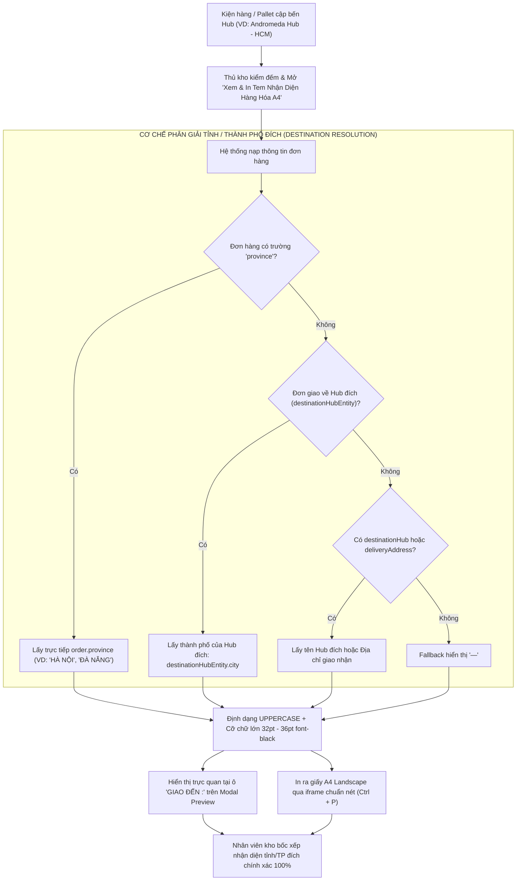

# Feedback 09/10 (Task 16) — Chuẩn Hóa Hiển Thị Tỉnh/Thành Phố Đích Trên Tem Nhận Diện Hàng Hóa A4

> **Thời gian ghi nhận**: 09/10/2026  
> **Người báo cáo**: @【M】【C】【D】 (Phản hồi & Yêu cầu vận hành trực tiếp)  
> **Phạm vi tác động**:  
> - Modal Xem & In Tem Nhận Diện Hàng Hóa A4 ([`PalletLabelA4Modal`](file:///D:/Projects/logistics-website/frontend/src/features/warehouse/components/pallet-label-a4-modal.tsx))  
> - Quản lý Nhập kho (`/warehouse/inbound`) ➔ Danh sách đơn hàng con, Tác nghiệp Kiểm đếm ([`WarehouseTallyModal`](file:///D:/Projects/logistics-website/frontend/src/features/warehouse/components/warehouse-tally-modal.tsx)) & Chi tiết Vận đơn ([`WarehouseWaybillDetailModal`](file:///D:/Projects/logistics-website/frontend/src/features/warehouse/components/warehouse-waybill-detail-modal.tsx))  
> - Bảng kê Nhập kho dạng lưới ([`WarehouseEditableGrid`](file:///D:/Projects/logistics-website/frontend/src/features/warehouse/components/warehouse-editable-grid.tsx))  
> - Quản lý Hàng hóa trong kho (`/warehouse/orders`) ➔ Nút in tem trên từng dòng vận đơn & Modal chi tiết vận đơn  
> - Quản lý Xuất kho & Chuyển giao ([`WarehouseOutboundTransferFlow`](file:///D:/Projects/logistics-website/frontend/src/features/warehouse/components/warehouse-outbound-transfer-flow.tsx))  
> - Backend API Logistics TMS (NestJS 11+ / PostgreSQL trên Neon)  
> **Tài liệu tham chiếu**:  
> - `/leader` Business Domain Architecture ([`SKILL.md`](file:///D:/Projects/logistics-website/.agents/skills/leader/SKILL.md))  
> - Quy chế phát triển hệ thống [`AGENTS.md`](file:///D:/Projects/logistics-website/AGENTS.md)  
> - Quy chuẩn giao diện hẹp [`.agents/rules/ui-compact-density.md`](file:///D:/Projects/logistics-website/.agents/rules/ui-compact-density.md) & [`ui-spacing-guard`](file:///D:/Projects/logistics-website/.agents/skills/ui-spacing-guard/SKILL.md)  
> - Quy chuẩn kiểm soát kiện vận tải (No-SKU, Consignment / Pallet Level)  
> **Ảnh minh chứng đính kèm trong thư mục**:  
> - [`screenshot_01.jpg`](file:///D:/Projects/logistics-website/feedback_09_10_task_16/screenshot_01.jpg): Ảnh chụp màn hình popup "Xem & In Tem Nhận Diện Hàng Hóa A4" của đơn hàng `NDA2610-419`, ô dòng thứ 5 bên cạnh nhãn "GIAO ĐẾN :" bị khoanh đỏ do đang trống rỗng hoàn toàn, không hiển thị tỉnh/thành phố của đơn hàng.  
> - [TODO.md](file:///D:/Projects/logistics-website/feedback_09_10_task_16/TODO.md): Kế hoạch và danh sách đầu việc triển khai chi tiết.  

---

## 📌 Bối cảnh nghiệp vụ thực tế (Chốt theo phản hồi người dùng)

### 1. Phản hồi gốc từ người dùng (@【M】【C】【D】)
> *"cho ô khoanh đỏ này hiển thị nội dung tỉnh/tp của đơn hàng"*

---

### 2. Tình huống vận hành thực tế tại Hub kho vận & Tuyến liên tỉnh
Trong mô hình vận tải hàng hóa đường dài Bắc - Nam (Linehaul Inter-hub) và phân phối chặng cuối (Last-mile delivery):
1. **Mục đích của Tem nhận diện hàng hóa A4 (Pallet Label A4 Landscape)**:
   - Tem nhận diện khổ A4 nằm ngang được in ra để dán trực tiếp lên kiện hàng lớn, thùng carton tổng hoặc quấn màng co bên ngoài Pallet hàng hóa khi hàng cập bến kho bãi (Inbound Tally) hoặc khi đóng hàng chuẩn bị xuất kho (Outbound Dispatch).
   - Tem giúp các bộ phận: Thủ kho, Nhân viên bốc xếp (Tallyman), Lái xe nâng (Forklift Driver), và Tài xế xe tải nhận diện nhanh thông tin cốt lõi của kiện hàng từ khoảng cách 2 – 3 mét mà không cần dùng máy quét barcode chuyên dụng.

2. **Vai trò sống còn của ô "GIAO ĐẾN :" (Destination Province / City)**:
   - Tại các Hub trung chuyển lớn (như `Andromeda Hub - HCM`, `Magellan Hub - Đà Nẵng`, `Polaris Hub - Hưng Yên`), mỗi ngày có hàng trăm pallet và hàng nghìn kiện hàng luân chuyển qua kho.
   - Khi dỡ hàng xuống sàn kho hoặc phân luồng ra cửa xuất (Gate/Bay), nhân viên kho bắt buộc phải nhìn vào ô **"GIAO ĐẾN :"** để phân loại hàng (Sortation):
     * Kiện nào giao về nội thành `HỒ CHÍ MINH`?
     * Kiện nào chuyển tiếp ra `ĐÀ NẴNG`, `HÀ NỘI`, `HƯNG YÊN`?
     * Kiện nào đi các tỉnh tuyến xe bo như `NGHỆ AN`, `BÌNH ĐỊNH`, `CẦN THƠ`?
   - **Thực trạng bất cập hiện tại**: Ô dữ liệu bên cạnh nhãn "GIAO ĐẾN :" đang bị bỏ trống trắng tinh (cả trên Modal Preview lẫn trong bản in qua iframe). Thủ kho khi in tem ra buộc phải lấy bút dạ/bút lông dầu viết tay tên tỉnh/thành phố lên giấy A4. Việc này vừa gây mất thời gian, thiếu tính chuyên nghiệp của hệ thống TMS, vừa tiềm ẩn nguy cơ viết nhầm hoặc nhìn nhầm dẫn đến bốc nhầm xe, gửi sai tuyến đường.



---

### 3. Quy chuẩn trường thông tin & Nguyên tắc phân giải dữ liệu Tỉnh/Thành phố
Theo chuẩn dữ liệu Master Contract và Ledger nghiệp vụ của hệ thống:
1. **Trường dữ liệu chính (`order.province`)**:
   - Khi tạo đơn hàng (qua màn hình Dispatcher, Bốc thêm đơn dọc đường, Nhập kho lưới Editable Grid, hoặc Import Excel), hệ thống đã có trường `province` (Tỉnh / Thành phố đích của đơn hàng).
   - Ví dụ: `Hà Nội`, `Hồ Chí Minh`, `Đà Nẵng`, `Hưng Yên`, `Nghệ An`, `Bình Định`, v.v.
2. **Cơ chế Fallback phân tầng thông minh (Multi-tiered Fallback Hierarchy)**:
   Để đảm bảo không bao giờ để trống ô "GIAO ĐẾN :" ngay cả với các đơn hàng cũ hoặc đơn hàng luân chuyển nội bộ giữa các Hub mà không nhập tay trường `province`:
   - **Tầng 1 (Ưu tiên số 1)**: `order.province` (Tỉnh/thành phố đích của đơn hàng).
   - **Tầng 2 (Ưu tiên số 2)**: `order.destinationHubEntity.city` (Thành phố của Hub đích mà đơn hàng được luân chuyển tới, ví dụ: Hub Hưng Yên thì `city` là `Hưng Yên`, Hub Đà Nẵng thì `city` là `Đà Nẵng`).
   - **Tầng 3 (Ưu tiên số 3)**: `order.destinationHub` (Tên Hub đích hoặc tên địa danh đích).
   - **Tầng 4 (Ưu tiên số 4)**: `order.deliveryAddress` (Địa chỉ giao hàng cho khách).
   - **Tầng 5 (Mặc định)**: `'—'`.
3. **Quy chuẩn hiển thị hình ảnh trên Tem A4 Landscape**:
   - **Văn bản**: Chuyển toàn bộ thành chữ in hoa (`.toUpperCase()`).
   - **Định dạng phông chữ**: `font-black` (weight 900), phông chữ Sans-serif hệ thống (`Arial, 'Segoe UI', Tahoma, sans-serif`), tracking rộng (`tracking-wide` hoặc `letter-spacing: 1.5px`).
   - **Cỡ chữ**:
     * Trên màn hình Preview: `text-2xl sm:text-4xl font-black text-black`.
     * Trên bản in thực tế (CSS `@page { size: A4 landscape; }`): `font-size: 32pt; font-weight: 900; line-height: 1.2; text-align: center; text-transform: uppercase;`.
   - **Chiều cao ô**: Cố định khoảng `h-20 sm:h-24` (bản in ~34mm - 38mm) để chữ to rõ ràng, cân đối tuyệt đối với ô `MÃ ĐƠN HÀNG` và ô `SỐ LƯỢNG`.

---

## 🔍 Tổng hợp các điểm chưa đúng trên giao diện cũ

*(Đối chiếu trực tiếp với [`screenshot_01.jpg`](file:///D:/Projects/logistics-website/feedback_09_10_task_16/screenshot_01.jpg) và mã nguồn hiện hữu)*

1. **Ô dữ liệu hàng "GIAO ĐẾN :" bị bỏ trống hoàn toàn** (Điểm khoanh đỏ trong `screenshot_01.jpg`):
   - Trong file [`pallet-label-a4-modal.tsx`](file:///D:/Projects/logistics-website/frontend/src/features/warehouse/components/pallet-label-a4-modal.tsx):
     * Dòng 250 (Bản in HTML iframe):
       ```html
       <!-- Row 5: GIAO ĐẾN -->
       <tr>
         <td class="col-label">GIAO ĐẾN :</td>
         <td colspan="3" class="val-dest"></td>
       </tr>
       ```
       Thẻ `<td class="val-dest"></td>` hoàn toàn không có biến nội dung nào được nhúng vào.
     * Dòng 393 (Bản xem trước Dialog JSX):
       ```tsx
       {/* Row 5: GIAO ĐẾN */}
       <tr>
         <td className="w-[22%] border-r-[1.5px] border-black px-3.5 py-4 text-xs sm:text-sm font-bold align-middle">
           GIAO ĐẾN :
         </td>
         <td colSpan={3} className="px-4 py-5 text-center align-middle text-2xl sm:text-4xl font-black uppercase tracking-wide text-black h-20 sm:h-24">
         </td>
       </tr>
       ```
       Thẻ `<td>` hiển thị nội dung trống rỗng, khiến người dùng nhìn thấy một ô trắng trơn như khoanh đỏ trong ảnh.

2. **Interface `PalletLabelData` bị khuyết trường dữ liệu Tỉnh/Thành phố**:
   - Trong [`pallet-label-a4-modal.tsx`](file:///D:/Projects/logistics-website/frontend/src/features/warehouse/components/pallet-label-a4-modal.tsx) (Dòng 15–32):
     ```typescript
     export interface PalletLabelData {
       orderCode: string;
       goodsDescription: string;
       totalQuantity: number;
       packagesOnPallet?: number;
       palletIndex?: number;
       totalPallets?: number;
       originHub?: string;
       destinationHub?: string;
       deliveryAddress?: string;
       createdAt?: string | Date;
       receiverOrDriverName?: string;
       warehouseName?: string;
     }
     ```
     Interface hoàn toàn không có trường `province?: string | null;` và `destinationHubEntity?: { id?: number; name?: string; city?: string | null } | null;`.

3. **Tất cả các điểm gọi mở `PalletLabelA4Modal` trên Frontend chưa truyền trường `province`**:
   - **Điểm 1 - Trang Nhập kho ([`inbound/page.tsx`](file:///D:/Projects/logistics-website/frontend/src/app/dashboard/warehouse/inbound/page.tsx))**:
     * Dòng 1241–1247: Khi bấm in tem tại danh sách đơn con `subOrder`, chỉ truyền `originHub`, `destinationHub`, `warehouseName`, thiếu `province`.
     * Dòng 1420–1423: Khi bấm "Xem trước" tem tại chế độ nhập thủ công Mode 1, thiếu `province`.
     * Dòng 1496–1499: Callback `onPrintLabel` từ [`WarehouseWaybillDetailModal`](file:///D:/Projects/logistics-website/frontend/src/features/warehouse/components/warehouse-waybill-detail-modal.tsx), thiếu `province`.
     * Dòng 1533–1536: Callback `onPrintLabel` từ [`WarehouseTallyModal`](file:///D:/Projects/logistics-website/frontend/src/features/warehouse/components/warehouse-tally-modal.tsx), thiếu `province`.
   - **Điểm 2 - Trang Tồn kho ([`orders/page.tsx`](file:///D:/Projects/logistics-website/frontend/src/app/dashboard/warehouse/orders/page.tsx))**:
     * Dòng 301–305: Nút in tem trực tiếp trên từng dòng hàng hóa, thiếu `province`.
     * Dòng 657–661: Callback `onPrintLabel` từ modal chi tiết vận đơn, thiếu `province`.
   - **Điểm 3 - Modal Chi tiết Vận đơn ([`warehouse-waybill-detail-modal.tsx`](file:///D:/Projects/logistics-website/frontend/src/features/warehouse/components/warehouse-waybill-detail-modal.tsx))**:
     * Dòng 248–252: Hàm `handleOpenPreviewLabel`, mặc dù đối tượng `waybill` có `waybill.province`, nhưng không đưa vào `setPreviewLabelData`.
   - **Điểm 4 - Bảng lưới Nhập kho ([`warehouse-editable-grid.tsx`](file:///D:/Projects/logistics-website/frontend/src/features/warehouse/components/warehouse-editable-grid.tsx))**:
     * Dòng 1308–1311: Nút in tem nhanh trên từng dòng của lưới, dòng có trường `r.province` nhưng không truyền vào `openPrintLabel`.
   - **Điểm 5 - Luồng Xuất kho ([`warehouse-outbound-transfer-flow.tsx`](file:///D:/Projects/logistics-website/frontend/src/features/warehouse/components/warehouse-outbound-transfer-flow.tsx))**:
     * Dòng 930–933 & Dòng 1158–1161: Nút in tem cho đơn hàng xuất kho trung chuyển, chỉ truyền `destinationHub: selectedDestHub.name`, không truyền tỉnh/thành phố hoặc `selectedDestHub.city`.

4. **Kiểm tra tầng Backend API & Quan hệ Dữ liệu**:
   - Thực thể `OrderEntity` ([`order.entity.ts`](file:///D:/Projects/logistics-website/backend/src/orders/infrastructure/persistence/relational/entities/order.entity.ts)) đã có sẵn cột `province: string | null` (di chuyển từ migration `1788980000000-AddProvinceToOrder.ts`).
   - Cần đảm bảo trong các truy vấn TypeORM (`WarehouseService.getOrders`, `WarehouseService.getTripManifest`, `OrdersService.findOne`), quan hệ `destinationHubEntity` luôn được `leftJoinAndSelect` đầy đủ để frontend có thể truy cập `order.destinationHubEntity.city` làm fallback vững chắc.

---

## 📋 Danh sách công việc triển khai (Action Checklist)

### 1. Backend (`backend/`)
- [x] **Rà soát & đảm bảo quan hệ `destinationHubEntity` kèm cột `city` trong các truy vấn**:
  - [`warehouse.service.ts`](file:///D:/Projects/logistics-website/backend/src/orders/warehouse.service.ts):
    * Kiểm tra `getOrders()`: Đảm bảo `.leftJoinAndSelect('order.destinationHubEntity', 'destinationHubEntity')` đang nạp đủ các trường của `HubEntity` (bao gồm `city`, `name`, `code`).
    * Kiểm tra `getTripManifest()`: Đảm bảo đối tượng trả về chứa đầy đủ `province` từ `order.province` và `destinationHubEntity.city` (bổ sung fallback `resolvedDestEntity` giữ nguyên `destEntity.city` khi `DIRECT_CUSTOMER`).
    * Kiểm tra `appendOrderToTrip()` và `quickCreateInboundOrder()`: Đảm bảo lưu đúng `province` vào cơ sở dữ liệu khi phát sinh đơn hàng mới.
  - [`orders.service.ts`](file:///D:/Projects/logistics-website/backend/src/orders/orders.service.ts):
    * Bổ sung `.leftJoinAndSelect('order.originHubEntity', 'originHubEntity')` và `.leftJoinAndSelect('order.destinationHubEntity', 'destinationHubEntity')` trong `findAll()`, cùng `findOne()` đã select đầy đủ quan hệ.
- [x] **Kiểm tra biên dịch & Linting Backend**:
  - Chạy `npm run lint --prefix backend` và `npm run build --prefix backend` ➔ PASS (0 errors).

---

### 2. Frontend (`frontend/`)

- [x] **Nâng cấp Component `PalletLabelA4Modal` ([`pallet-label-a4-modal.tsx`](file:///D:/Projects/logistics-website/frontend/src/features/warehouse/components/pallet-label-a4-modal.tsx))**:
  - Mở rộng interface `PalletLabelData`:
    ```typescript
    export interface PalletLabelData {
      orderCode: string;
      goodsDescription: string;
      totalQuantity: number;
      packagesOnPallet?: number;
      palletIndex?: number;
      totalPallets?: number;
      originHub?: string;
      destinationHub?: string;
      deliveryAddress?: string;
      province?: string | null; // <-- Bổ sung Tỉnh/Thành phố của đơn hàng
      destinationHubEntity?: { id?: number; name?: string; code?: string; city?: string | null } | null;
      createdAt?: string | Date;
      receiverOrDriverName?: string;
      warehouseName?: string;
    }
    ```
  - Xây dựng biến phân giải Tỉnh/Thành phố hiển thị:
    ```typescript
    const destinationDisplay = (
      data?.province?.trim() ||
      data?.destinationHubEntity?.city?.trim() ||
      data?.destinationHub?.trim() ||
      data?.deliveryAddress?.trim() ||
      '—'
    ).toUpperCase();
    ```
  - Cập nhật mẫu in iframe (`handlePrint`):
    ```html
    <!-- Row 5: GIAO ĐẾN -->
    <tr>
      <td class="col-label">GIAO ĐẾN :</td>
      <td colspan="3" class="val-dest">${destinationDisplay}</td>
    </tr>
    ```
  - Cập nhật bản xem trước Dialog JSX:
    ```tsx
    {/* Row 5: GIAO ĐẾN */}
    <tr>
      <td className="w-[22%] border-r-[1.5px] border-black px-3.5 py-4 text-xs sm:text-sm font-bold align-middle">
        GIAO ĐẾN :
      </td>
      <td colSpan={3} className="px-4 py-5 text-center align-middle text-2xl sm:text-4xl font-black uppercase tracking-wide text-black h-20 sm:h-24">
        {destinationDisplay}
      </td>
    </tr>
    ```
  - Bổ sung `destinationDisplay` vào dependency array của `useEffect` (bắt phím tắt `Ctrl + P`).

- [x] **Cập nhật dữ liệu truyền vào `PalletLabelA4Modal` tại tất cả 5 màn hình vận hành**:
  - **1. Quản lý Nhập kho ([`inbound/page.tsx`](file:///D:/Projects/logistics-website/frontend/src/app/dashboard/warehouse/inbound/page.tsx))**:
    * Tại danh sách đơn con `subOrder`: Bổ sung `province: subOrder.province || subOrder.destinationHubEntity?.city || dest` và `destinationHubEntity: subOrder.destinationHubEntity`.
    * Tại chế độ nhập kho thủ công Mode 1: Bổ sung `province: r.province || r.deliveryAddress`.
    * Tại callback `onPrintLabel` của `WarehouseWaybillDetailModal`: Bổ sung `province` và `destinationHubEntity`.
    * Tại callback `onPrintLabel` của `WarehouseTallyModal`: Bổ sung `province` và `destinationHubEntity`.
  - **2. Quản lý Hàng hóa trong kho ([`orders/page.tsx`](file:///D:/Projects/logistics-website/frontend/src/app/dashboard/warehouse/orders/page.tsx))**:
    * Tại nút in tem trên từng dòng bảng kê: Bổ sung `province: m.province || m.destinationHubEntity?.city || m.destinationHub` và `destinationHubEntity: m.destinationHubEntity`.
    * Tại callback `onPrintLabel` của `WarehouseWaybillDetailModal`: Bổ sung `province: w.province || w.destinationHubEntity?.city || w.destinationHub` và `destinationHubEntity: w.destinationHubEntity`.
  - **3. Modal Chi tiết Vận đơn ([`warehouse-waybill-detail-modal.tsx`](file:///D:/Projects/logistics-website/frontend/src/features/warehouse/components/warehouse-waybill-detail-modal.tsx))**:
    * Bổ sung `city?: string | null` vào type `WaybillDetailData['destinationHubEntity']`.
    * Trong hàm `handleOpenPreviewLabel`: Bổ sung `province: waybill.province || waybill.destinationHubEntity?.city || waybill.destinationHub` và `destinationHubEntity: waybill.destinationHubEntity`.
  - **4. Bảng kê Nhập kho dạng lưới ([`warehouse-editable-grid.tsx`](file:///D:/Projects/logistics-website/frontend/src/features/warehouse/components/warehouse-editable-grid.tsx))**:
    * Trong hàm gọi `openPrintLabel`: Bổ sung `province: r.province || r.deliveryAddress`.
  - **5. Quản lý Xuất kho & Chuyển giao ([`warehouse-outbound-transfer-flow.tsx`](file:///D:/Projects/logistics-website/frontend/src/features/warehouse/components/warehouse-outbound-transfer-flow.tsx))**:
    * Bổ sung `province?: string | null` và `destinationHubEntity` vào interface `StoredOrderItem`.
    * Tại 2 vị trí gọi `setPrintLabelData` (Step 2 và Step 3): Bổ sung `province: order.province || selectedDestHub.city || selectedDestHub.name` và `destinationHubEntity`.

- [x] **Tuân thủ quy chuẩn Compact Density & Cleanliness**:
  - Đảm bảo không phá vỡ layout của bảng in tem A4 Landscape.
  - Chiều cao dòng và font size căn chỉnh sắc nét, không để chữ dài bị tràn viền giấy in.

---

### 3. Kiểm thử & Nghiệm thu (Quality Assurance & Definition of Done)

- [x] **Kiểm tra biên dịch & Linting toàn dự án**:
  - Chạy `npm run lint --prefix backend` và `npm run build --prefix backend` ➔ PASS (0 errors).
  - Chạy `node frontend/node_modules/typescript/bin/tsc --project frontend/tsconfig.json --noEmit` ➔ PASS (0 errors).
  - Chạy `oxlint` trên các file frontend sửa đổi ➔ PASS (0 errors).
- [x] **Kịch bản kiểm thử nghiệp vụ thực tế (Manual & E2E Verification)**:
  - File Playwright E2E Suite: [`frontend/e2e/43-feedback-09-10-task-16.spec.ts`](file:///D:/Projects/logistics-website/frontend/e2e/43-feedback-09-10-task-16.spec.ts)
  - Kết quả kiểm toán chất lượng E2E (`node scripts/e2e-auditor.mjs`): **50/50 điểm 🟢 PASS (0 FAIL, 0 WARN)**.
  - Bằng chứng nghiệm thu screenshot: [`screenshot_pallet_label_verified.png`](file:///D:/Projects/logistics-website/feedback_09_10_task_16/screenshot_pallet_label_verified.png) & [`screenshot_02_verified.png`](file:///D:/Projects/logistics-website/feedback_09_10_task_16/screenshot_02_verified.png).
  - **Kịch bản 1: Mở tem đơn hàng có trường `province` tường minh**:
    1. Đăng nhập hệ thống với tài khoản Quản lý kho (`WAREHOUSE_MANAGER`) hoặc Điều phối viên (`DISPATCHER`).
    2. Vào trang Quản lý Hàng hóa kho (`/warehouse/orders`) hoặc Nhập kho (`/warehouse/inbound`).
    3. Chọn đơn hàng có trường tỉnh/thành phố rõ ràng (ví dụ: đơn `NDA2610-419` hoặc đơn đi `Hà Nội`).
    4. Bấm nút biểu tượng Máy in ("In tem nhận diện A4").
    5. **Kết quả mong đợi**: Modal "Xem & In Tem Nhận Diện Hàng Hóa A4" bật lên, tại hàng "GIAO ĐẾN :", ô khoanh đỏ trước đây hiển thị chữ in hoa đậm nét: `HÀ NỘI` (hoặc `TP. HỒ CHÍ MINH`, `ĐÀ NẴNG` tương ứng).
  - **Kịch bản 2: Mở tem đơn hàng luân chuyển liên Hub (Kiểm tra Fallback City của Hub)**:
    1. Chọn một đơn hàng trung chuyển đi `Polaris Hub - Hưng Yên` hoặc `Magellan Hub - Đà Nẵng` nhưng trường `province` đang rỗng/null.
    2. Bấm "In tem nhận diện A4".
    3. **Kết quả mong đợi**: Hệ thống tự động fallback lấy `destinationHubEntity.city`, hiển thị chính xác `HƯNG YÊN` hoặc `ĐÀ NẴNG` tại ô "GIAO ĐẾN :", tuyệt đối không để ô trống.
  - **Kịch bản 3: Kích hoạt in thực tế ra khổ A4 Landscape (Print Command)**:
    1. Trên modal preview, nhấn tổ hợp phím `Ctrl + P` hoặc bấm nút `[In Tem Ngay (Ctrl + P)]`.
    2. Hộp thoại in trình duyệt xuất hiện với khổ in A4 Nằm ngang (Landscape).
    3. **Kết quả mong đợi**: Nội dung ô "GIAO ĐẾN :" hiển thị rõ ràng, font size lớn (~32pt - 36pt), căn giữa ô, đường viền nét đôi/đơn chuẩn xác, QR code hiển thị rõ ràng.
  - **Kịch bản 4: Kiểm tra sự đồng nhất trên cả 5 vị trí phát sinh in tem**:
    1. Kiểm tra in tem từ `/warehouse/inbound` (Danh sách đơn con & Modal kiểm đếm).
    2. Kiểm tra in tem từ `/warehouse/orders` (Danh sách tồn kho).
    3. Kiểm tra in tem từ [`WarehouseWaybillDetailModal`](file:///D:/Projects/logistics-website/frontend/src/features/warehouse/components/warehouse-waybill-detail-modal.tsx) (Nút "In tem Pallet A4").
    4. Kiểm tra in tem từ [`WarehouseEditableGrid`](file:///D:/Projects/logistics-website/frontend/src/features/warehouse/components/warehouse-editable-grid.tsx) (Nhập kho dạng bảng Excel).
    5. Kiểm tra in tem từ [`WarehouseOutboundTransferFlow`](file:///D:/Projects/logistics-website/frontend/src/features/warehouse/components/warehouse-outbound-transfer-flow.tsx) (Bảng xuất kho lên xe).
    6. **Kết quả mong đợi**: Cả 5 vị trí đều nạp đầy đủ thông tin Tỉnh/Thành phố đích và hiển thị đồng nhất 100%.
