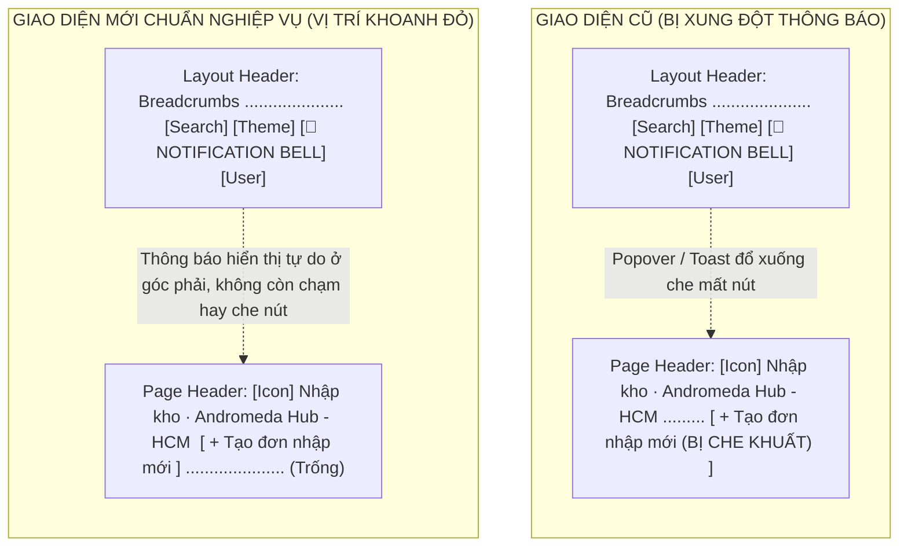

# Feedback 09/10 (Task 18) — Tối ưu Vị trí Nút Hành động "Tạo đơn nhập mới" & "Xuất kho" Ngay Sau Tên Hub Chống Che Khuất Bởi Thông Báo

> **Thời gian ghi nhận**: 09/10/2026 - 17:31  
> **Người báo cáo**: @【M】【C】【D】 (Quản lý nghiệp vụ / Vận hành hệ thống TMS)  
> **Phạm vi tác động**:  
> - Quản lý Nhập kho (`/dashboard/warehouse/inbound`) ➔ Header trang Board Nhập kho ([`page.tsx`](file:///D:/Projects/logistics-website/frontend/src/app/dashboard/warehouse/inbound/page.tsx))  
> - Quản lý Xuất kho (`/dashboard/warehouse/outbound`) ➔ Header trang Board Xuất kho ([`page.tsx`](file:///D:/Projects/logistics-website/frontend/src/app/dashboard/warehouse/outbound/page.tsx))  
> - Header thanh điều hướng hệ thống & Khung thông báo ([`header.tsx`](file:///D:/Projects/logistics-website/frontend/src/components/layout/header.tsx) & [`notification-center.tsx`](file:///D:/Projects/logistics-website/frontend/src/features/notifications/components/notification-center.tsx))  
> **Tài liệu tham chiếu**:  
> - `/leader` Business Domain Architecture ([`SKILL.md`](file:///D:/Projects/logistics-website/.agents/skills/leader/SKILL.md))  
> - Quy chế phát triển hệ thống [`AGENTS.md`](file:///D:/Projects/logistics-website/AGENTS.md)  
> - Quy chuẩn giao diện hẹp [`.agents/rules/ui-compact-density.md`](file:///D:/Projects/logistics-website/.agents/rules/ui-compact-density.md) & [`ui-spacing-guard`](file:///D:/Projects/logistics-website/.agents/skills/ui-spacing-guard/SKILL.md)  
> - Quy tắc nút bấm & biểu tượng không trùng lặp (Zero Redundant Icons Rule)  
> **Ảnh minh chứng đính kèm trong thư mục**:  
> - [`screenshot_01.jpg`](file:///D:/Projects/logistics-website/feedback_09_10_task_18/screenshot_01.jpg): Ảnh chụp màn hình trang `/dashboard/warehouse/inbound` với khoanh đỏ vị trí mới ngay sau tên Hub (`Nhập kho · Andromeda Hub - HCM [KHOANH ĐỎ]`), đối chiếu với vị trí nút cũ nằm ở góc trên bên phải (`justify-between`) bị che khuất bởi phần hiển thị thông báo / popover.

---

## 📌 Bối cảnh nghiệp vụ thực tế (Chốt theo phản hồi người dùng)

### 1. Phản hồi gốc từ người dùng (@【M】【C】【D】)
> *", chuyển các nút tạo đơn nhập kho mới và nút xuất kho ra các vị trí ngay sau tên hub (khoanh đỏ). Lý do vị trí cũ bị phần hiển thông báo che khuất."*

---

### 2. Tình huống vận hành thực tế tại Hub kho bãi & Luồng thao tác của Thủ kho

Trong nghiệp vụ vận hành kho bãi hàng ngày của hệ thống Logistics TMS (Spider Express):
- **Đối tượng thao tác chính**: Thủ kho (`RoleEnum.WAREHOUSE_MANAGER`) và Quản trị viên (`RoleEnum.SUPER_ADMIN`).
- **Môi trường tác nghiệp**: Thao tác liên tục trên máy tính bàn hoặc laptop tại bàn làm việc ở trạm kho/Hub với cường độ tiếp nhận và điều phối xe dày đặc.
- **Tần suất sử dụng nút hành động**:
  * Nút **"Tạo đơn nhập mới"** trên trang Nhập kho (`/dashboard/warehouse/inbound`) được kích hoạt mỗi khi có khách hàng mang hàng gửi trực tiếp tại quầy hoặc phát sinh hàng dỡ đột xuất tại Hub.
  * Nút **"Xuất kho"** trên trang Xuất kho (`/dashboard/warehouse/outbound`) được kích hoạt khi thủ kho lập kế hoạch xuất giao hàng cho khách hoặc điều chuyển hàng sang các Hub liên tỉnh.
- **Vấn đề xung đột giao diện thực tế**:
  * Tại thanh Header cố định trên cùng (`Header.tsx`), góc phải là khu vực của chuông thông báo thời gian thực (`NotificationCenter`), chế độ giao diện (`ThemeModeToggle`, `ThemeSelector`), và hồ sơ tài khoản.
  * Các thông báo hệ thống liên tục được đẩy về (thông báo chuyến xe mới, đơn hàng mới được bàn giao từ đội xe, thông báo hủy đơn, hay các popover thông báo nổi/toasts góc phải).
  * Do Header của trang nội dung bên dưới đang dùng cấu trúc `justify-between`, nút hành động chính (`+ Tạo đơn nhập mới` và `+ Xuất kho`) bị đẩy sang sát lề phải màn hình — nằm trực tiếp ngay bên dưới hoặc cùng tọa độ với các khối thông báo / dropdown popover.
  * Hậu quả: Khi có thông báo mới rơi xuống, hoặc khi thủ kho đang mở popover thông báo để xem danh sách đơn hàng vừa cập nhật, phần thông báo này **che lấp hoàn toàn** nút "Tạo đơn nhập mới" / "Xuất kho", khiến thủ kho không thể click hoặc phải tốn thao tác đóng thông báo mới thực hiện được nghiệp vụ.

---

### 3. Sơ đồ tái cấu trúc vị trí giao diện (Before vs After)



---

### 4. Quy định chi tiết về vị trí, trạng thái hiển thị và hành vi nút bấm

1. **Vị trí hiển thị mới**:
   - Đặt nút hành động chính ngay sau chuỗi tiêu đề `<span>Nhập kho · {currentHubName}</span>` (hoặc `<span>Xuất kho · {currentHubName}</span>`).
   - Khoảng cách giữa tên Hub và nút: `gap-2.5` (10px), đảm bảo cân đối thị giác, không dính sát chữ nhưng liền mạch trong cùng một khối nhận diện (`flex flex-wrap items-center gap-2.5`).
2. **Quy tắc hiển thị theo ngữ cảnh (Contextual Visibility)**:
   - **Khi ở chế độ Bảng danh sách (`activeView === 'BOARD'`)**:
     * Hiển thị nút hành động chính ngay sau tên Hub (`+ Tạo đơn nhập mới` trên trang Nhập kho; `+ Xuất kho` trên trang Xuất kho).
     * Góc phải của header trang để trống hoặc chỉ chứa các bộ lọc mở rộng (nếu có).
   - **Khi ở chế độ Tạo phiếu / Thao tác con (`activeView !== 'BOARD'`)**:
     * Ẩn nút tạo mới cạnh tên Hub (để tránh người dùng bấm tạo mới lặp lại khi đang trong tiến trình điền form).
     * Nút **`<Button><IconX /> Quay lại danh sách</Button>`** hiển thị ở góc bên phải (`justify-between`), giữ nguyên luồng điều hướng thoát quay lại màn hình chính.
3. **Quy chuẩn kích thước & kiểu dáng (UI Compact Density & Brand Palette)**:
   - Kích thước: `h-8` (chiều cao chuẩn 32px), padding ngang `px-2.5` (10px) gọn gàng, không chiếm dụng chiều dọc.
   - Màu sắc: Nền Navy thương hiệu `#0F3D62`, hover `#0c314f`, chữ trắng `text-white`, font `text-xs font-bold shadow-sm`.
   - Biểu tượng: `<IconPlus className='mr-1 h-4 w-4' />` kết hợp nhãn văn bản sạch (Zero Redundant Icons: không thêm dấu `+` thừa trong chuỗi chữ `Tạo đơn nhập mới` / `Xuất kho`).
   - Responsive: Sử dụng `flex-wrap` và `shrink-0` cho icon/nút để trên màn hình điện thoại hoặc máy tính bảng khi tên Hub quá dài, nút tự động xuống dòng mượt mà mà không làm vỡ khung.

---

## 🔍 Tổng hợp các điểm chưa đúng trên giao diện cũ

Đối chiếu trực tiếp với ảnh chụp màn hình [`screenshot_01.jpg`](file:///D:/Projects/logistics-website/feedback_09_10_task_18/screenshot_01.jpg) và mã nguồn hiện tại:

1. **Xung đột vị trí và bị che khuất bởi Khối thông báo (Notification Overlap / Occlusion)**:
   - *Hiện trạng trên ảnh [`screenshot_01.jpg`](file:///D:/Projects/logistics-website/feedback_09_10_task_18/screenshot_01.jpg)*: Nút `+ Tạo đơn nhập mới` được căn lề sang tận cùng bên phải của Page Header thông qua container `flex flex-wrap items-center justify-between`.
   - *Hậu quả vận hành*: Vị trí này nằm trực tiếp ngay bên dưới khu vực hiển thị của component `<NotificationCenter />` và các thông báo dạng Toast của hệ thống. Khi có thông báo đến, cửa sổ popover che mất nút, khiến thủ kho không thể ấn tạo đơn ngay.
2. **Phá vỡ tính liền mạch thị giác (Visual Proximity Violation)**:
   - Thủ kho khi quan sát giao diện sẽ nhìn vào tên Hub ở bên trái (`Andromeda Hub - HCM`) để xác định đúng kho mình đang phụ trách, nhưng lại phải rê mắt và chuột sang tận góc đối diện bên phải màn hình rộng để bấm nút tạo đơn.
   - Chuyển nút về ngay sau tên Hub (vùng khoanh đỏ) tuân thủ nguyên lý Fitts's Law và Contextual Grouping, giúp thao tác bấm nhanh hơn gấp nhiều lần.
3. **Hiện tượng tương tự trên màn hình Quản lý Xuất kho (`/dashboard/warehouse/outbound`)**:
   - Khảo sát mã nguồn tại [`outbound/page.tsx`](file:///D:/Projects/logistics-website/frontend/src/app/dashboard/warehouse/outbound/page.tsx#L1031-L1051) cho thấy nút `+ Xuất kho` cũng đang dùng chung cấu trúc `justify-between` và bị đẩy sang góc phải:
     ```tsx
     {activeView === 'BOARD' ? (
       <div className='flex items-center gap-2'>
         <Button onClick={handleOpenNewMode1} className='bg-[#0F3D62] text-white hover:bg-[#0c314f] text-xs font-bold'>
           <IconPlus className='mr-1 h-4 w-4' /> Xuất kho
         </Button>
       </div>
     ) : ...}
     ```
   - Nút này cũng gặp đúng vấn đề bị che khuất bởi thông báo như màn hình Nhập kho, cần được đồng bộ vị trí ngay sau tên Hub.
4. **Vi phạm quy chuẩn giao diện hẹp (UI Compact Density) nếu không tối ưu kích thước nút**:
   - Nếu đưa nút vào cùng dòng tiêu đề mà không gán kích thước gọn gàng (`h-8`, `px-2.5`, `text-xs`) sẽ làm đội chiều cao của Page Header, gây lãng phí không gian thao tác phía dưới bảng danh sách chuyến xe.

---

## 📋 Danh sách công việc triển khai (Action Checklist)

### 1. Backend (`backend/`)
> [!NOTE]
> Task này hoàn toàn là tái cấu trúc vị trí phần tử giao diện người dùng (Frontend Layout Optimization). Không phát sinh thay đổi cấu trúc bảng Cơ sở dữ liệu (Entity), không cần sinh Migration và không thay đổi DTO hay Service logic.

- [x] **Rà soát & Đảm bảo tính toàn vẹn của Backend APIs liên quan**:
  - [x] Kiểm tra tính ổn định của API danh sách chuyến xe nhập kho: `GET /api/v1/warehouse/inbound-trips`.
  - [x] Kiểm tra tính ổn định của API danh sách chuyến xe xuất kho: `GET /api/v1/warehouse/outbound-trips`.
  - [x] Đảm bảo các phân quyền RBAC (`RoleEnum.WAREHOUSE_MANAGER`, `RoleEnum.SUPER_ADMIN`) tiếp tục bảo vệ các endpoint này bình thường.

---

### 2. Frontend (`frontend/`)

- [x] **Tái cấu trúc Header trang Quản lý Nhập kho ([`frontend/src/app/dashboard/warehouse/inbound/page.tsx`](file:///D:/Projects/logistics-website/frontend/src/app/dashboard/warehouse/inbound/page.tsx))**:
  - [x] Gom nhóm tiêu đề trang và nút tạo đơn vào cùng một flex container:
    ```tsx
    <div className='flex flex-wrap items-center gap-2.5'>
      <h1 className='text-xl font-black tracking-tight flex items-center gap-2 text-[#0F3D62] dark:text-blue-400'>
        <IconBuildingWarehouse className='h-6 w-6 shrink-0' />
        <span>Nhập kho{currentHubName ? ` · ${currentHubName}` : ''}</span>
      </h1>
      {activeView === 'BOARD' && (
        <Button
          onClick={() => setActiveView('MODE1_CUSTOMER')}
          className='bg-[#0F3D62] text-white hover:bg-[#0c314f] text-xs font-bold shadow-sm h-8 px-2.5'
        >
          <IconPlus className='mr-1 h-4 w-4' /> Tạo đơn nhập mới
        </Button>
      )}
    </div>
    ```
  - [x] Giữ nguyên nút `Quay lại danh sách` (`activeView !== 'BOARD'`) ở góc bên phải (`justify-between`) để người dùng dễ dàng thoát khỏi màn hình tạo phiếu.
  - [x] Loại bỏ khối wrapper chứa nút cũ ở góc phải khi đang ở view `BOARD`.

- [x] **Tái cấu trúc Header trang Quản lý Xuất kho ([`frontend/src/app/dashboard/warehouse/outbound/page.tsx`](file:///D:/Projects/logistics-website/frontend/src/app/dashboard/warehouse/outbound/page.tsx))**:
  - [x] Gom nhóm tiêu đề trang và nút xuất kho vào cùng một flex container:
    ```tsx
    <div className='flex flex-wrap items-center gap-2.5'>
      <h1 className='text-xl font-black tracking-tight flex items-center gap-2 text-[#0F3D62] dark:text-blue-400'>
        <IconTruck className='h-6 w-6 shrink-0' />
        <span>Xuất kho{currentHubName ? ` · ${currentHubName}` : ''}</span>
      </h1>
      {activeView === 'BOARD' && (
        <Button
          onClick={handleOpenNewMode1}
          className='bg-[#0F3D62] text-white hover:bg-[#0c314f] text-xs font-bold shadow-sm h-8 px-2.5'
        >
          <IconPlus className='mr-1 h-4 w-4' /> Xuất kho
        </Button>
      )}
    </div>
    ```
  - [x] Giữ nguyên nút `Quay lại danh sách` ở góc bên phải khi ở các view tạo phiếu/luân chuyển (`activeView !== 'BOARD'`).
  - [x] Loại bỏ khối wrapper chứa nút cũ ở góc phải khi đang ở view `BOARD`.

- [x] **Tuân thủ nghiêm ngặt Quy chuẩn giao diện hẹp (UI Compact Density) & Zero Redundant Icons**:
  - [x] Kích thước nút chuẩn: Chiều cao `h-8`, padding ngang `px-2.5`, cỡ chữ `text-xs font-bold`.
  - [x] Zero redundant icons: Chỉ dùng icon vector `<IconPlus className='mr-1 h-4 w-4' />`, nhãn chữ sạch sẽ không lặp ký tự `+`.
  - [x] Đảm bảo tính tương thích hiển thị trên thiết bị di động (`flex-wrap`, không bị vỡ giao diện trên tablet/mobile).

---

### 3. Kiểm thử & Nghiệm thu (Definition of Done)

- [x] **Kiểm tra biên dịch & Linting (Zero Regressions)**:
  - [x] Type check Frontend: Chạy `npm run build --prefix frontend` đảm bảo 100% không có lỗi TypeScript, build production đạt kết quả thành công.
  - [x] Lint Frontend: Chạy `npm run lint --prefix frontend` đảm bảo không có lỗi cú pháp hoặc cảnh báo lặp lại.

- [x] **File Playwright E2E Verification Suite**:
  - 📍 Đường dẫn file spec: [`frontend/e2e/44-feedback-09-10-task-18.spec.ts`](file:///D:/Projects/logistics-website/frontend/e2e/44-feedback-09-10-task-18.spec.ts)
  - 🛡️ Kết quả E2E Code Audit: 50/50 điểm (🟢 PASS cả 5 tiêu chí: Completeness, Anti-Pattern Guard, Network Protocol, Real DB Zero-Mock, Visual Evidence).
  - 📸 Ảnh chụp bằng chứng nghiệm thu:
    + [`screenshot_01_verified.png`](file:///D:/Projects/logistics-website/feedback_09_10_task_18/screenshot_01_verified.png)
    + [`screenshot_inbound_button_verified.png`](file:///D:/Projects/logistics-website/feedback_09_10_task_18/screenshot_inbound_button_verified.png)
    + [`screenshot_outbound_button_verified.png`](file:///D:/Projects/logistics-website/feedback_09_10_task_18/screenshot_outbound_button_verified.png)

- [x] **Kịch bản kiểm thử trực quan & nghiệp vụ (5 Test Scenarios)**:
  - [x] **Kịch bản 1: Màn hình Nhập kho (Chế độ Board)**:
    1. Đăng nhập với vai trò Thủ kho (`WAREHOUSE_MANAGER`).
    2. Truy cập `/dashboard/warehouse/inbound`.
    3. Xác nhận tiêu đề hiển thị: `Nhập kho · [Tên Hub]` và nút `Tạo đơn nhập mới` nằm ngay phía sau với khoảng cách hợp lý (`gap-2.5`).
    4. Xác nhận góc trên bên phải của bảng không còn nút tạo đơn cũ (không bị che khuất bởi thông báo).
  - [x] **Kịch bản 2: Tác nghiệp Tạo đơn nhập mới**:
    1. Bấm nút `Tạo đơn nhập mới` ngay sau tên Hub.
    2. Giao diện chuyển mượt mà sang `MODE1_CUSTOMER`.
    3. Xác nhận nút tạo đơn cạnh tên Hub tự động ẩn; nút `Quay lại danh sách` hiển thị ở góc bên phải.
    4. Bấm `Quay lại danh sách` ➔ Giao diện quay trở lại Board danh sách với nút `Tạo đơn nhập mới` xuất hiện trở lại.
  - [x] **Kịch bản 3: Màn hình Xuất kho (Chế độ Board)**:
    1. Truy cập `/dashboard/warehouse/outbound`.
    2. Xác nhận tiêu đề hiển thị: `Xuất kho · [Tên Hub]` và nút `Xuất kho` nằm ngay phía sau.
    3. Bấm `Xuất kho` ➔ Giao diện mở màn hình tạo phiếu xuất kho, nút `Quay lại danh sách` xuất hiện ở góc phải.
  - [x] **Kịch bản 4: Kiểm tra chống che khuất với Khối Thông báo (Notification Collision Test)**:
    1. Tại cả 2 màn hình Nhập kho và Xuất kho, mở dropdown `NotificationCenter` ở góc trên bên phải.
    2. Kích hoạt thông báo toast nổi ở góc phải màn hình.
    3. Xác nhận cả cửa sổ popover thông báo lẫn các toast đều **hoàn toàn không che khuất** nút "Tạo đơn nhập mới" và nút "Xuất kho". Thủ kho có thể click nút bình thường mà không bị cản trở.
  - [x] **Kịch bản 5: Kiểm tra co giãn Responsive trên các thiết bị**:
    1. Kiểm tra trên màn hình Desktop (1920x1080 & 1440x900): Nút nằm cùng dòng với tên Hub đẹp mắt, cân đối.
    2. Kiểm tra trên màn hình Tablet (768px - 1024px) và Mobile (375px - 414px): Tiêu đề và nút tự động xuống dòng linh hoạt (`flex-wrap`), không tràn viền, không đẩy vỡ bố cục bảng danh sách.
