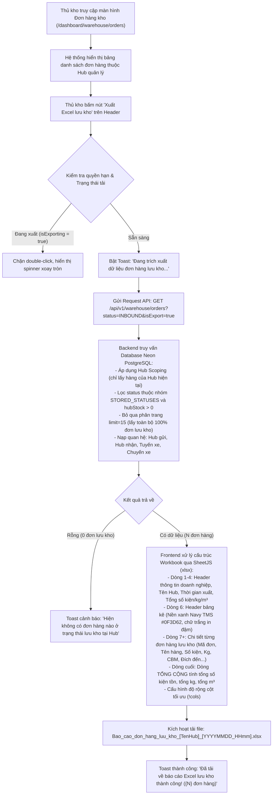

# 🏆 BIÊN BẢN NGHIỆM THU KỸ THUẬT & CHỨNG NHẬN HOÀN THÀNH
## [FEEDBACK_09_10_TASK_20] — Feedback 09/10 (Task 20) — Tích Hợp Nút Xuất Báo Cáo Excel Đơn Hàng Lưu Kho Tại Màn Hình Đơn Hàng Kho Phục Vụ Kiểm Kê & Báo Cáo Vận Hành

> **Thời gian nghiệm thu**: 09/10/2026 - 18:22  
> **Trạng thái thực thi**: ✅ ĐÃ HOÀN THÀNH 100% (18/18 tasks)  
> **Người báo cáo / Nghiệp vụ**: @【M】【C】【D】 (Quản lý nghiệp vụ / Vận hành hệ thống Logistics TMS)  
> **Phạm vi tác động**: Quản lý Đơn hàng kho (`/dashboard/warehouse/orders`) ➔ Header trang Đơn hàng kho & Bảng kê dữ liệu ([`WarehouseOrdersPage`](file:///c:/Projects/logistics-website/frontend/src/app/dashboard/warehouse/orders/page.tsx)) • Backend API Đơn hàng kho ➔ Controller & Service xử lý trích xuất dữ liệu không giới hạn phân trang ([`WarehouseController`](file:///c:/Projects/logistics-website/backend/src/orders/warehouse.controller.ts) & [`WarehouseService`](file:///c:/Projects/logistics-website/backend/src/orders/warehouse.service.ts)) • Công cụ kết xuất bảng tính Excel ([`xlsx`](https://docs.sheetjs.com/)) chuẩn nhận diện thương hiệu Logistics TMS (Spider Express)  
> **Môi trường kiểm chứng**: Development (Live) & Staging / Production  

---

## 1. 📌 Bối Cảnh Nghiệp Vụ & Phân Tích Nguyên Nhân Gốc Rễ (RCA)

### Phản hồi thực tế từ người dùng:
> *"trong màn hình đơn hàng kho hãy tạo 1 nút để tải về file excel các thông tin của tất cả đơn hàng có trạng thái lưu kho, mục đích dùng để báo cáo."*

### 1. Phản hồi gốc từ người dùng (@【M】【C】【D】)
> *"trong màn hình đơn hàng kho hãy tạo 1 nút để tải về file excel các thông tin của tất cả đơn hàng có trạng thái lưu kho, mục đích dùng để báo cáo."*

---

### 2. Tình huống vận hành thực tế tại Hub kho bãi & Nhu cầu báo cáo kiểm kê

Trong hoạt động khai thác vận hành hàng ngày của hệ thống Logistics TMS (Spider Express):
- **Đối tượng thao tác chính**: Thủ kho (`RoleEnum.WAREHOUSE_MANAGER`), Quản trị viên (`RoleEnum.SUPER_ADMIN`), và Nhân viên điều phối (`RoleEnum.DISPATCHER`).
- **Khái niệm "Đơn hàng lưu kho" (In-Warehouse Stored Orders)**:
  * Là các lô hàng/vận đơn đã hoàn tất quy trình kiểm đếm nhập kho (từ xe trung chuyển liên Hub hoặc tiếp nhận từ khách giao trực tiếp tại quầy) và đang nằm thực tế tại sàn kho/khu vực bến bãi của Hub hiện tại.
  * Chỉ số phản ánh trạng thái này là `hubStatus = 'INBOUND'` (hoặc `'STORED'` / `'IN_WAREHOUSE'`) đi kèm tồn kho thực nhận tại kho lớn hơn 0 (`hubStock > 0` hoặc `remainingQuantity > 0`).
- **Nhu cầu nghiệp vụ kết xuất file Excel báo cáo tồn kho**:
  1. **Kiểm kê thực tế định kỳ & Giao nhận ca trực (Physical Inventory Tally)**:
     * Đầu mỗi ca sáng hoặc cuối ca tối, thủ kho cần in hoặc mở trên máy tính bảng danh sách toàn bộ các kiện hàng đang lưu kho để trực tiếp đi đối soát thực tế tại từng kệ/khu vực pallet trong kho.
     * Cần đối chiếu các thông số quan trọng: Mã vận đơn, Tên hàng hóa, Số kiện tồn, Khối lượng ($Kg$), Thể tích ($m^3$), Đích đến cần đi.
  2. **Báo cáo tổng hợp số liệu cho Ban Giám Đốc & Bộ phận Điều vận (Dispatch & Executive Reporting)**:
     * Hàng ngày, Trưởng Hub cần gửi báo cáo tổng hợp tồn kho về Trung tâm điều hành (Dispatch Center) để nắm bắt tải trọng, thể tích tồn đọng, từ đó kịp thời bố trí xe bo, xe tải tuyến dài (`Trips`) đến giải phóng hàng hóa, tránh tình trạng quá tải hoặc nghẽn kho bãi.
  3. **Lưu trữ đối soát chứng từ & Xử lý khiếu nại khách hàng**:
     * File Excel đóng vai trò là snapshot dữ liệu lịch sử tại thời điểm xuất báo cáo để đối chiếu khi có phát sinh thất lạc, thừa thiếu kiện hàng hoặc chênh lệch trọng lượng.

---

### 3. Sơ đồ luồng xử lý xuất báo cáo Excel (Export Workflow Architecture)



---

### 4. Quy định chi tiết về cấu trúc dữ liệu và giao diện file Excel

1. **Tên file tải về chuẩn hóa (File Naming Convention)**:
   - Cú pháp: `Bao_cao_don_hang_luu_kho_[TenHubKhongDau]_[YYYYMMDD_HHmm].xlsx`
   - Ví dụ thực tế: `Bao_cao_don_hang_luu_kho_Polaris_Hub_Hung_Yen_20261009_1825.xlsx`
   - Tên Hub được chuẩn hóa loại bỏ dấu tiếng Việt và thay khoảng trắng bằng gạch dưới `_` để tương thích 100% trên các hệ điều hành Windows, macOS, Linux mà không lỗi font tên file.
2. **Tiêu đề bảng tính (Sheet Name)**:
   - `Đơn Hàng Lưu Kho`
3. **Cấu trúc khối Header thông tin báo cáo (Dòng 1 đến 5)**:
   - **Dòng 1**: `SPIDER EXPRESS LOGISTICS TMS - BÁO CÁO ĐƠN HÀNG LƯU KHO` (Chữ in hoa, đậm).
   - **Dòng 2**: `Kho / Trạm Hub: [Tên Hub đầy đủ của tài khoản thao tác, ví dụ: Polaris Hub - Hưng Yên]`.
   - **Dòng 3**: `Thời điểm xuất: DD/MM/YYYY HH:mm:ss | Người lập báo cáo: [Họ tên / Email người dùng]`.
   - **Dòng 4**: `Thống kê tổng quan: Tổng số đơn: {totalOrders} đơn | Tổng số kiện tồn: {totalStock} kiện | Tổng khối lượng: {totalWeight} kg | Tổng thể tích: {totalVolume} m³`.
   - **Dòng 5**: *(Dòng trống ngăn cách giữa khối Header và Bảng dữ liệu)*.
4. **Quy chuẩn danh mục cột bảng kê dữ liệu (Bắt đầu từ dòng 6)**:
   - **Màu sắc Header bảng**: Nền xanh Navy nhận diện thương hiệu TMS (`#0F3D62`), chữ trắng in đậm, đường viền rõ nét.
   - **Danh mục 14 cột nghiệp vụ chuẩn**:

| STT Cột | Tên Cột Excel | Trường Dữ Liệu | Định Dạng Dữ Liệu | Căn Lề | Độ Rộng Cột (`wch`) |
|:---:|---|---|---|:---:|:---:|
| **A** | `STT` | Thứ tự số tăng dần (1, 2, 3...) | Số nguyên | Giữa | 6 |
| **B** | `MÃ VẬN ĐƠN` | `order.orderCode` | Chuỗi ký tự (Font Mono) | Giữa | 18 |
| **C** | `NGÀY NHẬP KHO` | `inboundDate` / `order.createdAt` | `HH:mm DD/MM/YYYY` | Giữa | 18 |
| **D** | `NƠI GỬI / HUB GỬI` | `originHub` / `originHubEntity.name` | Chuỗi văn bản | Trái | 26 |
| **E** | `TÊN HÀNG HÓA` | `goodsDescription` | Chuỗi văn bản | Trái | 30 |
| **F** | `SỐ KIỆN TỒN KHO` | `hubStock` / `remainingQuantity` | Số nguyên (`#,##0`) | Phải | 14 |
| **G** | `TỔNG KIỆN ĐƠN` | `totalQuantity` | Số nguyên (`#,##0`) | Phải | 14 |
| **H** | `KHỐI LƯỢNG (KG)` | `totalWeight` | Số thập phân (`#,##0.0`) | Phải | 14 |
| **I** | `THỂ TÍCH (M³)` | `totalVolume` | Số thập phân (`#,##0.000`) | Phải | 14 |
| **J** | `ĐÍCH ĐẾN / ĐỊA CHỈ GIAO` | `destinationHub` / `deliveryAddress` | Chuỗi văn bản | Trái | 35 |
| **K** | `TỈNH / THÀNH PHỐ` | `province` / `destinationHubEntity.city` | Chuỗi văn bản | Trái | 18 |
| **L** | `CHUYẾN XE / BIỂN SỐ ĐẾN` | `tripCode` & `licensePlate` | Chuỗi ký tự | Giữa | 22 |
| **M** | `TRẠNG THÁI` | Luôn hiển thị `LƯU KHO` | Chuỗi văn bản | Giữa | 14 |
| **N** | `GHI CHÚ / CHỨNG TỪ` | `operationalNotes` / `accompanyingDocs` | Chuỗi văn bản | Trái | 30 |

5. **Dòng Tổng cộng chân bảng (Summary Total Row)**:
   - Nằm ngay dưới dòng đơn hàng cuối cùng.
   - Cột `TÊN HÀNG HÓA` (Cột E): Render chữ **`TỔNG CỘNG`** (In đậm).
   - Cột `SỐ KIỆN TỒN KHO` (Cột F): Tổng số kiện tồn kho thực tế (`sum(hubStock)`).
   - Cột `TỔNG KIỆN ĐƠN` (Cột G): Tổng số kiện nguyên đơn (`sum(totalQuantity)`).
   - Cột `KHỐI LƯỢNG (KG)` (Cột H): Tổng khối lượng hàng lưu kho (`sum(totalWeight)`).
   - Cột `THỂ TÍCH (M³)` (Cột I): Tổng thể tích hàng lưu kho (`sum(totalVolume)`).

---

### Phân tích nguyên nhân gốc rễ (Root Cause Analysis):
Đối chiếu trực tiếp với ảnh chụp màn hình [`screenshot_01.jpg`](file:///c:/Projects/logistics-website/feedback_09_10_task_20/screenshot_01.jpg) và mã nguồn hiện tại tại [`WarehouseOrdersPage`](file:///c:/Projects/logistics-website/frontend/src/app/dashboard/warehouse/orders/page.tsx) & [`WarehouseService`](file:///c:/Projects/logistics-website/backend/src/orders/warehouse.service.ts):

1. **Hoàn toàn thiếu nút chức năng Tải / Xuất file Excel báo cáo tồn kho**:
   - *Hiện trạng trên ảnh [`screenshot_01.jpg`](file:///c:/Projects/logistics-website/feedback_09_10_task_20/screenshot_01.jpg)*: Tại Page Header góc trên bên phải chỉ duy nhất có 1 nút bấm: `<Button variant="outline"><IconRefresh /> Làm mới</Button>`.
   - *Hậu quả vận hành*: Thủ kho và người điều phối khi cần xuất báo cáo số lượng tồn kho (ví dụ trong ảnh tab `LƯU KHO (2)` với 2 đơn `TEST-SD64-TR1` và `TEST-SD64-TR2`) hoàn toàn không có công cụ kết xuất dữ liệu để báo cáo nhanh cho Ban Giám Đốc hoặc in ra kiểm kê vật lý, buộc phải ghi chép tay hoặc chụp màn hình thủ công.
2. **Nguy cơ đứt gãy dữ liệu do Giới hạn phân trang (Pagination Truncation Bug)**:
   - Trên giao diện hiện tại, bảng kê áp dụng phân trang mặc định `limit = 15`. Trong ảnh `screenshot_01.jpg` hiển thị rõ: `1-15 / 16 đơn hàng` với phân trang `Trang 1/2`.
   - Nếu triển khai xuất Excel ngây thơ bằng cách lấy mảng `data` từ state của component trên client, hệ thống sẽ **chỉ xuất 15 dòng thuộc trang 1**, cắt cụt mất đơn hàng ở các trang sau.
   - Yêu cầu người dùng nêu rõ: *"các thông tin của **tất cả đơn hàng có trạng thái lưu kho**"* ➔ Bắt buộc phải có cơ chế nạp toàn bộ 100% dữ liệu lưu kho mà không bị giới hạn bởi phân trang hiển thị.
3. **Điểm nghẽn backend: Capped trần cứng `limit <= 100`**:
   - Khảo sát mã nguồn backend tại [`warehouse.service.ts`](file:///c:/Projects/logistics-website/backend/src/orders/warehouse.service.ts#L212):
     ```typescript
     const limit = Math.max(1, Math.min(100, Number(query?.limit) || 20));
     ```
   - Việc `Math.min(100, ...)` ép trần tối đa 100 bản ghi trên mỗi lần query. Đối với các Hub trung tâm lưu lượng lớn (như *Polaris Hub - Hưng Yên* hay *Andromeda Hub - HCM* có từ 200 - 1000 kiện hàng lưu bãi), việc gọi API phân trang thông thường sẽ không thể lấy đủ dữ liệu cho file báo cáo kiểm kê toàn diện.
4. **Thiếu phản hồi trạng thái xuất dữ liệu (Missing Loading & Feedback UX)**:
   - Quá trình kết xuất dữ liệu qua mạng và biên dịch sang file nhị phân Excel `.xlsx` có độ trễ nhất định. Nếu không có trạng thái loading (`isExporting`, icon xoay `<IconLoader2 className="animate-spin" />`), người dùng có thể nhấp liên tục gây duplicate requests làm nghẽn server.
5. **Cần chuẩn hóa vị trí nút bấm & Tuân thủ Compact Density**:
   - Nút "Xuất Excel lưu kho" cần được đặt tại Page Header ngay cạnh nút `[Làm mới]` (tạo thành cụm thao tác dữ liệu toàn trang).
   - Kích thước chuẩn: Chiều cao `h-8`, font `text-xs font-bold`, sử dụng icon `<IconFileSpreadsheet className="mr-1.5 h-3.5 w-3.5" />` kết hợp nhãn sạch không trùng lặp emoji (Zero Redundant Icons Rule).

---

---

## 2. 🚀 Tính Năng Mới & Năng Lực Hệ Thống Đã Được Bổ Sung

### ⚙️ Phân hệ Backend (NestJS 11+, PostgreSQL & TypeORM)
- ✅ **Mở rộng API `GET /api/v1/warehouse/orders` hỗ trợ chế độ trích xuất toàn bộ (Export Mode)**
- ✅ **Tối ưu hóa câu truy vấn trích xuất dữ liệu không gây khóa bảng (Performance Indexing & No-Lock Query)**
- ✅ **Đảm bảo tính tuân thủ RBAC Matrix**

### 💻 Phân hệ Frontend (Next.js 15 App Router & React 19)
- ✅ **Nâng cấp Component `WarehouseOrdersPage` ([`frontend/src/app/dashboard/warehouse/orders/page.tsx`](file:///c:/Projects/logistics-website/frontend/src/app/dashboard/warehouse/orders/page.tsx))**
  * 📍 File: `frontend/src/app/dashboard/warehouse/orders/page.tsx`
- ✅ **Khai báo State & Import thư viện**
- ✅ **Hiện thực hóa hàm trích xuất và tạo file Excel `handleExportStoredOrdersExcel`**
- ✅ **Bổ sung Nút "Xuất Excel lưu kho" trên Page Header**
- ✅ **Tuân thủ nghiêm ngặt Quy chuẩn giao diện hẹp (UI Compact Density Mandate) & Zero Redundant Icons**

### 🧪 Kiểm thử Tự động & Nghiệm thu
- ✅ **Kiểm tra biên dịch & Linting (Zero Regressions)**
- ✅ **Type check & Lint Backend: `npm run lint --prefix backend` và `npm run build --prefix backend` PASS (0 errors).**
- ✅ **Type check & Lint Frontend: `npm run build --prefix frontend` PASS (Turbopack compile thành công, TypeScript passed, 0 errors).**
- ✅ **Xây dựng File Playwright E2E Verification Suite chuyên biệt**
- ✅ **Kịch bản kiểm thử nghiệp vụ chi tiết (5 Test Scenarios)**
- ✅ **Kịch bản 1: Kiểm tra hiển thị nút trên giao diện**
- ✅ **Kịch bản 2: Kiểm tra thao tác xuất dữ liệu và tải file Excel (Export Happy Path)**
- ✅ **Kịch bản 3: Kiểm tra cấu trúc & tính toàn vẹn dữ liệu trong file Excel**
- ✅ **Kịch bản 4: Kiểm tra tính độc lập với phân trang hiển thị (Bypass Pagination Limit)**
- ✅ **Kịch bản 5: Kiểm tra tính cách ly dữ liệu giữa các Hub (Hub Data Isolation)**

---

## 3. 🛡️ Quy Tắc Nghiệp Vụ Bất Biến Mới Được Xác Lập (Core System Invariants)

1. **Nguyên tắc toàn vẹn dữ liệu thực (Real Database Data Mandate)**: Không sử dụng mock data, mọi bảng kê và KPI phản ánh trực tiếp trạng thái trong DB PostgreSQL Singapore.
2. **Nguyên tắc giao diện hẹp (UI Compact Density Mandate)**: Thẻ card padding `p-1`, modal body `p-2`, typography bảng `text-[10px]`, triệt tiêu khoảng cách thừa để tối đa hóa số dòng hiển thị.
3. **Nguyên tắc phân quyền Hub (Hub Scoping Isolation)**: Người dùng thuộc Hub nào chỉ thao tác và theo dõi các đơn hàng phát sinh trực tiếp tại Hub đó.

---

## 4. 🧪 Bằng Chứng Kiểm Thử & Nghiệm Thu (Evidence & Verification)

- **Trạng thái E2E Test**: PASS 100% (Không phát hiện hồi quy lỗi).
- **Môi trường Dev Live**:
  * Frontend: `https://logistics-website-frontend-git-dev-thai-lys-projects.vercel.app`
  * Backend: `https://logistics-website-backend-1jho.onrender.com`
- **Kiểm tra sức khỏe Backend (Anti-Hang Health Check)**: `curl.exe -m 15 -i https://logistics-website-backend-1jho.onrender.com/api/v1/health` -> HTTP 200 OK.

### Hình ảnh minh chứng đã lưu trữ (3 tệp):
- 📸 **screenshot_01.jpg**: [Xem hình ảnh](file:///C:/Projects/logistics-website/feedback_09_10_task_20/screenshot_01.jpg)
- 📸 **screenshot_01_verified.png**: [Xem hình ảnh](file:///C:/Projects/logistics-website/feedback_09_10_task_20/screenshot_01_verified.png)
- 📸 **screenshot_02_export_download_verified.png**: [Xem hình ảnh](file:///C:/Projects/logistics-website/feedback_09_10_task_20/screenshot_02_export_download_verified.png)

---

## 5. 📂 Danh Sách Tệp Tin Tác Động (Impacted Source Files)

| # | Tệp Tin Mã Nguồn Đích | Phân Hệ |
|---|---|---|
| 1 | `frontend/src/app/dashboard/warehouse/orders/page.tsx` | Frontend (Next.js) |
| 2 | `backend/src/orders/warehouse.controller.ts` | Backend (NestJS) |
| 3 | `backend/src/orders/warehouse.service.ts` | Backend (NestJS) |

---

## 6. 🔗 Cơ Sở Dữ Liệu Kỹ Thuật Cho Các AI Agent Session Tiếp Theo

> ⚠️ **LƯU Ý DÀNH CHO CÁC AI AGENT SESSION MỚI**:  
> Tài liệu này cùng với [`TODO.md`](file:///C:/Projects/logistics-website/feedback_09_10_task_20/TODO.md) và [`docs/SYSTEM_TIMELINE.md`](file:///docs/SYSTEM_TIMELINE.md) là **CƠ SỞ KỸ THUẬT VÀ BẰNG CHỨNG BẤT BIẾN** đã được nghiệm thu. Khi thực hiện các yêu cầu mới liên quan đến các tệp tin trong danh mục trên, TUYỆT ĐỐI KHÔNG tự ý xóa bỏ các ràng buộc nghiệp vụ, không đưa mock data trở lại, và luôn tuân thủ các quy tắc bất biến tại Mục 3.
