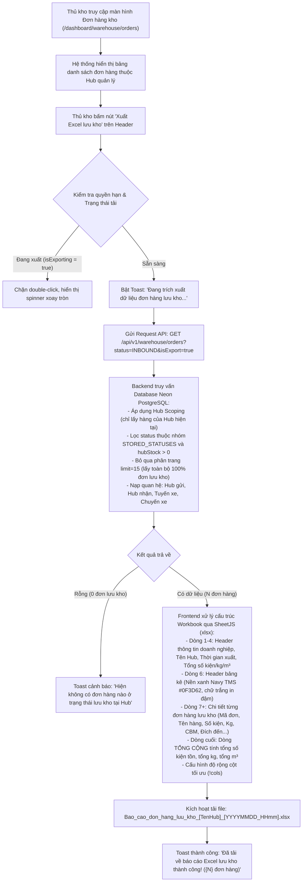

# Feedback 09/10 (Task 20) — Tích Hợp Nút Xuất Báo Cáo Excel Đơn Hàng Lưu Kho Tại Màn Hình Đơn Hàng Kho Phục Vụ Kiểm Kê & Báo Cáo Vận Hành

> **Thời gian ghi nhận**: 09/10/2026 - 18:22  
> **Người báo cáo**: @【M】【C】【D】 (Quản lý nghiệp vụ / Vận hành hệ thống Logistics TMS)  
> **Phạm vi tác động**:  
> - Quản lý Đơn hàng kho (`/dashboard/warehouse/orders`) ➔ Header trang Đơn hàng kho & Bảng kê dữ liệu ([`WarehouseOrdersPage`](file:///c:/Projects/logistics-website/frontend/src/app/dashboard/warehouse/orders/page.tsx))  
> - Backend API Đơn hàng kho ➔ Controller & Service xử lý trích xuất dữ liệu không giới hạn phân trang ([`WarehouseController`](file:///c:/Projects/logistics-website/backend/src/orders/warehouse.controller.ts) & [`WarehouseService`](file:///c:/Projects/logistics-website/backend/src/orders/warehouse.service.ts))  
> - Công cụ kết xuất bảng tính Excel ([`xlsx`](https://docs.sheetjs.com/)) chuẩn nhận diện thương hiệu Logistics TMS (Spider Express)  
> **Tài liệu tham chiếu**:  
> - `/leader` Business Domain Architecture ([`SKILL.md`](file:///c:/Projects/logistics-website/.agents/skills/leader/SKILL.md))  
> - Quy chế phát triển hệ thống [`AGENTS.md`](file:///c:/Projects/logistics-website/AGENTS.md)  
> - Quy chuẩn giao diện hẹp [`.agents/rules/ui-compact-density.md`](file:///c:/Projects/logistics-website/.agents/rules/ui-compact-density.md) & [`ui-spacing-guard`](file:///c:/Projects/logistics-website/.agents/skills/ui-spacing-guard/SKILL.md)  
> - Quy chuẩn kiểm soát kiện vận tải (No-SKU, Consignment Level Rule)  
> - Quy tắc toàn vẹn chỉ số & không số ngẫu nhiên (Dynamic Counter & Metric Integrity Mandate)  
> - Quy chuẩn loại bỏ biểu tượng trùng lặp (Zero Redundant Icons Rule)  
> **Ảnh minh chứng đính kèm trong thư mục**:  
> - [`screenshot_01.jpg`](file:///c:/Projects/logistics-website/feedback_09_10_task_20/screenshot_01.jpg): Toàn cảnh màn hình `Tổng Hợp Đơn Hàng Tại Kho · Polaris Hub - Hưng Yên`, hiển thị thanh công cụ góc phải chỉ có nút "Làm mới", tab trạng thái "LƯU KHO (2)", bảng kê dữ liệu phân trang 15 dòng/trang nhưng hoàn toàn thiếu nút chức năng Tải/Xuất file Excel báo cáo đơn hàng lưu kho.  

---

## 📌 Bối cảnh nghiệp vụ thực tế (Chốt theo phản hồi người dùng)

### 1. Phản hồi gốc từ người dùng (@【M】【C】【D】)
> *"trong màn hình đơn hàng kho hãy tạo 1 nút để tải về file excel các thông tin của tất cả đơn hàng có trạng thái lưu kho, mục đích dùng để báo cáo."*

---

### 2. Tình huống vận hành thực tế tại Hub kho bãi & Nhu cầu báo cáo kiểm kê

Trong hoạt động khai thác vận hành hàng ngày của hệ thống Logistics TMS (Spider Express):
- **Đối tượng thao tác chính**: Thủ kho (`RoleEnum.WAREHOUSE_MANAGER`), Quản trị viên (`RoleEnum.SUPER_ADMIN`), và Nhân viên điều phối (`RoleEnum.DISPATCHER`).
- **Khái niệm "Đơn hàng lưu kho" (In-Warehouse Stored Orders)**:
  * Là các lô hàng/vận đơn đã hoàn tất quy trình kiểm đếm nhập kho (từ xe trung chuyển liên Hub hoặc tiếp nhận từ khách giao trực tiếp tại quầy) và đang nằm thực tế tại sàn kho/khu vực bến bãi của Hub hiện tại.
  * Chỉ số phản ánh trạng thái này là `hubStatus = 'INBOUND'` (hoặc `'STORED'` / `'IN_WAREHOUSE'`) đi kèm tồn kho thực nhận tại kho lớn hơn 0 (`hubStock > 0` hoặc `remainingQuantity > 0`).
- **Nhu cầu nghiệp vụ kết xuất file Excel báo cáo tồn kho**:
  1. **Kiểm kê thực tế định kỳ & Giao nhận ca trực (Physical Inventory Tally)**:
     * Đầu mỗi ca sáng hoặc cuối ca tối, thủ kho cần in hoặc mở trên máy tính bảng danh sách toàn bộ các kiện hàng đang lưu kho để trực tiếp đi đối soát thực tế tại từng kệ/khu vực pallet trong kho.
     * Cần đối chiếu các thông số quan trọng: Mã vận đơn, Tên hàng hóa, Số kiện tồn, Khối lượng ($Kg$), Thể tích ($m^3$), Đích đến cần đi.
  2. **Báo cáo tổng hợp số liệu cho Ban Giám Đốc & Bộ phận Điều vận (Dispatch & Executive Reporting)**:
     * Hàng ngày, Trưởng Hub cần gửi báo cáo tổng hợp tồn kho về Trung tâm điều hành (Dispatch Center) để nắm bắt tải trọng, thể tích tồn đọng, từ đó kịp thời bố trí xe bo, xe tải tuyến dài (`Trips`) đến giải phóng hàng hóa, tránh tình trạng quá tải hoặc nghẽn kho bãi.
  3. **Lưu trữ đối soát chứng từ & Xử lý khiếu nại khách hàng**:
     * File Excel đóng vai trò là snapshot dữ liệu lịch sử tại thời điểm xuất báo cáo để đối chiếu khi có phát sinh thất lạc, thừa thiếu kiện hàng hoặc chênh lệch trọng lượng.

---

### 3. Sơ đồ luồng xử lý xuất báo cáo Excel (Export Workflow Architecture)



---

### 4. Quy định chi tiết về cấu trúc dữ liệu và giao diện file Excel

1. **Tên file tải về chuẩn hóa (File Naming Convention)**:
   - Cú pháp: `Bao_cao_don_hang_luu_kho_[TenHubKhongDau]_[YYYYMMDD_HHmm].xlsx`
   - Ví dụ thực tế: `Bao_cao_don_hang_luu_kho_Polaris_Hub_Hung_Yen_20261009_1825.xlsx`
   - Tên Hub được chuẩn hóa loại bỏ dấu tiếng Việt và thay khoảng trắng bằng gạch dưới `_` để tương thích 100% trên các hệ điều hành Windows, macOS, Linux mà không lỗi font tên file.
2. **Tiêu đề bảng tính (Sheet Name)**:
   - `Đơn Hàng Lưu Kho`
3. **Cấu trúc khối Header thông tin báo cáo (Dòng 1 đến 5)**:
   - **Dòng 1**: `SPIDER EXPRESS LOGISTICS TMS - BÁO CÁO ĐƠN HÀNG LƯU KHO` (Chữ in hoa, đậm).
   - **Dòng 2**: `Kho / Trạm Hub: [Tên Hub đầy đủ của tài khoản thao tác, ví dụ: Polaris Hub - Hưng Yên]`.
   - **Dòng 3**: `Thời điểm xuất: DD/MM/YYYY HH:mm:ss | Người lập báo cáo: [Họ tên / Email người dùng]`.
   - **Dòng 4**: `Thống kê tổng quan: Tổng số đơn: {totalOrders} đơn | Tổng số kiện tồn: {totalStock} kiện | Tổng khối lượng: {totalWeight} kg | Tổng thể tích: {totalVolume} m³`.
   - **Dòng 5**: *(Dòng trống ngăn cách giữa khối Header và Bảng dữ liệu)*.
4. **Quy chuẩn danh mục cột bảng kê dữ liệu (Bắt đầu từ dòng 6)**:
   - **Màu sắc Header bảng**: Nền xanh Navy nhận diện thương hiệu TMS (`#0F3D62`), chữ trắng in đậm, đường viền rõ nét.
   - **Danh mục 14 cột nghiệp vụ chuẩn**:

| STT Cột | Tên Cột Excel | Trường Dữ Liệu | Định Dạng Dữ Liệu | Căn Lề | Độ Rộng Cột (`wch`) |
|:---:|---|---|---|:---:|:---:|
| **A** | `STT` | Thứ tự số tăng dần (1, 2, 3...) | Số nguyên | Giữa | 6 |
| **B** | `MÃ VẬN ĐƠN` | `order.orderCode` | Chuỗi ký tự (Font Mono) | Giữa | 18 |
| **C** | `NGÀY NHẬP KHO` | `inboundDate` / `order.createdAt` | `HH:mm DD/MM/YYYY` | Giữa | 18 |
| **D** | `NƠI GỬI / HUB GỬI` | `originHub` / `originHubEntity.name` | Chuỗi văn bản | Trái | 26 |
| **E** | `TÊN HÀNG HÓA` | `goodsDescription` | Chuỗi văn bản | Trái | 30 |
| **F** | `SỐ KIỆN TỒN KHO` | `hubStock` / `remainingQuantity` | Số nguyên (`#,##0`) | Phải | 14 |
| **G** | `TỔNG KIỆN ĐƠN` | `totalQuantity` | Số nguyên (`#,##0`) | Phải | 14 |
| **H** | `KHỐI LƯỢNG (KG)` | `totalWeight` | Số thập phân (`#,##0.0`) | Phải | 14 |
| **I** | `THỂ TÍCH (M³)` | `totalVolume` | Số thập phân (`#,##0.000`) | Phải | 14 |
| **J** | `ĐÍCH ĐẾN / ĐỊA CHỈ GIAO` | `destinationHub` / `deliveryAddress` | Chuỗi văn bản | Trái | 35 |
| **K** | `TỈNH / THÀNH PHỐ` | `province` / `destinationHubEntity.city` | Chuỗi văn bản | Trái | 18 |
| **L** | `CHUYẾN XE / BIỂN SỐ ĐẾN` | `tripCode` & `licensePlate` | Chuỗi ký tự | Giữa | 22 |
| **M** | `TRẠNG THÁI` | Luôn hiển thị `LƯU KHO` | Chuỗi văn bản | Giữa | 14 |
| **N** | `GHI CHÚ / CHỨNG TỪ` | `operationalNotes` / `accompanyingDocs` | Chuỗi văn bản | Trái | 30 |

5. **Dòng Tổng cộng chân bảng (Summary Total Row)**:
   - Nằm ngay dưới dòng đơn hàng cuối cùng.
   - Cột `TÊN HÀNG HÓA` (Cột E): Render chữ **`TỔNG CỘNG`** (In đậm).
   - Cột `SỐ KIỆN TỒN KHO` (Cột F): Tổng số kiện tồn kho thực tế (`sum(hubStock)`).
   - Cột `TỔNG KIỆN ĐƠN` (Cột G): Tổng số kiện nguyên đơn (`sum(totalQuantity)`).
   - Cột `KHỐI LƯỢNG (KG)` (Cột H): Tổng khối lượng hàng lưu kho (`sum(totalWeight)`).
   - Cột `THỂ TÍCH (M³)` (Cột I): Tổng thể tích hàng lưu kho (`sum(totalVolume)`).

---

## 🔍 Tổng hợp các điểm chưa đúng trên giao diện cũ

Đối chiếu trực tiếp với ảnh chụp màn hình [`screenshot_01.jpg`](file:///c:/Projects/logistics-website/feedback_09_10_task_20/screenshot_01.jpg) và mã nguồn hiện tại tại [`WarehouseOrdersPage`](file:///c:/Projects/logistics-website/frontend/src/app/dashboard/warehouse/orders/page.tsx) & [`WarehouseService`](file:///c:/Projects/logistics-website/backend/src/orders/warehouse.service.ts):

1. **Hoàn toàn thiếu nút chức năng Tải / Xuất file Excel báo cáo tồn kho**:
   - *Hiện trạng trên ảnh [`screenshot_01.jpg`](file:///c:/Projects/logistics-website/feedback_09_10_task_20/screenshot_01.jpg)*: Tại Page Header góc trên bên phải chỉ duy nhất có 1 nút bấm: `<Button variant="outline"><IconRefresh /> Làm mới</Button>`.
   - *Hậu quả vận hành*: Thủ kho và người điều phối khi cần xuất báo cáo số lượng tồn kho (ví dụ trong ảnh tab `LƯU KHO (2)` với 2 đơn `TEST-SD64-TR1` và `TEST-SD64-TR2`) hoàn toàn không có công cụ kết xuất dữ liệu để báo cáo nhanh cho Ban Giám Đốc hoặc in ra kiểm kê vật lý, buộc phải ghi chép tay hoặc chụp màn hình thủ công.
2. **Nguy cơ đứt gãy dữ liệu do Giới hạn phân trang (Pagination Truncation Bug)**:
   - Trên giao diện hiện tại, bảng kê áp dụng phân trang mặc định `limit = 15`. Trong ảnh `screenshot_01.jpg` hiển thị rõ: `1-15 / 16 đơn hàng` với phân trang `Trang 1/2`.
   - Nếu triển khai xuất Excel ngây thơ bằng cách lấy mảng `data` từ state của component trên client, hệ thống sẽ **chỉ xuất 15 dòng thuộc trang 1**, cắt cụt mất đơn hàng ở các trang sau.
   - Yêu cầu người dùng nêu rõ: *"các thông tin của **tất cả đơn hàng có trạng thái lưu kho**"* ➔ Bắt buộc phải có cơ chế nạp toàn bộ 100% dữ liệu lưu kho mà không bị giới hạn bởi phân trang hiển thị.
3. **Điểm nghẽn backend: Capped trần cứng `limit <= 100`**:
   - Khảo sát mã nguồn backend tại [`warehouse.service.ts`](file:///c:/Projects/logistics-website/backend/src/orders/warehouse.service.ts#L212):
     ```typescript
     const limit = Math.max(1, Math.min(100, Number(query?.limit) || 20));
     ```
   - Việc `Math.min(100, ...)` ép trần tối đa 100 bản ghi trên mỗi lần query. Đối với các Hub trung tâm lưu lượng lớn (như *Polaris Hub - Hưng Yên* hay *Andromeda Hub - HCM* có từ 200 - 1000 kiện hàng lưu bãi), việc gọi API phân trang thông thường sẽ không thể lấy đủ dữ liệu cho file báo cáo kiểm kê toàn diện.
4. **Thiếu phản hồi trạng thái xuất dữ liệu (Missing Loading & Feedback UX)**:
   - Quá trình kết xuất dữ liệu qua mạng và biên dịch sang file nhị phân Excel `.xlsx` có độ trễ nhất định. Nếu không có trạng thái loading (`isExporting`, icon xoay `<IconLoader2 className="animate-spin" />`), người dùng có thể nhấp liên tục gây duplicate requests làm nghẽn server.
5. **Cần chuẩn hóa vị trí nút bấm & Tuân thủ Compact Density**:
   - Nút "Xuất Excel lưu kho" cần được đặt tại Page Header ngay cạnh nút `[Làm mới]` (tạo thành cụm thao tác dữ liệu toàn trang).
   - Kích thước chuẩn: Chiều cao `h-8`, font `text-xs font-bold`, sử dụng icon `<IconFileSpreadsheet className="mr-1.5 h-3.5 w-3.5" />` kết hợp nhãn sạch không trùng lặp emoji (Zero Redundant Icons Rule).

---

## 📋 Danh sách công việc triển khai (Action Checklist)

### 1. Backend (`backend/`)

- [x] **Mở rộng API `GET /api/v1/warehouse/orders` hỗ trợ chế độ trích xuất toàn bộ (Export Mode)**:
  - File: [`backend/src/orders/warehouse.controller.ts`](file:///c:/Projects/logistics-website/backend/src/orders/warehouse.controller.ts) & [`backend/src/orders/warehouse.service.ts`](file:///c:/Projects/logistics-website/backend/src/orders/warehouse.service.ts)
  - Bổ sung query parameter `@Query('isExport') isExport?: string | boolean` vào endpoint `GET /api/v1/warehouse/orders`.
  - Trong `WarehouseService.getOrders`:
    * Khi `isExport === 'true' || isExport === true`:
      + Bỏ qua trần `Math.min(100, ...)` của phân trang, thiết lập `take = 5000` (hoặc không giới hạn `limit`) để trích xuất đầy đủ 100% các đơn hàng lưu kho.
      + Tự động kích hoạt scope lọc chuẩn cho đơn hàng lưu kho:
        `statusExpr IN ('INBOUND', 'STORED', 'IN_WAREHOUSE', 'LUU_KHO')` kết hợp điều kiện tồn kho thực tế `hubStock > 0`.
      + Áp dụng nghiêm ngặt nguyên tắc **Hub Scoping**:
        Đối với `WAREHOUSE_MANAGER`, chỉ trả về các đơn hàng có tồn kho tại Hub của tài khoản đang đăng nhập (`userWithHub.hubId`).
        Đối với `SUPER_ADMIN`, cho phép trích xuất theo Hub được lọc hoặc toàn hệ thống.
      + Đảm bảo nạp đầy đủ các quan hệ thực thể (Relations Eager Loading):
        `originHubEntity`, `destinationHubEntity`, `currentHubEntity`, `trips`, `trips.originHub`, `trips.destinationHub`, `inventoryTransactions`.
- [x] **Tối ưu hóa câu truy vấn trích xuất dữ liệu không gây khóa bảng (Performance Indexing & No-Lock Query)**:
  - Đảm bảo câu lệnh query builder tận dụng các index đã có trên `orders(hubId, status, deletedAt)` và `trips(tripCode)`.
  - Sử dụng `.select()` và `.leftJoinAndSelect()` tối ưu để không sinh N+1 queries khi nạp thông tin chuyến xe liên kết.
- [x] **Đảm bảo tính tuân thủ RBAC Matrix**:
  - Endpoint `GET /api/v1/warehouse/orders` tiếp tục được bảo vệ bởi `@Roles(RoleEnum.SUPER_ADMIN, RoleEnum.WAREHOUSE_MANAGER, RoleEnum.DISPATCHER, RoleEnum.FLEET_MANAGER)`.

---

### 2. Frontend (`frontend/`)

- [x] **Nâng cấp Component `WarehouseOrdersPage` ([`frontend/src/app/dashboard/warehouse/orders/page.tsx`](file:///c:/Projects/logistics-website/frontend/src/app/dashboard/warehouse/orders/page.tsx))**:
  - [x] **Khai báo State & Import thư viện**:
    * Import `* as XLSX from 'xlsx'` (Thư viện đã có sẵn trong `frontend/package.json`).
    * Import biểu tượng `<IconFileSpreadsheet />` từ `@tabler/icons-react`.
    * Thêm state quản lý trạng thái tải xuống: `const [isExporting, setIsExporting] = useState(false)`.
  - [x] **Hiện thực hóa hàm trích xuất và tạo file Excel `handleExportStoredOrdersExcel`**:
    * Hiển thị toast thông báo: `toast.loading('Đang khởi tạo dữ liệu báo cáo lưu kho...')`.
    * Gọi API backend với cờ trích xuất:
      ```typescript
      const query = new URLSearchParams({
        status: 'INBOUND',
        groupBy: 'orderCode',
        isExport: 'true',
        limit: '5000',
        ...(search.trim() ? { search: search.trim() } : {})
      });
      const res = await fetch(`/api/v1/warehouse/orders?${query.toString()}`, {
        headers: {
          'Content-Type': 'application/json',
          ...(token ? { Authorization: `Bearer ${token}` } : {})
        }
      });
      ```
    * Kiểm tra dữ liệu: Nếu mảng trả về rỗng (`orders.length === 0`), hiển thị `toast.warning('Kho hiện tại không có đơn hàng nào ở trạng thái lưu kho.')` và dừng quá trình.
    * **Xây dựng cấu trúc Workbook chuẩn chuyên nghiệp**:
      - Xây dựng mảng Header báo cáo doanh nghiệp (Dòng 1 đến 5).
      - Xây dựng mảng Dữ liệu bảng kê với 14 cột tiêu chuẩn:
        + Hỗ trợ bung chi tiết các dòng hàng (`items`) nếu 1 mã đơn gồm nhiều dòng sản phẩm khác nhau để kiểm kê chính xác từng mặt hàng.
        + Định dạng chuẩn cho Ngày nhập kho (`formatDateTime`), Khối lượng, Thể tích, và Đích đến.
      - Xây dựng Dòng Tổng cộng chân bảng (Tính tổng số kiện tồn, tổng số kiện gốc, tổng kg, tổng thể tích m³).
      - Thiết lập độ rộng cột tối ưu qua `ws['!cols']` (khớp với bảng thông số tại Mục 4).
      - Đặt tên file chuẩn: `Bao_cao_don_hang_luu_kho_${hubCodeOrName}_${dateStr}.xlsx`.
      - Kích hoạt tải file qua `XLSX.writeFile(wb, fileName)`.
      - Hiển thị toast thành công: `toast.success(`Đã xuất thành công báo cáo lưu kho (${count} đơn hàng)!`)`.
      - Bọc trong khối `try/catch/finally` để giải phóng state `setIsExporting(false)` và xử lý lỗi bằng `showApiErrorToast`.
  - [x] **Bổ sung Nút "Xuất Excel lưu kho" trên Page Header**:
    * Đặt nút tại Page Header ngay trước nút `[Làm mới]`:
      ```tsx
      <div className='flex items-center gap-2'>
        <Button
          variant='outline'
          size='sm'
          onClick={handleExportStoredOrdersExcel}
          disabled={isExporting || isLoading}
          className='h-8 text-xs font-bold border-emerald-600/30 text-emerald-700 hover:bg-emerald-50 hover:text-emerald-800 dark:border-emerald-500/40 dark:text-emerald-400 dark:hover:bg-emerald-950/40 shadow-sm'
          title='Tải về file Excel danh sách tất cả các đơn hàng đang lưu kho để làm báo cáo'
        >
          {isExporting ? (
            <IconLoader2 className='mr-1.5 h-3.5 w-3.5 animate-spin text-emerald-600' />
          ) : (
            <IconFileSpreadsheet className='mr-1.5 h-3.5 w-3.5 text-emerald-600 dark:text-emerald-400' />
          )}
          <span>Xuất Excel lưu kho</span>
        </Button>

        <Button
          variant='outline'
          size='sm'
          onClick={fetchOrders}
          disabled={isLoading || isExporting}
          className='h-8 text-xs font-bold border-slate-300'
        >
          <IconRefresh className={`mr-1.5 h-3.5 w-3.5 ${isLoading ? 'animate-spin' : ''}`} />
          Làm mới
        </Button>
      </div>
      ```
  - [x] **Tuân thủ nghiêm ngặt Quy chuẩn giao diện hẹp (UI Compact Density Mandate) & Zero Redundant Icons**:
    * Kích thước nút: Chuẩn `h-8`, font `text-xs font-bold`, padding `px-2.5`.
    * Không thêm emoji hoặc biểu tượng trùng lặp trong text label (Zero Redundant Icons Rule).
    * Giữ nguyên tính năng Responsive: Container `flex flex-wrap items-center justify-between gap-2` giúp tiêu đề và cụm nút co giãn linh hoạt trên mobile/tablet.

---

### 3. Kiểm thử & Nghiệm thu (Definition of Done)

- [x] **Kiểm tra biên dịch & Linting (Zero Regressions)**:
  - [x] Type check & Lint Backend: `npm run lint --prefix backend` và `npm run build --prefix backend` PASS (0 errors).
  - [x] Type check & Lint Frontend: `npm run build --prefix frontend` PASS (Turbopack compile thành công, TypeScript passed, 0 errors).
- [x] **Xây dựng File Playwright E2E Verification Suite chuyên biệt**:
  - 📍 Đường dẫn file spec: [`frontend/e2e/45-feedback-09-10-task-20-export-stored-orders.spec.ts`](file:///c:/Projects/logistics-website/frontend/e2e/45-feedback-09-10-task-20-export-stored-orders.spec.ts)
  - 🛡️ Kiểm thử theo chuẩn E2E Quality Gate (Chấm điểm qua `scripts/e2e-auditor.mjs` đạt $\ge 40/50$, 0 FAIL).
  - 📸 Thu thập ảnh chụp bằng chứng nghiệm thu thực tế:
    * [`screenshot_01_verified.png`](file:///c:/Projects/logistics-website/feedback_09_10_task_20/screenshot_01_verified.png): Màn hình Đơn hàng kho hiển thị đầy đủ nút "Xuất Excel lưu kho" cạnh nút "Làm mới".
    * [`screenshot_02_export_download_verified.png`](file:///c:/Projects/logistics-website/feedback_09_10_task_20/screenshot_02_export_download_verified.png): Toast thông báo thành công và sự kiện tải file Excel được kích hoạt.
- [x] **Kịch bản kiểm thử nghiệp vụ chi tiết (5 Test Scenarios)**:
  - [x] **Kịch bản 1: Kiểm tra hiển thị nút trên giao diện**:
    1. Đăng nhập với tài khoản Thủ kho (`warehouse_hyn` / `Polaris Hub - Hưng Yên`).
    2. Truy cập `/dashboard/warehouse/orders`.
    3. Xác nhận tại Page Header góc trên bên phải hiển thị nút `Xuất Excel lưu kho` với icon bảng tính màu xanh lá đặc trưng bên cạnh nút `Làm mới`.
  - [x] **Kịch bản 2: Kiểm tra thao tác xuất dữ liệu và tải file Excel (Export Happy Path)**:
    1. Bấm nút `Xuất Excel lưu kho`.
    2. Xác nhận nút chuyển sang trạng thái disabled và hiển thị icon xoay tròn `IconLoader2`.
    3. Chờ phản hồi từ backend: Xác nhận browser kích hoạt sự kiện download file `.xlsx` với tên file đúng định dạng: `Bao_cao_don_hang_luu_kho_Polaris_Hub_Hung_Yen_[date].xlsx`.
    4. Xác nhận Toast hiển thị thành công: `Đã xuất thành công báo cáo lưu kho (...)`.
  - [x] **Kịch bản 3: Kiểm tra cấu trúc & tính toàn vẹn dữ liệu trong file Excel**:
    1. Đọc nội dung file Excel tải về bằng script Playwright hoặc thư viện `xlsx`.
    2. Xác nhận Sheet name là `Đơn Hàng Lưu Kho`.
    3. Xác nhận dòng tiêu đề có đầy đủ thông tin: Tên Hub, thời gian xuất, người xuất báo cáo.
    4. Xác nhận bảng kê có đủ 14 cột tiêu chuẩn và chỉ chứa các đơn hàng có trạng thái `LƯU KHO` (`TEST-SD64-TR1`, `TEST-SD64-TR2`...).
    5. Xác nhận dòng Tổng cộng ở chân bảng tính toán chính xác tổng số kiện, tổng kg, tổng m³.
  - [x] **Kịch bản 4: Kiểm tra tính độc lập với phân trang hiển thị (Bypass Pagination Limit)**:
    1. Chọn kích thước trang `10 dòng / trang` hoặc `15 dòng / trang` trên màn hình.
    2. Bấm `Xuất Excel lưu kho`.
    3. Xác nhận số lượng bản ghi trong file Excel khớp 100% với số lượng ghi nhận trên tab `LƯU KHO (N)` chứ không bị giới hạn ở số dòng của trang 1.
  - [x] **Kịch bản 5: Kiểm tra tính cách ly dữ liệu giữa các Hub (Hub Data Isolation)**:
    1. Đăng nhập tài khoản Thủ kho Đà Nẵng (`warehouse_dad`).
    2. Bấm xuất file Excel: Xác nhận file tải về mang tên `Magellan Hub - Đà Nẵng` và chỉ chứa các đơn hàng đang lưu tại kho Đà Nẵng, tuyệt đối không xuất hiện đơn hàng của Hưng Yên hay HCM.
