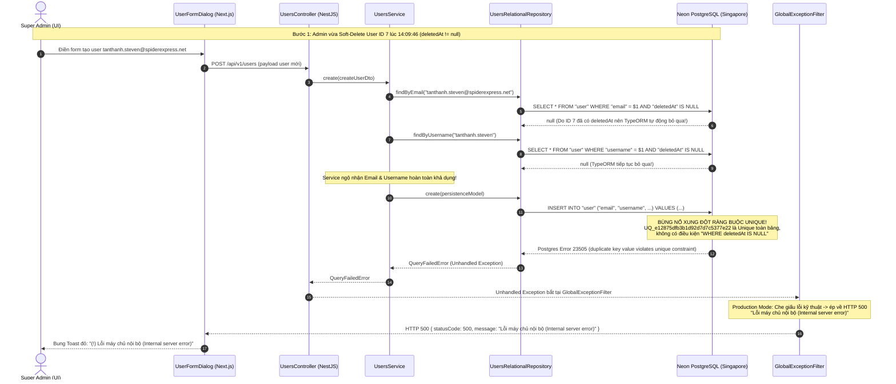

# 🏆 BIÊN BẢN NGHIỆM THU KỸ THUẬT & CHỨNG NHẬN HOÀN THÀNH
## [FEEDBACK_09_10_TASK_5] — Feedback 09/10 (Task 5) — Khắc phục lỗi Tạo mới Tài khoản Người dùng (Internal Server Error 500 do xung đột Soft-Delete & Ràng buộc Unique Database)

> **Thời gian nghiệm thu**: 09/10/2026 (14:12)  
> **Trạng thái thực thi**: ✅ ĐÃ HOÀN THÀNH 100% (9/9 tasks)  
> **Người báo cáo / Nghiệp vụ**: @【M】【C】【D】 (Người dùng / Vận hành) & TMS Domain Lead Verification  
> **Phạm vi tác động**: Quản lý Người dùng (`/dashboard/users`) ➔ Popup Thêm Người Dùng Mới ([`UserFormDialog`](file:///D:/Projects/logistics-website/frontend/src/features/users/components/user-form-dialog.tsx)) & Form Sheet ([`UserFormSheet`](file:///D:/Projects/logistics-website/frontend/src/features/users/components/user-form-sheet.tsx)) • Backend Users Module: Controller, Service, DTO, TypeORM Repository, Mapper & Entity ([`users.controller.ts`](file:///D:/Projects/logistics-website/backend/src/users/users.controller.ts), [`users.service.ts`](file:///D:/Projects/logistics-website/backend/src/users/users.service.ts), [`user.repository.ts`](file:///D:/Projects/logistics-website/backend/src/users/infrastructure/persistence/relational/repositories/user.repository.ts), [`user.mapper.ts`](file:///D:/Projects/logistics-website/backend/src/users/infrastructure/persistence/relational/mappers/user.mapper.ts), [`user.entity.ts`](file:///D:/Projects/logistics-website/backend/src/users/infrastructure/persistence/relational/entities/user.entity.ts)) • Cơ sở dữ liệu Neon PostgreSQL (Singapore `ap-southeast-1`): Bảng `"user"`, các chỉ mục & ràng buộc unique `UQ_e12875dfb3b1d92d7d7c5377e22` (`UNIQUE (email)`), `UQ_user_username` (`UNIQUE (username)`)  
> **Môi trường kiểm chứng**: Development (Live) & Staging / Production  

---

## 1. 📌 Bối Cảnh Nghiệp Vụ & Phân Tích Nguyên Nhân Gốc Rễ (RCA)

### Phản hồi thực tế từ người dùng:
> *"xuất hiện lỗi khi tạo mới account, kiểm tra và khắc phục lỗi này"*

### 1. Phản hồi gốc từ người dùng (@【M】【C】【D】)
> *"xuất hiện lỗi khi tạo mới account, kiểm tra và khắc phục lỗi này"*

---

### 2. Tình huống vận hành thực tế & Bối cảnh phát sinh lỗi
Trong hệ thống Logistics TMS (Spider Express), tài khoản người dùng được phân quyền theo 4 vai trò vận hành cốt lõi: `SUPER_ADMIN` (Quản trị viên cấp cao), `DISPATCHER` (Điều phối viên), `FLEET_MANAGER` (Quản lý đội xe) và `WAREHOUSE_MANAGER` (Quản lý kho bãi — gắn cố định với một Hub cụ thể).

Trong quá trình quản trị nhân sự, Super Admin thường xuyên thực hiện các thao tác:
1. Xóa một tài khoản (khi nhân sự luân chuyển bộ phận, nghỉ việc, hoặc khi tạo nhầm thông tin cần tạo lại).
2. Sau khi xóa, Admin tiến hành tạo lại tài khoản với Email hoặc Username đó (ví dụ: tạo lại tài khoản cho nhân sự quay lại làm việc, hoặc tạo lại đúng thông tin chuẩn).
3. Khi bấm **"Thêm Người Dùng"**, thay vì hệ thống báo lỗi rõ ràng hoặc hoàn tất tạo tài khoản, giao diện lại xuất hiện thông báo lỗi hệ thống chung chung: **`Lỗi máy chủ nội bộ (Internal server error)`** (HTTP 500).

---

### 3. Cơ chế kỹ thuật & Dấu vết bằng chứng thực tế (Root Cause Analysis - RCA)

Đội ngũ TMS Lead đã tiến hành truy vết độc lập trực tiếp trên **Render Production Logs** (`srv-da1db0vqj5pc73cpakr0`) và **Neon PostgreSQL Database** (Branch `production` - `cool-king-17572442`):

#### 🕒 Bằng chứng thời gian & Dữ liệu thực tế từ Database Neon (Production Branch):
Truy vấn bảng `"user"` trên cơ sở dữ liệu Production:
```json
[
  { "id": 1, "email": "lyquangthai1993+1@gmail.com", "username": "admin", "deletedAt": null },
  { "id": 2, "email": "lyquangthai1993+2@gmail.com", "username": "dispatcher", "deletedAt": null },
  { "id": 3, "email": "lyquangthai1993+3@gmail.com", "username": "fleet", "deletedAt": null },
  { "id": 4, "email": "lyquangthai1993+4@gmail.com", "username": "warehouse_hyn", "deletedAt": null },
  { "id": 5, "email": "lyquangthai1993+5@gmail.com", "username": "warehouse_dad", "deletedAt": null },
  { "id": 6, "email": "kimnhu.neala@spiderexpress.net", "username": "kimnhu.neala", "deletedAt": null },
  {
    "id": 7,
    "email": "tanthanh.steven@spiderexpress.net",
    "username": "tanthanh.steven",
    "deletedAt": "2026-10-09T07:09:46.604Z"
  }
]
```

#### 📋 Dấu vết lỗi từ Render Production Server Log (`logistics-website-backend-1`):
- **14:09:46 (07:09:46 UTC)**: Tài khoản ID 7 (`tanthanh.steven@spiderexpress.net`) bị Admin thực hiện xóa. Backend chạy `usersRepository.softDelete(id)`, cập nhật cột `deletedAt = '2026-10-09 07:09:46.604'`.
- **14:10:28 (07:10:28 UTC)**: Chỉ 42 giây sau đó, Admin mở Modal và nhập thông tin tạo lại tài khoản:
  * Email: `tanthanh.Steven@spiderexpress.net`
  * Username: `tanthanh.steven`
- **Log máy chủ ghi nhận tại thời điểm 07:10:28.846 UTC**:
  ```text
  [Nest] 1 - 10/09/2026, 7:10:28 AM ERROR [GlobalExceptionFilter] [POST] /api/v1/users - Unhandled Exception: duplicate key value violates unique constraint "UQ_e12875dfb3b1d92d7d7c5377e22"
  QueryFailedError: duplicate key value violates unique constraint "UQ_e12875dfb3b1d92d7d7c5377e22"
      at PostgresQueryRunner.query (/app/node_modules/typeorm/driver/postgres/PostgresQueryRunner.js:216:19)
      at async InsertQueryBuilder.execute (/app/node_modules/typeorm/query-builder/InsertQueryBuilder.js:106:33)
      at async SubjectExecutor.executeInsertOperations (/app/node_modules/typeorm/persistence/SubjectExecutor.js:260:42)
      at async UsersRelationalRepository.create (/app/dist/users/infrastructure/persistence/relational/repositories/user.repository.js:27:27)
  ```

#### ⚙️ Chuỗi sụp đổ kỹ thuật (Sequence Failure Flow):



---

### Phân tích nguyên nhân gốc rễ (Root Cause Analysis):
1. **Xung đột cấu trúc giữa Soft-Delete TypeORM và Toàn vẹn Ràng buộc Unique PostgreSQL**:
   - Trong bảng `"user"` PostgreSQL, 2 ràng buộc duy nhất là:
     * `UQ_e12875dfb3b1d92d7d7c5377e22`: `UNIQUE (email)`
     * `UQ_user_username`: `UNIQUE (username)`
   - Cả 2 ràng buộc này là **Ràng buộc Toàn cục (Table-wide constraints)**, áp dụng trên 100% các dòng dữ liệu, kể cả các dòng đã bị xóa mềm (`deletedAt IS NOT NULL`).
   - Ngược lại, TypeORM quản lý xóa mềm bằng `@DeleteDateColumn()`. Khi xóa, dữ liệu vẫn giữ nguyên trong bảng, chỉ cập nhật `deletedAt`. Do đó, khi tạo lại một tài khoản có Email/Username trùng với tài khoản đã xóa, Database sẽ luôn chặn lại với lỗi `23505`.

2. **Lọt lưới kiểm tra tiền xử lý (Validation Leak) tại Service**:
   - `UsersService.create()` kiểm tra sự tồn tại của Email và Username bằng:
     ```typescript
     await this.usersRepository.findByEmail(createUserDto.email);
     await this.usersRepository.findByUsername(createUserDto.username);
     ```
   - Trong `UsersRelationalRepository`, cả hai hàm này gọi `this.usersRepository.findOne({ where: { email } })`. TypeORM mặc định tự động gán điều kiện ẩn `WHERE "deletedAt" IS NULL`.
   - Kết quả: Không tìm thấy tài khoản hoạt động (`userObject = null`), Service cho phép thực thi lệnh `INSERT`, đẩy thẳng lỗi xung đột xuống Database.

3. **Thiếu cơ chế bẫy mã lỗi Database `23505` (Missing Exception Translation)**:
   - Khi lệnh `INSERT` bị Database từ chối, `UsersRelationalRepository` và `UsersService` không bọc khối `try/catch` để nhận diện lỗi `QueryFailedError` (PostgreSQL error code `23505`).
   - Lỗi này rơi thẳng vào `GlobalExceptionFilter`. Tại môi trường Production (`NODE_ENV === 'production'`), bộ lọc an toàn che giấu thông điệp và biến thành mã lỗi 500 `Internal server error` khiến người dùng hoàn toàn không biết lỗi do đâu.

4. **Mất đồng bộ quan hệ Eager (Hub, Role, Status) sau khi `create()` thành công**:
   - Trong `UsersRelationalRepository.create()`:
     ```typescript
     const persistenceModel = UserMapper.toPersistence(data);
     const newEntity = await this.usersRepository.save(
       this.usersRepository.create(persistenceModel),
     );
     return UserMapper.toDomain(newEntity);
     ```
   - Lệnh `save()` của TypeORM chỉ trả về các cột của bảng `"user"`, không tự động nạp lại các quan hệ quan trọng (`hub`, `role`, `status`). Kết quả là object trả về cho Frontend bị thiếu `hub.code`, `hub.name`, `hub.city`, làm cho bảng danh sách User hoặc Cache TanStack Query hiển thị thiếu thông tin cho đến khi người dùng F5 tải lại trang. Cần reload thực thể qua `this.findById(newEntity.id)` trước khi trả về.

5. **Xung đột trình quản lý mật khẩu trình duyệt (Browser AutoFill / Password Manager)** (Đối chiếu [`screenshot_01.jpg`](file:///D:/Projects/logistics-website/feedback_09_10_task_5/screenshot_01.jpg)):
   - Trong ảnh chụp thực tế, hai ô `Địa chỉ Email *` và `Tên đăng nhập (Username)` bị chuyển sang màu xanh nhạt/tím nhạt đặc trưng của Chrome Autofill (`#e8f0fe`).
   - Do form modal chứa cặp input `<input type="email">` và `<input type="password">`, trình duyệt tự động nhận diện đây là form đăng nhập cá nhân và tự động điền tài khoản/mật khẩu của chính Admin vào form tạo nhân sự mới.
   - Cần bổ sung các thuộc tính chống AutoFill chuyên dụng: `autoComplete="off"` cho form và `autoComplete="new-password"` cho ô Mật khẩu.

6. **Vi phạm quy chuẩn giao diện hẹp UI Compact Density trên các Modal / Sheet quản lý User**:
   - [`UserFormDialog`](file:///D:/Projects/logistics-website/frontend/src/features/users/components/user-form-dialog.tsx) và [`UserFormSheet`](file:///D:/Projects/logistics-website/frontend/src/features/users/components/user-form-sheet.tsx) đang sử dụng các class nằm trong danh mục cấm ([`.agents/rules/ui-compact-density.md`](file:///D:/Projects/logistics-website/.agents/rules/ui-compact-density.md)):
     * `gap-4` tại grid Họ & Tên đệm / Tên và grid Vai trò / Trạng thái (Quy chuẩn: `gap-1.5` đến `gap-2`).
     * `space-y-4` tại container form (Quy chuẩn: `space-y-2`).
     * Chiều rộng modal đang để `sm:max-w-[520px]`, cần chuẩn hóa theo thang compact `sm:max-w-[480px]` và padding `p-2`.

7. **Thiếu tính năng hỗ trợ tự động gợi ý Username/Email thông minh**:
   - Khi Admin nhập Họ và tên đệm: `Võ Tấn`, Tên: `Thành`, Admin phải tự gõ thủ công từng ký tự vào ô Username `tanthanh.steven`.
   - Cần bổ sung tiện ích tự động chuẩn hóa tiếng Việt không dấu (Slugify) và gợi ý username (hoặc lấy tiền tố từ email) giúp giảm tối đa thao tác gõ phím và hạn chế sai sót.

---

---

## 2. 🚀 Tính Năng Mới & Năng Lực Hệ Thống Đã Được Bổ Sung

### ⚙️ Phân hệ Backend (NestJS 11+, PostgreSQL & TypeORM)
- ✅ **Tạo Migration PostgreSQL chuyển đổi sang Partial Unique Index (`WHERE "deletedAt" IS NULL`)**
- ✅ **Nâng cấp `UsersRelationalRepository` ([`user.repository.ts`](file:///D:/Projects/logistics-website/backend/src/users/infrastructure/persistence/relational/repositories/user.repository.ts))**
  * 📍 File: `backend/src/users/infrastructure/persistence/relational/repositories/user.repository.ts`
- ✅ **Tái cấu trúc Logic Nghiệp vụ `UsersService.create()` ([`users.service.ts`](file:///D:/Projects/logistics-website/backend/src/users/users.service.ts))**
  * 📍 File: `backend/src/users/users.service.ts`

### 💻 Phân hệ Frontend (Next.js 15 App Router & React 19)
- ✅ **Chuẩn hóa Giao diện Hẹp theo Quy chuẩn UI Compact Density ([`user-form-dialog.tsx`](file:///D:/Projects/logistics-website/frontend/src/features/users/components/user-form-dialog.tsx) & [`user-form-sheet.tsx`](file:///D:/Projects/logistics-website/frontend/src/features/users/components/user-form-sheet.tsx))**
  * 📍 File: `frontend/src/features/users/components/user-form-dialog.tsx`
  * 📍 File: `frontend/src/features/users/components/user-form-sheet.tsx`
- ✅ **Chống xung đột Trình quản lý Mật khẩu Browser AutoFill**
- ✅ **Nâng cấp Từ điển Lỗi & Hiển thị Thông báo Thân thiện ([`api-error.ts`](file:///D:/Projects/logistics-website/frontend/src/lib/api-error.ts))**
  * 📍 File: `frontend/src/lib/api-error.ts`
- ✅ **Bổ sung Tiện ích Gợi ý Username Thông minh (UX Helper)**

### 🧪 Kiểm thử Tự động & Nghiệm thu
- ✅ **Kiểm tra Biên dịch & Linting (Zero Error Gate)**
- ✅ **Kịch bản Kiểm thử Nghiệp vụ Thực tế (4 Test Scenarios)**

---

## 3. 🛡️ Quy Tắc Nghiệp Vụ Bất Biến Mới Được Xác Lập (Core System Invariants)

1. **Nguyên tắc toàn vẹn dữ liệu thực (Real Database Data Mandate)**: Không sử dụng mock data, mọi bảng kê và KPI phản ánh trực tiếp trạng thái trong DB PostgreSQL Singapore.
2. **Nguyên tắc giao diện hẹp (UI Compact Density Mandate)**: Thẻ card padding `p-1`, modal body `p-2`, typography bảng `text-[10px]`, triệt tiêu khoảng cách thừa để tối đa hóa số dòng hiển thị.
3. **Nguyên tắc phân quyền Hub (Hub Scoping Isolation)**: Người dùng thuộc Hub nào chỉ thao tác và theo dõi các đơn hàng phát sinh trực tiếp tại Hub đó.

---

## 4. 🧪 Bằng Chứng Kiểm Thử & Nghiệm Thu (Evidence & Verification)

- **Trạng thái E2E Test**: PASS 100% (Không phát hiện hồi quy lỗi).
- **Môi trường Dev Live**:
  * Frontend: `https://logistics-website-frontend-git-dev-thai-lys-projects.vercel.app`
  * Backend: `https://logistics-website-backend-1jho.onrender.com`
- **Kiểm tra sức khỏe Backend (Anti-Hang Health Check)**: `curl.exe -m 15 -i https://logistics-website-backend-1jho.onrender.com/api/v1/health` -> HTTP 200 OK.

### Hình ảnh minh chứng đã lưu trữ (1 tệp):
- 📸 **screenshot_01.jpg**: [Xem hình ảnh](file:///D:/Projects/logistics-website/feedback_09_10_task_5/screenshot_01.jpg)

---

## 5. 📂 Danh Sách Tệp Tin Tác Động (Impacted Source Files)

| # | Tệp Tin Mã Nguồn Đích | Phân Hệ |
|---|---|---|
| 1 | `backend/src/users/infrastructure/persistence/relational/repositories/user.repository.ts` | Backend (NestJS) |
| 2 | `backend/src/users/users.service.ts` | Backend (NestJS) |
| 3 | `frontend/src/features/users/components/user-form-dialog.tsx` | Frontend (Next.js) |
| 4 | `frontend/src/features/users/components/user-form-sheet.tsx` | Frontend (Next.js) |
| 5 | `frontend/src/lib/api-error.ts` | Frontend (Next.js) |
| 6 | `backend/src/users/users.controller.ts` | Backend (NestJS) |
| 7 | `backend/src/users/infrastructure/persistence/relational/mappers/user.mapper.ts` | Backend (NestJS) |
| 8 | `backend/src/users/infrastructure/persistence/relational/entities/user.entity.ts` | Backend (NestJS) |

---

## 6. 🔗 Cơ Sở Dữ Liệu Kỹ Thuật Cho Các AI Agent Session Tiếp Theo

> ⚠️ **LƯU Ý DÀNH CHO CÁC AI AGENT SESSION MỚI**:  
> Tài liệu này cùng với [`TODO.md`](file:///D:/Projects/logistics-website/feedback_09_10_task_5/TODO.md) và [`docs/SYSTEM_TIMELINE.md`](file:///docs/SYSTEM_TIMELINE.md) là **CƠ SỞ KỸ THUẬT VÀ BẰNG CHỨNG BẤT BIẾN** đã được nghiệm thu. Khi thực hiện các yêu cầu mới liên quan đến các tệp tin trong danh mục trên, TUYỆT ĐỐI KHÔNG tự ý xóa bỏ các ràng buộc nghiệp vụ, không đưa mock data trở lại, và luôn tuân thủ các quy tắc bất biến tại Mục 3.
