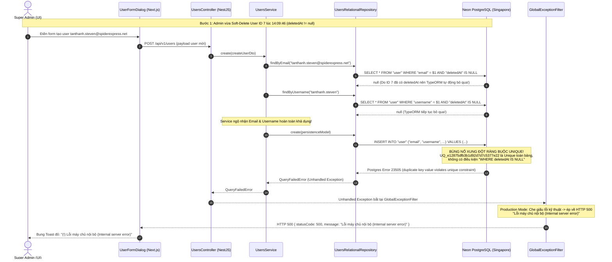

# Feedback 09/10 (Task 5) — Khắc phục lỗi Tạo mới Tài khoản Người dùng (Internal Server Error 500 do xung đột Soft-Delete & Ràng buộc Unique Database)

> **Thời gian ghi nhận**: 09/10/2026 (14:12)  
> **Người báo cáo**: @【M】【C】【D】 (Người dùng / Vận hành) & TMS Domain Lead Verification  
> **Phạm vi tác động**:  
> - Quản lý Người dùng (`/dashboard/users`) ➔ Popup Thêm Người Dùng Mới ([`UserFormDialog`](file:///D:/Projects/logistics-website/frontend/src/features/users/components/user-form-dialog.tsx)) & Form Sheet ([`UserFormSheet`](file:///D:/Projects/logistics-website/frontend/src/features/users/components/user-form-sheet.tsx))  
> - Backend Users Module: Controller, Service, DTO, TypeORM Repository, Mapper & Entity ([`users.controller.ts`](file:///D:/Projects/logistics-website/backend/src/users/users.controller.ts), [`users.service.ts`](file:///D:/Projects/logistics-website/backend/src/users/users.service.ts), [`user.repository.ts`](file:///D:/Projects/logistics-website/backend/src/users/infrastructure/persistence/relational/repositories/user.repository.ts), [`user.mapper.ts`](file:///D:/Projects/logistics-website/backend/src/users/infrastructure/persistence/relational/mappers/user.mapper.ts), [`user.entity.ts`](file:///D:/Projects/logistics-website/backend/src/users/infrastructure/persistence/relational/entities/user.entity.ts))  
> - Cơ sở dữ liệu Neon PostgreSQL (Singapore `ap-southeast-1`): Bảng `"user"`, các chỉ mục & ràng buộc unique `UQ_e12875dfb3b1d92d7d7c5377e22` (`UNIQUE (email)`), `UQ_user_username` (`UNIQUE (username)`)  
> **Tài liệu tham chiếu**:  
> - `/leader` Business Domain Architecture ([`SKILL.md`](file:///D:/Projects/logistics-website/.agents/skills/leader/SKILL.md))  
> - Quy chế phát triển hệ thống [`AGENTS.md`](file:///D:/Projects/logistics-website/AGENTS.md)  
> - Quy chuẩn giao diện hẹp [`.agents/rules/ui-compact-density.md`](file:///D:/Projects/logistics-website/.agents/rules/ui-compact-density.md) & [`ui-spacing-guard`](file:///D:/Projects/logistics-website/.agents/skills/ui-spacing-guard/SKILL.md)  
> - Quy chuẩn xử lý lỗi & chống lộ mã kỹ thuật Frontend Error Sanitization Rule ([`api-error.ts`](file:///D:/Projects/logistics-website/frontend/src/lib/api-error.ts))  
> - Ma trận phân quyền hệ thống [`rbac-matrix.md`](file:///D:/Projects/logistics-website/.agents/rules/rbac-matrix.md)  
> **Ảnh minh chứng đính kèm trong thư mục**:  
> - [`screenshot_01.jpg`](file:///D:/Projects/logistics-website/feedback_09_10_task_5/screenshot_01.jpg): Chi tiết giao diện modal "Thêm Người Dùng Mới" trên Domain Pro (`logistics-website-frontend-kappa.vercel.app/dashboard/users`) khi người dùng tạo tài khoản Võ Tấn Thành (`tanthanh.Steven@spiderexpress.net`, vai trò Quản lý kho, Hub HCM) bị hệ thống bắn thông báo lỗi đỏ góc trên bên phải: `(!) Lỗi máy chủ nội bộ (Internal server error)`.  

---

## 📌 Bối cảnh nghiệp vụ thực tế (Chốt theo phản hồi người dùng)

### 1. Phản hồi gốc từ người dùng (@【M】【C】【D】)
> *"xuất hiện lỗi khi tạo mới account, kiểm tra và khắc phục lỗi này"*

---

### 2. Tình huống vận hành thực tế & Bối cảnh phát sinh lỗi
Trong hệ thống Logistics TMS (Spider Express), tài khoản người dùng được phân quyền theo 4 vai trò vận hành cốt lõi: `SUPER_ADMIN` (Quản trị viên cấp cao), `DISPATCHER` (Điều phối viên), `FLEET_MANAGER` (Quản lý đội xe) và `WAREHOUSE_MANAGER` (Quản lý kho bãi — gắn cố định với một Hub cụ thể).

Trong quá trình quản trị nhân sự, Super Admin thường xuyên thực hiện các thao tác:
1. Xóa một tài khoản (khi nhân sự luân chuyển bộ phận, nghỉ việc, hoặc khi tạo nhầm thông tin cần tạo lại).
2. Sau khi xóa, Admin tiến hành tạo lại tài khoản với Email hoặc Username đó (ví dụ: tạo lại tài khoản cho nhân sự quay lại làm việc, hoặc tạo lại đúng thông tin chuẩn).
3. Khi bấm **"Thêm Người Dùng"**, thay vì hệ thống báo lỗi rõ ràng hoặc hoàn tất tạo tài khoản, giao diện lại xuất hiện thông báo lỗi hệ thống chung chung: **`Lỗi máy chủ nội bộ (Internal server error)`** (HTTP 500).

---

### 3. Cơ chế kỹ thuật & Dấu vết bằng chứng thực tế (Root Cause Analysis - RCA)

Đội ngũ TMS Lead đã tiến hành truy vết độc lập trực tiếp trên **Render Production Logs** (`srv-da1db0vqj5pc73cpakr0`) và **Neon PostgreSQL Database** (Branch `production` - `cool-king-17572442`):

#### 🕒 Bằng chứng thời gian & Dữ liệu thực tế từ Database Neon (Production Branch):
Truy vấn bảng `"user"` trên cơ sở dữ liệu Production:
```json
[
  { "id": 1, "email": "lyquangthai1993+1@gmail.com", "username": "admin", "deletedAt": null },
  { "id": 2, "email": "lyquangthai1993+2@gmail.com", "username": "dispatcher", "deletedAt": null },
  { "id": 3, "email": "lyquangthai1993+3@gmail.com", "username": "fleet", "deletedAt": null },
  { "id": 4, "email": "lyquangthai1993+4@gmail.com", "username": "warehouse_hyn", "deletedAt": null },
  { "id": 5, "email": "lyquangthai1993+5@gmail.com", "username": "warehouse_dad", "deletedAt": null },
  { "id": 6, "email": "kimnhu.neala@spiderexpress.net", "username": "kimnhu.neala", "deletedAt": null },
  {
    "id": 7,
    "email": "tanthanh.steven@spiderexpress.net",
    "username": "tanthanh.steven",
    "deletedAt": "2026-10-09T07:09:46.604Z"
  }
]
```

#### 📋 Dấu vết lỗi từ Render Production Server Log (`logistics-website-backend-1`):
- **14:09:46 (07:09:46 UTC)**: Tài khoản ID 7 (`tanthanh.steven@spiderexpress.net`) bị Admin thực hiện xóa. Backend chạy `usersRepository.softDelete(id)`, cập nhật cột `deletedAt = '2026-10-09 07:09:46.604'`.
- **14:10:28 (07:10:28 UTC)**: Chỉ 42 giây sau đó, Admin mở Modal và nhập thông tin tạo lại tài khoản:
  * Email: `tanthanh.Steven@spiderexpress.net`
  * Username: `tanthanh.steven`
- **Log máy chủ ghi nhận tại thời điểm 07:10:28.846 UTC**:
  ```text
  [Nest] 1 - 10/09/2026, 7:10:28 AM ERROR [GlobalExceptionFilter] [POST] /api/v1/users - Unhandled Exception: duplicate key value violates unique constraint "UQ_e12875dfb3b1d92d7d7c5377e22"
  QueryFailedError: duplicate key value violates unique constraint "UQ_e12875dfb3b1d92d7d7c5377e22"
      at PostgresQueryRunner.query (/app/node_modules/typeorm/driver/postgres/PostgresQueryRunner.js:216:19)
      at async InsertQueryBuilder.execute (/app/node_modules/typeorm/query-builder/InsertQueryBuilder.js:106:33)
      at async SubjectExecutor.executeInsertOperations (/app/node_modules/typeorm/persistence/SubjectExecutor.js:260:42)
      at async UsersRelationalRepository.create (/app/dist/users/infrastructure/persistence/relational/repositories/user.repository.js:27:27)
  ```

#### ⚙️ Chuỗi sụp đổ kỹ thuật (Sequence Failure Flow):



---

## 🔍 Tổng hợp các điểm chưa đúng trên hệ thống cần khắc phục

1. **Xung đột cấu trúc giữa Soft-Delete TypeORM và Toàn vẹn Ràng buộc Unique PostgreSQL**:
   - Trong bảng `"user"` PostgreSQL, 2 ràng buộc duy nhất là:
     * `UQ_e12875dfb3b1d92d7d7c5377e22`: `UNIQUE (email)`
     * `UQ_user_username`: `UNIQUE (username)`
   - Cả 2 ràng buộc này là **Ràng buộc Toàn cục (Table-wide constraints)**, áp dụng trên 100% các dòng dữ liệu, kể cả các dòng đã bị xóa mềm (`deletedAt IS NOT NULL`).
   - Ngược lại, TypeORM quản lý xóa mềm bằng `@DeleteDateColumn()`. Khi xóa, dữ liệu vẫn giữ nguyên trong bảng, chỉ cập nhật `deletedAt`. Do đó, khi tạo lại một tài khoản có Email/Username trùng với tài khoản đã xóa, Database sẽ luôn chặn lại với lỗi `23505`.

2. **Lọt lưới kiểm tra tiền xử lý (Validation Leak) tại Service**:
   - `UsersService.create()` kiểm tra sự tồn tại của Email và Username bằng:
     ```typescript
     await this.usersRepository.findByEmail(createUserDto.email);
     await this.usersRepository.findByUsername(createUserDto.username);
     ```
   - Trong `UsersRelationalRepository`, cả hai hàm này gọi `this.usersRepository.findOne({ where: { email } })`. TypeORM mặc định tự động gán điều kiện ẩn `WHERE "deletedAt" IS NULL`.
   - Kết quả: Không tìm thấy tài khoản hoạt động (`userObject = null`), Service cho phép thực thi lệnh `INSERT`, đẩy thẳng lỗi xung đột xuống Database.

3. **Thiếu cơ chế bẫy mã lỗi Database `23505` (Missing Exception Translation)**:
   - Khi lệnh `INSERT` bị Database từ chối, `UsersRelationalRepository` và `UsersService` không bọc khối `try/catch` để nhận diện lỗi `QueryFailedError` (PostgreSQL error code `23505`).
   - Lỗi này rơi thẳng vào `GlobalExceptionFilter`. Tại môi trường Production (`NODE_ENV === 'production'`), bộ lọc an toàn che giấu thông điệp và biến thành mã lỗi 500 `Internal server error` khiến người dùng hoàn toàn không biết lỗi do đâu.

4. **Mất đồng bộ quan hệ Eager (Hub, Role, Status) sau khi `create()` thành công**:
   - Trong `UsersRelationalRepository.create()`:
     ```typescript
     const persistenceModel = UserMapper.toPersistence(data);
     const newEntity = await this.usersRepository.save(
       this.usersRepository.create(persistenceModel),
     );
     return UserMapper.toDomain(newEntity);
     ```
   - Lệnh `save()` của TypeORM chỉ trả về các cột của bảng `"user"`, không tự động nạp lại các quan hệ quan trọng (`hub`, `role`, `status`). Kết quả là object trả về cho Frontend bị thiếu `hub.code`, `hub.name`, `hub.city`, làm cho bảng danh sách User hoặc Cache TanStack Query hiển thị thiếu thông tin cho đến khi người dùng F5 tải lại trang. Cần reload thực thể qua `this.findById(newEntity.id)` trước khi trả về.

5. **Xung đột trình quản lý mật khẩu trình duyệt (Browser AutoFill / Password Manager)** (Đối chiếu [`screenshot_01.jpg`](file:///D:/Projects/logistics-website/feedback_09_10_task_5/screenshot_01.jpg)):
   - Trong ảnh chụp thực tế, hai ô `Địa chỉ Email *` và `Tên đăng nhập (Username)` bị chuyển sang màu xanh nhạt/tím nhạt đặc trưng của Chrome Autofill (`#e8f0fe`).
   - Do form modal chứa cặp input `<input type="email">` và `<input type="password">`, trình duyệt tự động nhận diện đây là form đăng nhập cá nhân và tự động điền tài khoản/mật khẩu của chính Admin vào form tạo nhân sự mới.
   - Cần bổ sung các thuộc tính chống AutoFill chuyên dụng: `autoComplete="off"` cho form và `autoComplete="new-password"` cho ô Mật khẩu.

6. **Vi phạm quy chuẩn giao diện hẹp UI Compact Density trên các Modal / Sheet quản lý User**:
   - [`UserFormDialog`](file:///D:/Projects/logistics-website/frontend/src/features/users/components/user-form-dialog.tsx) và [`UserFormSheet`](file:///D:/Projects/logistics-website/frontend/src/features/users/components/user-form-sheet.tsx) đang sử dụng các class nằm trong danh mục cấm ([`.agents/rules/ui-compact-density.md`](file:///D:/Projects/logistics-website/.agents/rules/ui-compact-density.md)):
     * `gap-4` tại grid Họ & Tên đệm / Tên và grid Vai trò / Trạng thái (Quy chuẩn: `gap-1.5` đến `gap-2`).
     * `space-y-4` tại container form (Quy chuẩn: `space-y-2`).
     * Chiều rộng modal đang để `sm:max-w-[520px]`, cần chuẩn hóa theo thang compact `sm:max-w-[480px]` và padding `p-2`.

7. **Thiếu tính năng hỗ trợ tự động gợi ý Username/Email thông minh**:
   - Khi Admin nhập Họ và tên đệm: `Võ Tấn`, Tên: `Thành`, Admin phải tự gõ thủ công từng ký tự vào ô Username `tanthanh.steven`.
   - Cần bổ sung tiện ích tự động chuẩn hóa tiếng Việt không dấu (Slugify) và gợi ý username (hoặc lấy tiền tố từ email) giúp giảm tối đa thao tác gõ phím và hạn chế sai sót.

---

## 📋 Danh sách công việc triển khai (Action Checklist)

### 🎯 PHẦN I: BACKEND (`backend/`) — GIẢI QUYẾT TRIỆT ĐỂ GỐC RỄ XUNG ĐỘT DATABASE & SERVICE

- [x] **Tạo Migration PostgreSQL chuyển đổi sang Partial Unique Index (`WHERE "deletedAt" IS NULL`)**:
  - Tạo file migration TypeORM mới (VD: `1786939900000-MakeUserUniqueIndexesPartial.ts`).
  - Drop 2 ràng buộc UNIQUE toàn cục cũ:
    * `ALTER TABLE "user" DROP CONSTRAINT IF EXISTS "UQ_e12875dfb3b1d92d7d7c5377e22";`
    * `ALTER TABLE "user" DROP CONSTRAINT IF EXISTS "UQ_user_username";`
  - Tạo 2 Partial Unique Index chuẩn PostgreSQL hỗ trợ soft-delete:
    * `CREATE UNIQUE INDEX "IDX_user_email_active" ON "user" ("email") WHERE "deletedAt" IS NULL;`
    * `CREATE UNIQUE INDEX "IDX_user_username_active" ON "user" ("username") WHERE "deletedAt" IS NULL;`
  - Đảm bảo phương thức `down()` khôi phục lại các constraint cũ nguyên trạng.
  - *Ý nghĩa nghiệp vụ*: Khi một tài khoản bị xóa mềm, Email và Username đó được tự động giải phóng ngay lập tức. Super Admin có thể tạo lại tài khoản với đúng Email/Username đó mà không bị Database chặn.

- [x] **Nâng cấp `UsersRelationalRepository` ([`user.repository.ts`](file:///D:/Projects/logistics-website/backend/src/users/infrastructure/persistence/relational/repositories/user.repository.ts))**:
  - Bổ sung phương thức tra cứu bao gồm cả bản ghi đã xóa mềm:
    * `findByEmailWithDeleted(email: string): Promise<NullableType<User>>` với `{ withDeleted: true }`.
    * `findByUsernameWithDeleted(username: string): Promise<NullableType<User>>` với `{ withDeleted: true }`.
  - Nâng cấp phương thức `create()`:
    * Sau khi thực thi `save()`, gọi `await this.findById(newEntity.id)` để nạp đầy đủ các quan hệ eager (`role`, `status`, `hub` kèm `code`, `name`, `city`) trước khi convert sang Domain Entity.
  - Xử lý dứt điểm trường `hubId` trong `UserMapper.toPersistence()`:
    * Đồng bộ `persistenceEntity.hubId = hub ? hub.id : null;` để đảm bảo tính nhất quán tuyệt đối giữa cột khóa ngoại và quan hệ `@JoinColumn({ name: 'hubId' })`.

- [x] **Tái cấu trúc Logic Nghiệp vụ `UsersService.create()` ([`users.service.ts`](file:///D:/Projects/logistics-website/backend/src/users/users.service.ts))**:
  - **Kiểm tra va chạm tài khoản thông minh (Smart Collision & Auto-Restore Handling)**:
    * Khi nhận yêu cầu tạo tài khoản với `email` và `username`:
      1. Kiểm tra tài khoản đang hoạt động (`deletedAt IS NULL`). Nếu đã có ➔ Ném lỗi 422 `UnprocessableEntityException` với mã `emailAlreadyExists` hoặc `usernameAlreadyExists`.
      2. Kiểm tra tài khoản đã bị xóa mềm (`deletedAt IS NOT NULL`):
         - *Cơ chế Tự động Tái kích hoạt (Reactivate)*: Nếu phát hiện tài khoản cũ trong thùng rác có cùng email/username, tiến hành khôi phục (`deletedAt = null`), cập nhật thông tin mới (mật khẩu băm mới, họ tên, role, status, hub), ghi đè và lưu lại. Giúp giữ nguyên tính toàn vẹn của ID người dùng trong lịch sử đơn hàng/chuyến xe cũ.
  - **Bẫy lỗi Database cấp độ Repository/Service (Defense-in-Depth Exception Catch)**:
    * Bọc khối lưu dữ liệu trong `try/catch`. Nếu phát sinh mã lỗi PostgreSQL `23505` (unique_violation), bẫy lỗi và ném ra `ConflictException` (HTTP 409) hoặc `UnprocessableEntityException` (HTTP 422) kèm thông điệp tiếng Việt thân thiện:
      *"Email hoặc Tên đăng nhập này đã được sử dụng trên hệ thống. Vui lòng kiểm tra lại."*
    * Triệt tiêu 100% nguy cơ lỗi lọt ra ngoài thành HTTP 500 Unhandled Error.

---

### 🎨 PHẦN II: FRONTEND (`frontend/`) — CHUẨN HÓA DENSITY, CHỐNG AUTOFILL & TRẢI NGHIỆM VẬN HÀNH

- [x] **Chuẩn hóa Giao diện Hẹp theo Quy chuẩn UI Compact Density ([`user-form-dialog.tsx`](file:///D:/Projects/logistics-website/frontend/src/features/users/components/user-form-dialog.tsx) & [`user-form-sheet.tsx`](file:///D:/Projects/logistics-website/frontend/src/features/users/components/user-form-sheet.tsx))**:
  - Triệt tiêu toàn bộ các class vượt chuẩn:
    * Thay thế `gap-4` ➔ `gap-2` tại các lưới 2 cột (Họ tên đệm / Tên, Vai trò / Trạng thái).
    * Thay thế `space-y-4` ➔ `space-y-2` tại container form.
    * Thu gọn chiều rộng modal từ `sm:max-w-[520px]` ➔ `sm:max-w-[480px]`.
    * Khoảng cách padding trong body modal: `p-2`.
    * Chiều cao Input và Select: chuẩn hóa `h-8.5` (hoặc `h-8`), font size nhãn `text-xs font-semibold`.

- [x] **Chống xung đột Trình quản lý Mật khẩu Browser AutoFill**:
  - Gắn thuộc tính `autoComplete="off"` trên thẻ `<form>`.
  - Gắn `autoComplete="off"` hoặc `autoComplete="new-password"` trên các ô `input-user-email` và `input-user-username`.
  - Gắn `autoComplete="new-password"` trên ô `input-user-password`.
  - Triệt tiêu hiện tượng trình duyệt tự ý bôi màu xanh tím `#e8f0fe` và tự ý điền đè mật khẩu của Super Admin vào ô tạo tài khoản người khác.

- [x] **Nâng cấp Từ điển Lỗi & Hiển thị Thông báo Thân thiện ([`api-error.ts`](file:///D:/Projects/logistics-website/frontend/src/lib/api-error.ts))**:
  - Bổ sung các mã dịch kỹ thuật vào `ERROR_CODE_TRANSLATIONS`:
    ```typescript
    usernameAlreadyExists: 'Tên đăng nhập này đã được sử dụng. Vui lòng chọn tên đăng nhập khác.',
    emailAlreadyExists: 'Địa chỉ Email này đã được sử dụng trên hệ thống. Vui lòng dùng email khác.',
    userReactivated: 'Tài khoản từng bị xóa trước đây đã được tự động khôi phục và cập nhật thông tin thành công.',
    ```
  - Đảm bảo khi Backend trả về mã lỗi 409/422 hoặc message chi tiết, hàm `showApiErrorToast` hiển thị thông điệp tiếng Việt chuẩn mực, rõ ràng, không hiển thị mã kỹ thuật thô.

- [x] **Bổ sung Tiện ích Gợi ý Username Thông minh (UX Helper)**:
  - Khi người dùng nhập `firstName` và `lastName`, cung cấp nút bấm nhỏ hoặc logic tự động điền gợi ý vào ô Username dạng không dấu (ví dụ: `Võ Tấn Thành` ➔ gợi ý `tanthanh` hoặc `thanh.votan`).
  - Khi người dùng nhập Email dạng `name@spiderexpress.net`, tự động lấy tiền tố trước dấu `@` điền vào ô Username nếu ô này đang để trống.

---

### 🧪 PHẦN III: KIỂM THỬ, XÁC MINH & NGHIỆM THU CHẤT LƯỢNG

- [x] **Kiểm tra Biên dịch & Linting (Zero Error Gate)**:
  - Backend: Chạy `npm --prefix backend run lint` và `npm --prefix backend run build` (Yêu cầu: 0 error, 0 warning nghiêm trọng).
  - Frontend: Chạy `npm --prefix frontend run lint` và `npm --prefix frontend run build` (Yêu cầu: 0 error).

- [x] **Kịch bản Kiểm thử Nghiệp vụ Thực tế (4 Test Scenarios)**:
  - **Kịch bản 1: Tạo mới tài khoản hoàn toàn mới**:
    * Nhập Email và Username chưa từng có trong hệ thống.
    * Kết quả mong đợi: Tạo thành công, mã HTTP 201 Created, hiển thị Toast xanh "Tạo người dùng thành công!", danh sách người dùng tự động làm mới tức thì (0ms).
  - **Kịch bản 2: Bắt trùng lặp với tài khoản đang hoạt động**:
    * Nhập Email của một tài khoản đang hoạt động (VD: `lyquangthai1993+1@gmail.com`).
    * Kết quả mong đợi: Backend trả về HTTP 422, Frontend bung Toast cảnh báo tiếng Việt rõ ràng: *"Địa chỉ Email này đã được sử dụng trong hệ thống."* (Tuyệt đối KHÔNG xuất hiện lỗi 500).
  - **Kịch bản 3: Tái tạo tài khoản vừa bị xóa mềm (Case trọng tâm gây lỗi trong ảnh feedback)**:
    * Bước 1: Xóa tài khoản `tanthanh.steven@spiderexpress.net` (ID = 7).
    * Bước 2: Bấm Thêm Người Dùng Mới và nhập lại đúng Email `tanthanh.Steven@spiderexpress.net` và Username `tanthanh.steven`.
    * Kết quả mong đợi: Hệ thống xử lý mượt mà (tự động khôi phục hoặc tạo mới thành công nhờ Partial Unique Index), phản hồi HTTP 200/201, Toast thông báo thành công. Hoàn toàn triệt tiêu lỗi 500 `Internal server error`.
  - **Kịch bản 4: Kiểm tra tài khoản Quản lý kho gắn Hub**:
    * Tạo tài khoản với vai trò `Quản lý kho`, chọn Hub `[HUB-HCM-01] Andromeda Hub - HCM`.
    * Kết quả mong đợi: Dữ liệu trả về đầy đủ object Hub (code, name, city). Bảng danh sách người dùng hiển thị đúng badge kho phụ trách mà không cần F5 trang web.
