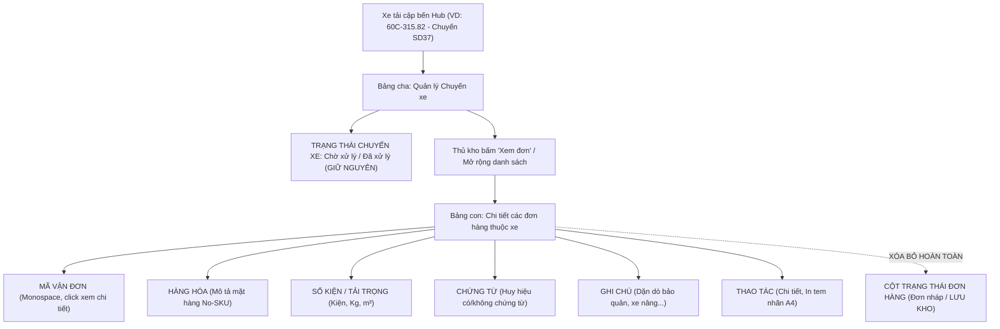

# Feedback 09/10 Task 6 — Loại bỏ Cột Trạng thái Đơn hàng tại Màn hình Nhập kho & Tinh gọn Giao diện Bảng kê

> **Thời gian ghi nhận**: 09/10/2026  
> **Người báo cáo**: @【M】【C】【D】 (Quản lý nghiệp vụ / Vận hành) & @TMS Domain Lead  
> **Phạm vi tác động**:  
> - Quản lý Nhập kho (`/warehouse/inbound`) ➔ Bảng kê danh sách chuyến xe và bảng con chi tiết đơn hàng trực thuộc chuyến xe ([`WarehouseInboundPage`](file:///D:/Projects/logistics-website/frontend/src/app/dashboard/warehouse/inbound/page.tsx))  
> - Bảng kê kiểm đếm & Phân hệ vận hành kho bãi ([`WarehouseTripTallyTable`](file:///D:/Projects/logistics-website/frontend/src/features/warehouse/components/warehouse-trip-tally-table.tsx) & [`WarehouseTripDetailModal`](file:///D:/Projects/logistics-website/frontend/src/features/warehouse/components/warehouse-trip-detail-modal.tsx))  
> - Quy chuẩn giao diện hẹp ([`.agents/rules/ui-compact-density.md`](file:///D:/Projects/logistics-website/.agents/rules/ui-compact-density.md) & [`ui-spacing-guard`](file:///D:/Projects/logistics-website/.agents/skills/ui-spacing-guard/SKILL.md))  
> - Backend API `/api/v1/warehouse/inbound-trips` & Type check toàn dự án  
> **Tài liệu tham chiếu**:  
> - `/leader` Business Domain Architecture ([`SKILL.md`](file:///D:/Projects/logistics-website/.agents/skills/leader/SKILL.md))  
> - Quy chế phát triển hệ thống [`AGENTS.md`](file:///D:/Projects/logistics-website/AGENTS.md)  
> - Quy chuẩn giao diện hẹp [`.agents/rules/ui-compact-density.md`](file:///D:/Projects/logistics-website/.agents/rules/ui-compact-density.md) & [`ui-spacing-guard`](file:///D:/Projects/logistics-website/.agents/skills/ui-spacing-guard/SKILL.md)  
> - Quy chuẩn kiểm soát kiện vận tải (No-SKU, Consignment Level)  
> **Ảnh minh chứng đính kèm trong thư mục**:  
> - [`screenshot_01.jpg`](file:///D:/Projects/logistics-website/feedback_09_10_task_6/screenshot_01.jpg): Giao diện màn hình Nhập kho tại `Andromeda Hub - HCM` với bảng con mở rộng của các chuyến xe `SD37` và `SD36` đang hiển thị cột "TRẠNG THÁI" đơn hàng (`Đơn nháp`, `LƯU KHO`) gây dư thừa thông tin và co hẹp không gian hiển thị.  

---

## 📌 Bối cảnh nghiệp vụ thực tế (Chốt theo phản hồi người dùng)

### 1. Phản hồi gốc từ người dùng (@【M】【C】【D】)
> *"loại bỏ cột trạng thái đơn hàng tại màn hình nhập kho"*

---

### 2. Tình huống vận hành thực tế tại trạm Nhập kho (Inbound Logistics Context)

Trong hoạt động vận hành kho bãi hàng ngày của hệ thống Logistics TMS (Spider Express), màn hình **Nhập kho** (`/warehouse/inbound`) là trung tâm tác nghiệp của thủ kho khi tiếp nhận các phương tiện vận tải cập bến Hub (bao gồm xe gom hàng gửi trực tiếp từ khách hàng và xe trung chuyển liên tỉnh Bắc - Nam).

Màn hình này được thiết kế theo cấu trúc Master-Detail phân cấp rõ rệt:
- **Cấp Chuyến xe (Trip-level - Bảng cha)**: Đại diện cho một lượt xe tải cập cảng bốc dỡ hàng hóa. Mỗi chuyến xe có trạng thái tiếp nhận tại trạm dừng: `Chờ xử lý` (chưa dỡ/chưa hoàn tất kiểm đếm) hoặc `Đã xử lý` (đã xác nhận dỡ hàng vào kho hoặc hoàn tất trạm).
- **Cấp Đơn hàng trực thuộc xe (Order/Consignment-level - Bảng con mở rộng)**: Khi thủ kho bấm mở rộng một chuyến xe (ví dụ xe `60C-315.82 (SD37)` hoặc xe `51D-739.04 (SD36)`), bảng con mở ra để hiển thị danh sách các đơn hàng thực tế đang nằm trên thùng xe đó.



#### Tại sao việc hiển thị cột "TRẠNG THÁI" đơn hàng tại màn hình Nhập kho là không phù hợp?
1. **Gây xung đột nhận thức nghiệp vụ (Cognitive Bias)**:
   - Khi một chuyến xe đang ở trạng thái `Chờ xử lý` (xe vừa tới kho, hàng đang nằm trên xe chờ dỡ), việc bảng con hiển thị badge `Đơn nháp` (như xe `SD37` trong [`screenshot_01.jpg`](file:///D:/Projects/logistics-website/feedback_09_10_task_6/screenshot_01.jpg)) khiến thủ kho bối rối: *"Tại sao hàng của khách gửi đi hoặc xe trung chuyển tới nơi lại là đơn nháp? Đơn này có hợp lệ để dỡ không hay chưa được duyệt?"*.
   - Tương tự, với xe đã hoàn tất (`Đã xử lý`), việc hiển thị badge `LƯU KHO` cũng không cung cấp thêm giá trị tác nghiệp nào vì toàn bộ hàng thuộc xe đó đã được dỡ vào kho.
2. **Ranh giới phân hệ rõ ràng**:
   - Trạng thái lưu kho của đơn hàng (`LƯU KHO`, `Đang luân chuyển`, `Đã xuất kho`...) là nghiệp vụ chuyên biệt của màn hình **Quản lý Tồn kho** (`/warehouse/orders`) và popup **Chi tiết vận đơn** (`WarehouseWaybillDetailModal`). Màn hình Nhập kho chỉ tập trung vào nghiệp vụ: **Hàng gì, bao nhiêu kiện, chứng từ ra sao, cần lưu ý dặn dò gì khi bốc dỡ**.
3. **Tối ưu hóa không gian hiển thị (UI Compact Density Mandate)**:
   - Cột `TRẠNG THÁI` chiếm dụng cố định `100px` chiều ngang quý giá.
   - Việc loại bỏ cột này giải phóng không gian để nới rộng cột `HÀNG HÓA` và đặc biệt là cột `GHI CHÚ` (vốn đang bị ép co lại chỉ `max-w-[180px]`), giúp thủ kho đọc trọn vẹn các dặn dò vận chuyển quan trọng như: *"Cần bảo quản khô ráo"*, *"Hàng nặng, cần xe nâng nhẹ"*, *"Hàng giá trị cao"*, *"Yêu cầu ký nhận đầy đủ"*.

---

### 3. Quy định chi tiết về trường thông tin & luồng hiển thị chuẩn mực của Bảng con đơn hàng

Sau khi loại bỏ cột `TRẠNG THÁI` đơn hàng, bảng con chi tiết các đơn hàng thuộc xe tại màn hình Nhập kho sẽ sở hữu đúng 6 cột chuẩn mực:

| STT | Tên cột hiển thị | Độ rộng đề xuất | Kiểu căn chỉnh | Nội dung & Quy chuẩn hiển thị |
|:---:|---|:---:|:---:|---|
| **1** | **MÃ VẬN ĐƠN** | `w-[130px]` | Căn trái | Mã vận đơn chuẩn (`text-[10px] font-mono font-bold text-blue-600 dark:text-blue-400 hover:underline`). Nhấp vào mở [`WarehouseWaybillDetailModal`](file:///D:/Projects/logistics-website/frontend/src/features/warehouse/components/warehouse-waybill-detail-modal.tsx) để kiểm tra chi tiết đơn hàng (read-only audit). |
| **2** | **HÀNG HÓA** | `min-w-[160px]` | Căn trái | Mô tả mặt hàng tổng quan No-SKU (`text-[10px] font-medium text-slate-800 dark:text-slate-200`). |
| **3** | **SỐ KIỆN / TẢI TRỌNG** | `w-[140px]` | Căn phải | Dòng 1: Số kiện thực nhận hoặc tổng kiện (`text-[10px] font-semibold`). Dòng 2: Khối lượng ($kg$) & Thể tích ($m^3$) định dạng chuẩn (`text-[9px] text-gray-400`). |
| **4** | **CHỨNG TỪ** | `w-[100px]` | Căn giữa | Badge chứng từ: Nếu có chứng từ hiển thị màu `emerald` (`border-emerald-300 bg-emerald-50 text-emerald-700`), nếu không có hiển thị màu `slate` (`Không có`). |
| **5** | **GHI CHÚ** | `min-w-[180px]` | Căn trái | Nội dung ghi chú vận hành, cảnh báo an toàn hàng hóa (`text-[10px] text-slate-500`). Tooltip hiển thị đầy đủ văn bản. |
| **6** | **THAO TÁC** | `w-[150px]` | Căn giữa | Cụm 2 nút bấm thao tác nhanh:<br>- Nút `<Button variant="ghost"><IconEye /> Chi tiết</Button>`<br>- Nút `<Button variant="outline"><IconPrinter /> In tem</Button>` (mở popup in tem pallet A4). |

> [!IMPORTANT]
> **BẢO TOÀN TRẠNG THÁI CẤP CHUYẾN XE TẠI BẢNG CHA:**
> Yêu cầu của người dùng là *"loại bỏ cột trạng thái **đơn hàng** tại màn hình nhập kho"*. Cột **TRẠNG THÁI** của chuyến xe tại bảng cha (thể hiện tiến trình trạm dừng: `Chờ xử lý` - PENDING hoặc `Đã xử lý` - COMPLETED qua component [`TripStopStatusBadge`](file:///D:/Projects/logistics-website/frontend/src/features/warehouse/components/trip-stop-status-badge.tsx)) **BẮT BUỘC ĐƯỢC GIỮ NGUYÊN**, tuyệt đối không được xóa nhầm cột của bảng cha.

---

## 🔍 Tổng hợp các điểm chưa đúng trên giao diện cũ (Đối chiếu chi tiết với `screenshot_01.jpg`)

Đối chiếu trực tiếp với ảnh chụp màn hình thực tế [`screenshot_01.jpg`](file:///D:/Projects/logistics-website/feedback_09_10_task_6/screenshot_01.jpg):

1. **Điểm lỗi 1: Tồn tại cột `TRẠNG THÁI` (w-[100px]) trong cấu trúc bảng con chi tiết đơn hàng**:
   - Trong file [`frontend/src/app/dashboard/warehouse/inbound/page.tsx`](file:///D:/Projects/logistics-website/frontend/src/app/dashboard/warehouse/inbound/page.tsx) tại dòng 1123-1125, phần `<thead>` của bảng con định nghĩa thẻ:
     ```tsx
     <th className='py-0.5 px-1.5 font-semibold text-center w-[100px]'>
       TRẠNG THÁI
     </th>
     ```
   - Tại dòng 1171-1175, phần `<tbody>` gọi component render badge trạng thái:
     ```tsx
     <td className='py-1.5 px-2 text-center'>
       {renderWarehouseOrderStatusBadge(
         subOrder.hubStatus ?? subOrder.status
       )}
     </td>
     ```
   - Thể hiện trực quan trên ảnh: Cột nằm ở vị trí thứ 4 (giữa `SỐ KIỆN / TẢI TRỌNG` và `CHỨNG TỪ`), hiển thị các badge như `Đơn nháp` (xe `SD37`) và `LƯU KHO` (xe `SD36`).

2. **Điểm lỗi 2: Nhãn trạng thái `Đơn nháp` và `LƯU KHO` gây hiểu nhầm nghiệp vụ nghiêm trọng**:
   - Đối với chuyến xe `SD37` biển số `60C-315.82` (đang ở trạng thái `Chờ xử lý`): Cả 4 đơn hàng con (`NDA2610-419`, `BAT2610-934`, `BHD2610-268`, `NMC2610-591`) đều bị gắn nhãn màu xám `Đơn nháp`. Thực tế các đơn này đã được tiếp nhận và vận chuyển, chỉ đang chờ thủ kho kiểm đếm thực nhận tại kho đích.
   - Đối với chuyến xe `SD36` biển số `51D-739.04` (đang ở trạng thái `Đã xử lý`): Cả 4 đơn hàng con (`NQT2610-516`, `NTC2610-882`, `NVS2610-105`, `PML2610-673`) đều gắn nhãn màu xanh lá `LƯU KHO`. Đây là trạng thái lưu kho sau khi dỡ, không cần thiết phải nhắc lại trên bảng kê chuyến xe nhập kho.

3. **Điểm lỗi 3: Lãng phí không gian bảng và chèn ép cột `GHI CHÚ`**:
   - Do phải dành 100px cho cột `TRẠNG THÁI` đơn hàng, cột `GHI CHÚ` bị bó hẹp với class `truncate max-w-[180px]`. Các ghi chú hướng dẫn bốc xếp ("Hàng nặng, cần xe nâng nhẹ", "Giữ nhiệt độ thường", "Cần bảo quản khô ráo") dễ bị cắt bớt chữ nếu màn hình máy tính có độ phân giải vừa phải.
   - Việc loại bỏ cột trạng thái đơn hàng sẽ giải phóng 100px, giúp cột Ghi chú và Hàng hóa hiển thị đầy đủ, nâng cao an toàn vận hành.

4. **Điểm lỗi 4: Đảm bảo phân định rõ ranh giới bảng cha và bảng con**:
   - Bảng cha: Cột `TRẠNG THÁI` thể hiện tiến trình xử lý chuyến xe (`TripStopStatusBadge`) là thông tin sống còn để thủ kho lọc theo tab `Tất cả (7)`, `Chờ xử lý (1)`, `Đã xử lý (6)`. Cột này **hoàn toàn chính xác và phải được giữ nguyên**.

---

## 📋 Danh sách công việc triển khai (Action Checklist)

### 1. Backend (`backend/`)

- [x] **Rà soát API Contract `inbound-trips` trong `WarehouseService` ([`warehouse.service.ts`](file:///D:/Projects/logistics-website/backend/src/orders/warehouse.service.ts))**:
  - Xác nhận API `GET /api/v1/warehouse/inbound-trips` vẫn tiếp tục trả về mảng `orders` với đầy đủ các thuộc tính: `id`, `orderCode`, `goodsDescription`, `totalQuantity`, `inboundQuantity`, `totalWeight`, `totalVolume`, `accompanyingDocs`, `notes`, `status` (phục vụ mở modal chi tiết vận đơn và in tem nhãn).
  - Không thay đổi cấu trúc trả về của API để tránh gây ảnh hưởng tới các màn hình khác hoặc các modal kiểm tra vận đơn.
- [x] **Bảo toàn Cơ sở dữ liệu & Entity**:
  - Không thay đổi trường `status` trong thực thể `OrderEntity` hay `TripStopEntity`.
  - Không thực hiện bất kỳ lệnh can thiệp schema hay migration cơ sở dữ liệu nào.
- [x] **Kiểm tra biên dịch & Linting Backend**:
  - Chạy `npm run lint --prefix backend` đảm bảo không có lỗi linting.
  - Chạy `npm run build --prefix backend` đảm bảo biên dịch thành công.

---

### 2. Frontend (`frontend/`)

- [x] **Chỉnh sửa Bảng con Đơn hàng trong [`frontend/src/app/dashboard/warehouse/inbound/page.tsx`](file:///D:/Projects/logistics-website/frontend/src/app/dashboard/warehouse/inbound/page.tsx)**:
  - **Xóa cột `TRẠNG THÁI` trong thẻ `<thead>`** (tại dòng ~1123-1125):
    - Loại bỏ hoàn toàn khối `<th className='py-0.5 px-1.5 font-semibold text-center w-[100px]'>TRẠNG THÁI</th>`.
  - **Xóa ô dữ liệu `TRẠNG THÁI` trong thẻ `<tbody>`** (tại dòng ~1171-1175):
    - Loại bỏ hoàn toàn khối `<td className='py-1.5 px-2 text-center'>{renderWarehouseOrderStatusBadge(subOrder.hubStatus ?? subOrder.status)}</td>`.
  - **Cân đối lại tỷ lệ bề rộng của 6 cột còn lại**:
    - `MÃ VẬN ĐƠN`: `w-[130px]` (Căn trái, font monospace in đậm, link mở chi tiết).
    - `HÀNG HÓA`: `min-w-[160px]` (Căn trái, font medium).
    - `SỐ KIỆN / TẢI TRỌNG`: `w-[140px]` (Căn phải, font semibold, format số kiện + kg/m³).
    - `CHỨNG TỪ`: `w-[100px]` (Căn giữa, badge emerald/slate).
    - `GHI CHÚ`: `min-w-[180px]` (Căn trái, hiển thị trọn vẹn lưu ý vận hành, tooltip đầy đủ).
    - `THAO TÁC`: `w-[150px]` (Căn giữa, nút Chi tiết & In tem).
- [x] **Bảo toàn tuyệt đối Cột `TRẠNG THÁI` của Bảng cha**:
  - Giữ nguyên thẻ `<th className='py-1.5 px-2 w-[100px] text-center'>TRẠNG THÁI</th>` tại dòng 957.
  - Giữ nguyên component `<TripStopStatusBadge status={grp.status} />` tại dòng 1067.
- [x] **Rà soát các Component liên quan trong Phân hệ Kho bãi**:
  - Rà soát [`WarehouseTripDetailModal`](file:///D:/Projects/logistics-website/frontend/src/features/warehouse/components/warehouse-trip-detail-modal.tsx): Xác nhận các bảng kê trong modal tuân thủ đúng nghiệp vụ 2 bước, không xuất hiện cột trạng thái đơn hàng thừa.
  - Rà soát [`WarehouseTripTallyTable`](file:///D:/Projects/logistics-website/frontend/src/features/warehouse/components/warehouse-trip-tally-table.tsx): Đảm bảo các cột kiểm đếm (Kiện HĐ, Kg HĐ, m³ HĐ, Dự kiến dỡ, Thực nhận, Chênh, Lý do) vận hành chuẩn mực.
  - Rà soát [`WarehouseWaybillDetailModal`](file:///D:/Projects/logistics-website/frontend/src/features/warehouse/components/warehouse-waybill-detail-modal.tsx): Giữ nguyên chế độ hiển thị trạng thái vận đơn trong modal chi tiết (chế độ đọc phục vụ tra cứu).
- [x] **Tuân thủ nghiêm ngặt Quy chuẩn giao diện hẹp (UI Compact Density Mandate)**:
  - Font chữ bảng con: Chuẩn mực `text-[10px]`, mã đơn `text-[10px] font-mono font-bold`.
  - Padding các ô dữ liệu: `py-1 px-1.5` để tối ưu chiều cao dòng (~26px), tăng số lượng dòng hiển thị trên màn hình.
  - Zero redundant icons: Triệt tiêu mọi icon trùng lặp với ký tự văn bản.

---

### 3. Kiểm thử & Nghiệm thu (Definition of Done)

- [x] **Kiểm tra biên dịch & Linting toàn dự án**:
  - Type check Backend: `npm run build --prefix backend` PASS (0 errors).
  - Type check Frontend: `npm run build --prefix frontend` PASS (Next.js Turbopack compiled successfully, TypeScript passed, 0 errors).
  - Linting: `npm run lint --prefix frontend` PASS (0 errors).
- [x] **Kịch bản kiểm thử nghiệp vụ thực tế (Manual & E2E Verification)**:
  - **Kịch bản 1: Kiểm tra giao diện bảng con chuyến xe ở trạng thái `Chờ xử lý`**:
    1. Đăng nhập hệ thống với vai trò Thủ kho / Quản lý kho (`WAREHOUSE_MANAGER`).
    2. Truy cập màn hình Nhập kho (`/warehouse/inbound`).
    3. Chọn tab `Chờ xử lý` hoặc tìm kiếm chuyến xe `SD37`.
    4. Bấm nút `Xem đơn` hoặc icon mũi tên để mở rộng bảng con chi tiết đơn hàng.
    5. **Xác nhận nghiệm thu**: Bảng con chỉ có 6 cột (`MÃ VẬN ĐƠN`, `HÀNG HÓA`, `SỐ KIỆN / TẢI TRỌNG`, `CHỨNG TỪ`, `GHI CHÚ`, `THAO TÁC`). Cột `TRẠNG THÁI` và các badge `Đơn nháp` hoàn toàn biến mất. Bố cục bảng rộng rãi, thông tin Ghi chú hiển thị rõ ràng.
  - **Kịch bản 2: Kiểm tra giao diện bảng con chuyến xe ở trạng thái `Đã xử lý`**:
    1. Chuyển sang tab `Đã xử lý` hoặc tìm chuyến xe `SD36`.
    2. Mở rộng bảng con chi tiết đơn hàng.
    3. **Xác nhận nghiệm thu**: Bảng con không còn cột `TRẠNG THÁI` và không còn badge `LƯU KHO`. Bảng hiển thị đồng bộ 6 cột như chuyến xe chờ xử lý.
  - **Kịch bản 3: Kiểm tra chức năng Thao tác trên từng dòng đơn con**:
    1. Bấm nút `Chi tiết` hoặc nhấp vào `Mã vận đơn`: Modal [`WarehouseWaybillDetailModal`](file:///D:/Projects/logistics-website/frontend/src/features/warehouse/components/warehouse-waybill-detail-modal.tsx) mở ra chính xác với dữ liệu đơn hàng tương ứng.
    2. Bấm nút `In tem`: Modal [`PalletLabelA4Modal`](file:///D:/Projects/logistics-website/frontend/src/features/warehouse/components/pallet-label-a4-modal.tsx) mở ra với thông tin in tem nhận diện kiện hàng chính xác.
  - **Kịch bản 4: Kiểm tra trạng thái Chuyến xe ở bảng cha và tính năng mở rộng/thu gọn**:
    1. Cột `TRẠNG THÁI` ở bảng cha vẫn hiển thị đầy đủ badge `Chờ xử lý` / `Đã xử lý`.
    2. Bấm nút `Mở rộng` / `Thu gọn` ở toolbar: Toàn bộ các chuyến xe co giãn trơn tru, không phát sinh thanh cuộn ngang bất thường, tỷ lệ các cột cân đối và đạt chuẩn compact density.
