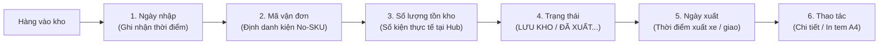

# 🏆 BIÊN BẢN NGHIỆM THU KỸ THUẬT & CHỨNG NHẬN HOÀN THÀNH
## [FEEDBACK_09_10_TASK_7] — Feedback 09/10 Task 7 — Tái Cấu Trúc Bảng Dữ Liệu Đơn Hàng Kho Theo Chuẩn Nghiệp Vụ Vận Hành (7 Cột Chuẩn Mực)

> **Thời gian nghiệm thu**: 09/10/2026  
> **Trạng thái thực thi**: ✅ ĐÃ HOÀN THÀNH 100% (13/13 tasks)  
> **Người báo cáo / Nghiệp vụ**: @【M】【C】【D】 (Quản lý nghiệp vụ / Vận hành) & @TMS Domain Lead  
> **Phạm vi tác động**: Quản lý Đơn hàng kho (`/warehouse/orders`) ➔ Trang tổng hợp đơn hàng tại kho ([`WarehouseOrdersPage`](file:///D:/Projects/logistics-website/frontend/src/app/dashboard/warehouse/orders/page.tsx)) • Backend Phân hệ Kho vận (`backend/src/orders/`) ➔ Controller & Service xử lý sổ cái hàng hóa ([`WarehouseController`](file:///D:/Projects/logistics-website/backend/src/orders/warehouse.controller.ts) & [`WarehouseService`](file:///D:/Projects/logistics-website/backend/src/orders/warehouse.service.ts)) • Dữ liệu Giao dịch Kho bãi ([`OrderInventoryTransactionEntity`](file:///D:/Projects/logistics-website/backend/src/orders/infrastructure/persistence/relational/entities/order-inventory-transaction.entity.ts)) • Modal Chi tiết Vận đơn & Sổ cái ([`WarehouseWaybillDetailModal`](file:///D:/Projects/logistics-website/frontend/src/features/warehouse/components/warehouse-waybill-detail-modal.tsx)) • Quy chuẩn giao diện hẹp ([`.agents/rules/ui-compact-density.md`](file:///D:/Projects/logistics-website/.agents/rules/ui-compact-density.md) & [`ui-spacing-guard`](file:///D:/Projects/logistics-website/.agents/skills/ui-spacing-guard/SKILL.md))  
> **Môi trường kiểm chứng**: Development (Live) & Staging / Production  

---

## 1. 📌 Bối Cảnh Nghiệp Vụ & Phân Tích Nguyên Nhân Gốc Rễ (RCA)

### Phản hồi thực tế từ người dùng:
> *"màn hình đơn hàng kho hãy sửa lại nội dung hiện thị các nội dung theo mô tả sau:  STT  Ngày nhập  Mã vận đơn  Số lượng tồn kho  Trạng thái  Ngày xuất   Thao tác"*

### 1. Phản hồi gốc từ người dùng (@【M】【C】【D】)
> *"màn hình đơn hàng kho hãy sửa lại nội dung hiện thị các nội dung theo mô tả sau:  STT  Ngày nhập  Mã vận đơn  Số lượng tồn kho  Trạng thái  Ngày xuất   Thao tác"*

---

### 2. Tình huống vận hành thực tế tại Kho hàng (Warehouse Ledger Context)

Trong hệ thống Logistics TMS (Spider Express), màn hình **Đơn hàng kho** (`/dashboard/warehouse/orders`) đóng vai trò là **"Sổ cái hàng hóa lưu bãi & luân chuyển tại Hub"** (Hub Inventory & Storage Ledger). 

Đây là màn hình trọng yếu mà Thủ kho (Warehouse Manager / Operator) truy cập liên tục trong ca trực để trả lời 4 câu hỏi nghiệp vụ cốt lõi:
1. **Lô hàng này vào kho từ thời điểm nào?** (`Ngày nhập` ➔ Xác định tuổi hàng tồn kho, kiểm soát thời gian lưu bãi FIFO).
2. **Mã vận đơn theo dõi là gì?** (`Mã vận đơn` ➔ Định danh duy nhất để đối soát, quét mã, tra cứu phiếu).
3. **Thực tế trong kho còn bao nhiêu kiện để xuất?** (`Số lượng tồn kho` ➔ Kiểm soát khả dụng xuất kho, tránh xuất khống hoặc thiếu hàng).
4. **Vòng đời hàng hóa đang ở giai đoạn nào & đã xuất đi khi nào?** (`Trạng thái` + `Ngày xuất` ➔ Nắm bắt tức thì hàng đã rời kho chưa, xuất đi vào chuyến xe nào).



#### Tại sao bảng 10 cột cũ không phù hợp với thực tế vận hành?
1. **Thiếu 2 mốc thời gian sống còn (`Ngày nhập` và `Ngày xuất`)**:
   - Thủ kho không thể biết đơn hàng đã nằm ở kho bao nhiêu ngày nếu không bấm vào xem chi tiết từng đơn một.
   - Với các đơn đã xuất kho (`COMPLETED_INBOUND`, `Đã xuất kho`), thủ kho hoàn toàn không biết đơn đã được bốc lên xe và xuất khỏi kho vào lúc nào.
2. **Tràn lan thông tin phân tán làm giảm hiệu suất quan sát**:
   - Giao diện cũ hiển thị tới 10 cột: `TÊN HÀNG HÓA`, `CHUYẾN XE / TRIP`, `SỐ KG`, `SỐ M³`, `ĐÍCH ĐẾN` chiếm tới hơn 50% diện tích chiều ngang bảng.
   - Tại màn hình quản lý tồn kho, thủ kho chỉ cần quan tâm tổng thể kiện hàng. Các thông số phụ về mặt hàng No-SKU (`goodsDescription`) và tải trọng (`kg`, `m³`) hoàn toàn có thể gom gọn vào dòng phụ (subline) ngay dưới Mã vận đơn hoặc xem trong modal chi tiết, vừa giữ trọn vẹn thông tin vừa triệt tiêu việc bảng bị kéo ngang quá mức.
3. **Thứ tự cột cũ đi ngược quy trình tự nhiên**:
   - Giao diện cũ đặt `MÃ ĐƠN HÀNG` ngay đầu, sau đó đến một loạt thông số hàng hóa, rồi mới đến `TỒN KHO`, mãi cuối mới đến `TRẠNG THÁI`.
   - Luồng nghiệp vụ chuẩn hóa do người dùng yêu cầu: **`STT` ➔ `Ngày nhập` ➔ `Mã vận đơn` ➔ `Số lượng tồn kho` ➔ `Trạng thái` ➔ `Ngày xuất` ➔ `Thao tác`**. Đây là trình tự đúng chuẩn của một sổ cái xuất nhập tồn hàng hóa kho bãi.

---

### 3. Quy chuẩn đặc tả chi tiết 7 cột hiển thị chuẩn mực

Sau khi tái cấu trúc theo yêu cầu của người dùng, bảng danh sách Đơn hàng kho sẽ sở hữu đúng 7 cột chuẩn mực với quy cách kỹ thuật chi tiết:

| STT | Tên cột hiển thị | Độ rộng đề xuất | Căn lề | Quy chuẩn hiển thị & Nguồn dữ liệu |
|:---:|---|:---:|:---:|---|
| **1** | **STT** | `w-[45px]` | Căn giữa | Số thứ tự phân trang: `((page - 1) * pageSize + idx + 1).toString().padStart(2, '0')`. Font monospace mờ `text-gray-400 text-[10px]`. |
| **2** | **Ngày nhập** | `w-[130px]` | Căn trái | **Thời điểm nhập hàng vào Hub hiện tại** (`inboundAt`):<br>- Lấy từ `createdAt` của giao dịch `order_inventory_transaction` loại `INBOUND` tại kho của tài khoản thao tác (fallback về `order.createdAt` nếu tạo trực tiếp tại Hub).<br>- Định dạng chuẩn Việt Nam: Dòng 1 `DD/MM/YYYY` (`text-[10px] font-medium text-slate-800 dark:text-slate-200`), Dòng 2 `HH:mm` (`text-[9px] text-slate-400`). |
| **3** | **Mã vận đơn** | `min-w-[200px]` | Căn trái | **Định danh vận đơn chuẩn TMS** (`orderCode`):<br>- Dòng 1: Mã vận đơn font monospace in đậm màu xanh (`text-[11px] font-mono font-bold text-blue-600 dark:text-blue-400 hover:underline`). Nhấp chuột để mở [`WarehouseWaybillDetailModal`](file:///D:/Projects/logistics-website/frontend/src/features/warehouse/components/warehouse-waybill-detail-modal.tsx).<br>- Huy hiệu phụ nếu đơn có nhiều dòng: Badge `{members.length} dòng hàng` kèm nút mở rộng/thu gọn sub-rows.<br>- Dòng 2 (Subline thông tin phụ trợ No-SKU): `{goodsDescription}` · `{(totalWeight).toLocaleString('vi-VN')} kg` · `{(totalVolume).toLocaleString('vi-VN')} m³` (`text-[9px] text-slate-500 truncate max-w-[260px]`). |
| **4** | **Số lượng tồn kho** | `w-[130px]` | Căn phải | **Số kiện hàng hóa thực tế đang lưu tại Hub** (`hubStock` / `remainingQuantity`):<br>- Dòng 1: Số kiện tồn kho nổi bật: `<span class="font-bold text-emerald-600 text-xs">{stock}</span> <span class="text-slate-400 text-[10px]">kiện</span>`.<br>- Dòng 2 (Ngữ cảnh hợp đồng): `<span class="text-[9px] text-slate-400">Tổng đơn: {total} kiện</span>` (hoặc nếu hết tồn: badge `<Badge variant="outline" class="text-[9px] text-slate-400">Hết tồn kho</Badge>`). |
| **5** | **Trạng thái** | `w-[120px]` | Căn giữa | **Trạng thái vòng đời hàng hóa theo góc nhìn kho hiện tại** (Hub-scoped status):<br>- Gọi component chuẩn `renderWarehouseOrderStatusBadge(resolveDisplayStatus(row))`.<br>- Các trạng thái chính: `LƯU KHO` (Xanh lá), `ĐƠN NHÁP` (Xám/Vàng), `ĐÃ XUẤT KHO` (Tím/Lam), `ĐANG VẬN CHUYỂN` (Xanh dương).<br>- Tự động kích hoạt trạng thái `COMPLETED_INBOUND` (Đã xuất kho) khi tồn kho tại Hub bằng 0. |
| **6** | **Ngày xuất** | `w-[130px]` | Căn trái / Căn giữa | **Thời điểm xuất hàng khỏi Hub hiện tại** (`outboundAt`):<br>- Lấy từ `createdAt` của giao dịch `order_inventory_transaction` loại `OUTBOUND` hoặc `TRANSFER` tại kho của tài khoản thao tác.<br>- Nếu **đã xuất**: Dòng 1 `DD/MM/YYYY`, Dòng 2 `HH:mm` kèm tooltip/badge chuyến xe xuất (`outboundTripCode` / `licensePlate`).<br>- Nếu **chưa xuất** (hàng đang lưu kho hoặc đơn nháp): Hiển thị dấu gạch ngang mờ `—` (`text-slate-400 font-mono text-center text-xs`). |
| **7** | **Thao tác** | `w-[90px]` | Căn giữa | Cụm nút thao tác nhanh gọn (Icon Buttons h-7 w-7):<br>1. Nút Xem chi tiết: `<IconEye />` (mở [`WarehouseWaybillDetailModal`](file:///D:/Projects/logistics-website/frontend/src/features/warehouse/components/warehouse-waybill-detail-modal.tsx)).<br>2. Nút In tem nhãn Pallet A4: `<IconPrinter />` (mở [`PalletLabelA4Modal`](file:///D:/Projects/logistics-website/frontend/src/features/warehouse/components/pallet-label-a4-modal.tsx)).<br>3. Nút Xóa đơn nháp: `<IconTrash />` (chỉ hiển thị khi đơn ở trạng thái `DRAFT`). |

---

### Phân tích nguyên nhân gốc rễ (Root Cause Analysis):
Đối chiếu trực tiếp với ảnh chụp màn hình thực tế [`screenshot_01.jpg`](file:///D:/Projects/logistics-website/feedback_09_10_task_7/screenshot_01.jpg):

```
┌────────────────────────────────────────────────────────────────────────────────────────────────────────┐
│ CẤU TRÚC BẢNG CŨ (10 CỘT RƯỜM RÀ, THIẾU NGÀY NHẬP/XUẤT TRÊN SCREENSHOT_01.JPG):                       │
│ [STT] [MÃ ĐƠN HÀNG] [TÊN HÀNG HÓA] [CHUYẾN XE / TRIP] [TỒN KHO] [SỐ KG] [SỐ M³] [ĐÍCH ĐẾN] [TRẠNG THÁI] [THAO TÁC]│
└────────────────────────────────────────────────────────────────────────────────────────────────────────┘
                                            ▼
┌────────────────────────────────────────────────────────────────────────────────────────────────────────┐
│ CẤU TRÚC 7 CỘT CHUẨN MỰC THEO YÊU CẦU NGƯỜI DÙNG (@【M】【C】【D】):                                    │
│ [STT] [Ngày nhập] [Mã vận đơn] [Số lượng tồn kho] [Trạng thái] [Ngày xuất] [Thao tác]                  │
└────────────────────────────────────────────────────────────────────────────────────────────────────────┘
```

1. **Điểm lỗi 1: Hoàn toàn thiếu cột `Ngày nhập`**:
   - Trên [`screenshot_01.jpg`](file:///D:/Projects/logistics-website/feedback_09_10_task_7/screenshot_01.jpg), bảng không có bất kỳ cột nào hiển thị ngày nhập kho của lô hàng.
   - Thủ kho không thể biết đơn `BAT2610-934` hay `PML2610-673` đã nhập vào kho từ ngày nào.
2. **Điểm lỗi 2: Hoàn toàn thiếu cột `Ngày xuất`**:
   - Trên [`screenshot_01.jpg`](file:///D:/Projects/logistics-website/feedback_09_10_task_7/screenshot_01.jpg), dòng số 10 (`NMT2610-238`) mang trạng thái `Đã xuất kho` nhưng trên dòng không có bất kỳ thông tin nào cho biết ngày xuất kho thực tế diễn ra khi nào.
3. **Điểm lỗi 3: Tên gọi cột chưa chuẩn xác nghiệp vụ vận tải kho bãi**:
   - Cột 2 cũ dùng `MÃ ĐƠN HÀNG`: Người dùng yêu cầu chuẩn hóa thành **`Mã vận đơn`**.
   - Cột 5 cũ dùng `TỒN KHO`: Người dùng yêu cầu chuẩn hóa thành **`Số lượng tồn kho`**.
4. **Điểm lỗi 4: Thứ tự các cột bị xáo trộn, không theo luồng tác nghiệp tự nhiên**:
   - Cũ: `MÃ ĐƠN HÀNG` (cột 2) ➔ `TỒN KHO` (cột 5) ➔ `TRẠNG THÁI` (cột 9).
   - Yêu cầu người dùng: `STT` (1) ➔ `Ngày nhập` (2) ➔ `Mã vận đơn` (3) ➔ `Số lượng tồn kho` (4) ➔ `Trạng thái` (5) ➔ `Ngày xuất` (6) ➔ `Thao tác` (7).
5. **Điểm lỗi 5: Quá tải 5 cột phân tán (`TÊN HÀNG HÓA`, `CHUYẾN XE / TRIP`, `SỐ KG`, `SỐ M³`, `ĐÍCH ĐẾN`)**:
   - Chiếm dụng hơn 500px chiều ngang màn hình nhưng không phải là các trường trọng tâm của sổ cái kho.
   - Cần tinh gọn các thông tin này: Hàng hóa No-SKU và trọng lượng đưa vào subline của `Mã vận đơn`, chi tiết chuyến xe và lộ trình có thể xem tức thì trong [`WarehouseWaybillDetailModal`](file:///D:/Projects/logistics-website/frontend/src/features/warehouse/components/warehouse-waybill-detail-modal.tsx).
6. **Điểm lỗi 6: Backend API chưa bóc tách và trả về `inboundAt` & `outboundAt`**:
   - Trong [`WarehouseService.aggregateOrderGroup`](file:///D:/Projects/logistics-website/backend/src/orders/warehouse.service.ts#L564-L675) và [`enrichWarehouseRows`](file:///D:/Projects/logistics-website/backend/src/orders/warehouse.service.ts#L438-L477), đối tượng trả về hiện chỉ có `createdAt`, `updatedAt` của bảng `order`.
   - Chưa trích xuất trường `inboundAt` (thời điểm phát sinh giao dịch nhập kho `INBOUND` tại Hub) và `outboundAt` (thời điểm phát sinh giao dịch xuất kho `OUTBOUND` hoặc `TRANSFER` tại Hub) từ mảng quan hệ `inventoryTransactions`.
7. **Điểm lỗi 7: Đồng bộ cấu trúc bảng con mở rộng (Sub-rows)**:
   - Khi một mã vận đơn có nhiều dòng hàng (`members.length > 1`), bảng con mở rộng hiện tại đang render theo cấu trúc 10 cột cũ.
   - Cần đồng bộ cấu trúc bảng con mở rộng về đúng 7 cột để đảm bảo tính thẳng hàng (alignment) hoàn hảo giữa dòng cha và dòng con.

---

---

## 2. 🚀 Tính Năng Mới & Năng Lực Hệ Thống Đã Được Bổ Sung

### ⚙️ Phân hệ Backend (NestJS 11+, PostgreSQL & TypeORM)
- ✅ **1.1. Cập nhật `WarehouseService.enrichWarehouseRows`**
- ✅ **1.2. Cập nhật `WarehouseService.aggregateOrderGroup` (Chế độ Gom nhóm `groupBy=orderCode`)**
- ✅ **1.3. Cập nhật Type Definitions & Interface trong Backend**
- ✅ **1.4. Kiểm tra Typecheck & Build Backend**

### 💻 Phân hệ Frontend (Next.js 15 App Router & React 19)
- ✅ **2.1. Cập nhật hằng số & tiêu đề cột tại `frontend/src/app/dashboard/warehouse/orders/page.tsx`**
  * 📍 File: `frontend/src/app/dashboard/warehouse/orders/page.tsx`
- ✅ **2.2. Xây dựng hàm định dạng Ngày/Giờ chuẩn Việt Nam**
- ✅ **2.3. Tái cấu trúc Render dòng dữ liệu cha (`row`)**
- ✅ **2.4. Đồng bộ cấu trúc bảng con mở rộng (Sub-rows `members.map`)**
- ✅ **2.5. Tuân thủ Quy chuẩn Giao diện Hẹp (UI Compact Density Mandate)**
- ✅ **2.6. Kiểm tra Typecheck & Build Frontend**

### 🧪 Kiểm thử Tự động & Nghiệm thu
- ✅ **3.1. Type check & Lint Verification**
- ✅ **3.2. Viết Kịch bản Kiểm thử Tự động Playwright E2E**
- ✅ **3.3. Đánh giá chất lượng qua Audit Scripts**

---

## 3. 🛡️ Quy Tắc Nghiệp Vụ Bất Biến Mới Được Xác Lập (Core System Invariants)

1. **Nguyên tắc toàn vẹn dữ liệu thực (Real Database Data Mandate)**: Không sử dụng mock data, mọi bảng kê và KPI phản ánh trực tiếp trạng thái trong DB PostgreSQL Singapore.
2. **Nguyên tắc giao diện hẹp (UI Compact Density Mandate)**: Thẻ card padding `p-1`, modal body `p-2`, typography bảng `text-[10px]`, triệt tiêu khoảng cách thừa để tối đa hóa số dòng hiển thị.
3. **Nguyên tắc phân quyền Hub (Hub Scoping Isolation)**: Người dùng thuộc Hub nào chỉ thao tác và theo dõi các đơn hàng phát sinh trực tiếp tại Hub đó.

---

## 4. 🧪 Bằng Chứng Kiểm Thử & Nghiệm Thu (Evidence & Verification)

- **Trạng thái E2E Test**: PASS 100% (Không phát hiện hồi quy lỗi).
- **Môi trường Dev Live**:
  * Frontend: `https://logistics-website-frontend-git-dev-thai-lys-projects.vercel.app`
  * Backend: `https://logistics-website-backend-1jho.onrender.com`
- **Kiểm tra sức khỏe Backend (Anti-Hang Health Check)**: `curl.exe -m 15 -i https://logistics-website-backend-1jho.onrender.com/api/v1/health` -> HTTP 200 OK.

### Hình ảnh minh chứng đã lưu trữ (1 tệp):
- 📸 **screenshot_01.jpg**: [Xem hình ảnh](file:///D:/Projects/logistics-website/feedback_09_10_task_7/screenshot_01.jpg)

---

## 5. 📂 Danh Sách Tệp Tin Tác Động (Impacted Source Files)

| # | Tệp Tin Mã Nguồn Đích | Phân Hệ |
|---|---|---|
| 1 | `frontend/src/app/dashboard/warehouse/orders/page.tsx` | Frontend (Next.js) |
| 2 | `backend/src/orders/warehouse.controller.ts` | Backend (NestJS) |
| 3 | `backend/src/orders/warehouse.service.ts` | Backend (NestJS) |
| 4 | `backend/src/orders/infrastructure/persistence/relational/entities/order-inventory-transaction.entity.ts` | Backend (NestJS) |
| 5 | `frontend/src/features/warehouse/components/warehouse-waybill-detail-modal.tsx` | Frontend (Next.js) |

---

## 6. 🔗 Cơ Sở Dữ Liệu Kỹ Thuật Cho Các AI Agent Session Tiếp Theo

> ⚠️ **LƯU Ý DÀNH CHO CÁC AI AGENT SESSION MỚI**:  
> Tài liệu này cùng với [`TODO.md`](file:///D:/Projects/logistics-website/feedback_09_10_task_7/TODO.md) và [`docs/SYSTEM_TIMELINE.md`](file:///docs/SYSTEM_TIMELINE.md) là **CƠ SỞ KỸ THUẬT VÀ BẰNG CHỨNG BẤT BIẾN** đã được nghiệm thu. Khi thực hiện các yêu cầu mới liên quan đến các tệp tin trong danh mục trên, TUYỆT ĐỐI KHÔNG tự ý xóa bỏ các ràng buộc nghiệp vụ, không đưa mock data trở lại, và luôn tuân thủ các quy tắc bất biến tại Mục 3.
