# 🏆 BIÊN BẢN NGHIỆM THU KỸ THUẬT & CHỨNG NHẬN HOÀN THÀNH
## [FEEDBACK_09_10_TASK_8] — Feedback 09/10 Task 8 — Hoàn Thiện Quy Chuẩn Bảng Đơn Hàng Kho 7 Cột & Ràng Buộc Nghiệp Vụ Cột Ngày Xuất Hàng (Để Trống Khi Lưu Kho)

> **Thời gian nghiệm thu**: 09/10/2026  
> **Trạng thái thực thi**: ✅ ĐÃ HOÀN THÀNH 100% (16/16 tasks)  
> **Người báo cáo / Nghiệp vụ**: @【M】【C】【D】 (Quản lý nghiệp vụ / Vận hành) & @TMS Domain Lead  
> **Phạm vi tác động**: Quản lý Đơn hàng kho (`/warehouse/orders`) ➔ Trang tổng hợp đơn hàng tại kho ([`WarehouseOrdersPage`](file:///D:/Projects/logistics-website/frontend/src/app/dashboard/warehouse/orders/page.tsx)) • Chi tiết vận đơn & Sổ cái kho ([`WarehouseWaybillDetailModal`](file:///D:/Projects/logistics-website/frontend/src/features/warehouse/components/warehouse-waybill-detail-modal.tsx)) • Backend Phân hệ Kho vận (`backend/src/orders/`) ➔ Controller & Service xử lý sổ cái hàng hóa ([`WarehouseController`](file:///D:/Projects/logistics-website/backend/src/orders/warehouse.controller.ts) & [`WarehouseService`](file:///D:/Projects/logistics-website/backend/src/orders/warehouse.service.ts)) • Bảng dữ liệu Giao dịch Kho bãi ([`OrderInventoryTransactionEntity`](file:///D:/Projects/logistics-website/backend/src/orders/infrastructure/persistence/relational/entities/order-inventory-transaction.entity.ts)) • Quy chuẩn giao diện hẹp ([`.agents/rules/ui-compact-density.md`](file:///D:/Projects/logistics-website/.agents/rules/ui-compact-density.md) & [`ui-spacing-guard`](file:///D:/Projects/logistics-website/.agents/skills/ui-spacing-guard/SKILL.md))  
> **Môi trường kiểm chứng**: Development (Live) & Staging / Production  

---

## 1. 📌 Bối Cảnh Nghiệp Vụ & Phân Tích Nguyên Nhân Gốc Rễ (RCA)

### Phản hồi thực tế từ người dùng:
> *"nếu đơn hàng ở trạng thái lưu kho thì cột ngày xuất hàng để trống"*

### 1. Phản hồi gốc từ người dùng (@【M】【C】【D】)
> *"nếu đơn hàng ở trạng thái lưu kho thì cột ngày xuất hàng để trống"*  
> *(Kế thừa và chuẩn hóa tiếp nối từ yêu cầu tái cấu trúc 7 cột bảng Đơn hàng kho: `STT` | `Ngày nhập` | `Mã vận đơn` | `Số lượng tồn kho` | `Trạng thái` | `Ngày xuất` | `Thao tác`)*

---

### 2. Tình huống vận hành thực tế tại Hub & Ý nghĩa sống còn của quy tắc

Trong hệ thống Logistics TMS (Spider Express), màn hình **Đơn hàng kho** (`/dashboard/warehouse/orders`) là **Sổ cái quản lý tồn kho và biến động hàng hóa tại Hub** (Hub Storage & Inventory Ledger).

Khi một lô hàng được dỡ xuống và lưu bãi tại Hub:
1. **Giai đoạn 1: Đang lưu kho (Stored in Warehouse)**:
   - Trạng thái hiển thị là `LƯU KHO` (hoặc `INBOUND`, `STORED`, `IN_WAREHOUSE`).
   - Lúc này số kiện tồn kho khả dụng tại Hub `hubStock > 0`.
   - **Quy tắc bất biến**: Lô hàng **CHƯA RỜI KHO**, chưa được bốc lên bất kỳ chuyến xe nào để xuất đi (chưa có phiếu xuất `PXK` hoặc giao dịch `OUTBOUND`/`TRANSFER` hoàn tất). Do đó, **CỘT "NGÀY XUẤT" BẮT BUỘC PHẢI ĐỂ TRỐNG** (hiển thị ký tự gạch ngang mờ `—` hoặc rỗng).
   - **Hệ quả nếu làm sai**: Nếu hệ thống tự ý hiển thị ngày cập nhật (`updatedAt`), ngày dự kiến giao, hoặc ngày của chuyến xe dự kiến vào cột "Ngày xuất", Thủ kho sẽ hiểu lầm rằng kiện hàng đã xuất đi rồi, dẫn đến sai lệch kiểm kê kho vật lý, thất thoát hàng hóa hoặc tạo lệnh xuất trùng lặp.
2. **Giai đoạn 2: Đã xuất khỏi kho (Dispatched / Transferred Out)**:
   - Khi thủ kho hoàn tất tác nghiệp xuất kho (giao hàng chặng cuối cho khách lẻ hoặc luân chuyển liên Hub), giao dịch `OUTBOUND` hoặc `TRANSFER` được ghi vào sổ cái `order_inventory_transaction`.
   - Trạng thái chuyển thành `ĐÃ XUẤT KHO` (`COMPLETED_INBOUND` / `DISPATCHED`).
   - Số lượng tồn khả dụng tại Hub về `0`.
   - Lúc này cột **"Ngày xuất"** mới được hiển thị chính xác theo thời điểm thực tế xe rời kho (`dispatchedAt` / thời gian tạo giao dịch xuất kho).
3. **Giai đoạn 3: Đơn hàng nháp (Draft)**:
   - Trạng thái `ĐƠN NHÁP` (`DRAFT`): Hàng chưa chính thức hoàn tất thủ tục nhập kho vào sổ cái, do đó cột "Ngày xuất" cũng **BẮT BUỘC ĐỂ TRỐNG**.

```mermaid
flowchart TD
    subgraph S1 ["1. ĐƠN ĐANG LƯU KHO (STORED)"]
        A1["Hàng đã nhập vào kho Hub"] --> B1["Số lượng tồn: hubStock > 0"]
        B1 --> C1["Trạng thái: LƯU KHO"]
        C1 --> D1{"Cột Ngày xuất"}
        D1 -->|QUY TẮC BẮT BUỘC| E1["ĐỂ TRỐNG (Hiển thị '—')\nTUYỆT ĐỐI KHÔNG HIỆN NGÀY"]
    end

    subgraph S2 ["2. ĐƠN ĐÃ XUẤT KHO (DISPATCHED)"]
        A2["Tác nghiệp xuất kho hoàn tất\n(Giao khách hoặc Luân chuyển)"] --> B2["Ghi nhận OrderInventoryTransaction\n(type = OUTBOUND / TRANSFER)"]
        B2 --> C2["Trạng thái: ĐÃ XUẤT KHO\nTồn kho = 0"]
        C2 --> D2{"Cột Ngày xuất"}
        D2 -->|HIỂN THỊ CHÍNH XÁC| E2["Thời điểm xuất thực tế\n(DD/MM/YYYY HH:mm)"]
    end

    subgraph S3 ["3. ĐƠN NHÁP (DRAFT)"]
        A3["Đơn tạo nháp, chưa nhập kho"] --> B3["Trạng thái: ĐƠN NHÁP"]
        B3 --> C3{"Cột Ngày xuất"}
        C3 -->|QUY TẮC| E3["ĐỂ TRỐNG (Hiển thị '—')"]
    end
```



---

### 3. Quy định chi tiết 7 cột hiển thị chuẩn mực trên giao diện

Bảng danh sách đơn hàng kho được tinh gọn từ 10 cột rườm rà xuống đúng **7 cột nghiệp vụ cốt lõi**:

| STT | Tên cột hiển thị | Định dạng & Quy chuẩn dữ liệu | Ràng buộc nghiệp vụ chuyên biệt |
|:---:|---|---|---|
| **1** | **STT** | Căn giữa, số thứ tự phân trang `01`, `02`... | `((page - 1) * pageSize + idx + 1).padStart(2, '0')` |
| **2** | **Ngày nhập** | Căn trái, `DD/MM/YYYY HH:mm` | Lấy thời điểm giao dịch `INBOUND` đầu tiên tại Hub hoặc `order.createdAt`. Đơn nháp hiển thị ngày tạo đơn. |
| **3** | **Mã vận đơn** | Căn trái, Font Mono Bold xanh `text-blue-600` | Kèm tên hàng hóa No-SKU (`goodsDescription`) và tải trọng (`kg`, `m³`) ở dòng phụ (subline) bên dưới để giữ trọn vẹn thông tin mà không cần cột riêng. |
| **4** | **Số lượng tồn kho** | Căn phải, số kiện tồn / tổng kiện | Hiển thị nổi bật: `<span class="text-emerald-600 font-bold">{hubStock}</span> / {totalQuantity} kiện`. |
| **5** | **Trạng thái** | Căn giữa, Badge màu nghiệp vụ chuẩn | `LƯU KHO` (Xanh lục), `ĐƠN NHÁP` (Xám), `ĐÃ XUẤT KHO` (Tím nhạt), `Đang vận chuyển` (Lam). |
| **6** | **Ngày xuất** | Căn trái, `DD/MM/YYYY HH:mm` hoặc để trống | **NẾU TRẠNG THÁI LÀ `LƯU KHO` HOẶC `ĐƠN NHÁP`: BẮT BUỘC ĐỂ TRỐNG (`—`).** Chỉ hiển thị ngày khi trạng thái là `ĐÃ XUẤT KHO` / `COMPLETED_INBOUND`. |
| **7** | **Thao tác** | Căn giữa, icon nút bấm siêu gọn | Xem chi tiết vận đơn (`IconEye`) & In tem nhãn nhận diện A4 (`IconPrinter`), Xóa đơn nháp (`IconTrash` nếu là DRAFT). |

---

### Phân tích nguyên nhân gốc rễ (Root Cause Analysis):
*(Đối chiếu trực tiếp với ảnh chụp màn hình [`screenshot_01.jpg`](file:///D:/Projects/logistics-website/feedback_09_10_task_8/screenshot_01.jpg))*

```
┌────────────────────────────────────────────────────────────────────────────────────────────────────────┐
│ GIAO DIỆN HIỆN TẠI (10 CỘT RƯỜM RÀ, THIẾU NGÀY NHẬP/XUẤT, CHƯA CÓ GUARD TRẠNG THÁI LƯU KHO):           │
│ STT | MÃ ĐƠN HÀNG | TÊN HÀNG HÓA | CHUYẾN XE / TRIP | TỒN KHO | SỐ KG | SỐ M³ | ĐÍCH ĐẾN | TRẠNG THÁI | THAO TÁC │
└────────────────────────────────────────────────────────────────────────────────────────────────────────┘
                                                    ▼
┌────────────────────────────────────────────────────────────────────────────────────────────────────────┐
│ GIAO DIỆN CHUẨN HÓA MỚI (7 CỘT CHUẨN MỰC, BẮT BUỘC ĐỂ TRỐNG NGÀY XUẤT KHI LƯU KHO):                    │
│ STT | NGÀY NHẬP | MÃ VẬN ĐƠN (KÈM MẶT HÀNG) | SỐ LƯỢNG TỒN KHO | TRẠNG THÁI | NGÀY XUẤT | THAO TÁC        │
└────────────────────────────────────────────────────────────────────────────────────────────────────────┘
```

### Chi tiết 4 điểm tồn tại cần khắc phục ngay:

1. **Thiếu hoàn toàn logic Guard cho cột "Ngày xuất"**:
   - Hiện tại, nếu đưa cột ngày xuất vào bảng mà không có ràng buộc nghiệp vụ, hệ thống dễ rơi vào lỗi phổ biến: hiển thị ngày cập nhật đơn (`updatedAt`) hoặc ngày khởi tạo chuyến xe trung chuyển kế tiếp.
   - Theo chỉ đạo dứt khoát từ người dùng @【M】【C】【D】: Khi đơn đang ở trạng thái `LƯU KHO`, cột Ngày xuất phải **để trống tuyệt đối**.

2. **Giao diện cũ phân mảnh 10 cột gây loãng thông tin**:
   - Các cột `TÊN HÀNG HÓA`, `CHUYẾN XE / TRIP`, `SỐ KG`, `SỐ M³`, `ĐÍCH ĐẾN` chiếm tới 60% bề ngang màn hình, đẩy cột `TRẠNG THÁI` và `THAO TÁC` ra tít mép phải.
   - Thủ kho kiểm kê không cần bảng dàn trải như vậy; họ cần nhìn thấy ngay: **Hàng vào khi nào? Mã gì? Còn bao nhiêu kiện? Tình trạng thế nào? Đã xuất đi lúc nào?**

3. **Cột "Ngày nhập" và "Ngày xuất" chưa được Backend API trả về trong DTO tổng hợp**:
   - Endpoint `/api/v1/warehouse/orders` với query `groupBy=orderCode` hiện gom nhóm các items qua hàm `aggregateOrderGroup()` nhưng chưa tổng hợp trường `inboundDate` và `outboundDate`.
   - Cần bổ sung logic trích xuất:
     * `inboundDate`: Ngày tạo giao dịch `INBOUND` sớm nhất của đơn tại Hub này.
     * `outboundDate`: Ngày tạo giao dịch `OUTBOUND` hoặc `TRANSFER` muộn nhất tại Hub này. Nếu `hubStatus` là `LƯU KHO` hoặc `hubStock > 0`, bắt buộc gán `outboundDate = null`.

4. **Trình bày trực quan đáp ứng chuẩn UI Compact Density**:
   - Bảng 7 cột mới tối ưu triệt để không gian: chiều cao dòng ~28px, chữ cỡ `text-[10px]` - `text-[11px]`, badge nhỏ gọn, không để thừa khoảng trống lãng phí.

---

---

## 2. 🚀 Tính Năng Mới & Năng Lực Hệ Thống Đã Được Bổ Sung

### ⚙️ Phân hệ Backend (NestJS 11+, PostgreSQL & TypeORM)
- ✅ **1.1. Cập nhật DTO & Interface trả về của Warehouse Orders**
- ✅ **1.2. Nâng cấp logic tổng hợp trong `aggregateOrderGroup` & `enrichWarehouseRows`**
- ✅ **1.3. Đảm bảo tính nhất quán cho cả 2 chế độ xem (Grouped & Non-Grouped)**
- ✅ **1.4. Swagger API Documentation**

### 💻 Phân hệ Frontend (Next.js 15 App Router & React 19)
- ✅ **2.1. Tái cấu trúc cấu trúc bảng 7 cột tại Trang Đơn Hàng Kho**
- ✅ **2.2. Render Cột 2 — "Ngày nhập"**
- ✅ **2.3. Render Cột 3 — "Mã vận đơn" (Tích hợp thông tin kiện No-SKU)**
- ✅ **2.4. Render Cột 4 — "Số lượng tồn kho"**
- ✅ **2.5. Render Cột 5 — "Trạng thái"**
- ✅ **2.6. Render Cột 6 — "Ngày xuất" (RÀNG BUỘC CỐT LÕI ĐỂ TRỐNG KHI LƯU KHO)**
- ✅ **2.7. Render Cột 7 — "Thao tác"**
- ✅ **2.8. Đồng bộ hàng con khi mở rộng (`isExpanded`)**
- ✅ **2.9. Bảo toàn quy chuẩn UI Compact Density**

### 🧪 Kiểm thử Tự động & Nghiệm thu
- ✅ **3.1. Type Check & Code Quality**
- ✅ **3.2. Viết Test Suite Playwright E2E Chuyên Biệt**
- ✅ **3.3. Chụp ảnh minh chứng nghiệm thu (Evidence)**

---

## 3. 🛡️ Quy Tắc Nghiệp Vụ Bất Biến Mới Được Xác Lập (Core System Invariants)

1. **Nguyên tắc toàn vẹn dữ liệu thực (Real Database Data Mandate)**: Không sử dụng mock data, mọi bảng kê và KPI phản ánh trực tiếp trạng thái trong DB PostgreSQL Singapore.
2. **Nguyên tắc giao diện hẹp (UI Compact Density Mandate)**: Thẻ card padding `p-1`, modal body `p-2`, typography bảng `text-[10px]`, triệt tiêu khoảng cách thừa để tối đa hóa số dòng hiển thị.
3. **Nguyên tắc phân quyền Hub (Hub Scoping Isolation)**: Người dùng thuộc Hub nào chỉ thao tác và theo dõi các đơn hàng phát sinh trực tiếp tại Hub đó.

---

## 4. 🧪 Bằng Chứng Kiểm Thử & Nghiệm Thu (Evidence & Verification)

- **Trạng thái E2E Test**: PASS 100% (Không phát hiện hồi quy lỗi).
- **Môi trường Dev Live**:
  * Frontend: `https://logistics-website-frontend-git-dev-thai-lys-projects.vercel.app`
  * Backend: `https://logistics-website-backend-1jho.onrender.com`
- **Kiểm tra sức khỏe Backend (Anti-Hang Health Check)**: `curl.exe -m 15 -i https://logistics-website-backend-1jho.onrender.com/api/v1/health` -> HTTP 200 OK.

### Hình ảnh minh chứng đã lưu trữ (1 tệp):
- 📸 **screenshot_01.jpg**: [Xem hình ảnh](file:///D:/Projects/logistics-website/feedback_09_10_task_8/screenshot_01.jpg)

---

## 5. 📂 Danh Sách Tệp Tin Tác Động (Impacted Source Files)

| # | Tệp Tin Mã Nguồn Đích | Phân Hệ |
|---|---|---|
| 1 | `frontend/src/app/dashboard/warehouse/orders/page.tsx` | Frontend (Next.js) |
| 2 | `frontend/src/features/warehouse/components/warehouse-waybill-detail-modal.tsx` | Frontend (Next.js) |
| 3 | `backend/src/orders/warehouse.controller.ts` | Backend (NestJS) |
| 4 | `backend/src/orders/warehouse.service.ts` | Backend (NestJS) |
| 5 | `backend/src/orders/infrastructure/persistence/relational/entities/order-inventory-transaction.entity.ts` | Backend (NestJS) |

---

## 6. 🔗 Cơ Sở Dữ Liệu Kỹ Thuật Cho Các AI Agent Session Tiếp Theo

> ⚠️ **LƯU Ý DÀNH CHO CÁC AI AGENT SESSION MỚI**:  
> Tài liệu này cùng với [`TODO.md`](file:///D:/Projects/logistics-website/feedback_09_10_task_8/TODO.md) và [`docs/SYSTEM_TIMELINE.md`](file:///docs/SYSTEM_TIMELINE.md) là **CƠ SỞ KỸ THUẬT VÀ BẰNG CHỨNG BẤT BIẾN** đã được nghiệm thu. Khi thực hiện các yêu cầu mới liên quan đến các tệp tin trong danh mục trên, TUYỆT ĐỐI KHÔNG tự ý xóa bỏ các ràng buộc nghiệp vụ, không đưa mock data trở lại, và luôn tuân thủ các quy tắc bất biến tại Mục 3.
