# Feedback 09/10 Task 8 — Hoàn Thiện Quy Chuẩn Bảng Đơn Hàng Kho 7 Cột & Ràng Buộc Nghiệp Vụ Cột Ngày Xuất Hàng (Để Trống Khi Lưu Kho)

> **Thời gian ghi nhận**: 09/10/2026  
> **Người báo cáo**: @【M】【C】【D】 (Quản lý nghiệp vụ / Vận hành) & @TMS Domain Lead  
> **Màn hình liên quan**:  
> - Quản lý Đơn hàng kho (`/warehouse/orders`) ➔ Trang tổng hợp đơn hàng tại kho ([`WarehouseOrdersPage`](file:///D:/Projects/logistics-website/frontend/src/app/dashboard/warehouse/orders/page.tsx))  
> - Chi tiết vận đơn & Sổ cái kho ([`WarehouseWaybillDetailModal`](file:///D:/Projects/logistics-website/frontend/src/features/warehouse/components/warehouse-waybill-detail-modal.tsx))  
> - Backend Phân hệ Kho vận (`backend/src/orders/`) ➔ Controller & Service xử lý sổ cái hàng hóa ([`WarehouseController`](file:///D:/Projects/logistics-website/backend/src/orders/warehouse.controller.ts) & [`WarehouseService`](file:///D:/Projects/logistics-website/backend/src/orders/warehouse.service.ts))  
> - Bảng dữ liệu Giao dịch Kho bãi ([`OrderInventoryTransactionEntity`](file:///D:/Projects/logistics-website/backend/src/orders/infrastructure/persistence/relational/entities/order-inventory-transaction.entity.ts))  
> - Quy chuẩn giao diện hẹp ([`.agents/rules/ui-compact-density.md`](file:///D:/Projects/logistics-website/.agents/rules/ui-compact-density.md) & [`ui-spacing-guard`](file:///D:/Projects/logistics-website/.agents/skills/ui-spacing-guard/SKILL.md))  
> **Tài liệu tham chiếu**:  
> - `/leader` Business Domain Architecture ([`SKILL.md`](file:///D:/Projects/logistics-website/.agents/skills/leader/SKILL.md))  
> - Quy chế phát triển hệ thống [`AGENTS.md`](file:///D:/Projects/logistics-website/AGENTS.md)  
> - Quy chuẩn kiểm soát kiện vận tải (No-SKU, Consignment Level)  
> **Ảnh minh chứng đính kèm trong thư mục**:  
> - [`screenshot_01.jpg`](file:///D:/Projects/logistics-website/feedback_09_10_task_8/screenshot_01.jpg): Giao diện màn hình "Tổng Hợp Đơn Hàng Tại Kho • Andromeda Hub - HCM" đang hiển thị 10 cột rườm rà (`STT`, `MÃ ĐƠN HÀNG`, `TÊN HÀNG HÓA`, `CHUYẾN XE / TRIP`, `TỒN KHO`, `SỐ KG`, `SỐ M³`, `ĐÍCH ĐẾN`, `TRẠNG THÁI`, `THAO TÁC`), thiếu cột `Ngày nhập`, thiếu cột `Ngày xuất`, và chưa áp dụng điều kiện nghiệp vụ sống còn: đơn đang lưu kho thì ngày xuất phải để trống.

---

## 📌 Bối cảnh nghiệp vụ thực tế (Chốt theo phản hồi người dùng)

### 1. Phản hồi gốc từ người dùng (@【M】【C】【D】)
> *"nếu đơn hàng ở trạng thái lưu kho thì cột ngày xuất hàng để trống"*  
> *(Kế thừa và chuẩn hóa tiếp nối từ yêu cầu tái cấu trúc 7 cột bảng Đơn hàng kho: `STT` | `Ngày nhập` | `Mã vận đơn` | `Số lượng tồn kho` | `Trạng thái` | `Ngày xuất` | `Thao tác`)*

---

### 2. Tình huống vận hành thực tế tại Hub & Ý nghĩa sống còn của quy tắc

Trong hệ thống Logistics TMS (Spider Express), màn hình **Đơn hàng kho** (`/dashboard/warehouse/orders`) là **Sổ cái quản lý tồn kho và biến động hàng hóa tại Hub** (Hub Storage & Inventory Ledger).

Khi một lô hàng được dỡ xuống và lưu bãi tại Hub:
1. **Giai đoạn 1: Đang lưu kho (Stored in Warehouse)**:
   - Trạng thái hiển thị là `LƯU KHO` (hoặc `INBOUND`, `STORED`, `IN_WAREHOUSE`).
   - Lúc này số kiện tồn kho khả dụng tại Hub `hubStock > 0`.
   - **Quy tắc bất biến**: Lô hàng **CHƯA RỜI KHO**, chưa được bốc lên bất kỳ chuyến xe nào để xuất đi (chưa có phiếu xuất `PXK` hoặc giao dịch `OUTBOUND`/`TRANSFER` hoàn tất). Do đó, **CỘT "NGÀY XUẤT" BẮT BUỘC PHẢI ĐỂ TRỐNG** (hiển thị ký tự gạch ngang mờ `—` hoặc rỗng).
   - **Hệ quả nếu làm sai**: Nếu hệ thống tự ý hiển thị ngày cập nhật (`updatedAt`), ngày dự kiến giao, hoặc ngày của chuyến xe dự kiến vào cột "Ngày xuất", Thủ kho sẽ hiểu lầm rằng kiện hàng đã xuất đi rồi, dẫn đến sai lệch kiểm kê kho vật lý, thất thoát hàng hóa hoặc tạo lệnh xuất trùng lặp.
2. **Giai đoạn 2: Đã xuất khỏi kho (Dispatched / Transferred Out)**:
   - Khi thủ kho hoàn tất tác nghiệp xuất kho (giao hàng chặng cuối cho khách lẻ hoặc luân chuyển liên Hub), giao dịch `OUTBOUND` hoặc `TRANSFER` được ghi vào sổ cái `order_inventory_transaction`.
   - Trạng thái chuyển thành `ĐÃ XUẤT KHO` (`COMPLETED_INBOUND` / `DISPATCHED`).
   - Số lượng tồn khả dụng tại Hub về `0`.
   - Lúc này cột **"Ngày xuất"** mới được hiển thị chính xác theo thời điểm thực tế xe rời kho (`dispatchedAt` / thời gian tạo giao dịch xuất kho).
3. **Giai đoạn 3: Đơn hàng nháp (Draft)**:
   - Trạng thái `ĐƠN NHÁP` (`DRAFT`): Hàng chưa chính thức hoàn tất thủ tục nhập kho vào sổ cái, do đó cột "Ngày xuất" cũng **BẮT BUỘC ĐỂ TRỐNG**.

```mermaid
flowchart TD
    subgraph S1 ["1. ĐƠN ĐANG LƯU KHO (STORED)"]
        A1["Hàng đã nhập vào kho Hub"] --> B1["Số lượng tồn: hubStock > 0"]
        B1 --> C1["Trạng thái: LƯU KHO"]
        C1 --> D1{"Cột Ngày xuất"}
        D1 -->|QUY TẮC BẮT BUỘC| E1["ĐỂ TRỐNG (Hiển thị '—')\nTUYỆT ĐỐI KHÔNG HIỆN NGÀY"]
    end

    subgraph S2 ["2. ĐƠN ĐÃ XUẤT KHO (DISPATCHED)"]
        A2["Tác nghiệp xuất kho hoàn tất\n(Giao khách hoặc Luân chuyển)"] --> B2["Ghi nhận OrderInventoryTransaction\n(type = OUTBOUND / TRANSFER)"]
        B2 --> C2["Trạng thái: ĐÃ XUẤT KHO\nTồn kho = 0"]
        C2 --> D2{"Cột Ngày xuất"}
        D2 -->|HIỂN THỊ CHÍNH XÁC| E2["Thời điểm xuất thực tế\n(DD/MM/YYYY HH:mm)"]
    end

    subgraph S3 ["3. ĐƠN NHÁP (DRAFT)"]
        A3["Đơn tạo nháp, chưa nhập kho"] --> B3["Trạng thái: ĐƠN NHÁP"]
        B3 --> C3{"Cột Ngày xuất"}
        C3 -->|QUY TẮC| E3["ĐỂ TRỐNG (Hiển thị '—')"]
    end
```



---

### 3. Quy định chi tiết 7 cột hiển thị chuẩn mực trên giao diện

Bảng danh sách đơn hàng kho được tinh gọn từ 10 cột rườm rà xuống đúng **7 cột nghiệp vụ cốt lõi**:

| STT | Tên cột hiển thị | Định dạng & Quy chuẩn dữ liệu | Ràng buộc nghiệp vụ chuyên biệt |
|:---:|---|---|---|
| **1** | **STT** | Căn giữa, số thứ tự phân trang `01`, `02`... | `((page - 1) * pageSize + idx + 1).padStart(2, '0')` |
| **2** | **Ngày nhập** | Căn trái, `DD/MM/YYYY HH:mm` | Lấy thời điểm giao dịch `INBOUND` đầu tiên tại Hub hoặc `order.createdAt`. Đơn nháp hiển thị ngày tạo đơn. |
| **3** | **Mã vận đơn** | Căn trái, Font Mono Bold xanh `text-blue-600` | Kèm tên hàng hóa No-SKU (`goodsDescription`) và tải trọng (`kg`, `m³`) ở dòng phụ (subline) bên dưới để giữ trọn vẹn thông tin mà không cần cột riêng. |
| **4** | **Số lượng tồn kho** | Căn phải, số kiện tồn / tổng kiện | Hiển thị nổi bật: `<span class="text-emerald-600 font-bold">{hubStock}</span> / {totalQuantity} kiện`. |
| **5** | **Trạng thái** | Căn giữa, Badge màu nghiệp vụ chuẩn | `LƯU KHO` (Xanh lục), `ĐƠN NHÁP` (Xám), `ĐÃ XUẤT KHO` (Tím nhạt), `Đang vận chuyển` (Lam). |
| **6** | **Ngày xuất** | Căn trái, `DD/MM/YYYY HH:mm` hoặc để trống | **NẾU TRẠNG THÁI LÀ `LƯU KHO` HOẶC `ĐƠN NHÁP`: BẮT BUỘC ĐỂ TRỐNG (`—`).** Chỉ hiển thị ngày khi trạng thái là `ĐÃ XUẤT KHO` / `COMPLETED_INBOUND`. |
| **7** | **Thao tác** | Căn giữa, icon nút bấm siêu gọn | Xem chi tiết vận đơn (`IconEye`) & In tem nhãn nhận diện A4 (`IconPrinter`), Xóa đơn nháp (`IconTrash` nếu là DRAFT). |

---

## 🔍 Tổng hợp các điểm chưa đúng trên giao diện cũ

*(Đối chiếu trực tiếp với ảnh chụp màn hình [`screenshot_01.jpg`](file:///D:/Projects/logistics-website/feedback_09_10_task_8/screenshot_01.jpg))*

```
┌────────────────────────────────────────────────────────────────────────────────────────────────────────┐
│ GIAO DIỆN HIỆN TẠI (10 CỘT RƯỜM RÀ, THIẾU NGÀY NHẬP/XUẤT, CHƯA CÓ GUARD TRẠNG THÁI LƯU KHO):           │
│ STT | MÃ ĐƠN HÀNG | TÊN HÀNG HÓA | CHUYẾN XE / TRIP | TỒN KHO | SỐ KG | SỐ M³ | ĐÍCH ĐẾN | TRẠNG THÁI | THAO TÁC │
└────────────────────────────────────────────────────────────────────────────────────────────────────────┘
                                                    ▼
┌────────────────────────────────────────────────────────────────────────────────────────────────────────┐
│ GIAO DIỆN CHUẨN HÓA MỚI (7 CỘT CHUẨN MỰC, BẮT BUỘC ĐỂ TRỐNG NGÀY XUẤT KHI LƯU KHO):                    │
│ STT | NGÀY NHẬP | MÃ VẬN ĐƠN (KÈM MẶT HÀNG) | SỐ LƯỢNG TỒN KHO | TRẠNG THÁI | NGÀY XUẤT | THAO TÁC        │
└────────────────────────────────────────────────────────────────────────────────────────────────────────┘
```

### Chi tiết 4 điểm tồn tại cần khắc phục ngay:

1. **Thiếu hoàn toàn logic Guard cho cột "Ngày xuất"**:
   - Hiện tại, nếu đưa cột ngày xuất vào bảng mà không có ràng buộc nghiệp vụ, hệ thống dễ rơi vào lỗi phổ biến: hiển thị ngày cập nhật đơn (`updatedAt`) hoặc ngày khởi tạo chuyến xe trung chuyển kế tiếp.
   - Theo chỉ đạo dứt khoát từ người dùng @【M】【C】【D】: Khi đơn đang ở trạng thái `LƯU KHO`, cột Ngày xuất phải **để trống tuyệt đối**.

2. **Giao diện cũ phân mảnh 10 cột gây loãng thông tin**:
   - Các cột `TÊN HÀNG HÓA`, `CHUYẾN XE / TRIP`, `SỐ KG`, `SỐ M³`, `ĐÍCH ĐẾN` chiếm tới 60% bề ngang màn hình, đẩy cột `TRẠNG THÁI` và `THAO TÁC` ra tít mép phải.
   - Thủ kho kiểm kê không cần bảng dàn trải như vậy; họ cần nhìn thấy ngay: **Hàng vào khi nào? Mã gì? Còn bao nhiêu kiện? Tình trạng thế nào? Đã xuất đi lúc nào?**

3. **Cột "Ngày nhập" và "Ngày xuất" chưa được Backend API trả về trong DTO tổng hợp**:
   - Endpoint `/api/v1/warehouse/orders` với query `groupBy=orderCode` hiện gom nhóm các items qua hàm `aggregateOrderGroup()` nhưng chưa tổng hợp trường `inboundDate` và `outboundDate`.
   - Cần bổ sung logic trích xuất:
     * `inboundDate`: Ngày tạo giao dịch `INBOUND` sớm nhất của đơn tại Hub này.
     * `outboundDate`: Ngày tạo giao dịch `OUTBOUND` hoặc `TRANSFER` muộn nhất tại Hub này. Nếu `hubStatus` là `LƯU KHO` hoặc `hubStock > 0`, bắt buộc gán `outboundDate = null`.

4. **Trình bày trực quan đáp ứng chuẩn UI Compact Density**:
   - Bảng 7 cột mới tối ưu triệt để không gian: chiều cao dòng ~28px, chữ cỡ `text-[10px]` - `text-[11px]`, badge nhỏ gọn, không để thừa khoảng trống lãng phí.

---

## 📋 Danh sách công việc triển khai (Action Checklist)

### 1. Backend (`backend/`)

- [x] **1.1. Cập nhật DTO & Interface trả về của Warehouse Orders**:
  - File: [`backend/src/orders/warehouse.service.ts`](file:///D:/Projects/logistics-website/backend/src/orders/warehouse.service.ts)
  - Mở rộng kiểu dữ liệu trả về của đơn hàng kho: bổ sung 2 trường `inboundDate?: string | null` và `outboundDate?: string | null`.

- [x] **1.2. Nâng cấp logic tổng hợp trong `aggregateOrderGroup` & `enrichWarehouseRows`**:
  - File: [`backend/src/orders/warehouse.service.ts`](file:///D:/Projects/logistics-website/backend/src/orders/warehouse.service.ts)
  - **Xác định `inboundDate`**:
    * Quét danh sách `inventoryTransactions` của đơn hàng tại `userHubId` có `type === 'INBOUND'`.
    * Lấy thời gian giao dịch nhỏ nhất (`MIN(tx.createdAt)`).
    * Fallback: Nếu chưa có transaction nhập (ví dụ đơn tạo trực tiếp hoặc draft), lấy `MIN(item.createdAt)`.
  - **Xác định `outboundDate` với Guard nghiệp vụ cốt lõi**:
    * **Kiểm tra trạng thái**: Nếu `hubStatus` thuộc nhóm Lưu kho (`INBOUND`, `STORED`, `IN_WAREHOUSE`) HOẶC số lượng tồn `hubStock > 0` HOẶC trạng thái là `DRAFT`:
      ➔ **BẮT BUỘC GÁN `outboundDate = null`** (để trống khi trả về client).
    * **Nếu trạng thái là Đã xuất kho (`COMPLETED_INBOUND`, `DISPATCHED`)**:
      ➔ Quét `inventoryTransactions` tại `userHubId` có `type IN ('OUTBOUND', 'TRANSFER')`.
      ➔ Lấy thời gian giao dịch lớn nhất (`MAX(tx.createdAt)`).
      ➔ Fallback: Nếu không có tx, lấy thời gian chuyến xe xuất phát hoặc `item.updatedAt`.

- [x] **1.3. Đảm bảo tính nhất quán cho cả 2 chế độ xem (Grouped & Non-Grouped)**:
  - Áp dụng logic tính `inboundDate` và `outboundDate` (kèm rule để trống khi lưu kho) cho cả:
    * Chế độ gom nhóm theo mã vận đơn (`groupBy=orderCode`).
    * Chế độ danh sách từng dòng chi tiết (`items`).

- [x] **1.4. Swagger API Documentation**:
  - File: [`backend/src/orders/warehouse.controller.ts`](file:///D:/Projects/logistics-website/backend/src/orders/warehouse.controller.ts)
  - Cập nhật mô tả endpoint `GET /api/v1/warehouse/orders`: Chú thích rõ trường `outboundDate` sẽ trả về `null` khi đơn ở trạng thái Lưu kho.

---

### 2. Frontend (`frontend/`)

- [x] **2.1. Tái cấu trúc cấu trúc bảng 7 cột tại Trang Đơn Hàng Kho**:
  - File: [`frontend/src/app/dashboard/warehouse/orders/page.tsx`](file:///D:/Projects/logistics-website/frontend/src/app/dashboard/warehouse/orders/page.tsx)
  - Đổi `COLUMN_COUNT = 7`.
  - Cập nhật `<thead>` đúng thứ tự:
    ```html
    <tr>
      <th class="w-[45px] text-center">STT</th>
      <th class="w-[120px]">NGÀY NHẬP</th>
      <th class="min-w-[200px]">MÃ VẬN ĐƠN</th>
      <th class="w-[120px] text-right">SỐ LƯỢNG TỒN KHO</th>
      <th class="w-[110px] text-center">TRẠNG THÁI</th>
      <th class="w-[120px]">NGÀY XUẤT</th>
      <th class="w-[90px] text-center">THAO TÁC</th>
    </tr>
    ```

- [x] **2.2. Render Cột 2 — "Ngày nhập"**:
  - Hiển thị ngày giờ nhập kho định dạng chuẩn: `DD/MM/YYYY HH:mm` (hoặc `DD/MM/YYYY`).
  - Nếu là đơn nháp, hiển thị ngày tạo đơn kèm ghi chú mờ nhẹ.
  - Sử dụng class `text-[10px] font-mono text-slate-600 dark:text-slate-400`.

- [x] **2.3. Render Cột 3 — "Mã vận đơn" (Tích hợp thông tin kiện No-SKU)**:
  - Dòng 1: Mã vận đơn font mono bold xanh `text-blue-600 hover:underline cursor-pointer`.
  - Dòng 2 (Subline tinh tế): Tên mặt hàng (`goodsDescription`), tổng trọng lượng (`{totalWeight} kg`), thể tích (`{totalVolume} m³`), tuyến đường/đích đến.
  - Nếu đơn có nhiều dòng hàng (`isMulti`), hiển thị Badge số dòng hàng và icon mũi tên mở rộng (`IconChevronRight` / `IconChevronDown`).

- [x] **2.4. Render Cột 4 — "Số lượng tồn kho"**:
  - Căn phải, định dạng: `<span class="text-emerald-600 font-bold font-mono">{stock}</span> <span class="text-slate-400">/ {total} kiện</span>`.
  - Khi tồn bằng 0 (`Đã xuất kho`), hiển thị `<span class="text-slate-400 font-mono">0 / {total} kiện</span>`.

- [x] **2.5. Render Cột 5 — "Trạng thái"**:
  - Căn giữa, gọi hàm `renderWarehouseOrderStatusBadge(resolveDisplayStatus(row))`.
  - Hiển thị các badge nghiệp vụ chuẩn: `LƯU KHO`, `ĐƠN NHÁP`, `ĐÃ XUẤT KHO`, `Đang vận chuyển`.

- [x] **2.6. Render Cột 6 — "Ngày xuất" (RÀNG BUỘC CỐT LÕI ĐỂ TRỐNG KHI LƯU KHO)**:
  - Hàm kiểm tra:
    ```tsx
    const isStored = (r: any) => {
      const status = resolveDisplayStatus(r);
      const stock = Number(r.hubStock ?? r.remainingQuantity ?? 0);
      return status === 'INBOUND' || status === 'STORED' || status === 'LƯU KHO' || status === 'DRAFT' || stock > 0;
    };
    ```
  - Logic render:
    ```tsx
    <td className='py-1 px-1.5 text-[10px] font-mono text-slate-600 dark:text-slate-400'>
      {isStored(row) || !row.outboundDate ? (
        <span className='text-gray-300 dark:text-gray-600 select-none'>—</span>
      ) : (
        formatDate(row.outboundDate, 'dd/MM/yyyy HH:mm')
      )}
    </td>
    ```

- [x] **2.7. Render Cột 7 — "Thao tác"**:
  - Căn giữa, gồm các icon button:
    * `IconEye`: Xem chi tiết vận đơn ([`WarehouseWaybillDetailModal`](file:///D:/Projects/logistics-website/frontend/src/features/warehouse/components/warehouse-waybill-detail-modal.tsx)).
    * `IconPrinter`: In tem nhãn mã vạch A4 ([`PalletLabelA4Modal`](file:///D:/Projects/logistics-website/frontend/src/features/warehouse/components/pallet-label-a4-modal.tsx)).
    * `IconTrash`: Xóa đơn hàng (chỉ hiển thị khi đơn là `DRAFT`).

- [x] **2.8. Đồng bộ hàng con khi mở rộng (`isExpanded`)**:
  - Tương tự dòng cha, các dòng con thành viên (`members.map(...)`) cũng tuân thủ đúng 7 cột: Cột ngày xuất của dòng con cũng để trống nếu dòng đó còn lưu kho.

- [x] **2.9. Bảo toàn quy chuẩn UI Compact Density**:
  - Tuân thủ nghiêm ngặt [`.agents/rules/ui-compact-density.md`](file:///D:/Projects/logistics-website/.agents/rules/ui-compact-density.md):
    * Bảng dùng padding dòng `py-1 px-1.5`.
    * Cỡ chữ nội dung `text-[10px]`, font mono cho mã và ngày giờ.
    * Card bọc ngoài dùng `p-1`, `gap-1.5`.
    * Tuyệt đối KHÔNG sinh các class cấm: `p-4`, `p-6`, `space-y-4`, `gap-4`.

---

### 3. Kiểm thử & Nghiệm thu (Verification & Acceptance)

- [x] **3.1. Type Check & Code Quality**:
  - Backend: `npm --prefix backend run build` (hoặc `npx tsc --noEmit`) đạt 0 lỗi TypeScript.
  - Frontend: `npm --prefix frontend run type-check` đạt 0 lỗi TypeScript.
  - Kiểm tra lint: Không có console.log thừa, không có hardcoded text vi phạm quy chế.

- [x] **3.2. Viết Test Suite Playwright E2E Chuyên Biệt**:
  - File kiểm thử: `frontend/e2e/41-feedback-09-10-task-8-warehouse-orders-columns.spec.ts`
  - Kịch bản kiểm thử:
    1. Đăng nhập bằng tài khoản Quản lý kho HCM (`RoleEnum.WAREHOUSE_MANAGER`).
    2. Điều hướng tới `/dashboard/warehouse/orders`.
    3. **Kiểm tra cấu trúc 7 cột**: Xác minh thẻ `<thead>` chứa đúng 7 cột theo thứ tự: `STT`, `NGÀY NHẬP`, `MÃ VẬN ĐƠN`, `SỐ LƯỢNG TỒN KHO`, `TRẠNG THÁI`, `NGÀY XUẤT`, `THAO TÁC`.
    4. **Kiểm tra quy tắc Ngày xuất cho đơn `LƯU KHO`**:
       - Lọc tab "LƯU KHO".
       - Quét toàn bộ các dòng hiển thị: Xác nhận 100% cột "Ngày xuất" hiển thị rỗng hoặc dấu gạch ngang mờ `—`, tuyệt đối không có bất kỳ mốc thời gian xuất nào.
    5. **Kiểm tra quy tắc Ngày xuất cho đơn `ĐÃ XUẤT KHO`**:
       - Lọc tab "ĐÃ XUẤT KHO".
       - Kiểm tra các dòng đã xuất: Cột "Ngày xuất" có định dạng ngày giờ hợp lệ.
    6. **Kiểm tra tương tác modal**: Bấm icon xem chi tiết, modal thông tin vận đơn mở ra bình thường.

- [x] **3.3. Chụp ảnh minh chứng nghiệm thu (Evidence)**:
  - Chụp ảnh màn hình thực tế sau khi cập nhật: `screenshot_verified.png` lưu trong thư mục `feedback_09_10_task_8/`.
  - Đối chiếu trực tiếp với `screenshot_01.jpg` cũ để chứng minh: Bảng đã gọn gàng 7 cột, ngày nhập rõ ràng, ngày xuất để trống đúng quy chuẩn khi đơn lưu kho.
