# Feedback 09/10 Task 9 — Chuẩn Hóa Toàn Diện Bảng Đơn Hàng Kho 7 Cột & Ràng Buộc Nghiệp Vụ Cột Ngày Xuất Hàng (Để Trống Tuyệt Đối Khi Đang Lưu Kho)

> **Thời gian ghi nhận**: 09/10/2026  
> **Người báo cáo**: @【M】【C】【D】 (Quản lý nghiệp vụ / Vận hành) & @TMS Domain Lead  
> **Phạm vi tác động**:  
> - Quản lý Đơn hàng kho (`/warehouse/orders`) ➔ Trang tổng hợp đơn hàng tại kho ([`WarehouseOrdersPage`](file:///D:/Projects/logistics-website/frontend/src/app/dashboard/warehouse/orders/page.tsx))  
> - Chi tiết vận đơn & Sổ cái kho ([`WarehouseWaybillDetailModal`](file:///D:/Projects/logistics-website/frontend/src/features/warehouse/components/warehouse-waybill-detail-modal.tsx))  
> - Backend Phân hệ Kho vận (`backend/src/orders/`) ➔ Controller & Service xử lý sổ cái hàng hóa ([`WarehouseController`](file:///D:/Projects/logistics-website/backend/src/orders/warehouse.controller.ts) & [`WarehouseService`](file:///D:/Projects/logistics-website/backend/src/orders/warehouse.service.ts))  
> - Bảng dữ liệu Giao dịch Kho bãi ([`OrderInventoryTransactionEntity`](file:///D:/Projects/logistics-website/backend/src/orders/infrastructure/persistence/relational/entities/order-inventory-transaction.entity.ts))  
> - Quy chuẩn giao diện hẹp ([`.agents/rules/ui-compact-density.md`](file:///D:/Projects/logistics-website/.agents/rules/ui-compact-density.md) & [`ui-spacing-guard`](file:///D:/Projects/logistics-website/.agents/skills/ui-spacing-guard/SKILL.md))  
> **Tài liệu tham chiếu**:  
> - `/leader` Business Domain Architecture ([`SKILL.md`](file:///D:/Projects/logistics-website/.agents/skills/leader/SKILL.md))  
> - Quy chế phát triển hệ thống [`AGENTS.md`](file:///D:/Projects/logistics-website/AGENTS.md)  
> - Quy chuẩn kiểm soát kiện vận tải (No-SKU, Consignment Level)  
> **Ảnh minh chứng đính kèm trong thư mục**:  
> - [`screenshot_01.jpg`](file:///D:/Projects/logistics-website/feedback_09_10_task_9/screenshot_01.jpg): Giao diện màn hình "Tổng Hợp Đơn Hàng Tại Kho • Andromeda Hub - HCM" đang hiển thị 10 cột rườm rà (`STT`, `MÃ ĐƠN HÀNG`, `TÊN HÀNG HÓA`, `CHUYẾN XE / TRIP`, `TỒN KHO`, `SỐ KG`, `SỐ M³`, `ĐÍCH ĐẾN`, `TRẠNG THÁI`, `THAO TÁC`), thiếu trường then chốt "Ngày nhập" và "Ngày xuất", và chưa áp dụng điều kiện nghiệp vụ sống còn: đơn đang lưu kho thì ngày xuất phải để trống.

---

## 📌 Bối cảnh nghiệp vụ thực tế (Chốt theo phản hồi người dùng)

### 1. Phản hồi gốc từ người dùng (@【M】【C】【D】)
> *"màn hình đơn hàng kho hãy sửa lại nội dung hiện thị các nội dung theo mô tả sau: STT Ngày nhập Mã vận đơn Số lượng tồn kho Trạng thái Ngày xuất Thao tác"*  
> *"nếu đơn hàng ở trạng thái lưu kho thì cột ngày xuất hàng để trống"*

---

### 2. Tình huống vận hành thực tế tại Kho hàng (Warehouse Ledger Context)

Trong hệ thống Logistics TMS (Spider Express), màn hình **Đơn hàng kho** (`/dashboard/warehouse/orders`) đóng vai trò là **"Sổ cái hàng hóa lưu bãi & luân chuyển tại Hub"** (Hub Inventory & Storage Ledger). 

Đây là màn hình trọng yếu mà Thủ kho (Warehouse Manager / Operator) truy cập liên tục trong ca trực để trả lời 4 câu hỏi nghiệp vụ cốt lõi:
1. **Lô hàng này vào kho từ thời điểm nào?** (`Ngày nhập` ➔ Xác định tuổi hàng tồn kho, kiểm soát thời gian lưu bãi FIFO).
2. **Mã vận đơn theo dõi là gì?** (`Mã vận đơn` ➔ Định danh duy nhất để đối soát, quét mã, tra cứu phiếu).
3. **Thực tế trong kho còn bao nhiêu kiện để xuất?** (`Số lượng tồn kho` ➔ Kiểm soát khả dụng xuất kho, tránh xuất khống hoặc thiếu hàng).
4. **Vòng đời hàng hóa đang ở giai đoạn nào & đã xuất đi khi nào?** (`Trạng thái` + `Ngày xuất` ➔ Nắm bắt tức thì hàng đã rời kho chưa, xuất đi vào chuyến xe nào).

Khi một lô hàng được dỡ xuống và lưu bãi tại Hub:
1. **Giai đoạn 1: Đang lưu kho (Stored in Warehouse)**:
   - Trạng thái hiển thị là `LƯU KHO` (hoặc `INBOUND`, `STORED`, `IN_WAREHOUSE`).
   - Lúc này số kiện tồn kho khả dụng tại Hub `hubStock > 0`.
   - **Quy tắc bất biến**: Lô hàng **CHƯA RỜI KHO**, chưa được bốc lên bất kỳ chuyến xe nào để xuất đi (chưa có phiếu xuất `PXK` hoặc giao dịch `OUTBOUND`/`TRANSFER` hoàn tất). Do đó, **CỘT "NGÀY XUẤT" BẮT BUỘC PHẢI ĐỂ TRỐNG** (hiển thị ký tự gạch ngang mờ `—` hoặc rỗng).
   - **Hệ quả nếu làm sai**: Nếu hệ thống tự ý hiển thị ngày cập nhật (`updatedAt`), ngày dự kiến giao, hoặc ngày của chuyến xe dự kiến vào cột "Ngày xuất", Thủ kho sẽ hiểu lầm rằng kiện hàng đã xuất đi rồi, dẫn đến sai lệch kiểm kê kho vật lý, thất thoát hàng hóa hoặc tạo lệnh xuất trùng lặp.
2. **Giai đoạn 2: Đã xuất khỏi kho (Dispatched / Transferred Out)**:
   - Khi thủ kho hoàn tất tác nghiệp xuất kho (giao hàng chặng cuối cho khách lẻ hoặc luân chuyển liên Hub), giao dịch `OUTBOUND` hoặc `TRANSFER` được ghi vào sổ cái `order_inventory_transaction`.
   - Trạng thái chuyển thành `ĐÃ XUẤT KHO` (`COMPLETED_INBOUND` / `DISPATCHED`).
   - Số lượng tồn khả dụng tại Hub về `0`.
   - Lúc này cột **"Ngày xuất"** mới được hiển thị chính xác theo thời điểm thực tế xe rời kho (`dispatchedAt` / thời gian tạo giao dịch xuất kho).
3. **Giai đoạn 3: Đơn hàng nháp (Draft)**:
   - Trạng thái `ĐƠN NHÁP` (`DRAFT`): Hàng chưa chính thức hoàn tất thủ tục nhập kho vào sổ cái, do đó cột "Ngày xuất" cũng **BẮT BUỘC ĐỂ TRỐNG**.

```mermaid
flowchart TD
    subgraph S1 ["1. ĐƠN ĐANG LƯU KHO (STORED)"]
        A1["Hàng đã nhập vào kho Hub"] --> B1["Số lượng tồn: hubStock > 0"]
        B1 --> C1["Trạng thái: LƯU KHO"]
        C1 --> D1{"Cột Ngày xuất"}
        D1 -->|QUY TẮC BẮT BUỘC| E1["ĐỂ TRỐNG (Hiển thị '—')\nTUYỆT ĐỐI KHÔNG HIỆN NGÀY"]
    end

    subgraph S2 ["2. ĐƠN ĐÃ XUẤT KHO (DISPATCHED)"]
        A2["Tác nghiệp xuất kho hoàn tất\n(Giao khách hoặc Luân chuyển)"] --> B2["Ghi nhận OrderInventoryTransaction\n(type = OUTBOUND / TRANSFER)"]
        B2 --> C2["Trạng thái: ĐÃ XUẤT KHO\nTồn kho = 0"]
        C2 --> D2{"Cột Ngày xuất"}
        D2 -->|HIỂN THỊ CHÍNH XÁC| E2["Thời điểm xuất thực tế\n(DD/MM/YYYY HH:mm)"]
    end

    subgraph S3 ["3. ĐƠN NHÁP (DRAFT)"]
        A3["Đơn tạo nháp, chưa nhập kho"] --> B3["Trạng thái: ĐƠN NHÁP"]
        B3 --> C3{"Cột Ngày xuất"}
        C3 -->|QUY TẮC| E3["ĐỂ TRỐNG (Hiển thị '—')"]
    end
```



---

### 3. Quy định chi tiết 7 cột hiển thị chuẩn mực trên giao diện

Bảng danh sách đơn hàng kho được tinh gọn từ 10 cột rườm rà xuống đúng **7 cột nghiệp vụ cốt lõi**:

| STT | Tên cột hiển thị | Định dạng & Quy chuẩn dữ liệu | Ràng buộc nghiệp vụ chuyên biệt |
|:---:|---|---|---|
| **1** | **STT** | Căn giữa, số thứ tự phân trang `01`, `02`... | `((page - 1) * pageSize + idx + 1).padStart(2, '0')` |
| **2** | **Ngày nhập** | Căn trái, `DD/MM/YYYY HH:mm` | Lấy thời điểm giao dịch `INBOUND` đầu tiên tại Hub hoặc `order.createdAt`. Đơn nháp hiển thị ngày tạo đơn. |
| **3** | **Mã vận đơn** | Căn trái, Font Mono Bold xanh `text-blue-600` | Kèm tên hàng hóa No-SKU (`goodsDescription`) và tải trọng (`kg`, `m³`) ở dòng phụ (subline) bên dưới để giữ trọn vẹn thông tin mà không cần cột riêng. |
| **4** | **Số lượng tồn kho** | Căn phải, số kiện tồn / tổng kiện | Hiển thị nổi bật: `<span class="text-emerald-600 font-bold">{hubStock}</span> / {totalQuantity} kiện`. |
| **5** | **Trạng thái** | Căn giữa, Badge màu nghiệp vụ chuẩn | `LƯU KHO` (Xanh lục), `ĐƠN NHÁP` (Xám), `ĐÃ XUẤT KHO` (Tím nhạt), `Đang vận chuyển` (Lam). |
| **6** | **Ngày xuất** | Căn trái, `DD/MM/YYYY HH:mm` hoặc để trống | **NẾU TRẠNG THÁI LÀ `LƯU KHO` HOẶC `ĐƠN NHÁP`: BẮT BUỘC ĐỂ TRỐNG (`—`).** Chỉ hiển thị ngày khi trạng thái là `ĐÃ XUẤT KHO` / `COMPLETED_INBOUND`. |
| **7** | **Thao tác** | Căn giữa, icon nút bấm siêu gọn | Xem chi tiết vận đơn (`IconEye`) & In tem nhãn nhận diện A4 (`IconPrinter`), Xóa đơn nháp (`IconTrash` nếu là DRAFT). |

---

## 🔍 Tổng hợp các điểm chưa đúng trên giao diện cũ

*(Đối chiếu trực tiếp với ảnh chụp màn hình [`screenshot_01.jpg`](file:///D:/Projects/logistics-website/feedback_09_10_task_9/screenshot_01.jpg))*

```
┌────────────────────────────────────────────────────────────────────────────────────────────────────────┐
│ GIAO DIỆN HIỆN TẠI (10 CỘT RƯỜM RÀ, THIẾU NGÀY NHẬP/XUẤT, CHƯA CÓ GUARD TRẠNG THÁI LƯU KHO):           │
│ STT | MÃ ĐƠN HÀNG | TÊN HÀNG HÓA | CHUYẾN XE / TRIP | TỒN KHO | SỐ KG | SỐ M³ | ĐÍCH ĐẾN | TRẠNG THÁI | THAO TÁC │
└────────────────────────────────────────────────────────────────────────────────────────────────────────┘
                                                    ▼
┌────────────────────────────────────────────────────────────────────────────────────────────────────────┐
│ GIAO DIỆN CHUẨN HÓA MỚI (7 CỘT CHUẨN MỰC, BẮT BUỘC ĐỂ TRỐNG NGÀY XUẤT KHI LƯU KHO):                    │
│ STT | NGÀY NHẬP | MÃ VẬN ĐƠN (KÈM MẶT HÀNG) | SỐ LƯỢNG TỒN KHO | TRẠNG THÁI | NGÀY XUẤT | THAO TÁC        │
└────────────────────────────────────────────────────────────────────────────────────────────────────────┘
```

### Chi tiết 4 điểm tồn tại cần khắc phục ngay:

1. **Thiếu hoàn toàn logic Guard cho cột "Ngày xuất"**:
   - Hiện tại, nếu đưa cột ngày xuất vào bảng mà không có ràng buộc nghiệp vụ, hệ thống dễ rơi vào lỗi phổ biến: hiển thị ngày cập nhật đơn (`updatedAt`) hoặc ngày khởi tạo chuyến xe trung chuyển kế tiếp.
   - Theo chỉ đạo dứt khoát từ người dùng @【M】【C】【D】: Khi đơn đang ở trạng thái `LƯU KHO`, cột Ngày xuất phải **để trống tuyệt đối**.

2. **Giao diện cũ phân mảnh 10 cột gây loãng thông tin**:
   - Các cột `TÊN HÀNG HÓA`, `CHUYẾN XE / TRIP`, `SỐ KG`, `SỐ M³`, `ĐÍCH ĐẾN` chiếm tới 60% bề ngang màn hình, đẩy cột `TRẠNG THÁI` và `THAO TÁC` ra tít mép phải.
   - Thủ kho kiểm kê không cần bảng dàn trải như vậy; họ cần nhìn thấy ngay: **Hàng vào khi nào? Mã gì? Còn bao nhiêu kiện? Tình trạng thế nào? Đã xuất đi lúc nào?**

3. **Cột "Ngày nhập" và "Ngày xuất" chưa được Backend API trả về trong DTO tổng hợp**:
   - Endpoint `/api/v1/warehouse/orders` với query `groupBy=orderCode` hiện gom nhóm các items qua hàm `aggregateOrderGroup()` nhưng chưa tổng hợp trường `inboundDate` và `outboundDate`.
   - Cần bổ sung logic trích xuất:
     * `inboundDate`: Ngày tạo giao dịch `INBOUND` sớm nhất của đơn tại Hub này.
     * `outboundDate`: Ngày tạo giao dịch `OUTBOUND` hoặc `TRANSFER` muộn nhất tại Hub này. Nếu `hubStatus` là `LƯU KHO` hoặc `hubStock > 0`, bắt buộc gán `outboundDate = null`.

4. **Trình bày trực quan đáp ứng chuẩn UI Compact Density**:
   - Bảng 7 cột mới tối ưu triệt để không gian: chiều cao dòng ~28px, chữ cỡ `text-[10px]` - `text-[11px]`, badge nhỏ gọn, không để thừa khoảng trống lãng phí.

---

## 📋 Danh sách công việc triển khai (Action Checklist)

### 1. Backend (`backend/`)

- [x] **1.1. Cập nhật DTO & Interface trả về của Warehouse Orders**:
  - File: [`backend/src/orders/warehouse.service.ts`](file:///D:/Projects/logistics-website/backend/src/orders/warehouse.service.ts)
  - Mở rộng kiểu dữ liệu trả về của đơn hàng kho: bổ sung 2 trường `inboundDate?: string | null` và `outboundDate?: string | null`.

- [x] **1.2. Nâng cấp logic tổng hợp trong `aggregateOrderGroup` & `enrichWarehouseRows`**:
  - File: [`backend/src/orders/warehouse.service.ts`](file:///D:/Projects/logistics-website/backend/src/orders/warehouse.service.ts)
  - **Xác định `inboundDate`**:
    * Quét danh sách `inventoryTransactions` của đơn hàng tại `userHubId` có `type === 'INBOUND'`.
    * Lấy thời gian giao dịch nhỏ nhất (`MIN(tx.createdAt)`).
    * Fallback: Nếu chưa có transaction nhập (ví dụ đơn tạo trực tiếp hoặc draft), lấy `MIN(item.createdAt)`.
  - **Xác định `outboundDate` với Guard nghiệp vụ cốt lõi**:
    * **Kiểm tra trạng thái**: Nếu `hubStatus` thuộc nhóm Lưu kho (`INBOUND`, `STORED`, `IN_WAREHOUSE`) HOẶC số lượng tồn `hubStock > 0` HOẶC trạng thái là `DRAFT`:
      ➔ **BẮT BUỘC GÁN `outboundDate = null`** (để trống khi trả về client).
    * **Nếu trạng thái là Đã xuất kho (`COMPLETED_INBOUND`, `DISPATCHED`)**:
      ➔ Quét `inventoryTransactions` tại `userHubId` có `type IN ('OUTBOUND', 'TRANSFER')`.
      ➔ Lấy thời gian giao dịch lớn nhất (`MAX(tx.createdAt)`).
      ➔ Fallback: Nếu không có tx, lấy thời gian chuyến xe xuất phát hoặc `item.updatedAt`.

- [x] **1.3. Đảm bảo tính nhất quán cho cả 2 chế độ xem (Grouped & Non-Grouped)**:
  - Áp dụng logic tính `inboundDate` và `outboundDate` (kèm rule để trống khi lưu kho) cho cả:
    * Chế độ gom nhóm theo mã vận đơn (`groupBy=orderCode`).
    * Chế độ danh sách từng dòng chi tiết (`items`).

- [x] **1.4. Type check & Lint check Backend**:
  - Chạy `npm run build --prefix backend` đảm bảo không có lỗi type hoặc compilation.

---

### 2. Frontend (`frontend/`)

- [x] **2.1. Cập nhật cấu trúc bảng trong `WarehouseOrdersPage`**:
  - File: [`frontend/src/app/dashboard/warehouse/orders/page.tsx`](file:///D:/Projects/logistics-website/frontend/src/app/dashboard/warehouse/orders/page.tsx)
  - Đổi biến `COLUMN_COUNT = 7` (thay vì `10` như cũ).
  - Tái cấu trúc thẻ `<thead>` thành đúng 7 cột:
    1. `<th className="w-[40px] text-center">STT</th>`
    2. `<th className="w-[120px]">NGÀY NHẬP</th>`
    3. `<th className="min-w-[180px]">MÃ VẬN ĐƠN</th>`
    4. `<th className="w-[130px] text-right">SỐ LƯỢNG TỒN KHO</th>`
    5. `<th className="w-[110px] text-center">TRẠNG THÁI</th>`
    6. `<th className="w-[120px]">NGÀY XUẤT</th>`
    7. `<th className="w-[90px] text-center">THAO TÁC</th>`

- [x] **2.2. Triển khai render nội dung các ô dữ liệu (Table Cells)**:
  - File: [`frontend/src/app/dashboard/warehouse/orders/page.tsx`](file:///D:/Projects/logistics-website/frontend/src/app/dashboard/warehouse/orders/page.tsx)
  - **Cột 1 (STT)**: Căn giữa, định dạng số thứ tự 2 chữ số (`01`, `02`...).
  - **Cột 2 (Ngày nhập)**: Định dạng `DD/MM/YYYY HH:mm` từ `row.inboundDate || row.createdAt`.
  - **Cột 3 (Mã vận đơn)**:
    * Dòng chính: Mã đơn font mono bold màu xanh dương (`text-blue-600`), icon expand (nếu có nhiều dòng con).
    * Dòng phụ (subline): Tên hàng hóa No-SKU (`goodsDescription`) kèm số kg và m³ (`text-[9px] text-gray-500`).
  - **Cột 4 (Số lượng tồn kho)**:
    * Số kiện tồn kho khả dụng tại Hub / Tổng số kiện: `<span className="font-bold text-emerald-600">{row.hubStock ?? row.remainingQuantity ?? 0}</span> / {row.totalQuantity} kiện`.
  - **Cột 5 (Trạng thái)**:
    * Gọi `renderWarehouseOrderStatusBadge(resolveDisplayStatus(row))`.
  - **Cột 6 (Ngày xuất - Ràng buộc sống còn)**:
    * **Điều kiện logic**:
      ```tsx
      const isStoredOrDraft =
        row.hubStatus === 'INBOUND' ||
        row.hubStatus === 'STORED' ||
        row.hubStatus === 'DRAFT' ||
        (Number(row.hubStock ?? row.remainingQuantity ?? 0) > 0);

      const renderOutboundDate = isStoredOrDraft
        ? '—'
        : (row.outboundDate ? format(new Date(row.outboundDate), 'dd/MM/yyyy HH:mm') : '—');
      ```
    * Nếu đơn đang lưu kho hoặc là đơn nháp: Luôn hiển thị `—` (để trống).
  - **Cột 7 (Thao tác)**: Giữ các icon nút bấm `IconEye` (chi tiết), `IconPrinter` (in tem A4), `IconTrash` (xóa nháp).

- [x] **2.3. Cập nhật bảng con mở rộng (Expanded Row)**:
  - Khi người dùng bấm mở rộng đơn có nhiều dòng hàng (`members.length > 1`), bảng con cũng tuân thủ cấu trúc đồng bộ 7 cột tương ứng.

- [x] **2.4. Tuân thủ chuẩn UI Compact Density**:
  - Áp dụng padding siêu gọn `py-1 px-1.5`.
  - Font size chuẩn: `text-[10px]` cho dữ liệu và headers, `text-[11px]` cho mã vận đơn.
  - Chiều cao dòng ~28px, loại bỏ mọi khoảng trống thừa.
  - Zero redundant icons: Không chèn emoji hay ký tự thừa vào nút bấm.

- [x] **2.5. Type check Frontend**:
  - Chạy `npx --prefix frontend tsc --noEmit` xác nhận 0 type error.

---

### 3. Kiểm thử & Nghiệm thu (Testing & Acceptance Criteria)

- [x] **3.1. Biên dịch và kiểm tra tĩnh (Static Checks)**:
  - [x] Backend build check: `npm run build --prefix backend` PASS.
  - [x] Frontend type check: `npx --prefix frontend tsc --noEmit` PASS.

- [x] **3.2. Kịch bản kiểm thử nghiệp vụ (Business Test Scenarios)**:
  - [x] **Kịch bản 1 (Đơn hàng lưu kho - Kiểm tra ràng buộc cốt lõi)**:
    * Đăng nhập tài khoản Quản lý kho (`WAREHOUSE_MANAGER`).
    * Mở màn hình `/dashboard/warehouse/orders`, chọn tab `LƯU KHO`.
    * **Kết quả mong đợi**: 100% các đơn hàng trong tab này có cột "Ngày xuất" **hoàn toàn để trống** (hiển thị ký tự `—`), cột "Ngày nhập" hiển thị ngày giờ hợp lệ.
  - [x] **Kịch bản 2 (Đơn hàng nháp - DRAFT)**:
    * Chọn tab `ĐƠN NHÁP`.
    * **Kết quả mong đợi**: Cột "Ngày xuất" hiển thị `—`. Cột "Số lượng tồn kho" hiển thị số kiện dự kiến.
  - [x] **Kịch bản 3 (Đơn hàng đã xuất kho - DISPATCHED)**:
    * Chọn tab `ĐÃ XUẤT KHO`.
    * **Kết quả mong đợi**: Cột "Ngày xuất" hiển thị chính xác ngày giờ xuất kho thực tế (`DD/MM/YYYY HH:mm`). Cột "Số lượng tồn kho" hiển thị `0 / X kiện`.
  - [x] **Kịch bản 4 (Giao diện 7 cột & Hiển thị thông tin dòng phụ)**:
    * Kiểm tra tiêu đề bảng có đúng 7 cột: `STT`, `Ngày nhập`, `Mã vận đơn`, `Số lượng tồn kho`, `Trạng thái`, `Ngày xuất`, `Thao tác`.
    * Xác nhận không còn các cột riêng biệt: `TÊN HÀNG HÓA`, `CHUYẾN XE / TRIP`, `SỐ KG`, `SỐ M³`, `ĐÍCH ĐẾN`.
    * Xác nhận tên hàng hóa, số kg, số m³ hiển thị gọn gàng ở dòng phụ dưới Mã vận đơn.
  - [x] **Kịch bản 5 (Đóng/mở đơn nhiều dòng hàng)**:
    * Bấm vào đơn hàng có nhiều dòng con: Bảng con mở rộng mượt mà, căn chỉnh đúng các cột tương ứng, không bị lệch layout.
